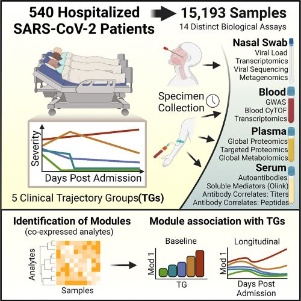

# Multi-omic longitudinal study reveals immune correlates of clinical course among hospitalized COVID-19 patients

---

This repository consists of code used for the analysis, figures and tables published in the article:

Joann Diray-Arce, Slim Fourati, Naresh Doni Jayavelu, Ravi Patel, Cole Maguire, Ana C. Chang, Ravi Dandekar, Jingjing Qi, Brian Lee, Patrick van Zalm, Andrew Schroeder, Ernie Chen, Anna Konstorum, Anderson Brito, Jeremy P. Gygi, Alvin Kho, Jing Chen, Shrikant Pawar, Ana Silvia Gonzalez-Reiche, Annmarie Hoch, Carly E. Milliren, James A. Overton, Kerstin Westendorf, IMPACC Network, Charles B. Cairns, Nadine Rouphael, Steven Bosinger, Seunghee Kim-Schulze, Florian Krammer, Lindsey Rosen, Nathan Grubaugh, Harm van Bakel, Michael Wilson, Jayant Rajan, Hanno Steen, Walter Eckalbar, Chris Cotsapas, Charles R. Langelier, Ofer Levy, Matthew C. Altman, Holden Maecker, Ruth R. Montgomery, Elias K. Haddad, Rafick P. Sekaly, Denise Esserman, Al Ozonoff, Patrice M. Becker, Alison D. Augustine, Leying Guan, Bjoern Peters, Steven H. Kleinstein. **"Multi-omic longitudinal study reveals immune correlates of clinical course among hospitalized COVID-19 patients".** Cell Reports Medicine (2023).

Manuscript with supplemental figures can be downloaded [here](https://doi.org/10.1016/j.xcrm.2023.101079).

All code files related to this manuscript are standardized and organized by Ravi Patel, [UCSF](https://profiles.ucsf.edu/ravi.patel) | [ORCiD](https://orcid.org/0000-0001-5203-899X)

 

## Instructions

Please use the table in the [Figures.Tables_Code_Key.pdf](Figures.Tables_Code_Key.pdf) file to determine the code used for specific figures and tables.

 

### Prerequisites:
* Computable matrices from [ImmPort (ID:SDY1760)](https://www.immport.org/shared/study/SDY1760)
* Databases
    * [COVID-19 Drug and GeneSet Library](https://maayanlab.cloud/covid19/) from Maayan Lab - already included in `external_databases`
    * [ImmuneXpresso](http://immuneexpresso.org/immport-immunexpresso/public/immunexpresso/search#) - see instructions below
* R packages. Please see [r_package_list.txt](r_package_list.txt) for the list of required R packages and install them.

 

### Usage instructions:
1. Download the raw and processed data files from ImmPort (ID:SDY1760), decompress the data and specify the absolute path of the _processed data_ folder, containing assay directories (e.g. bld-cytof, bld-gwas, metabolomics, etc.), in `Codebase/config.txt`. 
For example: 
    1. place the processed data in `/path/of/your/choosing/processed-data` and the raw data in `/path/of/your/choosing/raw-data`, where `/path/of/your/choosing/` is any path on your system where you want to save the ImmPort data. 
    2. Specify `/path/of/your/choosing/processed-data` in `Codebase/config.txt` as a value of `data_base_dir` key.
2. Use the Rmarkdown file in a given assay directory for the data analysis, for example [bld-cytof/src/bld_cytof.Rmd](bld-cytof/src/bld_cytof.Rmd). These Rmarkdowns are expected to run the whole analysis pipeline for the assay once the data and databases are set up correctly.

 

### Download ImmuneXpresso
Go to http://immuneexpresso.org/immport-immunexpresso/public/immunexpresso/search#, click on "Search immuneXpresso" without any search term, and export the results to `external_databases/ImmuneXpressoResults.csv` file. Make sure to use this exact file name.

 

### Terms of Use

By using this software, you agree this software is to be used for research purposes only. Any presentation of data analysis using the software will acknowledge the software according to the guidelines below. 

Primary author(s): Joann Diray-Arce (joann DOT arce AT childrens DOT harvard DOT edu)

Organizational contact information: Steven H. Kleinstein (steven DOT kleinstein AT yale DOT edu)

Date of release: June 08, 2023

Version: 1.0 

License details: GNU AFFERO GENERAL PUBLIC LICENSE (see the [LICENSE file](LICENSE))

Description: scripts used to generate figures and tables in the above publication

 

### Disclaimer

A review of this code has been conducted, no critical errors exist, and to the best of the authors knowledge, no local system configuration details, and no passwords or keys included in this code. This open source software comes as is with absolutely no warranty.

