Metabolomics and WGCNA analysis
================
06 June, 2023

### Load libraries

``` r
suppressPackageStartupMessages(library(package = "knitr"))
suppressPackageStartupMessages(library(package = "impute"))
suppressPackageStartupMessages(library(package = "igraph"))
suppressPackageStartupMessages(library(package = "ggnetwork"))
suppressPackageStartupMessages(library(package = "ordinal"))
suppressPackageStartupMessages(library(package = "qvalue"))
suppressPackageStartupMessages(library(package = "ggbeeswarm"))
suppressPackageStartupMessages(library(package = "ggeffects"))
suppressPackageStartupMessages(library(package = "pvca"))
suppressPackageStartupMessages(library(package = "GSA"))
suppressPackageStartupMessages(library(package = "lme4"))
suppressPackageStartupMessages(library(package = "nlme"))
suppressPackageStartupMessages(library(package = "tidyverse"))
suppressPackageStartupMessages(library(package = "openxlsx"))
suppressPackageStartupMessages(library(package = "data.table"))
suppressPackageStartupMessages(library(package = "e1071"))
suppressPackageStartupMessages(library(package = "MetaboAnalystR"))

# set session options
options(show_col_types = FALSE)
VarCorr <- lme4::VarCorr
```

### Load codebase.R, load data matrices and set path to local output directory

``` r
# load codebase.R, olink data and clinical information
source("../../Codebase/codebase_v2.R")
#library(dplyr)
data_env <- load_IMPACC_datasets(DATA_VERSION                = "2022-01-01", 
                                 KEEP_COVID19_POS            = TRUE, 
                                 FILTER_BY_CORE_ASSAY_COHORT = TRUE,
                                 ASSAY_NAMES = "plasma_metabolomics_global")
#data_env <- readRDS("~/data_env.rds")
for (n in grep(pattern = "metabolomics|clinical_data", 
               names(data_env), 
               value   = TRUE)) {
  assign(n, value = data_env[[n]])
}

# load omic datasets with healthy control
#data_env_withHC <- load_IMPACC_datasets(DATA_VERSION                = "2022-01-01", 
#                                        KEEP_COVID19_POS            = FALSE, 
#                                        FILTER_BY_CORE_ASSAY_COHORT = FALSE,
#                                        ASSAY_NAMES = "metabolomics")


# Setup the assay specific output directory
out_dir <- "../output"

# files are not loaded by load_IMPACC_datasets

#path <- "../files/plasma_metabolomics_global_phase1_2_merged.xlsx"
#batch_layout <- read.csv(file =
#"../files/STEEN_Phase1and2_5_6_2021.csv")
#sam_2 <-  read.csv("../files/Metabolon_SampleManifest_IMPACC-Phase2_04_06_2021.csv")
```

### Functions: model\_loop

``` r
model_loop <- function(inputDF, modelType = "lme", age_sex =TRUE, knots = c(1, 4, 7, 14, 21),
                       endpoint = "trajectory_group", old_p_corrections = FALSE){
  inputDF$participant_id = as.factor(inputDF$participant_id )
  if(modelType == "smoothSpline"){
    inputDF$event_date_transformed = inputDF$event_date
    lmDF <- mgcv_global(inputDF, endpoint, age_sex = age_sex)
    lmDF$name <- rownames(lmDF)
    ## Because of the pairwise function requires there to be a column for "name"
    ## the rownames are copied to a new column here, ultimately this column is removed
  } else {
    lmDF <- inputDF %>%
      group_by(name) %>% 
      do(p.slope = {
        if(modelType == "lme"){
          if(age_sex){
            fit <- try(lme(fixed = as.formula(paste0("value ~ event_date * ", endpoint,
                            "+sex+discretized_admit_age_quantile+event_location")), data = .,
                           random =  ~1|enrollment_site/participant_id))
          } else{
            fit <- try(lme(fixed = as.formula(paste0("value ~ event_date * ", endpoint)), data = .,
                           random =  ~1|enrollment_site/participant_id))
          }
        } else if (modelType == "fixedKnots"){
          if(age_sex){
            fit <- try(lme(fixed = as.formula(paste0("value ~ splines::bs(event_date, 
                             knots =c(",paste(knots, collapse = ',') ,")) * ", endpoint,
                             "+sex+discretized_admit_age_quantile+event_location")), 
                           data = .,random =  ~1|enrollment_site/participant_id))
          } else{
            fit <- try(lme(fixed = as.formula(paste0("value ~ splines::bs(event_date, 
                             knots =c(",paste(knots, collapse = ',') ,")) * ", endpoint)), 
                           data = .,random =  ~1|enrollment_site/participant_id))
          }
        }
        if(class(fit)[1]!="try-error"){
            idx <- nrow(anova(fit))
            result = (anova(fit)$"p-value")[idx]
        } else {
          result = NA
        }
      }, 
      p.intercept = {
        if(modelType == "lme"){
          if(age_sex){
            fit <- try(lme(fixed = as.formula(paste0("value ~ event_date * ", endpoint,
                                                     "+sex+discretized_admit_age_quantile+event_location")), data = .,
                           random =  ~1|enrollment_site/participant_id))
          } else{
            fit <- try(lme(fixed = as.formula(paste0("value ~ event_date * ", endpoint)), data = .,
                           random =  ~1|enrollment_site/participant_id))
          }
        } else if (modelType == "fixedKnots"){
          if(age_sex){
            fit <- try(lme(fixed = as.formula(paste0("value ~ splines::bs(event_date, 
                             knots =c(",paste(knots, collapse = ',') ,")) * ", endpoint,
                                                     "+sex+discretized_admit_age_quantile+event_location")), 
                           data = .,random =  ~1|enrollment_site/participant_id))
          } else{
            fit <- try(lme(fixed = as.formula(paste0("value ~ splines::bs(event_date, 
                             knots =c(",paste(knots, collapse = ',') ,")) * ", endpoint)), 
                           data = .,random =  ~1|enrollment_site/participant_id))
          }
          
        }
        if(class(fit)[1]!="try-error"){
          result = (anova(fit)$"p-value")[3] #trajectory_group is position 3
        }else{
          result = NA
        }
      },
      p.intercept.sex = {
        if(age_sex){
          if(modelType == "lme"){
              fit <- try(lme(fixed = as.formula(paste0("value ~ event_date * ", endpoint,
                                                       "+sex+discretized_admit_age_quantile+event_location")), data = .,
                             random =  ~1|enrollment_site/participant_id))
          } else if (modelType == "fixedKnots"){
              fit <- try(lme(fixed = as.formula(paste0("value ~ splines::bs(event_date, 
                             knots =c(",paste(knots, collapse = ',') ,")) * ", endpoint,
                                                       "+sex+discretized_admit_age_quantile+event_location")), 
                             data = .,random =  ~1|enrollment_site/participant_id))
          }
          if(class(fit)[1]!="try-error"){
            result = (anova(fit)$"p-value")[4] ## sex is position 4
          } else {
            result = NA
          }
        }
      },
      p.intercept.age.quantile = {
        if(age_sex){
          if(modelType == "lme"){
            fit <- try(lme(fixed = as.formula(paste0("value ~ event_date * ", endpoint,
                                                     "+sex+discretized_admit_age_quantile+event_location")), data = .,
                           random =  ~1|enrollment_site/participant_id))
          } else if (modelType == "fixedKnots"){
            fit <- try(lme(fixed = as.formula(paste0("value ~ splines::bs(event_date, 
                             knots =c(",paste(knots, collapse = ',') ,")) * ", endpoint,
                                                     "+sex+discretized_admit_age_quantile+event_location")), 
                           data = .,random =  ~1|enrollment_site/participant_id))
          }
          if(class(fit)[1]!="try-error"){
            result = (anova(fit)$"p-value")[5] ## discretized_admit_age_quantile is position 4
          } else {
            result = NA
          }
        }
      }
      ) %>% ungroup() %>%
      mutate(p.slope = unlist(p.slope),
             p.intercept  = unlist(p.intercept),
             p.intercept.sex  = unlist(p.intercept.sex),
             p.intercept.age.quantile  = unlist(p.intercept.age.quantile),
      ) %>% as.data.frame()
    lmDF$adjp.intercept=qvalue::qvalue(lmDF$p.intercept, fdr.level = 0.05, pi0 = 1)$qvalues
    lmDF$adjp.slope=qvalue::qvalue(lmDF$p.slope, fdr.level = 0.05, pi0 = 1)$qvalues
    lmDF$adjp.intercept.sex=qvalue::qvalue(lmDF$p.intercept.sex, fdr.level = 0.05, pi0 = 1)$qvalues
    lmDF$adjp.intercept.age.quantile=qvalue::qvalue(lmDF$p.intercept.age.quantile, fdr.level = 0.05, pi0 = 1)$qvalues
  }
  
  message("\n Initial calculation of p.slope and p.intercept complete. Beginning pairwise comparisons.")
  #### Pairwise comparisons #### 
  ## Loop the pairwise comparisons ##
  for(i in seq_along(rownames(lmDF))){ 
    if(age_sex){
      tmp.out = matrix(NA,ncol = ncol(combn(unique(inputDF[[endpoint]]), 2)), nrow =4)
    }else{tmp.out = matrix(NA,ncol = ncol(combn(unique(inputDF[[endpoint]]), 2)), nrow =2)}
    
    try(
      if(modelType == "lme"){
        tmp.out <- pairwise_lme_modeling(inputDF[inputDF$name == lmDF$name[i],],
                                         variable = endpoint, fixedKnots = F)
      } else if(modelType == "fixedKnots"){
        tmp.out <- pairwise_lme_modeling(inputDF[inputDF$name == lmDF$name[i],],
                                         variable = endpoint, fixedKnots = T, knots = knots)
      } else if (modelType == "smoothSpline"){
        tmp.out <- pairwise_mgcv_modeling(inputDF[inputDF$name == lmDF$name[i],],
                                          variable = endpoint)
      })
    if(age_sex){
      if(i==1){
        values.out <- c(tmp.out[1,], tmp.out[2,], tmp.out[3,], tmp.out[4,])
        names(values.out) <- c(paste0(rownames(tmp.out)[1],"_", colnames(tmp.out[,1:ncol(tmp.out), drop=FALSE])),
                               paste0(rownames(tmp.out)[2],"_", colnames(tmp.out[,1:ncol(tmp.out), drop=FALSE])),
                               paste0(rownames(tmp.out)[3],"_", colnames(tmp.out[,1:ncol(tmp.out), drop=FALSE])),
                               paste0(rownames(tmp.out)[4],"_", colnames(tmp.out[,1:ncol(tmp.out), drop=FALSE])))
      } else {
        values.out <- rbind(values.out, c(tmp.out[1,], tmp.out[2,], tmp.out[3,], tmp.out[4,]))
      }
    }else{
      if(i==1){
        values.out <- c(tmp.out[1,], tmp.out[2,])
        names(values.out) <- c(paste0(rownames(tmp.out)[1],"_", colnames(tmp.out[,1:ncol(tmp.out), drop=FALSE])),
                               paste0(rownames(tmp.out)[2],"_", colnames(tmp.out[,1:ncol(tmp.out), drop=FALSE])))
      } else {
        values.out <- rbind(values.out, c(tmp.out[1,], tmp.out[2,]))
      }
    }
    
  }
  ## Change to use qvalue like in tidyr loop
  if(old_p_corrections){
    p.slope.adj <- apply(values.out[,grepl("p.slope", colnames(values.out)), drop=FALSE], 2, function(x){
      qvalue::qvalue(x, fdr.level = 0.05, pi0 = 1)$qvalues
    })
    
    p.intercept.adj <- apply(values.out[,grepl("p.intercept", colnames(values.out)), drop=FALSE], 2, function(x){
      qvalue::qvalue(x, fdr.level = 0.05, pi0 = 1)$qvalues
    })
  } else {
    p.slope.adj <- as.data.frame(values.out[,grepl("p.slope", colnames(values.out)), drop=FALSE])
    p.slope.adj <- qvalue::qvalue(as.vector(p.slope.adj), fdr.level = 0.05, pi0 = 1)$qvalues
    p.intercept.adj <- as.data.frame(values.out[,grepl("p.intercept", colnames(values.out)), drop=FALSE])
    p.intercept.adj <- qvalue::qvalue(as.vector(p.intercept.adj), fdr.level = 0.05, pi0 = 1)$qvalues
  }
  colnames(p.slope.adj) <- gsub("_", ".adj_", colnames(p.slope.adj))
  colnames(p.intercept.adj) <- gsub("_", ".adj_", colnames(p.intercept.adj))
  
  lmDF_pairwise <- as.data.frame(cbind(lmDF, values.out, p.slope.adj, p.intercept.adj))
  rownames(lmDF_pairwise) <- lmDF_pairwise$name
  lmDF_pairwise <- lmDF_pairwise[,colnames(lmDF_pairwise) != "name"]
  return(lmDF_pairwise)
}
generate_WGCNA_modules <-
  function(data_df,
           networkType = "signed",
           power = NULL,
           minModuleSize = NULL,
           reassignThreshold = 1e-6,
           mergeCutHeight = 0.15,
           minKMEtoStay = 0.3,
           minCoreKME = 0.5,
           corType = "bicor",
           maxPOutliers = 0.1,
           assay_alias = NULL,   ### Append this assay_alias to the module names as prefix.
           includ_grey_in_plots = TRUE,
           plot_heatmap = TRUE,
           ...) {
    
    #### Load packages necessary for data loading and processing purpose
    load_packages(c(packages, packages_WGCNA))

    if( is.null( c(power, minModuleSize) ) ) {
      cat("ERROR:: Provide values for both power and minModuleSize parameters\n")
      return()
    }
    
    ## Network construction 
    net = blockwiseModules(
    data_df,
    power = power,
    networkType = networkType,
    TOMType = "unsigned",
    minModuleSize = minModuleSize,
    reassignThreshold = reassignThreshold,
    mergeCutHeight = mergeCutHeight,
    numericLabels = TRUE,
    pamRespectsDendro = FALSE,
    minKMEtoStay = minKMEtoStay,
    minCoreKME = minCoreKME,
    corType = corType,
    verbose = 3,
    maxPOutliers = maxPOutliers,
    ...
  )
  
  # Convert labels to colors for plotting
  mergedColors = labels2colors(net$colors)
  module_labels = paste0("mod",net$colors) %>% setNames(names(net$colors))
  module_color_key = labels2colors(unique(net$colors)) %>% setNames(paste0("mod",unique(net$colors)))
  # Plot the dendrogram and the module colors underneath
  plotDendroAndColors(
    net$dendrograms[[1]],
    mergedColors[net$blockGenes[[1]]],
    "Module colors",
    dendroLabels = FALSE,
    hang = 0.03,
    addGuide = TRUE,
    guideHang = 0.05
  )
  
  if( ! is.null(assay_alias) ) {
    module_labels = paste0(assay_alias, "_", module_labels)
    module_color_key = labels2colors(unique(net$colors)) %>% setNames(paste0(assay_alias, "_","mod",unique(net$colors)))
  }
  
  # Recalculate MEs with module labels
  MEs = moduleEigengenes(data_df, module_labels)$eigengenes
  colnames(MEs) = gsub("^ME","",colnames(MEs))
  #MEs = orderMEs(MEs)
  
  module_membership = data.frame( feature = colnames(data_df), module = module_labels )
  
  if(plot_heatmap) {
    trajectory_group = clinical_data %>% dplyr::slice( match( row.names(data_df), clinical_data$sample_id ) ) %>% pull(trajectory_group)
    
    non_grey_data = data_df[,! grepl("mod0", module_membership$module)]
    data_for_plot = non_grey_data
    module_for_plot = module_membership$module[ ! grepl("mod0", module_membership$module) ]
    if(includ_grey_in_plots) {
      data_for_plot = data_df
      module_for_plot = module_membership$module
    }
    data_for_plot = apply(data_for_plot, 2, scale) %>% `rownames<-`(rownames(data_for_plot))
    p <-
      Heatmap(
      data_for_plot, 
      column_title_rot = 90,
      column_title_gp = gpar(fontsize=10),
      column_split = module_for_plot,
      show_column_names = FALSE,
      show_row_names = FALSE,
      left_annotation = rowAnnotation( TG = trajectory_group, col=list(TG = brewer.greens(5) %>% setNames(1:5) ) ),
      top_annotation = columnAnnotation( modules = module_for_plot, col=list(modules = module_color_key ) )
      )
    draw(p, padding = unit(c(2, 2, 15, 5), "mm"))
    #print(p)

  p2 <- 
    Heatmap(
      t(data_for_plot),
      column_title_rot = 90,
      column_title_gp = gpar(fontsize=10),
      row_names_gp = gpar(fontsize=6),
      column_split = trajectory_group,
      show_column_names = FALSE,
      top_annotation = columnAnnotation( TG = trajectory_group, col=list(TG = brewer.greens(5) %>% setNames(1:5) ) ),
      left_annotation = rowAnnotation( modules = module_for_plot, col=list(modules = module_color_key ) )
    )
  
  draw(p2, padding = unit(c(2, 2, 15, 5), "mm"))
  #print(p)
  }
  
  colnames(MEs) = gsub("^ME", "", colnames(MEs))
  
  print("Note: mod0 = 'grey' module")
  
  return( 
          list( 
            module_membership = module_membership, 
            MEs = MEs,  
            p1 = p
            ) 
          )
}
PVCA <- function(counts, meta, threshold, inter){
#counts = tmet
#            meta = pdata
#            inter = FALSE
#            threshold = 0.6
  counts.center <- t(apply(counts, 1, scale, center=TRUE, scale=FALSE))
  cor.counts <- cor(counts.center)
  dim(cor.counts)
  eigen.counts <- eigen(cor.counts)
  eigen.mat <- eigen.counts$vectors
  eigen.val <- eigen.counts$values
  n.eigen <- length(eigen.val)
  eigen.val.sum <- sum(eigen.val)
  percents.pcs <- eigen.val/eigen.val.sum
  meta <- as.data.frame(meta)

  all <- 0
  npc.in <- 0
  for(i in 1:n.eigen){
    all <- all + percents.pcs[i]
    npc.in <- npc.in + 1
    if(all > threshold){break}
  }
  if (npc.in < 3) {npc <- 3}

  pred.list <- colnames(meta)
  meta <- droplevels(meta)

  n.preds <- ncol(meta) + 1
  if(inter) {n.preds <- n.preds + choose(ncol(meta),2)}

  ran.pred.list <- c()
  for(i in 1:ncol(meta)){
    ran.pred.list <- c(ran.pred.list, paste0("(1|", pred.list[i],")"))
  }
  ##interactions
  if(inter){
    for(i in 1:(ncol(meta)-1)){
      for(j in (i+1):ncol(meta)){
        ran.pred.list <- c(ran.pred.list, paste0("(1|", pred.list[i], ":", pred.list[j], ")"))
        pred.list <- c(pred.list, paste0(pred.list[i], ":", pred.list[j]))
      }
    }
  }
  formula <- paste(ran.pred.list, collapse = " + ")
  formula <- paste("pc", formula, sep=" ~ ")
  ran.var.mat <- NULL
  for(i in 1:npc.in){
    dat <- cbind(eigen.mat[,i],meta)
    colnames(dat) <- c("pc",colnames(meta))
    Rm1ML <- lme4::lmer(formula, dat, REML = TRUE, verbose = FALSE, na.action = na.omit)
    var.vec <- unlist(VarCorr(Rm1ML))
    ran.var.mat <- rbind(ran.var.mat, c(var.vec[pred.list], resid = sigma(Rm1ML)^2))
  }
  ran.var.mat.std <- ran.var.mat/rowSums(ran.var.mat)
  wgt.vec <- eigen.val/eigen.val.sum
  prop.var <- colSums(ran.var.mat.std*wgt.vec[1:npc.in])
  std.prop.var <- prop.var/sum(prop.var)
  std.prop.var
}
```

### Panel A code

``` r
library (flashClust)

set.seed (123)
# sft_tuned may fail sometimes.
#sft_tuned = tune_soft_threshold_WGCNA(data_df = plasma_metabolomics_global_counts,
#           networkType = "signed", corFnc = "bicor", powers =c(100:200)/10)

sft_tuned = tune_soft_threshold_WGCNA(data_df = plasma_metabolomics_global_counts,
           networkType = "signed", corFnc = "bicor", powers =c(c(1:10), seq(from = 12, to=20, by=2)))
```

    ## Warning: executing %dopar% sequentially: no parallel backend registered

    ## Warning in (function (x, y = NULL, robustX = TRUE, robustY = TRUE, use =
    ## "all.obs", : bicor: zero MAD in variable 'x'. Pearson correlation was used for
    ## individual columns with zero (or missing) MAD.

    ## Warning in (function (x, y = NULL, robustX = TRUE, robustY = TRUE, use =
    ## "all.obs", : bicor: zero MAD in variable 'y'. Pearson correlation was used for
    ## individual columns with zero (or missing) MAD.

``` r
# wgcna
wgcnaRes <- generate_WGCNA_modules(
                   data_df = plasma_metabolomics_global_counts, 
                   # Preprocessed data in data.frame class
                   networkType = "signed",     
                   # Indicate the type of network to construct
                   power = sft_tuned$powerEstimate,              
                   # Provide a power value chosen from the first step, this parameter is mandatory.
                   minModuleSize = 5,      
                   # Provide a value for the minimum number of features a module can have; use a larger value (> 30) for datasets with thousands of features, and a smaller value otherwise.
                   corType = "bicor",         
                   # Correlation function
                   maxPOutliers = 0.1, 
                   # It is safer to use a smaller value for this parameter when corType = bicor is used.
                   assay_alias = "globalmet",         
                   # Append this assay_alias to the module names as prefix.
                   reassignThreshold = 1e-6,   
                   # This and rest of the parameters use default values, but users may want to tweak them based on the assay type and data.
                   mergeCutHeight = 0.05,
                   minKMEtoStay = 0.5,
                   minCoreKME = 0.1)   
```

    ## Warning in bicor(structure(c(0.278683355, 0.1470455, -1.260648292,
    ## 0.573065067, : bicor: zero MAD in variable 'x'. Pearson correlation was used for
    ## individual columns with zero (or missing) MAD.

    ## Warning in bicor(structure(c(0.27936213, 0.514084513, 0.149803877,
    ## 0.678479014, : bicor: zero MAD in variable 'x'. Pearson correlation was used for
    ## individual columns with zero (or missing) MAD.

    ## Warning in bicor(structure(c(0.393954919, 0.414145424, -0.446282102,
    ## -0.250773812, : bicor: zero MAD in variable 'x'. Pearson correlation was used
    ## for individual columns with zero (or missing) MAD.

    ## Warning in bicor(structure(c(0.645864036, -0.356253433, 0.968935091,
    ## 0.235146284, : bicor: zero MAD in variable 'x'. Pearson correlation was used for
    ## individual columns with zero (or missing) MAD.

    ## Warning in bicor(structure(c(0.459210039, 0.145550359, 0.738657347,
    ## 0.550874049, : bicor: zero MAD in variable 'x'. Pearson correlation was used for
    ## individual columns with zero (or missing) MAD.

    ## Warning in bicor(structure(c(1.050286255, 0.118010001, 0.283047916,
    ## -0.827576924, : bicor: zero MAD in variable 'x'. Pearson correlation was used
    ## for individual columns with zero (or missing) MAD.

    ## Warning in bicor(structure(c(-0.213305232, 0.700025048, 1.013386861,
    ## 1.649375496, : bicor: zero MAD in variable 'x'. Pearson correlation was used for
    ## individual columns with zero (or missing) MAD.

    ## Warning in bicor(structure(c(0.615456232, -1.316520695, 0.768394534,
    ## -0.256486126, : bicor: zero MAD in variable 'x'. Pearson correlation was used
    ## for individual columns with zero (or missing) MAD.

    ## Warning in bicor(structure(c(0.852727447, -0.46929082, 0.054646753,
    ## 0.268682358, : bicor: zero MAD in variable 'x'. Pearson correlation was used for
    ## individual columns with zero (or missing) MAD.

    ## Warning in bicor(structure(c(-0.662497729, -0.548449724, 0.124864491,
    ## -0.615321987, : bicor: zero MAD in variable 'x'. Pearson correlation was used
    ## for individual columns with zero (or missing) MAD.

    ## Warning in bicor(structure(c(0.233943508, 1.816234614, -1.789224438,
    ## 0.405456179, : bicor: zero MAD in variable 'x'. Pearson correlation was used for
    ## individual columns with zero (or missing) MAD.

    ## Warning in bicor(structure(c(0.808630158, 0.911576993, 0.719844998,
    ## 0.315334179, : bicor: zero MAD in variable 'x'. Pearson correlation was used for
    ## individual columns with zero (or missing) MAD.

    ## Warning in bicor(structure(c(-0.950451962, 0.160418478, -1.002530676,
    ## 0.092219396, : bicor: zero MAD in variable 'x'. Pearson correlation was used for
    ## individual columns with zero (or missing) MAD.

    ## Warning in bicor(structure(c(-0.049122834, 0.119116372, 0.364605373,
    ## -0.328500871, : bicor: zero MAD in variable 'x'. Pearson correlation was used
    ## for individual columns with zero (or missing) MAD.

    ## Warning in (function (x, y = NULL, robustX = TRUE, robustY = TRUE, use =
    ## "all.obs", : bicor: zero MAD in variable 'x'. Pearson correlation was used for
    ## individual columns with zero (or missing) MAD.

``` r
#S_panel_G <- wgcnaRes$p1

#print(S_panel_G)
#pdf(file.path(out_dir, "suppl_G.pdf"), width=8, height = 8)
#print(S_panel_G)
#dev.off()
```

``` r
mat <- plasma_metabolomics_global_counts %>%
  scale()
columnAnnotDF <- 
  wgcnaRes$module_membership[match(colnames(mat), 
                                   table = 
                                     wgcnaRes$module_membership$feature), ] %>%
  remove_rownames() %>%
  column_to_rownames(var = "feature") 
columnAnnot <- 
  HeatmapAnnotation(df  = columnAnnotDF,
                    col = list(module = setNames(c("grey", 
                                                   standardColors()[1:41]),
                               nm     = 
                                 sort(unique(wgcnaRes$module_membership$module)))),show_annotation_name = FALSE)
rowAnnotDF <- clinical_data %>%
  dplyr::select(sample_id, trajectory_group) %>%
  mutate(trajectory_group = paste0("TG", trajectory_group)) %>%
  .[match(rownames(mat), table = .$sample_id), ] %>%
  `rownames<-`(NULL) %>%
  column_to_rownames(var = "sample_id") 
names(rowAnnotDF)[1] <- "TG"
rowAnnot <- rowAnnotation(df  = rowAnnotDF,
                          col = list(TG = c("TG1" = "#639A21",
                                                          "TG2" = "#39828C",
                                                          "TG3" = "#6371AD", 
                                                          "TG4" = "#BD7D31",
                                                          "TG5" = "#9C3418")),
                          show_annotation_name = FALSE)
set.seed(seed = 1)
heatmap = Heatmap(matrix            = mat,
        left_annotation   = rowAnnot,
        top_annotation    = columnAnnot,
        column_split      = columnAnnotDF$module,
        row_split         = rowAnnotDF$TG,
        show_row_names    = FALSE,
        show_column_names    = FALSE,
        column_names_gp   = gpar(fontsize = 5),
        column_title_rot  = 90,
        name              = "z-score")

#print(heatmap)
S_panel_G <- heatmap

print(S_panel_G)
```

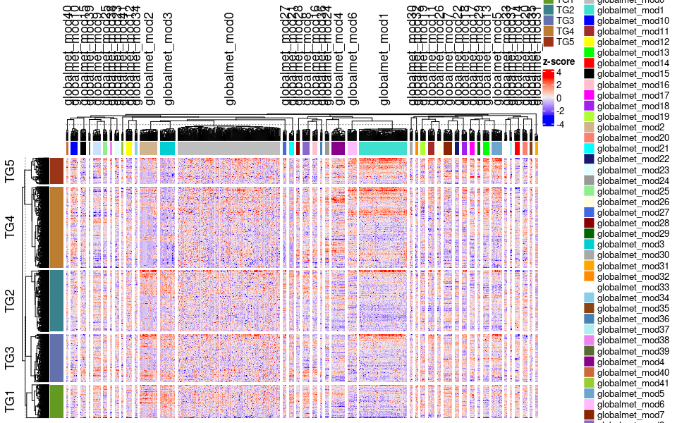<!-- -->

``` r
pdf(file.path(out_dir, "suppl_G.pdf"), width=12, height = 8)
print(S_panel_G)
dev.off()
```

    ## png 
    ##   2

### Panel A: output generation code

``` r
datExpr = plasma_metabolomics_global_counts

# Merge eigenvalues into original metabolite data file
eig <- merge (wgcnaRes$MEs, datExpr, by="row.names")
rownames (eig) <-eig$Row.names
eig$Row.names <- NULL

#write.csv(eig, "WGCNA_Eigenvalues.csv")

#############################################################
## Create list of metabolite members of each module
## For this analysis will not save module membership/p value

# Read in metabolic chemical names
annot = plasma_metabolomics_global_rowfeature

# add an "X" to the beginning of each metabolite ID
annot$X<-paste(rep("X"))
annot$met_ID<-paste(annot$X,annot$CHEM_ID, sep = "") 

probes = names(datExpr)
probes2annot = match(probes, annot$MET_ID)
# The following is the number or probes without annotation:
sum(is.na(probes2annot))
```

    ## [1] 0

``` r
# Should return 0.

# Create the starting data frame
metInfo0 = data.frame(met_ID = probes,
                      biochemical = annot$CHEMICAL_NAME[probes2annot],
                      INCHIKEY= annot$INCHIKEY[probes2annot],
                      PUBCHEM= annot$PUBCHEM[probes2annot],
                      SMILES= annot$SMILES[probes2annot],
                      SUPER_PATHWAY= annot$SUPER_PATHWAY[probes2annot],
                      SUB_PATHWAY= annot$SUB_PATHWAY[probes2annot],
                      CHEMSPIDER=annot$CHEMSPIDER[probes2annot],
                      HMDB=annot$HMDB[probes2annot],
                      KEGG=annot$KEGG[probes2annot],
                      PUBCHEM=annot$PUBCHEM[probes2annot],
                      moduleColor = wgcnaRes$module_membership$module)

# Order by module color
metInfo1 = metInfo0[order(metInfo0$moduleColor),]

# Save file
#write.csv(metInfo1, "/users/jarce/metabolomics/WGCNA_metabolite_modules.csv")
#write.csv(metInfo1, "WGCNA_metabolite_modules.csv")
metInfo1_new = metInfo1
metInfo1_new$moduleColor = factor(metInfo1_new$moduleColor)
metInfo1_new$moduleColor = fct_rev(metInfo1_new$moduleColor)
#metInfo1_new$SUPER_PATHWAY = factor(metInfo1_new$SUPER_PATHWAY)
metInfo1_new$SUPER_PATHWAY[metInfo1_new$SUPER_PATHWAY==''] <- NA
S_panel_H <- ggplot(metInfo1_new, aes(moduleColor)) + geom_bar(aes(fill = SUPER_PATHWAY)) + theme_classic () + theme(axis.text.x = element_text(size = 8, angle = 45, hjust = 1)) + theme (legend.position = "bottom") +  geom_text(stat='count', size=3, aes(label=..count..), vjust=-0.1) +
  guides(fill = guide_legend(ncol = 3)) + ylab ("metabolite count")+ xlab ("module number") + coord_flip () #+ scale_fill_manual(values = c("Amino Acid" = "#fed0ed",
                               #  "Carbohydrate" = "#f4d5fe",
                               #  "Cofactors and Vitamins" = "#d0e1ff",
                                # "Energy" = "#b3eaf6",
                               #    "Lipid" = "#b3ece2", 
                               #  "Nucleotide" = "#b3eac3",
                               #  "Partially Characterized Molecules" = "#dee5b3",
                              #     "Peptide" = "#f2deb3", "Xenobiotics" = "red"), na.value = "grey")

metInfo1_temp <- metInfo1
metInfo1_temp$moduleColor[metInfo1_temp$moduleColor == "globalmet_mod6"] <- "globalmet_mod6: Branched Chain Amino Acids"
#panelA <- ggplot(data=subset(metInfo1, moduleColor=="globalmet_mod6"), aes(x=reorder(SUB_PATHWAY, SUB_PATHWAY))) +xlab ("SUB_PATHWAY")+scale_fill_grey()+
panelA <- ggplot(data=subset(metInfo1_temp, moduleColor=="globalmet_mod6: Branched Chain Amino Acids"), aes(x=reorder(SUB_PATHWAY, SUB_PATHWAY))) +xlab ("SUB_PATHWAY")+scale_fill_grey()+
   # geom_bar(stat="count", position = "stack")
geom_bar(aes(fill = SUPER_PATHWAY), position = position_stack(reverse = TRUE)) + theme_bw()+ #+ geom_text(stat='count', size=4, aes(label=..count..), vjust=-0.1)+  
  theme(axis.text.x = element_text(size = 10, angle = 90, vjust=0.5, hjust=1),
        axis.text.y=element_text (size=10)) + 
theme(legend.position="bottom", legend.text = element_text(size=10), legend.title= element_text (size=10))+ facet_wrap (~moduleColor, ncol=8)+guides(fill=guide_legend(nrow=1,byrow=TRUE)) + scale_x_discrete(labels = c("Carnitine\nMetabolism", "Fatty Acid\n(Acyl Glycine)", "Fatty Acid\n(BCAA)", "Fatty Acid\nDihydroxy", "Gamma-glutamyl\nAmino Acid", "Glutamate\nMetabolism", "Histidine\nMetabolism","Leucine, Isoleucine\nValine Metabolism", "Lysine\nMetabolism", "Tryptophan\nMetabolism","Urea cycle;Arginine\nProline Metabolism")) +
  theme(strip.text.x = element_text(size = 15)) + theme(axis.title=element_text(size=10)) + theme(title=element_text(size = 10))

ggplot(data=subset(metInfo1, moduleColor=="globalmet_mod8"), aes(x=reorder(SUB_PATHWAY, SUB_PATHWAY))) +xlab ("SUB_PATHWAY")+scale_fill_grey(start=0.1, end=0.9)+
   # geom_bar(stat="count", position = "stack")
geom_bar(aes(fill = SUPER_PATHWAY), position = position_stack(reverse = TRUE)) + theme_bw()+ #+ geom_text(stat='count', size=4, aes(label=..count..), vjust=-0.1)+  
  theme(axis.text.x = element_text(size = 20, angle = 90, vjust=0.5, hjust=1),
        axis.text.y=element_text (size=16)) + 
theme(legend.position="bottom", legend.text = element_text(size=16))+ facet_wrap (~moduleColor, ncol=8) +guides(fill=guide_legend(nrow=1,byrow=TRUE)) +
  theme(strip.text.x = element_text(size = 15))
```

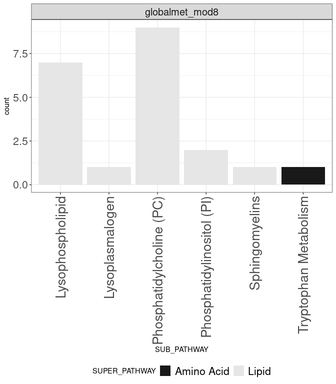<!-- -->

``` r
print(panelA)
```

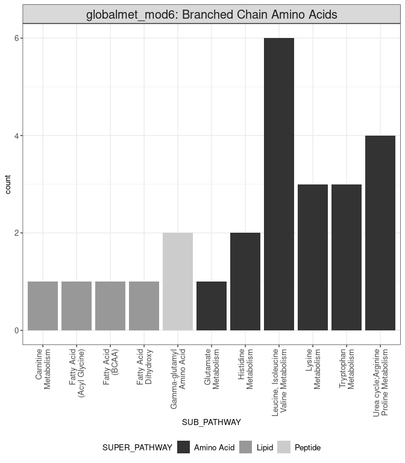<!-- -->

``` r
pdf(file.path(out_dir, "main_A.pdf"), width=8, height = 8)
print(panelA)
dev.off()
```

    ## png 
    ##   2

``` r
print(S_panel_H)
```

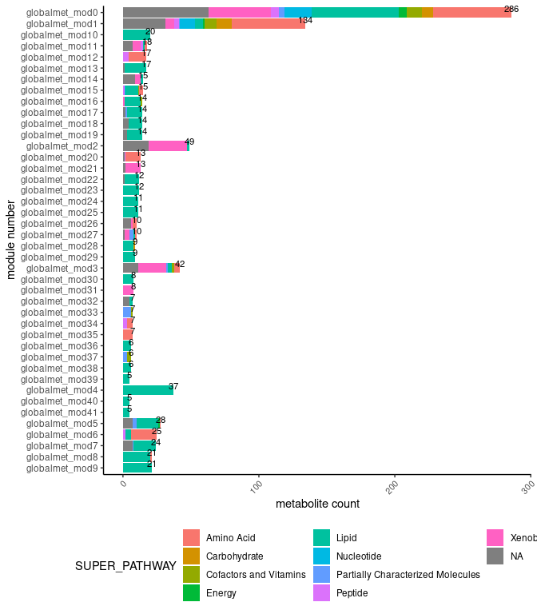<!-- -->

``` r
pdf(file.path(out_dir, "suppl_H.pdf"), width=8, height = 8)
print(S_panel_H)
dev.off()
```

    ## png 
    ##   2

\#Histidine smoth spline

``` r
# Histidine
Histidine_mets <- filter(plasma_metabolomics_global_rowfeature, plasma_metabolomics_global_rowfeature$SUB_PATHWAY == "Histidine Metabolism")

Histidine_count <- plasma_metabolomics_global_counts[,Histidine_mets$MET_ID]
colnames(Histidine_count) <- Histidine_mets$CHEMICAL_NAME

data_use <- Histidine_count %>%
  rownames_to_column(var = "sample_id") %>%
  merge(y  = dplyr::select(clinical_data, 
                    sample_id, 
                    event_date,
                    trajectory_group,
                    enrollment_site,
                    discretized_admit_age_quantile,
                    sex,
                    bmi,
                    participant_id,event_location),
        by = "sample_id") %>%
  filter(!is.na(trajectory_group)) %>%
  filter(duplicated(participant_id) | duplicated(participant_id, fromLast = TRUE)) %>%
  mutate_if(is.character, as.factor) %>%
  mutate(trajectory_group = factor(trajectory_group)) %>%
  pivot_longer(cols = -c("sample_id", "event_date", "participant_id",
                         "enrollment_site", "trajectory_group",
                         "discretized_admit_age_quantile", "sex", "bmi", "event_location")) %>%
  mutate(discretized_admit_age_quantile= factor(discretized_admit_age_quantile)) %>%
  filter(!is.na(value))
table(data_use$trajectory_group)
```

    ## 
    ##    1    2    3    4    5 
    ## 1276 3190 2420 4609 1375

``` r
library(ggbeeswarm)
my_comparisons = list(c(1,5), c(2,5), c(3,5),c(4,5))
plot_data_Histidine <- data_use %>%
  #rownames_to_column(var = "sample_id") %>%
  dplyr::select(sample_id, value, trajectory_group) %>%
  pivot_longer(cols = -c(sample_id, trajectory_group)) %>%
  mutate(name             = "Histidine Metabolism", #global_met8: 
         trajectory_group = paste0("TG", trajectory_group)) %>%
  ggplot(mapping = aes(x = trajectory_group, y = value)) +
  geom_beeswarm(mapping = aes(color = trajectory_group), cex = 0.2, size = 0.3) +
  geom_boxplot(fill = "transparent", outlier.color= "transparent") +
  facet_wrap(facets= ~name, ncol = 1) + 
  labs(y = "Value", x = "Clinical trajectory group") + #, tag = "E"
  scale_color_manual(values = c("TG1" = "#639A21",
                                "TG2" = "#39828C",
                                "TG3" = "#6371AD",
                                "TG4" = "#BD7D31",
                                "TG5" = "#9C3418")) +ggpubr::stat_compare_means(comparisons = my_comparisons, label = "p.signif")+
  theme_bw() +
  theme(legend.pos = "none", axis.title.x = element_text(size = 15)) + theme(axis.title=element_text(size=15), legend.title= element_text (size=15))+theme(strip.text.x = element_text(size = 13)) + theme(axis.text = element_text(size = 15))
#plot_data_Histidine
```

\#Lysine smoth spline

``` r
# Lysine
Lysine_mets <- filter(plasma_metabolomics_global_rowfeature, plasma_metabolomics_global_rowfeature$SUB_PATHWAY == "Lysine Metabolism")

Lysine_count <- plasma_metabolomics_global_counts[,Lysine_mets$MET_ID]
colnames(Lysine_count) <- Lysine_mets$CHEMICAL_NAME

data_use <- Lysine_count %>%
  rownames_to_column(var = "sample_id") %>%
  merge(y  = dplyr::select(clinical_data, 
                    sample_id, 
                    event_date,
                    trajectory_group,
                    enrollment_site,
                    discretized_admit_age_quantile,
                    sex,
                    bmi,
                    participant_id,event_location),
        by = "sample_id") %>%
  filter(!is.na(trajectory_group)) %>%
  filter(duplicated(participant_id) | duplicated(participant_id, fromLast = TRUE)) %>%
  mutate_if(is.character, as.factor) %>%
  mutate(trajectory_group = factor(trajectory_group)) %>%
  pivot_longer(cols = -c("sample_id", "event_date", "participant_id",
                         "enrollment_site", "trajectory_group",
                         "discretized_admit_age_quantile", "sex", "bmi", "event_location")) %>%
  mutate(discretized_admit_age_quantile= factor(discretized_admit_age_quantile)) %>%
  filter(!is.na(value))
table(data_use$trajectory_group)
```

    ## 
    ##    1    2    3    4    5 
    ## 1972 4930 3740 7123 2125

``` r
plot_data_Lysine <- data_use %>%
  #rownames_to_column(var = "sample_id") %>%
  dplyr::select(sample_id, value, trajectory_group) %>%
  pivot_longer(cols = -c(sample_id, trajectory_group)) %>%
  mutate(name             = "Lysine Metabolism", #global_met8: 
         trajectory_group = paste0("TG", trajectory_group)) %>%
  ggplot(mapping = aes(x = trajectory_group, y = value)) +
  geom_beeswarm(mapping = aes(color = trajectory_group), cex = 0.2, size = 0.3) +
  geom_boxplot(fill = "transparent", outlier.color= "transparent") +
  facet_wrap(facets= ~name, ncol = 1) + 
  labs(y = "Value", x = "Clinical trajectory group") + #, tag = "E"
  scale_color_manual(values = c("TG1" = "#639A21",
                                "TG2" = "#39828C",
                                "TG3" = "#6371AD",
                                "TG4" = "#BD7D31",
                                "TG5" = "#9C3418")) +ggpubr::stat_compare_means(comparisons = my_comparisons, label = "p.signif")+
  theme_bw() +
  theme(legend.pos = "none", axis.title.x = element_text(size = 15)) + theme(axis.title=element_text(size=15), legend.title= element_text (size=15))+theme(strip.text.x = element_text(size = 13)) + theme(axis.text = element_text(size = 15))
#plot_data_Lysine
```

\#Urea smoth spline

``` r
# Urea
Urea_mets <- filter(plasma_metabolomics_global_rowfeature, plasma_metabolomics_global_rowfeature$SUB_PATHWAY == "Urea cycle; Arginine and Proline Metabolism")

Urea_count <- plasma_metabolomics_global_counts[,Urea_mets$MET_ID]
colnames(Urea_count) <- Urea_mets$CHEMICAL_NAME

data_use <- Urea_count %>%
  rownames_to_column(var = "sample_id") %>%
  merge(y  = dplyr::select(clinical_data, 
                    sample_id, 
                    event_date,
                    trajectory_group,
                    enrollment_site,
                    discretized_admit_age_quantile,
                    sex,
                    bmi,
                    participant_id,event_location),
        by = "sample_id") %>%
  filter(!is.na(trajectory_group)) %>%
  filter(duplicated(participant_id) | duplicated(participant_id, fromLast = TRUE)) %>%
  mutate_if(is.character, as.factor) %>%
  mutate(trajectory_group = factor(trajectory_group)) %>%
  pivot_longer(cols = -c("sample_id", "event_date", "participant_id",
                         "enrollment_site", "trajectory_group",
                         "discretized_admit_age_quantile", "sex", "bmi", "event_location")) %>%
  mutate(discretized_admit_age_quantile= factor(discretized_admit_age_quantile)) %>%
  filter(!is.na(value))
table(data_use$trajectory_group)
```

    ## 
    ##    1    2    3    4    5 
    ## 2088 5220 3960 7542 2250

``` r
plot_data_Urea <- data_use %>%
  #rownames_to_column(var = "sample_id") %>%
  dplyr::select(sample_id, value, trajectory_group) %>%
  pivot_longer(cols = -c(sample_id, trajectory_group)) %>%
  mutate(name             = "Urea cycle", #global_met8: ; Arginine and Proline Metabolism
         trajectory_group = paste0("TG", trajectory_group)) %>%
  ggplot(mapping = aes(x = trajectory_group, y = value)) +
  geom_beeswarm(mapping = aes(color = trajectory_group), cex = 0.2, size = 0.3) +
  geom_boxplot(fill = "transparent", outlier.color= "transparent") +
  facet_wrap(facets= ~name, ncol = 1) + 
  labs(y = "Value", x = "Clinical trajectory group") + #, tag = "E"
  scale_color_manual(values = c("TG1" = "#639A21",
                                "TG2" = "#39828C",
                                "TG3" = "#6371AD",
                                "TG4" = "#BD7D31",
                                "TG5" = "#9C3418")) +ggpubr::stat_compare_means(comparisons = my_comparisons, label = "p.signif")+
  theme_bw() +
  theme(legend.pos = "none", axis.title.x = element_text(size = 15)) + theme(axis.title=element_text(size=15), legend.title= element_text (size=15))+theme(strip.text.x = element_text(size = 13)) + theme(axis.text = element_text(size = 15))
#plot_data_Urea
```

\#Tryptophan Metabolism

``` r
# Tryptophan
Tryptophan_mets <- filter(plasma_metabolomics_global_rowfeature, plasma_metabolomics_global_rowfeature$SUB_PATHWAY == "Tryptophan Metabolism")

Tryptophan_count <- plasma_metabolomics_global_counts[,Tryptophan_mets$MET_ID]
colnames(Tryptophan_count) <- Tryptophan_mets$CHEMICAL_NAME

data_use <- Tryptophan_count %>%
  rownames_to_column(var = "sample_id") %>%
  merge(y  = dplyr::select(clinical_data, 
                    sample_id, 
                    event_date,
                    trajectory_group,
                    enrollment_site,
                    discretized_admit_age_quantile,
                    sex,
                    bmi,
                    participant_id,event_location),
        by = "sample_id") %>%
  filter(!is.na(trajectory_group)) %>%
  filter(duplicated(participant_id) | duplicated(participant_id, fromLast = TRUE)) %>%
  mutate_if(is.character, as.factor) %>%
  mutate(trajectory_group = factor(trajectory_group)) %>%
  pivot_longer(cols = -c("sample_id", "event_date", "participant_id",
                         "enrollment_site", "trajectory_group",
                         "discretized_admit_age_quantile", "sex", "bmi", "event_location")) %>%
  mutate(discretized_admit_age_quantile= factor(discretized_admit_age_quantile)) %>%
  filter(!is.na(value))
table(data_use$trajectory_group)
```

    ## 
    ##    1    2    3    4    5 
    ## 2552 6380 4840 9218 2750

``` r
plot_data_Tryptophan <- data_use %>%
  #rownames_to_column(var = "sample_id") %>%
  dplyr::select(sample_id, value, trajectory_group) %>%
  pivot_longer(cols = -c(sample_id, trajectory_group)) %>%
  mutate(name             = "Tryptophan Metabolism", #global_met8: 
         trajectory_group = paste0("TG", trajectory_group)) %>%
  ggplot(mapping = aes(x = trajectory_group, y = value)) +
  geom_beeswarm(mapping = aes(color = trajectory_group), cex = 0.1, size = 0.3) +
  geom_boxplot(fill = "transparent", outlier.color= "transparent") +
  facet_wrap(facets= ~name, ncol = 1) + 
  labs(y = "Value", x = "Clinical trajectory group") + #, tag = "E"
  scale_color_manual(values = c("TG1" = "#639A21",
                                "TG2" = "#39828C",
                                "TG3" = "#6371AD",
                                "TG4" = "#BD7D31",
                                "TG5" = "#9C3418")) +ggpubr::stat_compare_means(comparisons = my_comparisons, label = "p.signif")+
  theme_bw() +
  theme(legend.pos = "none", axis.title.x = element_text(size = 15)) + theme(axis.title=element_text(size=15), legend.title= element_text (size=15))+theme(strip.text.x = element_text(size = 13)) + theme(axis.text = element_text(size = 15))
#plot_data_Tryptophan
```

``` r
S_panel_J <- ggarrange(plot_data_Histidine,plot_data_Lysine,plot_data_Urea,plot_data_Tryptophan,
          common.legend = TRUE, legend = "right", widths = c(1, 1,1,1),ncol = 4)
print(S_panel_J)
```

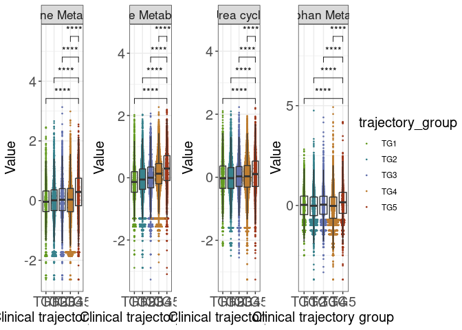<!-- -->

``` r
pdf(file.path(out_dir, "suppl_J.pdf"), width=8, height = 8)
print(S_panel_J)
dev.off()
```

    ## png 
    ##   2

### Module 8

``` r
data_use <- wgcnaRes$MEs %>%
  rownames_to_column(var = "sample_id") %>%
  merge(y  = dplyr::select(clinical_data, 
                    sample_id, 
                    event_type,
                    trajectory_group,
                    enrollment_site,
                    discretized_admit_age_quantile,
                    bmi,
                    sex),
        by = "sample_id") %>%
  filter(#event_type %in% "Visit 1" &
         !is.na(trajectory_group)) %>%
  mutate_if(is.character, as.factor) %>%
  mutate(trajectory_group = factor(trajectory_group)) %>%
  dplyr::select(-event_type) %>%
  column_to_rownames(var = "sample_id")

S_panel_I <- data_use %>%
  rownames_to_column(var = "sample_id") %>%
  dplyr::select(sample_id, globalmet_mod8, trajectory_group) %>%
  pivot_longer(cols = -c(sample_id, trajectory_group)) %>%
  mutate(name             = "globalmet_mod8: Phospholipids", #global_met8: 
         trajectory_group = paste0("TG", trajectory_group)) %>%
  ggplot(mapping = aes(x = trajectory_group, y = value)) +
  geom_beeswarm(mapping = aes(color = trajectory_group), cex = 1.5, size = 0.8) +
  geom_boxplot(fill = "transparent", outlier.color= "transparent") +
  facet_wrap(facets= ~name, ncol = 1) + 
  labs(y = "Eigenvalue", x = "Clinical trajectory group") + #, tag = "E"
  scale_color_manual(values = c("TG1" = "#639A21",
                                "TG2" = "#39828C",
                                "TG3" = "#6371AD",
                                "TG4" = "#BD7D31",
                                "TG5" = "#9C3418")) +ggpubr::stat_compare_means(comparisons = my_comparisons, label = "p.signif")+
  theme_bw() +
  theme(legend.pos = "none", axis.title.x = element_text(size = 15)) + theme(axis.title=element_text(size=15), legend.title= element_text (size=15))+theme(strip.text.x = element_text(size = 13)) + theme(axis.text = element_text(size = 15))
print(S_panel_I)
```

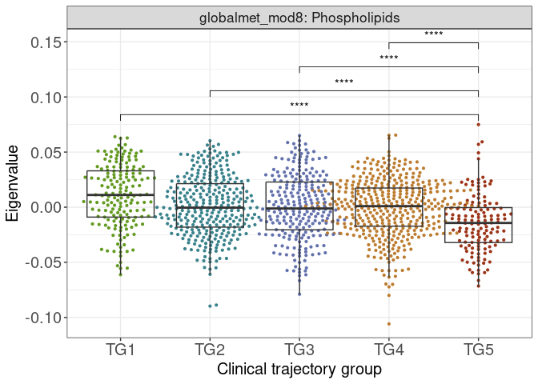<!-- -->

``` r
pdf(file.path(out_dir, "suppl_I.pdf"), width=8, height = 8)
print(S_panel_I)
dev.off()
```

    ## png 
    ##   2

``` r
library(ggplot2)
library(ggplotify)
library(pheatmap)
```

    ## 
    ## Attaching package: 'pheatmap'

    ## The following object is masked from 'package:ComplexHeatmap':
    ## 
    ##     pheatmap

``` r
library(patchwork)
```

    ## 
    ## Attaching package: 'patchwork'

    ## The following object is masked from 'package:cowplot':
    ## 
    ##     align_plots

``` r
S_panel_G_temp <- as.ggplot(S_panel_G)
Figures_3_2 = ggarrange(S_panel_H, S_panel_I, labels = c("H","I"))
Figures_3 <- ggarrange(S_panel_G_temp, Figures_3_2, S_panel_J,
          labels = c("G","","J"),
          ncol = 1, nrow = 3) ##15*22
```

### Panel B: analysis code

``` r
# subset the data to only get 'Visit 1'
data_use_visit1 <- wgcnaRes$MEs %>%
  rownames_to_column(var = "sample_id") %>%
  merge(y  = dplyr::select(clinical_data, 
                    sample_id, 
                    event_type,
                    trajectory_group,
                    enrollment_site,
                    discretized_admit_age_quantile,
                    bmi,
                    sex),
        by = "sample_id") %>%
  filter(event_type %in% "Visit 1" &
         !is.na(trajectory_group)) %>%
  mutate_if(is.character, as.factor) %>%
  mutate(trajectory_group = factor(trajectory_group)) %>%
  dplyr::select(-event_type) %>%
  column_to_rownames(var = "sample_id")

# a model with only intercept and random effect across sites
module_names <- grep(pattern = "met", names(data_use_visit1), value = TRUE)
res_table_ordinal <- NULL
data_use <- data_use_visit1
for (moduleName in module_names) {
  my.formula0 <- paste0('trajectory_group~ 1+(1|enrollment_site)+',
                        'discretized_admit_age_quantile+sex+bmi') 
  my.formula1 <- paste0('trajectory_group~',
                        moduleName,
                        '+(1|enrollment_site)+',
                        'discretized_admit_age_quantile+sex+bmi') 
  res <- mixed_ordinal(my.formula0, 
                       my.formula1,
                       data_use = data_use_visit1)
  coef(clmm(formula(my.formula1), 
            data = data_use_visit1))[moduleName] %>%
    unname() %>%
    c(res, coef = .) -> res
  res_table_ordinal <- rbind(res_table_ordinal, res)
}
rownames(res_table_ordinal) <- module_names
res_table_ordinal <- res_table_ordinal %>%
  as.data.frame() %>%
   mutate(qval =  qvalue::qvalue(pval, fdr.level = 0.05, pi0 = 1)$qvalues)
```

### Panel B: output generation code

``` r
visit1Mod6 <- data_use_visit1 %>%
  rownames_to_column(var = "sample_id") %>%
  dplyr::select(sample_id, globalmet_mod6, trajectory_group) %>%
  pivot_longer(cols = -c(sample_id, trajectory_group)) %>%
  mutate(name             = "globalmet_mod6: Branched Chain Amino Acids", #global_met6: 
         trajectory_group = paste0("TG", trajectory_group)) %>%
  ggplot(mapping = aes(x = trajectory_group, y = value)) +
  geom_beeswarm(mapping = aes(color = trajectory_group), cex = 1.5, size = 0.8) +
  geom_boxplot(fill = "transparent", outlier.color= "transparent") +
  facet_wrap(facets= ~name, ncol = 1) + 
  labs(y = "Eigenvalue", x = "Clinical trajectory group") + #, tag = "B"
  scale_color_manual(values = c("TG1" = "#639A21",
                                "TG2" = "#39828C",
                                "TG3" = "#6371AD",
                                "TG4" = "#BD7D31",
                                "TG5" = "#9C3418")) +
  theme_bw() +
  theme(legend.pos = "none", axis.title.x = element_text(size = 15)) + theme(axis.title=element_text(size=15), legend.title= element_text (size=15))+theme(strip.text.x = element_text(size = 13)) + theme(axis.text = element_text(size = 15)) + theme(title=element_text(size = 10))
print(visit1Mod6)
```

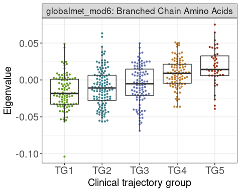<!-- -->

``` r
pdf(file.path(out_dir,"./main_B.pdf"), width=8, height = 8)
print(visit1Mod6)
dev.off()
```

    ## png 
    ##   2

### Panel C: analysis code

``` r
data_use <- wgcnaRes$MEs %>%
  rownames_to_column(var = "sample_id") %>%
  merge(y  = dplyr::select(clinical_data, 
                    sample_id, 
                    event_date,
                    trajectory_group,
                    enrollment_site,
                    discretized_admit_age_quantile,
                    sex,
                    bmi,
                    participant_id,event_location),
        by = "sample_id") %>%
  filter(!is.na(trajectory_group)) %>%
  filter(duplicated(participant_id) | duplicated(participant_id, fromLast = TRUE)) %>%
  mutate_if(is.character, as.factor) %>%
  mutate(trajectory_group = factor(trajectory_group)) %>%
  pivot_longer(cols = -c("sample_id", "event_date", "participant_id",
                         "enrollment_site", "trajectory_group",
                         "discretized_admit_age_quantile", "sex", "bmi", "event_location")) %>%
  mutate(discretized_admit_age_quantile= factor(discretized_admit_age_quantile)) %>%
  filter(!is.na(value))

## smooth spline takes a long time, demonstrating by cutting down to just ten factors
smooth_spline_model_loop <- model_loop(data_use, 
                                       modelType = "smoothSpline", 
                                       endpoint  = "trajectory_group")
```

### Panel C: output generation code

``` r
exampleDF <- data_use %>%
  filter(name %in% "globalmet_mod6") %>%
  mutate(trajectory_group = ordered(as.factor(as.character(trajectory_group)), 
                                    levels = c("1", "2", "3", "4", "5")))

plotExample <- plot_model(exampleDF, 
                          model_loop     = smooth_spline_model_loop, 
                          modelType      = "smoothSpline", 
                          p_adjust       = NA, 
                          endpoint       = "trajectory_group", 
                          signif_markers = FALSE,
                          remove_NS      = TRUE, 
                          bar_height     = 6.5)
```

    ## Warning: Using `size` aesthetic for lines was deprecated in ggplot2 3.4.0.
    ## ℹ Please use `linewidth` instead.
    ## This warning is displayed once every 8 hours.
    ## Call `lifecycle::last_lifecycle_warnings()` to see where this warning was
    ## generated.

    ## Warning: `aes_string()` was deprecated in ggplot2 3.0.0.
    ## ℹ Please use tidy evaluation ideoms with `aes()`
    ## This warning is displayed once every 8 hours.
    ## Call `lifecycle::last_lifecycle_warnings()` to see where this warning was
    ## generated.

``` r
plotMod6 <- plotExample$data %>%
  mutate(trajectory_group = paste0("TG", trajectory_group)) %>%
  ggplot(mapping = aes(x = event_date, y = value)) +
    geom_line(mapping = aes(group = participant_id, y = value), 
              color   = 'gray',
              alpha   = 0.4) +
    geom_line(mapping = aes(group = participant_id, y = yhat), 
              size    = 0.6, 
              alpha   = 0.5,
              color   = "black") +
    geom_point(mapping = aes(color = trajectory_group)) +
    geom_line(data    = mutate(get("pred", plotExample$plot_env),
                               trajectory_group = paste0("TG", 
                                                         trajectory_group)),
              mapping = aes(group = trajectory_group, y = predicted),
                           color = "black", size = 1.5) +
    facet_wrap(facets = ~trajectory_group, nrow = 1) +
    labs(y = "Eigenvalue",  x = "Days from admission") + #,  tag = "C"
    scale_color_manual(values= c("TG1"  = "#639A21",
                                 "TG2"  = "#39828C",
                                 "TG3"  = "#6371AD", 
                                 "TG4"  = "#BD7D31",
                                 "TG5"  = "#9C3418")) +
  coord_cartesian(xlim = c(0, 42)) +
  theme_bw() +
  theme(legend.pos = "none",
        panel.grid.minor = element_blank()) + theme(axis.title=element_text(size=15), legend.title= element_text (size=15))+theme(strip.text.x = element_text(size = 13)) + theme(axis.text = element_text(size = 15))

print(plotMod6)
```

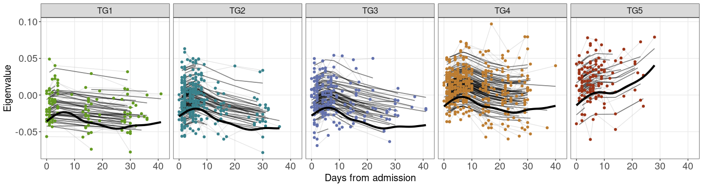<!-- -->

``` r
pdf(file.path(out_dir, "main_C.pdf"), width=8, height = 8) #5.5*9
print(plotMod6)
dev.off()
```

    ## png 
    ##   2

### Panel D: output generation code

``` r
metInfo1_temp <- metInfo1
metInfo1_temp$moduleColor[metInfo1_temp$moduleColor == "globalmet_mod8"] <- "globalmet_mod8: Phospholipids"
#panelD <- ggplot(data=subset(metInfo1, moduleColor=="globalmet_mod8"), aes(x=reorder(SUB_PATHWAY, SUB_PATHWAY))) +xlab ("SUB_PATHWAY")+scale_fill_grey(start=0.1, end=0.5)+
  panelD <- ggplot(data=subset(metInfo1_temp, moduleColor=="globalmet_mod8: Phospholipids"), aes(x=reorder(SUB_PATHWAY, SUB_PATHWAY))) +xlab ("SUB_PATHWAY")+scale_fill_grey(start=0.1, end=0.5)+
   # geom_bar(stat="count", position = "stack")
geom_bar(aes(fill = SUPER_PATHWAY), position = position_stack(reverse = TRUE)) + theme_bw()+ #+ geom_text(stat='count', size=4, aes(label=..count..), vjust=-0.1)+  
  theme(axis.text.x = element_text(size = 10, angle = 90, vjust=0.8, hjust=1),
        axis.text.y=element_text (size=10)) + 
theme(legend.position="bottom", legend.text = element_text(size=10))+ facet_wrap (~moduleColor, ncol=8) +guides(fill=guide_legend(nrow=1,byrow=TRUE)) +
  theme(strip.text.x = element_text(size = 15))+ theme(axis.title=element_text(size=10)) + theme(title=element_text(size = 10))
  
 
print(panelD)
```

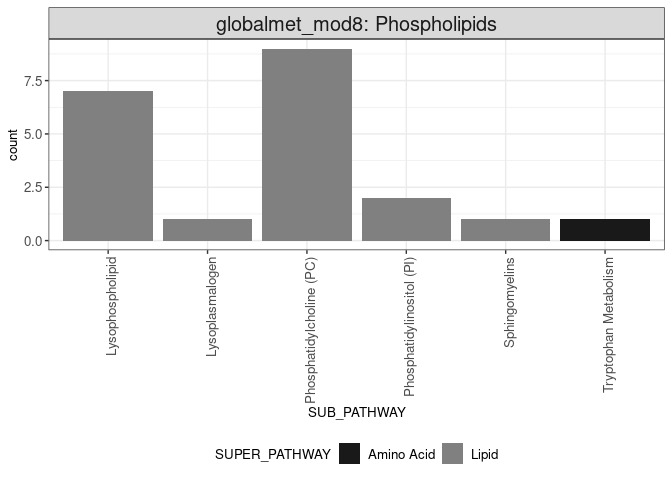<!-- -->

``` r
pdf(file.path(out_dir, "main_D.pdf"), width=8, height = 8) 
print(panelD)
dev.off()
```

    ## png 
    ##   2

### Panel E: output generation code

``` r
visit1mod8 <- data_use_visit1 %>%
  rownames_to_column(var = "sample_id") %>%
  dplyr::select(sample_id, globalmet_mod8, trajectory_group) %>%
  pivot_longer(cols = -c(sample_id, trajectory_group)) %>%
  mutate(name             = "globalmet_mod8: Phospholipids", #global_met8: 
         trajectory_group = paste0("TG", trajectory_group)) %>%
  ggplot(mapping = aes(x = trajectory_group, y = value)) +
  geom_beeswarm(mapping = aes(color = trajectory_group), cex = 1.5, size = 0.8) +
  geom_boxplot(fill = "transparent", outlier.color= "transparent") +
  facet_wrap(facets= ~name, ncol = 1) + 
  labs(y = "Eigenvalue", x = "Clinical trajectory group") + #, tag = "E"
  scale_color_manual(values = c("TG1" = "#639A21",
                                "TG2" = "#39828C",
                                "TG3" = "#6371AD",
                                "TG4" = "#BD7D31",
                                "TG5" = "#9C3418")) +
  theme_bw() +
  theme(legend.pos = "none", axis.title.x = element_text(size = 15)) + theme(axis.title=element_text(size=15), legend.title= element_text (size=15))+theme(strip.text.x = element_text(size = 13)) + theme(axis.text = element_text(size = 15)) + theme(title=element_text(size = 10))
print(visit1mod8)
```

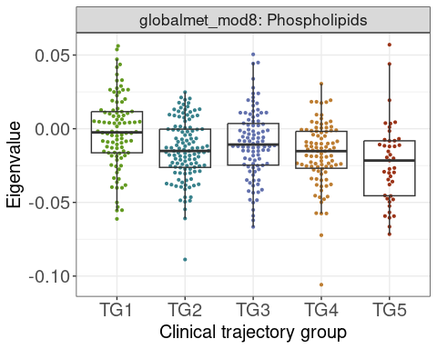<!-- -->

``` r
pdf(file.path(out_dir, "main_E.pdf"), width=8, height = 8)
print(visit1mod8)
dev.off()
```

    ## png 
    ##   2

### Panel F: output generation code

``` r
exampleDF <- data_use %>%
  filter(name %in% "globalmet_mod8") %>%
  mutate(trajectory_group = ordered(as.factor(as.character(trajectory_group)), 
                                    levels = c("1", "2", "3", "4", "5")))

plotExample <- plot_model(exampleDF, 
                          model_loop     = smooth_spline_model_loop, 
                          modelType      = "smoothSpline", 
                          p_adjust       = NA, 
                          endpoint       = "trajectory_group", 
                          signif_markers = FALSE,
                          remove_NS      = TRUE, 
                          bar_height     = 6.5)

plotMod8 <- plotExample$data %>%
  mutate(trajectory_group = paste0("TG", trajectory_group)) %>%
  ggplot(mapping = aes(x = event_date, y = value)) +
    geom_line(mapping = aes(group = participant_id, y = value), 
              color   = 'gray',
              alpha   = 0.4) +
    geom_line(mapping = aes(group = participant_id, y = yhat), 
              size    = 0.6, 
              alpha   = 0.5,
              color   = "black") +
    geom_point(mapping = aes(color = trajectory_group)) +
    geom_line(data    = mutate(get("pred", plotExample$plot_env),
                               trajectory_group = paste0("TG", 
                                                         trajectory_group)),
              mapping = aes(group = trajectory_group, y = predicted),
                           color = "black", size = 1.5) +
    facet_wrap(facets = ~trajectory_group, nrow = 1) +
    labs(y = "Eigenvalue",  x = "Days from admission") + #,  tag = "F"
    scale_color_manual(values= c("TG1"  = "#639A21",
                                 "TG2"  = "#39828C",
                                 "TG3"  = "#6371AD", 
                                 "TG4"  = "#BD7D31",
                                 "TG5"  = "#9C3418")) +
  coord_cartesian(xlim = c(0, 42)) +
  theme_bw() +
  theme(legend.pos = "none",
        panel.grid.minor = element_blank()) + theme(axis.title=element_text(size=15), legend.title= element_text (size=15))+theme(strip.text.x = element_text(size = 13)) + theme(axis.text = element_text(size = 15))

print(plotMod8)
```

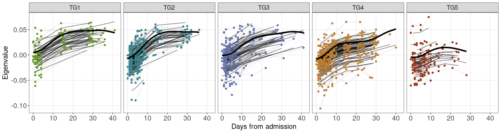<!-- -->

``` r
pdf(file.path(out_dir, "main_F.pdf"), width=8, height = 8)
print(plotMod8)
dev.off()
```

    ## png 
    ##   2

``` r
Figures <- ggarrange(panelA, visit1Mod6,plotMod6,panelD,visit1mod8,plotMod8,
          labels = c("A", "B", "C","D","E","F"),
          ncol = 3, nrow = 2, widths = c(0.6,0.5,0.9,0.6,0.5,0.9))
```

    ## Warning in mean.default(X[[i]], ...): argument is not numeric or logical:
    ## returning NA

    ## Warning in mean.default(X[[i]], ...): argument is not numeric or logical:
    ## returning NA

    ## Warning in mean.default(X[[i]], ...): argument is not numeric or logical:
    ## returning NA

    ## Warning in mean.default(X[[i]], ...): argument is not numeric or logical:
    ## returning NA

    ## Warning in mean.default(X[[i]], ...): argument is not numeric or logical:
    ## returning NA

    ## Warning in mean.default(X[[i]], ...): argument is not numeric or logical:
    ## returning NA

    ## Warning in mean.default(X[[i]], ...): argument is not numeric or logical:
    ## returning NA

    ## Warning in mean.default(X[[i]], ...): argument is not numeric or logical:
    ## returning NA

    ## Warning in mean.default(X[[i]], ...): argument is not numeric or logical:
    ## returning NA

    ## Warning in mean.default(X[[i]], ...): argument is not numeric or logical:
    ## returning NA

    ## Warning in mean.default(X[[i]], ...): argument is not numeric or logical:
    ## returning NA

    ## Warning in mean.default(X[[i]], ...): argument is not numeric or logical:
    ## returning NA

    ## Warning in mean.default(X[[i]], ...): argument is not numeric or logical:
    ## returning NA

    ## Warning in mean.default(X[[i]], ...): argument is not numeric or logical:
    ## returning NA

    ## Warning in mean.default(X[[i]], ...): argument is not numeric or logical:
    ## returning NA

    ## Warning in mean.default(X[[i]], ...): argument is not numeric or logical:
    ## returning NA

    ## Warning in mean.default(X[[i]], ...): argument is not numeric or logical:
    ## returning NA

    ## Warning in mean.default(X[[i]], ...): argument is not numeric or logical:
    ## returning NA

    ## Warning in mean.default(X[[i]], ...): argument is not numeric or logical:
    ## returning NA

    ## Warning in mean.default(X[[i]], ...): argument is not numeric or logical:
    ## returning NA

    ## Warning in mean.default(X[[i]], ...): argument is not numeric or logical:
    ## returning NA

    ## Warning in mean.default(X[[i]], ...): argument is not numeric or logical:
    ## returning NA

    ## Warning in mean.default(X[[i]], ...): argument is not numeric or logical:
    ## returning NA

# Supplemetary figure: panel E-F

``` r
##### 

# step 1: load required packages
library(package = "pvca") # devtools::install_github("dleelab/pvca")
VarCorr <- lme4::VarCorr


# step 2: specify which assay is going to be used as input
pvca_input_matrix <- t(plasma_metabolomics_global_counts)
if (sum(is.na(pvca_input_matrix)) > 0) {
  stop("pvca input matrix should not have missing values")
}
pvca_input_raw <- t(plasma_metabolomics_global_counts)
pvca_input_metadata <- plasma_metabolomics_global_metadata


# step3: select variable to be included in PVCA
#   event_data_week: day from admission to to the hospital coded as week (categorical variable)
#   sympt_date_week: day from onset of symptoms coded as week (categorical variable)
#   age_decate: age at admission coded as decade (admit_age modulo 10)
pvca_input_phenodata <- clinical_data %>% #clinical_data1
  mutate(event_date_week = findInterval(event_date, 
                                        vec        = c(0, 7, 14, 21, 28), 
                                        all.inside = TRUE),
         day_from_sympt  = event_date - symptom_date,
         sympt_date_week = findInterval(day_from_sympt, 
                                        vec        = c(0, 7, 14, 21, 28, Inf),
                                        all.inside = TRUE)) %>%
    dplyr::select(sample_id, event_date_week, event_type,
           sex, sympt_date_week, event_location, participant_id, 
           discretized_admit_age_quantile, ethnicity, race,  trajectory_group, enrollment_site, bmi)
# step 4 append meta data to pvca phenodata
#   core site: where are the sample processed (this chunk of code need to be modified for each core assay)
#   plate = interaction term of phase and plate
pvca_input_phenodata <- pvca_input_metadata %>%
  rownames_to_column(var = "sample_id") %>%
  mutate(         plate     = interaction(phase, plate, drop = TRUE)) %>%
  dplyr::select(sample_id, plate, phase) %>%
  merge(x     = pvca_input_phenodata,
        by    = "sample_id",
        all.x = TRUE)

# append rownames
pvca_input_phenodata <- pvca_input_phenodata %>%
  column_to_rownames(var = "sample_id")
pvca_input_phenodata <- pvca_input_phenodata[colnames(pvca_input_matrix), , drop = FALSE]

# add percent missing values (if processeed matrix required imputation otherwise comment line below)
#pvca_input_phenodata$percent_missing <- factor(colMeans(is.na(pvca_input_raw[, rownames(pvca_input_phenodata)])))

# step 5: run PVCA
fit <- PVCA(counts    = pvca_input_matrix,
            meta      = pvca_input_phenodata,
            inter     = FALSE,
            threshold = 0.6)
```

    ## boundary (singular) fit: see ?isSingular
    ## boundary (singular) fit: see ?isSingular
    ## boundary (singular) fit: see ?isSingular
    ## boundary (singular) fit: see ?isSingular
    ## boundary (singular) fit: see ?isSingular
    ## boundary (singular) fit: see ?isSingular
    ## boundary (singular) fit: see ?isSingular
    ## boundary (singular) fit: see ?isSingular
    ## boundary (singular) fit: see ?isSingular
    ## boundary (singular) fit: see ?isSingular
    ## boundary (singular) fit: see ?isSingular
    ## boundary (singular) fit: see ?isSingular
    ## boundary (singular) fit: see ?isSingular
    ## boundary (singular) fit: see ?isSingular
    ## boundary (singular) fit: see ?isSingular
    ## boundary (singular) fit: see ?isSingular
    ## boundary (singular) fit: see ?isSingular
    ## boundary (singular) fit: see ?isSingular
    ## boundary (singular) fit: see ?isSingular
    ## boundary (singular) fit: see ?isSingular
    ## boundary (singular) fit: see ?isSingular
    ## boundary (singular) fit: see ?isSingular
    ## boundary (singular) fit: see ?isSingular
    ## boundary (singular) fit: see ?isSingular
    ## boundary (singular) fit: see ?isSingular
    ## boundary (singular) fit: see ?isSingular
    ## boundary (singular) fit: see ?isSingular
    ## boundary (singular) fit: see ?isSingular
    ## boundary (singular) fit: see ?isSingular
    ## boundary (singular) fit: see ?isSingular
    ## boundary (singular) fit: see ?isSingular
    ## boundary (singular) fit: see ?isSingular
    ## boundary (singular) fit: see ?isSingular
    ## boundary (singular) fit: see ?isSingular
    ## boundary (singular) fit: see ?isSingular
    ## boundary (singular) fit: see ?isSingular
    ## boundary (singular) fit: see ?isSingular
    ## boundary (singular) fit: see ?isSingular
    ## boundary (singular) fit: see ?isSingular

``` r
# step 6: plot barplot with PVCA results
pvca_barplot_data <- data.frame(explained = as.vector(fit),
                                effect    = names(fit)) %>%
  arrange(explained) %>%
  mutate(effect = factor(effect, levels = effect))

S_panel_E<- ggplot(data    = pvca_barplot_data,
       mapping = aes(x = effect, y = explained)) +
  geom_bar(stat = "identity") +
  geom_text(aes(label = signif(explained, digits = 3)),
            nudge_y   = 0.02,
            size      = 3) +
  labs(x = NULL, y = "Proportion of the variance explained") + 
  theme_bw() + coord_flip () +
  theme(axis.text.x = element_text(angle = 45,
                                   vjust = 1,
                                   hjust = 1)) + theme(axis.title=element_text(size=10), legend.title= element_text (size=10))+theme(strip.text.x = element_text(size = 10)) + theme(axis.text = element_text(size = 10), legend.text = element_text(size=10))
print(S_panel_E)
```

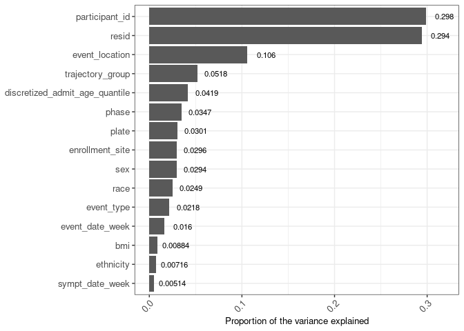<!-- -->

``` r
pdf(file.path(out_dir, "suppl_E.pdf"), width=8, height = 8)
print(S_panel_E)
dev.off()
```

    ## png 
    ##   2

## PVCA analysis with technical+biological variables

# to use: modify step2 variable to your assay of interest

``` r
##### Authors: Slim Fourati, Jingjing Qi, Brian Lee

# step 1: load required packages
library(package = "pvca") # devtools::install_github("dleelab/pvca")
VarCorr <- lme4::VarCorr

# step 2: specify which assay is going to be used as input
pvca_input_matrix <- t(plasma_metabolomics_global_counts)
if (sum(is.na(pvca_input_matrix)) > 0) {
  stop("pvca input matrix should not have missing values")
}
pvca_input_raw <- t(plasma_metabolomics_global_counts)
pvca_input_metadata <- plasma_metabolomics_global_metadata

# step3: select variable to be included in PVCA
#   event_data_week: day from admission to to the hospital coded as week (categorical variable)
#   sympt_date_week: day from onset of symptoms coded as week (categorical variable)
#   discretized_admit_age_quantile: age at admission coded as quintiles 
pvca_input_phenodata <- clinical_data %>%
  mutate(event_date_week = findInterval(event_date, 
                                        vec        = c(0, 7, 14, 21, 28), 
                                        all.inside = TRUE),
         day_from_sympt  = event_date - symptom_date,
         sympt_date_week = findInterval(day_from_sympt, 
                                        vec        = c(0, 7, 14, 21, 28, Inf),
                                        all.inside = TRUE)) %>%
    dplyr::select(sample_id, event_date_week, event_type, respiratory_status,
           sex, sympt_date_week, event_location,
           discretized_admit_age_quantile, ethnicity, race,
           trajectory_group, enrollment_site, bmi)

# step 4 append meta data to pvca phenodata
#   core site: where are the sample processed (this chunk of code need to be modified for each core assay)
#   plate = interaction term of phase and plate
pvca_input_phenodata <- pvca_input_metadata %>%
  rownames_to_column(var = "sample_id") %>%
  mutate(         plate     = interaction(phase, plate, drop = TRUE)) %>%
  dplyr::select(sample_id, plate, phase) %>%
  merge(x     = pvca_input_phenodata,
        by    = "sample_id",
        all.x = TRUE)

# append rownames
pvca_input_phenodata <- pvca_input_phenodata %>%
  column_to_rownames(var = "sample_id")
pvca_input_phenodata <- pvca_input_phenodata[colnames(pvca_input_matrix), , drop = FALSE]

# add percent missing values (if processeed matrix required imputation otherwise comment line below)
#pvca_input_phenodata$percent_missing <- factor(colMeans(is.na(pvca_input_raw[, rownames(pvca_input_phenodata)])))

# step 5: run PVCA
fit <- PVCA(counts    = pvca_input_matrix,
            meta      = pvca_input_phenodata,
            inter     = FALSE,
            threshold = 0.6)
```

    ## boundary (singular) fit: see ?isSingular
    ## boundary (singular) fit: see ?isSingular
    ## boundary (singular) fit: see ?isSingular
    ## boundary (singular) fit: see ?isSingular
    ## boundary (singular) fit: see ?isSingular
    ## boundary (singular) fit: see ?isSingular
    ## boundary (singular) fit: see ?isSingular
    ## boundary (singular) fit: see ?isSingular
    ## boundary (singular) fit: see ?isSingular
    ## boundary (singular) fit: see ?isSingular
    ## boundary (singular) fit: see ?isSingular
    ## boundary (singular) fit: see ?isSingular
    ## boundary (singular) fit: see ?isSingular
    ## boundary (singular) fit: see ?isSingular
    ## boundary (singular) fit: see ?isSingular
    ## boundary (singular) fit: see ?isSingular
    ## boundary (singular) fit: see ?isSingular
    ## boundary (singular) fit: see ?isSingular
    ## boundary (singular) fit: see ?isSingular
    ## boundary (singular) fit: see ?isSingular
    ## boundary (singular) fit: see ?isSingular
    ## boundary (singular) fit: see ?isSingular
    ## boundary (singular) fit: see ?isSingular
    ## boundary (singular) fit: see ?isSingular
    ## boundary (singular) fit: see ?isSingular
    ## boundary (singular) fit: see ?isSingular
    ## boundary (singular) fit: see ?isSingular
    ## boundary (singular) fit: see ?isSingular
    ## boundary (singular) fit: see ?isSingular
    ## boundary (singular) fit: see ?isSingular
    ## boundary (singular) fit: see ?isSingular

``` r
# step 6: plot barplot with PVCA results
pvca_barplot_data <- data.frame(explained = as.vector(fit),
                                effect    = names(fit)) %>%
  arrange(explained) %>%
  mutate(effect = factor(effect, levels = effect))

S_panel_F <- ggplot(data    = pvca_barplot_data,
       mapping = aes(x = effect, y = explained)) +
  geom_bar(stat = "identity") +
  geom_text(aes(label = signif(explained, digits = 3)),
            nudge_y   = 0.02,
            size      = 3) +
  labs(x = NULL, y = "Proportion of the variance explained") + 
  theme_bw() + coord_flip () +
  theme(axis.text.x = element_text(angle = 45,
                                   vjust = 1,
                                   hjust = 1)) + theme(axis.title=element_text(size=10), legend.title= element_text (size=10))+theme(strip.text.x = element_text(size = 10)) + theme(axis.text = element_text(size = 10), legend.text = element_text(size=10))

print(S_panel_F)
```

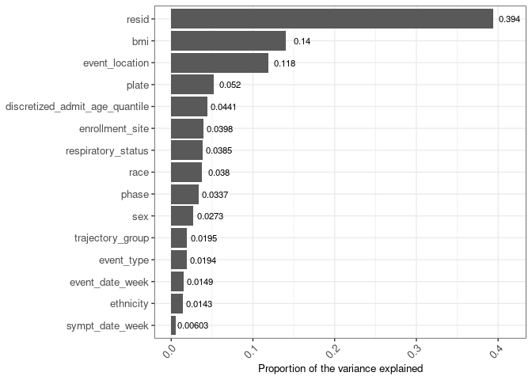<!-- -->

``` r
pdf(file.path(out_dir, "suppl_F.pdf"), width=8, height = 8)
print(S_panel_F)
dev.off()
```

    ## png 
    ##   2

## QC script to generate supplimentary pannel A-C

\#S\_panel\_A

``` r
s_figure_a <- file.path(out_dir, "/suppl_A.pdf")
knitr::include_graphics(s_figure_a)
```

<!-- -->

\#S\_panel\_B

``` r
s_figure_b <- file.path(out_dir, "/suppl_B.pdf")
knitr::include_graphics(s_figure_b)
```

<!-- -->

``` r
DT = data.table(
  a = c("Number of Metabolites (Pre-QC)", "Number of Metabolites Excluded (IQR = 0; not xenobiotic)", "Number of Metabolites (Post-QC)", "IQR (Pre-QC) [Median (Range)]", "Skewness (Pre-QC)  [Median (Range)]", "IQR (Post-QC) [Median (Range)]", "Skewness (Post-QC)  [Median (Range)]"),
  b =c("1017", "5", "1012","0.87 (0.00, 117.31)", "4.37 (0.29, 35.66)", "0.71 (0.00, 2.59)", "-0.41 (-5.06, 15,75)")
 
)
#S_panel_C <- table()
DT
```

    ##                                                           a
    ## 1:                           Number of Metabolites (Pre-QC)
    ## 2: Number of Metabolites Excluded (IQR = 0; not xenobiotic)
    ## 3:                          Number of Metabolites (Post-QC)
    ## 4:                            IQR (Pre-QC) [Median (Range)]
    ## 5:                      Skewness (Pre-QC)  [Median (Range)]
    ## 6:                           IQR (Post-QC) [Median (Range)]
    ## 7:                     Skewness (Post-QC)  [Median (Range)]
    ##                       b
    ## 1:                 1017
    ## 2:                    5
    ## 3:                 1012
    ## 4:  0.87 (0.00, 117.31)
    ## 5:   4.37 (0.29, 35.66)
    ## 6:    0.71 (0.00, 2.59)
    ## 7: -0.41 (-5.06, 15,75)

``` r
S_panel_C <- ggtexttable(DT, rows = NULL,cols = NULL,  theme = ttheme("classic"))
print(S_panel_C)
```

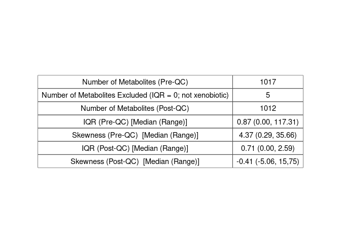<!-- -->

``` r
pdf(file.path(out_dir, "suppl_C.pdf"), width=8, height = 8)
print(S_panel_C)
dev.off()
```

    ## png 
    ##   2

### Supplementary Table A: output generation code

``` r
ASSAY <- "globalmet"
supTab_modules <- wgcnaRes$module_membership %>% 
  arrange(module) %>%
  mutate(module = paste0(ASSAY, ".", module)) %>%
  rename(Module  = module,
         Feature = feature) %>%
  dplyr::select(Module, Feature) %>%
  `rownames<-`(NULL)

supTab_modules %>%
  head() %>%
  kable()
```

| Module                    | Feature |
|:--------------------------|:--------|
| globalmet.globalmet\_mod0 | X35     |
| globalmet.globalmet\_mod0 | X50     |
| globalmet.globalmet\_mod0 | X55     |
| globalmet.globalmet\_mod0 | X93     |
| globalmet.globalmet\_mod0 | X136    |
| globalmet.globalmet\_mod0 | X158    |

``` r
rowfeature <- plasma_metabolomics_global_rowfeature #read.csv("/data/metabolomics/plasma-metabolomics-global/legacy/2022-01-01/GlobalPlasmaMetabolomics-RowFeature.csv")
modules_results <- merge(supTab_modules, rowfeature, by.x = "Feature", by.y = "MET_ID", all.x = TRUE)
dim(supTab_modules)
```

    ## [1] 1012    2

``` r
dim(modules_results)
```

    ## [1] 1012   28

``` r
modules_results <- modules_results[,c("Module", "CHEMICAL_NAME")]
names(modules_results)[2] <- "Feature"
modules_results %>%
  head() %>%
  kable()
```

| Module                     | Feature                             |
|:---------------------------|:------------------------------------|
| globalmet.globalmet\_mod6  | carnitine                           |
| globalmet.globalmet\_mod0  | benzoate                            |
| globalmet.globalmet\_mod11 | 3-phenylpropionate (hydrocinnamate) |
| globalmet.globalmet\_mod11 | phenylacetate                       |
| globalmet.globalmet\_mod0  | hippurate                           |
| globalmet.globalmet\_mod6  | xanthurenate                        |

``` r
write_csv(modules_results,
          file = file.path(out_dir, "globalmet_Modules.csv"))
```

### Supplementary Table B: output generation code

``` r
metanr_packages <- function(){
metr_pkgs <- c("impute", "pcaMethods", "globaltest", "GlobalAncova", "Rgraphviz", "preprocessCore", "genefilter", "SSPA", "sva", "limma", "KEGGgraph", "siggenes","BiocParallel", "MSnbase", "multtest", "RBGL", "edgeR", "fgsea", "devtools", "crmn")
list_installed <- installed.packages()
new_pkgs <- subset(metr_pkgs, !(metr_pkgs %in% list_installed[, "Package"]))
if(length(new_pkgs)!=0){if (!requireNamespace("BiocManager", quietly = TRUE))
        install.packages("BiocManager")
        BiocManager::install(new_pkgs)
        print(c(new_pkgs, " packages added..."))
    }

if((length(new_pkgs)<1)){
        print("No new packages added...")
    }
}
```

``` r
metanr_packages()
```

    ## [1] "No new packages added..."

\`\`\`{ r} \# Step 1: Install devtools install.packages(“devtools”)
library(devtools)

# Step 2: Install MetaboAnalystR without documentation

devtools::install\_github(“xia-lab/MetaboAnalystR”, build = TRUE,
build\_vignettes = FALSE)

# Step 2: Install MetaboAnalystR with documentation

\#devtools::install\_github(“xia-lab/MetaboAnalystR”, build = TRUE,
build\_vignettes = TRUE, build\_manual =T)


    ```r
    library("MetaboAnalystR")

``` r
WGCBA_modules <- as.data.frame(metInfo1)
```

\`\`\`{ r} results\_annotation\_results &lt;- data.frame(matrix(NA, ncol
= 4)) colnames(results\_annotation\_results) &lt;- c(“Module”, “Short
Name”, “Annotation resource”, “Raw p”)

for(i in c(0:41)){ mod\_name &lt;- paste(“globalmet\_mod”,i,sep = "“)
print(mod\_name) mSet&lt;-InitDataObjects(”conc“,”msetora“, FALSE)
cmpd.vec &lt;- WGCBA\_modules\[WGCBA\_modules$moduleColor ==
mod\_name,\]$HMDB for (p in cmpd.vec) { if (grepl(”,“, p)){ temp &lt;-
str\_split(p,”,")\[\[1\]\] cmpd.vec &lt;- c(cmpd.vec, temp) cmpd.vec
&lt;- cmpd.vec\[cmpd.vec!= p\] } }

mSet&lt;-Setup.MapData(mSet, cmpd.vec) mSet&lt;-CrossReferencing(mSet,
“hmdb”) mSet&lt;-CreateMappingResultTable(mSet)
mSet&lt;-SetMetabolomeFilter(mSet, F) mSet&lt;-SetCurrentMsetLib(mSet,
“smpdb\_pathway”, 2)

skip\_to\_next &lt;- FALSE

tryCatch(mSet&lt;-CalculateHyperScore(mSet), error = function(e) {
skip\_to\_next &lt;&lt;- TRUE})

if(skip\_to\_next) { rm(mSet) rm(current.msetlib) next }

if (length(mSet)==9){ mSet&lt;-SaveTransformedData(mSet)
results\_annotation &lt;-
as.data.frame(mSet*a**n**a**l**S**e**t*ora.mat)
results\_annotation$\`Short Name\` &lt;- rownames(results\_annotation)  results\_annotation &lt;- results\_annotation\[,c(7,4)\]  results\_annotation$Module
&lt;- paste0(ASSAY,“.”, mod\_name, sep = "“)
results\_annotation$`Annotation resource` &lt;-”SMPDB"
results\_annotation &lt;- results\_annotation\[,c(3,1,4,2)\]
results\_annotation\_results &lt;- rbind(results\_annotation\_results,
results\_annotation) }

rm(mSet) rm(current.msetlib) }


    ```{ r}
    results_annotation_results <- results_annotation_results[-c(1),]
    rownames(results_annotation_results) <- NULL
    results_annotation_results$Significance[results_annotation_results$`Raw p`<=0.05] <- "Significant"
    results_annotation_results$Significance[results_annotation_results$`Raw p`>0.05] <- "Not Significant"
    table(results_annotation_results[,c(1,5)])
    write_csv(results_annotation_results, file = file.path(out_dir, "globalmet_Annotation.csv"))

``` r
results_annotation_results <- read_csv(file="../files/globalmet_Annotation.csv")
```

    ## Rows: 245 Columns: 5
    ## ── Column specification ────────────────────────────────────────────────────────
    ## Delimiter: ","
    ## chr (4): Module, Short Name, Annotation resource, Significance
    ## dbl (1): Raw p
    ## 
    ## ℹ Use `spec()` to retrieve the full column specification for this data.
    ## ℹ Specify the column types or set `show_col_types = FALSE` to quiet this message.

``` r
table(results_annotation_results[,c(1,5)])
```

    ##                            Significance
    ## Module                      Not Significant Significant
    ##   globalmet.globalmet_mod0               72           0
    ##   globalmet.globalmet_mod1               24           0
    ##   globalmet.globalmet_mod12              23           5
    ##   globalmet.globalmet_mod13               3           0
    ##   globalmet.globalmet_mod15              35          10
    ##   globalmet.globalmet_mod16               1           1
    ##   globalmet.globalmet_mod17               2           0
    ##   globalmet.globalmet_mod18               0           2
    ##   globalmet.globalmet_mod20               5           2
    ##   globalmet.globalmet_mod23               2           0
    ##   globalmet.globalmet_mod28               4           0
    ##   globalmet.globalmet_mod3                3           0
    ##   globalmet.globalmet_mod34              13           5
    ##   globalmet.globalmet_mod35               2           0
    ##   globalmet.globalmet_mod4               12           1
    ##   globalmet.globalmet_mod6               11           1
    ##   globalmet.globalmet_mod8                2           0
    ##   globalmet.globalmet_mod9                4           0

``` r
write_csv(results_annotation_results, file = file.path(out_dir, "globalmet_Annotation.csv"))
```

### Supplementary Table B: output generation code

``` r
# Subset the data to only get 'Visit 1':
clinical_subsets = clinical_data
rownames(clinical_subsets) = clinical_subsets$sample_id
row_ids = rownames(plasma_metabolomics_global_counts)
clinical_subsets = clinical_subsets[row_ids,]
visit1_row_ids = rownames(clinical_subsets[clinical_subsets$event_type == 'Visit 1',])

# Use the visit1_row_ids to only get samples from 'Visit 1':
modules_filtered = wgcnaRes$MEs[visit1_row_ids ,]
clinical_subsets = clinical_subsets[visit1_row_ids ,]
data_use = modules_filtered 

# Add the respiratory_status_day14 as $endpoints
data_use$endpoints = as.factor(clinical_subsets$trajectory_group) #Make sure that you change this depend of endpoint

# Add the enrollment_site as $sites
data_use$sites = clinical_subsets$enrollment_site
data_use$age =  clinical_subsets$discretized_admit_age_quantile
data_use$sex =  clinical_subsets$sex

#Add other clinical information based on pvca
data_use$bmi = clinical_subsets$bmi
data_use$event_location = clinical_subsets$event_location
# Add the $control, needs to be different for each sample
# required for clmm (always requires some random effect)
data_use$control =  factor(1:nrow(data_use))

# Set module names:
module_names = colnames(modules_filtered)

# Only use samples that have valid endpoints (not NA/missing)
data_use = data_use[!is.na(data_use$endpoints),]
```

``` r
res_table_ordinal <- data.frame(matrix(NA, ncol = 4, nrow = length(module_names)))
colnames(res_table_ordinal) <- c("AIC", "pval", "qval", "coef")
rownames(res_table_ordinal) <- module_names
for(j in 1:length(module_names)) {
  my.formula0 <- paste0('endpoints~ 1+(1|sites)+age+sex+bmi')
  my.formula1 <- paste0('endpoints~',module_names[j],'+(1|sites)+age+sex+bmi')
  res_table_ordinal[j,1:2] <- mixed_ordinal(my.formula0, my.formula1,data_use)
  res_table_ordinal[j,4] <- ordinal::clmm(formula(my.formula1), 
                                          data = data_use) %>%
    coef() %>%
    .[module_names[j]]
}
res_table_ordinal$qval <- qvalue::qvalue(res_table_ordinal$pval, 
                                         fdr.level = 0.05, 
                                         pi0       = 1)$qvalues

head(res_table_ordinal) %>%
  kable()
```

|                  |      AIC |      pval |      qval |      coef |
|:-----------------|---------:|----------:|----------:|----------:|
| globalmet\_mod0  | 1329.947 | 0.0000508 | 0.0001642 | 14.169463 |
| globalmet\_mod1  | 1306.474 | 0.0000000 | 0.0000000 | 22.695000 |
| globalmet\_mod10 | 1318.746 | 0.0000001 | 0.0000012 | 17.654572 |
| globalmet\_mod11 | 1345.733 | 0.4272571 | 0.5607749 |  2.715368 |
| globalmet\_mod12 | 1344.044 | 0.1277330 | 0.2235328 | -5.265698 |
| globalmet\_mod13 | 1335.126 | 0.0008014 | 0.0021965 | 12.634270 |

``` r
supTab_resultsVisit1 <- res_table_ordinal %>%
  rownames_to_column(var = "Module (or Feature)") %>%
  #filter(pval <= 0.05) %>%
  mutate(`Module (or Feature)` = paste0(ASSAY, ".", `Module (or Feature)`),
         Analysis              = "Visit 1 analysis - overall",
         Direction             = ifelse(test = sign(coef) %in% 1,
                                        yes  = "Severe",
                                        no   = "Mild")) %>%
  rename(`P value` = pval,  `Q value` = qval) %>%
  dplyr::select(`Module (or Feature)`,
          Analysis,
         `P value`,`Q value`,
         Direction) %>%
  `rownames<-`(NULL)

supTab_resultsVisit1 %>%
  head() %>%
  kable()
```

| Module (or Feature)        | Analysis                   |   P value |   Q value | Direction |
|:---------------------------|:---------------------------|----------:|----------:|:----------|
| globalmet.globalmet\_mod0  | Visit 1 analysis - overall | 0.0000508 | 0.0001642 | Severe    |
| globalmet.globalmet\_mod1  | Visit 1 analysis - overall | 0.0000000 | 0.0000000 | Severe    |
| globalmet.globalmet\_mod10 | Visit 1 analysis - overall | 0.0000001 | 0.0000012 | Severe    |
| globalmet.globalmet\_mod11 | Visit 1 analysis - overall | 0.4272571 | 0.5607749 | Severe    |
| globalmet.globalmet\_mod12 | Visit 1 analysis - overall | 0.1277330 | 0.2235328 | Mild      |
| globalmet.globalmet\_mod13 | Visit 1 analysis - overall | 0.0008014 | 0.0021965 | Severe    |

``` r
# subfunction use to fit ordinal regression and extract reg. coef

mixed_pairwise_coef <- function(my.formula0, my.formula1, data_use) {
  endpoints0 <- sort(unique(data_use$endpoints))
  pair_names <- c()
  res_table <- c()
  for(i in 1:(length(endpoints0)-1)){
    for(j in (i+1):(length(endpoints0))){
      pair_names <- c(pair_names, paste0(endpoints0[i],"|", endpoints0[j]))
      data_tmp <- data_use[data_use$endpoints %in% endpoints0[c(i, j)], ]
      fit <- lme4::lmer(my.formula1, data = data_tmp)
      res_table <- c(res_table, 
                     unique(coef(fit)$sites[,grep(pattern = "endpoint", 
                                               names(coef(fit)$sites))]))
    }
  }
  names(res_table) <- pair_names
  return(value = res_table)
}
  
res_table_pairwise <- NULL
res_table_pairwise_coef <- NULL
for(j in 1:length(module_names)){
  my.formula0 = paste0(module_names[j],"~ (1|sites)+age+sex+bmi")
  my.formula1 = paste0(module_names[j],"~ endpoints + (1|sites)+age+sex+bmi")
  res_table_pairwise <- rbind(res_table_pairwise,
                              mixed_pairwise(my.formula0, my.formula1, data_use))
  res_table_pairwise_coef <- rbind(res_table_pairwise_coef,
                                   mixed_pairwise_coef(my.formula0, 
                                                       my.formula1, 
                                                       data_use))
}
rownames(res_table_pairwise) <- module_names
rownames(res_table_pairwise_coef) <- module_names
```

``` r
supTab_resultsVisit1tmp <- res_table_pairwise %>%
  as.data.frame() %>%
  rownames_to_column(var = "Module (or Feature)") %>%
  pivot_longer(cols      = -`Module (or Feature)`, 
               names_to  = "Analysis", 
               values_to = "P value")  %>%
  mutate(`Q value` = qvalue::qvalue(`P value`, 
                                    fdr.level = 0.05, 
                                    pi0       = 1)$qvalues)
res_table_pairwise_coef %>%
  as.data.frame() %>%
  rownames_to_column(var = "Module (or Feature)") %>%
  pivot_longer(cols      = -`Module (or Feature)`,
               names_to  = "Analysis",
               values_to = "Direction") %>%
  merge(x  = supTab_resultsVisit1tmp, 
        by = c("Module (or Feature)", "Analysis")) -> supTab_resultsVisit1tmp

supTab_resultsVisit1tmp <- supTab_resultsVisit1tmp %>%
  mutate(`Module (or Feature)` = paste0(ASSAY, ".", `Module (or Feature)`),
         Analysis              = paste0("Visit 1 analysis - ", Analysis),
         Direction             = ifelse(test = sign(Direction) %in% 1,
                                        yes  = "Severe",
                                        no   = "Mild")) #%>%
  #filter(`P value` <= 0.05)

supTab_resultsVisit1 <- rbind(supTab_resultsVisit1,
                              supTab_resultsVisit1tmp)

supTab_resultsVisit1 %>%
  tail() %>%
  kable()
```

|     | Module (or Feature)       | Analysis                |   P value |   Q value | Direction |
|:----|:--------------------------|:------------------------|----------:|----------:|:----------|
| 457 | globalmet.globalmet\_mod9 | Visit 1 analysis - 2\|3 | 0.4189098 | 0.6148187 | Severe    |
| 458 | globalmet.globalmet\_mod9 | Visit 1 analysis - 2\|4 | 0.0050695 | 0.0283895 | Mild      |
| 459 | globalmet.globalmet\_mod9 | Visit 1 analysis - 2\|5 | 0.0077971 | 0.0399366 | Mild      |
| 460 | globalmet.globalmet\_mod9 | Visit 1 analysis - 3\|4 | 0.0000732 | 0.0009444 | Mild      |
| 461 | globalmet.globalmet\_mod9 | Visit 1 analysis - 3\|5 | 0.0075934 | 0.0397353 | Mild      |
| 462 | globalmet.globalmet\_mod9 | Visit 1 analysis - 4\|5 | 0.8983384 | 0.9432553 | Severe    |

``` r
 inputDF <- wgcnaRes$MEs %>%
   rownames_to_column(var = "sample_id") %>%
   merge(y = dplyr::select(clinical_data, sample_id, event_date, participant_id, respiratory_status_day14, respiratory_status_day28,enrollment_site, trajectory_group, sex, admit_age, enrollment_site, discretized_admit_age_quantile),
         by = "sample_id") %>%
   mutate(outcomeD14  = cut(respiratory_status_day14, 
                            breaks = c(1, 2, 4, 6, 7), 
                            include.lowest = TRUE)) %>%
   mutate(outcomeD28  = cut(respiratory_status_day28, 
                            breaks = c(1, 2, 4, 6, 7), 
                            include.lowest = TRUE)) %>%
   pivot_longer(cols = -c("sample_id", "event_date", "participant_id",
                          "enrollment_site", "trajectory_group",
                          "respiratory_status_day14", "outcomeD14",
                          "respiratory_status_day28", "outcomeD28",
                          "sex", "admit_age", "discretized_admit_age_quantile")) %>%
   filter(!is.na(value) & !is.na(trajectory_group))

## Ensure proper variables are factors
inputDF$trajectory_group <- as.factor(inputDF$trajectory_group)
inputDF$name <- as.factor(inputDF$name)
inputDF$sex <- factor(inputDF$sex, levels = c("Female", "Male"))
inputDF$discretized_admit_age_quantile <- as.factor(inputDF$discretized_admit_age_quantile)
inputDF$participant_id <- as.factor(inputDF$participant_id)
inputDF$enrollment_site <- as.factor(inputDF$enrollment_site)
```

``` r
## Smooth spline takes a long time, demonstrating by cutting down to just ten factors
smooth_spline_model_loop <- model_loop(inputDF, 
                                       modelType = "smoothSpline", 
                                       endpoint  = "trajectory_group")

# fetch directionality from lme (TG1 vs TG5)
smooth_spline_model_loop$trajectory_group5 <- NA
smooth_spline_model_loop$"event_date:trajectory_group5" <- NA
for (modName in rownames(smooth_spline_model_loop)) {
  fit <- lme(fixed  = value ~ event_date * trajectory_group + sex + discretized_admit_age_quantile,
             random = ~1|enrollment_site/participant_id,
             data   = filter(inputDF, name %in% modName))
  smooth_spline_model_loop[modName, "trajectory_group5"] <-   unique(coef(fit)["trajectory_group5"])
  smooth_spline_model_loop[modName, "event_date:trajectory_group5"] <- unique(coef(fit)["event_date:trajectory_group5"])
}
```

``` r
supTab_resultsLongitudinal <- smooth_spline_model_loop %>%
  rownames_to_column(var = "Module (or Feature)") %>%
  dplyr::select(`Module (or Feature)`, p.slope, p.intercept,adjp.slope, adjp.intercept,  trajectory_group5, `event_date:trajectory_group5`) %>%
  rename(coef.intercept = trajectory_group5, 
         coef.slope = `event_date:trajectory_group5`) %>%
  pivot_longer(cols = -`Module (or Feature)`, names_to = c("cname", "Analysis"), names_pattern = "(.*)\\.(.*)") %>%
  pivot_wider(names_from = cname, values_from = value) %>%
  #filter(p <= 0.05) %>%
  mutate(Analysis = recode(Analysis,
                           `slope` = "Longitudinal analysis - overall shape",
                           `intercept` = "Longitudinal analysis - overall average"),
         Direction = ifelse(test = sign(coef) %in% 1,
                            yes  = "Severe",
                            no   = "Mild")) %>%
    rename(`P value` = p,`Q value` = adjp) %>%
  dplyr::select(`Module (or Feature)`,
         Analysis,
         `P value`,`Q value`,
         Direction) %>%
  `rownames<-`(NULL)

supTab_resultsLongitudinal  %>% 
  head() %>%
  kable()
```

| Module (or Feature) | Analysis                                |  P value |  Q value | Direction |
|:--------------------|:----------------------------------------|---------:|---------:|:----------|
| globalmet\_mod0     | Longitudinal analysis - overall shape   | 0.00e+00 | 0.00e+00 | Mild      |
| globalmet\_mod0     | Longitudinal analysis - overall average | 2.09e-05 | 4.87e-05 | Severe    |
| globalmet\_mod1     | Longitudinal analysis - overall shape   | 3.00e-07 | 8.00e-07 | Severe    |
| globalmet\_mod1     | Longitudinal analysis - overall average | 0.00e+00 | 0.00e+00 | Severe    |
| globalmet\_mod10    | Longitudinal analysis - overall shape   | 0.00e+00 | 0.00e+00 | Severe    |
| globalmet\_mod10    | Longitudinal analysis - overall average | 0.00e+00 | 0.00e+00 | Severe    |

``` r
# use linear regression to infer direction
combMat <- combn(unique(inputDF$trajectory_group), m = 2)
coefCombMat <- apply(combMat, MARGIN = 2, FUN = function(comparison) {
  inputTemp <- filter(inputDF, trajectory_group %in% comparison)
  
  coefDF <- lapply(rownames(smooth_spline_model_loop), FUN = function(modName) {
    fit <- lme(fixed  = value ~ event_date * trajectory_group + sex + discretized_admit_age_quantile,
               random = ~1|enrollment_site/participant_id,
               data   = filter(inputTemp, name %in% modName))
    average <- unique(coef(fit)[grep(pattern = "^trajectory_group",
                                     colnames(coef(fit)))]) %>%
      unlist() %>%
      unname()
    shape <- unique(coef(fit)[grep(pattern = "^event_date:trajectory_group",
                                     colnames(coef(fit)))]) %>%
      unlist() %>%
      unname()
    return(value = data.frame(`Module (or Feature)` = modName,
                              average, 
                              shape,
                              comparison = paste(sort(comparison), collapse = "|"),
                              check.names = FALSE))
  }) %>%
    do.call(what = rbind)
  return(value = coefDF)
}) %>%
  do.call(what = rbind)
```

``` r
supTab_resultsLongitudinalPairwise <-smooth_spline_model_loop %>%
  rownames_to_column(var = "Module (or Feature)") %>%
  dplyr::select(`Module (or Feature)`, 
         matches(match = "^p.slope_.v.$"),
         matches(match = "^p.intercept_.v.$"),
         matches(match = "^p.slope.adj_.v.$"),
         matches(match = "^p.intercept.adj_.v.$")) %>%
  setNames(nm = gsub(pattern = "p(.+).adj_",
                     replacement = "adjp\\1_",
                     names(.))) %>%
  pivot_longer(cols          = -`Module (or Feature)`, 
               names_to      = c("cname", "Analysis"), 
               names_pattern = "(.*)\\.(.*)") %>%
  pivot_wider(names_from = cname, values_from = value) %>%
  mutate(Analysis = gsub(pattern     = "slope",
                         replacement = "shape",
                         Analysis),
         Analysis = gsub(pattern     = "intercept",
                         replacement = "average",
                         Analysis),
         Analysis = gsub(pattern = "^(.+)_(.)v(.)$",
                         replacement = "Longitudinal analysis - \\2|\\3 \\1",
                         Analysis)) %>%
  rename(`P value` = p,
         `Q value` = adjp)
coefCombMat %>%
  pivot_longer(cols      = -c(`Module (or Feature)`, comparison),
               names_to  = "Analysis",
               values_to = "Direction") %>%
  mutate(Analysis = paste("Longitudinal analysis -",
                          comparison,
                          Analysis),
         Direction = ifelse(test = sign(Direction) %in% 1,
                            yes  = "Severe",
                            no   = "Mild")) %>%
  dplyr::select(-comparison) %>%
  merge(x  = supTab_resultsLongitudinalPairwise,
        by = c("Module (or Feature)", "Analysis")) -> supTab_resultsLongitudinalPairwise

# append to overall results
supTab_resultsLongitudinalPairwise %>%
  #filter(`P value` <= 0.05) %>%
  rbind(supTab_resultsLongitudinal, .) -> supTab_resultsLongitudinal
                                    
supTab_resultsLongitudinal <- supTab_resultsLongitudinal  %>% 
  mutate(`Module (or Feature)` = paste0(ASSAY, ".", `Module (or Feature)`))
  
supTab_resultsLongitudinal %>%
  tail() %>%
  kable()
```

| Module (or Feature)       | Analysis                             |   P value |   Q value | Direction |
|:--------------------------|:-------------------------------------|----------:|----------:|:----------|
| globalmet.globalmet\_mod9 | Longitudinal analysis - 3\|4 average | 0.0024671 | 0.0124843 | Mild      |
| globalmet.globalmet\_mod9 | Longitudinal analysis - 3\|4 shape   | 0.3237696 | 0.3964525 | Severe    |
| globalmet.globalmet\_mod9 | Longitudinal analysis - 3\|5 average | 0.0296687 | 0.0873425 | Mild      |
| globalmet.globalmet\_mod9 | Longitudinal analysis - 3\|5 shape   | 0.3232942 | 0.3964525 | Mild      |
| globalmet.globalmet\_mod9 | Longitudinal analysis - 4\|5 average | 0.9370348 | 0.9592620 | Severe    |
| globalmet.globalmet\_mod9 | Longitudinal analysis - 4\|5 shape   | 0.9242336 | 0.9376283 | Mild      |

``` r
clinical_subsets = clinical_data
rownames(clinical_subsets) = clinical_subsets$sample_id
row_ids = rownames(plasma_metabolomics_global_counts)
clinical_subsets = clinical_subsets[row_ids,]
modules_scores = wgcnaRes$MEs

modules_filtered =modules_scores
clinical_subsets = clinical_subsets

data_use <- cbind(modules_filtered, 
                  clinical_subsets[, c("trajectory_group", "event_date", "enrollment_site",          "participant_id","discretized_admit_age_quantile", "sex", "symptom_date")])

inputDF <- data_use%>%
  mutate(event_date = event_date - symptom_date) %>%
  dplyr::select(-symptom_date) %>%
  filter(!is.na(event_date)) %>%
  rownames_to_column(var = "sample_id") %>%
  filter(duplicated(participant_id) | duplicated(participant_id, fromLast = TRUE)) %>%
  pivot_longer(cols = -c("sample_id", "event_date", "participant_id",
                         "enrollment_site", "trajectory_group",
                         "discretized_admit_age_quantile", "sex")) %>%
  mutate(discretized_admit_age_quantile= factor(discretized_admit_age_quantile)) %>%
  filter(!is.na(value) & !is.na(trajectory_group))

inputDF$trajectory_group <- as.factor(inputDF$trajectory_group)
inputDF$sex <- as.factor(inputDF$sex)
inputDF$participant_id <- as.factor(inputDF$participant_id)
inputDF$enrollment_site <- as.factor(inputDF$enrollment_site)
```

``` r
smooth_spline_model_loop <- model_loop(inputDF, modelType = "smoothSpline", endpoint = "trajectory_group")

# fetch directionality from lme
smooth_spline_model_loop$trajectory_group5 <- NA
smooth_spline_model_loop$"event_date:trajectory_group5" <- NA
for (modName in rownames(smooth_spline_model_loop)) {
  fit <- lme(fixed= value ~ event_date * trajectory_group + sex + discretized_admit_age_quantile,
      random = ~1|enrollment_site/participant_id,
      data = filter(inputDF, name %in% modName))
smooth_spline_model_loop[modName, "trajectory_group5"] <- unique(coef(fit)["trajectory_group5"])
smooth_spline_model_loop[modName, "event_date:trajectory_group5"] <- unique(coef(fit)["event_date:trajectory_group5"])
}
```

``` r
supTab_resultsLongitudinalDFSO <- smooth_spline_model_loop %>%
  rownames_to_column(var = "Module (or Feature)") %>%
  dplyr::select(`Module (or Feature)`, p.slope, p.intercept, adjp.slope, adjp.intercept, trajectory_group5, `event_date:trajectory_group5`) %>%
  rename(coef.intercept = trajectory_group5, 
         coef.slope = `event_date:trajectory_group5`) %>%
  pivot_longer(cols = -`Module (or Feature)`, names_to = c("cname", "Analysis"), names_pattern = "(.*)\\.(.*)") %>%
  pivot_wider(names_from = cname, values_from = value) %>%
  #filter(p <= 0.05) %>%
  mutate(Analysis = recode(Analysis,
                           `slope` = "Longitudinal analysis DFSO - overall shape",
                           `intercept` = "Longitudinal analysis DFSO- overall average"),
         Direction = ifelse(test = sign(coef) %in% 1,
                            yes  = "Severe",
                            no   = "Mild")) %>%
    rename(`P value` = p,
           `Q value` = adjp) %>%
  dplyr::select(`Module (or Feature)`,
         Analysis,
         `P value`,`Q value`,
         Direction) %>%
  `rownames<-`(NULL)
               
supTab_resultsLongitudinalDFSO %>%
  head() %>%
  kable()
```

| Module (or Feature) | Analysis                                    |   P value |   Q value | Direction |
|:--------------------|:--------------------------------------------|----------:|----------:|:----------|
| globalmet\_mod0     | Longitudinal analysis DFSO - overall shape  | 0.0091533 | 0.0142385 | Mild      |
| globalmet\_mod0     | Longitudinal analysis DFSO- overall average | 0.0781209 | 0.1171813 | Severe    |
| globalmet\_mod1     | Longitudinal analysis DFSO - overall shape  | 0.0000183 | 0.0000590 | Severe    |
| globalmet\_mod1     | Longitudinal analysis DFSO- overall average | 0.0000002 | 0.0000007 | Severe    |
| globalmet\_mod10    | Longitudinal analysis DFSO - overall shape  | 0.0000151 | 0.0000578 | Severe    |
| globalmet\_mod10    | Longitudinal analysis DFSO- overall average | 0.0000000 | 0.0000000 | Severe    |

``` r
# use linear regression to infer direction
combMat <- combn(unique(inputDF$trajectory_group), m = 2)
coefCombMat <- apply(combMat, MARGIN = 2, FUN = function(comparison) {
  inputTemp <- filter(inputDF, trajectory_group %in% comparison)
  
  coefDF <- lapply(rownames(smooth_spline_model_loop), FUN = function(modName) {
    fit <- lme(fixed  = value ~ event_date * trajectory_group + sex + discretized_admit_age_quantile,
               random = ~1|enrollment_site/participant_id,
               data   = filter(inputTemp, name %in% modName))
    average <- unique(coef(fit)[grep(pattern = "^trajectory_group",
                                     colnames(coef(fit)))]) %>%
      unlist() %>%
      unname()
    shape <- unique(coef(fit)[grep(pattern = "^event_date:trajectory_group",
                                     colnames(coef(fit)))]) %>%
      unlist() %>%
      unname()
    return(value = data.frame(`Module (or Feature)` = modName,
                              average, 
                              shape,
                              comparison = paste(sort(comparison), collapse = "|"),
                              check.names = FALSE))
  }) %>%
    do.call(what = rbind)
  return(value = coefDF)
}) %>%
  do.call(what = rbind)
```

``` r
supTab_resultsLongitudinalDFSOPairwise <- smooth_spline_model_loop %>%
  rownames_to_column(var = "Module (or Feature)") %>%
  dplyr::select(`Module (or Feature)`, 
         matches(match = "^p.slope_.v.$"),
         matches(match = "^p.intercept_.v.$"),
         matches(match = "^p.slope.adj_.v.$"),
         matches(match = "^p.intercept.adj_.v.$")) %>%
  setNames(nm = gsub(pattern = "p(.+).adj_",
                     replacement = "adjp\\1_",
                     names(.))) %>%
  pivot_longer(cols          = -`Module (or Feature)`, 
               names_to      = c("cname", "Analysis"), 
               names_pattern = "(.*)\\.(.*)") %>%
  pivot_wider(names_from = cname, values_from = value) %>%
  mutate(Analysis = gsub(pattern     = "slope",
                         replacement = "shape",
                         Analysis),
         Analysis = gsub(pattern     = "intercept",
                         replacement = "average",
                         Analysis),
         Analysis = gsub(pattern = "^(.+)_(.)v(.)$",
                         replacement = "Longitudinal analysis DFSO - \\2|\\3 \\1",
                         Analysis)) %>%
  rename(`P value` = p,
         `Q value` = adjp)
coefCombMat %>%
  pivot_longer(cols      = -c(`Module (or Feature)`, comparison),
               names_to  = "Analysis",
               values_to = "Direction") %>%
  mutate(Analysis = paste("Longitudinal analysis DFSO -",
                          comparison,
                          Analysis),
         Direction = ifelse(test = sign(Direction) %in% 1,
                            yes  = "Severe",
                            no   = "Mild")) %>%
  select(-comparison) %>%
  merge(x  = supTab_resultsLongitudinalDFSOPairwise,
        by = c("Module (or Feature)", "Analysis")) -> supTab_resultsLongitudinalDFSOPairwise

# append to overall results
supTab_resultsLongitudinalDFSOPairwise %>%
  #filter(`P value` <= 0.05) %>%
  rbind(supTab_resultsLongitudinalDFSO, .) -> supTab_resultsLongitudinalDFSO
                                    
supTab_resultsLongitudinalDFSO <- supTab_resultsLongitudinalDFSO  %>%
  mutate(`Module (or Feature)` = paste0(ASSAY, ".", `Module (or Feature)`))
supTab_resultsLongitudinalDFSO %>%
  tail() %>%
  kable()
```

| Module (or Feature)       | Analysis                                  |   P value |   Q value | Direction |
|:--------------------------|:------------------------------------------|----------:|----------:|:----------|
| globalmet.globalmet\_mod9 | Longitudinal analysis DFSO - 3\|4 average | 0.0914270 | 0.2569982 | Mild      |
| globalmet.globalmet\_mod9 | Longitudinal analysis DFSO - 3\|4 shape   | 0.2978427 | 0.3971236 | Mild      |
| globalmet.globalmet\_mod9 | Longitudinal analysis DFSO - 3\|5 average | 0.4851831 | 0.6796482 | Severe    |
| globalmet.globalmet\_mod9 | Longitudinal analysis DFSO - 3\|5 shape   | 0.0488948 | 0.1037162 | Mild      |
| globalmet.globalmet\_mod9 | Longitudinal analysis DFSO - 4\|5 average | 0.6308522 | 0.7824022 | Severe    |
| globalmet.globalmet\_mod9 | Longitudinal analysis DFSO - 4\|5 shape   | 0.1055673 | 0.1839762 | Mild      |

### Step 16: merge all results table into one csv file

``` r
# combine all sup table results
supTab_results <- rbind(supTab_resultsVisit1,
                        supTab_resultsLongitudinal,
                        supTab_resultsLongitudinalDFSO)

write_csv(supTab_results, file.path(out_dir, "globalmet_Results.csv"))
```

# Supplemetary figure: panel D

``` r
data_env <- load_IMPACC_datasets(DATA_VERSION                = "2022-01-01", 
                                 KEEP_COVID19_POS            = FALSE, 
                                 FILTER_BY_CORE_ASSAY_COHORT = TRUE,
                                 ASSAY_NAMES = "plasma_metabolomics_global")
```

    ## Removing samples with event_date greater than 42 
    ## Removing samples with visit number (event_type) greater than Visit 6

``` r
#data_env <- readRDS("~/data_env.rds")
for (n in grep(pattern = "metabolomics|clinical_data", 
               names(data_env), 
               value   = TRUE)) {
  assign(n, value = data_env[[n]])
}
###
pc <- prcomp(plasma_metabolomics_global_counts)

plotDF <- pc$x[, 1:2] %>%
  as.data.frame() %>%
  rownames_to_column(var = "sample_id") %>%
  merge(y = clinical_data, by = "sample_id") %>%
  merge(y  = rownames_to_column(plasma_metabolomics_global_metadata, var = "sample_id"),
        by = "sample_id") %>%
  mutate(enrollment_site = ifelse(test = participant_type %in% "Healthy control (Emory)",
                                  yes  = "Emory-Ctrl", 
                                  no   = enrollment_site))
enrollmentSite2color <- rainbow(n = length(unique(plotDF$enrollment_site))) %>%
  setNames(nm = unique(plotDF$enrollment_site))
enrollmentSite2color["Emory-Ctrl"] <- "black"
S_panel_D <- ggplot(data = plotDF,
       mapping = aes(x = PC1, y = PC2, color = enrollment_site))+
  geom_point(size = 3, alpha = 0.7) +
  scale_color_manual(values = enrollmentSite2color) +
  scale_shape_manual(values = c(21, 23))+
  stat_ellipse()+
  labs(x     = paste0("1st dimension (",
                      round((pc$sdev^2/sum(pc$sdev^2))[1] * 100),
                      "%)"),
       y     = paste0("2nd dimension (",
                      round((pc$sdev^2/sum(pc$sdev^2))[2] * 100),
                      "%)")#,
       )+ #tag   = "A"
  theme_classic() +
  #theme(legend.text     = element_text(size = 6),
        #legend.key.size = unit(0.01, units = "npc"))+ legend.title= element_text (size=15))+t
  theme(axis.title=element_text(size=15))+ theme(strip.text.x = element_text(size = 13)) + theme(axis.text = element_text(size = 15), legend.text = element_text(size=15)) +
  theme(legend.position="none")
print(S_panel_D)
```

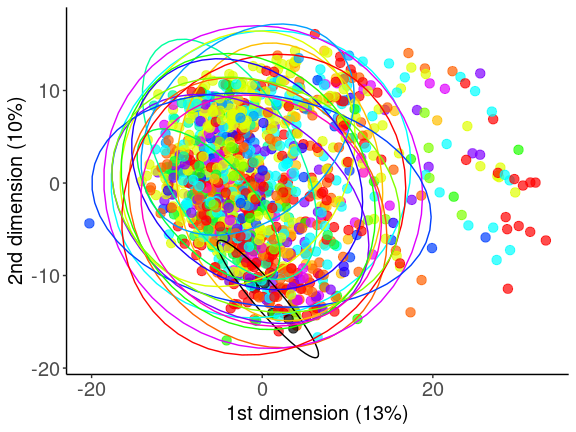<!-- -->

``` r
pdf(file.path(out_dir, "suppl_D.pdf"), width=8, height = 8)
print(S_panel_D)
dev.off()
```

    ## png 
    ##   2

`{ r} Figures_2_1 <- ggarrange(S_panel_A, S_panel_B, S_panel_C,            labels = c("A","B","C"),           ncol = 3, nrow = 1,widths = c(0.7,0.7,1))  Figures_2_2 <- ggarrange(S_panel_D, S_panel_E,S_panel_F,           labels = c("D","E","F"),           ncol = 3, nrow = 1,widths = c(1.5,1,1))  Figures_2 <- ggarrange(Figures_2_1, Figures_2_2,           ncol = 1, nrow = 2) ##12 x15`

### Session info

``` r
sessionInfo()
```

    ## R version 4.0.2 (2020-06-22)
    ## Platform: x86_64-pc-linux-gnu (64-bit)
    ## Running under: Ubuntu 22.04.2 LTS
    ## 
    ## Matrix products: default
    ## BLAS:   /usr/lib/x86_64-linux-gnu/openblas-pthread/libblas.so.3
    ## LAPACK: /usr/lib/x86_64-linux-gnu/openblas-pthread/libopenblasp-r0.3.20.so
    ## 
    ## locale:
    ##  [1] LC_CTYPE=C.UTF-8       LC_NUMERIC=C           LC_TIME=C.UTF-8       
    ##  [4] LC_COLLATE=C.UTF-8     LC_MONETARY=C.UTF-8    LC_MESSAGES=C.UTF-8   
    ##  [7] LC_PAPER=C.UTF-8       LC_NAME=C              LC_ADDRESS=C          
    ## [10] LC_TELEPHONE=C         LC_MEASUREMENT=C.UTF-8 LC_IDENTIFICATION=C   
    ## 
    ## attached base packages:
    ## [1] parallel  grid      stats     graphics  grDevices utils     datasets 
    ## [8] methods   base     
    ## 
    ## other attached packages:
    ##  [1] patchwork_1.1.1       pheatmap_1.0.12       ggplotify_0.1.0      
    ##  [4] WGCNA_1.69-81         fastcluster_1.2.3     dynamicTreeCut_1.63-1
    ##  [7] flashClust_1.01-2     doParallel_1.0.16     doRNG_1.8.2          
    ## [10] rngtools_1.5          missForest_1.4        itertools_0.1-3      
    ## [13] iterators_1.0.13      foreach_1.5.1         randomForest_4.6-14  
    ## [16] ComplexHeatmap_2.6.2  corrr_0.4.3           gridExtra_2.3        
    ## [19] rlang_1.1.1           RColorBrewer_1.1-2    cowplot_1.1.1        
    ## [22] ggpubr_0.4.0          pals_1.7              MetaboAnalystR_3.3.0 
    ## [25] e1071_1.7-9           data.table_1.14.0     openxlsx_4.2.4       
    ## [28] forcats_0.5.1         stringr_1.4.0         dplyr_1.0.9          
    ## [31] purrr_0.3.4           readr_2.1.2           tidyr_1.2.0          
    ## [34] tibble_3.1.7          tidyverse_1.3.1       nlme_3.1-148         
    ## [37] lme4_1.1-27.1         Matrix_1.2-18         GSA_1.03.2           
    ## [40] pvca_0.1.0            ggeffects_1.1.3       ggbeeswarm_0.6.0     
    ## [43] qvalue_2.22.0         ordinal_2019.12-10    ggnetwork_0.5.10     
    ## [46] ggplot2_3.4.0         igraph_1.4.2          impute_1.64.0        
    ## [49] knitr_1.39           
    ## 
    ## loaded via a namespace (and not attached):
    ##   [1] ModelMetrics_1.2.2.2  bit64_4.0.5           rpart_4.1-15         
    ##   [4] hardhat_0.2.0         generics_0.1.2        BiocGenerics_0.36.1  
    ##   [7] preprocessCore_1.52.1 RSQLite_2.2.7         RApiSerialize_0.1.0  
    ##  [10] proxy_0.4-26          future_1.25.0         bit_4.0.4            
    ##  [13] tzdb_0.4.0            xml2_1.3.3            lubridate_1.7.10     
    ##  [16] assertthat_0.2.1      gower_1.0.0           xfun_0.31            
    ##  [19] hms_1.1.0             evaluate_0.15         fansi_0.4.1          
    ##  [22] scrime_1.3.5          caTools_1.18.2        dbplyr_2.1.1         
    ##  [25] readxl_1.3.1          DBI_1.1.1             htmlwidgets_1.5.3    
    ##  [28] stats4_4.0.2          ellipsis_0.3.2        backports_1.2.0      
    ##  [31] insight_0.18.2        RcppParallel_5.1.5    vctrs_0.6.2          
    ##  [34] Biobase_2.50.0        Cairo_1.5-12.2        sjlabelled_1.1.8     
    ##  [37] abind_1.4-5           caret_6.0-92          cachem_1.0.6         
    ##  [40] withr_2.5.0           vroom_1.5.7           checkmate_2.0.0      
    ##  [43] cluster_2.1.0         lazyeval_0.2.2        crayon_1.4.1         
    ##  [46] edgeR_3.32.1          recipes_0.2.0         pkgconfig_2.0.3      
    ##  [49] labeling_0.4.2        vipor_0.4.5           nnet_7.3-14          
    ##  [52] globals_0.15.0        lifecycle_1.0.3       modelr_0.1.8         
    ##  [55] dichromat_2.0-0       cellranger_1.1.0      matrixStats_0.59.0   
    ##  [58] carData_3.0-4         boot_1.3-25           gamm4_0.2-6          
    ##  [61] reprex_2.0.0          base64enc_0.1-3       beeswarm_0.4.0       
    ##  [64] GlobalOptions_0.1.2   png_0.1-7             viridisLite_0.4.0    
    ##  [67] rjson_0.2.20          stringfish_0.15.7     bitops_1.0-7         
    ##  [70] KernSmooth_2.23-17    pROC_1.18.0           blob_1.2.1           
    ##  [73] shape_1.4.6           parallelly_1.31.1     gridGraphics_0.5-1   
    ##  [76] jpeg_0.1-8.1          rstatix_0.7.0         S4Vectors_0.28.1     
    ##  [79] ggsignif_0.6.2        scales_1.2.1          memoise_2.0.1        
    ##  [82] magrittr_2.0.3        plyr_1.8.6            gplots_3.1.1         
    ##  [85] compiler_4.0.2        pcaMethods_1.82.0     clue_0.3-59          
    ##  [88] cli_3.6.1             listenv_0.8.0         htmlTable_2.2.1      
    ##  [91] Formula_1.2-4         mgcv_1.8-31           MASS_7.3-51.6        
    ##  [94] tidyselect_1.1.1      stringi_1.5.3         highr_0.8            
    ##  [97] yaml_2.2.1            locfit_1.5-9.4        latticeExtra_0.6-29  
    ## [100] fastmatch_1.1-3       tools_4.0.2           future.apply_1.9.0   
    ## [103] rio_0.5.27            circlize_0.4.13       rstudioapi_0.13      
    ## [106] qs_0.25.3             foreign_0.8-80        crmn_0.0.21          
    ## [109] prodlim_2019.11.13    farver_2.1.0          digest_0.6.27        
    ## [112] lava_1.6.10           Rcpp_1.0.8            car_3.0-11           
    ## [115] siggenes_1.64.0       broom_0.8.0           httr_1.4.4           
    ## [118] AnnotationDbi_1.52.0  ucminf_1.1-4          colorspace_2.0-2     
    ## [121] rvest_1.0.0           fs_1.5.2              IRanges_2.24.1       
    ## [124] splines_4.0.2         yulab.utils_0.0.4     multtest_2.46.0      
    ## [127] mapproj_1.2.7         plotly_4.9.4.1        jsonlite_1.7.2       
    ## [130] nloptr_1.2.2.2        timeDate_3043.102     glasso_1.11          
    ## [133] ipred_0.9-12          R6_2.5.0              Hmisc_4.7-1          
    ## [136] pillar_1.7.0          htmltools_0.5.2       glue_1.6.2           
    ## [139] fastmap_1.1.0         minqa_1.2.4           BiocParallel_1.24.1  
    ## [142] class_7.3-17          codetools_0.2-16      maps_3.3.0           
    ## [145] fgsea_1.16.0          utf8_1.1.4            lattice_0.20-41      
    ## [148] numDeriv_2016.8-1.1   curl_4.3              gtools_3.9.2         
    ## [151] zip_2.2.0             GO.db_3.12.1          survival_3.1-12      
    ## [154] limma_3.46.0          rmarkdown_2.9         munsell_0.5.0        
    ## [157] GetoptLong_1.0.5      haven_2.4.1           reshape2_1.4.4       
    ## [160] gtable_0.3.0
