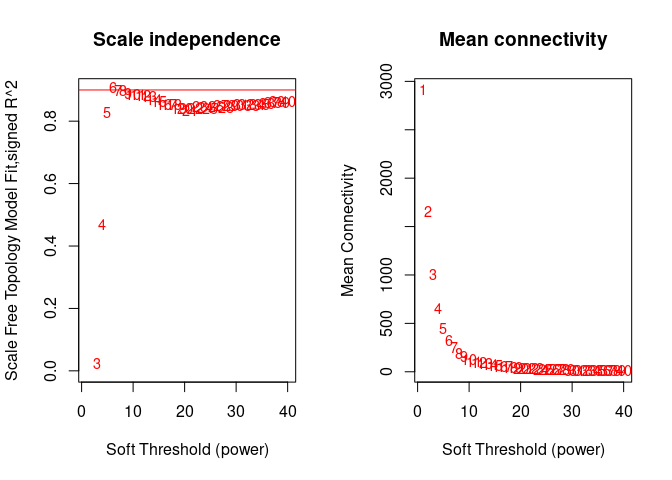
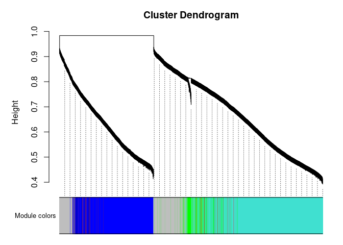

Nasal transcriptomics data analysis for core-assay manuscript
================
06 June, 2023

### Load libraries

``` r
suppressPackageStartupMessages(library(package = "knitr"))
suppressPackageStartupMessages(library(package = "impute"))
suppressPackageStartupMessages(library(package = "igraph"))
suppressPackageStartupMessages(library(package = "ggnetwork"))
suppressPackageStartupMessages(library(package = "ordinal"))
suppressPackageStartupMessages(library(package = "qvalue"))
suppressPackageStartupMessages(library(package = "ggbeeswarm"))
suppressPackageStartupMessages(library(package = "ggeffects"))
suppressPackageStartupMessages(library(package = "pvca"))
suppressPackageStartupMessages(library(package = "GSA"))
suppressPackageStartupMessages(library(package = "lme4"))
suppressPackageStartupMessages(library(package = "nlme"))
suppressPackageStartupMessages(library(package = "tidyverse"))
suppressPackageStartupMessages(library(package = "enrichR"))


# set session options
options(show_col_types = FALSE)
VarCorr <- lme4::VarCorr
```

### Load codebase.R, load data matrices and set path to your local output directory

``` r
# load codebase.R, viral load data and clinical information
# source("~/bitbucket/impacc/Analysis/data_analysis_template_codebase.R")
source("../../Codebase/codebase_v2.R")
data_env <- load_IMPACC_datasets(DATA_VERSION                = "2022-01-01", 
                                 KEEP_COVID19_POS            = TRUE, 
                                 FILTER_BY_CORE_ASSAY_COHORT = TRUE,
                                 ASSAY_NAME = "nasal_transcriptomics")

for (n in grep(pattern = "nasal_transcriptomics_counts|clinical_data|nasal_transcriptomics_rowfeature", 
               names(data_env), 
               value   = TRUE)) {
  assign(n, value = data_env[[n]])
}


# Setup the assay specific output directory
out_dir = "../output"
```

#### Prepare nasal transcriptome QC data

``` r
# This file is needed for median CV values to be used in PVCA analysis and 
# batch correction 
#nasal_transcriptome_metadata_file = file.path("legacy/2021-11-12", "nasal-transcriptomics-Metadata.csv")
nasal_transcriptome_metadata_data <- data_env$nasal_transcriptomics_metadata %>% rownames_to_column("sample_id") %>% data.frame(check.names = T) # read.csv(nasal_transcriptome_metadata_file)
```

 

 

#### Normalization of counts data

``` r
# Select only protein-coding genes
genes_pc <- nasal_transcriptomics_rowfeature %>%
  # get rownames as an explicit column
  tibble::rownames_to_column(var = "gene_id") %>%
  # remove row names
  tibble::remove_rownames() %>%
  # keep only gene ids with valid hgnc symbols
  tidyr::drop_na(gene_name) %>%
  # keep only protein coding genes
  dplyr::filter(gene_biotype == "protein_coding") %>%
  # remove redundant genes if any and make unique
  dplyr::distinct(gene_name, .keep_all = TRUE) %>%
  # add gene ids as row names
  column_to_rownames(var = "gene_id")

# get counts data only for pc genes
counts1 <- nasal_transcriptomics_counts %>%
  t()
counts1 <- counts1[rownames(genes_pc), ]  # 19835  1088

nasal_transcriptome_metadata_data_2 <- nasal_transcriptome_metadata_data %>%
  select(sample_id,
  #       core_specific_ID,
         phase, 
         plate = plate_num,
         fastq_total_reads = `fastq_total_reads_.QCMetrics.`,
         percent_aligned = `percent_aligned_.QCMetrics.`,
         QCMetrics_aligned_counts = `aligned_counts_.QCMetrics.`,
         median_cv_coverage = `median_cv_coverage_.QCMetrics.`,
         passQC = `passQC_.QCMetrics.`)

# combine both clinical and QC data
clinical_meta_data <- clinical_data %>%
  select(-phase) %>%
  mutate_at(vars(participant_id, respiratory_status, sex, event_type, respiratory_status_day14, respiratory_status_day28, enrollment_site, race, ethnicity, trajectory_group), list(factor)) %>%
  inner_join(nasal_transcriptome_metadata_data_2, by = "sample_id") %>%
  mutate(phase_plate = paste0(phase, "_", plate)) %>%
  mutate_at(vars(phase_plate, phase, plate), list(factor)) %>%
  # keep only samples which has counts data
  filter(sample_id %in% colnames(counts1)) %>%
  arrange(match(sample_id, colnames(counts1)))
  
# sanity checks to make sure that counts and meta data are ordered consistent
if(!(all(rownames(counts1) == rownames(genes_pc)))){
  stop("make sure genes (features) are ordered consistent between counts data and gene annotation data")
} else {message("genes (features) are ordered consistent between counts data and gene annotation data")}

if(!(all(colnames(counts1) == clinical_meta_data$sample_id))){
  stop("make sure samples are ordered consistent between counts data and metadata")
} else {message("samples are ordered consistent between counts data and metadata")}


# compute CPM values
dge_list <- edgeR::DGEList(counts = counts1, genes = genes_pc)
dge_list <- edgeR::calcNormFactors(dge_list)

# select genes which are expressed in at least 5% of samples
cut.filter <- 0.05 
keepRows <- rowSums(round(edgeR::cpm(dge_list$counts)) >= 1) >= cut.filter*ncol(counts1)
curDGE <- dge_list[keepRows,]
curDGE <- edgeR::calcNormFactors(curDGE) # 16363  1088
# dim(curDGE) # 16363  1088

# sanity check
if(!(all(rownames(curDGE$samples) == clinical_meta_data$sample_id))){
  stop("make sure samples are ordered consistent between counts data and metadata")
} else {message("samples are ordered consistent between counts data and metadata")}

# compute voom counts
voomCounts_1 <- limma::voom(curDGE, design = NULL, plot = FALSE, save.plot = FALSE)
```

 

 

## PVCA analysis with technical+biological variables on batch uncorrected data

## Based on normalized limma voom counts

``` r
# step 1: load necessary package if not already
# library(package = "pvca") # devtools::install_github("dleelab/pvca")
# VarCorr <- lme4::VarCorr

# First make sure metadata and counts are ordered consistent
if(!(all(rownames(voomCounts_1$targets) == clinical_meta_data$sample_id))){
  stop("make sure samples are ordered consistent between counts data and metadata")
} else {message("samples are ordered consistent between counts data and metadata")}

# step 2: specify which assay is going to be used as input
pvca_input_matrix <- as.matrix(voomCounts_1$E)
if (sum(is.na(pvca_input_matrix)) > 0) {
  stop("pvca input matrix should not have missing values")
}

pvca_input_metadata <- clinical_meta_data

# step3: select variables to be included in PVCA
#   event_data_week: day from admission to to the hospital coded as week (categorical variable)
#   sympt_date_week: day from onset of symptoms coded as week (categorical variable)
#   discretized_admit_age_quantile: age at admission coded as quintiles

pvca_input_phenodata <- clinical_data %>%
  mutate(event_date_week = findInterval(event_date, 
                                        vec        = c(0, 7, 14, 21, 28), 
                                        all.inside = TRUE),
         day_from_sympt  = event_date - symptom_date,
         sympt_date_week = findInterval(day_from_sympt, 
                                        vec        = c(0, 7, 14, 21, 28, Inf),
                                        all.inside = TRUE),
         age_decate      =  findInterval(admit_age, 
                                         vec = seq(from = 10, to = 100, by = 10), 
                                         all.inside = TRUE)) %>%
    select(sample_id, event_date_week, event_type, respiratory_status,
           sex, sympt_date_week, event_location,
           discretized_admit_age_quantile, ethnicity, participant_id, race, respiratory_status_day14,
           respiratory_status_day28, trajectory_group, enrollment_site)


# step 4 append meta data to pvca phenodata
#   core site: where are the sample processed (this chunk of code need to be modified for each core assay)
#   plate = interaction term of phase and plate

pvca_input_phenodata <- pvca_input_metadata %>%
  # rownames_to_column(var = "sample_id") %>%
  mutate(plate = interaction(phase, plate, sep = "_", drop = TRUE)) %>%
  mutate(medianCV_decate = findInterval(median_cv_coverage, 
                                        vec        = seq(from = 0, to = 1.5, by = 0.1),
                                        all.inside = TRUE)) %>%
  select(sample_id, plate, phase, medianCV_decate) %>%
  inner_join(pvca_input_phenodata,
        by    = "sample_id")

# check counts and meta data are ordered consistent
if(!(all(colnames(pvca_input_matrix) == pvca_input_phenodata$sample_id))){
  stop("make sure samples are ordered consistent between counts data and metadata")
} else {message("samples are ordered consistent between counts data and metadata")}

# convert variables into factor
pvca_input_phenodata2 <- pvca_input_phenodata %>% 
  mutate_at(vars(participant_id, respiratory_status, sex, event_type, respiratory_status, respiratory_status_day14, respiratory_status_day28, enrollment_site, race, ethnicity, event_location, trajectory_group, medianCV_decate), list(factor)) %>%
  tibble::column_to_rownames(var = "sample_id") 

# step 5: run PVCA
fit <- pvca::PVCA(counts    = as.matrix(pvca_input_matrix),
            meta      = pvca_input_phenodata2,
            inter     = FALSE,
            threshold = 0.6)

# step 6: plot barplot with PVCA results
pvca_barplot_data <- data.frame(explained = as.vector(fit),
                                effect    = names(fit)) %>%
  arrange(explained) %>%
  mutate(effect = factor(effect, levels = effect))


pvca_barplot <- ggplot(data    = pvca_barplot_data,
       mapping = aes(x = effect, y = explained)) +
  geom_bar(stat = "identity") +
  geom_text(aes(label = signif(explained, digits = 3)),
            nudge_y   = 0.01,
            size      = 3) +
  labs(x = NULL, y = "Proportion of the variance explained") + 
  theme_bw() +
  theme(axis.text.x = element_text(angle = 45,
                                   vjust = 1,
                                   hjust = 1))

# pvca_barplot
```

#### Batch correction of expression data for phase\_plate and median CV

``` r
clinical_meta_data_batch_corr <- clinical_meta_data %>%
  tidyr::drop_na(trajectory_group, event_type)

curDGE_noNA <- curDGE[, clinical_meta_data_batch_corr$sample_id] # 16363  1088

if(!(all(rownames(curDGE_noNA$samples) == clinical_meta_data_batch_corr$sample_id))){
  stop("make sure samples are ordered consistent between counts data and metadata")
} else {message("samples are ordered consistent between counts data and metadata")}


phase_plate <- clinical_meta_data_batch_corr$phase_plate
medCV <- clinical_meta_data_batch_corr$median_cv_coverage

designMat <- model.matrix(~trajectory_group*event_type, data = clinical_meta_data_batch_corr)

# compute voom counts
voomCounts_batch_corr_input <- limma::voom(curDGE_noNA, design = NULL, plot = FALSE, save.plot = FALSE) # 16363  1088

# batch correcting the data
exp_batch_corr_output_with_design <- limma::removeBatchEffect(voomCounts_batch_corr_input, batch = phase_plate, covariates = medCV, design = designMat)
```

    ## Coefficients not estimable: trajectory_group3:event_typeEscalation 2 trajectory_group4:event_typeEscalation 2 trajectory_group5:event_typeEscalation 2 trajectory_group5:event_typeVisit 3 trajectory_group2:event_typeVisit 5 trajectory_group5:event_typeVisit 5 trajectory_group2:event_typeVisit 6 trajectory_group3:event_typeVisit 6 trajectory_group5:event_typeVisit 6

#### Select highly variable genes based on median absolute deviation (MAD)

``` r
mad_val = apply(exp_batch_corr_output_with_design,1,mad)
df_mad <- data.frame(gene_id = rownames(exp_batch_corr_output_with_design), mad_val = mad_val)

# You will see a bi-modal distribution and select cut off value at the center 
# ggplot(df_mad, aes(x=mad_val)) +
#   geom_histogram(bins = 1000) 

mad_genes <- df_mad %>%
  filter(mad_val > 1) %>%
  pull(gene_id)

exp_batch_corr_output_with_design_mad <- exp_batch_corr_output_with_design[mad_genes, ]
# dim(exp_batch_corr_output_with_design_mad) # 5569 1088
```

 

 

#### WGCNA module building on mad genes

#### Compute soft threshold power

``` r
# compute soft-threshold
curPower <- c(c(1:10), seq(from = 11, to=40, by=1))
sft_tuned_mad = tune_soft_threshold_WGCNA(data_df = t(exp_batch_corr_output_with_design_mad),
           networkType = "signed", corFnc = "cor", powers = curPower)
```

    ##    Power SFT.R.sq  slope truncated.R.sq mean.k. median.k. max.k.
    ## 1      1   0.5070 15.500          0.982 2910.00  2.90e+03   3180
    ## 2      2   0.1380  2.230          0.635 1650.00  1.62e+03   2060
    ## 3      3   0.0237 -0.383          0.337 1010.00  9.50e+02   1520
    ## 4      4   0.4700 -1.030          0.433  654.00  5.82e+02   1210
    ## 5      5   0.8280 -1.160          0.779  450.00  3.69e+02   1010
    ## 6      6   0.9070 -1.110          0.890  325.00  2.39e+02    866
    ## 7      7   0.8970 -1.060          0.886  246.00  1.58e+02    762
    ## 8      8   0.9000 -1.010          0.888  193.00  1.08e+02    683
    ## 9      9   0.8900 -0.968          0.870  156.00  7.43e+01    619
    ## 10    10   0.8850 -0.945          0.862  129.00  5.19e+01    567
    ## 11    11   0.8840 -0.927          0.857  109.00  3.67e+01    523
    ## 12    12   0.8830 -0.914          0.853   93.40  2.62e+01    486
    ## 13    13   0.8780 -0.908          0.845   81.30  1.88e+01    453
    ## 14    14   0.8690 -0.907          0.832   71.50  1.37e+01    424
    ## 15    15   0.8620 -0.910          0.823   63.50  9.98e+00    399
    ## 16    16   0.8530 -0.910          0.813   56.80  7.27e+00    376
    ## 17    17   0.8520 -0.911          0.813   51.10  5.45e+00    355
    ## 18    18   0.8540 -0.911          0.817   46.20  4.09e+00    335
    ## 19    19   0.8420 -0.913          0.806   42.00  3.05e+00    318
    ## 20    20   0.8390 -0.913          0.808   38.40  2.31e+00    302
    ## 21    21   0.8340 -0.918          0.807   35.10  1.75e+00    287
    ## 22    22   0.8400 -0.918          0.822   32.30  1.32e+00    273
    ## 23    23   0.8460 -0.919          0.833   29.80  1.03e+00    260
    ## 24    24   0.8430 -0.923          0.835   27.50  7.94e-01    248
    ## 25    25   0.8410 -0.924          0.836   25.50  6.09e-01    237
    ## 26    26   0.8480 -0.921          0.848   23.60  4.73e-01    226
    ## 27    27   0.8510 -0.922          0.851   22.00  3.65e-01    217
    ## 28    28   0.8430 -0.929          0.848   20.50  2.82e-01    207
    ## 29    29   0.8500 -0.931          0.860   19.10  2.21e-01    199
    ## 30    30   0.8510 -0.935          0.864   17.90  1.72e-01    190
    ## 31    31   0.8550 -0.936          0.873   16.70  1.35e-01    182
    ## 32    32   0.8540 -0.946          0.874   15.70  1.08e-01    175
    ## 33    33   0.8510 -0.950          0.875   14.70  8.56e-02    168
    ## 34    34   0.8520 -0.952          0.883   13.80  6.86e-02    161
    ## 35    35   0.8530 -0.954          0.886   13.00  5.48e-02    155
    ## 36    36   0.8580 -0.957          0.892   12.20  4.43e-02    149
    ## 37    37   0.8610 -0.955          0.899   11.50  3.55e-02    143
    ## 38    38   0.8620 -0.955          0.904   10.90  2.84e-02    138
    ## 39    39   0.8600 -0.963          0.907   10.30  2.27e-02    133
    ## 40    40   0.8620 -0.967          0.912    9.71  1.84e-02    128

<!-- -->

    ## WGCNA's suggestion for the power value:  6

``` r
cor <- WGCNA::cor

# module creation
  ret = generate_WGCNA_modules(
                   data_df = t(exp_batch_corr_output_with_design_mad), 
                   # Preprocessed data in data.frame class
                   networkType = "signed",     
                   # Indicate the type of network to construct
                   power = 6,              
                   # Provide a power value chosen from the first step, this parameter is mandatory.
                   minModuleSize = 20,      
                   # Provide a value for the minimum number of features a module can have; use a larger value (> 30) for datasets with thousands of features, and a smaller value otherwise.
                   corType = "bicor",         
                   # Correlation function
                   maxPOutliers = 0.1, 
                   # It is safer to use a smaller value for this parameter when corType = bicor is used.
                   assay_alias = "NasalRNAseq",         
                   # Append this assay_alias to the module names as prefix.
                   reassignThreshold = 1e-6,   
                   # This and rest of the parameters use default values, but users may want to tweak them based on the assay type and data.
                   mergeCutHeight = 0,
                   minKMEtoStay = 0.3,
                   minCoreKME = 0.5,
                   deepSplit = 4,
                   plot_heatmap = FALSE) 
```

    ##  Calculating module eigengenes block-wise from all genes
    ##    Flagging genes and samples with too many missing values...
    ##     ..step 1
    ##  ....pre-clustering genes to determine blocks..
    ##    Projective K-means:
    ##    ..k-means clustering..
    ##    ..merging smaller clusters...
    ## Block sizes:
    ## gBlocks
    ##    1    2 
    ## 3891 1678 
    ##  ..Working on block 1 .
    ##     TOM calculation: adjacency..
    ##     ..will not use multithreading.
    ##      Fraction of slow calculations: 0.000000
    ##     ..connectivity..
    ##     ..matrix multiplication (system BLAS)..
    ##     ..normalization..
    ##     ..done.
    ##  ....clustering..
    ##  ....detecting modules..
    ##  ....calculating module eigengenes..
    ##  ....checking kME in modules..
    ##      ..removing 468 genes from module 1 because their KME is too low.
    ##      ..removing 203 genes from module 2 because their KME is too low.
    ##      ..removing 2 genes from module 3 because their KME is too low.
    ##  ..Working on block 2 .
    ##     TOM calculation: adjacency..
    ##     ..will not use multithreading.
    ##      Fraction of slow calculations: 0.000000
    ##     ..connectivity..
    ##     ..matrix multiplication (system BLAS)..
    ##     ..normalization..
    ##     ..done.
    ##  ....clustering..
    ##  ....detecting modules..
    ##  ....calculating module eigengenes..
    ##  ....checking kME in modules..
    ##      ..removing 341 genes from module 1 because their KME is too low.
    ##      ..removing 42 genes from module 2 because their KME is too low.
    ##      ..removing 18 genes from module 3 because their KME is too low.
    ##      ..removing 1 genes from module 4 because their KME is too low.
    ##   ..reassigning 213 genes from module 1 to modules with higher KME.
    ##   ..reassigning 53 genes from module 2 to modules with higher KME.
    ##   ..reassigning 50 genes from module 4 to modules with higher KME.
    ##   ..reassigning 24 genes from module 5 to modules with higher KME.
    ##   ..reassigning 8 genes from module 6 to modules with higher KME.
    ##  ..merging modules that are too close..
    ##      mergeCloseModules: Merging modules whose distance is less than 0
    ##        Calculating new MEs...

<!-- -->

    ## [1] "Note: mod0 = 'grey' module"

 

 

### Supp panel A analysis code

### PCA plot colored by enrollment site

``` r
#get principal components
pc <- prcomp(t(exp_batch_corr_output_with_design))

plotDF <- pc$x[, 1:2] %>%
  as.data.frame() %>%
  rownames_to_column(var = "sample_id") %>%
  # merge(y = clinical_data, by = "sample_id") %>%
  merge(y  = clinical_meta_data_batch_corr, by = "sample_id") 

enrollmentSite2color <- rainbow(n = length(unique(plotDF$enrollment_site))) %>%
  setNames(nm = unique(plotDF$enrollment_site))
```

### Supp panel A: output generation code

### PCA plot colored by enrollment site

``` r
plotPCA <- ggplot(data = plotDF,
       mapping = aes(x = PC1, y = PC2, color = enrollment_site))+
  geom_point(size = 3, alpha = 0.7) +
  scale_color_manual(values = enrollmentSite2color) +
  scale_shape_manual(values = c(21, 23))+
  stat_ellipse()+
  labs(x     = paste0("1st dimension (",
                      round((pc$sdev^2/sum(pc$sdev^2))[1] * 100,1),
                      "%)"),
       y     = paste0("2nd dimension (",
                      round((pc$sdev^2/sum(pc$sdev^2))[2] * 100,1),
                      "%)")) +
  theme(legend.text     = element_text(size = 9),
        legend.key.size = unit(0.01, units = "npc")) +
  theme_bw() +
  theme(legend.position = "none")
  # labs(color="")

print(plotPCA)
```

<!-- -->

``` r
ggsave(
 filename = file.path(out_dir, "suppl_A.pdf"),
 width = 6,
 height = 5
)

print(plotPCA)
```

<!-- -->

 

 

### Supp panel B analysis code

## PVCA analysis with technical+biological variables

``` r
# step 1: load required packages
# library(package = "pvca") # devtools::install_github("dleelab/pvca")
# VarCorr <- lme4::VarCorr

# First make sure metadata and counts are ordered consistent
if(!(all(colnames(as.matrix(exp_batch_corr_output_with_design)) == clinical_meta_data_batch_corr$sample_id))){
  stop("make sure samples are ordered consistent between counts data and metadata")
} else {message("samples are ordered consistent between counts data and metadata")}


# step 2: specify which assay is going to be used as input
pvca_input_matrix <- as.matrix(exp_batch_corr_output_with_design)
if (sum(is.na(pvca_input_matrix)) > 0) {
  stop("pvca input matrix should not have missing values")
}
# pvca_input_raw <- as.matrix(normCounts2)
pvca_input_metadata <- clinical_meta_data_batch_corr

# step3: select variable to be included in PVCA
#   event_data_week: day from admission to to the hospital coded as week (categorical variable)
#   sympt_date_week: day from onset of symptoms coded as week (categorical variable)
#   discretized_admit_age_quantile: age at admission coded as quintiles

pvca_input_phenodata <- clinical_data %>%
  mutate(event_date_week = findInterval(event_date, 
                                        vec        = c(0, 7, 14, 21, 28), 
                                        all.inside = TRUE),
         day_from_sympt  = event_date - symptom_date,
         sympt_date_week = findInterval(day_from_sympt, 
                                        vec        = c(0, 7, 14, 21, 28, Inf),
                                        all.inside = TRUE),
         age_decate      =  findInterval(admit_age, 
                                         vec = seq(from = 10, to = 100, by = 10), 
                                         all.inside = TRUE)) %>%
    select(sample_id, event_date_week, event_type, respiratory_status,
           sex, sympt_date_week, event_location,
           discretized_admit_age_quantile, ethnicity, participant_id, race, trajectory_group, enrollment_site)


# step 4 append meta data to pvca phenodata
#   core site: where are the sample processed (this chunk of code need to be modified for each core assay)
#   plate = interaction term of phase and plate

pvca_input_phenodata <- pvca_input_metadata %>%
  # rownames_to_column(var = "sample_id") %>%
  mutate(plate = interaction(phase, plate, sep = "_", drop = TRUE)) %>%
  mutate(medianCV_decate = findInterval(median_cv_coverage, 
                                        vec        = seq(from = 0, to = 1.5, by = 0.1),
                                        all.inside = TRUE)) %>%
  select(sample_id, plate, phase, medianCV_decate) %>%
  inner_join(pvca_input_phenodata,
        by    = "sample_id")

# check counts and meta data are ordered consistent
if(!(all(colnames(pvca_input_matrix) == pvca_input_phenodata$sample_id))){
  stop("make sure samples are ordered consistent between counts data and metadata")
}else{message("samples are ordered consistent between counts data and metadata")}

# convert variables into factor
pvca_input_phenodata2 <- pvca_input_phenodata %>% 
  mutate_at(vars(participant_id, respiratory_status, sex, event_type, respiratory_status, enrollment_site, race, ethnicity, event_location, trajectory_group, medianCV_decate), list(factor)) %>%
  tibble::column_to_rownames(var = "sample_id") 

# step 5: run PVCA
fit <- pvca::PVCA(counts    = as.matrix(pvca_input_matrix),
            meta      = pvca_input_phenodata2,
            inter     = FALSE,
            threshold = 0.6)

# step 6: plot barplot with PVCA results
pvca_barplot_data <- data.frame(explained = as.vector(fit),
                                effect    = names(fit)) %>%
  arrange(explained) %>%
  mutate(effect = factor(effect, levels = effect))
```

### Supp panel B output generation code

## PVCA analysis with technical+biological variables

``` r
pvca_barplot <- ggplot(data    = pvca_barplot_data,
       mapping = aes(x = effect, y = explained)) +
  geom_bar(stat = "identity") +
  geom_text(aes(label = signif(explained, digits = 3)),
            nudge_y   = 0.01,
            size      = 3,
            hjust = 0.1) +
  labs(x = NULL, y = "Proportion of the variance explained") + 
  theme_bw() +
  theme(axis.text.x = element_text(angle = 0,
                                   vjust = 1,
                                   hjust = 1),
        text = element_text(size=12)) +
  coord_flip(ylim = c(0, 0.7)) 
  # coord_cartesian(ylim = c(0, 0.8))

# pvca_barplot

print(pvca_barplot)
```

<!-- -->

``` r
ggsave(
 filename = file.path(out_dir, "suppl_B.pdf"),
 width = 6,
 height = 3
)
```

### Supp panel C output generation code

### heatmap

``` r
mat <- t(exp_batch_corr_output_with_design_mad) %>%
  scale()

columnAnnotDF <- 
  ret$module_membership[match(colnames(mat), 
                                   table = 
                                     ret$module_membership$feature), ] %>%
  remove_rownames() %>%
  column_to_rownames(var = "feature") 
columnAnnot <- 
  HeatmapAnnotation(df  = columnAnnotDF,
                    col = list(module = setNames(c("grey", 
                                                   standardColors()[1:7]),
                               nm     = 
                                 sort(unique(ret$module_membership$module)))))
rowAnnotDF <- clinical_data %>%
  select(sample_id, trajectory_group) %>%
  mutate(trajectory_group = paste0("TG", trajectory_group)) %>%
  .[match(rownames(mat), table = .$sample_id), ] %>%
  `rownames<-`(NULL) %>%
  column_to_rownames(var = "sample_id") 
rowAnnot <- rowAnnotation(df  = rowAnnotDF,
                          col = list(trajectory_group = c("TG1" = "#639A21",
                                                          "TG2" = "#39828C",
                                                          "TG3" = "#6371AD", 
                                                          "TG4" = "#BD7D31",
                                                          "TG5" = "#9C3418")),
                          show_annotation_name = FALSE)
# set.seed(seed = 1)
trajectory_group <- rowAnnotDF$trajectory_group
TrajGrpCol <- c("TG1" = "#639A21", "TG2" = "#39828C", "TG3" = "#6371AD", "TG4" = "#BD7D31", "TG5" = "#9C3418")
p = ComplexHeatmap::Heatmap(matrix            = mat,
            column_title_rot = 90, 
            column_title_gp = gpar(fontsize=10), 
            column_split = columnAnnotDF$module,
            row_split = rowAnnotDF$trajectory_group,
            heatmap_legend_param = list(title = "z-score"),
            show_column_names = FALSE, 
            show_row_names = FALSE, 
            left_annotation = rowAnnotation(traj_grp = rowAnnotDF$trajectory_group, col=list(traj_grp = TrajGrpCol)),
            top_annotation = columnAnnot)

# draw(p, padding = unit(c(2, 2, 15, 5), "mm"))


print(p)
```

<!-- -->

``` r
pdf(file = file.path(out_dir, "suppl_C.pdf"), width = 8, height = 5)
print(p)
dev.off()
```

    ## png 
    ##   2

``` r
# pdf(file = file.path("/users/ndjayavelu/njayavelu/Scripts/impacc-public/nasal-transcriptomics/output", "suppl_C.pdf"), width = 8, height = 5)
# print(p)
# dev.off()
```

### Main Panel B: analysis code

``` r
clinical_subsets = clinical_data
rownames(clinical_subsets) = clinical_subsets$sample_id
row_ids = rownames(ret$MEs)
clinical_subsets = clinical_subsets[row_ids,]
visit1_row_ids = rownames(clinical_subsets[clinical_subsets$event_type == 'Visit 1',])

# Use the visit1_row_ids to only get samples from 'Visit 1':
modules_filtered = ret$MEs[visit1_row_ids ,]
clinical_subsets = clinical_subsets[visit1_row_ids ,]
data_use = modules_filtered 


if(!(all(rownames(data_use) == clinical_subsets$sample_id))){
  stop("make sure samples are ordered consistent between counts data and metadata")
} else {message("samples are ordered consistent between counts data and metadata")}


# Add the respiratory_status_day14 as $endpoints
data_use$trajectory_group = as.factor(clinical_subsets$trajectory_group)
data_use$enrollment_site = clinical_subsets$enrollment_site
data_use$discretized_admit_age_quantile = clinical_subsets$discretized_admit_age_quantile
data_use$sex =  clinical_subsets$sex

# Set module names:
module_names = colnames(modules_filtered)

# Only use samples that have valid endpoints (not NA/missing)
data_use = data_use[!is.na(data_use$trajectory_group),]

# a model with only intercept and random effect across sites
res_table_ordinal = data.frame(matrix(0, ncol = 4, nrow = length(module_names)))
colnames(res_table_ordinal) = c("AIC", "pval", "qval", "coef")

rownames(res_table_ordinal) = module_names
for(j in 1:length(module_names)){
  print(j)
  my.formula0 <- paste0('trajectory_group~ 1+(1|enrollment_site)+discretized_admit_age_quantile+sex')
  my.formula1 <- paste0('trajectory_group~',
                        module_names[j],'+(1|enrollment_site)+','discretized_admit_age_quantile+sex')
  res_table_ordinal[j,1:2]=mixed_ordinal(my.formula0, my.formula1,data_use)
  res_table_ordinal[j,4] <- coef(ordinal::clmm(formula(my.formula1), data = data_use))[module_names[j]]
}
```

    ## [1] 1
    ## [1] 2
    ## [1] 3
    ## [1] 4
    ## [1] 5
    ## [1] 6
    ## [1] 7
    ## [1] 8

``` r
res_table_ordinal$qval =  qvalue::qvalue(res_table_ordinal$pval, fdr.level = 0.05, pi0 = 1)$qvalues
```

### Main Panel B: output generation code

``` r
visit1_mod3 <- data_use %>%
  rownames_to_column(var = "sample_id") %>%
  select(sample_id, NasalRNAseq_mod3, trajectory_group) %>%
  pivot_longer(cols = -c(sample_id, trajectory_group)) %>%
  mutate(name             = "NasalRNAseq.mod3:\nECM formation",
         trajectory_group = paste0("TG", trajectory_group)) %>%
  ggplot(mapping = aes(x = trajectory_group, y = value)) +
  geom_quasirandom(mapping = aes(color = trajectory_group), cex = 1.5) +
  geom_boxplot(fill = "transparent", outlier.color= "transparent") +
  facet_wrap(facets= ~name, ncol = 1) + 
  labs(y = "Eigenvalue", x = "Clinical trajectory group") +
  scale_color_manual(values = c("TG1" = "#639A21",
                                "TG2" = "#39828C",
                                "TG3" = "#6371AD",
                                "TG4" = "#BD7D31",
                                "TG5" = "#9C3418")) +
  theme_bw() +
  theme(legend.position = "none", 
        axis.text.x = element_text(angle = 0, hjust = 0.5, size = 12),
        axis.text.y = element_text(size = 14),
        text = element_text(size=14)) 

print(visit1_mod3)
```

<!-- -->

``` r
ggsave(
 filename = file.path(out_dir, "main_B.pdf"),
 width = 3,
 height = 3
)
```

### Main Panel D: output generation code

``` r
visit1_mod4 <- data_use %>%
  rownames_to_column(var = "sample_id") %>%
  select(sample_id, NasalRNAseq_mod4, trajectory_group) %>%
  pivot_longer(cols = -c(sample_id, trajectory_group)) %>%
  mutate(name             = "NasalRNAseq.mod4:\nEpithelium Cornification\nPeptidases",
         trajectory_group = paste0("TG", trajectory_group)) %>%
  ggplot(mapping = aes(x = trajectory_group, y = value)) +
  geom_quasirandom(mapping = aes(color = trajectory_group), cex = 1.5) +
  geom_boxplot(fill = "transparent", outlier.color= "transparent") +
  facet_wrap(facets= ~name, ncol = 1) + 
  labs(y = "Eigenvalue", x = "Clinical trajectory group") +
  scale_color_manual(values = c("TG1" = "#639A21",
                                "TG2" = "#39828C",
                                "TG3" = "#6371AD",
                                "TG4" = "#BD7D31",
                                "TG5" = "#9C3418")) +
  theme_bw() +
  theme(legend.position = "none", 
        axis.text.x = element_text(angle = 0, hjust = 0.5, size = 12),
        axis.text.y = element_text(size = 14),
        text = element_text(size=14)) 

print(visit1_mod4)
```

<!-- -->

``` r
ggsave(
 filename = file.path(out_dir, "main_E.pdf"),
 width = 3,
 height = 3
)
```

### Main Panel C: analysis code

``` r
clinical_subsets = clinical_data
rownames(clinical_subsets) = clinical_subsets$sample_id
row_ids = rownames(ret$MEs)
clinical_subsets = clinical_subsets[row_ids, ]
modules_scores = ret$MEs
modules_filtered = modules_scores

if(!(all(rownames(modules_filtered) == rownames(clinical_subsets)))){
  stop("make sure samples are ordered consistent between counts data and metadata")
} else {message("samples are ordered consistent between counts data and metadata")}


data_use_logitudinal = cbind(modules_filtered, clinical_subsets[c("trajectory_group", "event_date", "enrollment_site", "participant_id", "sex", "discretized_admit_age_quantile")])
data_use_logitudinal$trajectory_group = as.factor(data_use_logitudinal$trajectory_group)

inputDF <- data_use_logitudinal %>%
  rownames_to_column(var = "sample_id") %>%
  pivot_longer(cols = -c("sample_id", "event_date", "participant_id",
                         "sex", "discretized_admit_age_quantile",
                         "enrollment_site", "trajectory_group"
                         )) %>%
  filter(!is.na(value) & !is.na(trajectory_group))

inputDF[["trajectory_group"]] = ordered(as.factor(as.character(inputDF[["trajectory_group"]])), levels =
                                       c("1", "2", "3", "4", "5"))
inputDF$name <- as.factor(inputDF$name)
inputDF$sex <- factor(inputDF$sex, levels = c("Female", "Male"))
inputDF$discretized_admit_age_quantile <- as.factor(inputDF$discretized_admit_age_quantile)
inputDF$participant_id <- as.factor(inputDF$participant_id)
inputDF$enrollment_site <- as.factor(inputDF$enrollment_site)


smooth_spline_model_loop <- model_loop(inputDF, modelType = "smoothSpline", endpoint = "trajectory_group")
```

    ## [1] 1
    ## [1] 2
    ## [1] 3
    ## [1] 4
    ## [1] 5
    ## [1] 6
    ## [1] 7
    ## [1] 8

``` r
smooth_spline_model_loop_df <- smooth_spline_model_loop %>%
  rownames_to_column(var = "module_name") # %>%
  # left_join(df_module_size) %>%
  # relocate(module_size, .after = module_name)
```

### Main Panel C: output generation code

``` r
plotExample <- inputDF %>%
  filter(name %in% "NasalRNAseq_mod3") %>%
  mutate(trajectory_group = ordered(as.factor(as.character(trajectory_group)), 
                                    levels = c("1", "2", "3", "4", "5")))

temp_plot <- plot_model(plotExample, model_loop = smooth_spline_model_loop, modelType = "smoothSpline",
           p_adjust = F, endpoint = "trajectory_group", signif_markers = F, remove_NS = T,
           title = "NasalRNAseq.mod3: ECM formation",
           individual_points_size = 0.5,
           individual_paths_size = 0.5,
           group_trendline_line_width = 1,
           title_size = 12,
           bar_height = 5,
           custom_theme_graph = 'text = element_text(size=10)',
           # custom_theme_bars = 'text = element_text(size=6)',
           knot_lines = F,
           ylabel = "Eigenvalue",
           CI = FALSE,
           individual_trendlines = T, individual_points = T, individual_paths = T,
           p_value_text_size = 1.5,
           return_multi_obj = T)
 
print(temp_plot[[1]]) 
```

<!-- -->

``` r
ggsave(filename = file.path(out_dir, "main_C.pdf"),
        plot = temp_plot[[1]], 
        width = 5, 
        height = 2)
```

### Main Panel F: output generation code

``` r
plotExample <- inputDF %>%
  filter(name %in% "NasalRNAseq_mod4") %>%
  mutate(trajectory_group = ordered(as.factor(as.character(trajectory_group)), 
                                    levels = c("1", "2", "3", "4", "5")))

temp_plot <- plot_model(plotExample, model_loop = smooth_spline_model_loop, modelType = "smoothSpline",
           p_adjust = F, endpoint = "trajectory_group", signif_markers = F, remove_NS = T,
           title = "NasalRNAseq.mod4: Epithelium Cornification Peptidases",
           individual_points_size = 0.5,
           individual_paths_size = 0.5,
           group_trendline_line_width = 1,
           title_size = 12,
           bar_height = 5,
           custom_theme_graph = 'text = element_text(size=10)',
           # custom_theme_bars = 'text = element_text(size=6)',
           knot_lines = F,
           ylabel = "Eigenvalue",
           CI = FALSE,
           individual_trendlines = T, individual_points = T, individual_paths = T,
           p_value_text_size = 1.5,
           return_multi_obj = T)
 
print(temp_plot[[1]])  
```

<!-- -->

``` r
ggsave(filename = file.path(out_dir, "main_F.pdf"),
        plot = temp_plot[[1]], 
        width = 5, 
        height = 2)
```

#### Supp panel D analysis code

#### Enrichment of modules for GO, pathways and MSIGDB hallmark genesets

``` r
# using enrichR package
# library(enrichR)
listEnrichrSites()
setEnrichrSite("Enrichr") # Human genes
websiteLive <- TRUE

dbs <- listEnrichrDbs()

# select databases of interest
dbs_select <- c("GO_Biological_Process_2021", "KEGG_2021_Human", "COVID-19_Related_Gene_Sets_2021", "MSigDB_Hallmark_2020", "Reactome_2016")


# define an empty list object to collect enriched terms for each module
# modules_enriched_terms_list <- vector("list", length(module_names))
modules_enriched_terms_list <- vector("list", length(module_names))
names(modules_enriched_terms_list) <- module_names

nasal_transcriptomics_rowfeature_v2 <- nasal_transcriptomics_rowfeature %>%
  tibble::rownames_to_column(var = "gene_id")

module_membership_df <- ret$module_membership %>%
  inner_join(nasal_transcriptomics_rowfeature_v2, by = c("feature" = "gene_id")) %>%
  select(gene_id = feature, module, gene_name)

for(k in 1:length(module_names)){
  # select a module
  module_select <- module_names[k]
  # get the gene lists for selected module
  genes_input <- module_membership_df %>% 
    filter(module == module_select) %>% 
    pull(gene_name)
  enriched_out <- try(enrichr(genes_input, dbs_select))
   
  # bind_rows function causes errors when there are no enriched terms (empty data frame)
  # so remove them before hand before merging
  enriched_out_temp <- enriched_out
  for(m in 1:length(enriched_out_temp)){
    if(nrow(enriched_out_temp[[m]]) == 0){
      enriched_out[[m]] = NULL}
  }
  
  module_enriched <- bind_rows(enriched_out, .id = "enrichment_category")
  modules_enriched_terms_list[[k]] <- module_enriched
  cat(sprintf("########################################################\n"))
  cat(sprintf("Enrichment analysis completed for module : %s, k = %d\n", module_select, k))
  cat(sprintf("########################################################\n"))
}
```

    ## Uploading data to Enrichr... Done.
    ##   Querying GO_Biological_Process_2021... Done.
    ##   Querying KEGG_2021_Human... Done.
    ##   Querying COVID-19_Related_Gene_Sets_2021... Done.
    ##   Querying MSigDB_Hallmark_2020... Done.
    ##   Querying Reactome_2016... Done.
    ## Parsing results... Done.
    ## ########################################################
    ## Enrichment analysis completed for module : NasalRNAseq_mod0, k = 1
    ## ########################################################
    ## Uploading data to Enrichr... Done.
    ##   Querying GO_Biological_Process_2021... Done.
    ##   Querying KEGG_2021_Human... Done.
    ##   Querying COVID-19_Related_Gene_Sets_2021... Done.
    ##   Querying MSigDB_Hallmark_2020... Done.
    ##   Querying Reactome_2016... Done.
    ## Parsing results... Done.
    ## ########################################################
    ## Enrichment analysis completed for module : NasalRNAseq_mod1, k = 2
    ## ########################################################
    ## Uploading data to Enrichr... Done.
    ##   Querying GO_Biological_Process_2021... Done.
    ##   Querying KEGG_2021_Human... Done.
    ##   Querying COVID-19_Related_Gene_Sets_2021... Done.
    ##   Querying MSigDB_Hallmark_2020... Done.
    ##   Querying Reactome_2016... Done.
    ## Parsing results... Done.
    ## ########################################################
    ## Enrichment analysis completed for module : NasalRNAseq_mod2, k = 3
    ## ########################################################
    ## Uploading data to Enrichr... Done.
    ##   Querying GO_Biological_Process_2021... Done.
    ##   Querying KEGG_2021_Human... Done.
    ##   Querying COVID-19_Related_Gene_Sets_2021... Done.
    ##   Querying MSigDB_Hallmark_2020... Done.
    ##   Querying Reactome_2016... Done.
    ## Parsing results... Done.
    ## ########################################################
    ## Enrichment analysis completed for module : NasalRNAseq_mod3, k = 4
    ## ########################################################
    ## Uploading data to Enrichr... Done.
    ##   Querying GO_Biological_Process_2021... Done.
    ##   Querying KEGG_2021_Human... Done.
    ##   Querying COVID-19_Related_Gene_Sets_2021... Done.
    ##   Querying MSigDB_Hallmark_2020... Done.
    ##   Querying Reactome_2016... Done.
    ## Parsing results... Done.
    ## ########################################################
    ## Enrichment analysis completed for module : NasalRNAseq_mod4, k = 5
    ## ########################################################
    ## Uploading data to Enrichr... Done.
    ##   Querying GO_Biological_Process_2021... Done.
    ##   Querying KEGG_2021_Human... Done.
    ##   Querying COVID-19_Related_Gene_Sets_2021... Done.
    ##   Querying MSigDB_Hallmark_2020... Done.
    ##   Querying Reactome_2016... Done.
    ## Parsing results... Done.
    ## ########################################################
    ## Enrichment analysis completed for module : NasalRNAseq_mod5, k = 6
    ## ########################################################
    ## Uploading data to Enrichr... Done.
    ##   Querying GO_Biological_Process_2021... Done.
    ##   Querying KEGG_2021_Human... Done.
    ##   Querying COVID-19_Related_Gene_Sets_2021... Done.
    ##   Querying MSigDB_Hallmark_2020... Done.
    ##   Querying Reactome_2016... Done.
    ## Parsing results... Done.
    ## ########################################################
    ## Enrichment analysis completed for module : NasalRNAseq_mod6, k = 7
    ## ########################################################
    ## Uploading data to Enrichr... Done.
    ##   Querying GO_Biological_Process_2021... Done.
    ##   Querying KEGG_2021_Human... Done.
    ##   Querying COVID-19_Related_Gene_Sets_2021... Done.
    ##   Querying MSigDB_Hallmark_2020... Done.
    ##   Querying Reactome_2016... Done.
    ## Parsing results... Done.
    ## ########################################################
    ## Enrichment analysis completed for module : NasalRNAseq_mod7, k = 8
    ## ########################################################

``` r
# bind_rows function causes errors when there are no enriched terms (empty data frame)
# so remove them before hand before merging
modules_enriched_terms_list_temp <- modules_enriched_terms_list
  for(m in 1:length(modules_enriched_terms_list_temp)){
    if(nrow(modules_enriched_terms_list_temp[[m]]) == 0){
      modules_enriched_terms_list[[m]] = NULL}
  }
modules_enriched_terms_bind_df <- bind_rows(modules_enriched_terms_list, .id = "module_name")


GO_mod1 <- modules_enriched_terms_bind_df %>%
  filter(module_name == "NasalRNAseq_mod1") %>%
  filter(Adjusted.P.value < 0.2) %>%
  filter(enrichment_category == "MSigDB_Hallmark_2020" | enrichment_category == "KEGG_2021_Human" | enrichment_category == "REACTOME_2016_Human" | enrichment_category == "GO_Biological_Process_2021")

GO_mod2 <- modules_enriched_terms_bind_df %>%
  filter(module_name == "NasalRNAseq_mod2") %>%
  filter(Adjusted.P.value < 0.2) %>%
  filter(enrichment_category == "MSigDB_Hallmark_2020" | enrichment_category == "KEGG_2021_Human" | enrichment_category == "REACTOME_2016_Human" | enrichment_category == "GO_Biological_Process_2021")

GO_mod3 <- modules_enriched_terms_bind_df %>%
  filter(module_name == "NasalRNAseq_mod3") %>%
  filter(Adjusted.P.value < 0.2) %>%
  filter(enrichment_category == "MSigDB_Hallmark_2020" | enrichment_category == "KEGG_2021_Human" | enrichment_category == "REACTOME_2016_Human" | enrichment_category == "GO_Biological_Process_2021")

GO_mod4 <- modules_enriched_terms_bind_df %>%
  filter(module_name == "NasalRNAseq_mod4") %>%
  filter(Adjusted.P.value < 0.2) %>%
  # filter(enrichment_category == "MSigDB_Hallmark_2020")
  filter(enrichment_category == "MSigDB_Hallmark_2020" | enrichment_category == "KEGG_2021_Human" | enrichment_category == "REACTOME_2016_Human" | enrichment_category == "GO_Biological_Process_2021")

GO_mod5 <- modules_enriched_terms_bind_df %>%
  filter(module_name == "NasalRNAseq_mod5") %>%
  filter(Adjusted.P.value < 0.2) %>%
  filter(enrichment_category == "MSigDB_Hallmark_2020" | enrichment_category == "KEGG_2021_Human" | enrichment_category == "REACTOME_2016_Human" | enrichment_category == "GO_Biological_Process_2021")

GO_mod6 <- modules_enriched_terms_bind_df %>%
  filter(module_name == "NasalRNAseq_mod6") %>%
  filter(Adjusted.P.value < 0.2) %>%
  filter(enrichment_category == "MSigDB_Hallmark_2020" | enrichment_category == "KEGG_2021_Human" | enrichment_category == "REACTOME_2016_Human" | enrichment_category == "GO_Biological_Process_2021")

GO_mod7 <- modules_enriched_terms_bind_df %>%
  filter(module_name == "NasalRNAseq_mod7") %>%
  filter(Adjusted.P.value < 0.2) %>%
  filter(enrichment_category == "MSigDB_Hallmark_2020" | enrichment_category == "KEGG_2021_Human" | enrichment_category == "REACTOME_2016_Human" | enrichment_category == "GO_Biological_Process_2021")
```

#### Supp panel D output generation code

#### Heatmap of enriched terms

``` r
# using enrichR package

go_terms_mod1 <- c("TNF-alpha Signaling via NF-kB",
              "Inflammatory Response",
              "Interferon Gamma Response",
              "Interferon Alpha Response",
              "IL-6/JAK/STAT3 Signaling",
              "IL-2/STAT5 Signaling",
              "JAK-STAT signaling pathway",
              "cytokine-mediated signaling pathway",
              "defense response to virus",
              "neutrophil activation involved in immune response",
              "neutrophil mediated immunity",
              "Neutrophil extracellular trap formation",
              # "neutrophil degranulation",
              # "neutrophil migration",
              # "neutrophil chemotaxis",
              "Epithelial Mesenchymal Transition",
              "Apical Junction",
              "Allograft Rejection",
              "Complement and coagulation cascades")

go_terms_mod2 <- c("cilium movement",
              "cilium assembly",
              "cilium-dependent cell motility",
              "Metabolism of xenobiotics by cytochrome P450",
              "axoneme assembly")

go_terms_mod3 <- c("Epithelial Mesenchymal Transition",
              "Apical Junction",
              "extracellular structure organization",
              "collagen fibril organization",
              "cell junction assembly")

go_terms_mod4 <- c("epidermis development",
              "skin development",
              "keratinocyte differentiation",
              "establishment of skin barrier")

go_terms_mod5 <- c("T cell receptor signaling pathway",
              "Th1 and Th2 cell differentiation",
              "Th17 cell differentiation",
              "Natural killer cell mediated cytotoxicity")

go_terms_mod6 <- c("Tyrosine metabolism",
              "Xenobiotic Metabolism")

go_terms_mod7 <- c("G2-M Checkpoint",
              "E2F Targets",
              "mitotic spindle organization",
              "Cell cycle")


go_terms_mod <- unique(c(go_terms_mod1, go_terms_mod2, go_terms_mod3, go_terms_mod4, go_terms_mod5, go_terms_mod6, go_terms_mod7)) 

data_plot_GO <- modules_enriched_terms_bind_df %>%
  tidyr::separate(col = Term, into = c("Term1", "temp"), sep = " \\(") %>%
  # filter(Term %in% go_terms_mod) # %>%
  # filter(grepl(go_terms_mod, Term))
  select(module_name, Term1, Adjusted.P.value, Overlap) %>%
  filter(Term1 %in% go_terms_mod) %>%
  mutate(Term = factor(Term1, levels = rev(go_terms_mod))) %>%
  tidyr::separate(col = Overlap, into = c("gene_count", "total_GOgenes"), sep = "/") %>%
  mutate(gene_count = as.numeric(gene_count),
         total_GOgenes = as.numeric(total_GOgenes)) %>%
  mutate(percent_genes = gene_count/total_GOgenes*100) 

data_plot_GO$`Adjusted.P.value`[data_plot_GO$`Adjusted.P.value` < 1e-10] <- 1e-10 

heatmap_go <- data_plot_GO %>%
  filter(module_name != "NasalRNAseq_mod0") %>%
  ggplot(aes(x = module_name, y = Term, fill = -log10(Adjusted.P.value), size = percent_genes)) + 
  geom_point(shape = 21) +
  theme_bw() + 
  ylab("") + xlab("") +
  theme(axis.text.x = element_text(angle = 45, hjust = 1),
        text = element_text(size=18)) + 
  labs(fill = "-log10(P)",
       size = "% Genes")

print(heatmap_go)
```

<!-- -->

``` r
ggsave(
 filename = file.path(out_dir, "suppl_D.pdf"),
 width = 14,
 height = 11
)
```

# SuppTable 1

# Generate Modules membership file (ASSAY\_Modules.csv)

``` r
ASSAY <- "NasalRNAseq"

nasal_transcriptomics_rowfeature_v2 <- nasal_transcriptomics_rowfeature %>%
  tibble::rownames_to_column(var = "gene_id")
  
module_membership_df <- ret$module_membership %>%
  inner_join(nasal_transcriptomics_rowfeature_v2, by = c("feature" = "gene_id")) %>%
  select(gene_id = feature, module, gene_name)


module_membership_df_out <- module_membership_df %>%
  select(Module = module, gene_id, gene_name) %>%
  arrange(Module)
  
module_membership_df_out %>%
  head() %>%
  kable()
```

| Module            | gene\_id        | gene\_name |
|:------------------|:----------------|:-----------|
| NasalRNAseq\_mod0 | ENSG00000002745 | WNT16      |
| NasalRNAseq\_mod0 | ENSG00000004809 | SLC22A16   |
| NasalRNAseq\_mod0 | ENSG00000004846 | ABCB5      |
| NasalRNAseq\_mod0 | ENSG00000004948 | CALCR      |
| NasalRNAseq\_mod0 | ENSG00000005102 | MEOX1      |
| NasalRNAseq\_mod0 | ENSG00000005421 | PON1       |

``` r
write.csv(module_membership_df_out, 
          file = file.path(out_dir, "NasalRNAseq_Modules.csv"), row.names = FALSE)
```

# SuppTable 2

# Generate Modules annotation file (ASSAY\_Annotation.csv)

``` r
supTab_annot <- modules_enriched_terms_bind_df %>%
  filter(Adjusted.P.value <= 0.05) %>%
  filter(enrichment_category == "MSigDB_Hallmark_2020" | enrichment_category == "KEGG_2021_Human" | enrichment_category == "REACTOME_2016_Human" | enrichment_category == "GO_Biological_Process_2021") %>%
  select(Module = module_name,
         enrichment_category,
         Term,
         Overlap,
         Adjusted.P.value,
         Genes
         )
 
supTab_annot %>%
  head() %>%
  kable()
```

| Module            | enrichment\_category          | Term                                                | Overlap | Adjusted.P.value | Genes                                                                                                                                                                                                                                                                                  |
|:------------------|:------------------------------|:----------------------------------------------------|:--------|-----------------:|:---------------------------------------------------------------------------------------------------------------------------------------------------------------------------------------------------------------------------------------------------------------------------------------|
| NasalRNAseq\_mod0 | GO\_Biological\_Process\_2021 | chemical synaptic transmission (<GO:0007268>)       | 37/306  |        0.0108593 | CHRM3;CHRNA3;CHRM4;CHRNA6;CHRNA9;HTR2B;GRIK4;CACNA1A;HTR4;CDH8;GRM1;GPR176;GRIN2A;GABRR1;GLRA3;PTCHD1;NPBWR1;APOE;ERC2;DLGAP2;DRD4;NLGN4Y;CHRNB4;UNC13A;DTNA;SLC32A1;SYT1;GABRA3;HTR1D;GRIN2C;GRIN1;SYT10;PCDHB16;PCDHB6;CHRFAM7A;HAP1;PCDHB9                                          |
| NasalRNAseq\_mod0 | GO\_Biological\_Process\_2021 | anterograde trans-synaptic signaling (<GO:0098916>) | 30/244  |        0.0237545 | CHRM3;CHRNA3;CHRM4;CHRNA6;CHRNA9;HTR2B;GRIK4;CACNA1A;HTR4;GRM1;GPR176;GRIN2A;GABRR1;GLRA3;PTCHD1;NPBWR1;DRD4;NLGN4Y;CHRNB4;DTNA;SYT1;GABRA3;HTR1D;GRIN1;SYT10;PCDHB16;PCDHB6;CHRFAM7A;HAP1;PCDHB9                                                                                      |
| NasalRNAseq\_mod0 | GO\_Biological\_Process\_2021 | striated muscle contraction (<GO:0006941>)          | 12/54   |        0.0237545 | MYLK2;CSRP3;DTNA;SMPX;STAC;TNNT2;TNNC2;ATP1A2;SCN5A;SCN3B;MYH6;MYH7                                                                                                                                                                                                                    |
| NasalRNAseq\_mod0 | KEGG\_2021\_Human             | Neuroactive ligand-receptor interaction             | 48/341  |        0.0000003 | NPB;CHRM3;UCN;CHRNA3;NPFFR1;PTGER2;CHRM4;CHRNA6;CHRNA9;HTR2B;GRIK4;GPR83;PLG;TRH;HTR4;ADRA1B;GRM1;C3;GRM2;GRIN2A;GABRR1;GLRA3;CALCR;NPW;GALR2;NPBWR1;ADORA3;LEPR;TAC3;DRD4;INSL5;CHRNB4;GCGR;GABRA3;HTR1D;AVPR2;TACR2;AVPR1A;GRIN2C;PRLR;AGT;GRIN1;POMC;UTS2B;GRIN3A;CCKBR;APLNR;F2RL2 |
| NasalRNAseq\_mod0 | KEGG\_2021\_Human             | Complement and coagulation cascades                 | 17/85   |        0.0003085 | C1QB;C1QA;CR2;F12;SERPINE1;F11;PLG;C3;C4A;PROCR;C8G;C7;CFHR3;MASP1;A2M;F2RL2;C1QC                                                                                                                                                                                                      |
| NasalRNAseq\_mod0 | KEGG\_2021\_Human             | Nicotine addiction                                  | 9/40    |        0.0164183 | GABRR1;GRIN2A;GRIN3A;SLC32A1;CHRNA6;GABRA3;CACNA1A;GRIN2C;GRIN1                                                                                                                                                                                                                        |

``` r
write.csv(supTab_annot, 
          file = file.path(out_dir, "NasalRNAseq_Modules_Annotation.csv"), row.names = FALSE)
```

# SuppTable 3

# Generate modules asssociation with trajectory groups (ASSAY\_Results.csv)

``` r
### generate results visit 1 overall test (extracting coefficient for directionality)

# a model with only intercept and random effect across sites
res_table_ordinal <- data.frame(matrix(NA, ncol = 4, nrow = length(module_names)))
colnames(res_table_ordinal) <- c("AIC", "pval", "qval", "coef")
rownames(res_table_ordinal) <- module_names
# endpoints = "trajectory_group"
data_use$endpoints <- data_use$trajectory_group

for(j in 1:length(module_names)) {
  my.formula0 <- formula('endpoints~ 1+(1|enrollment_site)+discretized_admit_age_quantile+sex')
  my.formula1 <- paste0('endpoints~',module_names[j],'+(1|enrollment_site)+discretized_admit_age_quantile+sex')
  res_table_ordinal[j,1:2] <- mixed_ordinal(my.formula0, my.formula1,data_use)
  res_table_ordinal[j,4] <- ordinal::clmm(formula(my.formula1), 
                                          data = data_use) %>%
    coef() %>%
    .[module_names[j]]
}
res_table_ordinal$qval <- qvalue::qvalue(res_table_ordinal$pval, 
                                         fdr.level = 0.05, 
                                         pi0       = 1)$qvalues

# generate supplementary table for visit 1 overall
supTab_resultsVisit1 <- res_table_ordinal %>%
  rownames_to_column(var = "Module (or Feature)") %>%
  filter(pval <= 0.05) %>%
  mutate(`Module (or Feature)`,
         Analysis              = "Visit 1 analysis - overall",
         Direction             = ifelse(test = sign(coef) %in% 1,
                                        yes  = "Severe",
                                        no   = "Mild")) %>%
  rename(`P value` = pval) %>%
  select(`Module (or Feature)`,
          Analysis,
         `P value`,
         Direction) %>%
  `rownames<-`(NULL)

supTab_resultsVisit1 %>%
  head() %>%
  kable()
```

| Module (or Feature) | Analysis                   |   P value | Direction |
|:--------------------|:---------------------------|----------:|:----------|
| NasalRNAseq\_mod3   | Visit 1 analysis - overall | 0.0414479 | Severe    |
| NasalRNAseq\_mod4   | Visit 1 analysis - overall | 0.0217267 | Mild      |
| NasalRNAseq\_mod7   | Visit 1 analysis - overall | 0.0005493 | Severe    |

``` r
# Step 4: do pairwise comparison at visit 1 and extract coefficient of regression

# subfunction use to fit ordinal regression and extract reg. coef
mixed_pairwise_coef <- function(my.formula0, my.formula1, data_use) {
  endpoints0 <- sort(unique(data_use$endpoints))
  pair_names <- c()
  res_table <- c()
  for(i in 1:(length(endpoints0)-1)){
    for(j in (i+1):(length(endpoints0))){
      pair_names <- c(pair_names, paste0(endpoints0[i],"|", endpoints0[j]))
      data_tmp <- data_use[data_use$endpoints %in% endpoints0[c(i, j)], ]
      fit <- lme4::lmer(my.formula1, data = data_tmp)
      res_table <- c(res_table, 
                     unique(coef(fit)$enrollment_site[,grep(pattern = "endpoint", 
                                               names(coef(fit)$enrollment_site))]))
    }
  }
  names(res_table) <- pair_names
  return(value = res_table)
}

res_table_pairwise <- NULL
res_table_pairwise_coef <- NULL
for(j in 1:length(module_names)){
  my.formula0 = paste0(module_names[j],"~ (1|enrollment_site)+discretized_admit_age_quantile+sex")
  my.formula1 = paste0(module_names[j],"~ endpoints + (1|enrollment_site)+discretized_admit_age_quantile+sex")
  res_table_pairwise <- rbind(res_table_pairwise,
                              mixed_pairwise(my.formula0, my.formula1, data_use))
  res_table_pairwise_coef <- rbind(res_table_pairwise_coef,
                                   mixed_pairwise_coef(my.formula0, 
                                                       my.formula1, 
                                                       data_use))
}
rownames(res_table_pairwise) <- module_names
rownames(res_table_pairwise_coef) <- module_names

# Step 5: append pairwise comparison to visit1 results
supTab_resultsVisit1tmp <- res_table_pairwise %>%
  as.data.frame() %>%
  rownames_to_column(var = "Module (or Feature)") %>%
  pivot_longer(cols      = -`Module (or Feature)`, 
               names_to  = "Analysis", 
               values_to = "P value")
res_table_pairwise_coef %>%
  as.data.frame() %>%
  rownames_to_column(var = "Module (or Feature)") %>%
  pivot_longer(cols      = -`Module (or Feature)`,
               names_to  = "Analysis",
               values_to = "Direction") %>%
  merge(x  = supTab_resultsVisit1tmp, 
        by = c("Module (or Feature)", "Analysis")) -> supTab_resultsVisit1tmp

supTab_resultsVisit1tmp <- supTab_resultsVisit1tmp %>%
  mutate(`Module (or Feature)` = `Module (or Feature)`,
         Analysis              = paste0("Visit 1 analysis - ", Analysis),
         Direction             = ifelse(test = sign(Direction) %in% 1,
                                        yes  = "Severe",
                                        no   = "Mild")) %>%
  filter(`P value` <= 0.05)

supTab_resultsVisit1 <- rbind(supTab_resultsVisit1,
                              supTab_resultsVisit1tmp)

supTab_resultsVisit1 %>%
  tail() %>%
  kable()
```

|     | Module (or Feature) | Analysis                |   P value | Direction |
|:----|:--------------------|:------------------------|----------:|:----------|
| 21  | NasalRNAseq\_mod7   | Visit 1 analysis - 1\|4 | 0.0001091 | Severe    |
| 22  | NasalRNAseq\_mod7   | Visit 1 analysis - 1\|5 | 0.0263695 | Severe    |
| 23  | NasalRNAseq\_mod7   | Visit 1 analysis - 2\|4 | 0.0000103 | Severe    |
| 24  | NasalRNAseq\_mod7   | Visit 1 analysis - 2\|5 | 0.0121537 | Severe    |
| 25  | NasalRNAseq\_mod7   | Visit 1 analysis - 3\|4 | 0.0005248 | Severe    |
| 26  | NasalRNAseq\_mod7   | Visit 1 analysis - 3\|5 | 0.0469014 | Severe    |

``` r
### longitudinal analysis

inputDF <- inputDF %>%
  select(sample_id, trajectory_group, event_date, 
         enrollment_site, participant_id, discretized_admit_age_quantile, 
         sex, name, value)

# Step 7: regenerate smooth spline regression and impute directionality from linear regression
## Smooth spline takes a long time, demonstrating by cutting down to just ten factors
smooth_spline_model_loop <- model_loop(inputDF, 
                                       modelType = "smoothSpline", 
                                       endpoint  = "trajectory_group")
```

    ## [1] 1
    ## [1] 2
    ## [1] 3
    ## [1] 4
    ## [1] 5
    ## [1] 6
    ## [1] 7
    ## [1] 8

``` r
# convert ordered factor to factor for trajectory group
inputDF <- inputDF %>%
  mutate(trajectory_group = factor(as.character(trajectory_group), levels = c("1", "2", "3", "4", "5")))
# fetch directionality from lme (TG1 vs TG5)
smooth_spline_model_loop$trajectory_group5 <- NA
smooth_spline_model_loop$"event_date:trajectory_group5" <- NA
for (modName in rownames(smooth_spline_model_loop)) {
  fit <- lme(fixed  = value ~ event_date * trajectory_group + sex + discretized_admit_age_quantile,
             random = ~1|enrollment_site/participant_id,
             data   = filter(inputDF, name %in% modName))
  smooth_spline_model_loop[modName, "trajectory_group5"] <-   unique(coef(fit)["trajectory_group5"])
  smooth_spline_model_loop[modName, "event_date:trajectory_group5"] <- unique(coef(fit)["event_date:trajectory_group5"])
}


# Step 8: generate supplementary table with longitudinal analysis overall
supTab_resultsLongitudinal <- smooth_spline_model_loop %>%
  rownames_to_column(var = "Module (or Feature)") %>%
  select(`Module (or Feature)`, p.slope, p.intercept, trajectory_group5, `event_date:trajectory_group5`) %>%
  rename(coef.intercept = trajectory_group5, 
         coef.slope = `event_date:trajectory_group5`) %>%
  pivot_longer(cols = -`Module (or Feature)`, names_to = c("cname", "Analysis"), names_pattern = "(.*)\\.(.*)") %>%
  pivot_wider(names_from = cname, values_from = value) %>%
  filter(p <= 0.05) %>%
  mutate(Analysis = recode(Analysis,
                           `slope` = "Longitudinal analysis - overall shape",
                           `intercept` = "Longitudinal analysis - overall average"),
         Direction = ifelse(test = sign(coef) %in% 1,
                            yes  = "Severe",
                            no   = "Mild")) %>%
    rename(`P value` = p) %>%
  select(`Module (or Feature)`,
         Analysis,
         `P value`,
         Direction) %>%
  `rownames<-`(NULL)

supTab_resultsLongitudinal  %>% 
  head() %>%
  kable()
```

| Module (or Feature) | Analysis                                |   P value | Direction |
|:--------------------|:----------------------------------------|----------:|:----------|
| NasalRNAseq\_mod1   | Longitudinal analysis - overall average | 0.0236207 | Severe    |
| NasalRNAseq\_mod3   | Longitudinal analysis - overall shape   | 0.0026024 | Severe    |
| NasalRNAseq\_mod3   | Longitudinal analysis - overall average | 0.0000000 | Severe    |
| NasalRNAseq\_mod4   | Longitudinal analysis - overall shape   | 0.0007130 | Mild      |
| NasalRNAseq\_mod4   | Longitudinal analysis - overall average | 0.0000000 | Mild      |
| NasalRNAseq\_mod5   | Longitudinal analysis - overall shape   | 0.0093299 | Mild      |

``` r
# Step 9: do pairwise regression and extract coefficient from linear model
# use linear regression to infer direction
combMat <- combn(unique(inputDF$trajectory_group), m = 2)
coefCombMat <- apply(combMat, MARGIN = 2, FUN = function(comparison) {
  inputTemp <- filter(inputDF, trajectory_group %in% comparison)

  coefDF <- lapply(rownames(smooth_spline_model_loop), FUN = function(modName) {
    fit <- lme(fixed  = value ~ event_date * trajectory_group + sex + discretized_admit_age_quantile,
               random = ~1|enrollment_site/participant_id,
               data   = filter(inputTemp, name %in% modName))
    average <- unique(coef(fit)[grep(pattern = "^trajectory_group",
                                     colnames(coef(fit)))]) %>%
      unlist() %>%
      unname()
    shape <- unique(coef(fit)[grep(pattern = "^event_date:trajectory_group",
                                     colnames(coef(fit)))]) %>%
      unlist() %>%
      unname()
    return(value = data.frame(`Module (or Feature)` = modName,
                              average, 
                              shape,
                              comparison = paste(sort(comparison), collapse = "|"),
                              check.names = FALSE))
  }) %>%
    do.call(what = rbind)
  return(value = coefDF)
}) %>%
  do.call(what = rbind)

# Step 10: append pairwise comparison to longitudinal results
supTab_resultsLongitudinalPairwise <- smooth_spline_model_loop %>%
  rownames_to_column(var = "Module (or Feature)") %>%
  select(`Module (or Feature)`, 
         matches(match = "^p.slope_.v.$"),
         matches(match = "^p.intercept_.v.$")) %>%
  pivot_longer(cols      = -`Module (or Feature)`,
               names_to  = "Analysis",
               values_to = "P value") %>%
  mutate(Analysis = gsub(pattern     = "slope",
                         replacement = "shape",
                         Analysis),
         Analysis = gsub(pattern     = "intercept",
                         replacement = "average",
                         Analysis),
         Analysis = gsub(pattern = "^p\\.(.+)_(.)v(.)$",
                         replacement = "Longitudinal analysis - \\2|\\3 \\1",
                         Analysis))
coefCombMat %>%
  pivot_longer(cols      = -c(`Module (or Feature)`, comparison),
               names_to  = "Analysis",
               values_to = "Direction") %>%
  mutate(Analysis = paste("Longitudinal analysis -",
                          comparison,
                          Analysis),
         Direction = ifelse(test = sign(Direction) %in% 1,
                            yes  = "Severe",
                            no   = "Mild")) %>%
  select(-comparison) %>%
  merge(x  = supTab_resultsLongitudinalPairwise,
        by = c("Module (or Feature)", "Analysis")) -> supTab_resultsLongitudinalPairwise

# append to overall results
supTab_resultsLongitudinalPairwise %>%
  filter(`P value` <= 0.05) %>%
  rbind(supTab_resultsLongitudinal, .) -> supTab_resultsLongitudinal

supTab_resultsLongitudinal %>%
  tail() %>%
  kable()
```

| Module (or Feature) | Analysis                             |   P value | Direction |
|:--------------------|:-------------------------------------|----------:|:----------|
| NasalRNAseq\_mod7   | Longitudinal analysis - 1\|4 average | 0.0000002 | Severe    |
| NasalRNAseq\_mod7   | Longitudinal analysis - 1\|5 average | 0.0003463 | Severe    |
| NasalRNAseq\_mod7   | Longitudinal analysis - 2\|4 average | 0.0000000 | Severe    |
| NasalRNAseq\_mod7   | Longitudinal analysis - 2\|5 average | 0.0004064 | Severe    |
| NasalRNAseq\_mod7   | Longitudinal analysis - 3\|4 average | 0.0000023 | Severe    |
| NasalRNAseq\_mod7   | Longitudinal analysis - 3\|5 average | 0.0041529 | Severe    |

``` r
### Longitudinal data DFSO
### create inputDF for longitudinal DFSO

clinical_subsets = clinical_data
rownames(clinical_subsets) = clinical_subsets$sample_id

row_ids = rownames(ret$MEs)
clinical_subsets = clinical_subsets[row_ids, ]
modules_scores = ret$MEs

modules_filtered = modules_scores
# clinical_subsets = clinical_subsets

if(!(all(rownames(modules_filtered) == rownames(clinical_subsets)))){
  stop("make sure samples are ordered consistent between counts data and metadata")
} else {message("samples are ordered consistent between counts data and metadata")}


data_use_dfso = cbind(modules_filtered, clinical_subsets[c("trajectory_group",  "event_date", "symptom_date", "enrollment_site", "participant_id", "sex", "discretized_admit_age_quantile")])
data_use_dfso$trajectory_group = as.factor(data_use_dfso$trajectory_group)

# replace event_date = event_date-symptom_date
data_use_dfso <- data_use_dfso %>%
  mutate(event_date = event_date - symptom_date) %>%
  select(-symptom_date)

inputDF_dfso <- data_use_dfso %>%
  rownames_to_column(var = "sample_id") %>%
  pivot_longer(cols = -c("sample_id", "event_date", "participant_id",
                         "sex", "discretized_admit_age_quantile",
                         "enrollment_site", "trajectory_group"
                         )) %>%
  filter(!is.na(value) & !is.na(trajectory_group))

# inputDF$trajectory_group <- as.factor(inputDF$trajectory_group)
inputDF_dfso[["trajectory_group"]] = ordered(as.factor(as.character(inputDF_dfso[["trajectory_group"]])), levels =
                                       c("1", "2", "3", "4", "5"))
inputDF_dfso$name <- as.factor(inputDF_dfso$name)
inputDF_dfso$sex <- factor(inputDF_dfso$sex, levels = c("Female", "Male"))
inputDF_dfso$discretized_admit_age_quantile <- as.factor(inputDF_dfso$discretized_admit_age_quantile)
inputDF_dfso$participant_id <- as.factor(inputDF_dfso$participant_id)
inputDF_dfso$enrollment_site <- as.factor(inputDF_dfso$enrollment_site)

inputDF_dfso <- inputDF_dfso %>%
  select(sample_id, trajectory_group, event_date, 
         enrollment_site, participant_id, discretized_admit_age_quantile, 
         sex, name, value) %>%
  tidyr::drop_na(event_date)

# Step 12: generate smooth spline regression with symptom onset as reference and impute directionality from linear regression
smooth_spline_model_loop_dfso <- model_loop(inputDF_dfso, modelType = "smoothSpline", endpoint = "trajectory_group")
```

    ## [1] 1
    ## [1] 2
    ## [1] 3
    ## [1] 4
    ## [1] 5
    ## [1] 6
    ## [1] 7
    ## [1] 8

``` r
# convert ordered factor to factor for trajectory group
inputDF_dfso <- inputDF_dfso %>%
  mutate(trajectory_group = factor(as.character(trajectory_group), levels = c("1", "2", "3", "4", "5")))


# fetch directionality from lme
smooth_spline_model_loop_dfso$trajectory_group5 <- NA
smooth_spline_model_loop_dfso$"event_date:trajectory_group5" <- NA
for (modName in rownames(smooth_spline_model_loop_dfso)) {
  fit <- lme(fixed= value ~ event_date * trajectory_group + sex + discretized_admit_age_quantile,
      random = ~1|enrollment_site/participant_id,
      data = filter(inputDF_dfso, name %in% modName))
smooth_spline_model_loop_dfso[modName, "trajectory_group5"] <- unique(coef(fit)["trajectory_group5"])
smooth_spline_model_loop_dfso[modName, "event_date:trajectory_group5"] <- unique(coef(fit)["event_date:trajectory_group5"])
}

# Step 13: generate supplementary table with longitudinal analaysis overall
supTab_resultsLongitudinalDFSO <- smooth_spline_model_loop_dfso %>%
  rownames_to_column(var = "Module (or Feature)") %>%
  select(`Module (or Feature)`, p.slope, p.intercept, trajectory_group5, `event_date:trajectory_group5`) %>%
  rename(coef.intercept = trajectory_group5, 
         coef.slope = `event_date:trajectory_group5`) %>%
  pivot_longer(cols = -`Module (or Feature)`, names_to = c("cname", "Analysis"), names_pattern = "(.*)\\.(.*)") %>%
  pivot_wider(names_from = cname, values_from = value) %>%
  filter(p <= 0.05) %>%
  mutate(Analysis = recode(Analysis,
                           `slope` = "Longitudinal analysis DFSO - overall shape",
                           `intercept` = "Longitudinal analysis DFSO- overall average"),
         Direction = ifelse(test = sign(coef) %in% 1,
                            yes  = "Severe",
                            no   = "Mild")) %>%
    rename(`P value` = p) %>%
  select(`Module (or Feature)`,
         Analysis,
         `P value`,
         Direction) %>%
  `rownames<-`(NULL)

supTab_resultsLongitudinalDFSO %>%
  head() %>%
  kable()
```

| Module (or Feature) | Analysis                                    |   P value | Direction |
|:--------------------|:--------------------------------------------|----------:|:----------|
| NasalRNAseq\_mod1   | Longitudinal analysis DFSO- overall average | 0.0438573 | Severe    |
| NasalRNAseq\_mod3   | Longitudinal analysis DFSO - overall shape  | 0.0102379 | Severe    |
| NasalRNAseq\_mod3   | Longitudinal analysis DFSO- overall average | 0.0000000 | Mild      |
| NasalRNAseq\_mod4   | Longitudinal analysis DFSO - overall shape  | 0.0131985 | Mild      |
| NasalRNAseq\_mod4   | Longitudinal analysis DFSO- overall average | 0.0000000 | Mild      |
| NasalRNAseq\_mod5   | Longitudinal analysis DFSO - overall shape  | 0.0092237 | Mild      |

``` r
# Step 14: do pairwise regression with DFSO as time and extract coefficient from linear model
# use linear regression to infer direction
combMat <- combn(unique(inputDF_dfso$trajectory_group), m = 2)
coefCombMat <- apply(combMat, MARGIN = 2, FUN = function(comparison) {
  inputTemp <- filter(inputDF_dfso, trajectory_group %in% comparison)

  coefDF <- lapply(rownames(smooth_spline_model_loop_dfso), FUN = function(modName) {
    fit <- lme(fixed  = value ~ event_date * trajectory_group + sex + discretized_admit_age_quantile,
               random = ~1|enrollment_site/participant_id,
               data   = filter(inputTemp, name %in% modName))
    average <- unique(coef(fit)[grep(pattern = "^trajectory_group",
                                     colnames(coef(fit)))]) %>%
      unlist() %>%
      unname()
    shape <- unique(coef(fit)[grep(pattern = "^event_date:trajectory_group",
                                     colnames(coef(fit)))]) %>%
      unlist() %>%
      unname()
    return(value = data.frame(`Module (or Feature)` = modName,
                              average, 
                              shape,
                              comparison = paste(sort(comparison), collapse = "|"),
                              check.names = FALSE))
  }) %>%
    do.call(what = rbind)
  return(value = coefDF)
}) %>%
  do.call(what = rbind)

# Step 15: append pairwise comparison to longitudinal results
supTab_resultsLongitudinalDFSOPairwise <- smooth_spline_model_loop_dfso %>%
  rownames_to_column(var = "Module (or Feature)") %>%
  select(`Module (or Feature)`, 
         matches(match = "^p.slope_.v.$"),
         matches(match = "^p.intercept_.v.$")) %>%
  pivot_longer(cols      = -`Module (or Feature)`,
               names_to  = "Analysis",
               values_to = "P value") %>%
  mutate(Analysis = gsub(pattern     = "slope",
                         replacement = "shape",
                         Analysis),
         Analysis = gsub(pattern     = "intercept",
                         replacement = "average",
                         Analysis),
         Analysis = gsub(pattern = "^p\\.(.+)_(.)v(.)$",
                         replacement = "Longitudinal analysis DFSO - \\2|\\3 \\1",
                         Analysis))
coefCombMat %>%
  pivot_longer(cols      = -c(`Module (or Feature)`, comparison),
               names_to  = "Analysis",
               values_to = "Direction") %>%
  mutate(Analysis = paste("Longitudinal analysis DFSO -",
                          comparison,
                          Analysis),
         Direction = ifelse(test = sign(Direction) %in% 1,
                            yes  = "Severe",
                            no   = "Mild")) %>%
  select(-comparison) %>%
  merge(x  = supTab_resultsLongitudinalDFSOPairwise,
        by = c("Module (or Feature)", "Analysis")) -> supTab_resultsLongitudinalDFSOPairwise

# append to overall results
supTab_resultsLongitudinalDFSOPairwise %>%
  filter(`P value` <= 0.05) %>%
  rbind(supTab_resultsLongitudinalDFSO, .) -> supTab_resultsLongitudinalDFSO


### merge all results table into one csv file

supTab_results <- rbind(supTab_resultsVisit1,
                        supTab_resultsLongitudinal,
                        supTab_resultsLongitudinalDFSO) %>%
  rename(Module = `Module (or Feature)`)

supTab_resultsLongitudinalDFSO %>%
  tail() %>%
  kable()
```

| Module (or Feature) | Analysis                                  |   P value | Direction |
|:--------------------|:------------------------------------------|----------:|:----------|
| NasalRNAseq\_mod7   | Longitudinal analysis DFSO - 1\|5 shape   | 0.0338335 | Severe    |
| NasalRNAseq\_mod7   | Longitudinal analysis DFSO - 2\|4 average | 0.0000000 | Severe    |
| NasalRNAseq\_mod7   | Longitudinal analysis DFSO - 2\|5 average | 0.0007852 | Severe    |
| NasalRNAseq\_mod7   | Longitudinal analysis DFSO - 2\|5 shape   | 0.0288501 | Severe    |
| NasalRNAseq\_mod7   | Longitudinal analysis DFSO - 3\|4 average | 0.0000199 | Severe    |
| NasalRNAseq\_mod7   | Longitudinal analysis DFSO - 4\|5 shape   | 0.0329250 | Severe    |

``` r
write.csv(supTab_results, 
          file =  file.path(out_dir, "NasalRNAseq_Modules_Results.csv"), row.names = FALSE)
```

### Session info

``` r
sessionInfo()
```

    ## R version 4.0.2 (2020-06-22)
    ## Platform: x86_64-pc-linux-gnu (64-bit)
    ## Running under: Ubuntu 22.04.2 LTS
    ## 
    ## Matrix products: default
    ## BLAS:   /usr/lib/x86_64-linux-gnu/openblas-pthread/libblas.so.3
    ## LAPACK: /usr/lib/x86_64-linux-gnu/openblas-pthread/libopenblasp-r0.3.20.so
    ## 
    ## locale:
    ##  [1] LC_CTYPE=C.UTF-8       LC_NUMERIC=C           LC_TIME=C.UTF-8       
    ##  [4] LC_COLLATE=C.UTF-8     LC_MONETARY=C.UTF-8    LC_MESSAGES=C.UTF-8   
    ##  [7] LC_PAPER=C.UTF-8       LC_NAME=C              LC_ADDRESS=C          
    ## [10] LC_TELEPHONE=C         LC_MEASUREMENT=C.UTF-8 LC_IDENTIFICATION=C   
    ## 
    ## attached base packages:
    ## [1] parallel  grid      stats     graphics  grDevices utils     datasets 
    ## [8] methods   base     
    ## 
    ## other attached packages:
    ##  [1] WGCNA_1.69-81         fastcluster_1.2.3     dynamicTreeCut_1.63-1
    ##  [4] doParallel_1.0.16     doRNG_1.8.2           rngtools_1.5         
    ##  [7] missForest_1.4        itertools_0.1-3       iterators_1.0.13     
    ## [10] foreach_1.5.1         randomForest_4.6-14   ComplexHeatmap_2.6.2 
    ## [13] corrr_0.4.3           gridExtra_2.3         rlang_1.1.1          
    ## [16] RColorBrewer_1.1-2    cowplot_1.1.1         ggpubr_0.4.0         
    ## [19] pals_1.7              enrichR_3.0           forcats_0.5.1        
    ## [22] stringr_1.4.0         dplyr_1.0.9           purrr_0.3.4          
    ## [25] readr_2.1.2           tidyr_1.2.0           tibble_3.1.7         
    ## [28] tidyverse_1.3.1       nlme_3.1-148          lme4_1.1-27.1        
    ## [31] Matrix_1.2-18         GSA_1.03.2            pvca_0.1.0           
    ## [34] ggeffects_1.1.3       ggbeeswarm_0.6.0      qvalue_2.22.0        
    ## [37] ordinal_2019.12-10    ggnetwork_0.5.10      ggplot2_3.4.0        
    ## [40] igraph_1.4.2          impute_1.64.0         knitr_1.39           
    ## 
    ## loaded via a namespace (and not attached):
    ##   [1] utf8_1.1.4            tidyselect_1.1.1      RSQLite_2.2.7        
    ##   [4] AnnotationDbi_1.52.0  htmlwidgets_1.5.3     munsell_0.5.0        
    ##   [7] codetools_0.2-16      ragg_0.4.0            preprocessCore_1.52.1
    ##  [10] withr_2.5.0           colorspace_2.0-2      Biobase_2.50.0       
    ##  [13] highr_0.8             rstudioapi_0.13       stats4_4.0.2         
    ##  [16] ggsignif_0.6.2        labeling_0.4.2        bit64_4.0.5          
    ##  [19] farver_2.1.0          vctrs_0.6.2           generics_0.1.2       
    ##  [22] xfun_0.31             R6_2.5.0              clue_0.3-59          
    ##  [25] locfit_1.5-9.4        gamm4_0.2-6           cachem_1.0.6         
    ##  [28] assertthat_0.2.1      scales_1.2.1          nnet_7.3-14          
    ##  [31] beeswarm_0.4.0        gtable_0.3.0          Cairo_1.5-12.2       
    ##  [34] systemfonts_0.3.2     GlobalOptions_0.1.2   splines_4.0.2        
    ##  [37] rstatix_0.7.0         dichromat_2.0-0       broom_0.8.0          
    ##  [40] checkmate_2.0.0       yaml_2.2.1            reshape2_1.4.4       
    ##  [43] abind_1.4-5           modelr_0.1.8          backports_1.2.0      
    ##  [46] Hmisc_4.7-1           tools_4.0.2           ellipsis_0.3.2       
    ##  [49] BiocGenerics_0.36.1   Rcpp_1.0.8            plyr_1.8.6           
    ##  [52] base64enc_0.1-3       rpart_4.1-15          GetoptLong_1.0.5     
    ##  [55] S4Vectors_0.28.1      haven_2.4.1           cluster_2.1.0        
    ##  [58] fs_1.5.2              magrittr_2.0.3        data.table_1.14.0    
    ##  [61] openxlsx_4.2.4        circlize_0.4.13       reprex_2.0.0         
    ##  [64] matrixStats_0.59.0    hms_1.1.0             evaluate_0.15        
    ##  [67] rio_0.5.27            jpeg_0.1-8.1          readxl_1.3.1         
    ##  [70] IRanges_2.24.1        shape_1.4.6           compiler_4.0.2       
    ##  [73] maps_3.3.0            crayon_1.4.1          minqa_1.2.4          
    ##  [76] htmltools_0.5.2       mgcv_1.8-31           tzdb_0.4.0           
    ##  [79] Formula_1.2-4         lubridate_1.7.10      DBI_1.1.1            
    ##  [82] sjlabelled_1.1.8      dbplyr_2.1.1          MASS_7.3-51.6        
    ##  [85] boot_1.3-25           car_3.0-11            cli_3.6.1            
    ##  [88] insight_0.18.2        pkgconfig_2.0.3       numDeriv_2016.8-1.1  
    ##  [91] foreign_0.8-80        xml2_1.3.3            vipor_0.4.5          
    ##  [94] rvest_1.0.0           digest_0.6.27         rmarkdown_2.9        
    ##  [97] cellranger_1.1.0      htmlTable_2.2.1       edgeR_3.32.1         
    ## [100] curl_4.3              rjson_0.2.20          nloptr_1.2.2.2       
    ## [103] lifecycle_1.0.3       jsonlite_1.7.2        carData_3.0-4        
    ## [106] mapproj_1.2.7         limma_3.46.0          fansi_0.4.1          
    ## [109] pillar_1.7.0          lattice_0.20-41       fastmap_1.1.0        
    ## [112] httr_1.4.4            survival_3.1-12       GO.db_3.12.1         
    ## [115] glue_1.6.2            zip_2.2.0             png_0.1-7            
    ## [118] bit_4.0.4             stringi_1.5.3         blob_1.2.1           
    ## [121] textshaping_0.2.1     latticeExtra_0.6-29   memoise_2.0.1        
    ## [124] ucminf_1.1-4

<!--
R version 4.0.2 (2020-06-22)
Platform: x86_64-pc-linux-gnu (64-bit)
Running under: Ubuntu 18.04.4 LTS

Matrix products: default
BLAS:   /usr/lib/x86_64-linux-gnu/openblas/libblas.so.3
LAPACK: /usr/lib/x86_64-linux-gnu/libopenblasp-r0.2.20.so

locale:
 [1] LC_CTYPE=C.UTF-8       LC_NUMERIC=C           LC_TIME=C.UTF-8       
 [4] LC_COLLATE=C.UTF-8     LC_MONETARY=C.UTF-8    LC_MESSAGES=C.UTF-8   
 [7] LC_PAPER=C.UTF-8       LC_NAME=C              LC_ADDRESS=C          
[10] LC_TELEPHONE=C         LC_MEASUREMENT=C.UTF-8 LC_IDENTIFICATION=C   

attached base packages:
[1] parallel  grid      stats     graphics  grDevices utils     datasets  methods   base     

other attached packages:
 [1] WGCNA_1.69-81         fastcluster_1.2.3     dynamicTreeCut_1.63-1 doParallel_1.0.17    
 [5] doRNG_1.8.2           rngtools_1.5.2        missForest_1.4        itertools_0.1-3      
 [9] iterators_1.0.14      foreach_1.5.2         randomForest_4.6-10   ComplexHeatmap_2.11.1
[13] corrr_0.4.3           gridExtra_2.3         rlang_1.0.1           RColorBrewer_1.1-2   
[17] cowplot_1.1.1         ggpubr_0.4.0          pals_1.7              enrichR_3.0          
[21] forcats_0.5.1         stringr_1.4.0         dplyr_1.0.8           purrr_0.3.4          
[25] readr_2.1.2           tidyr_1.2.0           tibble_3.1.6          tidyverse_1.3.1      
[29] nlme_3.1-147          lme4_1.1-28           Matrix_1.2-18         GSA_1.03.2           
[33] pvca_0.1.0            ggeffects_1.1.1       ggbeeswarm_0.6.0      qvalue_2.22.0        
[37] ordinal_2019.12-10    ggnetwork_0.5.10      ggplot2_3.3.5         igraph_1.3.0         
[41] impute_1.64.0         knitr_1.37           

loaded via a namespace (and not attached):
  [1] readxl_1.3.1          backports_1.4.1       circlize_0.4.14       Hmisc_4.6-0          
  [5] plyr_1.8.6            splines_4.0.2         digest_0.6.29         htmltools_0.5.2      
  [9] GO.db_3.12.1          fansi_1.0.2           checkmate_2.0.0       memoise_1.1.0        
 [13] magrittr_2.0.2        cluster_2.1.0         tzdb_0.2.0            limma_3.46.0         
 [17] modelr_0.1.8          matrixStats_0.61.0    jpeg_0.1-9            colorspace_2.0-3     
 [21] blob_1.2.2            rvest_1.0.2           haven_2.4.3           xfun_0.29            
 [25] crayon_1.5.0          jsonlite_1.7.3        survival_3.1-12       glue_1.6.1           
 [29] gtable_0.3.0          GetoptLong_1.0.5      car_3.0-12            shape_1.4.6          
 [33] BiocGenerics_0.36.1   maps_3.4.0            abind_1.4-5           scales_1.1.1         
 [37] DBI_1.1.2             edgeR_3.32.1          rstatix_0.7.0         Rcpp_1.0.8           
 [41] htmlTable_2.4.0       clue_0.3-60           foreign_0.8-79        bit_4.0.4            
 [45] mapproj_1.2.8         preprocessCore_1.52.1 Formula_1.2-4         stats4_4.0.2         
 [49] htmlwidgets_1.5.4     httr_1.4.2            ellipsis_0.3.2        pkgconfig_2.0.3      
 [53] farver_2.1.0          nnet_7.3-14           dbplyr_2.1.1          locfit_1.5-9.4       
 [57] utf8_1.2.2            AnnotationDbi_1.52.0  tidyselect_1.1.2      labeling_0.4.2       
 [61] reshape2_1.4.4        munsell_0.5.0         cellranger_1.1.0      tools_4.0.2          
 [65] cli_3.2.0             RSQLite_2.2.10        generics_0.1.2        sjlabelled_1.1.8     
 [69] broom_0.7.12          evaluate_0.14         fastmap_1.1.0         yaml_2.3.5           
 [73] bit64_4.0.5           fs_1.5.2              xml2_1.3.2            compiler_4.0.2       
 [77] rstudioapi_0.13       gamm4_0.2-6           beeswarm_0.4.0        curl_4.3             
 [81] png_0.1-7             ggsignif_0.6.3        reprex_2.0.1          stringi_1.7.6        
 [85] lattice_0.20-41       nloptr_2.0.0          vctrs_0.3.8           pillar_1.7.0         
 [89] lifecycle_1.0.1       GlobalOptions_0.1.2   ucminf_1.1-4          insight_0.16.0       
 [93] data.table_1.14.2     latticeExtra_0.6-29   R6_2.5.1              vipor_0.4.5          
 [97] IRanges_2.24.1        codetools_0.2-16      dichromat_2.0-0       boot_1.3-25          
[101] MASS_7.3-51.6         assertthat_0.2.1      rjson_0.2.21          withr_2.4.3          
[105] S4Vectors_0.28.1      mgcv_1.8-31           hms_1.1.1             rpart_4.1-15         
[109] minqa_1.2.4           snakecase_0.11.0      rmarkdown_2.11        carData_3.0-5        
[113] base64enc_0.1-3       Biobase_2.50.0        numDeriv_2016.8-1.1   lubridate_1.8.0
-->
