PBMC transcriptomics data analysis for core-assay manuscript
================
06 June, 2023

### Load libraries

``` r
suppressPackageStartupMessages(library(package = "knitr"))
suppressPackageStartupMessages(library(package = "impute"))
suppressPackageStartupMessages(library(package = "igraph"))
suppressPackageStartupMessages(library(package = "ggnetwork"))
suppressPackageStartupMessages(library(package = "ordinal"))
suppressPackageStartupMessages(library(package = "qvalue"))
suppressPackageStartupMessages(library(package = "ggbeeswarm"))
suppressPackageStartupMessages(library(package = "ggeffects"))
suppressPackageStartupMessages(library(package = "pvca"))
#suppressPackageStartupMessages(library(package = "GSA"))
suppressPackageStartupMessages(library(package = "lme4"))
suppressPackageStartupMessages(library(package = "nlme"))
suppressPackageStartupMessages(library(package = "tidyverse"))
suppressPackageStartupMessages(library(package = "tidyr"))
suppressPackageStartupMessages(library(package = "tibble"))

# set session options
options(show_col_types = FALSE)
VarCorr <- lme4::VarCorr
#setwd("/scratch/pbmc-transcriptomics/Figures/impacc-public/pbmc_transcriptomics/src")
#setwd("/scratch/pbmc-transcriptomics/")

#load clinical meta data containing pbmc medianCV data
#clinical_meta_data <- read.csv(file='pbmc_clinical_meta_data.csv')
#clinical_data$sample_id_from_batchlayout <- clinical_data$sample_id
```

### Load codebase.R, load data matrices and set path to local output directory

``` r
# load codebase.R, pbmc data and clinical information
source("../../Codebase/codebase_v2.R")
data_env <- load_IMPACC_datasets(DATA_VERSION                = "2022-01-01", 
                                 KEEP_COVID19_POS            = TRUE, 
                                 FILTER_BY_CORE_ASSAY_COHORT = TRUE,
                                 ASSAY_NAMES = "pbmc_transcriptomics")
for (n in grep(pattern = "pbmc|clinical_data", 
               names(data_env), 
               value   = TRUE)) {
  assign(n, value = data_env[[n]])
}


pbmc_transcriptomics_metadata$sample_id_from_batchlayout = rownames(pbmc_transcriptomics_metadata)

# Setup the assay specific output directory
out_dir <- "../output/"

rownames(clinical_data)<-clinical_data$sample_id
pbmc_transcriptomics_metadata$sample_id_from_batchlayout=rownames(pbmc_transcriptomics_metadata)
```

### Functions: data analysis

``` r
# subfunction use to fit ordinal regression and extract reg. coef
mixed_pairwise_coef <- function(my.formula0, my.formula1, data_use) {
  endpoints0 <- sort(unique(data_use$endpoints))
  pair_names <- c()
  res_table <- c()
  for(i in 1:(length(endpoints0)-1)){
    for(j in (i+1):(length(endpoints0))){
      pair_names <- c(pair_names, paste0(endpoints0[i],"|", endpoints0[j]))
      data_tmp <- data_use[data_use$endpoints %in% endpoints0[c(i, j)], ]
      fit <- lme4::lmer(my.formula1, data = data_tmp)
      res_table <- c(res_table, 
                     unique(coef(fit)$sites[,grep(pattern = "endpoint", 
                                               names(coef(fit)$sites))]))
    }
  }
  names(res_table) <- pair_names
  return(value = res_table)
}
```

### Data Processing

``` r
# Keep only protein-coding genes
genes_pc <- pbmc_transcriptomics_rowfeature %>%
  # get rownames as an explicit column
  tibble::rownames_to_column(var = "gene_id") %>%
  # remove row names
  tibble::remove_rownames() %>%
  # keep only gene ids with valid hgnc symbols
  tidyr::drop_na(gene_name) %>%
  # keep only protein coding genes
  dplyr::filter(gene_biotype == "protein_coding") %>%
  # remove redundant genes if any and make unique
  dplyr::distinct(gene_name, .keep_all = TRUE) %>%
  # add gene ids as row names
  column_to_rownames(var = "gene_id")

#export rowfeature
#expore_pc
#saveRDS(pbmc_transcriptomics_rowfeature, file='/scratch/pbmc-transcriptomics/pbmc_transcriptomics_rowfeature_Andrew.rds')
#saveRDS(genes_pc, file='/scratch/pbmc-transcriptomics/genes_pc_Andrew.rds')

# get counts data only for pc genes
counts1 <- pbmc_transcriptomics_counts
counts1<-t(as.matrix(counts1))
counts1 <- counts1[rownames(genes_pc), ]  # 19835  1086
# counts1 <- counts1[, goodSamples] # 19835  1086
pbmc_transcriptomics_metadata_data_2 <- pbmc_transcriptomics_metadata
pbmc_transcriptomics_metadata_data_2 <- pbmc_transcriptomics_metadata_data_2 %>%
  select(sample_id_from_batchlayout,
         Core,
         phase, 
         plate_num = plate_num,
         #fastq_total_reads = QCMetrics_fastq_total_reads,
         percent_aligned = unique_percent_aligned,
         #QCMetrics_aligned_counts = QCMetrics_aligned_counts,
         median_cv_coverage = median_cv_coverage)

colnames(clinical_data)[1]<-'sample_id_from_batchlayout'
### combine both data
clinical_meta_data <- clinical_data %>%
  select(-phase) %>%
  # filter(sample_id %in% goodSamples) %>% 
  mutate(chr_respiratory_status_day14 = as.character(respiratory_status_day14),
         chr_respiratory_status_day28 = as.character(respiratory_status_day28)) %>%
  # add initial endpoint group classification
  mutate(endpoint_grp_day14 = case_when((chr_respiratory_status_day14 == "1" | chr_respiratory_status_day14 == "2") ~ "Discharged(1-2)",
                               (chr_respiratory_status_day14 == "3" | chr_respiratory_status_day14 == "4") ~ "Moderate(3-4)",
                               (chr_respiratory_status_day14 == "5" | chr_respiratory_status_day14 == "6") ~ "Severe(5-6)",
                               (chr_respiratory_status_day14 == "7") ~ "Dead(7)",
                               TRUE ~ chr_respiratory_status_day14)) %>%
  mutate(endpoint_grp_day28 = case_when((chr_respiratory_status_day28 == "1" | chr_respiratory_status_day28 == "2") ~ "Discharged(1-2)",
                               (chr_respiratory_status_day28 == "3" | chr_respiratory_status_day28 == "4") ~ "Moderate(3-4)",
                               (chr_respiratory_status_day28 == "5" | chr_respiratory_status_day28 == "6") ~ "Severe(5-6)",
                               (chr_respiratory_status_day28 == "7") ~ "Dead(7)",
                               TRUE ~ chr_respiratory_status_day28)) %>%
  # convert into factor and specific order
  mutate(endpoint_grp_day14 = factor(endpoint_grp_day14, 
                            levels = c("Discharged(1-2)", "Moderate(3-4)", "Severe(5-6)", "Dead(7)")),
         endpoint_grp_day28 = factor(endpoint_grp_day28, 
                            levels = c("Discharged(1-2)", "Moderate(3-4)", "Severe(5-6)", "Dead(7)"))) %>%
  # remove the temporary variable
  mutate(chr_respiratory_status_day14 = NULL,
         chr_respiratory_status_day28 = NULL) %>%
  mutate_at(vars(participant_id, respiratory_status, sex, event_type, respiratory_status_day14, respiratory_status_day28, enrollment_site, race, ethnicity, trajectory_group), list(factor)) %>%
  # add age group classification
  mutate(age_group = case_when((admit_age < 65) ~ "<65",
                               (admit_age >= 65) ~ ">=65")) %>%
  # convert into factor
  mutate(age_group = factor(age_group, 
                            levels = c("<65", ">=65"))) %>%

  # rearrange rows
  # arrange(match(sample_id, goodSamples)) %>%
  # inner_join(pbmc_transcriptomics_QCMetrics_data, by = "sample_id") %>%
  inner_join(pbmc_transcriptomics_metadata_data_2, by = "sample_id_from_batchlayout") %>%
  mutate(phase_plate = paste0(phase, "_", plate_num)) %>%
  mutate_at(vars(phase_plate, phase, plate_num), list(factor)) %>%
  # keep only samples which has counts data
  filter(sample_id_from_batchlayout %in% colnames(counts1)) %>%
  arrange(match(sample_id_from_batchlayout, colnames(counts1)))

#clinical_meta_data <- read.csv(file='pbmc_clinical_meta_data.csv')
rownames(clinical_meta_data)<-clinical_meta_data$sample_id_from_batchlayout

samples<- intersect(rownames(pbmc_transcriptomics_counts),
                    clinical_meta_data$sample_id_from_batchlayout)

clinical_meta_data<- clinical_meta_data[samples,]
counts1<-counts1[,samples]

clinical_meta_data <- clinical_meta_data %>% mutate(medianCV_decate = findInterval(median_cv_coverage, vec= seq(from = 0, to = 1.5, by = 0.1), all.inside = TRUE))


dge_list <- edgeR::DGEList(counts = counts1, genes = genes_pc)
dge_list <- edgeR::calcNormFactors(dge_list)

# expressed gene (CPM >=1) should be present in at least 10% of samples
cut.filter <- 0.1
keepRows <- rowSums(round(edgeR::cpm(dge_list$counts)) >= 1) >= cut.filter*ncol(counts1)
#table(keepRows)
curDGE <- dge_list[keepRows,]
curDGE <- edgeR::calcNormFactors(curDGE) # 15957   1086

#clinical_meta_data <- clinical_meta_data[match(rownames(annotation_row), rownames(heatmap_data)),]
if(!(all(rownames(curDGE$samples) == clinical_meta_data$sample_id_from_batchlayout))){
  stop("make sure samples are ordered consistent between counts data and metadata")
} else {message("samples are ordered consistent between counts data and metadata")}
```

    ## samples are ordered consistent between counts data and metadata

``` r
# compute voom counts
voomCounts_1 <- limma::voom(curDGE, design = NULL, plot = FALSE, save.plot = FALSE)

  
#Batch Correction
#clinical_meta_data$medianCV_decate<-pvca_input_metadata2$medianCV_decate

clinical_meta_data_batch_corr <- clinical_meta_data %>%
  tidyr::drop_na(trajectory_group, event_type)
#clinical_meta_data_batch_corr$median_cv_coverage<-pbmc_transcriptomics_metadata$median_cv_coverage

curDGE_noNA <- curDGE[, clinical_meta_data_batch_corr$sample_id_from_batchlayout] # 15957  1086

if(!(all(rownames(curDGE_noNA$samples) == clinical_meta_data_batch_corr$sample_id))){
  stop("make sure samples are ordered consistent between counts data and metadata")
} else {message("samples are ordered consistent between counts data and metadata")}
```

    ## samples are ordered consistent between counts data and metadata

``` r
sequencingcore <- as.factor(clinical_meta_data_batch_corr$Core)
phase_plate <- as.factor(clinical_meta_data_batch_corr$phase_plate)
medianCV_decate <- as.factor(clinical_meta_data_batch_corr$medianCV_decate)

pct_alignment <- clinical_meta_data_batch_corr$unique_percent_aligned
designMat <- model.matrix(~trajectory_group+event_type, data = clinical_meta_data_batch_corr)

# compute voom counts
voomCounts_batch_corr_input <- limma::voom(curDGE_noNA, design = NULL, plot = FALSE, save.plot = FALSE) # 15957  1086

exp_batch_corr_output_with_design <- limma::removeBatchEffect(voomCounts_batch_corr_input, batch =phase_plate,batch2=medianCV_decate, design = designMat)

exp_batch_corr_output_with_design <- limma::removeBatchEffect(voomCounts_batch_corr_input, batch =phase_plate,covariates=clinical_meta_data_batch_corr$median_cv_coverage, design = designMat)
#exp_batch_corr_output_with_design <- limma::removeBatchEffect(voomCounts_batch_corr_input, batch =sequencingcore, design = designMat)

#exp_batch_corr_output_with_design <- limma::removeBatchEffect(exp_batch_corr_output_with_design, batch =phase_plate, design = designMat)


#exp_batch_corr_output <- limma::removeBatchEffect(voomCounts_batch_corr_input, batch = phase_plate)
```

### Panels A,D,G: analysis code

``` r
# wgcna
wgcnadata<- as.data.frame(t(exp_batch_corr_output_with_design)) #1050, 14169 genes post qc
#rowfeatures: 58302 total, 19835 genes PC


# sft_tuned may fail sometimes.
sft_tuned = tune_soft_threshold_WGCNA(data_df = wgcnadata,
        networkType = "signed", corFnc = "bicor",powers =c(100:200)/10)
```

    ## Warning: executing %dopar% sequentially: no parallel backend registered

``` r
sft_tuned$powerEstimate
if(!is.na(sft_tuned$powerEstimate)){
  ret =   generate_WGCNA_modules(
                   data_df = wgcnadata, 
                   # Preprocessed data in data.frame class
                   networkType = "signed",     
                   # Indicate the type of network to construct
                   power = 10,        #sft_tuned$powerEstimate      
                   # Provide a power value chosen from the first step, this parameter is mandatory.
                   minModuleSize = 30,      
                   # Provide a value for the minimum number of features a module can have; use a larger value (> 30) for datasets with thousands of features, and a smaller value otherwise.
                   corType = "bicor",         
                   # Correlation function
                   maxPOutliers = 0.1, 
                   # It is safer to use a smaller value for this parameter when corType = bicor is used.
                   assay_alias = NULL,         
                   # Append this assay_alias to the module names as prefix.
                   reassignThreshold = 1e-6,   
                   # This and rest of the parameters use default values, but users may want to tweak them based on the assay type and data.
                   mergeCutHeight = 0.05,
                   minKMEtoStay = 0.3,
                   minCoreKME = 0.1,
                   plot_heatmap=F)   
}
```

``` r
# using enrichR package

library(enrichR)
listEnrichrSites()
setEnrichrSite("Enrichr") # Human genes
websiteLive <- TRUE

dbs <- listEnrichrDbs()

# select databases of interest
dbs_select <- c("GO_Biological_Process_2021", "KEGG_2021_Human", "Reactome_2016","MSigDB_Hallmark_2020")

# enriched_1 <- enrichr(c("Runx1", "Gfi1", "Gfi1b", "Spi1", "Gata1", "Kdr"), dbs_select)


# number of modules
module_names <- sort(unique((ret$module_membership$module)))

#annotation_col
pbmc_transcriptomics_rowfeature_v2 <- pbmc_transcriptomics_rowfeature %>%
  tibble::rownames_to_column(var = "gene_id")

module_membership_df <- ret$module_membership %>%
   inner_join(pbmc_transcriptomics_rowfeature_v2, by = c("feature" = "gene_id")) %>%
   select(gene_id = feature, module, gene_name)


# define an empty list object to collect enriched terms for each module
# modules_enriched_terms_list <- vector("list", length(module_names))
modules_enriched_terms_list <- vector("list", length(module_names))
names(modules_enriched_terms_list) <- module_names

# length(module_names)

for(k in 1:length(module_names)){
  # select a module
  module_select <- module_names[k]
  # get the gene lists for selected module
  genes_input <- module_membership_df %>% 
    filter(module == module_select) %>% 
    pull(gene_name)
  enriched_out <- try(enrichr(genes_input, dbs_select))
   
  # bind_rows function causes errors when there are no enriched terms (empty data frame)
  # so remove them before hand before merging
  enriched_out_temp <- enriched_out
  for(m in 1:length(enriched_out_temp)){
    if(nrow(enriched_out_temp[[m]]) == 0){
      enriched_out[[m]] = NULL}
  }
  
  module_enriched <- bind_rows(enriched_out, .id = "enrichment_category")
  modules_enriched_terms_list[[k]] <- module_enriched
  cat(sprintf("########################################################\n"))
  cat(sprintf("Enrichment analysis completed for module : %s, k = %d\n", module_select, k))
  cat(sprintf("########################################################\n"))
}

# bind_rows function causes errors when there are no enriched terms (empty data frame)
# so remove them before hand before merging
modules_enriched_terms_list_temp <- modules_enriched_terms_list
  for(m in 1:length(modules_enriched_terms_list_temp)){
    if(nrow(modules_enriched_terms_list_temp[[m]]) == 0){
      modules_enriched_terms_list[[m]] = NULL}
  }
modules_enriched_terms_bind_df <- bind_rows(modules_enriched_terms_list, .id = "module_name")

#filter for significant pathways
sigpaths<-subset(modules_enriched_terms_bind_df, modules_enriched_terms_bind_df$Adjusted.P.value <0.05)
#sigpaths <- subset(sigpaths, module_name %in% rownames(sigmods2))
sigpaths$GeneRatio<-sapply(sigpaths$Overlap, function(x) eval(parse(text=x)))
sigpaths<-separate(data = sigpaths, col = Overlap, into = c("genesinpath", "totalpathgenes"),remove=F, sep = "/")
sigpaths$genesinpath<-as.numeric(sigpaths$genesinpath)
sigpaths2 <-subset(sigpaths, sigpaths$enrichment_category %in% c('MSigDB_Hallmark_2020','KEGG_2021_Human','Reactome_2016')  & P.value <0.05 & genesinpath <51)
sigpaths2<-filter(sigpaths2,!grepl('Transcription', Term))
sigpaths2<-filter(sigpaths2,!grepl('Gene Expression', Term))
sigpaths2<-filter(sigpaths2,!grepl('gene expression', Term))

sigpaths2<-filter(sigpaths2,!grepl('Osteoclast', Term))
sigpaths2<-filter(sigpaths2,!grepl('Chromatin', Term))
sigpaths2<-filter(sigpaths2,!grepl('Estrogen', Term))

sigpaths2<-sigpaths2 %>% group_by(module_name) ##%>% top_n(20, -Adjusted.P.value)
sigpaths2$Term<-gsub("(.*)Homo.*","\\1",sigpaths2$Term)
sigpaths2$Term<-gsub("\\s*\\([^\\)]+\\)","",as.character(sigpaths2$Term))
sigpaths2$enrichment_category<-as.factor(sigpaths2$enrichment_category)
sigpaths2$enrichment_category<-relevel(sigpaths2$enrichment_category, "MSigDB_Hallmark_2020")
sigpaths2<- sigpaths2[with(sigpaths2, order(module_name,Adjusted.P.value)),]

sigmodpaths<-subset(sigpaths, module_name %in% c('mod2','mod14','mod8'))%>% group_by(Term) %>% filter(n()>1) #duplicate pathways

#View( table(unlist(strsplit(as.character(sigpaths2$Genes[which(sigpaths2$module_name %in% 'mod14')]), ';'))) )
#hpa_annot<-read.table(file='proteinatlas_search.tsv',sep = '\t',header = T,
#                      fill=T,na.strings = NA)
```

### Panels A,D,G: output generation code

``` r
#barplots
library(enrichR)
mod2paths <- subset(sigpaths2, module_name %in% 'mod2' & enrichment_category %in% 'MSigDB_Hallmark_2020' | Term %in% 'Neutrophil extracellular trap formation')

panelA<-if (websiteLive) plotEnrich(mod2paths, showTerms = 10, numChar = 80, y = "Count", orderBy = "Adjusted.P.value",
                            title='PBMC.mod2:\nEnrichment Terms', xlab='')+
  labs( tag = "A")+theme(axis.text=element_text(size=8),plot.title= element_text(size=8,hjust=0.5))+
  theme(legend.key.size = unit(0.4, "cm"))+theme(legend.title=element_text(size=8))
ggsave(file = file.path(out_dir, "main_A.pdf"), device='pdf', width=6, height=4.6)
panelA
```

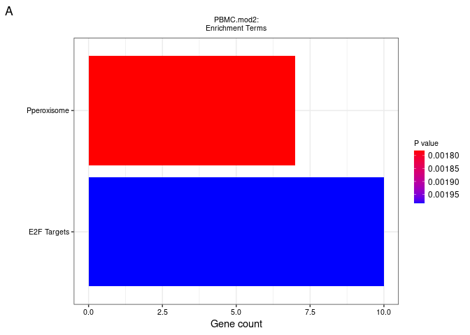<!-- -->

``` r
mod14paths <- subset(sigpaths2, module_name %in% 'mod14' & enrichment_category %in% c('MSigDB_Hallmark_2020','KEGG_2021_Human'))
mod14paths<-mod14paths[-c(10:14),]
panelD<- if (websiteLive) plotEnrich(mod14paths, showTerms = 10, numChar = 80, y = "Count", orderBy = "Adjusted.P.value",
                            title='PBMC.mod14:\nEnrichment Terms', xlab='')+
  labs( tag = "D")+theme(axis.text=element_text(size=8),plot.title= element_text(size=8,hjust=-0.5))+
  theme(legend.key.size = unit(0.4, "cm"))+theme(legend.title=element_text(size=8))
ggsave(file = file.path(out_dir, "main_D.pdf"), device='pdf', width=6, height=4.6)
panelD
```

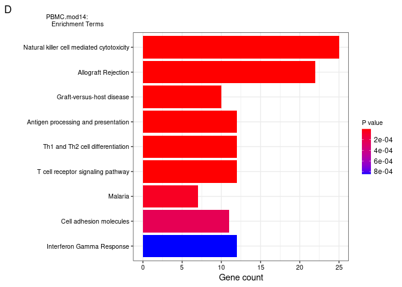<!-- -->

``` r
mod8paths <- subset(sigpaths2, module_name %in% 'mod8' & enrichment_category %in% c('MSigDB_Hallmark_2020','KEGG_2021_Human'))
panelG<-if (websiteLive) plotEnrich(mod8paths, showTerms = 9, numChar = 80, y = "Count", orderBy = "P.value",
                            title='PBMC.mod8:\nEnrichment Terms', xlab='')+
  labs( tag = "G")+theme(axis.text=element_text(size=8),plot.title= element_text(size=8,hjust=0))+
  theme(legend.key.size = unit(0.4, "cm"))+theme(legend.title=element_text(size=8))

ggsave(file = file.path(out_dir, "main_G.pdf"), device='pdf', width=6, height=4.6)
panelG
```

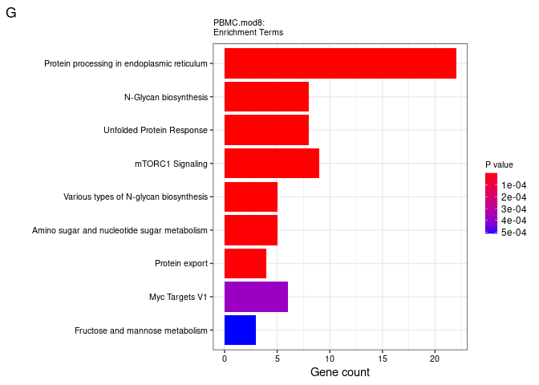<!-- -->

### Panels B,E,H: analysis code

``` r
# subset the data to only get 'Visit 1'
data_use_visit1 <- ret$MEs %>%
  rownames_to_column(var = "sample_id_from_batchlayout") %>%
  merge(y  = select(clinical_data, 
                    sample_id_from_batchlayout, 
                    event_type,
                    trajectory_group,
                    enrollment_site,
                    discretized_admit_age_quantile,
                    sex),
        by = "sample_id_from_batchlayout") %>%
  filter(event_type %in% "Visit 1" &
         !is.na(trajectory_group)) %>%
  mutate_if(is.character, as.factor) %>%
  mutate(trajectory_group = factor(trajectory_group)) %>%
  select(-event_type) %>%
  column_to_rownames(var = "sample_id_from_batchlayout")

# a model with only intercept and random effect across sites
module_names <- grep(pattern = "mod", names(data_use_visit1), value = TRUE)
res_table_ordinal <- NULL
data_use <- data_use_visit1
for (moduleName in module_names) {
  my.formula0 <- paste0('trajectory_group~ 1+(1|enrollment_site)+',
                        'discretized_admit_age_quantile+sex')
  my.formula1 <- paste0('trajectory_group~',
                        moduleName,
                        '+(1|enrollment_site)+',
                        'discretized_admit_age_quantile+sex')
  res <- mixed_ordinal(my.formula0, 
                       my.formula1,
                       data_use = data_use_visit1)
  coef(clmm(formula(my.formula1), 
            data = data_use_visit1))[moduleName] %>%
    unname() %>%
    c(res, coef = .) -> res
  res_table_ordinal <- rbind(res_table_ordinal, res)
}
rownames(res_table_ordinal) <- module_names
res_table_ordinal <- res_table_ordinal %>%
  as.data.frame() %>%
   mutate(qval =  qvalue::qvalue(pval, fdr.level = 0.05, pi0 = 1)$qvalues)
```

### Panels B,E,H: output generation code

``` r
library(ggbeeswarm)
panelB <- data_use_visit1 %>%
  rownames_to_column(var = "sample_id") %>%
  select(sample_id, mod2, trajectory_group) %>%
  pivot_longer(cols = -c(sample_id, trajectory_group)) %>%
  mutate(name             = "PBMC.mod2:\nIL-6, IFNG Signaling",
         trajectory_group = paste0("TG", trajectory_group)) %>%
  ggplot(mapping = aes(x = trajectory_group, y = value)) +
  geom_beeswarm(mapping = aes(color = trajectory_group), cex = 1.5, size = 0.8) +
  geom_boxplot(fill = "transparent", outlier.color= "transparent") +
  facet_wrap(facets= ~name, ncol = 1) + 
  labs(y = "Eigenvalue", x = "Clinical trajectory group", tag = "B") +
  scale_color_manual(values = c("TG1" = "#639A21",
                                "TG2" = "#39828C",
                                "TG3" = "#6371AD",
                                "TG4" = "#BD7D31",
                                "TG5" = "#9C3418")) +
  theme_bw() +
  theme(legend.pos = "none", axis.title.x = element_text(size = 9))
ggsave(file = file.path(out_dir, "main_B.pdf"), device='pdf', width=6, height=4.6)
panelB
```

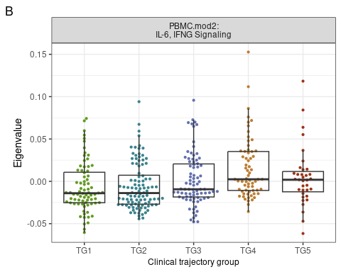<!-- -->

``` r
panelE <- data_use_visit1 %>%
  rownames_to_column(var = "sample_id") %>%
  select(sample_id, mod14, trajectory_group) %>%
  pivot_longer(cols = -c(sample_id, trajectory_group)) %>%
  mutate(name             = "PBMC.mod14:\nTh Cell Differentiation",
         trajectory_group = paste0("TG", trajectory_group)) %>%
  ggplot(mapping = aes(x = trajectory_group, y = value)) +
  geom_beeswarm(mapping = aes(color = trajectory_group), cex = 1.5, size = 0.8) +
  geom_boxplot(fill = "transparent", outlier.color= "transparent") +
  facet_wrap(facets= ~name, ncol = 1) + 
  labs(y = "Eigenvalue", x = "Clinical trajectory group", tag = "E") +
  scale_color_manual(values = c("TG1" = "#639A21",
                                "TG2" = "#39828C",
                                "TG3" = "#6371AD",
                                "TG4" = "#BD7D31",
                                "TG5" = "#9C3418")) +
  theme_bw() +
  theme(legend.pos = "none", axis.title.x = element_text(size = 9))
ggsave(file = file.path(out_dir, "main_E.pdf"), device='pdf', width=6, height=4.6)
panelE
```

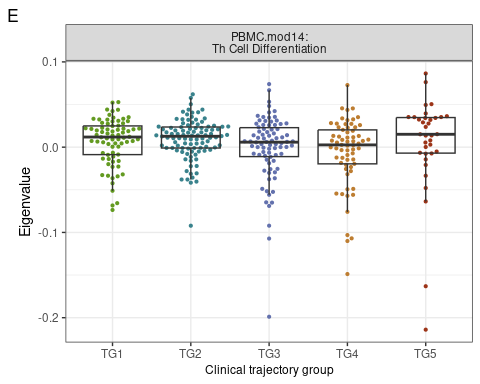<!-- -->

``` r
panelH <- data_use_visit1 %>%
  rownames_to_column(var = "sample_id") %>%
  select(sample_id, mod8, trajectory_group) %>%
  pivot_longer(cols = -c(sample_id, trajectory_group)) %>%
  mutate(name             = "PBMC.mod8:\nTNF alpha Signaling",
         trajectory_group = paste0("TG", trajectory_group)) %>%
  ggplot(mapping = aes(x = trajectory_group, y = value)) +
  geom_beeswarm(mapping = aes(color = trajectory_group), cex = 1.5, size = 0.8) +
  geom_boxplot(fill = "transparent", outlier.color= "transparent") +
  facet_wrap(facets= ~name, ncol = 1) + 
  labs(y = "Eigenvalue", x = "Clinical trajectory group", tag = "H") +
  scale_color_manual(values = c("TG1" = "#639A21",
                                "TG2" = "#39828C",
                                "TG3" = "#6371AD",
                                "TG4" = "#BD7D31",
                                "TG5" = "#9C3418")) +
  theme_bw() +
  theme(legend.pos = "none", axis.title.x = element_text(size = 9))
ggsave(file = file.path(out_dir, "main_H.pdf"), device='pdf', width=6, height=4.6)
panelH
```

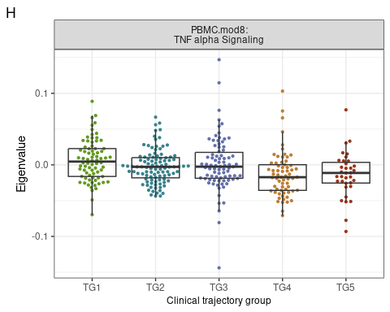<!-- -->

### Panel C,F,I: analysis code

``` r
data_use<- ret$MEs %>%
  rownames_to_column(var = "sample_id_from_batchlayout") %>%
  merge(y  = select(clinical_data, 
                    sample_id_from_batchlayout, 
                    event_date,
                    trajectory_group,
                    enrollment_site,
                    discretized_admit_age_quantile,
                    sex,
                    participant_id),
        by = "sample_id_from_batchlayout") %>%
  filter(!is.na(trajectory_group)) %>%
  filter(duplicated(participant_id) | duplicated(participant_id, fromLast = TRUE)) %>%
  mutate_if(is.character, as.factor) %>%
  mutate(trajectory_group = factor(trajectory_group)) %>%
  pivot_longer(cols = -c("sample_id_from_batchlayout", "event_date", "participant_id",
                         "enrollment_site", "trajectory_group",
                         "discretized_admit_age_quantile", "sex")) %>%
  mutate(discretized_admit_age_quantile= factor(discretized_admit_age_quantile)) %>%
  filter(!is.na(value))

## smooth spline takes a long time, demonstrating by cutting down to just ten factors
smooth_spline_model_loop2 <- model_loop(data_use, 
                                       modelType = "smoothSpline", 
                                       endpoint  = "trajectory_group")

linear_model_loop2 <- model_loop(data_use, 
                                       modelType = "lme", 
                                       endpoint  = "trajectory_group")
```

### Panel C,F,I: output generation code

``` r
exampleDF <- data_use %>%
  dplyr::filter(name %in% "mod2") %>%
  mutate(trajectory_group = ordered(as.factor(as.character(trajectory_group)), 
                                    levels = c("1", "2", "3", "4", "5")))

plotExample <- plot_model(exampleDF, 
                          model_loop     = smooth_spline_model_loop2, 
                          modelType      = "smoothSpline", 
                          p_adjust       = NA, 
                          endpoint       = "trajectory_group", 
                          signif_markers = FALSE,
                          remove_NS      = TRUE, 
                          bar_height     = 6.5)
```

    ## Warning: Using `size` aesthetic for lines was deprecated in ggplot2 3.4.0.
    ## ℹ Please use `linewidth` instead.
    ## This warning is displayed once every 8 hours.
    ## Call `lifecycle::last_lifecycle_warnings()` to see where this warning was
    ## generated.

    ## Warning: `aes_string()` was deprecated in ggplot2 3.0.0.
    ## ℹ Please use tidy evaluation ideoms with `aes()`
    ## This warning is displayed once every 8 hours.
    ## Call `lifecycle::last_lifecycle_warnings()` to see where this warning was
    ## generated.

``` r
plotMod2 <- plotExample$data %>%
  mutate(trajectory_group = paste0("TG", trajectory_group)) %>%
  ggplot(mapping = aes(x = event_date, y = value)) +
    geom_line(mapping = aes(group = participant_id, y = value), 
              color   = 'gray',
              alpha   = 0.4) +
    geom_line(mapping = aes(group = participant_id, y = yhat), 
              size    = 0.6, 
              alpha   = 0.5,
              color   = "black") +
    geom_point(mapping = aes(color = trajectory_group)) +
    geom_line(data    = mutate(get("pred", plotExample$plot_env),
                               trajectory_group = paste0("TG", 
                                                         trajectory_group)),
              mapping = aes(group = trajectory_group, y = predicted),
                           color = "black", size = 1.5) +
    facet_wrap(facets = ~trajectory_group, nrow = 1) +
    labs(y = "Eigenvalue",  x = "Days from admission",  tag = "C") +
    scale_color_manual(values= c("TG1"  = "#639A21",
                                 "TG2"  = "#39828C",
                                 "TG3"  = "#6371AD", 
                                 "TG4"  = "#BD7D31",
                                 "TG5"  = "#9C3418")) +
  coord_cartesian(xlim = c(0, 42)) +
  theme_bw() +
  theme(legend.pos = "none",
        panel.grid.minor = element_blank())

print(plotMod2)
```

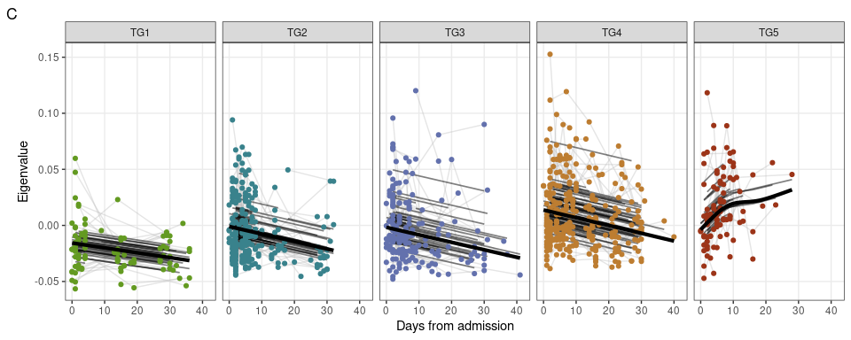<!-- -->

``` r
pdf(file.path(out_dir, "main_C.pdf"), width=10, height = 4)
print(plotMod2)
dev.off()
```

    ## png 
    ##   2

``` r
exampleDF <- data_use %>%
  filter(name %in% "mod14") %>%
  mutate(trajectory_group = ordered(as.factor(as.character(trajectory_group)), 
                                    levels = c("1", "2", "3", "4", "5")))

plotExample <- plot_model(exampleDF, 
                          model_loop     = smooth_spline_model_loop2, 
                          modelType      = "smoothSpline", 
                          p_adjust       = NA, 
                          endpoint       = "trajectory_group", 
                          signif_markers = FALSE,
                          remove_NS      = TRUE, 
                          bar_height     = 6.5)

plotExample <- plot_model(exampleDF, 
                          model_loop     = linear_model_loop2, 
                          modelType      = "lme", 
                          p_adjust       = NA, 
                          endpoint       = "trajectory_group", 
                          signif_markers = FALSE,
                          remove_NS      = TRUE, 
                          bar_height     = 6.5)

plotMod14 <- plotExample$data %>%
  mutate(trajectory_group = paste0("TG", trajectory_group)) %>%
  ggplot(mapping = aes(x = event_date, y = value)) +
    geom_line(mapping = aes(group = participant_id, y = value), 
              color   = 'gray',
              alpha   = 0.4) +
    geom_line(mapping = aes(group = participant_id, y = yhat), 
              size    = 0.6, 
              alpha   = 0.5,
              color   = "black") +
    geom_point(mapping = aes(color = trajectory_group)) +
    geom_line(data    = mutate(get("pred", plotExample$plot_env),
                               trajectory_group = paste0("TG", 
                                                         trajectory_group)),
              mapping = aes(group = trajectory_group, y = predicted),
                           color = "black", size = 1.5) +
    facet_wrap(facets = ~trajectory_group, nrow = 1) +
    labs(y = "Eigenvalue",  x = "Days from admission",  tag = "F") +
    scale_color_manual(values= c("TG1"  = "#639A21",
                                 "TG2"  = "#39828C",
                                 "TG3"  = "#6371AD", 
                                 "TG4"  = "#BD7D31",
                                 "TG5"  = "#9C3418")) +
  coord_cartesian(xlim = c(0, 42)) +
  theme_bw() +
  theme(legend.pos = "none",
        panel.grid.minor = element_blank())

print(plotMod14)
```

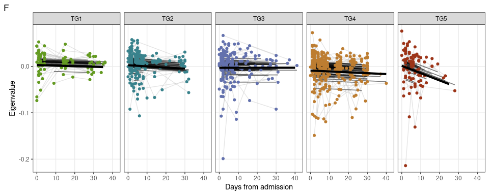<!-- -->

``` r
pdf(file.path(out_dir, "main_F.pdf"), width=10, height = 4)
print(plotMod14)
dev.off()
```

    ## png 
    ##   2

``` r
#exampleDF <- inputDF_dfso %>%
#  filter(name %in% "mod8") %>%
#  mutate(trajectory_group = ordered(as.factor(as.character(trajectory_group)), 
#                                    levels = c("1", "2", "3", "4", "5")))

exampleDF <- data_use %>%
  filter(name %in% "mod8") %>%
  mutate(trajectory_group = ordered(as.factor(as.character(trajectory_group)), 
                                    levels = c("1", "2", "3", "4", "5")))


#plotExample <- plot_model(exampleDF, 
#                          model_loop     = smooth_spline_model_loop_dfso, 
#                          modelType      = "smoothSpline", 
#                          p_adjust       = NA, 
#                          endpoint       = "trajectory_group", 
#                          signif_markers = FALSE,
#                          remove_NS      = TRUE, 
#                          bar_height     = 6.5)

plotExample <- plot_model(exampleDF, 
                          model_loop     = smooth_spline_model_loop2, 
                          modelType      = "smoothSpline", 
                          p_adjust       = NA, 
                          endpoint       = "trajectory_group", 
                          signif_markers = FALSE,
                          remove_NS      = TRUE, 
                          bar_height     = 6.5)


plotMod8 <- plotExample$data %>%
  mutate(trajectory_group = paste0("TG", trajectory_group)) %>%
  ggplot(mapping = aes(x = event_date, y = value)) +
    geom_line(mapping = aes(group = participant_id, y = value), 
              color   = 'gray',
              alpha   = 0.4) +
    geom_line(mapping = aes(group = participant_id, y = yhat), 
              size    = 0.6, 
              alpha   = 0.5,
              color   = "black") +
    geom_point(mapping = aes(color = trajectory_group)) +
    geom_line(data    = mutate(get("pred", plotExample$plot_env),
                               trajectory_group = paste0("TG", 
                                                         trajectory_group)),
              mapping = aes(group = trajectory_group, y = predicted),
                           color = "black", size = 1.5) +
    facet_wrap(facets = ~trajectory_group, nrow = 1) +
    labs(y = "Eigenvalue",  x = "Days from admission",  tag = "I") +
    scale_color_manual(values= c("TG1"  = "#639A21",
                                 "TG2"  = "#39828C",
                                 "TG3"  = "#6371AD", 
                                 "TG4"  = "#BD7D31",
                                 "TG5"  = "#9C3418")) +
  coord_cartesian(xlim = c(0, 42)) +
  theme_bw() +
  theme(legend.pos = "none",
        panel.grid.minor = element_blank())

print(plotMod8)
```

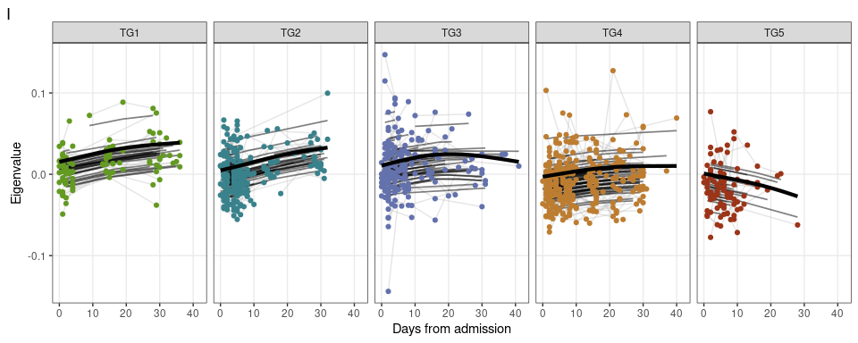<!-- -->

``` r
pdf(file.path(out_dir, "main_I.pdf"), width=10, height = 4)
print(plotMod8)
dev.off()
```

    ## png 
    ##   2

\#\#\#Panel J: analysis code

``` r
#######complex heatmap##########
sigpaths_heatmap <-subset(sigpaths, sigpaths$module_name %in% c('mod2','mod14','mod8'))
sigpaths_heatmap<-subset(sigpaths_heatmap, Term %in% c('TNF-alpha Signaling via NF-kB','IL-2/STAT5 Signaling','T cell receptor signaling pathway'))
sigpaths_heatmap<-sigpaths_heatmap %>% group_by(module_name) %>% top_n(10, -P.value)

heatmapgenes <- unique(unlist(strsplit(sigpaths_heatmap$Genes, split=";")))

heatmapgenes<-subset(genes_pc, genes_pc$gene_name %in% heatmapgenes)

#heatmap<- data_heatmap[,rownames(heatmapgenes)]
heatmap2<- voomCounts_batch_corr_input$E[rownames(heatmapgenes),]

#heatmap<-t(heatmap)
#order heatmap

###### ImmPort-specific column idx (original: c(5,19))
annotation_row <- clinical_meta_data %>% select(c("event_type", "trajectory_group"))
#colnames(annotation_row)[2] <- 'TG'
heatmap2<-heatmap2[,rownames(annotation_row)]
genesymbols<-subset(heatmapgenes, rownames(heatmapgenes) %in% rownames(heatmap2))
rownames(heatmap2)<-genesymbols$gene_name

#pheatmap::pheatmap(heatmap2, show_colnames = F, annotation_col = annotation_row[,3,drop=F], cluster_cols = F, scale='none',fontsize_row = 7)

#row annotation genes

#melt and split values
library(splitstackshape)
test<-cSplit(sigpaths_heatmap, "Genes", sep = ";", direction = "long")
test <- test %>% group_by(Genes) %>% filter(n()==1)
test<-as.data.frame(test)
test$Genes<-as.character(test$Genes)
rownames(test)<-test$Genes

#pheatmap::pheatmap(heatmap2[test$Genes,], show_colnames = F, annotation_col = annotation_row[,3,drop=F], cluster_cols = F,
 #                  scale='none',fontsize_row = 7,
 #                  annotation_row = test[,c(3,1)])

Jmatrix <- heatmap2[test$Genes,]
Jrowannotation <- test[,c(3,1)]
Jrowannotation$Term<-ifelse(Jrowannotation$Term %in% 'T cell receptor signaling pathway','TCRsignaling',Jrowannotation$Term)
Jcolannotation <- annotation_row[,1:2,drop=F]

#saveRDS(heatmap2[test$Genes,], file='/scratch/pbmc-transcriptomics/moduleheatmapmatrix.rds')
#saveRDS(test[,c(3,1)], file='/scratch/pbmc-transcriptomics/moduleheatmaprowannotation.rds')
#saveRDS(annotation_row[,2,drop=F], file='/scratch/pbmc-transcriptomics/moduleheatmapcolannotation.rds')
```

\#\#\#Panel J: output generation

``` r
#######complex heatmap##########

mt <- Jmatrix
col_1 <- Jcolannotation
row_1 <- Jrowannotation

col_1<-col_1[with(col_1, order(trajectory_group, event_type)), ]

row_2 <- row_1 %>%
  tidyr::separate(Term, into = c("short_term", "V2"), sep = " ") %>%
  mutate(module_term = paste0(module_name, "_", short_term)) %>%
  mutate(module_term = factor(module_term, levels = c("mod2_TNF-alpha", "mod8_TNF-alpha", "mod2_IL-2/STAT5", "mod14_IL-2/STAT5",'mod14_TCRsignaling','mod2_TCRsignaling')))
```

    ## Warning: Expected 2 pieces. Missing pieces filled with `NA` in 12 rows [1, 2, 3,
    ## 4, 5, 6, 7, 8, 9, 10, 11, 12].

``` r
row_2$module_term = as.character(row_2$module_term)
row_2$module_term[row_2$module_term=='mod2_TNF-alpha'] <- 'mod2_TNFa-NFkB'
row_2$module_term[row_2$module_term=='mod8_TNF-alpha'] <- 'mod8_TNFa-NFkB'

mt_2 <- apply(mt, 2, scale) %>% `rownames<-`(rownames(mt))

trajectory_group <- col_1$trajectory_group
event_type <- col_1$event_type

all(rownames(row_2) == rownames(mt))
```

    ## [1] TRUE

``` r
trajectory_group <- col_1$trajectory_group
TrajGrpCol <- c("1" = "#639A21", "2" = "#39828C", "3" = "#6371AD", "4" = "#BD7D31", "5" = "#9C3418")

#module_col <- c("PBMC_mod2_TNF-alpha" = "red", "PBMC_mod8_TNF-alpha" = "blue", "PBMC_mod2_IL-2/STAT5" = "green", "PBMC_mod14_IL-2/STAT5" = "magenta","PBMC_mod2_TCRsignaling" = "black","PBMC_mod14_TCRsignaling" = "cyan")

module_col <- c("PBMC_mod2_TNFa-NFkB" = "red", "PBMC_mod8_TNFa-NFkB" = "blue", "PBMC_mod2_IL-2/STAT5" = "green", "PBMC_mod14_IL-2/STAT5" = "magenta","PBMC_mod2_TCRsignaling" = "black","PBMC_mod14_TCRsignaling" = "cyan")


#https://github.com/jokergoo/ComplexHeatmap/issues/313
scaled_mat = t(scale(t(mt_2)))
scaled_mat<-scaled_mat[,rownames(col_1)]

library(circlize)
```

    ## ========================================
    ## circlize version 0.4.13
    ## CRAN page: https://cran.r-project.org/package=circlize
    ## Github page: https://github.com/jokergoo/circlize
    ## Documentation: https://jokergoo.github.io/circlize_book/book/
    ## 
    ## If you use it in published research, please cite:
    ## Gu, Z. circlize implements and enhances circular visualization
    ##   in R. Bioinformatics 2014.
    ## 
    ## This message can be suppressed by:
    ##   suppressPackageStartupMessages(library(circlize))
    ## ========================================

    ## 
    ## Attaching package: 'circlize'

    ## The following object is masked from 'package:igraph':
    ## 
    ##     degree

``` r
col_fun = colorRamp2(c(-3,-1.5, 0, 1.5,3), c("darkblue", "blue", "white", "red","darkred"))
col_fun = colorRamp2(c(-1.5, 0 ,1.5), c("blue", "white", "red"))

col_fun(seq(-3, 3))
```

    ## [1] "#0000FFFF" "#0000FFFF" "#9265FFFF" "#FFFFFFFF" "#FF7B5AFF" "#FF0000FF"
    ## [7] "#FF0000FF"

``` r
library(ComplexHeatmap)
row_2$module_term<- paste('PBMC_',row_2$module_term,sep='')
set.seed(4)
p <- ComplexHeatmap::Heatmap(scaled_mat, 
                             clustering_method_columns = 'complete',
                             cluster_columns = F,col = col_fun,
                             column_title_rot = 0, 
                             column_title_gp = gpar(fontsize=10), 
                             row_split = row_2$module_term,
                             column_split = trajectory_group,
                             heatmap_legend_param = list(title = "z-score"),
                             show_column_names = FALSE, 
                             row_title_gp = gpar(fontsize = 8),
                             row_names_gp = gpar(fontsize = 6),
                             row_title_rot =0,
                             show_row_names = TRUE, 
                             top_annotation = columnAnnotation(TG = trajectory_group,visit=event_type, col=list(TG =  TrajGrpCol)), 
                             left_annotation = rowAnnotation(modules = row_2$module_term,                                        col=list(modules = module_col)))


print(p)
```

<!-- -->

``` r
pdf(file.path(out_dir, "main_J.pdf"), width=15, height = 10)
print(p)
dev.off()
```

    ## png 
    ##   2

\#\#\#Plot grid main

``` r
library(ggplotify)
p<- as.ggplot(p)
#p<- p+labs(tag='J')
#to nest plots
#ggarrange(panelA,visit1Mod2,plotMod2,
#         panelD,visit1Mod1,plotMod1,
#          panelG,visit1Mod14,plotMod14,
#          ggarrange(p,ncol=1),ncol=3) 
         
abc <- plot_grid(panelA,panelB,plotMod2, ncol = 3,rel_widths = c(1.4,0.8,1.6))
def<- plot_grid(panelD,panelE,plotMod14, ncol=3,rel_widths = c(1.4,0.8,1.6) )
ghi <- plot_grid(panelG,panelH,plotMod8, ncol=3,rel_widths = c(1.4,0.8,1.6))
j <- plot_grid(p, ncol=1,scale=0.95,hjust=-0.5,labels='J',label_fontface='plain')
combined<-plot_grid(abc,def,ghi, j, nrow = 4, align='hv',rel_heights = c(1,1,1,4))

print(combined)
```

<!-- -->

``` r
pdf(file.path(out_dir, "main_Combined.pdf"), width=15, height = 18)
print(combined)
dev.off()
```

    ## png 
    ##   2

### Supp Panel A: analysis + output

Before correction

``` r
#get principal components
pc <- prcomp(t(counts1)) #before correction

plotDF <- pc$x[, 1:2] %>%
  as.data.frame() %>%
  rownames_to_column(var = "sample_id_from_batchlayout") %>%
  # merge(y = clinical_data, by = "sample_id") %>%
  merge(y  = clinical_meta_data_batch_corr, by = "sample_id_from_batchlayout") 

enrollmentSite2color <- rainbow(n = length(unique(plotDF$enrollment_site))) %>%
  setNames(nm = unique(plotDF$enrollment_site))

plotPCAbefore <- ggplot(data = plotDF,
       mapping = aes(x = PC1, y = PC2, color = enrollment_site))+
  geom_point(size = 3, alpha = 0.7) +
  scale_color_manual(values = enrollmentSite2color) +
  scale_shape_manual(values = c(21, 23))+
  stat_ellipse()+
  labs(x     = paste0("1st dimension (",
                      round((pc$sdev^2/sum(pc$sdev^2))[1] * 100,1),
                      "%)"),
       y     = paste0("2nd dimension (",
                      round((pc$sdev^2/sum(pc$sdev^2))[2] * 100,1),
                      "%)")) +
  theme(legend.text     = element_text(size = 9),
        legend.key.size = unit(0.01, units = "npc")) +
  theme_bw() +
  theme(legend.position = "none")
  # labs(color="")

print(plotPCAbefore)
```

    ## Warning in MASS::cov.trob(data[, vars]): Probable convergence failure

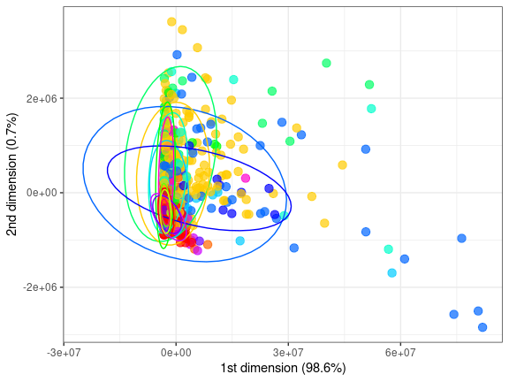<!-- -->

``` r
pdf(file.path(out_dir, "supp_A.pdf"), width=8, height = 8)
print(plotPCAbefore)
```

    ## Warning in MASS::cov.trob(data[, vars]): Probable convergence failure

``` r
dev.off()
```

    ## png 
    ##   2

### Supp Panel B: analysis + output

``` r
#get principal components
pc <- prcomp(t(exp_batch_corr_output_with_design))

plotDF <- pc$x[, 1:2] %>%
  as.data.frame() %>%
  rownames_to_column(var = "sample_id_from_batchlayout") %>%
  # merge(y = clinical_data, by = "sample_id") %>%
  merge(y  = clinical_meta_data_batch_corr, by = "sample_id_from_batchlayout") 

enrollmentSite2color <- rainbow(n = length(unique(plotDF$enrollment_site))) %>%
  setNames(nm = unique(plotDF$enrollment_site))

plotPCA <- ggplot(data = plotDF,
       mapping = aes(x = PC1, y = PC2, color = enrollment_site))+
  geom_point(size = 3, alpha = 0.7) +
  scale_color_manual(values = enrollmentSite2color) +
  scale_shape_manual(values = c(21, 23))+
  stat_ellipse()+
  labs(x     = paste0("1st dimension (",
                      round((pc$sdev^2/sum(pc$sdev^2))[1] * 100,1),
                      "%)"),
       y     = paste0("2nd dimension (",
                      round((pc$sdev^2/sum(pc$sdev^2))[2] * 100,1),
                      "%)")) +
  theme(legend.text     = element_text(size = 9),
        legend.key.size = unit(0.01, units = "npc")) +
  theme_bw() +
  theme(legend.position = "none")
  # labs(color="")

print(plotPCA)
```

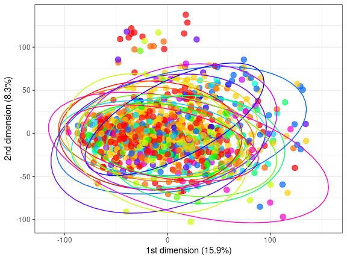<!-- -->

``` r
pdf(file.path(out_dir, "supp_B.pdf"), width=8, height = 8)
print(plotPCA)
dev.off()
```

    ## png 
    ##   2

\#\#\#Supp Panel C: analysis + output
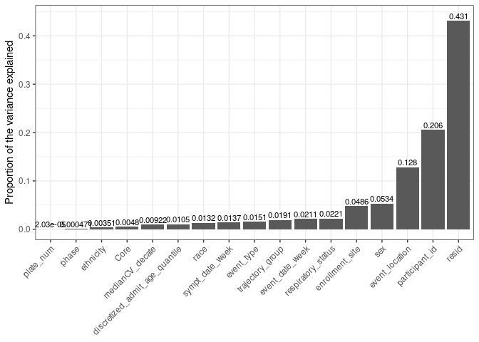<!-- -->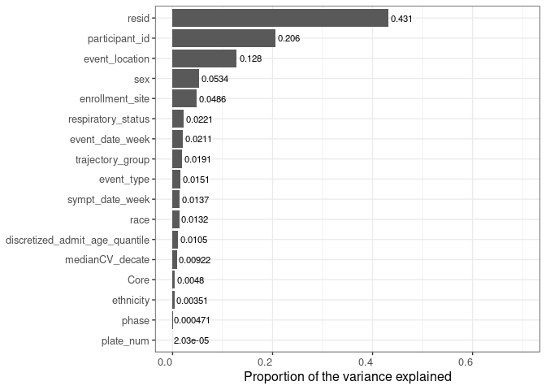<!-- --><!-- -->

    ## png 
    ##   2

### Supp Panel D: analysis + output

``` r
#pheatmap final
sigmods<-subset(res_table_ordinal, qval<0.05 )

sigmods2<-subset(smooth_spline_model_loop2, smooth_spline_model_loop2$adjp.slope<0.05 & smooth_spline_model_loop2$adjp.intercept<0.05 )
#setdiff(rownames(sigmods),rownames(sigmods2))
sigmods<-intersect(rownames(sigmods),rownames(sigmods2))

heatmap_data <-ret$MEs
heatmap_data <- heatmap_data[,rownames(sigmods2)]
annotation_col <- as.data.frame(colnames(heatmap_data))
rownames(annotation_col) <- annotation_col$`colnames(heatmap_data)`

annotation_col<-annotation_col[,-1, drop=F]

annotation_row <- pvca_input_phenodata[, c(8,17)]
annotation_row <- annotation_row[with(annotation_row, order(trajectory_group, event_type)),]
annotation_row$trajectory_group <-as.factor(annotation_row$trajectory_group)

#heatmap_data<- heatmap_data[ order(match(colnames(heatmap_data), rownames(annotation_row))), ]
heatmap_data <- heatmap_data[match(rownames(annotation_row), rownames(heatmap_data)),]

colnames(heatmap_data)<-paste('pbmc_',colnames(heatmap_data),sep='')
colnames(annotation_row)[2]<-'TG'

pheatmap<-pheatmap::pheatmap(heatmap_data,color = colorRampPalette(rev(brewer.pal(n = 5, name =                           "RdBu")))(50),annotation_row = annotation_row[,c(2),drop=F],
                labels_row = T, annotation_names_col = F, scale = 'row', cluster_rows = F,fontsize_row = 0.0001)

print(pheatmap)
```

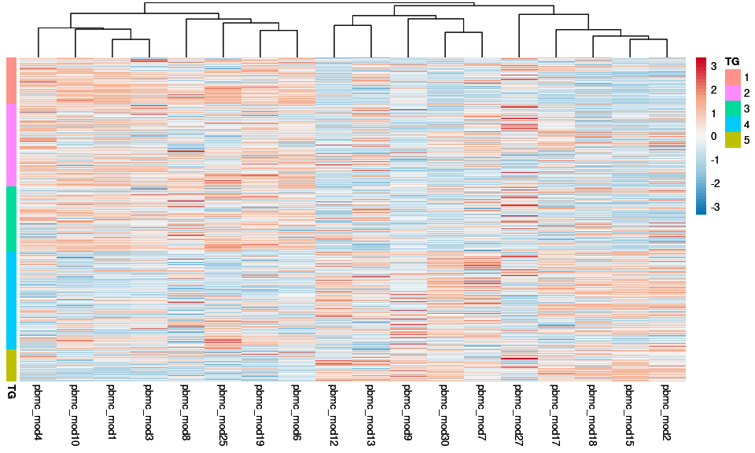<!-- -->

``` r
pdf(file.path(out_dir, "supp_D.pdf"), width=8, height = 8)
print(pheatmap)
dev.off()
```

    ## png 
    ##   2

### Supp Panel D (for manuscript): analysis + output

``` r
library(ComplexHeatmap)

mat <- heatmap_data %>%
  scale()
#columnAnnotDF <- wgcnaRes$module_membership[match(colnames(mat), 
#                                   table =  wgcnaRes$module_membership$feature), ] %>%
#  remove_rownames() %>%
#  column_to_rownames(var = "feature") 
#columnAnnot <- 
 # HeatmapAnnotation(df  = columnAnnotDF,
#                    col = list(module = setNames(c("grey", standardColors()[1:6]),
#                               nm     = sort(unique(wgcnaRes$module_membership$module)))))

rowAnnotDF <- clinical_data %>%
  select(sample_id_from_batchlayout, trajectory_group) %>%
  mutate(trajectory_group = paste0("TG", trajectory_group)) %>%
  .[match(rownames(heatmap_data), table = .$sample_id_from_batchlayout), ] %>%
  `rownames<-`(NULL) %>%
  column_to_rownames(var = "sample_id_from_batchlayout") 
rowAnnot <- rowAnnotation(df  = rowAnnotDF,
                          col = list(trajectory_group = c("TG1" = "#639A21",
                                                          "TG2" = "#39828C",
                                                          "TG3" = "#6371AD", 
                                                          "TG4" = "#BD7D31",
                                                          "TG5" = "#9C3418")),
                          show_annotation_name = FALSE)
set.seed(seed = 1)
modheatmap2 = Heatmap(matrix  = mat,
        left_annotation   = rowAnnot,
        #top_annotation    = columnAnnot,
        #column_split      = columnAnnotDF$module,
        row_split         = rowAnnotDF$trajectory_group,
        show_row_names    = FALSE,
        column_names_gp   = gpar(fontsize = 8),
        column_title_rot  = 90,
        name              = "z-score")

print(modheatmap2)
```

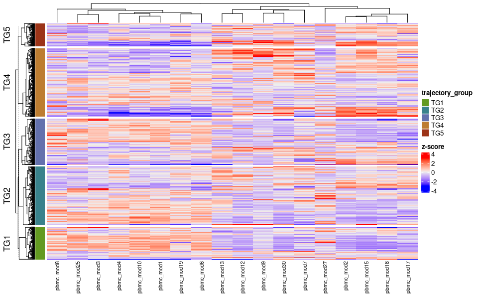<!-- -->

``` r
pdf(file.path(out_dir, "supp_D.pdf"), width=8, height = 8)
print(modheatmap2)
dev.off()
```

    ## png 
    ##   2

### Supplementary Table A: output generation code

``` r
supTab_modules <- ret$module_membership %>% 
  arrange(module) %>%
  rename(Module  = module,
         Feature = feature) %>%
  select(Module, Feature) %>%
  `rownames<-`(NULL)

supTab_modules %>%
  head() %>%
  kable()
```

| Module | Feature         |
|:-------|:----------------|
| mod0   | ENSG00000001630 |
| mod0   | ENSG00000002726 |
| mod0   | ENSG00000002933 |
| mod0   | ENSG00000003096 |
| mod0   | ENSG00000003393 |
| mod0   | ENSG00000003987 |

``` r
write_csv(supTab_modules, file = file.path(out_dir, "pbmc-transcriptomics_Modules.csv") )
```

### Supp Panel E: analysis + output

``` r
library(gage)
library(gageData)
data(kegg.sets.hs)
data(sigmet.idx.hs)
kegg.sets.hs = kegg.sets.hs[sigmet.idx.hs]
library(R.utils)
```

    ## Loading required package: R.oo

    ## Loading required package: R.methodsS3

    ## R.methodsS3 v1.8.1 (2020-08-26 16:20:06 UTC) successfully loaded. See ?R.methodsS3 for help.

    ## R.oo v1.24.0 (2020-08-26 16:11:58 UTC) successfully loaded. See ?R.oo for help.

    ## 
    ## Attaching package: 'R.oo'

    ## The following object is masked from 'package:R.methodsS3':
    ## 
    ##     throw

    ## The following objects are masked from 'package:rlang':
    ## 
    ##     abort, ll

    ## The following object is masked from 'package:igraph':
    ## 
    ##     hierarchy

    ## The following objects are masked from 'package:methods':
    ## 
    ##     getClasses, getMethods

    ## The following objects are masked from 'package:base':
    ## 
    ##     attach, detach, load, save

    ## R.utils v2.10.1 (2020-08-26 22:50:31 UTC) successfully loaded. See ?R.utils for help.

    ## 
    ## Attaching package: 'R.utils'

    ## The following object is masked from 'package:ComplexHeatmap':
    ## 
    ##     draw

    ## The following object is masked from 'package:rlang':
    ## 
    ##     env

    ## The following object is masked from 'package:tidyr':
    ## 
    ##     extract

    ## The following object is masked from 'package:utils':
    ## 
    ##     timestamp

    ## The following objects are masked from 'package:base':
    ## 
    ##     cat, commandArgs, getOption, inherits, isOpen, nullfile, parse,
    ##     warnings

``` r
library(gplots)
```

    ## 
    ## Attaching package: 'gplots'

    ## The following object is masked from 'package:stats':
    ## 
    ##     lowess

``` r
library(ggplot2)
library(pathview)
```

    ## 

    ## ##############################################################################
    ## Pathview is an open source software package distributed under GNU General
    ## Public License version 3 (GPLv3). Details of GPLv3 is available at
    ## http://www.gnu.org/licenses/gpl-3.0.html. Particullary, users are required to
    ## formally cite the original Pathview paper (not just mention it) in publications
    ## or products. For details, do citation("pathview") within R.
    ## 
    ## The pathview downloads and uses KEGG data. Non-academic uses may require a KEGG
    ## license agreement (details at http://www.kegg.jp/kegg/legal.html).
    ## ##############################################################################

``` r
annot <- read.table("../files/human_ens_GRCh38_annot.extended.v2.txt", sep="\t", quote="", header=T, row.names=1, stringsAsFactors=F, fill=T)
allpathways = read.csv(file.path(out_dir, "pbmc-transcriptomics_Modules.csv"))
mod2_8 = allpathways[allpathways$Module %in% c("mod2","mod8"),]
mod2_8$FC = 1
mod2_8$FC[mod2_8$Module == "mod8"] = -1
class(mod2_8$FC) = "character"
mod2_8_annot = merge(mod2_8,annot,by.x="Feature",by.y="Ensembl_ID")

foldchanges = mod2_8_annot$FC
foldchanges = as.numeric(foldchanges)
names(foldchanges) = mod2_8_annot$Feature
foldchanges <- foldchanges[!is.na(names(foldchanges))]

mod2_8_mat = mod2_8
mod2_8_mat = mod2_8_mat[,-c(1)]
mod2_8_mat$Rep1 = 0
mod2_8_mat$Rep2 = 0
mod2_8_mat$Rep3 = 0
mod2_8_mat$Rep4 = mod2_8_mat$FC
mod2_8_mat$Rep5 = mod2_8_mat$FC
mod2_8_mat$Rep6 = mod2_8_mat$FC
mod2_8_mat = mod2_8_mat[,-c(2)]
#write.table(mod2_8_mat,file="~/Downloads/kleinstein-impacc-public-devel-2b266cbfe3e1/pbmc_transcriptomics/output/mod2_8.txt",sep="\t",row.names = F,quote=F)

#### with 14 ####

mod2_8_14 = allpathways[allpathways$Module %in% c("mod2","mod8","mod14"),]
mod2_8_14$FC = 1
mod2_8_14$FC[mod2_8_14$Module == "mod8"] = -1
mod2_8_14$FC[mod2_8_14$Module == "mod14"] = -1
class(mod2_8_14$FC) = "character"
mod2_8_14_annot = merge(mod2_8_14,annot,by.x="Feature",by.y="Ensembl_ID")

foldchanges = mod2_8_14_annot$FC
foldchanges = as.numeric(foldchanges)
names(foldchanges) = mod2_8_14_annot$Feature

foldchanges <- foldchanges[!is.na(names(foldchanges))]

out_dir <- "../output/"
setwd(out_dir)
pv.out <- pathview(gene.data = foldchanges, pathway.id = "04668",species = "hsa", out.suffix = "IMPACC.mod2_8_14_TNFa", gene.idtype = "ENSEMBL", low="lightblue", high='red',kegg.native = T)
```

    ## 'select()' returned 1:many mapping between keys and columns

    ## [1] "Note: 5 of 1728 unique input IDs unmapped."

    ## Info: Downloading xml files for hsa04668, 1/1 pathways..

    ## Warning in download.file(xml.url, xml.target, quiet = T): URL 'https://
    ## rest.kegg.jp/get/hsa04668/kgml': status was 'Failure when receiving data from
    ## the peer'

    ## Warning: Download of hsa04668 xml file failed!
    ## This pathway may not exist!

    ## Info: Downloading png files for hsa04668, 1/1 pathways..

    ## Warning: Download of hsa04668 png file failed!
    ## This pathway may not exist!

    ## Warning: Failed to download KEGG xml/png files, hsa04668 skipped!

``` r
file.rename(from='hsa04668.IMPACC.mod2_8_14_TNFa.pdf',to='supp_E.pdf')
```

    ## Warning in file.rename(from = "hsa04668.IMPACC.mod2_8_14_TNFa.pdf", to =
    ## "supp_E.pdf"): cannot rename file 'hsa04668.IMPACC.mod2_8_14_TNFa.pdf' to
    ## 'supp_E.pdf', reason 'No such file or directory'

    ## [1] FALSE

``` r
#print(pv.out)
#pdf(file.path(out_dir, "supp_E.pdf"), width=8, height = 8)
#print(pv.out)
dev.off()
```

    ## null device 
    ##           1

\#\#\#Plot grid supp

``` r
library(ggplotify)
library(cowplot)
modheatmap<- as.ggplot(modheatmap2)

modheatmap<-modheatmap+theme(plot.margin = unit(c(1,0,1,2), "cm"))
ab <- plot_grid(plotPCAbefore, plotPCA, ncol = 2,rel_widths = c(1,1),labels=c('A','B'))
```

    ## Warning in MASS::cov.trob(data[, vars]): Probable convergence failure

``` r
cd <- plot_grid(pvca_barplot_v2,modheatmap, ncol = 2,rel_widths = c(1,2),labels=c('C','D'))
#cd<- plot_grid(modheatmap, ncol=1, labels='C', vjust=5 )
combined<-plot_grid(ab,cd, nrow = 2, align='hv',rel_heights = c(1,1.5))

print(combined)
```

<!-- -->

``` r
pdf(file.path(out_dir, "supp_Combined.pdf"), width=12, height = 10)
print(combined)
dev.off()
```

    ## png 
    ##   2

### Supplementary Table B: output generation code

``` r
supTab_annot <- sigpaths
supTab_annot$module_name <- paste('PBMC_',supTab_annot$module_name,sep='')

supTab_annot %>%
  head() %>%
  kable()
```

|      | module\_name | enrichment\_category          | Term                                                               | Overlap  | genesinpath | totalpathgenes |   P.value | Adjusted.P.value | Old.P.value | Old.Adjusted.P.value | Odds.Ratio | Combined.Score | Genes                                                                                                                                                                                                                                                                                                                                                                                                                                                                                                                                                                                                                                                                                                                                                                                                                                                                                                                                                                                                                                                                                                                                                                                                                                                                                                                                                                                                                                                                                                                                                                                                                                                                                                                                                                                                                                                                                                              | GeneRatio |
|:-----|:-------------|:------------------------------|:-------------------------------------------------------------------|:---------|------------:|:---------------|----------:|-----------------:|------------:|---------------------:|-----------:|---------------:|:-------------------------------------------------------------------------------------------------------------------------------------------------------------------------------------------------------------------------------------------------------------------------------------------------------------------------------------------------------------------------------------------------------------------------------------------------------------------------------------------------------------------------------------------------------------------------------------------------------------------------------------------------------------------------------------------------------------------------------------------------------------------------------------------------------------------------------------------------------------------------------------------------------------------------------------------------------------------------------------------------------------------------------------------------------------------------------------------------------------------------------------------------------------------------------------------------------------------------------------------------------------------------------------------------------------------------------------------------------------------------------------------------------------------------------------------------------------------------------------------------------------------------------------------------------------------------------------------------------------------------------------------------------------------------------------------------------------------------------------------------------------------------------------------------------------------------------------------------------------------------------------------------------------------|----------:|
| 5811 | PBMC\_mod0   | MSigDB\_Hallmark\_2020        | Bile Acid Metabolism                                               | 22/112   |          22 | 112            | 0.0003768 |        0.0188394 |           0 |                    0 |   2.485208 |       19.59296 | SLC23A2;ABCA2;RETSAT;ABCA5;ABCA6;DIO1;NR1I2;PIPOX;TFCP2L1;HSD17B6;PEX12;PEX13;CYP27A1;FADS2;CH25H;AMACR;PEX6;FDXR;LONP2;PEX11G;SLC29A1;NUDT12                                                                                                                                                                                                                                                                                                                                                                                                                                                                                                                                                                                                                                                                                                                                                                                                                                                                                                                                                                                                                                                                                                                                                                                                                                                                                                                                                                                                                                                                                                                                                                                                                                                                                                                                                                      | 0.1964286 |
| 5861 | PBMC\_mod1   | GO\_Biological\_Process\_2021 | regulation of transcription, DNA-templated (<GO:0006355>)          | 288/2244 |         288 | 2244           | 0.0000000 |        0.0000000 |           0 |                    0 |   2.201710 |      128.54676 | TRRAP;EHMT1;IKZF2;IKZF3;CCAR2;ELK4;ZNF609;ZNF606;MYC;ZXDB;ZNF721;CCNL2;ZNF169;ZNF287;MED1;ZFP1;SFMBT1;SFMBT2;ZNF160;ZNF10;ZNF12;SOX12;ZNF16;RFX7;THAP7;ZNF837;ZNF836;PRKCQ;HOXB2;ZSCAN25;CLOCK;ZNF275;L3MBTL3;ZNF395;TSHZ1;PRDM15;ZNF22;GATA3;ZBTB4;ZNF26;ZNF829;NUP85;ZNHIT3;ZNF823;ZSCAN12;HIVEP3;HIVEP2;PATZ1;ZNF266;ZSCAN18;ZNF264;ZNF263;ZNF142;PHC1;ZNF141;ZNF383;BCL11B;IRF2BP1;NFATC1;PBX4;ZNF34;POU6F1;ZNF30;ZNF813;ID3;MMS19;ZNF138;RBAK;ZNF497;CC2D1B;ZNF253;ZNF131;ZNF251;ZNF250;SPIN3;KDM8;ZNF43;CTCF;LIMD1;MEOX1;ZNF48;IKBKB;GLI4;ZNF808;SCML4;NKRF;ZNF280C;SPIN1;ZNF248;ZIK1;ZNF485;ZNF121;ZHX3;ZNF57;CBFA2T2;SUPT3H;KAT2A;MDFIC;NFX1;ZNF239;ZNF358;ZNF236;ZNF599;ZNF235;PPARD;SATB1;ZNF69;ZNF7;PURA;ZFP14;ZNF227;ZNF468;ZNF589;APBB1;ZNF224;ZNF345;ZNF101;ZNF584;ZNF461;ZNF582;ZNF76;WNT7A;WWP1;ELP2;TARBP1;MYBBP1A;ZNF71;CAMK4;ZNF74;ZNF337;ZNF577;MPHOSPH8;ZNF212;ZNF575;ZNF354C;ZNF211;ZFP28;ZNF354B;ZNF573;ZNF571;ZNF570;ZBTB25;RORC;RORA;NUCKS1;ETS1;CARF;CELSR2;NR3C2;YY2;ZNF83;ZNF84;SCMH1;ZNF85;ZNF329;ZNF569;ZNF568;ZNF446;ZNF567;ZNF324;ZNF566;ZNF202;TNFRSF4;ZFP37;ZNF565;ZNF563;PIAS3;ZBTB39;ZNF682;TLE2;ZNF680;KDM2B;THOC1;FOXP3;LBHD1;ZNF91;DMTF1;ZFP41;ZNF439;ZNF559;ZNF558;ZNF678;MZF1;ZNF555;ZNF675;ZNF431;ZNF792;ZNF550;ZNF790;KMT2A;TCF7;NOP2;FOXO1;NPAT;RAI1;TTC21B;ZNF549;ZNF548;ZNF426;TASP1;E4F1;ZNF304;ZNF302;ZNF544;ZNF543;ZNF420;ZNF783;ZNF540;SMAD3;ZBTB14;PHF10;SMURF2;SMAD5;GON4L;RIOX1;ZFP62;SP4;ZNF416;PHF14;MAP3K10;SP140L;OGT;ZNF773;ZSCAN2;MAP3K12;ZNF530;CREBZF;PSIP1;CHD3;ZFP82;LBH;DBP;SIN3A;ZNF529;ZNF649;ZNF528;ZNF527;ZNF525;ZNF765;ZNF764;CEP290;EID2B;ZNF880;KLF12;EED;ATRX;ARID1B;ZNF75A;ZFP90;ZNF517;ZNF879;CRY1;ZMYND11;ZNF510;USP13;CAMK2D;ZNF195;LEF1;ZBTB42;TULP3;MLLT3;RNF4;NR2C1;ZBTB41;ZBTB40;MLLT6;ZNF749;BAHD1;ZNF627;ZNF506;ZNF624;ZNF500;MTA3;ZNF740;ZNF286A;TAF15;ZNF184;USP21;MGA;ZNF181;ZNF180;TEF;ZNF737;ZNF614;PDCD4;NUP35;ZNF853;BCOR | 0.1283422 |
| 5862 | PBMC\_mod1   | GO\_Biological\_Process\_2021 | regulation of transcription by RNA polymerase II (<GO:0006357>)    | 274/2206 |         274 | 2206           | 0.0000000 |        0.0000000 |           0 |                    0 |   2.097379 |      105.43911 | MAML2;IKZF2;IKZF3;DCAF1;ELK4;IL4I1;ZNF609;ZNF606;MYC;ZXDB;ZNF721;CCNL2;ZNF169;ZNF287;MED1;ZFP1;ZNF160;ZNF10;ZNF12;SOX12;ZNF16;RFX7;THAP7;ZNF837;ZNF836;HOXB2;ZSCAN25;CLOCK;ZNF275;ZNF395;TXK;TSHZ1;PRDM15;ZNF22;GATA3;ZBTB4;RPAP2;ZNF26;ZNF829;ZNF827;ZBED2;ZNF823;ZSCAN12;HIVEP3;HIVEP2;PATZ1;ZNF266;ZSCAN18;ZNF264;ZNF263;ZNF142;ZNF141;ZNF383;BCL11B;IRF2BP1;NFATC1;PBX4;ZNF34;PARP15;POU6F1;MLLT10;MC1R;ZNF30;ZNF813;ID3;ATM;RBAK;ZNF497;CC2D1B;CD40;ZNF131;RARG;ZNF251;ZNF250;ZNF43;CTCF;BMI1;MEOX1;ZNF48;IKBKB;ZNF808;NKRF;ZNF248;ZIK1;ZNF485;ZNF121;ZHX3;ZNF57;SUPT3H;KAT2A;NFX1;ZNF239;ZNF358;ZNF236;ZNF599;ZNF235;PPARD;SATB1;ZNF69;ZNF7;PURA;ZFP14;ZNF227;ZNF468;ZNF589;APBB1;TAF9B;ZNF224;ZNF345;ZNF101;ZNF584;WWOX;ZNF461;ZNF582;ZNF76;WNT7A;ELP2;RRP1B;TARBP1;PER3;ZNF71;ZNF74;ZNF337;ZNF577;ZNF212;ZNF575;ZNF354C;ZNF211;ZFP28;ZNF354B;ZNF573;ZNF571;CRTC3;ZNF570;RIF1;ZBTB25;CRTC1;ATN1;RORC;RORA;NUCKS1;ETS1;CARF;NR3C2;YY2;CCND1;ZNF83;ZNF84;ZNF329;ZNF569;ZNF568;ZNF446;ZNF567;ZNF324;ZNF566;ZNF202;ZFP37;ZNF565;ZNF563;PIAS3;ZBTB39;KDM2B;FOXP3;ZNF91;DMTF1;ZFP41;ZNF439;ZNF559;ZNF558;MZF1;ZNF555;ZNF675;ZNF431;ZNF792;ZNF550;ZNF790;KMT2A;TCF7;NOP2;FOXO1;NPAT;RAI1;TTC21B;ZNF549;ZNF548;ZNF426;E4F1;ZNF304;ZNF302;ZNF544;ZNF543;ZNF420;BCL9L;ZNF783;ZNF540;CBX7;SMAD3;ZBTB14;PHF10;SMURF2;SMAD5;AHI1;DLG1;ZFP62;SP4;CAPRIN2;ZNF416;PHF14;SP140L;OGT;ZNF773;ZSCAN2;ZNF530;BMPR1A;CREBZF;PSIP1;CHD3;ZFP82;PKD1;DBP;SIN3A;ZNF529;ZNF649;ZNF528;ZNF527;ZNF525;ZNF765;ZNF764;PELP1;ZNF880;KLF12;EED;ATRX;ARID1B;ZNF75A;ZFP90;METTL23;RBL1;ZNF517;ZNF879;CRY1;ZNF510;CAMK2D;LEF1;ZBTB42;RNF4;NR2C1;DLL1;ZBTB41;ZBTB40;MLLT6;ZNF507;ZNF749;ZNF627;ZNF624;ZNF500;MTA3;ZNF740;ZNF286A;SPAG8;ZNF184;MGA;ZNF181;ZNF180;ACVR2A;TNRC6C;TEF;ZNF614;TRIM37;ZNF853;BCOR;LPIN1;TNRC6A;TAF1                                                                                                                    | 0.1242067 |
| 5863 | PBMC\_mod1   | GO\_Biological\_Process\_2021 | negative regulation of transcription, DNA-templated (<GO:0045892>) | 115/948  |         115 | 948            | 0.0000000 |        0.0000045 |           0 |                    0 |   1.907223 |       36.90015 | RIF1;ATN1;RORC;EHMT1;CCAR2;DCAF1;ELK4;CCND1;MYC;SCMH1;ZNF568;ZNF566;TNFRSF4;ZNF202;ZNF169;ZFP37;MED1;TLE2;KDM2B;SFMBT1;SFMBT2;ZNF10;ZNF12;FOXP3;ZNF91;THAP7;ZNF439;ZNF559;ZNF558;MZF1;ZNF555;CLOCK;ZNF675;ZNF431;ZNF550;L3MBTL3;GATA3;ZBTB4;FOXO1;ZBED2;E4F1;PATZ1;ZNF266;ZNF540;CBX7;ZNF263;PHC1;ZNF141;SMAD3;ZBTB14;PHF10;SMURF2;IRF2BP1;PARP15;POU6F1;DLG1;RIOX1;ID3;MAP3K10;RBAK;CREBZF;ZNF253;RARG;KDM8;CTCF;CHD3;BMI1;LIMD1;LBH;SCML4;NKRF;SIN3A;ZNF529;ZNF248;ZNF764;EID2B;KLF12;ZHX3;EED;CBFA2T2;ZFP90;ZNF75A;MDFIC;NFX1;CRY1;ZNF239;ZMYND11;ZNF599;PPARD;SATB1;LEF1;ZNF69;NR2C1;PURA;ZNF749;BAHD1;ZNF589;APBB1;TAF9B;ZNF224;MTA3;ZNF345;WWOX;ZNF582;ZNF180;WWP1;PER3;MYBBP1A;PDCD4;ZNF614;TRIM37;ZNF337;BCOR;MPHOSPH8;TAF1                                                                                                                                                                                                                                                                                                                                                                                                                                                                                                                                                                                                                                                                                                                                                                                                                                                                                                                                                                                                                                                                                                                                                                                | 0.1213080 |
| 5864 | PBMC\_mod1   | GO\_Biological\_Process\_2021 | RNA methylation (<GO:0001510>)                                     | 16/60    |          16 | 60             | 0.0000024 |        0.0020875 |           0 |                    0 |   4.871677 |       62.99593 | DIMT1;METTL3;NOP2;MTERF4;BCDIN3D;NSUN6;THADA;ALKBH8;GTPBP3;TARBP1;TGS1;TRMT44;METTL16;METTL8;ZCCHC4;TRMT61B                                                                                                                                                                                                                                                                                                                                                                                                                                                                                                                                                                                                                                                                                                                                                                                                                                                                                                                                                                                                                                                                                                                                                                                                                                                                                                                                                                                                                                                                                                                                                                                                                                                                                                                                                                                                        | 0.2666667 |
| 5865 | PBMC\_mod1   | GO\_Biological\_Process\_2021 | cilium assembly (<GO:0060271>)                                     | 45/314   |          45 | 314            | 0.0000036 |        0.0025093 |           0 |                    0 |   2.261325 |       28.32052 | CEP57;TRAF3IP1;GORAB;FBF1;CEP164;PKD1;CDC14A;IFT74;PCM1;ABLIM1;KIF3B;TBC1D32;KIF3A;STK36;HAUS7;TTC21B;CEP70;INPP5E;CEP72;BBS9;NEK1;CEP192;JHY;RAB11FIP3;PIBF1;CEP290;BBS4;BBS2;OFD1;CCDC57;CEP131;RABL2B;HAUS6;HAUS5;TTC39C;TUBB4A;AHI1;IFT43;TMEM237;AKAP9;ALMS1;CCDC66;SFI1;CLUAP1;EXOC2                                                                                                                                                                                                                                                                                                                                                                                                                                                                                                                                                                                                                                                                                                                                                                                                                                                                                                                                                                                                                                                                                                                                                                                                                                                                                                                                                                                                                                                                                                                                                                                                                         | 0.1433121 |

``` r
write_csv(supTab_annot, file = file.path(out_dir, "pbmc-transcriptomics_Annotation.csv"))
```

### Supplementary Table C: analysis + output

``` r
# Generate modules asssociation with trajectory groups (ASSAY_Results.csv)

### generate results visit 1 overall test (extracting coefficient for directionality)

# a model with only intercept and random effect across sites
#res_table_ordinal <- data.frame(matrix(NA, ncol = 4, nrow = length(module_names)))
#colnames(res_table_ordinal) <- c("AIC", "pval", "qval", "coef")
#rownames(res_table_ordinal) <- module_names
# endpoints = "trajectory_group"
data_use = data_use_visit1
data_use$endpoints <- data_use$trajectory_group

for(j in 1:length(module_names)) {
  my.formula0 <- formula('endpoints~ 1+(1|enrollment_site)+discretized_admit_age_quantile+sex')
  my.formula1 <- paste0('endpoints~',module_names[j],'+(1|enrollment_site)+discretized_admit_age_quantile+sex')
  res_table_ordinal[j,1:2] <- mixed_ordinal(my.formula0, my.formula1,data_use)
  res_table_ordinal[j,4] <- ordinal::clmm(formula(my.formula1), 
                                          data = data_use) %>%
    coef() %>%
    .[module_names[j]]
}
res_table_ordinal$qval <- qvalue::qvalue(res_table_ordinal$pval, 
                                         fdr.level = 0.05, 
                                         pi0       = 1)$qvalues

# generate supplementary table for visit 1 overall
supTab_resultsVisit1 <- res_table_ordinal %>%
  rownames_to_column(var = "Module (or Feature)") %>%
  filter(pval <= 0.05) %>%
  mutate(`Module (or Feature)`,
         Analysis              = "Visit 1 analysis - overall",
         Direction             = ifelse(test = sign(coef) %in% 1,
                                        yes  = "Severe",
                                        no   = "Mild")) %>%
  rename(`P value` = pval) %>%
  select(`Module (or Feature)`,
          Analysis,
         `P value`,
         Direction) %>%
  `rownames<-`(NULL)

supTab_resultsVisit1 %>%
  head() %>%
  kable()
```

| Module (or Feature) | Analysis                   |   P value | Direction |
|:--------------------|:---------------------------|----------:|:----------|
| mod1                | Visit 1 analysis - overall | 0.0000031 | Mild      |
| mod10               | Visit 1 analysis - overall | 0.0000000 | Mild      |
| mod11               | Visit 1 analysis - overall | 0.0163172 | Severe    |
| mod12               | Visit 1 analysis - overall | 0.0003260 | Severe    |
| mod15               | Visit 1 analysis - overall | 0.0000001 | Severe    |
| mod17               | Visit 1 analysis - overall | 0.0001612 | Severe    |

``` r
# Step 4: do pairwise comparison at visit 1 and extract coefficient of regression

# subfunction use to fit ordinal regression and extract reg. coef
mixed_pairwise_coef <- function(my.formula0, my.formula1, data_use) {
  endpoints0 <- sort(unique(data_use$endpoints))
  pair_names <- c()
  res_table <- c()
  for(i in 1:(length(endpoints0)-1)){
    for(j in (i+1):(length(endpoints0))){
      pair_names <- c(pair_names, paste0(endpoints0[i],"|", endpoints0[j]))
      data_tmp <- data_use[data_use$endpoints %in% endpoints0[c(i, j)], ]
      fit <- lme4::lmer(my.formula1, data = data_tmp)
      res_table <- c(res_table, 
                     unique(coef(fit)$enrollment_site[,grep(pattern = "endpoint", 
                                               names(coef(fit)$enrollment_site))]))
    }
  }
  names(res_table) <- pair_names
  return(value = res_table)
}

res_table_pairwise <- NULL
res_table_pairwise_coef <- NULL
for(j in 1:length(module_names)){
  my.formula0 = paste0(module_names[j],"~ (1|enrollment_site)+discretized_admit_age_quantile+sex")
  my.formula1 = paste0(module_names[j],"~ endpoints + (1|enrollment_site)+discretized_admit_age_quantile+sex")
  res_table_pairwise <- rbind(res_table_pairwise,
                              mixed_pairwise(my.formula0, my.formula1, data_use))
  res_table_pairwise_coef <- rbind(res_table_pairwise_coef,
                                   mixed_pairwise_coef(my.formula0, 
                                                       my.formula1, 
                                                       data_use))
}
rownames(res_table_pairwise) <- module_names
rownames(res_table_pairwise_coef) <- module_names

# Step 5: append pairwise comparison to visit1 results
supTab_resultsVisit1tmp <- res_table_pairwise %>%
  as.data.frame() %>%
  rownames_to_column(var = "Module (or Feature)") %>%
  pivot_longer(cols      = -`Module (or Feature)`, 
               names_to  = "Analysis", 
               values_to = "P value")
res_table_pairwise_coef %>%
  as.data.frame() %>%
  rownames_to_column(var = "Module (or Feature)") %>%
  pivot_longer(cols      = -`Module (or Feature)`,
               names_to  = "Analysis",
               values_to = "Direction") %>%
  merge(x  = supTab_resultsVisit1tmp, 
        by = c("Module (or Feature)", "Analysis")) -> supTab_resultsVisit1tmp

supTab_resultsVisit1tmp <- supTab_resultsVisit1tmp %>%
  mutate(`Module (or Feature)` = `Module (or Feature)`,
         Analysis              = paste0("Visit 1 analysis - ", Analysis),
         Direction             = ifelse(test = sign(Direction) %in% 1,
                                        yes  = "Severe",
                                        no   = "Mild")) %>%
  filter(`P value` <= 0.05)

supTab_resultsVisit1 <- rbind(supTab_resultsVisit1,
                              supTab_resultsVisit1tmp)

supTab_resultsVisit1 %>%
  tail() %>%
  kable()
```

|     | Module (or Feature) | Analysis                |   P value | Direction |
|:----|:--------------------|:------------------------|----------:|:----------|
| 111 | mod9                | Visit 1 analysis - 1\|5 | 0.0006049 | Severe    |
| 112 | mod9                | Visit 1 analysis - 2\|4 | 0.0320298 | Severe    |
| 113 | mod9                | Visit 1 analysis - 2\|5 | 0.0000606 | Severe    |
| 114 | mod9                | Visit 1 analysis - 3\|4 | 0.0426636 | Severe    |
| 115 | mod9                | Visit 1 analysis - 3\|5 | 0.0017827 | Severe    |
| 116 | mod9                | Visit 1 analysis - 4\|5 | 0.0422737 | Severe    |

``` r
### longitudinal analysis

#inputDF <- inputDF %>% select(sample_id, trajectory_group, event_date, 
#         enrollment_site, participant_id, discretized_admit_age_quantile, sex, name,   value)

# Step 7: regenerate smooth spline regression and impute directionality from linear regression
## Smooth spline takes a long time, demonstrating by cutting down to just ten factors
inputDF<- ret$MEs %>%
  rownames_to_column(var = "sample_id_from_batchlayout") %>%
  merge(y  = select(clinical_data, 
                    sample_id_from_batchlayout, 
                    event_date,
                    trajectory_group,
                    enrollment_site,
                    discretized_admit_age_quantile,
                    sex,
                    participant_id),
        by = "sample_id_from_batchlayout") %>%
  filter(!is.na(trajectory_group)) %>%
  filter(duplicated(participant_id) | duplicated(participant_id, fromLast = TRUE)) %>%
  mutate_if(is.character, as.factor) %>%
  mutate(trajectory_group = factor(trajectory_group)) %>%
  pivot_longer(cols = -c("sample_id_from_batchlayout", "event_date", "participant_id",
                         "enrollment_site", "trajectory_group",
                         "discretized_admit_age_quantile", "sex")) %>%
  mutate(discretized_admit_age_quantile= factor(discretized_admit_age_quantile)) %>%
  filter(!is.na(value))

smooth_spline_model_loop <- model_loop(inputDF, 
                                       modelType = "smoothSpline", 
                                       endpoint  = "trajectory_group")
```

    ## [1] 1
    ## [1] 2
    ## [1] 3
    ## [1] 4
    ## [1] 5
    ## [1] 6
    ## [1] 7
    ## [1] 8
    ## [1] 9
    ## [1] 10
    ## [1] 11
    ## [1] 12
    ## [1] 13
    ## [1] 14
    ## [1] 15
    ## [1] 16
    ## [1] 17
    ## [1] 18
    ## [1] 19
    ## [1] 20
    ## [1] 21
    ## [1] 22
    ## [1] 23
    ## [1] 24
    ## [1] 25
    ## [1] 26
    ## [1] 27
    ## [1] 28
    ## [1] 29
    ## [1] 30
    ## [1] 31
    ## [1] 32
    ## [1] 33
    ## [1] 34

``` r
# convert ordered factor to factor for trajectory group
inputDF <- inputDF %>%
  mutate(trajectory_group = factor(as.character(trajectory_group), levels = c("1", "2", "3", "4", "5")))
# fetch directionality from lme (TG1 vs TG5)
smooth_spline_model_loop$trajectory_group5 <- NA
smooth_spline_model_loop$"event_date:trajectory_group5" <- NA
for (modName in rownames(smooth_spline_model_loop)) {
  fit <- lme(fixed  = value ~ event_date * trajectory_group + sex + discretized_admit_age_quantile,
             random = ~1|enrollment_site/participant_id,
             data   = filter(inputDF, name %in% modName))
  smooth_spline_model_loop[modName, "trajectory_group5"] <-   unique(coef(fit)["trajectory_group5"])
  smooth_spline_model_loop[modName, "event_date:trajectory_group5"] <- unique(coef(fit)["event_date:trajectory_group5"])
}


# Step 8: generate supplementary table with longitudinal analysis overall
supTab_resultsLongitudinal <- smooth_spline_model_loop %>%
  rownames_to_column(var = "Module (or Feature)") %>%
  select(`Module (or Feature)`, p.slope, p.intercept, trajectory_group5, `event_date:trajectory_group5`) %>%
  rename(coef.intercept = trajectory_group5, 
         coef.slope = `event_date:trajectory_group5`) %>%
  pivot_longer(cols = -`Module (or Feature)`, names_to = c("cname", "Analysis"), names_pattern = "(.*)\\.(.*)") %>%
  pivot_wider(names_from = cname, values_from = value) %>%
  filter(p <= 0.05) %>%
  mutate(Analysis = recode(Analysis,
                           `slope` = "Longitudinal analysis - overall shape",
                           `intercept` = "Longitudinal analysis - overall average"),
         Direction = ifelse(test = sign(coef) %in% 1,
                            yes  = "Severe",
                            no   = "Mild")) %>%
    rename(`P value` = p) %>%
  select(`Module (or Feature)`,
         Analysis,
         `P value`,
         Direction) %>%
  `rownames<-`(NULL)

supTab_resultsLongitudinal  %>% 
  head() %>%
  kable()
```

| Module (or Feature) | Analysis                                |   P value | Direction |
|:--------------------|:----------------------------------------|----------:|:----------|
| mod1                | Longitudinal analysis - overall shape   | 0.0000164 | Mild      |
| mod1                | Longitudinal analysis - overall average | 0.0000000 | Mild      |
| mod10               | Longitudinal analysis - overall shape   | 0.0000000 | Mild      |
| mod10               | Longitudinal analysis - overall average | 0.0000000 | Mild      |
| mod11               | Longitudinal analysis - overall average | 0.0003936 | Severe    |
| mod12               | Longitudinal analysis - overall shape   | 0.0000016 | Severe    |

``` r
# Step 9: do pairwise regression and extract coefficient from linear model
# use linear regression to infer direction
combMat <- combn(unique(inputDF$trajectory_group), m = 2)
coefCombMat <- apply(combMat, MARGIN = 2, FUN = function(comparison) {
  inputTemp <- filter(inputDF, trajectory_group %in% comparison)

  coefDF <- lapply(rownames(smooth_spline_model_loop), FUN = function(modName) {
    fit <- lme(fixed  = value ~ event_date * trajectory_group + sex + discretized_admit_age_quantile,
               random = ~1|enrollment_site/participant_id,
               data   = filter(inputTemp, name %in% modName))
    average <- unique(coef(fit)[grep(pattern = "^trajectory_group",
                                     colnames(coef(fit)))]) %>%
      unlist() %>%
      unname()
    shape <- unique(coef(fit)[grep(pattern = "^event_date:trajectory_group",
                                     colnames(coef(fit)))]) %>%
      unlist() %>%
      unname()
    return(value = data.frame(`Module (or Feature)` = modName,
                              average, 
                              shape,
                              comparison = paste(sort(comparison), collapse = "|"),
                              check.names = FALSE))
  }) %>%
    do.call(what = rbind)
  return(value = coefDF)
}) %>%
  do.call(what = rbind)

# Step 10: append pairwise comparison to longitudinal results
supTab_resultsLongitudinalPairwise <- smooth_spline_model_loop %>%
  rownames_to_column(var = "Module (or Feature)") %>%
  select(`Module (or Feature)`, 
         matches(match = "^p.slope_.v.$"),
         matches(match = "^p.intercept_.v.$")) %>%
  pivot_longer(cols      = -`Module (or Feature)`,
               names_to  = "Analysis",
               values_to = "P value") %>%
  mutate(Analysis = gsub(pattern     = "slope",
                         replacement = "shape",
                         Analysis),
         Analysis = gsub(pattern     = "intercept",
                         replacement = "average",
                         Analysis),
         Analysis = gsub(pattern = "^p\\.(.+)_(.)v(.)$",
                         replacement = "Longitudinal analysis - \\2|\\3 \\1",
                         Analysis))
coefCombMat %>%
  pivot_longer(cols      = -c(`Module (or Feature)`, comparison),
               names_to  = "Analysis",
               values_to = "Direction") %>%
  mutate(Analysis = paste("Longitudinal analysis -",
                          comparison,
                          Analysis),
         Direction = ifelse(test = sign(Direction) %in% 1,
                            yes  = "Severe",
                            no   = "Mild")) %>%
  select(-comparison) %>%
  merge(x  = supTab_resultsLongitudinalPairwise,
        by = c("Module (or Feature)", "Analysis")) -> supTab_resultsLongitudinalPairwise

# append to overall results
supTab_resultsLongitudinalPairwise %>%
  filter(`P value` <= 0.05) %>%
  rbind(supTab_resultsLongitudinal, .) -> supTab_resultsLongitudinal

supTab_resultsLongitudinal %>%
  tail() %>%
  kable()
```

| Module (or Feature) | Analysis                             |   P value | Direction |
|:--------------------|:-------------------------------------|----------:|:----------|
| mod9                | Longitudinal analysis - 2\|5 shape   | 0.0000688 | Severe    |
| mod9                | Longitudinal analysis - 3\|4 average | 0.0000000 | Severe    |
| mod9                | Longitudinal analysis - 3\|4 shape   | 0.0000163 | Severe    |
| mod9                | Longitudinal analysis - 3\|5 average | 0.0000001 | Severe    |
| mod9                | Longitudinal analysis - 3\|5 shape   | 0.0019973 | Severe    |
| mod9                | Longitudinal analysis - 4\|5 average | 0.0043665 | Severe    |

``` r
### Longitudinal data DFSO
### create inputDF for longitudinal DFSO

clinical_subsets = clinical_data
rownames(clinical_subsets) = clinical_subsets$sample_id

row_ids = rownames(ret$MEs)
clinical_subsets = clinical_subsets[row_ids, ]
modules_scores = ret$MEs

modules_filtered = modules_scores
# clinical_subsets = clinical_subsets

if(!(all(rownames(modules_filtered) == rownames(clinical_subsets)))){
  stop("make sure samples are ordered consistent between counts data and metadata")
} else {message("samples are ordered consistent between counts data and metadata")}


data_use_dfso = cbind(modules_filtered, clinical_subsets[c("trajectory_group",  "event_date", "symptom_date", "enrollment_site", "participant_id", "sex", "discretized_admit_age_quantile")])
data_use_dfso$trajectory_group = as.factor(data_use_dfso$trajectory_group)

# replace event_date = event_date-symptom_date
data_use_dfso <- data_use_dfso %>%
  mutate(event_date = event_date - symptom_date) %>%
  select(-symptom_date)

inputDF_dfso <- data_use_dfso %>%
  rownames_to_column(var = "sample_id") %>%
  pivot_longer(cols = -c("sample_id", "event_date", "participant_id",
                         "sex", "discretized_admit_age_quantile",
                         "enrollment_site", "trajectory_group"
                         )) %>%
  filter(!is.na(value) & !is.na(trajectory_group))

# inputDF$trajectory_group <- as.factor(inputDF$trajectory_group)
inputDF_dfso[["trajectory_group"]] = ordered(as.factor(as.character(inputDF_dfso[["trajectory_group"]])), levels =
                                       c("1", "2", "3", "4", "5"))
inputDF_dfso$name <- as.factor(inputDF_dfso$name)
inputDF_dfso$sex <- factor(inputDF_dfso$sex, levels = c("Female", "Male"))
inputDF_dfso$discretized_admit_age_quantile <- as.factor(inputDF_dfso$discretized_admit_age_quantile)
inputDF_dfso$participant_id <- as.factor(inputDF_dfso$participant_id)
inputDF_dfso$enrollment_site <- as.factor(inputDF_dfso$enrollment_site)

inputDF_dfso <- inputDF_dfso %>%
  select(sample_id, trajectory_group, event_date, 
         enrollment_site, participant_id, discretized_admit_age_quantile, 
         sex, name, value) %>%
  tidyr::drop_na(event_date)

# Step 12: generate smooth spline regression with symptom onset as reference and impute directionality from linear regression
smooth_spline_model_loop_dfso <- model_loop(inputDF_dfso, modelType = "smoothSpline", endpoint = "trajectory_group")
```

    ## [1] 1
    ## [1] 2
    ## [1] 3
    ## [1] 4
    ## [1] 5
    ## [1] 6
    ## [1] 7
    ## [1] 8
    ## [1] 9
    ## [1] 10
    ## [1] 11
    ## [1] 12
    ## [1] 13
    ## [1] 14
    ## [1] 15
    ## [1] 16
    ## [1] 17
    ## [1] 18
    ## [1] 19
    ## [1] 20
    ## [1] 21
    ## [1] 22
    ## [1] 23
    ## [1] 24
    ## [1] 25
    ## [1] 26
    ## [1] 27
    ## [1] 28
    ## [1] 29
    ## [1] 30
    ## [1] 31
    ## [1] 32
    ## [1] 33
    ## [1] 34

``` r
# convert ordered factor to factor for trajectory group
inputDF_dfso <- inputDF_dfso %>%
  mutate(trajectory_group = factor(as.character(trajectory_group), levels = c("1", "2", "3", "4", "5")))


# fetch directionality from lme
smooth_spline_model_loop_dfso$trajectory_group5 <- NA
smooth_spline_model_loop_dfso$"event_date:trajectory_group5" <- NA
for (modName in rownames(smooth_spline_model_loop_dfso)) {
  fit <- lme(fixed= value ~ event_date * trajectory_group + sex + discretized_admit_age_quantile,
      random = ~1|enrollment_site/participant_id,
      data = filter(inputDF_dfso, name %in% modName))
smooth_spline_model_loop_dfso[modName, "trajectory_group5"] <- unique(coef(fit)["trajectory_group5"])
smooth_spline_model_loop_dfso[modName, "event_date:trajectory_group5"] <- unique(coef(fit)["event_date:trajectory_group5"])
}

# Step 13: generate supplementary table with longitudinal analysis overall
supTab_resultsLongitudinalDFSO <- smooth_spline_model_loop_dfso %>%
  rownames_to_column(var = "Module (or Feature)") %>%
  select(`Module (or Feature)`, p.slope, p.intercept, trajectory_group5, `event_date:trajectory_group5`) %>%
  rename(coef.intercept = trajectory_group5, 
         coef.slope = `event_date:trajectory_group5`) %>%
  pivot_longer(cols = -`Module (or Feature)`, names_to = c("cname", "Analysis"), names_pattern = "(.*)\\.(.*)") %>%
  pivot_wider(names_from = cname, values_from = value) %>%
  filter(p <= 0.05) %>%
  mutate(Analysis = recode(Analysis,
                           `slope` = "Longitudinal analysis DFSO - overall shape",
                           `intercept` = "Longitudinal analysis DFSO- overall average"),
         Direction = ifelse(test = sign(coef) %in% 1,
                            yes  = "Severe",
                            no   = "Mild")) %>%
    rename(`P value` = p) %>%
  select(`Module (or Feature)`,
         Analysis,
         `P value`,
         Direction) %>%
  `rownames<-`(NULL)

supTab_resultsLongitudinalDFSO %>%
  head() %>%
  kable()
```

| Module (or Feature) | Analysis                                    |   P value | Direction |
|:--------------------|:--------------------------------------------|----------:|:----------|
| mod1                | Longitudinal analysis DFSO - overall shape  | 0.0000272 | Mild      |
| mod1                | Longitudinal analysis DFSO- overall average | 0.0000000 | Mild      |
| mod10               | Longitudinal analysis DFSO - overall shape  | 0.0017113 | Mild      |
| mod10               | Longitudinal analysis DFSO- overall average | 0.0000000 | Mild      |
| mod11               | Longitudinal analysis DFSO- overall average | 0.0004447 | Severe    |
| mod12               | Longitudinal analysis DFSO- overall average | 0.0000000 | Severe    |

``` r
# Step 14: do pairwise regression with DFSO as time and extract coefficient from linear model
# use linear regression to infer direction
combMat <- combn(unique(inputDF_dfso$trajectory_group), m = 2)
coefCombMat <- apply(combMat, MARGIN = 2, FUN = function(comparison) {
  inputTemp <- filter(inputDF_dfso, trajectory_group %in% comparison)

  coefDF <- lapply(rownames(smooth_spline_model_loop_dfso), FUN = function(modName) {
    fit <- lme(fixed  = value ~ event_date * trajectory_group + sex + discretized_admit_age_quantile,
               random = ~1|enrollment_site/participant_id,
               data   = filter(inputTemp, name %in% modName))
    average <- unique(coef(fit)[grep(pattern = "^trajectory_group",
                                     colnames(coef(fit)))]) %>%
      unlist() %>%
      unname()
    shape <- unique(coef(fit)[grep(pattern = "^event_date:trajectory_group",
                                     colnames(coef(fit)))]) %>%
      unlist() %>%
      unname()
    return(value = data.frame(`Module (or Feature)` = modName,
                              average, 
                              shape,
                              comparison = paste(sort(comparison), collapse = "|"),
                              check.names = FALSE))
  }) %>%
    do.call(what = rbind)
  return(value = coefDF)
}) %>%
  do.call(what = rbind)

# Step 15: append pairwise comparison to longitudinal results
supTab_resultsLongitudinalDFSOPairwise <- smooth_spline_model_loop_dfso %>%
  rownames_to_column(var = "Module (or Feature)") %>%
  select(`Module (or Feature)`, 
         matches(match = "^p.slope_.v.$"),
         matches(match = "^p.intercept_.v.$")) %>%
  pivot_longer(cols      = -`Module (or Feature)`,
               names_to  = "Analysis",
               values_to = "P value") %>%
  mutate(Analysis = gsub(pattern     = "slope",
                         replacement = "shape",
                         Analysis),
         Analysis = gsub(pattern     = "intercept",
                         replacement = "average",
                         Analysis),
         Analysis = gsub(pattern = "^p\\.(.+)_(.)v(.)$",
                         replacement = "Longitudinal analysis DFSO - \\2|\\3 \\1",
                         Analysis))
coefCombMat %>%
  pivot_longer(cols      = -c(`Module (or Feature)`, comparison),
               names_to  = "Analysis",
               values_to = "Direction") %>%
  mutate(Analysis = paste("Longitudinal analysis DFSO -",
                          comparison,
                          Analysis),
         Direction = ifelse(test = sign(Direction) %in% 1,
                            yes  = "Severe",
                            no   = "Mild")) %>%
  select(-comparison) %>%
  merge(x  = supTab_resultsLongitudinalDFSOPairwise,
        by = c("Module (or Feature)", "Analysis")) -> supTab_resultsLongitudinalDFSOPairwise

# append to overall results
supTab_resultsLongitudinalDFSOPairwise %>%
  filter(`P value` <= 0.05) %>%
  rbind(supTab_resultsLongitudinalDFSO, .) -> supTab_resultsLongitudinalDFSO


### merge all results table into one csv file

supTab_results <- rbind(supTab_resultsVisit1,
                        supTab_resultsLongitudinal,
                        supTab_resultsLongitudinalDFSO) %>%
  rename(Module = `Module (or Feature)`)

supTab_resultsLongitudinalDFSO %>%
  tail() %>%
  kable()
```

| Module (or Feature) | Analysis                                  |   P value | Direction |
|:--------------------|:------------------------------------------|----------:|:----------|
| mod9                | Longitudinal analysis DFSO - 2\|5 shape   | 0.0001120 | Severe    |
| mod9                | Longitudinal analysis DFSO - 3\|4 average | 0.0000035 | Mild      |
| mod9                | Longitudinal analysis DFSO - 3\|4 shape   | 0.0000010 | Severe    |
| mod9                | Longitudinal analysis DFSO - 3\|5 average | 0.0000001 | Severe    |
| mod9                | Longitudinal analysis DFSO - 3\|5 shape   | 0.0067326 | Severe    |
| mod9                | Longitudinal analysis DFSO - 4\|5 average | 0.0038452 | Severe    |

``` r
sigsupTab_results <- subset(supTab_results, supTab_results$`P value`<0.05)


###add p adj##
res_table_ordinal <- data.frame(matrix(NA, ncol = 4, nrow = length(module_names)))
colnames(res_table_ordinal) <- c("AIC", "pval", "qval", "coef")
rownames(res_table_ordinal) <- module_names
for(j in 1:length(module_names)) {
  my.formula0 <- formula('endpoints~ 1+(1|enrollment_site)+discretized_admit_age_quantile+sex')
  my.formula1 <- paste0('endpoints~',module_names[j],'+(1|enrollment_site)+discretized_admit_age_quantile+sex')
  res_table_ordinal[j,1:2] <- mixed_ordinal(my.formula0, my.formula1,data_use)
  res_table_ordinal[j,4] <- ordinal::clmm(formula(my.formula1), 
                                          data = data_use) %>%
    coef() %>%
    .[module_names[j]]
}
res_table_ordinal$qval <- qvalue::qvalue(res_table_ordinal$pval,
                                         fdr.level = 0.05,
                                         pi0       = 1)$qvalues


################################################################
supTab_resultsVisit1 <- res_table_ordinal %>%
  rownames_to_column(var = "Module (or Feature)") %>%
  dplyr::filter(pval <= 0.05) %>%
  mutate(`Module (or Feature)` = `Module (or Feature)`,
         Analysis              = "Visit 1 analysis - overall",
         Direction             = ifelse(test = sign(coef) %in% 1,
                                        yes  = "Severe",
                                        no   = "Mild")) %>%
  rename(`P value`      = pval,
         `Q value`      = qval) %>%
  dplyr::select(`Module (or Feature)`,
          Analysis,
         `P value`,
         `Q value`, ## NEW
         Direction) %>%
  `rownames<-`(NULL)

################################################################

res_table_pairwise <- NULL
res_table_pairwise_coef <- NULL
for(j in 1:length(module_names)){
  my.formula0 = paste0(module_names[j],"~ (1|enrollment_site)+discretized_admit_age_quantile+sex")
  my.formula1 = paste0(module_names[j],"~ endpoints +      (1|enrollment_site)+discretized_admit_age_quantile+sex")
  res_table_pairwise <- rbind(res_table_pairwise,
                              mixed_pairwise(my.formula0, my.formula1, data_use))
  res_table_pairwise_coef <- rbind(res_table_pairwise_coef,
                                   mixed_pairwise_coef(my.formula0,
                                                       my.formula1,
                                                       data_use))
}
rownames(res_table_pairwise) <- module_names
rownames(res_table_pairwise_coef) <- module_names

################################################################
supTab_resultsVisit1tmp <- res_table_pairwise %>%
  as.data.frame() %>%
  rownames_to_column(var = "Module (or Feature)") %>%
  pivot_longer(cols      = -`Module (or Feature)`, 
               names_to  = "Analysis", 
               values_to = "P value") %>%
  mutate(`Q value` = qvalue::qvalue(`P value`, 
                                    fdr.level = 0.05, 
                                    pi0       = 1)$qvalues)
res_table_pairwise_coef %>%
  as.data.frame() %>%
  rownames_to_column(var = "Module (or Feature)") %>%
  pivot_longer(cols      = -`Module (or Feature)`,
               names_to  = "Analysis",
               values_to = "Direction") %>%
  merge(x  = supTab_resultsVisit1tmp, 
        by = c("Module (or Feature)", "Analysis")) -> supTab_resultsVisit1tmp

supTab_resultsVisit1tmp <- supTab_resultsVisit1tmp %>%
  mutate(`Module (or Feature)` = `Module (or Feature)`,
         Analysis              = paste0("Visit 1 analysis - ", Analysis),
         Direction             = ifelse(test = sign(Direction) %in% 1,
                                        yes  = "Severe",
                                        no   = "Mild")) %>%
  dplyr::filter(`P value` <= 0.05 & 
           `Module (or Feature)` %in% supTab_resultsVisit1$"Module (or Feature)")

supTab_resultsVisit1 <- rbind(supTab_resultsVisit1,
                              supTab_resultsVisit1tmp)


################################################################
smooth_spline_model_loop <- model_loop(inputDF,
                                       modelType = "smoothSpline",
                                       endpoint  = "trajectory_group")
```

    ## [1] 1
    ## [1] 2
    ## [1] 3
    ## [1] 4
    ## [1] 5
    ## [1] 6
    ## [1] 7
    ## [1] 8
    ## [1] 9
    ## [1] 10
    ## [1] 11
    ## [1] 12
    ## [1] 13
    ## [1] 14
    ## [1] 15
    ## [1] 16
    ## [1] 17
    ## [1] 18
    ## [1] 19
    ## [1] 20
    ## [1] 21
    ## [1] 22
    ## [1] 23
    ## [1] 24
    ## [1] 25
    ## [1] 26
    ## [1] 27
    ## [1] 28
    ## [1] 29
    ## [1] 30
    ## [1] 31
    ## [1] 32
    ## [1] 33
    ## [1] 34

``` r
# fetch directionality from lme (TG1 vs TG5)
smooth_spline_model_loop$trajectory_group5 <- NA
smooth_spline_model_loop$"event_date:trajectory_group5" <- NA
for (modName in rownames(smooth_spline_model_loop)) {
  fit <- lme(fixed  = value ~ event_date * trajectory_group + sex + discretized_admit_age_quantile,
             random = ~1|enrollment_site/participant_id,
             data   = dplyr::filter(inputDF, name %in% modName))
  smooth_spline_model_loop[modName, "trajectory_group5"] <- unique(coef(fit)["trajectory_group5"])
  smooth_spline_model_loop[modName, "event_date:trajectory_group5"] <- unique(coef(fit)["event_date:trajectory_group5"])
}


################################################################
supTab_resultsLongitudinal <- smooth_spline_model_loop %>%
  rownames_to_column(var = "Module (or Feature)") %>%
  dplyr::select(`Module (or Feature)`, 
         p.slope, 
         p.intercept, 
         adjp.slope, 
         adjp.intercept, 
         trajectory_group5, 
         `event_date:trajectory_group5`) %>%
  rename(coef.intercept = trajectory_group5, 
         coef.slope = `event_date:trajectory_group5`) %>%
  pivot_longer(cols = -`Module (or Feature)`, names_to = c("cname", "Analysis"), names_pattern = "(.*)\\.(.*)") %>%
  pivot_wider(names_from = cname, values_from = value) %>%
  dplyr::filter(p <= 0.05) %>%
  mutate(Analysis = recode(Analysis,
                           `slope` = "Longitudinal analysis - overall shape",
                           `intercept` = "Longitudinal analysis - overall average"),
         Direction = ifelse(test = sign(coef) %in% 1,
                            yes  = "Severe",
                            no   = "Mild")) %>%
    rename(`P value` = p,
           `Q value` = adjp) %>%
  dplyr::select(`Module (or Feature)`,
         Analysis,
         `P value`,
         `Q value`,
         Direction) %>%
  `rownames<-`(NULL)

################################################################
# use linear regression to infer direction
combMat <- combn(unique(inputDF$trajectory_group), m = 2)
coefCombMat <- apply(combMat, MARGIN = 2, FUN = function(comparison) {
  inputTemp <- dplyr::filter(inputDF, trajectory_group %in% comparison)

  coefDF <- lapply(rownames(smooth_spline_model_loop), FUN = function(modName) {
    fit <- lme(fixed  = value ~ event_date * trajectory_group + sex + discretized_admit_age_quantile,
               random = ~1|enrollment_site/participant_id,
               data   = dplyr::filter(inputTemp, name %in% modName))
    average <- unique(coef(fit)[grep(pattern = "^trajectory_group",
                                     colnames(coef(fit)))]) %>%
      unlist() %>%
      unname()
    shape <- unique(coef(fit)[grep(pattern = "^event_date:trajectory_group",
                                     colnames(coef(fit)))]) %>%
      unlist() %>%
      unname()
    return(value = data.frame(`Module (or Feature)` = modName,
                              average,
                              shape,
                              comparison = paste(sort(comparison), collapse = "|"),
                              check.names = FALSE))
  }) %>%
    do.call(what = rbind)
  return(value = coefDF)
}) %>%
  do.call(what = rbind)

################################################################
supTab_resultsLongitudinalPairwise <- smooth_spline_model_loop %>%
  rownames_to_column(var = "Module (or Feature)") %>%
  dplyr::select(`Module (or Feature)`, 
         matches(match = "^p.slope_.v.$"),
         matches(match = "^p.intercept_.v.$"),
         matches(match = "^p.slope.adj_.v.$"),
         matches(match = "^p.intercept.adj_.v.$")) %>%
  setNames(nm = gsub(pattern = "p(.+).adj_",
                     replacement = "adjp\\1_",
                     names(.))) %>%
  pivot_longer(cols          = -`Module (or Feature)`, 
               names_to      = c("cname", "Analysis"), 
               names_pattern = "(.*)\\.(.*)") %>%
  pivot_wider(names_from = cname, values_from = value) %>%
  mutate(Analysis = gsub(pattern     = "slope",
                         replacement = "shape",
                         Analysis),
         Analysis = gsub(pattern     = "intercept",
                         replacement = "average",
                         Analysis),
         Analysis = gsub(pattern = "^(.+)_(.)v(.)$",
                         replacement = "Longitudinal analysis - \\2|\\3 \\1",
                         Analysis)) %>%
  rename(`P value` = p,
         `Q value` = adjp)
coefCombMat %>%
  pivot_longer(cols      = -c(`Module (or Feature)`, comparison),
               names_to  = "Analysis",
               values_to = "Direction") %>%
  mutate(Analysis = paste("Longitudinal analysis -",
                          comparison,
                          Analysis),
         Direction = ifelse(test = sign(Direction) %in% 1,
                            yes  = "Severe",
                            no   = "Mild")) %>%
  dplyr::select(-comparison) %>%
  merge(x  = supTab_resultsLongitudinalPairwise,
        by = c("Module (or Feature)", "Analysis")) -> supTab_resultsLongitudinalPairwise

# append to overall results
supTab_resultsLongitudinalPairwise %>%
  dplyr::filter(`P value` <= 0.05 &
           `Module (or Feature)` %in% supTab_resultsLongitudinal$"Module (or Feature)") %>%
  rbind(supTab_resultsLongitudinal, .) -> supTab_resultsLongitudinal


################################################################
#inputDF$symptom_date[is.na(inputDF$symptom_date)] <- 0
#inputDF$event_date <- inputDF$event_date - inputDF$symptom_date

################################################################
smooth_spline_model_loop <- model_loop(inputDF, modelType = "smoothSpline", endpoint = "trajectory_group")
```

    ## [1] 1
    ## [1] 2
    ## [1] 3
    ## [1] 4
    ## [1] 5
    ## [1] 6
    ## [1] 7
    ## [1] 8
    ## [1] 9
    ## [1] 10
    ## [1] 11
    ## [1] 12
    ## [1] 13
    ## [1] 14
    ## [1] 15
    ## [1] 16
    ## [1] 17
    ## [1] 18
    ## [1] 19
    ## [1] 20
    ## [1] 21
    ## [1] 22
    ## [1] 23
    ## [1] 24
    ## [1] 25
    ## [1] 26
    ## [1] 27
    ## [1] 28
    ## [1] 29
    ## [1] 30
    ## [1] 31
    ## [1] 32
    ## [1] 33
    ## [1] 34

``` r
# fetch directionality from lme
smooth_spline_model_loop$trajectory_group5 <- NA
smooth_spline_model_loop$"event_date:trajectory_group5" <- NA
for (modName in rownames(smooth_spline_model_loop)) {
  fit <- lme(fixed= value ~ event_date * trajectory_group + sex + discretized_admit_age_quantile,
      random = ~1|enrollment_site/participant_id,
      data = dplyr::filter(inputDF, name %in% modName))
smooth_spline_model_loop[modName, "trajectory_group5"] <- unique(coef(fit)["trajectory_group5"])
smooth_spline_model_loop[modName, "event_date:trajectory_group5"] <- unique(coef(fit)["event_date:trajectory_group5"])
}
################################################################
supTab_resultsLongitudinalDFSO <- smooth_spline_model_loop %>%
  rownames_to_column(var = "Module (or Feature)") %>%
  dplyr::select(`Module (or Feature)`, 
         p.slope, 
         p.intercept, 
         adjp.slope, 
         adjp.intercept, 
         trajectory_group5, 
         `event_date:trajectory_group5`) %>%
  rename(coef.intercept = trajectory_group5, 
         coef.slope = `event_date:trajectory_group5`) %>%
  pivot_longer(cols = -`Module (or Feature)`, names_to = c("cname", "Analysis"), names_pattern = "(.*)\\.(.*)") %>%
  pivot_wider(names_from = cname, values_from = value) %>%
  dplyr::filter(p <= 0.05) %>%
  mutate(Analysis = recode(Analysis,
                           `slope` = "Longitudinal analysis DFSO - overall shape",
                           `intercept` = "Longitudinal analysis DFSO- overall average"),
         Direction = ifelse(test = sign(coef) %in% 1,
                            yes  = "Severe",
                            no   = "Mild")) %>%
    rename(`P value` = p,
           `Q value` = adjp) %>%
  dplyr::select(`Module (or Feature)`,
         Analysis,
         `P value`,
         `Q value`,
         Direction) %>%
  `rownames<-`(NULL)

################################################################
# use linear regression to infer direction
combMat <- combn(unique(inputDF$trajectory_group), m = 2)
coefCombMat <- apply(combMat, MARGIN = 2, FUN = function(comparison) {
  inputTemp <- dplyr::filter(inputDF, trajectory_group %in% comparison)
  
  coefDF <- lapply(rownames(smooth_spline_model_loop), FUN = function(modName) {
    fit <- lme(fixed  = value ~ event_date * trajectory_group + sex + discretized_admit_age_quantile,
               random = ~1|enrollment_site/participant_id,
               data   = dplyr::filter(inputTemp, name %in% modName))
    average <- unique(coef(fit)[grep(pattern = "^trajectory_group",
                                     colnames(coef(fit)))]) %>%
      unlist() %>%
      unname()
    shape <- unique(coef(fit)[grep(pattern = "^event_date:trajectory_group",
                                     colnames(coef(fit)))]) %>%
      unlist() %>%
      unname()
    return(value = data.frame(`Module (or Feature)` = modName,
                              average, 
                              shape,
                              comparison = paste(sort(comparison), collapse = "|"),
                              check.names = FALSE))
  }) %>%
    do.call(what = rbind)
  return(value = coefDF)
}) %>%
  do.call(what = rbind)

################################################################
supTab_resultsLongitudinalDFSOPairwise <- smooth_spline_model_loop %>%
  rownames_to_column(var = "Module (or Feature)") %>%
  dplyr::select(`Module (or Feature)`, 
         matches(match = "^p.slope_.v.$"),
         matches(match = "^p.intercept_.v.$"),
         matches(match = "^p.slope.adj_.v.$"),
         matches(match = "^p.intercept.adj_.v.$")) %>%
  setNames(nm = gsub(pattern = "p(.+).adj_",
                     replacement = "adjp\\1_",
                     names(.))) %>%
  pivot_longer(cols          = -`Module (or Feature)`, 
               names_to      = c("cname", "Analysis"), 
               names_pattern = "(.*)\\.(.*)") %>%
  pivot_wider(names_from = cname, values_from = value) %>%
  mutate(Analysis = gsub(pattern     = "slope",
                         replacement = "shape",
                         Analysis),
         Analysis = gsub(pattern     = "intercept",
                         replacement = "average",
                         Analysis),
         Analysis = gsub(pattern = "^p\\.(.+)_(.)v(.)$",
                         replacement = "Longitudinal analysis DFSO - \\2|\\3 \\1",
                         Analysis)) %>%
  rename(`P value` = p,
         `Q value` = adjp)
coefCombMat %>%
  pivot_longer(cols      = -c(`Module (or Feature)`, comparison),
               names_to  = "Analysis",
               values_to = "Direction") %>%
  mutate(Analysis = paste("Longitudinal analysis DFSO -",
                          comparison,
                          Analysis),
         Direction = ifelse(test = sign(Direction) %in% 1,
                            yes  = "Severe",
                            no   = "Mild")) %>%
  dplyr::select(-comparison) %>%
  merge(x  = supTab_resultsLongitudinalDFSOPairwise,
        by = c("Module (or Feature)", "Analysis")) -> supTab_resultsLongitudinalDFSOPairwise

# append to overall results
supTab_resultsLongitudinalDFSOPairwise %>%
  dplyr::filter(`P value` <= 0.05 &
           `Module (or Feature)` %in% supTab_resultsLongitudinalDFSO$"Module (or Feature)") %>%
  rbind(supTab_resultsLongitudinalDFSO, .) -> supTab_resultsLongitudinalDFSO

### merge all results table into one csv file

supTab_results <- rbind(supTab_resultsVisit1,
                        supTab_resultsLongitudinal,
                        supTab_resultsLongitudinalDFSO) %>%
  rename(Module = `Module (or Feature)`)

supTab_resultsLongitudinalDFSO %>%
  tail() %>%
  kable()
```

| Module (or Feature) | Analysis                                    |   P value |   Q value | Direction |
|:--------------------|:--------------------------------------------|----------:|----------:|:----------|
| mod7                | Longitudinal analysis DFSO - overall shape  | 0.0060565 | 0.0187200 | Severe    |
| mod7                | Longitudinal analysis DFSO- overall average | 0.0002486 | 0.0004449 | Severe    |
| mod8                | Longitudinal analysis DFSO - overall shape  | 0.0172668 | 0.0326150 | Mild      |
| mod8                | Longitudinal analysis DFSO- overall average | 0.0000000 | 0.0000000 | Mild      |
| mod9                | Longitudinal analysis DFSO - overall shape  | 0.0000000 | 0.0000003 | Severe    |
| mod9                | Longitudinal analysis DFSO- overall average | 0.0000000 | 0.0000000 | Severe    |

``` r
sigsupTab_results <- subset(supTab_results, supTab_results$`P value`<0.05)


write.csv(supTab_results, 
          file =  file.path(out_dir, "PBMC-transcriptomics_Modules_Results.csv"), row.names = FALSE)


#v45 = subset(smooth_spline_model_loop, smooth_spline_model_loop$p.slope_4v5 <.05 & smooth_spline_model_loop$p.intercept_4v5 <.05)
#v45 = select(v45, p.slope.adj_4v5, p.intercept.adj_4v5)


#v45 = subset(smooth_spline_model_loop, smooth_spline_model_loop$p.slope.adj_4v5 <.05)
#v45 = select(v45, p.slope.adj_4v5, p.intercept.adj_4v5)
```

### Session info

``` r
sessionInfo()
```

    ## R version 4.0.2 (2020-06-22)
    ## Platform: x86_64-pc-linux-gnu (64-bit)
    ## Running under: Ubuntu 22.04.2 LTS
    ## 
    ## Matrix products: default
    ## BLAS:   /usr/lib/x86_64-linux-gnu/openblas-pthread/libblas.so.3
    ## LAPACK: /usr/lib/x86_64-linux-gnu/openblas-pthread/libopenblasp-r0.3.20.so
    ## 
    ## locale:
    ##  [1] LC_CTYPE=C.UTF-8       LC_NUMERIC=C           LC_TIME=C.UTF-8       
    ##  [4] LC_COLLATE=C.UTF-8     LC_MONETARY=C.UTF-8    LC_MESSAGES=C.UTF-8   
    ##  [7] LC_PAPER=C.UTF-8       LC_NAME=C              LC_ADDRESS=C          
    ## [10] LC_TELEPHONE=C         LC_MEASUREMENT=C.UTF-8 LC_IDENTIFICATION=C   
    ## 
    ## attached base packages:
    ## [1] parallel  grid      stats     graphics  grDevices utils     datasets 
    ## [8] methods   base     
    ## 
    ## other attached packages:
    ##  [1] pathview_1.30.1       gplots_3.1.1          R.utils_2.10.1       
    ##  [4] R.oo_1.24.0           R.methodsS3_1.8.1     gageData_2.28.0      
    ##  [7] gage_2.40.2           ggplotify_0.1.0       circlize_0.4.13      
    ## [10] splitstackshape_1.4.8 enrichR_3.0           WGCNA_1.69-81        
    ## [13] fastcluster_1.2.3     dynamicTreeCut_1.63-1 doParallel_1.0.16    
    ## [16] doRNG_1.8.2           rngtools_1.5          missForest_1.4       
    ## [19] itertools_0.1-3       iterators_1.0.13      foreach_1.5.1        
    ## [22] randomForest_4.6-14   ComplexHeatmap_2.6.2  corrr_0.4.3          
    ## [25] gridExtra_2.3         rlang_1.1.1           RColorBrewer_1.1-2   
    ## [28] cowplot_1.1.1         ggpubr_0.4.0          pals_1.7             
    ## [31] forcats_0.5.1         stringr_1.4.0         dplyr_1.0.9          
    ## [34] purrr_0.3.4           readr_2.1.2           tidyr_1.2.0          
    ## [37] tibble_3.1.7          tidyverse_1.3.1       nlme_3.1-148         
    ## [40] lme4_1.1-27.1         Matrix_1.2-18         pvca_0.1.0           
    ## [43] ggeffects_1.1.3       ggbeeswarm_0.6.0      qvalue_2.22.0        
    ## [46] ordinal_2019.12-10    ggnetwork_0.5.10      ggplot2_3.4.0        
    ## [49] igraph_1.4.2          impute_1.64.0         knitr_1.39           
    ## 
    ## loaded via a namespace (and not attached):
    ##   [1] utf8_1.1.4            tidyselect_1.1.1      RSQLite_2.2.7        
    ##   [4] AnnotationDbi_1.52.0  htmlwidgets_1.5.3     munsell_0.5.0        
    ##   [7] codetools_0.2-16      ragg_0.4.0            preprocessCore_1.52.1
    ##  [10] withr_2.5.0           colorspace_2.0-2      Biobase_2.50.0       
    ##  [13] highr_0.8             rstudioapi_0.13       stats4_4.0.2         
    ##  [16] ggsignif_0.6.2        labeling_0.4.2        KEGGgraph_1.50.0     
    ##  [19] pheatmap_1.0.12       bit64_4.0.5           farver_2.1.0         
    ##  [22] vctrs_0.6.2           generics_0.1.2        xfun_0.31            
    ##  [25] R6_2.5.0              clue_0.3-59           locfit_1.5-9.4       
    ##  [28] gamm4_0.2-6           bitops_1.0-7          gridGraphics_0.5-1   
    ##  [31] cachem_1.0.6          assertthat_0.2.1      vroom_1.5.7          
    ##  [34] scales_1.2.1          nnet_7.3-14           beeswarm_0.4.0       
    ##  [37] gtable_0.3.0          Cairo_1.5-12.2        systemfonts_0.3.2    
    ##  [40] GlobalOptions_0.1.2   splines_4.0.2         rstatix_0.7.0        
    ##  [43] dichromat_2.0-0       broom_0.8.0           checkmate_2.0.0      
    ##  [46] yaml_2.2.1            reshape2_1.4.4        abind_1.4-5          
    ##  [49] modelr_0.1.8          backports_1.2.0       Hmisc_4.7-1          
    ##  [52] tools_4.0.2           ellipsis_0.3.2        BiocGenerics_0.36.1  
    ##  [55] Rcpp_1.0.8            plyr_1.8.6            zlibbioc_1.36.0      
    ##  [58] base64enc_0.1-3       RCurl_1.98-1.3        rpart_4.1-15         
    ##  [61] GetoptLong_1.0.5      S4Vectors_0.28.1      haven_2.4.1          
    ##  [64] cluster_2.1.0         fs_1.5.2              magrittr_2.0.3       
    ##  [67] data.table_1.14.0     openxlsx_4.2.4        reprex_2.0.0         
    ##  [70] matrixStats_0.59.0    hms_1.1.0             evaluate_0.15        
    ##  [73] XML_3.99-0.6          rio_0.5.27            jpeg_0.1-8.1         
    ##  [76] readxl_1.3.1          IRanges_2.24.1        shape_1.4.6          
    ##  [79] compiler_4.0.2        maps_3.3.0            KernSmooth_2.23-17   
    ##  [82] crayon_1.4.1          minqa_1.2.4           htmltools_0.5.2      
    ##  [85] mgcv_1.8-31           tzdb_0.4.0            Formula_1.2-4        
    ##  [88] lubridate_1.7.10      DBI_1.1.1             sjlabelled_1.1.8     
    ##  [91] dbplyr_2.1.1          MASS_7.3-51.6         boot_1.3-25          
    ##  [94] car_3.0-11            cli_3.6.1             insight_0.18.2       
    ##  [97] pkgconfig_2.0.3       numDeriv_2016.8-1.1   foreign_0.8-80       
    ## [100] xml2_1.3.3            vipor_0.4.5           XVector_0.30.0       
    ## [103] rvest_1.0.0           yulab.utils_0.0.4     digest_0.6.27        
    ## [106] graph_1.68.0          Biostrings_2.58.0     rmarkdown_2.9        
    ## [109] cellranger_1.1.0      htmlTable_2.2.1       edgeR_3.32.1         
    ## [112] curl_4.3              gtools_3.9.2          rjson_0.2.20         
    ## [115] nloptr_1.2.2.2        lifecycle_1.0.3       jsonlite_1.7.2       
    ## [118] carData_3.0-4         mapproj_1.2.7         limma_3.46.0         
    ## [121] fansi_0.4.1           pillar_1.7.0          lattice_0.20-41      
    ## [124] KEGGREST_1.30.1       fastmap_1.1.0         httr_1.4.4           
    ## [127] survival_3.1-12       GO.db_3.12.1          glue_1.6.2           
    ## [130] zip_2.2.0             png_0.1-7             Rgraphviz_2.34.0     
    ## [133] bit_4.0.4             stringi_1.5.3         blob_1.2.1           
    ## [136] textshaping_0.2.1     org.Hs.eg.db_3.12.0   caTools_1.18.2       
    ## [139] latticeExtra_0.6-29   memoise_2.0.1         ucminf_1.1-4

<!--
R version 4.0.2 (2020-06-22)
Platform: x86_64-pc-linux-gnu (64-bit)
Running under: Ubuntu 18.04.4 LTS

Matrix products: default
BLAS:   /usr/lib/x86_64-linux-gnu/openblas/libblas.so.3
LAPACK: /usr/lib/x86_64-linux-gnu/libopenblasp-r0.2.20.so

locale:
 [1] LC_CTYPE=C.UTF-8       LC_NUMERIC=C           LC_TIME=C.UTF-8        LC_COLLATE=C.UTF-8     LC_MONETARY=C.UTF-8   
 [6] LC_MESSAGES=C.UTF-8    LC_PAPER=C.UTF-8       LC_NAME=C              LC_ADDRESS=C           LC_TELEPHONE=C        
[11] LC_MEASUREMENT=C.UTF-8 LC_IDENTIFICATION=C   

attached base packages:
 [1] grid      stats4    parallel  stats     graphics  grDevices utils     datasets  methods   base     

other attached packages:
 [1] GSA_1.03.2            pvca_0.1.0            WGCNA_1.69-81         fastcluster_1.2.3     dynamicTreeCut_1.63-1
 [6] doParallel_1.0.17     doRNG_1.8.2           rngtools_1.5.2        missForest_1.4        itertools_0.1-3      
[11] iterators_1.0.14      foreach_1.5.2         randomForest_4.6-14   ComplexHeatmap_2.6.2  corrr_0.4.3          
[16] gridExtra_2.3         rlang_1.0.2           RColorBrewer_1.1-2    cowplot_1.1.1         ggpubr_0.4.0         
[21] pals_1.7              ggeffects_1.1.1       ggbeeswarm_0.6.0      qvalue_2.22.0         ordinal_2019.12-10   
[26] ggnetwork_0.5.10      igraph_1.2.11         impute_1.64.0         knitr_1.38            forcats_0.5.1        
[31] stringr_1.4.0         dplyr_1.0.8           purrr_0.3.4           readr_2.1.2           tidyr_1.2.0          
[36] tibble_3.1.6          ggplot2_3.3.5         tidyverse_1.3.1       nlme_3.1-147          lme4_1.1-28          
[41] Matrix_1.2-18         GSEABase_1.52.1       graph_1.68.0          annotate_1.68.0       XML_3.99-0.9         
[46] AnnotationDbi_1.52.0  IRanges_2.24.1        S4Vectors_0.28.1      Biobase_2.50.0        BiocGenerics_0.36.1  
[51] edgeR_3.32.1          limma_3.46.0         

loaded via a namespace (and not attached):
  [1] readxl_1.3.1          backports_1.4.1       circlize_0.4.14       Hmisc_4.6-0           plyr_1.8.7           
  [6] splines_4.0.2         digest_0.6.29         htmltools_0.5.2       GO.db_3.12.1          fansi_1.0.3          
 [11] checkmate_2.0.0       magrittr_2.0.2        memoise_1.1.0         cluster_2.1.0         tzdb_0.2.0           
 [16] modelr_0.1.8          matrixStats_0.61.0    jpeg_0.1-9            colorspace_2.0-3      blob_1.2.2           
 [21] rvest_1.0.2           haven_2.4.3           xfun_0.30             crayon_1.5.1          jsonlite_1.8.0       
 [26] survival_3.1-12       glue_1.6.2            gtable_0.3.0          GetoptLong_1.0.5      car_3.0-12           
 [31] shape_1.4.6           maps_3.4.0            abind_1.4-5           scales_1.1.1          DBI_1.1.2            
 [36] rstatix_0.7.0         Rcpp_1.0.8.3          htmlTable_2.4.0       xtable_1.8-4          clue_0.3-60          
 [41] foreign_0.8-79        bit_4.0.4             mapproj_1.2.8         preprocessCore_1.52.1 Formula_1.2-4        
 [46] DT_0.15               htmlwidgets_1.5.1     httr_1.4.2            ellipsis_0.3.2        pkgconfig_2.0.3      
 [51] nnet_7.3-14           dbplyr_2.1.1          locfit_1.5-9.4        utf8_1.2.2            tidyselect_1.1.2     
 [56] reshape2_1.4.4        munsell_0.5.0         cellranger_1.1.0      tools_4.0.2           cli_3.2.0            
 [61] generics_0.1.2        RSQLite_2.2.11        broom_0.7.12          evaluate_0.15         fastmap_1.1.0        
 [66] yaml_2.3.5            bit64_4.0.5           fs_1.5.2              xml2_1.3.3            compiler_4.0.2       
 [71] rstudioapi_0.13       beeswarm_0.4.0        gamm4_0.2-6           png_0.1-7             ggsignif_0.6.3       
 [76] reprex_2.0.1          stringi_1.7.6         highr_0.9             lattice_0.20-41       nloptr_2.0.0         
 [81] vctrs_0.3.8           pillar_1.7.0          lifecycle_1.0.1       GlobalOptions_0.1.2   ucminf_1.1-4         
 [86] data.table_1.14.2     latticeExtra_0.6-29   R6_2.5.1              vipor_0.4.5           codetools_0.2-16     
 [91] dichromat_2.0-0       boot_1.3-25           MASS_7.3-51.6         assertthat_0.2.1      rjson_0.2.21         
 [96] withr_2.5.0           mgcv_1.8-31           hms_1.1.1             rpart_4.1-15          minqa_1.2.4          
[101] rmarkdown_2.13        carData_3.0-5         Cairo_1.5-15          base64enc_0.1-3       numDeriv_2016.8-1.1  
[106] lubridate_1.8.0
-->
