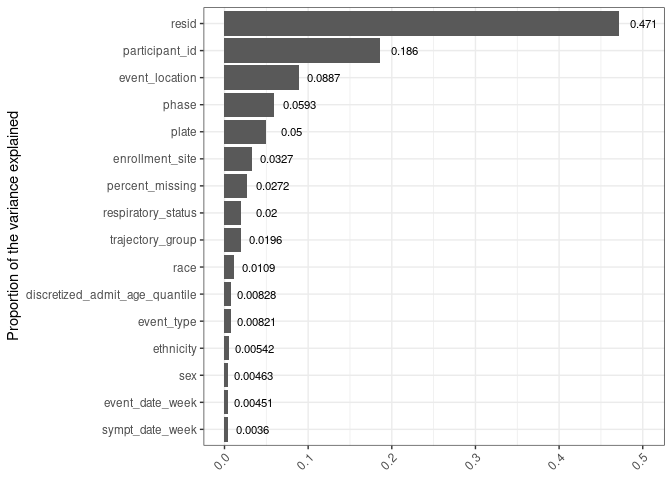
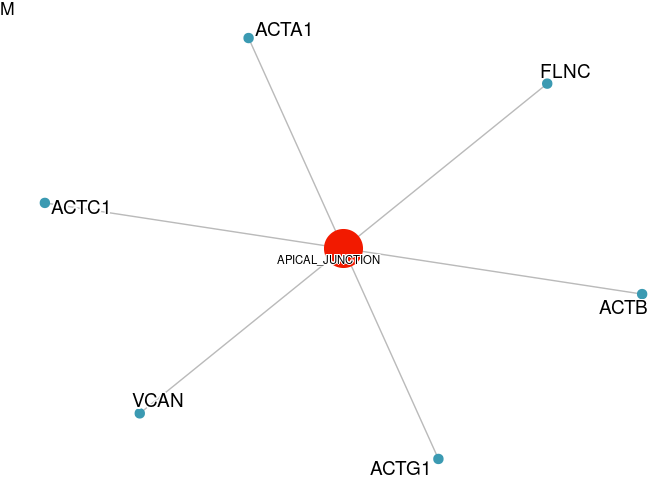
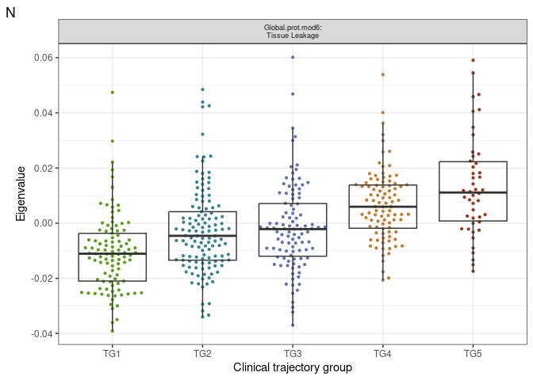
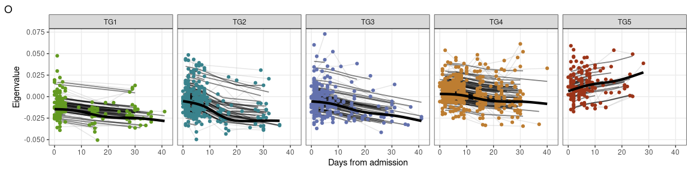
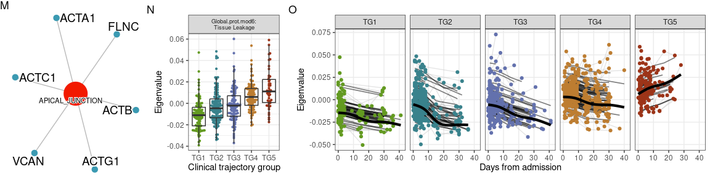

Proteomics-global univariate and WGCNA analysis
================
06 June, 2023

### Load libraries

``` r
suppressPackageStartupMessages(library(package = "knitr"))
suppressPackageStartupMessages(library(package = "impute"))
suppressPackageStartupMessages(library(package = "igraph"))
suppressPackageStartupMessages(library(package = "ordinal"))
suppressPackageStartupMessages(library(package = "qvalue"))
suppressPackageStartupMessages(library(package = "ggbeeswarm"))
suppressPackageStartupMessages(library(package = "ggeffects"))
suppressPackageStartupMessages(library(package = "pvca"))
suppressPackageStartupMessages(library(package = "lme4"))
suppressPackageStartupMessages(library(package = "nlme"))
suppressPackageStartupMessages(library(package = "tidyverse"))
suppressPackageStartupMessages(library(package = "msigdbr"))
suppressPackageStartupMessages(library(package = "clusterProfiler"))
suppressPackageStartupMessages(library(package = "ggraph"))
suppressPackageStartupMessages(library(package = "enrichplot"))
suppressPackageStartupMessages(library(package = "ggpubr"))

# set session options
options(show_col_types = FALSE)
VarCorr <- lme4::VarCorr
```

### Load codebase.R, load data matrices and set path to local output directory

``` r
# Get codebase. Note this is our (i.e. proteomics) own due to some small changes
#source("data_analysis_template_codebase.R")
source("../../Codebase/codebase_v2.R")

#Data for all analysis except PCA plot
data_env <- load_IMPACC_datasets(DATA_VERSION                = "2022-01-01", 
                                 KEEP_COVID19_POS            = TRUE, 
                                 FILTER_BY_CORE_ASSAY_COHORT = TRUE,
                                 ASSAY_NAMES = "plasma_proteomics_global_dda")

# Data for PCA 
data_env_withHC <- load_IMPACC_datasets(DATA_VERSION                = "2022-01-01",
                                        KEEP_COVID19_POS            = FALSE, 
                                        FILTER_BY_CORE_ASSAY_COHORT = TRUE,
                                 ASSAY_NAMES = "plasma_proteomics_global_dda")

# Load the data objects into the environment.
for( n in names(data_env) ) {
  assign( n, data_env[[n]] )
}

# Setup the assay specific output directory
out_dir <- "../output"
```

### Functions: data loading

``` r
#Get Enrichment DB
all_gene_sets = msigdbr(species = "Homo sapiens", category = "H")
msigdbr_t2g = all_gene_sets %>%
  dplyr::distinct(gs_name, gene_symbol) %>%
  mutate(gs_name = str_remove_all(gs_name, "HALLMARK_")) %>%
  as.data.frame()
```

### Functions: data processing

``` r
#Define half minimum imputation method
impute_half_minimum <- function(dataset){
  #We use a simple imputation. We assume that missing values are below detection threshold.
  #We therefore fill the missing values by taking half of the minimum value for a given protein.
  #the forloop here under fills that.
  for(i in 1:ncol(dataset)) {       # for-loop over columns
    halfmin <- min(dataset[,i], na.rm = TRUE)/2
    dataset[,i][is.na(dataset[,i])] <- halfmin
  }
  
  return(dataset)
}

#copy the data, use 50% cut off filter.
plasma_proteomics_global_dda_counts_filtered <- plasma_proteomics_global_dda_counts %>% purrr::discard(~sum(is.na(.x))/length(.x)* 100 >=50)

#Impute using function above
plasma_proteomics_global_dda_counts_filtered_imputed <- impute_half_minimum(plasma_proteomics_global_dda_counts_filtered)

#Z-score the data.
plasma_proteomics_global_dda_counts_filtered_imputed_normalized <- data.frame(scale(plasma_proteomics_global_dda_counts_filtered_imputed))
```

### Supplementary Panel A: analysis code

``` r
#Input Matrices
pvca_input_matrix <- t(plasma_proteomics_global_dda_counts_filtered_imputed)
pvca_input_raw <- t(plasma_proteomics_global_dda_counts)
pvca_input_metadata <- plasma_proteomics_global_dda_metadata

#Select Variables
pvca_input_phenodata <- clinical_data %>%
  mutate(event_date_week = findInterval(event_date, 
                                        vec        = c(0, 7, 14, 21, 28), 
                                        all.inside = TRUE),
         day_from_sympt  = event_date - symptom_date,
         sympt_date_week = findInterval(day_from_sympt, 
                                        vec        = c(0, 7, 14, 21, 28, Inf),
                                        all.inside = TRUE)) %>%
      select(sample_id, event_date_week, event_type, respiratory_status,
           sex, sympt_date_week, event_location, #death
           discretized_admit_age_quantile, ethnicity, participant_id, race,
           trajectory_group, enrollment_site)


# step 4 append meta data to pvca phenodata
pvca_input_phenodata <- pvca_input_metadata %>%
  rownames_to_column(var = "sample_id") %>%
  mutate(#core_site = gsub(pattern = "_.+", replacement = "", comment),
    
         plate     = interaction(phase, plate_num, drop = TRUE)) %>%
  select(sample_id, plate, phase) %>%
  merge(x     = pvca_input_phenodata,
        by    = "sample_id",
        all.x = TRUE)

# append rownames
pvca_input_phenodata <- pvca_input_phenodata %>%
  column_to_rownames(var = "sample_id")
pvca_input_phenodata <- pvca_input_phenodata[colnames(pvca_input_matrix), , drop = FALSE]

# add percent missing values (if processeed matrix required imputation otherwise comment line below)
pvca_input_phenodata$percent_missing <- factor(colMeans(is.na(pvca_input_raw[, rownames(pvca_input_phenodata)])))

# step 5: run PVCA
fit <- PVCA(counts    = pvca_input_matrix,
            meta      = pvca_input_phenodata,
            inter     = FALSE,
            threshold = 0.6)
```

    ## boundary (singular) fit: see ?isSingular
    ## boundary (singular) fit: see ?isSingular
    ## boundary (singular) fit: see ?isSingular
    ## boundary (singular) fit: see ?isSingular
    ## boundary (singular) fit: see ?isSingular
    ## boundary (singular) fit: see ?isSingular
    ## boundary (singular) fit: see ?isSingular
    ## boundary (singular) fit: see ?isSingular
    ## boundary (singular) fit: see ?isSingular
    ## boundary (singular) fit: see ?isSingular
    ## boundary (singular) fit: see ?isSingular
    ## boundary (singular) fit: see ?isSingular
    ## boundary (singular) fit: see ?isSingular
    ## boundary (singular) fit: see ?isSingular
    ## boundary (singular) fit: see ?isSingular
    ## boundary (singular) fit: see ?isSingular
    ## boundary (singular) fit: see ?isSingular
    ## boundary (singular) fit: see ?isSingular
    ## boundary (singular) fit: see ?isSingular
    ## boundary (singular) fit: see ?isSingular
    ## boundary (singular) fit: see ?isSingular
    ## boundary (singular) fit: see ?isSingular
    ## boundary (singular) fit: see ?isSingular
    ## boundary (singular) fit: see ?isSingular
    ## boundary (singular) fit: see ?isSingular
    ## boundary (singular) fit: see ?isSingular
    ## boundary (singular) fit: see ?isSingular
    ## boundary (singular) fit: see ?isSingular
    ## boundary (singular) fit: see ?isSingular
    ## boundary (singular) fit: see ?isSingular
    ## boundary (singular) fit: see ?isSingular
    ## boundary (singular) fit: see ?isSingular
    ## boundary (singular) fit: see ?isSingular
    ## boundary (singular) fit: see ?isSingular
    ## boundary (singular) fit: see ?isSingular
    ## boundary (singular) fit: see ?isSingular
    ## boundary (singular) fit: see ?isSingular

### Supplementary Panel A: output generation code

``` r
#step 6: plot barplot with PVCA results
pvca_barplot_data <- data.frame(explained = as.vector(fit),
                                effect    = names(fit)) %>%
  arrange(explained) %>%
  mutate(effect = factor(effect, levels = effect))

pvca_barplot <- ggplot(data    = pvca_barplot_data,
       mapping = aes(y = effect, x = explained)) +
  geom_bar(stat = "identity") +
  geom_text(aes(label = signif(explained, digits = 3)),
            nudge_x   = 0.03,
            size      = 3) +
  labs(x = NULL, y = "Proportion of the variance explained") +
  theme_bw() +
  theme(axis.text.x = element_text(angle = 45,
                                   vjust = 1,
                                   hjust = 1))

#Write Plot
pdf(file.path(out_dir, "/suppl_D.pdf"))
plot(pvca_barplot)
dev.off()
```

    ## png 
    ##   2

``` r
plot(pvca_barplot)
```

<!-- -->

# Supplementary Panel B: analysis code

``` r
#Load the data specificly for this plot.
for( n in names(data_env_withHC) ) {
  assign( n, data_env_withHC[[n]] )
}

#copy the data, use 50% cut off filter.
plasma_proteomics_global_dda_counts_filtered <- plasma_proteomics_global_dda_counts %>% purrr::discard(~sum(is.na(.x))/length(.x)* 100 >=50)

#Impute using function above
plasma_proteomics_global_dda_counts_filtered_imputed <- impute_half_minimum(plasma_proteomics_global_dda_counts_filtered)

#Z-score the data.
plasma_proteomics_global_dda_counts_filtered_imputed_normalized <- data.frame(scale(plasma_proteomics_global_dda_counts_filtered_imputed))

pc <- prcomp(plasma_proteomics_global_dda_counts_filtered_imputed_normalized)

plotDF <- pc$x[, 1:2] %>%
  as.data.frame() %>%
  rownames_to_column(var = "sample_id") %>%
  merge(y = clinical_data, by = "sample_id") %>%
  merge(y  = rownames_to_column(plasma_proteomics_global_dda_metadata, var = "sample_id"),
        by = "sample_id") %>%
  mutate( enrollment_site = ifelse(test = participant_type %in% "Healthy control (Emory)",
                                  yes  = "Emory-Ctrl", 
                                  no   = enrollment_site))
enrollmentSite2color <- rainbow(n = length(unique(plotDF$enrollment_site))) %>%
  setNames(nm = unique(plotDF$enrollment_site))
enrollmentSite2color["Emory-Ctrl"] <- "black"
```

# Supplementary Panel B: output generation code

``` r
plotPCA <- ggplot(data = plotDF,
       mapping = aes(x = PC1, y = PC2, color = enrollment_site))+
  geom_point(size = 3, alpha = 0.7) +
  scale_color_manual(values = enrollmentSite2color) +
  scale_shape_manual(values = c(21, 23))+
  stat_ellipse()+
  labs(x     = paste0("1st dimension (",
                      round((pc$sdev^2/sum(pc$sdev^2))[1] * 100),
                      "%)"),
       y     = paste0("2nd dimension (",
                      round((pc$sdev^2/sum(pc$sdev^2))[2] * 100),
                      "%)"),
       tag   = "")+
  scale_fill_discrete(name = "Enrollment Sites") +
  theme_classic() +
  theme(legend.text     = element_text(size = 6),
        legend.key.size = unit(0.01, units = "npc"))

#Write Plot
pdf(file.path(out_dir, "/suppl_E.pdf"))
plot(plotPCA)
dev.off()
```

    ## png 
    ##   2

``` r
plot(plotPCA)
```

<!-- -->

\#Supplementary Panel C: analysis code

``` r
#Load the data to normal back.
for( n in names(data_env) ) {
  assign( n, data_env[[n]] )
}

#copy the data, use 50% cut off filter.
plasma_proteomics_global_dda_counts_filtered <- plasma_proteomics_global_dda_counts %>% purrr::discard(~sum(is.na(.x))/length(.x)* 100 >=50)

#Impute using function above
plasma_proteomics_global_dda_counts_filtered_imputed <- impute_half_minimum(plasma_proteomics_global_dda_counts_filtered)

#Z-score the data.
plasma_proteomics_global_dda_counts_filtered_imputed_normalized <- data.frame(scale(plasma_proteomics_global_dda_counts_filtered_imputed))

#Get SFT values
sft_tuned = tune_soft_threshold_WGCNA(data_df = plasma_proteomics_global_dda_counts_filtered,
           networkType = "signed", corFnc = "cor",powers =c(100:200)/10)
```

    ## Warning: executing %dopar% sequentially: no parallel backend registered

    ##     Power SFT.R.sq slope truncated.R.sq mean.k. median.k. max.k.
    ## 1    10.0    0.819 -1.42         0.9270    4.91     3.670  19.40
    ## 2    10.1    0.826 -1.42         0.9320    4.78     3.530  19.10
    ## 3    10.2    0.826 -1.41         0.9280    4.66     3.400  18.90
    ## 4    10.3    0.844 -1.39         0.9490    4.54     3.290  18.60
    ## 5    10.4    0.839 -1.41         0.9470    4.43     3.200  18.30
    ## 6    10.5    0.852 -1.40         0.9670    4.32     3.090  18.10
    ## 7    10.6    0.852 -1.39         0.9670    4.21     2.990  17.90
    ## 8    10.7    0.860 -1.40         0.9720    4.11     2.900  17.60
    ## 9    10.8    0.859 -1.40         0.9690    4.01     2.820  17.40
    ## 10   10.9    0.866 -1.40         0.9720    3.91     2.740  17.20
    ## 11   11.0    0.866 -1.40         0.9680    3.82     2.650  17.00
    ## 12   11.1    0.867 -1.40         0.9670    3.73     2.560  16.70
    ## 13   11.2    0.869 -1.40         0.9660    3.65     2.470  16.50
    ## 14   11.3    0.871 -1.40         0.9640    3.57     2.390  16.30
    ## 15   11.4    0.878 -1.38         0.9710    3.49     2.310  16.10
    ## 16   11.5    0.886 -1.37         0.9730    3.41     2.230  15.90
    ## 17   11.6    0.889 -1.36         0.9730    3.33     2.160  15.80
    ## 18   11.7    0.895 -1.36         0.9740    3.26     2.090  15.60
    ## 19   11.8    0.898 -1.35         0.9740    3.19     2.020  15.40
    ## 20   11.9    0.899 -1.35         0.9720    3.12     1.960  15.20
    ## 21   12.0    0.910 -1.33         0.9760    3.06     1.900  15.00
    ## 22   12.1    0.911 -1.33         0.9730    2.99     1.830  14.90
    ## 23   12.2    0.913 -1.32         0.9720    2.93     1.780  14.70
    ## 24   12.3    0.915 -1.32         0.9720    2.87     1.730  14.50
    ## 25   12.4    0.917 -1.32         0.9700    2.82     1.670  14.40
    ## 26   12.5    0.915 -1.31         0.9670    2.76     1.620  14.20
    ## 27   12.6    0.915 -1.30         0.9640    2.71     1.570  14.10
    ## 28   12.7    0.911 -1.30         0.9590    2.65     1.520  13.90
    ## 29   12.8    0.913 -1.30         0.9580    2.60     1.470  13.80
    ## 30   12.9    0.916 -1.29         0.9570    2.55     1.430  13.60
    ## 31   13.0    0.910 -1.29         0.9460    2.51     1.390  13.50
    ## 32   13.1    0.905 -1.30         0.9360    2.46     1.340  13.30
    ## 33   13.2    0.894 -1.30         0.9180    2.42     1.300  13.20
    ## 34   13.3    0.827 -1.33         0.8200    2.37     1.260  13.10
    ## 35   13.4    0.705 -1.39         0.6510    2.33     1.220  12.90
    ## 36   13.5    0.705 -1.38         0.6500    2.29     1.190  12.80
    ## 37   13.6    0.708 -1.35         0.6470    2.25     1.150  12.70
    ## 38   13.7    0.708 -1.34         0.6410    2.21     1.110  12.60
    ## 39   13.8    0.705 -1.35         0.6400    2.17     1.090  12.40
    ## 40   13.9    0.707 -1.33         0.6370    2.14     1.050  12.30
    ## 41   14.0    0.706 -1.32         0.6350    2.10     1.030  12.20
    ## 42   14.1    0.698 -1.33         0.6240    2.07     0.997  12.10
    ## 43   14.2    0.697 -1.32         0.6220    2.03     0.965  12.00
    ## 44   14.3    0.155 -2.24        -0.0851    2.00     0.946  11.90
    ## 45   14.4    0.157 -2.24        -0.0826    1.97     0.927  11.80
    ## 46   14.5    0.158 -2.24        -0.0821    1.94     0.910  11.70
    ## 47   14.6    0.157 -2.23        -0.0826    1.91     0.886  11.60
    ## 48   14.7    0.157 -2.22        -0.0827    1.88     0.858  11.50
    ## 49   14.8    0.157 -2.21        -0.0833    1.85     0.832  11.40
    ## 50   14.9    0.155 -2.18        -0.0866    1.82     0.810  11.30
    ## 51   15.0    0.153 -2.16        -0.0884    1.79     0.790  11.20
    ## 52   15.1    0.153 -2.14        -0.0885    1.77     0.766  11.10
    ## 53   15.2    0.153 -2.14        -0.0891    1.74     0.742  11.00
    ## 54   15.3    0.153 -2.13        -0.0892    1.71     0.719  10.90
    ## 55   15.4    0.153 -2.12        -0.0893    1.69     0.697  10.80
    ## 56   15.5    0.153 -2.12        -0.0891    1.67     0.681  10.80
    ## 57   15.6    0.152 -2.11        -0.0898    1.64     0.670  10.70
    ## 58   15.7    0.154 -2.13        -0.0882    1.62     0.654  10.70
    ## 59   15.8    0.153 -2.12        -0.0887    1.60     0.644  10.70
    ## 60   15.9    0.154 -2.13        -0.0881    1.58     0.625  10.60
    ## 61   16.0    0.155 -2.13        -0.0868    1.56     0.606  10.60
    ## 62   16.1    0.155 -2.13        -0.0860    1.54     0.588  10.60
    ## 63   16.2    0.156 -2.13        -0.0853    1.51     0.575  10.50
    ## 64   16.3    0.157 -2.14        -0.0842    1.50     0.566  10.50
    ## 65   16.4    0.789 -1.30         0.7380    1.48     0.558  10.50
    ## 66   16.5    0.791 -1.29         0.7410    1.46     0.550  10.40
    ## 67   16.6    0.921 -1.24         0.9090    1.44     0.538  10.40
    ## 68   16.7    0.918 -1.23         0.9050    1.42     0.522  10.40
    ## 69   16.8    0.920 -1.23         0.9050    1.40     0.508  10.40
    ## 70   16.9    0.915 -1.23         0.8990    1.39     0.501  10.30
    ## 71   17.0    0.922 -1.23         0.9080    1.37     0.491  10.30
    ## 72   17.1    0.920 -1.23         0.9040    1.35     0.477  10.30
    ## 73   17.2    0.920 -1.22         0.9030    1.34     0.464  10.20
    ## 74   17.3    0.924 -1.22         0.9080    1.32     0.451  10.20
    ## 75   17.4    0.947 -1.22         0.9370    1.31     0.440  10.20
    ## 76   17.5    0.943 -1.22         0.9330    1.29     0.429  10.20
    ## 77   17.6    0.942 -1.22         0.9300    1.28     0.419  10.10
    ## 78   17.7    0.937 -1.22         0.9250    1.26     0.409  10.10
    ## 79   17.8    0.938 -1.22         0.9240    1.25     0.400  10.10
    ## 80   17.9    0.940 -1.24         0.9300    1.24     0.389  10.00
    ## 81   18.0    0.944 -1.24         0.9340    1.22     0.379  10.00
    ## 82   18.1    0.946 -1.24         0.9360    1.21     0.368   9.99
    ## 83   18.2    0.948 -1.24         0.9390    1.20     0.358   9.97
    ## 84   18.3    0.948 -1.24         0.9390    1.18     0.348   9.94
    ## 85   18.4    0.937 -1.24         0.9240    1.17     0.338   9.91
    ## 86   18.5    0.933 -1.24         0.9180    1.16     0.329   9.89
    ## 87   18.6    0.932 -1.24         0.9160    1.15     0.320   9.86
    ## 88   18.7    0.888 -1.27         0.8620    1.14     0.311   9.84
    ## 89   18.8    0.824 -1.30         0.7840    1.13     0.302   9.81
    ## 90   18.9    0.823 -1.30         0.7800    1.11     0.294   9.79
    ## 91   19.0    0.821 -1.29         0.7770    1.10     0.287   9.76
    ## 92   19.1    0.821 -1.30         0.7750    1.09     0.283   9.74
    ## 93   19.2    0.826 -1.30         0.7840    1.08     0.278   9.72
    ## 94   19.3    0.815 -1.31         0.7660    1.07     0.270   9.69
    ## 95   19.4    0.771 -1.33         0.7080    1.06     0.263   9.67
    ## 96   19.5    0.771 -1.32         0.7070    1.05     0.256   9.64
    ## 97   19.6    0.771 -1.32         0.7070    1.04     0.249   9.62
    ## 98   19.7    0.715 -1.34         0.6330    1.03     0.243   9.60
    ## 99   19.8    0.716 -1.34         0.6350    1.03     0.236   9.57
    ## 100  19.9    0.716 -1.34         0.6350    1.02     0.230   9.55
    ## 101  20.0    0.716 -1.33         0.6350    1.01     0.224   9.53

<!-- -->

    ## WGCNA's suggestion for the power value:  10.5

``` r
if(!is.na(sft_tuned$powerEstimate)){
  ret =   generate_WGCNA_modules(
                   data_df = plasma_proteomics_global_dda_counts_filtered, 
                   # Preprocessed data in data.frame class
                   networkType = "signed",     
                   # Indicate the type of network to construct
                   power = sft_tuned$powerEstimate,              
                   # Provide a power value chosen from the first step, this parameter is mandatory.
                   minModuleSize = 20,      
                   # Provide a value for the minimum number of features a module can have; use a larger value (> 30) for datasets with thousands of features, and a smaller value otherwise.
                   corType = "pearson",         
                   # Correlation function
                   maxPOutliers = 0.1, 
                   # It is safer to use a smaller value for this parameter when corType = bicor is used.
                   assay_alias = "globalprot",         
                   # Append this assay_alias to the module names as prefix.
                   reassignThreshold = 1e-6,   
                   # This and rest of the parameters use default values, but users may want to tweak them based on the assay type and data.
                   mergeCutHeight = 0.05,
                   minKMEtoStay = 0.25,
                   minCoreKME = 0.1,
                   deepSplit = 4)}
```

    ##  Calculating module eigengenes block-wise from all genes
    ##    Flagging genes and samples with too many missing values...
    ##     ..step 1
    ##   ..Excluding 14 samples from the calculation due to too many missing genes.
    ##     ..step 2
    ##  ..Working on block 1 .
    ##     TOM calculation: adjacency..
    ##     ..will not use multithreading.
    ##      Fraction of slow calculations: 0.981874
    ##     ..connectivity..
    ##     ..matrix multiplication (system BLAS)..
    ##     ..normalization..
    ##     ..done.
    ##  ....clustering..
    ##  ....detecting modules..
    ##  ....calculating module eigengenes..
    ##  ....checking kME in modules..
    ##      ..removing 15 genes from module 1 because their KME is too low.
    ##      ..removing 9 genes from module 2 because their KME is too low.
    ##      ..removing 4 genes from module 3 because their KME is too low.
    ##      ..removing 3 genes from module 4 because their KME is too low.
    ##      ..removing 2 genes from module 5 because their KME is too low.
    ##      ..removing 1 genes from module 6 because their KME is too low.
    ##      ..removing 7 genes from module 8 because their KME is too low.
    ##   ..reassigning 2 genes from module 1 to modules with higher KME.
    ##   ..reassigning 4 genes from module 2 to modules with higher KME.
    ##   ..reassigning 2 genes from module 4 to modules with higher KME.
    ##   ..reassigning 2 genes from module 6 to modules with higher KME.
    ##   ..reassigning 2 genes from module 7 to modules with higher KME.
    ##  ..merging modules that are too close..
    ##      mergeCloseModules: Merging modules whose distance is less than 0.05
    ##        Calculating new MEs...

    ## The automatically generated colors map from the minus and plus 99^th of
    ## the absolute values in the matrix. There are outliers in the matrix
    ## whose patterns might be hidden by this color mapping. You can manually
    ## set the color to `col` argument.
    ## 
    ## Use `suppressMessages()` to turn off this message.

<!-- -->

    ## The automatically generated colors map from the minus and plus 99^th of
    ## the absolute values in the matrix. There are outliers in the matrix
    ## whose patterns might be hidden by this color mapping. You can manually
    ## set the color to `col` argument.
    ## 
    ## Use `suppressMessages()` to turn off this message.

<!-- -->

    ## The automatically generated colors map from the minus and plus 99^th of
    ## the absolute values in the matrix. There are outliers in the matrix
    ## whose patterns might be hidden by this color mapping. You can manually
    ## set the color to `col` argument.
    ## 
    ## Use `suppressMessages()` to turn off this message.
    ## The automatically generated colors map from the minus and plus 99^th of
    ## the absolute values in the matrix. There are outliers in the matrix
    ## whose patterns might be hidden by this color mapping. You can manually
    ## set the color to `col` argument.
    ## 
    ## Use `suppressMessages()` to turn off this message.

<!-- -->

    ## [1] "Note: mod0 = 'grey' module"

\#Supplementary Panel C: output generation code

``` r
# Opening the graphical device
pdf(file.path(out_dir, "/suppl_F.pdf"))
# Creating a plot
draw(ret$WGCNAPlot1)
dev.off()
```

    ## png 
    ##   2

``` r
draw(ret$WGCNAPlot1)
```

<!-- -->

### Panel M: analysis code

``` r
#Take module 1 proteins, test them against Hallmark DB
globalmod4_extract <- ret$module_membership %>% filter(module == "globalprot_mod4")
globalmod4_enrichment <- enricher(gene = globalmod4_extract$feature, TERM2GENE = msigdbr_t2g)
```

### Panel M: output generation code

``` r
#Plot using clusterprofiler
globalmod4_enrichmentplot <- cnetplot(globalmod4_enrichment, cex_category = 2, cex_label_category = 0.6, cex__label_gene = 0.6) +
  scale_color_manual(values = c("#3B9AB2", "#F21A00")) +
  theme(legend.position = "none") +
  labs(tag = "M")

#Write 
pdf(file.path(out_dir, "/main_M.pdf"))
plot(globalmod4_enrichmentplot)
dev.off()
```

    ## png 
    ##   2

``` r
plot(globalmod4_enrichmentplot)
```

<!-- -->

\#Panel N: analysis code

``` r
######################################
#Prepare data for univariate analysis.
######################################
clinical_subsets = clinical_data
rownames(clinical_subsets) = clinical_subsets$sample_id
row_ids = rownames(plasma_proteomics_global_dda_counts_filtered)
clinical_subsets = clinical_subsets[row_ids,]
visit1_row_ids = rownames(clinical_subsets[clinical_subsets$event_type == 'Visit 1',])

# Use the visit1_row_ids to only get samples from 'Visit 1':
modules_filtered = ret$MEs[visit1_row_ids ,]
clinical_subsets = clinical_subsets[visit1_row_ids ,]
data_use = modules_filtered 

# Add the respiratory_status_day14 as $endpoints
data_use$endpoints = as.factor(clinical_subsets$trajectory_group)

# Add the enrollment_site as $sites
data_use$sites = clinical_subsets$enrollment_site
data_use$age =  clinical_subsets$discretized_admit_age_quantile
data_use$sex =  clinical_subsets$sex
# Add the $control, needs to be different for each sample
# required for clmm (always requires some random effect)
data_use$control =  factor(1:nrow(data_use))

# Set module names:
module_names = colnames(modules_filtered)

# Only use samples that have valid endpoints (not NA/missing)
data_use = data_use[!is.na(data_use$endpoints),]

######################
# Run ordinal analysis
######################
res_table_ordinal = data.frame(matrix(0, ncol = 3, nrow = length(module_names)+1))
colnames(res_table_ordinal) = c("AIC", "pval", "qval")
rownames(res_table_ordinal) = c(module_names, "combined")
for(j in 1:length(module_names)){
  print(j)
  my.formula0 = paste0('endpoints~ 1+(1|sites)+age+sex')
  my.formula1 = paste0('endpoints~',module_names[j],'+(1|sites)+age+sex')
  res_table_ordinal[j,1:2]=mixed_ordinal(my.formula0, my.formula1,data_use)
}
```

    ## [1] 1
    ## [1] 2
    ## [1] 3
    ## [1] 4
    ## [1] 5
    ## [1] 6
    ## [1] 7
    ## [1] 8
    ## [1] 9

``` r
my.formula0 = paste0('endpoints~ 1+(1|sites)+age+sex')
my.formula1 = paste0('endpoints~',paste(module_names, collapse = " + "),'+ (1|sites)+age+sex')
res_table_ordinal[length(module_names)+1,1:2] = mixed_ordinal(my.formula0, my.formula1,data_use)
res_table_ordinal$qval =  qvalue::qvalue(res_table_ordinal$pval, fdr.level = 0.05, pi0 = 1)$qvalues

#######################
# RUN pairwise analysis
#######################

for(j in 1:length(module_names)){
  print(j)
  my.formula0 = paste0(module_names[j],"~ (1|sites)+age+sex")
  my.formula1 = paste0(module_names[j],"~ endpoints + (1|sites)+age+sex")
  if(j == 1){
    tmp = mixed_pairwise(my.formula0, my.formula1, data_use)
    res_table_pairwise = data.frame(matrix(0, ncol = length(tmp), nrow = length(module_names)))
    res_table_pairwise[j,] = tmp
    colnames(res_table_pairwise) = names(tmp)
  }else{
    res_table_pairwise[j,] = mixed_pairwise(my.formula0, my.formula1, data_use)
  }
}
```

    ## [1] 1

    ## refitting model(s) with ML (instead of REML)

    ## boundary (singular) fit: see ?isSingular
    ## boundary (singular) fit: see ?isSingular

    ## refitting model(s) with ML (instead of REML)
    ## refitting model(s) with ML (instead of REML)

    ## boundary (singular) fit: see ?isSingular
    ## boundary (singular) fit: see ?isSingular

    ## refitting model(s) with ML (instead of REML)

    ## boundary (singular) fit: see ?isSingular
    ## boundary (singular) fit: see ?isSingular

    ## refitting model(s) with ML (instead of REML)
    ## refitting model(s) with ML (instead of REML)

    ## boundary (singular) fit: see ?isSingular

    ## refitting model(s) with ML (instead of REML)
    ## refitting model(s) with ML (instead of REML)

    ## boundary (singular) fit: see ?isSingular
    ## boundary (singular) fit: see ?isSingular

    ## refitting model(s) with ML (instead of REML)
    ## refitting model(s) with ML (instead of REML)

    ## [1] 2

    ## refitting model(s) with ML (instead of REML)
    ## refitting model(s) with ML (instead of REML)

    ## boundary (singular) fit: see ?isSingular

    ## refitting model(s) with ML (instead of REML)
    ## refitting model(s) with ML (instead of REML)

    ## boundary (singular) fit: see ?isSingular
    ## boundary (singular) fit: see ?isSingular

    ## refitting model(s) with ML (instead of REML)

    ## boundary (singular) fit: see ?isSingular
    ## boundary (singular) fit: see ?isSingular

    ## refitting model(s) with ML (instead of REML)
    ## refitting model(s) with ML (instead of REML)

    ## boundary (singular) fit: see ?isSingular
    ## boundary (singular) fit: see ?isSingular

    ## refitting model(s) with ML (instead of REML)

    ## boundary (singular) fit: see ?isSingular

    ## refitting model(s) with ML (instead of REML)
    ## refitting model(s) with ML (instead of REML)

    ## [1] 3

    ## refitting model(s) with ML (instead of REML)
    ## refitting model(s) with ML (instead of REML)
    ## refitting model(s) with ML (instead of REML)
    ## refitting model(s) with ML (instead of REML)
    ## refitting model(s) with ML (instead of REML)
    ## refitting model(s) with ML (instead of REML)
    ## refitting model(s) with ML (instead of REML)
    ## refitting model(s) with ML (instead of REML)
    ## refitting model(s) with ML (instead of REML)
    ## refitting model(s) with ML (instead of REML)

    ## [1] 4

    ## boundary (singular) fit: see ?isSingular

    ## boundary (singular) fit: see ?isSingular

    ## refitting model(s) with ML (instead of REML)

    ## boundary (singular) fit: see ?isSingular

    ## refitting model(s) with ML (instead of REML)
    ## refitting model(s) with ML (instead of REML)

    ## boundary (singular) fit: see ?isSingular
    ## boundary (singular) fit: see ?isSingular

    ## refitting model(s) with ML (instead of REML)

    ## boundary (singular) fit: see ?isSingular
    ## boundary (singular) fit: see ?isSingular

    ## refitting model(s) with ML (instead of REML)
    ## refitting model(s) with ML (instead of REML)

    ## boundary (singular) fit: see ?isSingular
    ## boundary (singular) fit: see ?isSingular

    ## refitting model(s) with ML (instead of REML)
    ## refitting model(s) with ML (instead of REML)
    ## refitting model(s) with ML (instead of REML)
    ## refitting model(s) with ML (instead of REML)

    ## [1] 5

    ## refitting model(s) with ML (instead of REML)
    ## refitting model(s) with ML (instead of REML)

    ## boundary (singular) fit: see ?isSingular

    ## refitting model(s) with ML (instead of REML)
    ## refitting model(s) with ML (instead of REML)
    ## refitting model(s) with ML (instead of REML)

    ## boundary (singular) fit: see ?isSingular

    ## refitting model(s) with ML (instead of REML)
    ## refitting model(s) with ML (instead of REML)
    ## refitting model(s) with ML (instead of REML)
    ## refitting model(s) with ML (instead of REML)
    ## refitting model(s) with ML (instead of REML)

    ## [1] 6

    ## refitting model(s) with ML (instead of REML)
    ## refitting model(s) with ML (instead of REML)
    ## refitting model(s) with ML (instead of REML)
    ## refitting model(s) with ML (instead of REML)
    ## refitting model(s) with ML (instead of REML)
    ## refitting model(s) with ML (instead of REML)
    ## refitting model(s) with ML (instead of REML)
    ## refitting model(s) with ML (instead of REML)
    ## refitting model(s) with ML (instead of REML)
    ## refitting model(s) with ML (instead of REML)

    ## [1] 7

    ## refitting model(s) with ML (instead of REML)

    ## boundary (singular) fit: see ?isSingular
    ## boundary (singular) fit: see ?isSingular

    ## refitting model(s) with ML (instead of REML)
    ## refitting model(s) with ML (instead of REML)
    ## refitting model(s) with ML (instead of REML)
    ## refitting model(s) with ML (instead of REML)
    ## refitting model(s) with ML (instead of REML)
    ## refitting model(s) with ML (instead of REML)
    ## refitting model(s) with ML (instead of REML)

    ## boundary (singular) fit: see ?isSingular
    ## boundary (singular) fit: see ?isSingular

    ## refitting model(s) with ML (instead of REML)
    ## refitting model(s) with ML (instead of REML)

    ## [1] 8

    ## boundary (singular) fit: see ?isSingular
    ## refitting model(s) with ML (instead of REML)
    ## refitting model(s) with ML (instead of REML)

    ## boundary (singular) fit: see ?isSingular

    ## refitting model(s) with ML (instead of REML)

    ## boundary (singular) fit: see ?isSingular
    ## boundary (singular) fit: see ?isSingular

    ## refitting model(s) with ML (instead of REML)
    ## refitting model(s) with ML (instead of REML)

    ## boundary (singular) fit: see ?isSingular
    ## boundary (singular) fit: see ?isSingular

    ## refitting model(s) with ML (instead of REML)
    ## refitting model(s) with ML (instead of REML)

    ## boundary (singular) fit: see ?isSingular
    ## boundary (singular) fit: see ?isSingular

    ## refitting model(s) with ML (instead of REML)
    ## refitting model(s) with ML (instead of REML)

    ## boundary (singular) fit: see ?isSingular
    ## boundary (singular) fit: see ?isSingular

    ## refitting model(s) with ML (instead of REML)

    ## [1] 9

    ## boundary (singular) fit: see ?isSingular

    ## boundary (singular) fit: see ?isSingular

    ## refitting model(s) with ML (instead of REML)
    ## refitting model(s) with ML (instead of REML)

    ## boundary (singular) fit: see ?isSingular
    ## boundary (singular) fit: see ?isSingular

    ## refitting model(s) with ML (instead of REML)

    ## boundary (singular) fit: see ?isSingular
    ## boundary (singular) fit: see ?isSingular

    ## refitting model(s) with ML (instead of REML)

    ## boundary (singular) fit: see ?isSingular
    ## boundary (singular) fit: see ?isSingular

    ## refitting model(s) with ML (instead of REML)

    ## boundary (singular) fit: see ?isSingular
    ## boundary (singular) fit: see ?isSingular

    ## refitting model(s) with ML (instead of REML)
    ## refitting model(s) with ML (instead of REML)

    ## boundary (singular) fit: see ?isSingular
    ## boundary (singular) fit: see ?isSingular

    ## refitting model(s) with ML (instead of REML)
    ## refitting model(s) with ML (instead of REML)

    ## boundary (singular) fit: see ?isSingular
    ## boundary (singular) fit: see ?isSingular

    ## refitting model(s) with ML (instead of REML)

``` r
rownames(res_table_pairwise) = module_names
res_table_pairwise_adj = qvalue::qvalue(as.vector(res_table_pairwise), fdr.level = 0.05, pi0 = 1)$qvalues

########################
#Make the visualization
########################

visit1Mod1 <- data_use %>%
  rownames_to_column(var = "sample_id") %>%
 dplyr::select(sample_id, globalprot_mod4, endpoints) %>%
  pivot_longer(cols = -c(sample_id, endpoints)) %>%
  filter(name %in% "globalprot_mod4") %>%
  mutate(name = "Global.prot.mod6:\nTissue Leakage",###############################
         trajectory_group = paste0("TG", endpoints)) %>%
  ggplot(mapping = aes(x = trajectory_group, y = value)) +
  geom_beeswarm(mapping = aes(color =trajectory_group), cex = 1.5, size = 0.8) +
  geom_boxplot(fill = "transparent", outlier.color= "transparent") +
  facet_wrap(facets= ~name, ncol = 1) +
  theme_bw() +
  theme(legend.pos = "none", strip.text = element_text(size = 7)) + 
  labs(y = "Eigenvalue", x = "Clinical trajectory group", tag = "N") +
  scale_color_manual(values = c("TG1" = "#639A21",
                                                          "TG2" = "#39828C",
                                                          "TG3"     = "#6371AD",
                                                          "TG4"     = "#BD7D31",
                                                          "TG5"      = "#9C3418"))
```

\#Panel N: output generation code

``` r
pdf(file.path(out_dir, "/main_N.pdf"))
plot(visit1Mod1)
dev.off()
```

    ## png 
    ##   2

``` r
plot(visit1Mod1)
```

<!-- -->

# Panel O: analysis code

``` r
########################################################
#Prepare data for longitudinal smoothing spline analysis
########################################################
clinical_subsets = clinical_data
rownames(clinical_subsets) = clinical_subsets$sample_id
row_ids = rownames(plasma_proteomics_global_dda_counts_filtered)
clinical_subsets = clinical_subsets[row_ids,]
modules_scores = ret$MEs
modules_filtered =modules_scores
clinical_subsets = clinical_subsets
data_use = cbind(modules_filtered, clinical_subsets[c("trajectory_group", "respiratory_status_day14", "respiratory_status_day28",  "event_date", "enrollment_site", "participant_id","sex", "discretized_admit_age_quantile")])

inputDF <- ret$MEs %>%
  rownames_to_column(var = "sample_id") %>%
  merge(y = dplyr::select(clinical_data, sample_id, event_date, participant_id, respiratory_status_day14, respiratory_status_day28,enrollment_site, trajectory_group, sex, admit_age, enrollment_site, discretized_admit_age_quantile),
        by = "sample_id") %>%
  # mutate_if(is.numeric, funs(ifelse(is.na(symptom_date), 0, .))) %>%  #### DFSO
  # mutate(event_date=event_date-symptom_date) %>%
  # select(-symptom_date) %>%################ DFSO!!
  mutate(outcomeD14  = cut(respiratory_status_day14,
                           breaks = c(1, 2, 4, 6, 7),
                           include.lowest = TRUE)) %>%
  mutate(outcomeD28  = cut(respiratory_status_day28,
                           breaks = c(1, 2, 4, 6, 7),
                           include.lowest = TRUE)) %>%
  pivot_longer(cols = -c("sample_id", "event_date", "participant_id",
                         "enrollment_site", "trajectory_group",
                         "respiratory_status_day14", "outcomeD14",
                         "respiratory_status_day28", "outcomeD28",
                         "sex", "admit_age", "discretized_admit_age_quantile")) %>%
  filter(!is.na(value) & !is.na(trajectory_group))

## Ensure proper variables are factors
inputDF[["trajectory_group"]] = ordered(as.factor(as.character(inputDF[["trajectory_group"]])), levels =
                                        c("1", "2", "3", "4", "5"))
inputDF$name <- as.factor(inputDF$name)
inputDF$sex <- factor(inputDF$sex, levels = c("Female", "Male"))
inputDF$discretized_admit_age_quantile <- as.factor(inputDF$discretized_admit_age_quantile)
inputDF$participant_id <- as.factor(inputDF$participant_id)
inputDF$enrollment_site <- as.factor(inputDF$enrollment_site)

smooth_model_loop <- model_loop(inputDF, age_sex=T, modelType = "smoothSpline", endpoint = "trajectory_group")
```

    ## [1] 1
    ## [1] 2
    ## [1] 3
    ## [1] 4
    ## [1] 5
    ## [1] 6
    ## [1] 7
    ## [1] 8
    ## [1] 9

    ## 
    ##  Initial calculation of p.slope and p.intercept complete. Beginning pairwise comparisons.

``` r
print(smooth_model_loop)
```

    ##                      p.slope  p.intercept p.intercept.sex
    ## globalprot_mod0 3.629358e-11 7.215471e-01      0.55488297
    ## globalprot_mod1 6.012025e-10 1.901136e-15      0.35240287
    ## globalprot_mod2 2.077384e-03 1.462757e-06      0.03602692
    ## globalprot_mod3 1.834985e-10 3.730829e-24      0.09630259
    ## globalprot_mod4 1.005226e-11 2.289651e-37      0.01886953
    ## globalprot_mod5 4.652121e-02 1.177623e-01      0.71945283
    ## globalprot_mod6 9.140959e-22 7.810933e-40      0.37364820
    ## globalprot_mod7 2.983706e-07 6.868038e-09      0.35207226
    ## globalprot_mod8 2.553068e-01 1.198576e-01      0.87781251
    ##                 p.intercept.age.quantile   adjp.slope adjp.intercept
    ## globalprot_mod0             1.113829e-02 1.088807e-10   7.215471e-01
    ## globalprot_mod1             6.840394e-07 1.082164e-09   4.277555e-15
    ## globalprot_mod2             5.746563e-02 2.670923e-03   2.194136e-06
    ## globalprot_mod3             9.993891e-02 4.128716e-10   1.119249e-23
    ## globalprot_mod4             4.481064e-03 4.523516e-11   1.030343e-36
    ## globalprot_mod5             8.547521e-01 5.233636e-02   1.348398e-01
    ## globalprot_mod6             7.569906e-04 8.226863e-21   7.029839e-39
    ## globalprot_mod7             5.307087e-01 4.475559e-07   1.236247e-08
    ## globalprot_mod8             1.321598e-01 2.553068e-01   1.348398e-01
    ##                 adjp.intercept.sex adjp.intercept.age.quantile  p.slope_1v2
    ## globalprot_mod0          0.7134210                2.506115e-02 4.792525e-05
    ## globalprot_mod1          0.5604723                6.156355e-06 3.855831e-01
    ## globalprot_mod2          0.1621211                1.034381e-01 5.138450e-02
    ## globalprot_mod3          0.2889078                1.499084e-01 6.895787e-04
    ## globalprot_mod4          0.1621211                1.344319e-02 3.087764e-04
    ## globalprot_mod5          0.8093844                8.547521e-01 7.712998e-01
    ## globalprot_mod6          0.5604723                3.406458e-03 6.847155e-02
    ## globalprot_mod7          0.5604723                5.970473e-01 1.897586e-01
    ## globalprot_mod8          0.8778125                1.699198e-01 9.070120e-01
    ##                 p.slope_1v3  p.slope_1v4  p.slope_1v5 p.slope_2v3  p.slope_2v4
    ## globalprot_mod0 0.003850739 2.085339e-06 2.129792e-02   0.1280740 1.035923e-02
    ## globalprot_mod1 0.322389388 4.823079e-04 2.132084e-08   0.1137277 1.040362e-04
    ## globalprot_mod2 0.677361647 8.743847e-04 7.879778e-06   0.5193970 2.464620e-02
    ## globalprot_mod3 0.096450972 6.642221e-01 6.070133e-09   0.1077247 4.865933e-05
    ## globalprot_mod4 0.028146218 7.355078e-01 1.248558e-12   0.0403742 5.133276e-06
    ## globalprot_mod5 0.262441133 1.063176e-02 2.339796e-01   0.6017220 5.686628e-02
    ## globalprot_mod6 0.243602393 3.547556e-04 1.772653e-18   0.5667279 2.140607e-07
    ## globalprot_mod7 0.529292918 2.592541e-01 5.949693e-06   0.3454378 5.283158e-03
    ## globalprot_mod8 0.244547911 1.566553e-01 1.552296e-01   0.1938411 8.906790e-02
    ##                  p.slope_2v5  p.slope_3v4  p.slope_3v5  p.slope_4v5
    ## globalprot_mod0 5.866635e-02 3.625614e-03 3.554694e-01 2.250243e-01
    ## globalprot_mod1 2.352198e-07 7.126044e-03 5.572426e-09 4.408231e-04
    ## globalprot_mod2 1.213348e-04 3.384852e-02 1.825599e-04 2.263806e-02
    ## globalprot_mod3 1.528515e-14 3.163024e-02 1.351279e-10 1.027085e-08
    ## globalprot_mod4 3.469058e-18 3.790334e-02 6.072546e-14 1.830619e-10
    ## globalprot_mod5 4.834346e-01 5.782601e-01 4.019004e-01 4.866369e-01
    ## globalprot_mod6 2.499454e-22 7.078807e-06 4.523778e-19 3.753342e-12
    ## globalprot_mod7 1.755556e-08 8.106172e-02 1.076471e-07 1.918176e-05
    ## globalprot_mod8 1.920828e-01 7.648515e-01 6.010597e-02 4.997072e-02
    ##                 p.intercept_1v2 p.intercept_1v3 p.intercept_1v4 p.intercept_1v5
    ## globalprot_mod0    9.861339e-01    3.355848e-01    2.851161e-01    6.154300e-01
    ## globalprot_mod1    5.392673e-01    3.026300e-01    3.076893e-06    1.086674e-12
    ## globalprot_mod2    1.834617e-02    1.063333e-01    7.076040e-06    2.271044e-02
    ## globalprot_mod3    9.316898e-07    3.707109e-08    6.985930e-15    2.141073e-10
    ## globalprot_mod4    1.425312e-03    1.790183e-03    4.550321e-17    3.413100e-25
    ## globalprot_mod5    9.391254e-01    9.925435e-01    2.188329e-01    6.085753e-01
    ## globalprot_mod6    1.098009e-04    4.482042e-04    2.853563e-17    4.767737e-26
    ## globalprot_mod7    2.191031e-03    3.017016e-04    1.691552e-06    7.528910e-05
    ## globalprot_mod8    3.107818e-01    7.256145e-02    4.104601e-01    3.454561e-02
    ##                 p.intercept_2v3 p.intercept_2v4 p.intercept_2v5 p.intercept_3v4
    ## globalprot_mod0       0.3831088    8.726654e-01    6.225667e-01    6.742611e-01
    ## globalprot_mod1       0.2759849    5.339329e-05    1.770110e-12    1.727675e-02
    ## globalprot_mod2       0.2890268    3.551082e-04    5.588126e-01    3.928341e-06
    ## globalprot_mod3       0.2014196    7.169523e-09    4.859257e-06    4.211968e-05
    ## globalprot_mod4       0.3052626    2.857788e-12    1.769465e-18    7.015475e-07
    ## globalprot_mod5       0.9080170    7.815544e-02    8.161141e-01    5.600011e-02
    ## globalprot_mod6       0.5271820    9.762976e-12    1.665422e-21    4.080160e-08
    ## globalprot_mod7       0.1700473    2.732933e-04    1.924464e-03    2.236802e-02
    ## globalprot_mod8       0.1001020    8.234310e-01    1.075939e-01    1.427186e-01
    ##                 p.intercept_3v5 p.intercept_4v5 p.intercept.sex_1v2
    ## globalprot_mod0    7.284925e-01    5.760612e-01         0.068522706
    ## globalprot_mod1    4.846487e-07    3.588664e-05         0.400794275
    ## globalprot_mod2    1.268207e-01    1.015040e-01         0.567373092
    ## globalprot_mod3    1.376825e-05    1.311370e-01         0.026329067
    ## globalprot_mod4    4.698034e-14    5.595811e-08         0.009798975
    ## globalprot_mod5    5.094147e-01    4.984801e-01         0.221446563
    ## globalprot_mod6    5.391532e-15    7.135157e-07         0.155482403
    ## globalprot_mod7    1.130124e-02    1.899951e-01         0.380463648
    ## globalprot_mod8    7.639955e-01    1.299334e-01         0.982328193
    ##                 p.intercept.sex_1v3 p.intercept.sex_1v4 p.intercept.sex_1v5
    ## globalprot_mod0          0.72731268          0.73760035           0.9340703
    ## globalprot_mod1          0.74533979          0.18685996           0.7415951
    ## globalprot_mod2          0.66134620          0.23116377           0.8846113
    ## globalprot_mod3          0.12419884          0.87838766           0.5817142
    ## globalprot_mod4          0.04083607          0.89496146           0.4379811
    ## globalprot_mod5          0.45313942          0.13573644           0.5757450
    ## globalprot_mod6          0.04307400          0.73931089           0.8298843
    ## globalprot_mod7          0.70323931          0.90916066           0.5857505
    ## globalprot_mod8          0.17829005          0.07896335           0.9830638
    ##                 p.intercept.sex_2v3 p.intercept.sex_2v4 p.intercept.sex_2v5
    ## globalprot_mod0         0.241308644          0.24639627          0.13996134
    ## globalprot_mod1         0.747236451          0.25066314          0.75304375
    ## globalprot_mod2         0.107372481          0.02602672          0.18218960
    ## globalprot_mod3         0.027822295          0.29426964          0.12500568
    ## globalprot_mod4         0.002654271          0.18390895          0.02475256
    ## globalprot_mod5         0.601851247          0.92679951          0.20662753
    ## globalprot_mod6         0.168638438          0.85530112          0.84799933
    ## globalprot_mod7         0.179417180          0.60426403          0.22496907
    ## globalprot_mod8         0.535530346          0.87861060          0.03385784
    ##                 p.intercept.sex_3v4 p.intercept.sex_3v5 p.intercept.sex_4v5
    ## globalprot_mod0          0.58180537          0.95891622          0.63418225
    ## globalprot_mod1          0.14281268          0.71376278          0.01756735
    ## globalprot_mod2          0.02361629          0.20749372          0.04486512
    ## globalprot_mod3          0.42563812          0.26644758          0.54687239
    ## globalprot_mod4          0.39221655          0.09655234          0.89633694
    ## globalprot_mod5          0.19553907          0.42631181          0.14163829
    ## globalprot_mod6          0.55108690          0.59587494          0.28836319
    ## globalprot_mod7          0.53202214          0.25907454          0.88300744
    ## globalprot_mod8          0.35064213          0.33920623          0.98668007
    ##                 p.intercept.age.quantile_1v2 p.intercept.age.quantile_1v3
    ## globalprot_mod0                 6.594819e-02                 2.254016e-01
    ## globalprot_mod1                 7.303887e-07                 1.496720e-07
    ## globalprot_mod2                 1.420658e-01                 2.062256e-02
    ## globalprot_mod3                 2.938956e-02                 1.063708e-01
    ## globalprot_mod4                 7.404014e-03                 5.619218e-04
    ## globalprot_mod5                 3.651071e-01                 7.545752e-01
    ## globalprot_mod6                 1.122385e-03                 4.211384e-04
    ## globalprot_mod7                 8.129813e-01                 3.382627e-01
    ## globalprot_mod8                 2.383640e-01                 4.021084e-01
    ##                 p.intercept.age.quantile_1v4 p.intercept.age.quantile_1v5
    ## globalprot_mod0                   0.23560525                  0.311580760
    ## globalprot_mod1                   0.01833282                  0.034454339
    ## globalprot_mod2                   0.14700957                  0.481682606
    ## globalprot_mod3                   0.66543451                  0.543253392
    ## globalprot_mod4                   0.11954953                  0.161974401
    ## globalprot_mod5                   0.43225799                  0.923028632
    ## globalprot_mod6                   0.02569302                  0.008301812
    ## globalprot_mod7                   0.77450820                  0.600935612
    ## globalprot_mod8                   0.20213494                  0.286456032
    ##                 p.intercept.age.quantile_2v3 p.intercept.age.quantile_2v4
    ## globalprot_mod0                 5.778706e-02                   0.08840280
    ## globalprot_mod1                 1.228854e-06                   0.02171318
    ## globalprot_mod2                 3.439199e-02                   0.14033957
    ## globalprot_mod3                 8.972626e-02                   0.35874471
    ## globalprot_mod4                 7.372892e-03                   0.18883021
    ## globalprot_mod5                 8.750861e-01                   0.35763783
    ## globalprot_mod6                 1.017543e-01                   0.28239452
    ## globalprot_mod7                 2.304190e-01                   0.95159130
    ## globalprot_mod8                 5.835648e-01                   0.23331134
    ##                 p.intercept.age.quantile_2v5 p.intercept.age.quantile_3v4
    ## globalprot_mod0                   0.09270990                 0.2085762186
    ## globalprot_mod1                   0.07320582                 0.0006100506
    ## globalprot_mod2                   0.43085043                 0.2634996129
    ## globalprot_mod3                   0.11274605                 0.4834695217
    ## globalprot_mod4                   0.31336620                 0.1314379459
    ## globalprot_mod5                   0.80788599                 0.2115677429
    ## globalprot_mod6                   0.14200776                 0.1330936074
    ## globalprot_mod7                   0.71927348                 0.7701703967
    ## globalprot_mod8                   0.24220113                 0.8391294920
    ##                 p.intercept.age.quantile_3v5 p.intercept.age.quantile_4v5
    ## globalprot_mod0                  0.217521641                    0.4316844
    ## globalprot_mod1                  0.007530669                    0.9399082
    ## globalprot_mod2                  0.139321198                    0.4519184
    ## globalprot_mod3                  0.308221674                    0.6674060
    ## globalprot_mod4                  0.351444463                    0.7789372
    ## globalprot_mod5                  0.058082588                    0.7879209
    ## globalprot_mod6                  0.157033808                    0.5053296
    ## globalprot_mod7                  0.498881233                    0.8253032
    ## globalprot_mod8                  0.590189743                    0.2197909
    ##                 p.slope.adj_1v2 p.slope.adj_1v3 p.slope.adj_1v4 p.slope.adj_1v5
    ## globalprot_mod0    0.0001684361     0.009366662    9.877920e-06    4.563839e-02
    ## globalprot_mod1    0.4566115354     0.397466369    1.315385e-03    1.279251e-07
    ## globalprot_mod2    0.0906785305     0.708866840    2.248418e-03    3.083391e-05
    ## globalprot_mod3    0.0018253553     0.149665301    7.032940e-01    4.552600e-08
    ## globalprot_mod4    0.0009263293     0.056292435    7.608701e-01    1.605289e-11
    ## globalprot_mod5    0.7799661311     0.328051416    2.333802e-02    3.096789e-01
    ## globalprot_mod6    0.1120443547     0.314418743    1.029936e-03    5.317960e-17
    ## globalprot_mod7    0.2643288041     0.588103242    3.280514e-01    2.549868e-05
    ## globalprot_mod8    0.9070120171     0.314418743    2.237933e-01    2.237933e-01
    ##                 p.slope.adj_2v3 p.slope.adj_2v4 p.slope.adj_2v5 p.slope.adj_3v4
    ## globalprot_mod0      0.18896165    2.330828e-02    9.962211e-02    9.064036e-03
    ## globalprot_mod1      0.17059153    3.467872e-04    1.176099e-06    1.644472e-02
    ## globalprot_mod2      0.58432163    5.041267e-02    3.900047e-04    6.481632e-02
    ## globalprot_mod3      0.16432589    1.684361e-04    2.751328e-13    6.188526e-02
    ## globalprot_mod4      0.07415669    2.309974e-05    7.805381e-17    7.106876e-02
    ## globalprot_mod5      0.64470214    9.842240e-02    5.543965e-01    6.270290e-01
    ## globalprot_mod6      0.62201839    1.133263e-06    2.249509e-20    2.895876e-05
    ## globalprot_mod7      0.42012710    1.251274e-02    1.128572e-07    1.302778e-01
    ## globalprot_mod8      0.26432880    1.406335e-01    2.643288e-01    7.799661e-01
    ##                 p.slope.adj_3v5 p.slope.adj_4v5 p.intercept.adj_1v2
    ## globalprot_mod0    4.265632e-01    3.022714e-01        9.903480e-01
    ## globalprot_mod1    4.552600e-08    1.239815e-03        7.353645e-01
    ## globalprot_mod2    5.665651e-04    4.738198e-02        8.395707e-02
    ## globalprot_mod3    1.351279e-09    7.110586e-08        1.048151e-05
    ## globalprot_mod4    9.108819e-13    1.647557e-09        8.551870e-03
    ## globalprot_mod5    4.697537e-01    5.543965e-01        9.649248e-01
    ## globalprot_mod6    2.035700e-17    4.222510e-11        8.235065e-04
    ## globalprot_mod7    6.055151e-07    7.193161e-05        1.232455e-02
    ## globalprot_mod8    1.001766e-01    8.994730e-02        5.096920e-01
    ##                 p.intercept.adj_1v3 p.intercept.adj_1v4 p.intercept.adj_1v5
    ## globalprot_mod0        5.419271e-01        4.908003e-01        7.692875e-01
    ## globalprot_mod1        5.075162e-01        3.076893e-05        2.934019e-11
    ## globalprot_mod2        2.994881e-01        6.368436e-05        9.733046e-02
    ## globalprot_mod3        6.255746e-07        2.357751e-13        4.129212e-09
    ## globalprot_mod4        1.050760e-02        2.047644e-15        4.607685e-23
    ## globalprot_mod5        9.925435e-01        4.300257e-01        7.642574e-01
    ## globalprot_mod6        2.951589e-03        1.540924e-15        1.287289e-23
    ## globalprot_mod7        2.143670e-03        1.756612e-05        5.808016e-04
    ## globalprot_mod8        2.353044e-01        6.156902e-01        1.260448e-01
    ##                 p.intercept.adj_2v3 p.intercept.adj_2v4 p.intercept.adj_2v5
    ## globalprot_mod0           0.5877238        9.403348e-01        7.746222e-01
    ## globalprot_mod1           0.4838697        4.240055e-04        4.344816e-11
    ## globalprot_mod2           0.4908003        2.458441e-03        7.469277e-01
    ## globalprot_mod3           0.4166140        1.290514e-07        4.524136e-05
    ## globalprot_mod4           0.5087711        6.430023e-11        1.194389e-16
    ## globalprot_mod5           0.9514472        2.479082e-01        9.105405e-01
    ## globalprot_mod6           0.7299443        2.027695e-10        1.498880e-19
    ## globalprot_mod7           0.3794443        1.994303e-03        1.105543e-02
    ## globalprot_mod8           0.2954158        9.132453e-01        2.994881e-01
    ##                 p.intercept.adj_3v4 p.intercept.adj_3v5 p.intercept.adj_4v5
    ## globalprot_mod0        8.200473e-01        8.664889e-01        7.567111e-01
    ## globalprot_mod1        8.321375e-02        6.542757e-06        3.027936e-04
    ## globalprot_mod2        3.788043e-05        3.352993e-01        2.954158e-01
    ## globalprot_mod3        3.446155e-04        1.199170e-04        3.352993e-01
    ## globalprot_mod4        8.574128e-06        1.409410e-12        8.393716e-07
    ## globalprot_mod5        1.938465e-01        7.089792e-01        7.015517e-01
    ## globalprot_mod6        6.480254e-07        2.079591e-13        8.574128e-06
    ## globalprot_mod7        9.733046e-02        5.547880e-02        4.007710e-01
    ## globalprot_mod8        3.352993e-01        8.777821e-01        3.352993e-01
    ##                 p.intercept.sex.adj_1v2 p.intercept.sex.adj_1v3
    ## globalprot_mod0              0.22562354               0.8664889
    ## globalprot_mod1              0.60653225               0.8696286
    ## globalprot_mod2              0.75463416               0.8153583
    ## globalprot_mod3              0.10454188               0.3341736
    ## globalprot_mod4              0.04899487               0.1470098
    ## globalprot_mod5              0.43014800               0.6507853
    ## globalprot_mod6              0.35880555               0.1530261
    ## globalprot_mod7              0.58700106               0.8514557
    ## globalprot_mod8              0.99034803               0.3938426
    ##                 p.intercept.sex.adj_1v4 p.intercept.sex.adj_1v5
    ## globalprot_mod0               0.8696286               0.9649248
    ## globalprot_mod1               0.4004142               0.8696286
    ## globalprot_mod2               0.4364631               0.9403348
    ## globalprot_mod3               0.9403348               0.7567111
    ## globalprot_mod4               0.9453554               0.6357790
    ## globalprot_mod5               0.3352993               0.7567111
    ## globalprot_mod6               0.8696286               0.9145663
    ## globalprot_mod7               0.9514472               0.7567111
    ## globalprot_mod8               0.2479082               0.9903480
    ##                 p.intercept.sex.adj_2v3 p.intercept.sex.adj_2v4
    ## globalprot_mod0              0.44185341               0.4464899
    ## globalprot_mod1              0.86962863               0.4511937
    ## globalprot_mod2              0.29948808               0.1045419
    ## globalprot_mod3              0.10886985               0.4965800
    ## globalprot_mod4              0.01462558               0.3972433
    ## globalprot_mod5              0.76238920               0.9624456
    ## globalprot_mod6              0.37943649               0.9311746
    ## globalprot_mod7              0.39384259               0.7623892
    ## globalprot_mod8              0.73397560               0.9403348
    ##                 p.intercept.sex.adj_2v5 p.intercept.sex.adj_3v4
    ## globalprot_mod0               0.3352993              0.75671112
    ## globalprot_mod1               0.8706637              0.33529934
    ## globalprot_mod2               0.3967032              0.09963122
    ## globalprot_mod3               0.3341736              0.63086301
    ## globalprot_mod4               0.1028183              0.59829643
    ## globalprot_mod5               0.4202655              0.40926782
    ## globalprot_mod6               0.9269628              0.74026599
    ## globalprot_mod7               0.4316201              0.73288764
    ## globalprot_mod8               0.1260448              0.55491231
    ##                 p.intercept.sex.adj_3v5 p.intercept.sex.adj_4v5
    ## globalprot_mod0               0.9770090              0.78545508
    ## globalprot_mod1               0.8603391              0.08321375
    ## globalprot_mod2               0.4202655              0.15731926
    ## globalprot_mod3               0.4702016              0.73827772
    ## globalprot_mod4               0.2896570              0.94535536
    ## globalprot_mod5               0.6308630              0.33529934
    ## globalprot_mod6               0.7623892              0.49080027
    ## globalprot_mod7               0.4632459              0.94033484
    ## globalprot_mod8               0.5419271              0.99034803
    ##                 p.intercept.age.quantile.adj_1v2
    ## globalprot_mod0                     2.198273e-01
    ## globalprot_mod1                     8.574128e-06
    ## globalprot_mod2                     3.352993e-01
    ## globalprot_mod3                     1.133597e-01
    ## globalprot_mod4                     3.910155e-02
    ## globalprot_mod5                     5.665454e-01
    ## globalprot_mod6                     6.887365e-03
    ## globalprot_mod7                     9.105405e-01
    ## globalprot_mod8                     4.408102e-01
    ##                 p.intercept.age.quantile.adj_1v3
    ## globalprot_mod0                     4.316201e-01
    ## globalprot_mod1                     2.126919e-06
    ## globalprot_mod2                     9.280154e-02
    ## globalprot_mod3                     2.994881e-01
    ## globalprot_mod4                     3.612355e-03
    ## globalprot_mod5                     8.706637e-01
    ## globalprot_mod6                     2.842684e-03
    ## globalprot_mod7                     5.419271e-01
    ## globalprot_mod8                     6.065323e-01
    ##                 p.intercept.age.quantile.adj_1v4
    ## globalprot_mod0                       0.43871322
    ## globalprot_mod1                       0.08395707
    ## globalprot_mod2                       0.34217745
    ## globalprot_mod3                       0.81538290
    ## globalprot_mod4                       0.32604416
    ## globalprot_mod5                       0.63086301
    ## globalprot_mod6                       0.10454188
    ## globalprot_mod7                       0.88235111
    ## globalprot_mod8                       0.41661400
    ##                 p.intercept.age.quantile.adj_1v5
    ## globalprot_mod0                       0.50969201
    ## globalprot_mod1                       0.12604478
    ## globalprot_mod2                       0.68703564
    ## globalprot_mod3                       0.73707747
    ## globalprot_mod4                       0.36750494
    ## globalprot_mod5                       0.96223062
    ## globalprot_mod6                       0.04229225
    ## globalprot_mod7                       0.76238920
    ## globalprot_mod8                       0.49080027
    ##                 p.intercept.age.quantile.adj_2v3
    ## globalprot_mod0                     1.960287e-01
    ## globalprot_mod1                     1.327162e-05
    ## globalprot_mod2                     1.260448e-01
    ## globalprot_mod3                     2.752965e-01
    ## globalprot_mod4                     3.910155e-02
    ## globalprot_mod5                     9.403348e-01
    ## globalprot_mod6                     2.954158e-01
    ## globalprot_mod7                     4.364631e-01
    ## globalprot_mod8                     7.567111e-01
    ##                 p.intercept.age.quantile.adj_2v4
    ## globalprot_mod0                       0.27435353
    ## globalprot_mod1                       0.09610753
    ## globalprot_mod2                       0.33529934
    ## globalprot_mod3                       0.55989059
    ## globalprot_mod4                       0.40077099
    ## globalprot_mod5                       0.55989059
    ## globalprot_mod6                       0.49080027
    ## globalprot_mod7                       0.97321837
    ## globalprot_mod8                       0.43745877
    ##                 p.intercept.age.quantile.adj_2v5
    ## globalprot_mod0                        0.2812548
    ## globalprot_mod1                        0.2353044
    ## globalprot_mod2                        0.6308630
    ## globalprot_mod3                        0.3106269
    ## globalprot_mod4                        0.5096920
    ## globalprot_mod5                        0.9088717
    ## globalprot_mod6                        0.3352993
    ## globalprot_mod7                        0.8631282
    ## globalprot_mod8                        0.4418534
    ##                 p.intercept.age.quantile.adj_3v4
    ## globalprot_mod0                       0.42026552
    ## globalprot_mod1                       0.00383055
    ## globalprot_mod2                       0.46805852
    ## globalprot_mod3                       0.68703564
    ## globalprot_mod4                       0.33529934
    ## globalprot_mod5                       0.42313549
    ## globalprot_mod6                       0.33529934
    ## globalprot_mod7                       0.88112715
    ## globalprot_mod8                       0.92099578
    ##                 p.intercept.age.quantile.adj_3v5
    ## globalprot_mod0                       0.43002572
    ## globalprot_mod1                       0.03910155
    ## globalprot_mod2                       0.33529934
    ## globalprot_mod3                       0.50969201
    ## globalprot_mod4                       0.55491231
    ## globalprot_mod5                       0.19602873
    ## globalprot_mod6                       0.35931465
    ## globalprot_mod7                       0.70155173
    ## globalprot_mod8                       0.75881538
    ##                 p.intercept.age.quantile.adj_4v5
    ## globalprot_mod0                        0.6308630
    ## globalprot_mod1                        0.9649248
    ## globalprot_mod2                        0.6507853
    ## globalprot_mod3                        0.8153829
    ## globalprot_mod4                        0.8836683
    ## globalprot_mod5                        0.8901198
    ## globalprot_mod6                        0.7069378
    ## globalprot_mod7                        0.9132453
    ## globalprot_mod8                        0.4300257

``` r
#######################
# Create Visualization
#######################

## Extract a single factor, in this case mod1
exampleDF <- inputDF[inputDF$name == "globalprot_mod4",]
plotExample <- plot_model(exampleDF, model_loop = smooth_model_loop, modelType = "smoothSpline", p_adjust = NA, endpoint = "trajectory_group", signif_markers = F,
 remove_NS = T, bar_height = 6.5)
```

    ## Warning: Using `size` aesthetic for lines was deprecated in ggplot2 3.4.0.
    ## ℹ Please use `linewidth` instead.
    ## This warning is displayed once every 8 hours.
    ## Call `lifecycle::last_lifecycle_warnings()` to see where this warning was
    ## generated.

    ## Warning: `aes_string()` was deprecated in ggplot2 3.0.0.
    ## ℹ Please use tidy evaluation ideoms with `aes()`
    ## This warning is displayed once every 8 hours.
    ## Call `lifecycle::last_lifecycle_warnings()` to see where this warning was
    ## generated.

``` r
plotMod1 <- plotExample$data %>%
  mutate(trajectory_group = paste0("TG", trajectory_group)) %>%
ggplot(mapping = aes(x = event_date, y = value)) +
  geom_line(mapping = aes(group = participant_id, y = value), color ='gray', alpha = 0.4) +
  geom_line(mapping = aes(group = participant_id, y = yhat), size = 0.6, alpha = 0.5, color = "black") +
  geom_point(mapping = aes(color = trajectory_group)) +
  geom_line(data = mutate(get("pred", plotExample$plot_env),
                              trajectory_group = paste0("TG", trajectory_group)),
            mapping = aes(group = trajectory_group, y = predicted),
                           color = "black", size = 1.5) +
  facet_wrap(facets = ~trajectory_group, nrow = 1) +
  labs(y = "Eigenvalue",  x = "Days from admission", tag = "O") +
  scale_color_manual(values= c("TG1"                          = "#639A21",
                               "TG2"                   = "#39828C",
                               "TG3"  = "#6371AD", 
                               "TG4"                     = "#BD7D31",
                               "TG5"                                         = "#9C3418")) +
  coord_cartesian(xlim = c(0, 42)) +
  theme_bw() +
  theme(legend.pos = "none",
        panel.grid.minor = element_blank())
```

# Panel O: output generation code

    ## png 
    ##   2

<!-- --><!-- -->

### Supplementary Table A: output generation code

``` r
supTab_modules <- ret$module_membership %>% 
  arrange(module) %>%
  rename(Module  = module,
         Feature = feature) %>%
  select(Module, Feature) %>%
  `rownames<-`(NULL)

write_csv(supTab_modules, file = file.path(out_dir, "proteomics_global_Modules.csv") )
```

### Supplementary Table B: output generation code

``` r
#Make the Annotations DF based on Hallmark Enrichments
Annotations <- data.frame(matrix(ncol = 10, nrow = 0))
colnames(Annotations) <- c("Module","Genes_In_Module","ID_HALLMARK","GeneRatio","BgRatio","pvalue","p.adjust","qvalue", "geneID", "Count")
num <- 0
for (i in unique(ret$module_membership$module)){
  num <- num + 1
  testmod_loop <- ret$module_membership %>% filter(module == i)
  testmod_loop_results <- enricher(gene = testmod_loop$feature, TERM2GENE = msigdbr_t2g)
  Annotations[num,1] <- i
  Annotations[num,2] <- toString(testmod_loop$feature)
  Annotations[num,3] <- toString(testmod_loop_results$ID)
  Annotations[num,4] <- toString(testmod_loop_results$GeneRatio)
  Annotations[num,5] <- toString(testmod_loop_results$BgRatio)
  Annotations[num,6] <- toString(testmod_loop_results$pvalue)
  Annotations[num,7] <- toString(testmod_loop_results$p.adjust)
  Annotations[num,8] <- toString(testmod_loop_results$qvalue)
  Annotations[num,9] <- toString(testmod_loop_results$geneID)
  Annotations[num,10] <- toString(testmod_loop_results$Count)
}

write_csv(Annotations, file = file.path(out_dir, "proteomics_global_Annotation.csv"))
```

### Supplementary Table C: analysis code

``` r
######################################
#Prepare data for univariate analysis.
######################################
clinical_subsets = clinical_data
rownames(clinical_subsets) = clinical_subsets$sample_id
row_ids = rownames(plasma_proteomics_global_dda_counts_filtered)
clinical_subsets = clinical_subsets[row_ids,]
visit1_row_ids = rownames(clinical_subsets[clinical_subsets$event_type == 'Visit 1',])

# Use the visit1_row_ids to only get samples from 'Visit 1':
modules_filtered = ret$MEs[visit1_row_ids ,]
clinical_subsets = clinical_subsets[visit1_row_ids ,]
data_use = modules_filtered 

# Add the respiratory_status_day14 as $endpoints
data_use$endpoints = as.factor(clinical_subsets$trajectory_group)

# Add the enrollment_site as $sites
data_use$sites = clinical_subsets$enrollment_site
data_use$age =  clinical_subsets$discretized_admit_age_quantile
data_use$sex =  clinical_subsets$sex
data_use$control =  factor(1:nrow(data_use))

# Set module names:
module_names = colnames(modules_filtered)

# Only use samples that have valid endpoints (not NA/missing)
data_use = data_use[!is.na(data_use$endpoints),]

#############################
# BUILD ALL VISIT 1 DATASETS
#############################

# a model with only intercept and random effect across sites
res_table_ordinal <- data.frame(matrix(NA, ncol = 4, nrow = length(module_names)))
colnames(res_table_ordinal) <- c("AIC", "pval", "qval", "coef")
rownames(res_table_ordinal) <- module_names
for(j in 1:length(module_names)) {
  my.formula0 <- paste0('endpoints~ 1+(1|sites)+age+sex')
  my.formula1 <- paste0('endpoints~',module_names[j],'+(1|sites)+age+sex')
  res_table_ordinal[j,1:2] <- mixed_ordinal(my.formula0, my.formula1,data_use)
  res_table_ordinal[j,4] <- ordinal::clmm(formula(my.formula1), 
                                          data = data_use) %>%
      coef() %>%
    .[module_names[j]]
}

res_table_ordinal$qval <- qvalue::qvalue(res_table_ordinal$pval, 
                                         fdr.level = 0.05, 
                                         pi0       = 1)$qvalues


supTab_resultsVisit1 <- res_table_ordinal %>%
  rownames_to_column(var = "Module (or Feature)") %>%
  filter(pval <= 0.05) %>%
  mutate(`Module (or Feature)` = paste0("Proteomics_global", ".", `Module (or Feature)`),
         Analysis              = "Visit 1 analysis - overall",
         Direction             = ifelse(test = sign(coef) %in% 1,
                                        yes  = "Severe",
                                        no   = "Mild")) %>%
  rename(`P value` = pval) %>%
  select(`Module (or Feature)`,
          Analysis,
         `P value`,
         Direction) %>%
  `rownames<-`(NULL)

# subfunction use to fit ordinal regression and extract reg. coef
mixed_pairwise_coef <- function(my.formula0, my.formula1, data_use) {
  endpoints0 <- sort(unique(data_use$endpoints))
  pair_names <- c()
  res_table <- c()
  for(i in 1:(length(endpoints0)-1)){
    for(j in (i+1):(length(endpoints0))){
      pair_names <- c(pair_names, paste0(endpoints0[i],"|", endpoints0[j]))
      data_tmp <- data_use[data_use$endpoints %in% endpoints0[c(i, j)], ]
      fit <- lme4::lmer(my.formula1, data = data_tmp)
      res_table <- c(res_table, 
                     unique(coef(fit)$sites[,grep(pattern = "endpoint", 
                                               names(coef(fit)$sites))]))
    }
  }
  names(res_table) <- pair_names
  return(value = res_table)
}
  
res_table_pairwise <- NULL
res_table_pairwise_coef <- NULL
for(j in 1:length(module_names)){
  my.formula0 = paste0(module_names[j],"~ (1|sites)+age+sex")
  my.formula1 = paste0(module_names[j],"~ endpoints + (1|sites)+age+sex")
  res_table_pairwise <- rbind(res_table_pairwise,
                              mixed_pairwise(my.formula0, my.formula1, data_use))
  res_table_pairwise_coef <- rbind(res_table_pairwise_coef,
                                   mixed_pairwise_coef(my.formula0, 
                                                       my.formula1, 
                                                       data_use))
}

rownames(res_table_pairwise) <- module_names
rownames(res_table_pairwise_coef) <- module_names

supTab_resultsVisit1tmp <- res_table_pairwise %>%
  as.data.frame() %>%
  rownames_to_column(var = "Module (or Feature)") %>%
  pivot_longer(cols      = -`Module (or Feature)`, 
               names_to  = "Analysis", 
               values_to = "P value")
res_table_pairwise_coef %>%
  as.data.frame() %>%
  rownames_to_column(var = "Module (or Feature)") %>%
  pivot_longer(cols      = -`Module (or Feature)`,
               names_to  = "Analysis",
               values_to = "Direction") %>%
  merge(x  = supTab_resultsVisit1tmp, 
        by = c("Module (or Feature)", "Analysis")) -> supTab_resultsVisit1tmp

supTab_resultsVisit1tmp <- supTab_resultsVisit1tmp %>%
  mutate(`Module (or Feature)` = paste0("Proteomics_global", ".", `Module (or Feature)`),
         Analysis              = paste0("Visit 1 analysis - ", Analysis),
         Direction             = ifelse(test = sign(Direction) %in% 1,
                                        yes  = "Severe",
                                        no   = "Mild")) %>%
  filter(`P value` <= 0.05)

supTab_resultsVisit1 <- rbind(supTab_resultsVisit1,
                              supTab_resultsVisit1tmp)


########################################################
#Prepare data for longitudinal smoothing spline analysis
########################################################
clinical_subsets = clinical_data
rownames(clinical_subsets) = clinical_subsets$sample_id
row_ids = rownames(plasma_proteomics_global_dda_counts_filtered)
clinical_subsets = clinical_subsets[row_ids,]
modules_scores = ret$MEs
modules_filtered =modules_scores
clinical_subsets = clinical_subsets
data_use = cbind(modules_filtered, clinical_subsets[c("trajectory_group", "respiratory_status_day14", "respiratory_status_day28",  "event_date", "enrollment_site", "participant_id","sex", "discretized_admit_age_quantile")])

inputDF <- ret$MEs %>%
  rownames_to_column(var = "sample_id") %>%
  merge(y = dplyr::select(clinical_data, sample_id, event_date, participant_id, respiratory_status_day14, respiratory_status_day28,enrollment_site, trajectory_group, sex, admit_age, enrollment_site, discretized_admit_age_quantile),
        by = "sample_id") %>%
  # mutate_if(is.numeric, funs(ifelse(is.na(symptom_date), 0, .))) %>%  #### DFSO
  # mutate(event_date=event_date-symptom_date) %>%
  # select(-symptom_date) %>%################ DFSO!!
  mutate(outcomeD14  = cut(respiratory_status_day14,
                           breaks = c(1, 2, 4, 6, 7),
                           include.lowest = TRUE)) %>%
  mutate(outcomeD28  = cut(respiratory_status_day28,
                           breaks = c(1, 2, 4, 6, 7),
                           include.lowest = TRUE)) %>%
  pivot_longer(cols = -c("sample_id", "event_date", "participant_id",
                         "enrollment_site", "trajectory_group",
                         "respiratory_status_day14", "outcomeD14",
                         "respiratory_status_day28", "outcomeD28",
                         "sex", "admit_age", "discretized_admit_age_quantile")) %>%
  filter(!is.na(value) & !is.na(trajectory_group))

#Set Factors Correct
inputDF$trajectory_group <- factor(inputDF$trajectory_group)
inputDF$name <- as.factor(inputDF$name)
inputDF$sex <- factor(inputDF$sex, levels = c("Female", "Male"))
inputDF$discretized_admit_age_quantile <- as.factor(inputDF$discretized_admit_age_quantile)
inputDF$participant_id <- as.factor(inputDF$participant_id)
inputDF$enrollment_site <- as.factor(inputDF$enrollment_site)

##################
# SMOOTHING SPLINE
##################

## Smooth spline takes a long time, demonstrating by cutting down to just ten factors
smooth_spline_model_loop <- model_loop(inputDF, 
                                       modelType = "smoothSpline", 
                                       endpoint  = "trajectory_group")

# fetch directionality from lme (TG1 vs TG5)
smooth_spline_model_loop$trajectory_group5 <- NA
smooth_spline_model_loop$"event_date:trajectory_group5" <- NA
for (modName in rownames(smooth_spline_model_loop)) {
  fit <- lme(fixed  = value ~ event_date * trajectory_group + sex + discretized_admit_age_quantile,
             random = ~1|enrollment_site/participant_id,
             data   = dplyr::filter(inputDF, name %in% modName))
  smooth_spline_model_loop[modName, "trajectory_group5"] <-   unique(coef(fit)["trajectory_group5"])
  smooth_spline_model_loop[modName, "event_date:trajectory_group5"] <- unique(coef(fit)["event_date:trajectory_group5"])
}


# generate supplementary table with longitudinal analaysis overall
supTab_resultsLongitudinal <- smooth_spline_model_loop %>%
  rownames_to_column(var = "Module (or Feature)") %>%
  select(`Module (or Feature)`, p.slope, p.intercept, trajectory_group5, `event_date:trajectory_group5`) %>%
  rename(coef.intercept = trajectory_group5, 
         coef.slope = `event_date:trajectory_group5`) %>%
  pivot_longer(cols = -`Module (or Feature)`, names_to = c("cname", "Analysis"), names_pattern = "(.*)\\.(.*)") %>%
  pivot_wider(names_from = cname, values_from = value) %>%
  filter(p <= 0.05) %>%
  mutate(Analysis = recode(Analysis,
                           `slope` = "Longitudinal analysis - overall shape",
                           `intercept` = "Longitudinal analysis - overall average"),
         Direction = ifelse(test = sign(coef) %in% 1,
                            yes  = "Severe",
                            no   = "Mild")) %>%
    rename(`P value` = p) %>%
  select(`Module (or Feature)`,
         Analysis,
         `P value`,
         Direction) %>%
  `rownames<-`(NULL)


# append pairwise comparison to longitudinal results
supTab_resultsLongitudinalPairwise <- smooth_spline_model_loop %>%
  rownames_to_column(var = "Module (or Feature)") %>%
  select(`Module (or Feature)`, 
         matches(match = "^p.slope_.v.$"),
         matches(match = "^p.intercept_.v.$")) %>%
  pivot_longer(cols      = -`Module (or Feature)`,
               names_to  = "Analysis",
               values_to = "P value") %>%
  mutate(Analysis = gsub(pattern     = "slope",
                         replacement = "shape",
                         Analysis),
         Analysis = gsub(pattern     = "intercept",
                         replacement = "average",
                         Analysis),
         Analysis = gsub(pattern = "^p\\.(.+)_(.)v(.)$",
                         replacement = "Longitudinal analysis - \\2|\\3 \\1",
                         Analysis))

combMat <- combn(unique(inputDF$trajectory_group), m = 2)
coefCombMat <- apply(combMat, MARGIN = 2, FUN = function(comparison) {
  inputTemp <- filter(inputDF, trajectory_group %in% comparison)
  
  coefDF <- lapply(rownames(smooth_spline_model_loop), FUN = function(modName) {
    fit <- lme(fixed  = value ~ event_date * trajectory_group + sex + discretized_admit_age_quantile,
               random = ~1|enrollment_site/participant_id,
               data   = filter(inputTemp, name %in% modName))
    average <- unique(coef(fit)[grep(pattern = "^trajectory_group",
                                     colnames(coef(fit)))]) %>%
      unlist() %>%
      unname()
    shape <- unique(coef(fit)[grep(pattern = "^event_date:trajectory_group",
                                     colnames(coef(fit)))]) %>%
      unlist() %>%
      unname()
    return(value = data.frame(`Module (or Feature)` = modName,
                              average, 
                              shape,
                              comparison = paste(sort(comparison), collapse = "|"),
                              check.names = FALSE))
  }) %>%
    do.call(what = rbind)
  return(value = coefDF)
}) %>%
  do.call(what = rbind)


coefCombMat %>%
  pivot_longer(cols      = -c(`Module (or Feature)`, comparison),
               names_to  = "Analysis",
               values_to = "Direction") %>%
  mutate(Analysis = paste("Longitudinal analysis -",
                          comparison,
                          Analysis),
         Direction = ifelse(test = sign(Direction) %in% 1,
                            yes  = "Severe",
                            no   = "Mild")) %>%
  select(-comparison) %>%
  merge(x  = supTab_resultsLongitudinalPairwise,
        by = c("Module (or Feature)", "Analysis")) -> 
  supTab_resultsLongitudinalPairwise

# append to overall results
supTab_resultsLongitudinalPairwise %>%
  filter(`P value` <= 0.05 &
           `Module (or Feature)` %in% 
           supTab_resultsLongitudinal$"Module (or Feature)") %>%
  rbind(supTab_resultsLongitudinal, .) -> supTab_resultsLongitudinal

###############################################################
#Prepare data for longitudinal smoothing spline analysis - DFSO
###############################################################

clinical_subsets = clinical_data
rownames(clinical_subsets) = clinical_subsets$sample_id
row_ids = rownames(plasma_proteomics_global_dda_counts_filtered)
clinical_subsets = clinical_subsets[row_ids,]
modules_scores = ret$MEs
modules_filtered =modules_scores
clinical_subsets = clinical_subsets
data_use = cbind(modules_filtered, clinical_subsets[c("trajectory_group", "respiratory_status_day14", "respiratory_status_day28",  "event_date", "enrollment_site", "participant_id","sex", "discretized_admit_age_quantile")])

inputDF <- ret$MEs %>%
  rownames_to_column(var = "sample_id") %>%
  merge(y = dplyr::select(clinical_data, sample_id, event_date, participant_id, respiratory_status_day14, respiratory_status_day28,enrollment_site, trajectory_group, sex, admit_age, symptom_date, enrollment_site, discretized_admit_age_quantile),
        by = "sample_id") %>%
  mutate(event_date = event_date - symptom_date) %>%
  select(-symptom_date) %>%################ DFSO!!
  mutate(outcomeD14  = cut(respiratory_status_day14,
                           breaks = c(1, 2, 4, 6, 7),
                           include.lowest = TRUE)) %>%
  mutate(outcomeD28  = cut(respiratory_status_day28,
                           breaks = c(1, 2, 4, 6, 7),
                           include.lowest = TRUE)) %>%
  pivot_longer(cols = -c("sample_id", "event_date", "participant_id",
                         "enrollment_site", "trajectory_group",
                         "respiratory_status_day14", "outcomeD14",
                         "respiratory_status_day28", "outcomeD28",
                         "sex", "admit_age", "discretized_admit_age_quantile")) %>%
  filter(!is.na(value) & !is.na(trajectory_group) & !is.na(event_date))

#Set Factors Correct
inputDF$trajectory_group <- factor(inputDF$trajectory_group)
inputDF$name <- as.factor(inputDF$name)
inputDF$sex <- factor(inputDF$sex, levels = c("Female", "Male"))
inputDF$discretized_admit_age_quantile <- as.factor(inputDF$discretized_admit_age_quantile)
inputDF$participant_id <- as.factor(inputDF$participant_id)
inputDF$enrollment_site <- as.factor(inputDF$enrollment_site)


##################
# SMOOTHING SPLINE
##################

## Smooth spline takes a long time, demonstrating by cutting down to just ten factors
smooth_spline_model_loop <- model_loop(inputDF, 
                                       modelType = "smoothSpline", 
                                       endpoint  = "trajectory_group")

# fetch directionality from lme
smooth_spline_model_loop$trajectory_group5 <- NA
smooth_spline_model_loop$"event_date:trajectory_group5" <- NA
for (modName in rownames(smooth_spline_model_loop)) {
  fit <- lme(fixed= value ~ event_date * trajectory_group + sex + discretized_admit_age_quantile,
      random = ~1|enrollment_site/participant_id,
      data = filter(inputDF, name %in% modName))
smooth_spline_model_loop[modName, "trajectory_group5"] <- unique(coef(fit)["trajectory_group5"])
smooth_spline_model_loop[modName, "event_date:trajectory_group5"] <- unique(coef(fit)["event_date:trajectory_group5"])
}

supTab_resultsLongitudinalDFSO <- smooth_spline_model_loop %>%
  rownames_to_column(var = "Module (or Feature)") %>%
  select(`Module (or Feature)`, p.slope, p.intercept, trajectory_group5, `event_date:trajectory_group5`) %>%
  rename(coef.intercept = trajectory_group5, 
         coef.slope = `event_date:trajectory_group5`) %>%
  pivot_longer(cols = -`Module (or Feature)`, names_to = c("cname", "Analysis"), names_pattern = "(.*)\\.(.*)") %>%
  pivot_wider(names_from = cname, values_from = value) %>%
  filter(p <= 0.05) %>%
  mutate(Analysis = recode(Analysis,
                           `slope` = "Longitudinal analysis DFSO - overall shape",
                           `intercept` = "Longitudinal analysis DFSO- overall average"),
         Direction = ifelse(test = sign(coef) %in% 1,
                            yes  = "Severe",
                            no   = "Mild")) %>%
    rename(`P value` = p) %>%
  select(`Module (or Feature)`,
         Analysis,
         `P value`,
         Direction) %>%
  `rownames<-`(NULL)
               

combMat <- combn(unique(inputDF$trajectory_group), m = 2)
coefCombMat <- apply(combMat, MARGIN = 2, FUN = function(comparison) {
  inputTemp <- filter(inputDF, trajectory_group %in% comparison)
  
  coefDF <- lapply(rownames(smooth_spline_model_loop), FUN = function(modName) {
    fit <- lme(fixed  = value ~ event_date * trajectory_group + sex + discretized_admit_age_quantile,
               random = ~1|enrollment_site/participant_id,
               data   = filter(inputTemp, name %in% modName))
    average <- unique(coef(fit)[grep(pattern = "^trajectory_group",
                                     colnames(coef(fit)))]) %>%
      unlist() %>%
      unname()
    shape <- unique(coef(fit)[grep(pattern = "^event_date:trajectory_group",
                                     colnames(coef(fit)))]) %>%
      unlist() %>%
      unname()
    return(value = data.frame(`Module (or Feature)` = modName,
                              average, 
                              shape,
                              comparison = paste(sort(comparison), collapse = "|"),
                              check.names = FALSE))
  }) %>%
    do.call(what = rbind)
  return(value = coefDF)
}) %>%
  do.call(what = rbind)

supTab_resultsLongitudinalDFSOPairwise <- smooth_spline_model_loop %>%
  rownames_to_column(var = "Module (or Feature)") %>%
  select(`Module (or Feature)`, 
         matches(match = "^p.slope_.v.$"),
         matches(match = "^p.intercept_.v.$")) %>%
  pivot_longer(cols      = -`Module (or Feature)`,
               names_to  = "Analysis",
               values_to = "P value") %>%
  mutate(Analysis = gsub(pattern     = "slope",
                         replacement = "shape",
                         Analysis),
         Analysis = gsub(pattern     = "intercept",
                         replacement = "average",
                         Analysis),
         Analysis = gsub(pattern = "^p\\.(.+)_(.)v(.)$",
                         replacement = "Longitudinal analysis DFSO - \\2|\\3 \\1",
                         Analysis))
coefCombMat %>%
  pivot_longer(cols      = -c(`Module (or Feature)`, comparison),
               names_to  = "Analysis",
               values_to = "Direction") %>%
  mutate(Analysis = paste("Longitudinal analysis DFSO -",
                          comparison,
                          Analysis),
         Direction = ifelse(test = sign(Direction) %in% 1,
                            yes  = "Severe",
                            no   = "Mild")) %>%
  select(-comparison) %>%
  merge(x  = supTab_resultsLongitudinalDFSOPairwise,
        by = c("Module (or Feature)", "Analysis")) -> supTab_resultsLongitudinalDFSOPairwise


# append to overall results
supTab_resultsLongitudinalDFSOPairwise %>%
  filter(`P value` <= 0.05) %>%
  rbind(supTab_resultsLongitudinalDFSO, .) -> supTab_resultsLongitudinalDFSO
```

### Supplementary Table C: output generation code

``` r
# combine all sup table results
supTab_results <- rbind(supTab_resultsVisit1,
                        supTab_resultsLongitudinal,
                        supTab_resultsLongitudinalDFSO)

write_csv(supTab_results, file = file.path(out_dir, "proteomics_global_Results.csv"))
```

### Session info

``` r
sessionInfo()
```

    ## R version 4.0.2 (2020-06-22)
    ## Platform: x86_64-pc-linux-gnu (64-bit)
    ## Running under: Ubuntu 22.04.2 LTS
    ## 
    ## Matrix products: default
    ## BLAS:   /usr/lib/x86_64-linux-gnu/openblas-pthread/libblas.so.3
    ## LAPACK: /usr/lib/x86_64-linux-gnu/openblas-pthread/libopenblasp-r0.3.20.so
    ## 
    ## locale:
    ##  [1] LC_CTYPE=C.UTF-8       LC_NUMERIC=C           LC_TIME=C.UTF-8       
    ##  [4] LC_COLLATE=C.UTF-8     LC_MONETARY=C.UTF-8    LC_MESSAGES=C.UTF-8   
    ##  [7] LC_PAPER=C.UTF-8       LC_NAME=C              LC_ADDRESS=C          
    ## [10] LC_TELEPHONE=C         LC_MEASUREMENT=C.UTF-8 LC_IDENTIFICATION=C   
    ## 
    ## attached base packages:
    ## [1] parallel  grid      stats     graphics  grDevices utils     datasets 
    ## [8] methods   base     
    ## 
    ## other attached packages:
    ##  [1] WGCNA_1.69-81          fastcluster_1.2.3      dynamicTreeCut_1.63-1 
    ##  [4] doParallel_1.0.16      doRNG_1.8.2            rngtools_1.5          
    ##  [7] missForest_1.4         itertools_0.1-3        iterators_1.0.13      
    ## [10] foreach_1.5.1          randomForest_4.6-14    ComplexHeatmap_2.6.2  
    ## [13] corrr_0.4.3            gridExtra_2.3          rlang_1.1.1           
    ## [16] RColorBrewer_1.1-2     cowplot_1.1.1          pals_1.7              
    ## [19] ggpubr_0.4.0           enrichplot_1.10.2      ggraph_2.0.5          
    ## [22] clusterProfiler_3.18.1 msigdbr_7.5.1          forcats_0.5.1         
    ## [25] stringr_1.4.0          dplyr_1.0.9            purrr_0.3.4           
    ## [28] readr_2.1.2            tidyr_1.2.0            tibble_3.1.7          
    ## [31] tidyverse_1.3.1        nlme_3.1-148           lme4_1.1-27.1         
    ## [34] Matrix_1.2-18          pvca_0.1.0             ggeffects_1.1.3       
    ## [37] ggbeeswarm_0.6.0       ggplot2_3.4.0          qvalue_2.22.0         
    ## [40] ordinal_2019.12-10     igraph_1.4.2           impute_1.64.0         
    ## [43] knitr_1.39            
    ## 
    ## loaded via a namespace (and not attached):
    ##   [1] utf8_1.1.4            tidyselect_1.1.1      htmlwidgets_1.5.3    
    ##   [4] RSQLite_2.2.7         AnnotationDbi_1.52.0  BiocParallel_1.24.1  
    ##   [7] scatterpie_0.1.7      munsell_0.5.0         preprocessCore_1.52.1
    ##  [10] codetools_0.2-16      withr_2.5.0           colorspace_2.0-2     
    ##  [13] GOSemSim_2.16.1       Biobase_2.50.0        highr_0.8            
    ##  [16] rstudioapi_0.13       stats4_4.0.2          ggsignif_0.6.2       
    ##  [19] DOSE_3.16.0           labeling_0.4.2        polyclip_1.10-0      
    ##  [22] bit64_4.0.5           farver_2.1.0          downloader_0.4       
    ##  [25] vctrs_0.6.2           generics_0.1.2        xfun_0.31            
    ##  [28] R6_2.5.0              clue_0.3-59           graphlayouts_0.8.0   
    ##  [31] gamm4_0.2-6           cachem_1.0.6          fgsea_1.16.0         
    ##  [34] assertthat_0.2.1      vroom_1.5.7           scales_1.2.1         
    ##  [37] nnet_7.3-14           beeswarm_0.4.0        gtable_0.3.0         
    ##  [40] Cairo_1.5-12.2        tidygraph_1.2.0       GlobalOptions_0.1.2  
    ##  [43] splines_4.0.2         rstatix_0.7.0         dichromat_2.0-0      
    ##  [46] checkmate_2.0.0       broom_0.8.0           BiocManager_1.30.16  
    ##  [49] yaml_2.2.1            reshape2_1.4.4        abind_1.4-5          
    ##  [52] modelr_0.1.8          backports_1.2.0       Hmisc_4.7-1          
    ##  [55] tools_4.0.2           ellipsis_0.3.2        BiocGenerics_0.36.1  
    ##  [58] Rcpp_1.0.8            plyr_1.8.6            base64enc_0.1-3      
    ##  [61] rpart_4.1-15          GetoptLong_1.0.5      viridis_0.6.1        
    ##  [64] S4Vectors_0.28.1      haven_2.4.1           ggrepel_0.9.1        
    ##  [67] cluster_2.1.0         fs_1.5.2              magrittr_2.0.3       
    ##  [70] data.table_1.14.0     DO.db_2.9             openxlsx_4.2.4       
    ##  [73] circlize_0.4.13       reprex_2.0.0          ggnewscale_0.4.7     
    ##  [76] matrixStats_0.59.0    hms_1.1.0             evaluate_0.15        
    ##  [79] jpeg_0.1-8.1          rio_0.5.27            readxl_1.3.1         
    ##  [82] IRanges_2.24.1        shape_1.4.6           compiler_4.0.2       
    ##  [85] maps_3.3.0            crayon_1.4.1          shadowtext_0.1.1     
    ##  [88] minqa_1.2.4           htmltools_0.5.2       mgcv_1.8-31          
    ##  [91] ggfun_0.0.5           tzdb_0.4.0            Formula_1.2-4        
    ##  [94] lubridate_1.7.10      DBI_1.1.1             sjlabelled_1.1.8     
    ##  [97] tweenr_1.0.2          dbplyr_2.1.1          MASS_7.3-51.6        
    ## [100] boot_1.3-25           babelgene_21.4        car_3.0-11           
    ## [103] cli_3.6.1             insight_0.18.2        pkgconfig_2.0.3      
    ## [106] rvcheck_0.1.8         numDeriv_2016.8-1.1   foreign_0.8-80       
    ## [109] xml2_1.3.3            vipor_0.4.5           rvest_1.0.0          
    ## [112] digest_0.6.27         rmarkdown_2.9         cellranger_1.1.0     
    ## [115] fastmatch_1.1-3       htmlTable_2.2.1       curl_4.3             
    ## [118] rjson_0.2.20          nloptr_1.2.2.2        lifecycle_1.0.3      
    ## [121] jsonlite_1.7.2        carData_3.0-4         mapproj_1.2.7        
    ## [124] viridisLite_0.4.0     fansi_0.4.1           pillar_1.7.0         
    ## [127] lattice_0.20-41       survival_3.1-12       fastmap_1.1.0        
    ## [130] httr_1.4.4            GO.db_3.12.1          glue_1.6.2           
    ## [133] zip_2.2.0             png_0.1-7             bit_4.0.4            
    ## [136] ggforce_0.3.3         stringi_1.5.3         blob_1.2.1           
    ## [139] latticeExtra_0.6-29   memoise_2.0.1         ucminf_1.1-4
