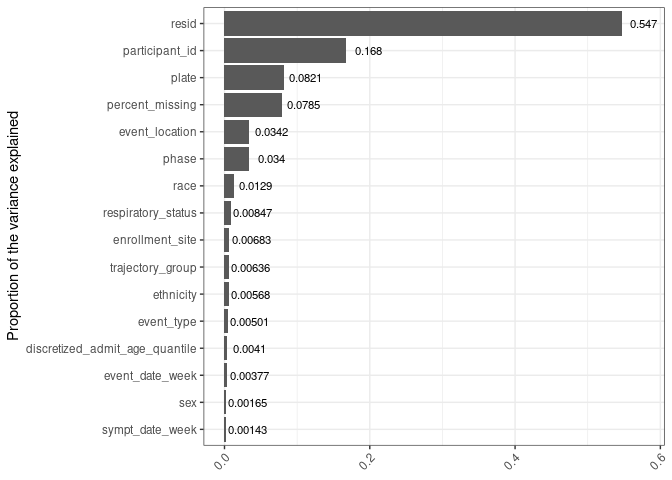
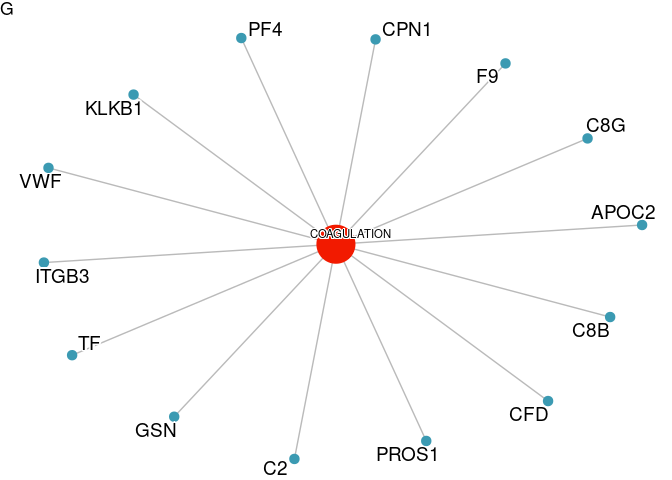
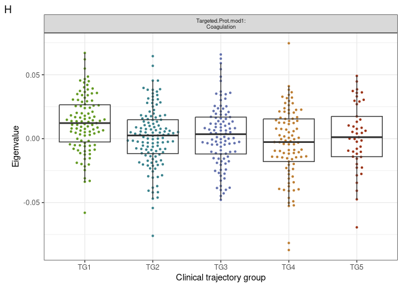
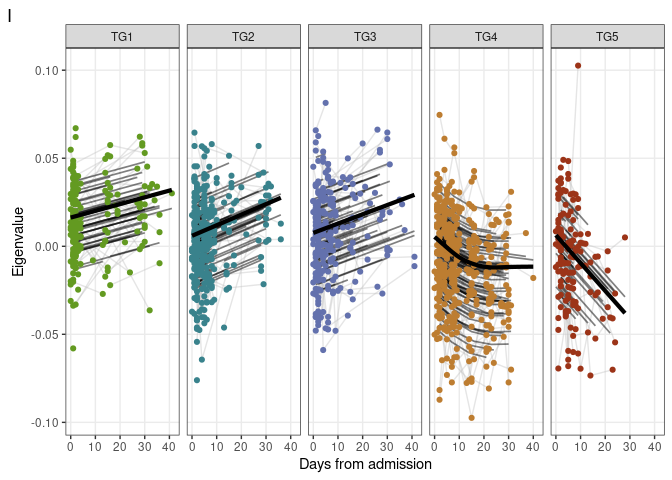
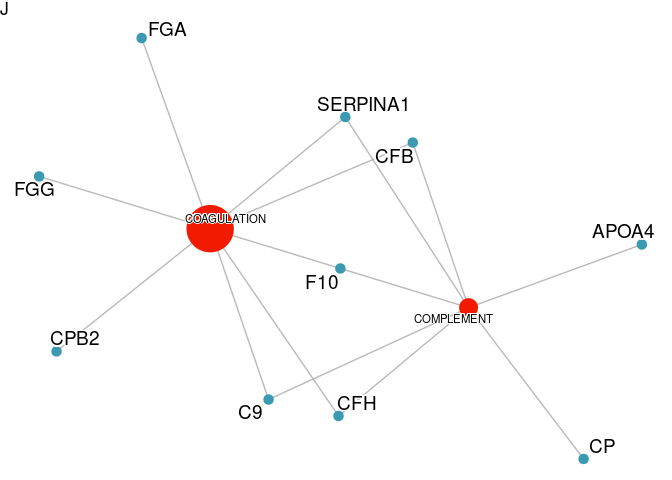
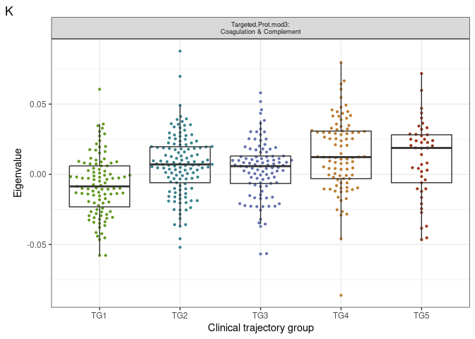
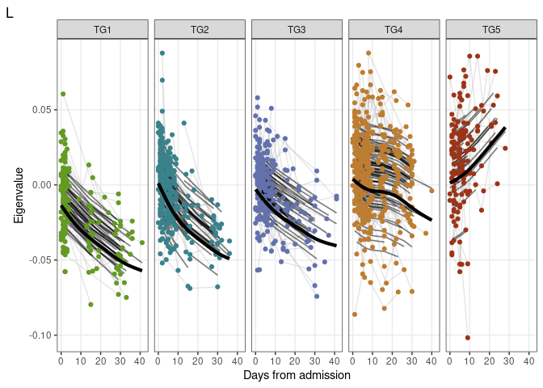

Proteomics-targeted univariate and WGCNA analysis
================
07 June, 2023

### Load libraries

``` r
suppressPackageStartupMessages(library(package = "knitr"))
suppressPackageStartupMessages(library(package = "impute"))
suppressPackageStartupMessages(library(package = "igraph"))
suppressPackageStartupMessages(library(package = "ordinal"))
suppressPackageStartupMessages(library(package = "qvalue"))
suppressPackageStartupMessages(library(package = "ggbeeswarm"))
suppressPackageStartupMessages(library(package = "ggeffects"))
suppressPackageStartupMessages(library(package = "pvca"))
suppressPackageStartupMessages(library(package = "lme4"))
suppressPackageStartupMessages(library(package = "nlme"))
suppressPackageStartupMessages(library(package = "tidyverse"))
suppressPackageStartupMessages(library(package = "msigdbr"))
suppressPackageStartupMessages(library(package = "clusterProfiler"))
suppressPackageStartupMessages(library(package = "ggraph"))
suppressPackageStartupMessages(library(package = "enrichplot"))
suppressPackageStartupMessages(library(package = "ggpubr"))

# set session options
options(show_col_types = FALSE)
VarCorr <- lme4::VarCorr
```

### Load codebase.R, load data matrices and set path to local output directory

``` r
# Get codebase. Note this is our (i.e. proteomics) own due to some small changes
#source("data_analysis_template_codebase.R")
source("../../Codebase/codebase_v2.R")

#Data for all analysis except PCA plot
data_env <- load_IMPACC_datasets(DATA_VERSION                = "2022-01-01", 
                                 KEEP_COVID19_POS            = TRUE, 
                                 FILTER_BY_CORE_ASSAY_COHORT = TRUE,
                                 ASSAY_NAMES = "plasma_proteomics_targeted")

# Data for PCA 
data_env_withHC <- load_IMPACC_datasets(DATA_VERSION                = "2022-01-01", 
                                        KEEP_COVID19_POS            = FALSE, 
                                        FILTER_BY_CORE_ASSAY_COHORT = TRUE,
                                 ASSAY_NAMES = "plasma_proteomics_targeted")

# Load the data objects into the environment.
for( n in names(data_env) ) {
  assign( n, data_env[[n]] )
}

# Setup the assay specific output directory
out_dir <- "../output"
```

### Functions: data loading

``` r
#Get Enrichment DB
all_gene_sets = msigdbr(species = "Homo sapiens", category = "H")
msigdbr_t2g = all_gene_sets %>%
  dplyr::distinct(gs_name, gene_symbol) %>%
  mutate(gs_name = str_remove_all(gs_name, "HALLMARK_")) %>%
  as.data.frame()
```

### Functions: data processing

``` r
#Define half minimum imputation method
impute_half_minimum <- function(dataset){
  #We use a simple imputation. We assume that missing values are below detection threshold.
  #We therefore fill the missing values by taking half of the minimum value for a given protein.
  #the forloop here under fills that.
  for(i in 1:ncol(dataset)) {       # for-loop over columns
    halfmin <- min(dataset[,i], na.rm = TRUE)/2
    dataset[,i][is.na(dataset[,i])] <- halfmin
  }
  
  return(dataset)
}

#copy the data, use 50% cut off filter.
plasma_proteomics_targeted_counts_filtered <- plasma_proteomics_targeted_counts %>% purrr::discard(~sum(is.na(.x))/length(.x)* 100 >=50)

#Impute using function above
plasma_proteomics_targeted_counts_filtered_imputed <- impute_half_minimum(plasma_proteomics_targeted_counts_filtered)

#Z-score the data.
plasma_proteomics_targeted_counts_filtered_imputed_normalized <- data.frame(scale(plasma_proteomics_targeted_counts_filtered_imputed))
```

### Supplementary Panel A: analysis code

``` r
#Input Matrices
pvca_input_matrix <- t(plasma_proteomics_targeted_counts_filtered_imputed)
pvca_input_raw <- t(plasma_proteomics_targeted_counts)
pvca_input_metadata <- plasma_proteomics_targeted_metadata

#Select Variables
pvca_input_phenodata <- clinical_data %>%
  mutate(event_date_week = findInterval(event_date, 
                                        vec        = c(0, 7, 14, 21, 28), 
                                        all.inside = TRUE),
         day_from_sympt  = event_date - symptom_date,
         sympt_date_week = findInterval(day_from_sympt, 
                                        vec        = c(0, 7, 14, 21, 28, Inf),
                                        all.inside = TRUE)) %>%
      select(sample_id, event_date_week, event_type, respiratory_status,
           sex, sympt_date_week, event_location, #death
           discretized_admit_age_quantile, ethnicity, participant_id, race,
           trajectory_group, enrollment_site)


# step 4 append meta data to pvca phenodata
pvca_input_phenodata <- pvca_input_metadata %>%
  rownames_to_column(var = "sample_id") %>%
  mutate(#core_site = gsub(pattern = "_.+", replacement = "", comment),
    
         plate     = interaction(phase, plate_num, drop = TRUE)) %>%
  select(sample_id, plate, phase) %>%
  merge(x     = pvca_input_phenodata,
        by    = "sample_id",
        all.x = TRUE)

# append rownames
pvca_input_phenodata <- pvca_input_phenodata %>%
  column_to_rownames(var = "sample_id")
pvca_input_phenodata <- pvca_input_phenodata[colnames(pvca_input_matrix), , drop = FALSE]

# add percent missing values (if processeed matrix required imputation otherwise comment line below)
pvca_input_phenodata$percent_missing <- factor(colMeans(is.na(pvca_input_raw[, rownames(pvca_input_phenodata)])))

# step 5: run PVCA
fit <- PVCA(counts    = pvca_input_matrix,
            meta      = pvca_input_phenodata,
            inter     = FALSE,
            threshold = 0.6)
```

    ## boundary (singular) fit: see ?isSingular
    ## boundary (singular) fit: see ?isSingular
    ## boundary (singular) fit: see ?isSingular
    ## boundary (singular) fit: see ?isSingular
    ## boundary (singular) fit: see ?isSingular
    ## boundary (singular) fit: see ?isSingular
    ## boundary (singular) fit: see ?isSingular
    ## boundary (singular) fit: see ?isSingular
    ## boundary (singular) fit: see ?isSingular
    ## boundary (singular) fit: see ?isSingular
    ## boundary (singular) fit: see ?isSingular
    ## boundary (singular) fit: see ?isSingular
    ## boundary (singular) fit: see ?isSingular
    ## boundary (singular) fit: see ?isSingular
    ## boundary (singular) fit: see ?isSingular
    ## boundary (singular) fit: see ?isSingular
    ## boundary (singular) fit: see ?isSingular
    ## boundary (singular) fit: see ?isSingular
    ## boundary (singular) fit: see ?isSingular
    ## boundary (singular) fit: see ?isSingular
    ## boundary (singular) fit: see ?isSingular
    ## boundary (singular) fit: see ?isSingular
    ## boundary (singular) fit: see ?isSingular
    ## boundary (singular) fit: see ?isSingular
    ## boundary (singular) fit: see ?isSingular

### Supplementary Panel A: output generation code

``` r
# step 6: plot barplot with PVCA results
pvca_barplot_data <- data.frame(explained = as.vector(fit),
                                effect    = names(fit)) %>%
  arrange(explained) %>%
  mutate(effect = factor(effect, levels = effect))

pvca_barplot <- ggplot(data    = pvca_barplot_data,
       mapping = aes(y = effect, x = explained)) +
  geom_bar(stat = "identity") +
  geom_text(aes(label = signif(explained, digits = 3)),
            nudge_x   = 0.03,
            size      = 3) +
  labs(x = NULL, y = "Proportion of the variance explained") + 
  theme_bw() +
  theme(axis.text.x = element_text(angle = 45,
                                   vjust = 1,
                                   hjust = 1))

#Write Plot
pdf(file.path(out_dir, "/suppl_A.pdf"))
plot(pvca_barplot)
dev.off()
```

    ## png 
    ##   2

``` r
plot(pvca_barplot)
```

<!-- -->

# Supplementary Panel B: analysis code

``` r
#Load the data specificly for this plot.
for( n in names(data_env_withHC) ) {
  assign( n, data_env_withHC[[n]] )
}

#copy the data, use 50% cut off filter.
plasma_proteomics_targeted_counts_filtered <- plasma_proteomics_targeted_counts %>% purrr::discard(~sum(is.na(.x))/length(.x)* 100 >=50)

#Impute using function above
plasma_proteomics_targeted_counts_filtered_imputed <- impute_half_minimum(plasma_proteomics_targeted_counts_filtered)

#Z-score the data.
plasma_proteomics_targeted_counts_filtered_imputed_normalized <- data.frame(scale(plasma_proteomics_targeted_counts_filtered_imputed))

pc <- prcomp(plasma_proteomics_targeted_counts_filtered_imputed_normalized)

plotDF <- pc$x[, 1:2] %>%
  as.data.frame() %>%
  rownames_to_column(var = "sample_id") %>%
  merge(y = clinical_data, by = "sample_id") %>%
  merge(y  = rownames_to_column(plasma_proteomics_targeted_metadata, var = "sample_id"),
        by = "sample_id") %>%
  mutate( enrollment_site = ifelse(test = participant_type %in% "Healthy control (Emory)",
                                  yes  = "Emory-Ctrl", 
                                  no   = enrollment_site))
enrollmentSite2color <- rainbow(n = length(unique(plotDF$enrollment_site))) %>%
  setNames(nm = unique(plotDF$enrollment_site))
enrollmentSite2color["Emory-Ctrl"] <- "black"
```

# Supplementary Panel B: output generation code

``` r
plotPCA <- ggplot(data = plotDF,
       mapping = aes(x = PC1, y = PC2, color = enrollment_site))+
  geom_point(size = 3, alpha = 0.7) +
  scale_color_manual(values = enrollmentSite2color) +
  scale_shape_manual(values = c(21, 23))+
  stat_ellipse()+
  labs(x     = paste0("1st dimension (",
                      round((pc$sdev^2/sum(pc$sdev^2))[1] * 100),
                      "%)"),
       y     = paste0("2nd dimension (",
                      round((pc$sdev^2/sum(pc$sdev^2))[2] * 100),
                      "%)"),
       tag   = "")+
  scale_fill_discrete(name = "Enrollment Sites") +
  theme_classic() +
  theme(legend.text     = element_text(size = 6),
        legend.key.size = unit(0.01, units = "npc"))

#Write Plot
pdf(file.path(out_dir, "/suppl_B.pdf"))
plot(plotPCA)
dev.off()
```

    ## png 
    ##   2

``` r
plot(plotPCA)
```

<!-- -->

# Supplementary Panel C: analysis code

``` r
#Load the data to normal back.
for( n in names(data_env) ) {
  assign( n, data_env[[n]] )
}

#copy the data, use 50% cut off filter.
plasma_proteomics_targeted_counts_filtered <- plasma_proteomics_targeted_counts %>% purrr::discard(~sum(is.na(.x))/length(.x)* 100 >=50)

#Impute using function above
plasma_proteomics_targeted_counts_filtered_imputed <- impute_half_minimum(plasma_proteomics_targeted_counts_filtered)

#Z-score the data.
plasma_proteomics_targeted_counts_filtered_imputed_normalized <- data.frame(scale(plasma_proteomics_targeted_counts_filtered_imputed))

#Get SFT values
sft_tuned = tune_soft_threshold_WGCNA(data_df = plasma_proteomics_targeted_counts_filtered,
           networkType = "signed", corFnc = "cor",powers =c(100:200)/10)
```

    ## Warning: executing %dopar% sequentially: no parallel backend registered

    ##     Power SFT.R.sq slope truncated.R.sq mean.k. median.k. max.k.
    ## 1    10.0    0.964 -1.59         0.9550   1.420    0.9190   7.04
    ## 2    10.1    0.963 -1.58         0.9530   1.380    0.8820   6.89
    ## 3    10.2    0.959 -1.57         0.9490   1.330    0.8470   6.76
    ## 4    10.3    0.940 -1.59         0.9240   1.290    0.8160   6.62
    ## 5    10.4    0.945 -1.57         0.9310   1.250    0.7860   6.49
    ## 6    10.5    0.946 -1.58         0.9310   1.210    0.7540   6.36
    ## 7    10.6    0.918 -1.59         0.8950   1.170    0.7220   6.24
    ## 8    10.7    0.921 -1.58         0.8990   1.140    0.6930   6.11
    ## 9    10.8    0.921 -1.57         0.8990   1.100    0.6650   6.00
    ## 10   10.9    0.911 -1.56         0.8850   1.070    0.6380   5.89
    ## 11   11.0    0.912 -1.55         0.8870   1.040    0.6130   5.79
    ## 12   11.1    0.930 -1.56         0.9110   1.000    0.5890   5.69
    ## 13   11.2    0.930 -1.55         0.9120   0.975    0.5660   5.59
    ## 14   11.3    0.880 -1.60         0.8490   0.946    0.5430   5.49
    ## 15   11.4    0.250 -3.30         0.1220   0.919    0.5220   5.40
    ## 16   11.5    0.247 -3.26         0.1160   0.893    0.5010   5.31
    ## 17   11.6    0.247 -3.23         0.1200   0.867    0.4820   5.22
    ## 18   11.7    0.247 -3.20         0.1230   0.843    0.4640   5.14
    ## 19   11.8    0.248 -3.18         0.1270   0.819    0.4460   5.05
    ## 20   11.9    0.249 -3.16         0.1300   0.796    0.4300   4.97
    ## 21   12.0    0.250 -3.15         0.1330   0.774    0.4140   4.89
    ## 22   12.1    0.251 -3.13         0.1370   0.753    0.3970   4.81
    ## 23   12.2    0.251 -3.12         0.1400   0.733    0.3810   4.73
    ## 24   12.3    0.252 -3.10         0.1430   0.713    0.3650   4.65
    ## 25   12.4    0.253 -3.09         0.1460   0.694    0.3500   4.58
    ## 26   12.5    0.253 -3.08         0.1490   0.675    0.3360   4.51
    ## 27   12.6    0.254 -3.07         0.1510   0.658    0.3220   4.44
    ## 28   12.7    0.252 -3.02         0.1490   0.641    0.3100   4.37
    ## 29   12.8    0.251 -3.00         0.1480   0.624    0.2990   4.30
    ## 30   12.9    0.252 -2.99         0.1510   0.608    0.2890   4.23
    ## 31   13.0    0.906 -1.50         0.8970   0.593    0.2790   4.17
    ## 32   13.1    0.905 -1.49         0.8960   0.578    0.2690   4.10
    ## 33   13.2    0.907 -1.49         0.8990   0.563    0.2580   4.04
    ## 34   13.3    0.907 -1.48         0.8980   0.549    0.2480   3.98
    ## 35   13.4    0.939 -1.47         0.9460   0.536    0.2400   3.92
    ## 36   13.5    0.947 -1.47         0.9600   0.523    0.2330   3.86
    ## 37   13.6    0.946 -1.46         0.9590   0.510    0.2260   3.80
    ## 38   13.7    0.932 -1.47         0.9430   0.498    0.2190   3.75
    ## 39   13.8    0.934 -1.47         0.9460   0.486    0.2120   3.69
    ## 40   13.9    0.934 -1.46         0.9470   0.474    0.2050   3.64
    ## 41   14.0    0.937 -1.47         0.9480   0.463    0.1960   3.59
    ## 42   14.1    0.937 -1.46         0.9470   0.452    0.1890   3.53
    ## 43   14.2    0.942 -1.45         0.9570   0.442    0.1830   3.48
    ## 44   14.3    0.942 -1.46         0.9540   0.432    0.1760   3.43
    ## 45   14.4    0.942 -1.46         0.9530   0.422    0.1700   3.38
    ## 46   14.5    0.943 -1.46         0.9520   0.413    0.1640   3.33
    ## 47   14.6    0.909 -1.48         0.9140   0.403    0.1580   3.29
    ## 48   14.7    0.909 -1.47         0.9120   0.394    0.1530   3.24
    ## 49   14.8    0.908 -1.47         0.9110   0.386    0.1480   3.19
    ## 50   14.9    0.902 -1.47         0.9000   0.377    0.1440   3.15
    ## 51   15.0    0.905 -1.48         0.9030   0.369    0.1390   3.11
    ## 52   15.1    0.907 -1.47         0.9090   0.361    0.1340   3.06
    ## 53   15.2    0.921 -1.45         0.9320   0.353    0.1290   3.02
    ## 54   15.3    0.921 -1.45         0.9320   0.346    0.1240   2.98
    ## 55   15.4    0.921 -1.44         0.9340   0.338    0.1200   2.94
    ## 56   15.5    0.923 -1.44         0.9350   0.331    0.1160   2.90
    ## 57   15.6    0.918 -1.46         0.9280   0.324    0.1120   2.86
    ## 58   15.7    0.918 -1.46         0.9290   0.318    0.1080   2.82
    ## 59   15.8    0.918 -1.45         0.9290   0.311    0.1050   2.78
    ## 60   15.9    0.918 -1.44         0.9300   0.305    0.1010   2.74
    ## 61   16.0    0.917 -1.43         0.9300   0.299    0.0979   2.71
    ## 62   16.1    0.885 -1.46         0.8900   0.293    0.0945   2.67
    ## 63   16.2    0.885 -1.46         0.8880   0.287    0.0912   2.63
    ## 64   16.3    0.884 -1.45         0.8860   0.281    0.0880   2.60
    ## 65   16.4    0.883 -1.45         0.8840   0.276    0.0849   2.57
    ## 66   16.5    0.883 -1.44         0.8820   0.270    0.0820   2.53
    ## 67   16.6    0.882 -1.44         0.8820   0.265    0.0791   2.50
    ## 68   16.7    0.882 -1.43         0.8810   0.260    0.0764   2.47
    ## 69   16.8    0.881 -1.42         0.8810   0.255    0.0737   2.43
    ## 70   16.9    0.880 -1.42         0.8770   0.250    0.0712   2.40
    ## 71   17.0    0.880 -1.42         0.8790   0.245    0.0686   2.37
    ## 72   17.1    0.884 -1.42         0.8840   0.241    0.0663   2.34
    ## 73   17.2    0.882 -1.42         0.8800   0.236    0.0641   2.31
    ## 74   17.3    0.881 -1.41         0.8790   0.232    0.0620   2.28
    ## 75   17.4    0.224 -2.39         0.0436   0.228    0.0599   2.25
    ## 76   17.5    0.224 -2.38         0.0443   0.224    0.0579   2.22
    ## 77   17.6    0.224 -2.37         0.0453   0.220    0.0560   2.19
    ## 78   17.7    0.918 -1.40         0.9560   0.216    0.0542   2.17
    ## 79   17.8    0.917 -1.39         0.9550   0.212    0.0525   2.14
    ## 80   17.9    0.916 -1.38         0.9540   0.208    0.0508   2.11
    ## 81   18.0    0.916 -1.38         0.9520   0.204    0.0494   2.09
    ## 82   18.1    0.916 -1.38         0.9490   0.201    0.0480   2.06
    ## 83   18.2    0.916 -1.38         0.9460   0.197    0.0467   2.04
    ## 84   18.3    0.916 -1.38         0.9470   0.194    0.0454   2.01
    ## 85   18.4    0.890 -1.40         0.9140   0.190    0.0441   1.99
    ## 86   18.5    0.889 -1.39         0.9130   0.187    0.0428   1.96
    ## 87   18.6    0.889 -1.40         0.9100   0.184    0.0415   1.94
    ## 88   18.7    0.921 -1.35         0.9510   0.181    0.0403   1.91
    ## 89   18.8    0.923 -1.35         0.9570   0.178    0.0390   1.89
    ## 90   18.9    0.923 -1.35         0.9550   0.175    0.0378   1.87
    ## 91   19.0    0.920 -1.34         0.9480   0.172    0.0366   1.84
    ## 92   19.1    0.248 -2.38         0.1530   0.169    0.0354   1.82
    ## 93   19.2    0.248 -2.39         0.1520   0.166    0.0342   1.80
    ## 94   19.3    0.247 -2.38         0.1520   0.164    0.0330   1.78
    ## 95   19.4    0.247 -2.37         0.1520   0.161    0.0319   1.76
    ## 96   19.5    0.247 -2.36         0.1510   0.159    0.0308   1.74
    ## 97   19.6    0.248 -2.36         0.1560   0.156    0.0298   1.72
    ## 98   19.7    0.248 -2.36         0.1560   0.154    0.0288   1.70
    ## 99   19.8    0.248 -2.38         0.1530   0.151    0.0278   1.68
    ## 100  19.9    0.248 -2.37         0.1510   0.149    0.0269   1.66
    ## 101  20.0    0.248 -2.36         0.1510   0.147    0.0260   1.64

<!-- -->

    ## WGCNA's suggestion for the power value:  10

``` r
#Run WGCNA
if(!is.na(sft_tuned$powerEstimate)){
  ret =   generate_WGCNA_modules(
                   data_df = plasma_proteomics_targeted_counts_filtered, 
                   # Preprocessed data in data.frame class
                   networkType = "signed",     
                   # Indicate the type of network to construct
                   power = sft_tuned$powerEstimate,              
                   # Provide a power value chosen from the first step, this parameter is mandatory.
                   minModuleSize = 10,      
                   # Provide a value for the minimum number of features a module can have; use a larger value (> 30) for datasets with thousands of features, and a smaller value otherwise.
                   corType = "pearson",         
                   # Correlation function
                   maxPOutliers = 0.1, 
                   # It is safer to use a smaller value for this parameter when corType = bicor is used.
                   assay_alias = "Targetedprot",         
                   # Append this assay_alias to the module names as prefix.
                   reassignThreshold = 1e-6,   
                   # This and rest of the parameters use default values, but users may want to tweak them based on the assay type and data.
                   mergeCutHeight = 0.05,
                   minKMEtoStay = 0.25,
                   minCoreKME = 0.1,
                   deepSplit = 4)
  }
```

    ##  Calculating module eigengenes block-wise from all genes
    ##    Flagging genes and samples with too many missing values...
    ##     ..step 1
    ##  ..Working on block 1 .
    ##     TOM calculation: adjacency..
    ##     ..will not use multithreading.
    ##      Fraction of slow calculations: 0.854045
    ##     ..connectivity..
    ##     ..matrix multiplication (system BLAS)..
    ##     ..normalization..
    ##     ..done.
    ##  ....clustering..
    ##  ....detecting modules..
    ##  ....calculating module eigengenes..
    ##  ....checking kME in modules..
    ##      ..removing 5 genes from module 1 because their KME is too low.
    ##      ..removing 1 genes from module 2 because their KME is too low.
    ##      ..removing 4 genes from module 3 because their KME is too low.
    ##      ..removing 5 genes from module 5 because their KME is too low.
    ##      ..removing 1 genes from module 6 because their KME is too low.
    ##      ..removing 1 genes from module 7 because their KME is too low.
    ##   ..reassigning 3 genes from module 1 to modules with higher KME.
    ##   ..reassigning 1 genes from module 4 to modules with higher KME.
    ##  ..merging modules that are too close..
    ##      mergeCloseModules: Merging modules whose distance is less than 0.05
    ##        Calculating new MEs...

    ## The automatically generated colors map from the minus and plus 99^th of
    ## the absolute values in the matrix. There are outliers in the matrix
    ## whose patterns might be hidden by this color mapping. You can manually
    ## set the color to `col` argument.
    ## 
    ## Use `suppressMessages()` to turn off this message.

<!-- -->

    ## The automatically generated colors map from the minus and plus 99^th of
    ## the absolute values in the matrix. There are outliers in the matrix
    ## whose patterns might be hidden by this color mapping. You can manually
    ## set the color to `col` argument.
    ## 
    ## Use `suppressMessages()` to turn off this message.

<!-- -->

    ## The automatically generated colors map from the minus and plus 99^th of
    ## the absolute values in the matrix. There are outliers in the matrix
    ## whose patterns might be hidden by this color mapping. You can manually
    ## set the color to `col` argument.
    ## 
    ## Use `suppressMessages()` to turn off this message.
    ## The automatically generated colors map from the minus and plus 99^th of
    ## the absolute values in the matrix. There are outliers in the matrix
    ## whose patterns might be hidden by this color mapping. You can manually
    ## set the color to `col` argument.
    ## 
    ## Use `suppressMessages()` to turn off this message.

<!-- -->

    ## [1] "Note: mod0 = 'grey' module"

# Supplementary Panel C: output generation code

``` r
# Opening the graphical device
pdf(file.path(out_dir, "/suppl_C.pdf"))
# Creating a plot
draw(ret$WGCNAPlot1)
dev.off()
```

    ## png 
    ##   2

``` r
draw(ret$WGCNAPlot1)
```

<!-- -->

### Panel G: analysis code

``` r
#Take module 1 proteins, test them against Hallmark DB
targetedmod1_extract <- ret$module_membership %>% filter(module == "Targetedprot_mod1")
targetedmod1_enrichment <- enricher(gene = targetedmod1_extract$feature, TERM2GENE = msigdbr_t2g)
```

### Panel G: output generation code

``` r
#Plot using clusterprofiler
targetedmod1_enrichmentplot <- cnetplot(targetedmod1_enrichment, cex_category = 2, cex_label_category = 0.6, cex__label_gene = 0.6) +
  scale_color_manual(values = c("#3B9AB2", "#F21A00")) +
  theme(legend.position = "none") +
  labs(tag = "G")

#Write 
pdf(file.path(out_dir, "/main_G.pdf"))
plot(targetedmod1_enrichmentplot)
dev.off()
```

    ## png 
    ##   2

``` r
plot(targetedmod1_enrichmentplot)
```

<!-- -->

\#Panel H: analysis code

``` r
######################################
#Prepare data for univariate analysis.
######################################
clinical_subsets = clinical_data
rownames(clinical_subsets) = clinical_subsets$sample_id
row_ids = rownames(plasma_proteomics_targeted_counts_filtered)
clinical_subsets = clinical_subsets[row_ids,]
visit1_row_ids = rownames(clinical_subsets[clinical_subsets$event_type == 'Visit 1',])

# Use the visit1_row_ids to only get samples from 'Visit 1':
modules_filtered = ret$MEs[visit1_row_ids ,]
clinical_subsets = clinical_subsets[visit1_row_ids ,]
data_use = modules_filtered 

# Add the respiratory_status_day14 as $endpoints
data_use$endpoints = as.factor(clinical_subsets$trajectory_group)

# Add the enrollment_site as $sites
data_use$sites = clinical_subsets$enrollment_site
data_use$age =  clinical_subsets$discretized_admit_age_quantile
data_use$sex =  clinical_subsets$sex
data_use$control =  factor(1:nrow(data_use))

# Set module names:
module_names = colnames(modules_filtered)

# Only use samples that have valid endpoints (not NA/missing)
data_use = data_use[!is.na(data_use$endpoints),]

######################
# Run ordinal analysis
######################
res_table_ordinal = data.frame(matrix(0, ncol = 3, nrow = length(module_names)+1))
colnames(res_table_ordinal) = c("AIC", "pval", "qval")
rownames(res_table_ordinal) = c(module_names, "combined")
for(j in 1:length(module_names)){
  print(j)
  my.formula0 = paste0('endpoints~ 1+(1|sites)+age+sex')
  my.formula1 = paste0('endpoints~',module_names[j],'+(1|sites)+age+sex')
  res_table_ordinal[j,1:2]=mixed_ordinal(my.formula0, my.formula1,data_use)
}
```

    ## [1] 1
    ## [1] 2
    ## [1] 3
    ## [1] 4
    ## [1] 5
    ## [1] 6
    ## [1] 7
    ## [1] 8

``` r
my.formula0 = paste0('endpoints~ 1+(1|sites)+age+sex')
my.formula1 = paste0('endpoints~',paste(module_names, collapse = " + "),'+ (1|sites)+age+sex')
res_table_ordinal[length(module_names)+1,1:2] = mixed_ordinal(my.formula0, my.formula1,data_use)
res_table_ordinal$qval =  qvalue::qvalue(res_table_ordinal$pval, fdr.level = 0.05, pi0 = 1)$qvalues

#######################
# RUN pairwise analysis
#######################

for(j in 1:length(module_names)){
  print(j)
  my.formula0 = paste0(module_names[j],"~ (1|sites)+age+sex")
  my.formula1 = paste0(module_names[j],"~ endpoints + (1|sites)+age+sex")
  if(j == 1){
    tmp = mixed_pairwise(my.formula0, my.formula1, data_use)
    res_table_pairwise = data.frame(matrix(0, ncol = length(tmp), nrow = length(module_names)))
    res_table_pairwise[j,] = tmp
    colnames(res_table_pairwise) = names(tmp)
  }else{
    res_table_pairwise[j,] = mixed_pairwise(my.formula0, my.formula1, data_use)
  }
}
```

    ## [1] 1

    ## refitting model(s) with ML (instead of REML)
    ## refitting model(s) with ML (instead of REML)
    ## refitting model(s) with ML (instead of REML)
    ## refitting model(s) with ML (instead of REML)
    ## refitting model(s) with ML (instead of REML)
    ## refitting model(s) with ML (instead of REML)
    ## refitting model(s) with ML (instead of REML)
    ## refitting model(s) with ML (instead of REML)
    ## refitting model(s) with ML (instead of REML)
    ## refitting model(s) with ML (instead of REML)

    ## [1] 2

    ## boundary (singular) fit: see ?isSingular

    ## boundary (singular) fit: see ?isSingular

    ## refitting model(s) with ML (instead of REML)

    ## boundary (singular) fit: see ?isSingular
    ## boundary (singular) fit: see ?isSingular

    ## refitting model(s) with ML (instead of REML)

    ## boundary (singular) fit: see ?isSingular

    ## refitting model(s) with ML (instead of REML)

    ## boundary (singular) fit: see ?isSingular
    ## boundary (singular) fit: see ?isSingular

    ## refitting model(s) with ML (instead of REML)
    ## refitting model(s) with ML (instead of REML)

    ## boundary (singular) fit: see ?isSingular
    ## boundary (singular) fit: see ?isSingular

    ## refitting model(s) with ML (instead of REML)

    ## boundary (singular) fit: see ?isSingular
    ## boundary (singular) fit: see ?isSingular

    ## refitting model(s) with ML (instead of REML)
    ## refitting model(s) with ML (instead of REML)
    ## refitting model(s) with ML (instead of REML)
    ## refitting model(s) with ML (instead of REML)

    ## [1] 3

    ## refitting model(s) with ML (instead of REML)
    ## refitting model(s) with ML (instead of REML)
    ## refitting model(s) with ML (instead of REML)
    ## refitting model(s) with ML (instead of REML)

    ## boundary (singular) fit: see ?isSingular

    ## refitting model(s) with ML (instead of REML)
    ## refitting model(s) with ML (instead of REML)

    ## boundary (singular) fit: see ?isSingular
    ## boundary (singular) fit: see ?isSingular

    ## refitting model(s) with ML (instead of REML)

    ## boundary (singular) fit: see ?isSingular
    ## boundary (singular) fit: see ?isSingular

    ## refitting model(s) with ML (instead of REML)
    ## refitting model(s) with ML (instead of REML)

    ## boundary (singular) fit: see ?isSingular
    ## boundary (singular) fit: see ?isSingular

    ## refitting model(s) with ML (instead of REML)

    ## [1] 4

    ## boundary (singular) fit: see ?isSingular

    ## boundary (singular) fit: see ?isSingular

    ## refitting model(s) with ML (instead of REML)

    ## boundary (singular) fit: see ?isSingular

    ## refitting model(s) with ML (instead of REML)
    ## refitting model(s) with ML (instead of REML)

    ## boundary (singular) fit: see ?isSingular
    ## boundary (singular) fit: see ?isSingular

    ## refitting model(s) with ML (instead of REML)
    ## refitting model(s) with ML (instead of REML)
    ## refitting model(s) with ML (instead of REML)
    ## refitting model(s) with ML (instead of REML)
    ## refitting model(s) with ML (instead of REML)
    ## refitting model(s) with ML (instead of REML)
    ## refitting model(s) with ML (instead of REML)

    ## [1] 5

    ## refitting model(s) with ML (instead of REML)

    ## boundary (singular) fit: see ?isSingular
    ## boundary (singular) fit: see ?isSingular

    ## refitting model(s) with ML (instead of REML)

    ## boundary (singular) fit: see ?isSingular
    ## boundary (singular) fit: see ?isSingular

    ## refitting model(s) with ML (instead of REML)
    ## refitting model(s) with ML (instead of REML)
    ## refitting model(s) with ML (instead of REML)
    ## refitting model(s) with ML (instead of REML)
    ## refitting model(s) with ML (instead of REML)

    ## boundary (singular) fit: see ?isSingular
    ## boundary (singular) fit: see ?isSingular

    ## refitting model(s) with ML (instead of REML)
    ## refitting model(s) with ML (instead of REML)

    ## boundary (singular) fit: see ?isSingular

    ## refitting model(s) with ML (instead of REML)

    ## [1] 6

    ## refitting model(s) with ML (instead of REML)
    ## refitting model(s) with ML (instead of REML)

    ## boundary (singular) fit: see ?isSingular
    ## boundary (singular) fit: see ?isSingular

    ## refitting model(s) with ML (instead of REML)
    ## refitting model(s) with ML (instead of REML)
    ## refitting model(s) with ML (instead of REML)
    ## refitting model(s) with ML (instead of REML)
    ## refitting model(s) with ML (instead of REML)

    ## boundary (singular) fit: see ?isSingular
    ## boundary (singular) fit: see ?isSingular

    ## refitting model(s) with ML (instead of REML)
    ## refitting model(s) with ML (instead of REML)

    ## boundary (singular) fit: see ?isSingular
    ## boundary (singular) fit: see ?isSingular

    ## refitting model(s) with ML (instead of REML)

    ## [1] 7

    ## refitting model(s) with ML (instead of REML)

    ## boundary (singular) fit: see ?isSingular
    ## boundary (singular) fit: see ?isSingular

    ## refitting model(s) with ML (instead of REML)

    ## boundary (singular) fit: see ?isSingular
    ## boundary (singular) fit: see ?isSingular

    ## refitting model(s) with ML (instead of REML)
    ## refitting model(s) with ML (instead of REML)
    ## refitting model(s) with ML (instead of REML)

    ## boundary (singular) fit: see ?isSingular
    ## boundary (singular) fit: see ?isSingular

    ## refitting model(s) with ML (instead of REML)
    ## refitting model(s) with ML (instead of REML)

    ## boundary (singular) fit: see ?isSingular

    ## refitting model(s) with ML (instead of REML)

    ## boundary (singular) fit: see ?isSingular

    ## refitting model(s) with ML (instead of REML)

    ## boundary (singular) fit: see ?isSingular
    ## boundary (singular) fit: see ?isSingular

    ## refitting model(s) with ML (instead of REML)

    ## [1] 8

    ## boundary (singular) fit: see ?isSingular

    ## boundary (singular) fit: see ?isSingular

    ## refitting model(s) with ML (instead of REML)

    ## boundary (singular) fit: see ?isSingular
    ## boundary (singular) fit: see ?isSingular

    ## refitting model(s) with ML (instead of REML)

    ## boundary (singular) fit: see ?isSingular

    ## refitting model(s) with ML (instead of REML)

    ## boundary (singular) fit: see ?isSingular
    ## boundary (singular) fit: see ?isSingular

    ## refitting model(s) with ML (instead of REML)

    ## boundary (singular) fit: see ?isSingular
    ## boundary (singular) fit: see ?isSingular

    ## refitting model(s) with ML (instead of REML)

    ## boundary (singular) fit: see ?isSingular
    ## boundary (singular) fit: see ?isSingular

    ## refitting model(s) with ML (instead of REML)

    ## boundary (singular) fit: see ?isSingular
    ## boundary (singular) fit: see ?isSingular

    ## refitting model(s) with ML (instead of REML)
    ## refitting model(s) with ML (instead of REML)
    ## refitting model(s) with ML (instead of REML)
    ## refitting model(s) with ML (instead of REML)

``` r
rownames(res_table_pairwise) = module_names
res_table_pairwise_adj = qvalue::qvalue(as.vector(res_table_pairwise), fdr.level = 0.05, pi0 = 1)$qvalues

########################
#Make the visualization
########################

visit1Mod1 <- data_use %>%
  rownames_to_column(var = "sample_id") %>%
 dplyr::select(sample_id, Targetedprot_mod1, Targetedprot_mod3, endpoints) %>%
  pivot_longer(cols = -c(sample_id, endpoints)) %>%
  filter(name %in% "Targetedprot_mod1") %>%
  mutate(name = "Targeted.Prot.mod1:\nCoagulation",###############################
         trajectory_group = paste0("TG", endpoints)) %>%
  ggplot(mapping = aes(x = trajectory_group, y = value)) +
  geom_beeswarm(mapping = aes(color =trajectory_group), cex = 1.5, size = 0.8) +
  geom_boxplot(fill = "transparent", outlier.color= "transparent") +
  facet_wrap(facets= ~name, ncol = 1) +
  theme_bw() +
  theme(legend.pos = "none", strip.text = element_text(size = 7)) + 
  labs(y = "Eigenvalue", x = "Clinical trajectory group", tag = "H") +
  scale_color_manual(values = c("TG1" = "#639A21",
                                                          "TG2" = "#39828C",
                                                          "TG3"     = "#6371AD",
                                                          "TG4"     = "#BD7D31",
                                                          "TG5"      = "#9C3418"))
```

\#Panel H: output generation code

``` r
pdf(file.path(out_dir, "/main_H.pdf"))
plot(visit1Mod1)
dev.off()
```

    ## png 
    ##   2

``` r
plot(visit1Mod1)
```

<!-- -->

# Panel I: analysis code

``` r
########################################################
#Prepare data for longitudinal smoothing spline analysis
########################################################
clinical_subsets = clinical_data
rownames(clinical_subsets) = clinical_subsets$sample_id
row_ids = rownames(plasma_proteomics_targeted_counts_filtered)
clinical_subsets = clinical_subsets[row_ids,]
modules_scores = ret$MEs
modules_filtered =modules_scores
clinical_subsets = clinical_subsets
data_use = cbind(modules_filtered, clinical_subsets[c("trajectory_group", "respiratory_status_day14", "respiratory_status_day28",  "event_date", "enrollment_site", "participant_id","sex", "discretized_admit_age_quantile")])

inputDF <- ret$MEs %>%
  rownames_to_column(var = "sample_id") %>%
  merge(y = dplyr::select(clinical_data, sample_id, event_date, participant_id, respiratory_status_day14, respiratory_status_day28,enrollment_site, trajectory_group, sex, admit_age, enrollment_site, discretized_admit_age_quantile),
        by = "sample_id") %>%
  # mutate_if(is.numeric, funs(ifelse(is.na(symptom_date), 0, .))) %>%  #### DFSO
  # mutate(event_date=event_date-symptom_date) %>%
  # select(-symptom_date) %>%################ DFSO!!
  mutate(outcomeD14  = cut(respiratory_status_day14,
                           breaks = c(1, 2, 4, 6, 7),
                           include.lowest = TRUE)) %>%
  mutate(outcomeD28  = cut(respiratory_status_day28,
                           breaks = c(1, 2, 4, 6, 7),
                           include.lowest = TRUE)) %>%
  pivot_longer(cols = -c("sample_id", "event_date", "participant_id",
                         "enrollment_site", "trajectory_group",
                         "respiratory_status_day14", "outcomeD14",
                         "respiratory_status_day28", "outcomeD28",
                         "sex", "admit_age", "discretized_admit_age_quantile")) %>%
  filter(!is.na(value) & !is.na(trajectory_group))

## Ensure proper variables are factors
inputDF[["trajectory_group"]] = ordered(as.factor(as.character(inputDF[["trajectory_group"]])), levels =
                                        c("1", "2", "3", "4", "5"))
inputDF$name <- as.factor(inputDF$name)
inputDF$sex <- factor(inputDF$sex, levels = c("Female", "Male"))
inputDF$discretized_admit_age_quantile <- as.factor(inputDF$discretized_admit_age_quantile)
inputDF$participant_id <- as.factor(inputDF$participant_id)
inputDF$enrollment_site <- as.factor(inputDF$enrollment_site)

smooth_model_loop <- model_loop(inputDF, age_sex=T, modelType = "smoothSpline", endpoint = "trajectory_group")
```

    ## [1] 1
    ## [1] 2
    ## [1] 3
    ## [1] 4
    ## [1] 5
    ## [1] 6
    ## [1] 7
    ## [1] 8

    ## 
    ##  Initial calculation of p.slope and p.intercept complete. Beginning pairwise comparisons.

``` r
print(smooth_model_loop)
```

    ##                        p.slope  p.intercept p.intercept.sex
    ## Targetedprot_mod0 3.124412e-01 3.425107e-01     0.045170701
    ## Targetedprot_mod1 7.659031e-15 4.037704e-15     0.602810371
    ## Targetedprot_mod2 2.262814e-01 2.314748e-01     0.238511399
    ## Targetedprot_mod3 6.896390e-16 1.111984e-25     0.004781191
    ## Targetedprot_mod4 7.240617e-05 3.665383e-01     0.003995111
    ## Targetedprot_mod5 3.438773e-03 1.412750e-01     0.178415494
    ## Targetedprot_mod6 1.356798e-01 4.656920e-03     0.302123004
    ## Targetedprot_mod7 9.436997e-09 1.069683e-06     0.773516592
    ##                   p.intercept.age.quantile   adjp.slope adjp.intercept
    ## Targetedprot_mod0               0.17964007 3.124412e-01   3.665383e-01
    ## Targetedprot_mod1               0.09929839 3.063613e-14   1.615081e-14
    ## Targetedprot_mod2               0.24390638 2.586073e-01   3.086331e-01
    ## Targetedprot_mod3               0.11221956 5.517112e-15   8.895871e-25
    ## Targetedprot_mod4               0.33956791 1.448123e-04   3.665383e-01
    ## Targetedprot_mod5               0.77788673 5.502036e-03   2.260400e-01
    ## Targetedprot_mod6               0.22665988 1.809064e-01   9.313840e-03
    ## Targetedprot_mod7               0.59584951 2.516532e-08   2.852487e-06
    ##                   adjp.intercept.sex adjp.intercept.age.quantile p.slope_1v2
    ## Targetedprot_mod0         0.12045520                   0.3902502   0.2355009
    ## Targetedprot_mod1         0.68892614                   0.3902502   0.1922469
    ## Targetedprot_mod2         0.38161824                   0.3902502   0.0808926
    ## Targetedprot_mod3         0.01912477                   0.3902502   0.1025718
    ## Targetedprot_mod4         0.01912477                   0.4527572   0.2134591
    ## Targetedprot_mod5         0.35683099                   0.7778867   0.7558058
    ## Targetedprot_mod6         0.40283067                   0.3902502   0.5961963
    ## Targetedprot_mod7         0.77351659                   0.6809709   0.3236891
    ##                   p.slope_1v3  p.slope_1v4  p.slope_1v5 p.slope_2v3
    ## Targetedprot_mod0  0.09347075 9.981862e-01 1.748949e-01  0.35955372
    ## Targetedprot_mod1  0.42657671 2.864743e-08 2.650888e-08  0.67528501
    ## Targetedprot_mod2  0.66438209 1.752299e-03 1.046004e-01  0.29993358
    ## Targetedprot_mod3  0.47666691 2.218620e-04 7.141177e-12  0.01977108
    ## Targetedprot_mod4  0.32054088 6.359897e-04 4.189793e-02  0.79102513
    ## Targetedprot_mod5  0.38336436 3.867189e-03 4.678283e-03  0.49926442
    ## Targetedprot_mod6  0.78857887 4.884924e-02 1.025098e-01  0.68455117
    ## Targetedprot_mod7  0.59510663 1.090266e-05 2.868030e-05  0.11570760
    ##                    p.slope_2v4  p.slope_2v5  p.slope_3v4  p.slope_3v5
    ## Targetedprot_mod0 4.390339e-01 3.953823e-01 3.942777e-02 1.234975e-01
    ## Targetedprot_mod1 1.692872e-10 2.428344e-10 2.242460e-09 1.120928e-08
    ## Targetedprot_mod2 7.689525e-03 2.961432e-01 1.606193e-02 3.539542e-01
    ## Targetedprot_mod3 9.486450e-07 4.850588e-18 3.707332e-03 2.603244e-11
    ## Targetedprot_mod4 3.550621e-03 8.108849e-02 1.939504e-03 1.494717e-01
    ## Targetedprot_mod5 5.926638e-03 8.506155e-03 4.366361e-02 9.741655e-02
    ## Targetedprot_mod6 1.790947e-01 2.089280e-01 5.359788e-02 1.294552e-01
    ## Targetedprot_mod7 7.283252e-08 7.002169e-07 9.299159e-05 2.101107e-04
    ##                    p.slope_4v5 p.intercept_1v2 p.intercept_1v3 p.intercept_1v4
    ## Targetedprot_mod0 3.876829e-01    2.523793e-01    6.932513e-01    3.552504e-01
    ## Targetedprot_mod1 1.615438e-02    7.293833e-04    5.352230e-03    5.306713e-11
    ## Targetedprot_mod2 6.125680e-01    2.410208e-01    7.470613e-02    8.551824e-01
    ## Targetedprot_mod3 2.428871e-07    5.750380e-06    2.598003e-07    3.499138e-12
    ## Targetedprot_mod4 5.304777e-01    1.325988e-01    1.481875e-01    9.355369e-02
    ## Targetedprot_mod5 4.793784e-01    9.862952e-01    9.680029e-01    1.157754e-01
    ## Targetedprot_mod6 5.756008e-01    6.986019e-01    5.551190e-01    1.846979e-02
    ## Targetedprot_mod7 2.538789e-01    1.654007e-01    2.277646e-02    4.767336e-08
    ##                   p.intercept_1v5 p.intercept_2v3 p.intercept_2v4
    ## Targetedprot_mod0    4.464352e-01       0.4461198    5.021139e-01
    ## Targetedprot_mod1    3.595312e-09       0.8409944    1.050686e-06
    ## Targetedprot_mod2    7.372038e-01       0.1829329    4.937061e-01
    ## Targetedprot_mod3    1.305649e-13       0.3514255    1.117409e-07
    ## Targetedprot_mod4    9.104081e-01       0.7235543    5.001889e-01
    ## Targetedprot_mod5    2.258850e-02       0.7568759    1.083750e-01
    ## Targetedprot_mod6    7.772107e-03       0.7304920    6.556515e-02
    ## Targetedprot_mod7    1.365872e-04       0.6715039    5.005192e-05
    ##                   p.intercept_2v5 p.intercept_3v4 p.intercept_3v5
    ## Targetedprot_mod0    5.873304e-01    7.657114e-01    3.080597e-01
    ## Targetedprot_mod1    1.270529e-04    1.964887e-06    5.461433e-05
    ## Targetedprot_mod2    7.025895e-01    3.678875e-02    9.085744e-01
    ## Targetedprot_mod3    1.591404e-10    2.160024e-05    1.229323e-09
    ## Targetedprot_mod4    2.920659e-01    6.329049e-01    4.788165e-01
    ## Targetedprot_mod5    7.770411e-02    1.710108e-01    1.362320e-01
    ## Targetedprot_mod6    1.439718e-02    4.427031e-02    3.371722e-03
    ## Targetedprot_mod7    8.890484e-02    3.123309e-04    3.271404e-02
    ##                   p.intercept_4v5 p.intercept.sex_1v2 p.intercept.sex_1v3
    ## Targetedprot_mod0      0.07825861         0.028623859          0.18062747
    ## Targetedprot_mod1      0.36255641         0.971401935          0.45546605
    ## Targetedprot_mod2      0.42970434         0.464299977          0.86711804
    ## Targetedprot_mod3      0.00615455         0.002521953          0.25705665
    ## Targetedprot_mod4      0.19409284         0.163994209          0.01915235
    ## Targetedprot_mod5      0.18558519         0.891116341          0.35803511
    ## Targetedprot_mod6      0.17639408         0.591905799          0.51726993
    ## Targetedprot_mod7      0.88627833         0.062629131          0.69820325
    ##                   p.intercept.sex_1v4 p.intercept.sex_1v5 p.intercept.sex_2v3
    ## Targetedprot_mod0         0.582337559          0.69994067          0.01568396
    ## Targetedprot_mod1         0.771108826          0.75359655          0.82185749
    ## Targetedprot_mod2         0.008870657          0.90050121          0.67734113
    ## Targetedprot_mod3         0.683304198          0.01155045          0.01207431
    ## Targetedprot_mod4         0.031521903          0.24868481          0.04246588
    ## Targetedprot_mod5         0.844119080          0.76162284          0.11727097
    ## Targetedprot_mod6         0.370986454          0.33762328          0.02345879
    ## Targetedprot_mod7         0.866671687          0.39639971          0.98374342
    ##                   p.intercept.sex_2v4 p.intercept.sex_2v5 p.intercept.sex_3v4
    ## Targetedprot_mod0          0.06087868        0.0856081478          0.26456896
    ## Targetedprot_mod1          0.28354860        0.1691004895          0.95277240
    ## Targetedprot_mod2          0.04322974        0.8628140715          0.15633035
    ## Targetedprot_mod3          0.08670585        0.0001465664          0.84646423
    ## Targetedprot_mod4          0.08424230        0.4030908329          0.01160627
    ## Targetedprot_mod5          0.54426741        0.3688205616          0.08067124
    ## Targetedprot_mod6          0.29408542        0.1939430284          0.27941168
    ## Targetedprot_mod7          0.62715873        0.1230763445          0.18314554
    ##                   p.intercept.sex_3v5 p.intercept.sex_4v5
    ## Targetedprot_mod0          0.39365297          0.87665542
    ## Targetedprot_mod1          0.58586472          0.47877879
    ## Targetedprot_mod2          0.17114216          0.06486008
    ## Targetedprot_mod3          0.01924764          0.35395609
    ## Targetedprot_mod4          0.06418002          0.07619477
    ## Targetedprot_mod5          0.02328910          0.29289315
    ## Targetedprot_mod6          0.06337861          0.97945521
    ## Targetedprot_mod7          0.76844410          0.76065997
    ##                   p.intercept.age.quantile_1v2 p.intercept.age.quantile_1v3
    ## Targetedprot_mod0                  0.131137709                  0.068540990
    ## Targetedprot_mod1                  0.377874823                  0.299986624
    ## Targetedprot_mod2                  0.002727899                  0.279428039
    ## Targetedprot_mod3                  0.074343493                  0.230838984
    ## Targetedprot_mod4                  0.361138920                  0.613334681
    ## Targetedprot_mod5                  0.955759210                  0.239170102
    ## Targetedprot_mod6                  0.795789190                  0.006448976
    ## Targetedprot_mod7                  0.012146953                  0.089569676
    ##                   p.intercept.age.quantile_1v4 p.intercept.age.quantile_1v5
    ## Targetedprot_mod0                  0.117787985                   0.86859482
    ## Targetedprot_mod1                  0.534939824                   0.65044985
    ## Targetedprot_mod2                  0.282046683                   0.37063529
    ## Targetedprot_mod3                  0.221347967                   0.39846240
    ## Targetedprot_mod4                  0.915310176                   0.82032240
    ## Targetedprot_mod5                  0.995176115                   0.61913158
    ## Targetedprot_mod6                  0.766982404                   0.73280963
    ## Targetedprot_mod7                  0.007132668                   0.05203421
    ##                   p.intercept.age.quantile_2v3 p.intercept.age.quantile_2v4
    ## Targetedprot_mod0                  0.007523465                   0.91641318
    ## Targetedprot_mod1                  0.197427695                   0.17834047
    ## Targetedprot_mod2                  0.316716782                   0.01827535
    ## Targetedprot_mod3                  0.047029835                   0.26292016
    ## Targetedprot_mod4                  0.404402990                   0.78542836
    ## Targetedprot_mod5                  0.353137927                   0.69983414
    ## Targetedprot_mod6                  0.222530752                   0.98065621
    ## Targetedprot_mod7                  0.940014945                   0.07029050
    ##                   p.intercept.age.quantile_2v5 p.intercept.age.quantile_3v4
    ## Targetedprot_mod0                    0.2008259                   0.75511722
    ## Targetedprot_mod1                    0.4237322                   0.37439979
    ## Targetedprot_mod2                    0.1255979                   0.15767107
    ## Targetedprot_mod3                    0.2788040                   0.71421351
    ## Targetedprot_mod4                    0.3970532                   0.81240561
    ## Targetedprot_mod5                    0.7656408                   0.27686193
    ## Targetedprot_mod6                    0.9596546                   0.04098943
    ## Targetedprot_mod7                    0.4137261                   0.54509764
    ##                   p.intercept.age.quantile_3v5 p.intercept.age.quantile_4v5
    ## Targetedprot_mod0                   0.15491949                    0.5435253
    ## Targetedprot_mod1                   0.44251886                    0.2209311
    ## Targetedprot_mod2                   0.06399199                    0.9824543
    ## Targetedprot_mod3                   0.30993232                    0.5222307
    ## Targetedprot_mod4                   0.50041272                    0.9438268
    ## Targetedprot_mod5                   0.46495784                    0.8067405
    ## Targetedprot_mod6                   0.01317822                    0.9879272
    ## Targetedprot_mod7                   0.31481731                    0.9160517
    ##                   p.slope.adj_1v2 p.slope.adj_1v3 p.slope.adj_1v4
    ## Targetedprot_mod0       0.3554731       0.1917349    9.981862e-01
    ## Targetedprot_mod1       0.3075950       0.5332209    2.546438e-07
    ## Targetedprot_mod2       0.1707126       0.7182509    7.009196e-03
    ## Targetedprot_mod3       0.1946053       0.5723921    9.860532e-04
    ## Targetedprot_mod4       0.3283987       0.4464677    2.677852e-03
    ## Targetedprot_mod5       0.7852528       0.5002360    1.289063e-02
    ## Targetedprot_mod6       0.6624403       0.8010381    1.116554e-01
    ## Targetedprot_mod7       0.4464677       0.6624403    6.230093e-05
    ##                   p.slope.adj_1v5 p.slope.adj_2v3 p.slope.adj_2v4
    ## Targetedprot_mod0    2.914915e-01      0.47940496    5.403494e-01
    ## Targetedprot_mod1    2.546438e-07      0.72030401    3.385744e-09
    ## Targetedprot_mod2    1.946053e-01      0.42847654    2.278378e-02
    ## Targetedprot_mod3    2.856471e-10      0.05102215    5.837815e-06
    ## Targetedprot_mod4    1.015707e-01      0.80103811    1.289063e-02
    ## Targetedprot_mod5    1.497051e-02      0.58736990    1.823581e-02
    ## Targetedprot_mod6    1.946053e-01      0.72058018    2.923995e-01
    ## Targetedprot_mod7    1.529616e-04      0.21037745    5.826602e-07
    ##                   p.slope.adj_2v5 p.slope.adj_3v4 p.slope.adj_3v5
    ## Targetedprot_mod0    5.020728e-01    9.856942e-02    2.195511e-01
    ## Targetedprot_mod1    3.885351e-09    2.989946e-08    1.281061e-07
    ## Targetedprot_mod2    4.284765e-01    4.307835e-02    4.794050e-01
    ## Targetedprot_mod3    3.880471e-16    1.289063e-02    6.941984e-10
    ## Targetedprot_mod4    1.707126e-01    7.388587e-03    2.544198e-01
    ## Targetedprot_mod5    2.430330e-02    1.027379e-01    1.946053e-01
    ## Targetedprot_mod6    3.277303e-01    1.191064e-01    2.251395e-01
    ## Targetedprot_mod7    4.668113e-06    4.649579e-04    9.860532e-04
    ##                   p.slope.adj_4v5 p.intercept.adj_1v2 p.intercept.adj_1v3
    ## Targetedprot_mod0    5.002360e-01        0.5408127166        8.969227e-01
    ## Targetedprot_mod1    4.307835e-02        0.0087525998        5.352230e-02
    ## Targetedprot_mod2    6.713074e-01        0.5258635253        2.716587e-01
    ## Targetedprot_mod3    1.766452e-06        0.0001150076        6.928009e-06
    ## Targetedprot_mod4    6.150466e-01        0.3788538142        4.135465e-01
    ## Targetedprot_mod5    5.723921e-01        0.9920608009        9.920608e-01
    ## Targetedprot_mod6    6.578295e-01        0.8969227291        7.836974e-01
    ## Targetedprot_mod7    3.761169e-01        0.4362217198        1.251136e-01
    ##                   p.intercept.adj_1v4 p.intercept.adj_1v5 p.intercept.adj_2v3
    ## Targetedprot_mod0        6.351353e-01        6.957432e-01           0.6957432
    ## Targetedprot_mod1        4.245371e-09        1.438125e-07           0.9582614
    ## Targetedprot_mod2        9.606579e-01        9.116558e-01           0.4439892
    ## Targetedprot_mod3        4.198965e-10        3.133557e-11           0.6351353
    ## Targetedprot_mod4        2.954327e-01        9.731821e-01           0.9116558
    ## Targetedprot_mod5        3.533640e-01        1.251136e-01           0.9116558
    ## Targetedprot_mod6        1.126691e-01        6.432089e-02           0.9116558
    ## Targetedprot_mod7        1.634515e-06        1.928291e-03           0.8953385
    ##                   p.intercept.adj_2v4 p.intercept.adj_2v5 p.intercept.adj_3v4
    ## Targetedprot_mod0        7.393088e-01        8.147936e-01        9.116558e-01
    ## Targetedprot_mod1        2.521646e-05        1.905793e-03        4.287026e-05
    ## Targetedprot_mod2        7.393088e-01        8.969227e-01        1.801898e-01
    ## Targetedprot_mod3        3.352228e-06        9.548423e-09        3.987736e-04
    ## Targetedprot_mod4        7.393088e-01        5.691976e-01        8.533549e-01
    ## Targetedprot_mod5        3.377922e-01        2.722039e-01        4.369587e-01
    ## Targetedprot_mod6        2.538006e-01        9.598123e-02        2.004693e-01
    ## Targetedprot_mod7        8.580329e-04        2.866230e-01        3.945233e-03
    ##                   p.intercept.adj_3v5 p.intercept.adj_4v5
    ## Targetedprot_mod0        5.856989e-01          0.27220385
    ## Targetedprot_mod1        8.738293e-04          0.63513532
    ## Targetedprot_mod2        9.731821e-01          0.68297378
    ## Targetedprot_mod3        5.900751e-08          0.05908368
    ## Targetedprot_mod4        7.227419e-01          0.45668902
    ## Targetedprot_mod5        3.846551e-01          0.44540445
    ## Targetedprot_mod6        3.518318e-02          0.44398918
    ## Targetedprot_mod7        1.635702e-01          0.97126392
    ##                   p.intercept.sex.adj_1v2 p.intercept.sex.adj_1v3
    ## Targetedprot_mod0              0.14934187               0.4439892
    ## Targetedprot_mod1              0.99206080               0.7052378
    ## Targetedprot_mod2              0.71076358               0.9606579
    ## Targetedprot_mod3              0.02882231               0.5459610
    ## Targetedprot_mod4              0.43622172               0.1126691
    ## Targetedprot_mod5              0.97212692               0.6351353
    ## Targetedprot_mod6              0.81642179               0.7569804
    ## Targetedprot_mod7              0.25380057               0.8969227
    ##                   p.intercept.sex.adj_1v4 p.intercept.sex.adj_1v5
    ## Targetedprot_mod0              0.81479361               0.8969227
    ## Targetedprot_mod1              0.91165575               0.9116558
    ## Targetedprot_mod2              0.07096526               0.9731821
    ## Targetedprot_mod3              0.89692273               0.0857432
    ## Targetedprot_mod4              0.16096291               0.5376969
    ## Targetedprot_mod5              0.95826139               0.9116558
    ## Targetedprot_mod6              0.63597678               0.6233045
    ## Targetedprot_mod7              0.96065787               0.6550067
    ##                   p.intercept.sex.adj_2v3 p.intercept.sex.adj_2v4
    ## Targetedprot_mod0               0.1017338               0.2538006
    ## Targetedprot_mod1               0.9437598               0.5624104
    ## Targetedprot_mod2               0.8969227               0.1995219
    ## Targetedprot_mod3               0.0857432               0.2850603
    ## Targetedprot_mod4               0.1995219               0.2847627
    ## Targetedprot_mod5               0.3533640               0.7741032
    ## Targetedprot_mod6               0.1251136               0.5691976
    ## Targetedprot_mod7               0.9920608               0.8503847
    ##                   p.intercept.sex.adj_2v5 p.intercept.sex.adj_3v4
    ## Targetedprot_mod0             0.285060325               0.5521439
    ## Targetedprot_mod1             0.436958710               0.9920608
    ## Targetedprot_mod2             0.960657865               0.4251804
    ## Targetedprot_mod3             0.001954219               0.9582614
    ## Targetedprot_mod4             0.655788633               0.0857432
    ## Targetedprot_mod5             0.635976778               0.2765871
    ## Targetedprot_mod6             0.456689025               0.5624104
    ## Targetedprot_mod7             0.364670650               0.4439892
    ##                   p.intercept.sex.adj_3v5 p.intercept.sex.adj_4v5
    ## Targetedprot_mod0               0.6550067               0.9651252
    ## Targetedprot_mod1               0.8147936               0.7227419
    ## Targetedprot_mod2               0.4369587               0.2538006
    ## Targetedprot_mod3               0.1126691               0.6351353
    ## Targetedprot_mod4               0.2538006               0.2722039
    ## Targetedprot_mod5               0.1251136               0.5691976
    ## Targetedprot_mod6               0.2538006               0.9920608
    ## Targetedprot_mod7               0.9116558               0.9116558
    ##                   p.intercept.age.quantile.adj_1v2
    ## Targetedprot_mod0                       0.37885381
    ## Targetedprot_mod1                       0.63866167
    ## Targetedprot_mod2                       0.02975889
    ## Targetedprot_mod3                       0.27165865
    ## Targetedprot_mod4                       0.63513532
    ## Targetedprot_mod5                       0.99206080
    ## Targetedprot_mod6                       0.93165564
    ## Targetedprot_mod7                       0.08574320
    ##                   p.intercept.age.quantile.adj_1v3
    ## Targetedprot_mod0                       0.26110853
    ## Targetedprot_mod1                       0.57597432
    ## Targetedprot_mod2                       0.56241044
    ## Targetedprot_mod3                       0.51297552
    ## Targetedprot_mod4                       0.84114471
    ## Targetedprot_mod5                       0.52586353
    ## Targetedprot_mod6                       0.05952901
    ## Targetedprot_mod7                       0.28662296
    ##                   p.intercept.age.quantile.adj_1v4
    ## Targetedprot_mod0                        0.3533640
    ## Targetedprot_mod1                        0.7734070
    ## Targetedprot_mod2                        0.5624104
    ## Targetedprot_mod3                        0.4991344
    ## Targetedprot_mod4                        0.9731821
    ## Targetedprot_mod5                        0.9951761
    ## Targetedprot_mod6                        0.9116558
    ## Targetedprot_mod7                        0.0634015
    ##                   p.intercept.age.quantile.adj_1v5
    ## Targetedprot_mod0                        0.9606579
    ## Targetedprot_mod1                        0.8721115
    ## Targetedprot_mod2                        0.6359768
    ## Targetedprot_mod3                        0.6550067
    ## Targetedprot_mod4                        0.9437598
    ## Targetedprot_mod5                        0.8442703
    ## Targetedprot_mod6                        0.9116558
    ## Targetedprot_mod7                        0.2270584
    ##                   p.intercept.age.quantile.adj_2v3
    ## Targetedprot_mod0                       0.06432089
    ## Targetedprot_mod1                       0.46002570
    ## Targetedprot_mod2                       0.58924052
    ## Targetedprot_mod3                       0.20902149
    ## Targetedprot_mod4                       0.65578863
    ## Targetedprot_mod5                       0.63513532
    ## Targetedprot_mod6                       0.49913440
    ## Targetedprot_mod7                       0.99206080
    ##                   p.intercept.age.quantile.adj_2v4
    ## Targetedprot_mod0                        0.9731821
    ## Targetedprot_mod1                        0.4439892
    ## Targetedprot_mod2                        0.1126691
    ## Targetedprot_mod3                        0.5521439
    ## Targetedprot_mod4                        0.9240334
    ## Targetedprot_mod5                        0.8969227
    ## Targetedprot_mod6                        0.9920608
    ## Targetedprot_mod7                        0.2635894
    ##                   p.intercept.age.quantile.adj_2v5
    ## Targetedprot_mod0                        0.4634444
    ## Targetedprot_mod1                        0.6779715
    ## Targetedprot_mod2                        0.3676035
    ## Targetedprot_mod3                        0.5624104
    ## Targetedprot_mod4                        0.6550067
    ## Targetedprot_mod5                        0.9116558
    ## Targetedprot_mod6                        0.9920608
    ## Targetedprot_mod7                        0.6664045
    ##                   p.intercept.age.quantile.adj_3v4
    ## Targetedprot_mod0                        0.9116558
    ## Targetedprot_mod1                        0.6372762
    ## Targetedprot_mod2                        0.4251804
    ## Targetedprot_mod3                        0.9069378
    ## Targetedprot_mod4                        0.9419195
    ## Targetedprot_mod5                        0.5624104
    ## Targetedprot_mod6                        0.1967493
    ## Targetedprot_mod7                        0.7741032
    ##                   p.intercept.age.quantile.adj_3v5
    ## Targetedprot_mod0                       0.42518042
    ## Targetedprot_mod1                       0.69574322
    ## Targetedprot_mod2                       0.25380057
    ## Targetedprot_mod3                       0.58569887
    ## Targetedprot_mod4                       0.73930880
    ## Targetedprot_mod5                       0.71076358
    ## Targetedprot_mod6                       0.09036493
    ## Targetedprot_mod7                       0.58924052
    ##                   p.intercept.age.quantile.adj_4v5
    ## Targetedprot_mod0                        0.7741032
    ## Targetedprot_mod1                        0.4991344
    ## Targetedprot_mod2                        0.9920608
    ## Targetedprot_mod3                        0.7596083
    ## Targetedprot_mod4                        0.9920608
    ## Targetedprot_mod5                        0.9398919
    ## Targetedprot_mod6                        0.9920608
    ## Targetedprot_mod7                        0.9731821

``` r
#######################
# Create Visualization
#######################

## Extract a single factor, in this case mod1
exampleDF <- inputDF[inputDF$name == "Targetedprot_mod1",]
plotExample <- plot_model(exampleDF, model_loop = smooth_model_loop, modelType = "smoothSpline", p_adjust = NA, endpoint = "trajectory_group", signif_markers = F,
 remove_NS = T, bar_height = 6.5)
```

    ## Warning: Using `size` aesthetic for lines was deprecated in ggplot2 3.4.0.
    ## ℹ Please use `linewidth` instead.
    ## This warning is displayed once every 8 hours.
    ## Call `lifecycle::last_lifecycle_warnings()` to see where this warning was
    ## generated.

    ## Warning: `aes_string()` was deprecated in ggplot2 3.0.0.
    ## ℹ Please use tidy evaluation ideoms with `aes()`
    ## This warning is displayed once every 8 hours.
    ## Call `lifecycle::last_lifecycle_warnings()` to see where this warning was
    ## generated.

``` r
plotMod1 <- plotExample$data %>%
  mutate(trajectory_group = paste0("TG", trajectory_group)) %>%
ggplot(mapping = aes(x = event_date, y = value)) +
  geom_line(mapping = aes(group = participant_id, y = value), color ='gray', alpha = 0.4) +
  geom_line(mapping = aes(group = participant_id, y = yhat), size = 0.6, alpha = 0.5, color = "black") +
  geom_point(mapping = aes(color = trajectory_group)) +
  geom_line(data = mutate(get("pred", plotExample$plot_env),
                              trajectory_group = paste0("TG", trajectory_group)),
            mapping = aes(group = trajectory_group, y = predicted),
                           color = "black", size = 1.5) +
  facet_wrap(facets = ~trajectory_group, nrow = 1) +
  labs(y = "Eigenvalue",  x = "Days from admission", tag = "I") +
  scale_color_manual(values= c("TG1"                          = "#639A21",
                               "TG2"                   = "#39828C",
                               "TG3"  = "#6371AD", 
                               "TG4"                     = "#BD7D31",
                               "TG5"                                         = "#9C3418")) +
  coord_cartesian(xlim = c(0, 42)) +
  theme_bw() +
  theme(legend.pos = "none",
        panel.grid.minor = element_blank())
```

# Panel I: output generation code

``` r
pdf(file.path(out_dir, "/main_I.pdf"))
plot(plotMod1)
dev.off()
```

    ## png 
    ##   2

``` r
plot(plotMod1)
```

<!-- -->

### Panel J: analysis code

``` r
#Take module 1 proteins, test them against Hallmark DB
targetedmod3_extract <- ret$module_membership %>% filter(module == "Targetedprot_mod3")
targetedmod3_enrichment <- enricher(gene = targetedmod3_extract$feature, TERM2GENE = msigdbr_t2g)
```

### Panel J: output generation code

``` r
#Plot using clusterprofiler
targetedmod3_enrichmentplot <- cnetplot(targetedmod3_enrichment, cex_category = 2, cex_label_category = 0.6, cex__label_gene = 0.6) +
  scale_color_manual(values = c("#3B9AB2", "#F21A00")) +
  theme(legend.position = "none") +
  labs(tag = "J")

#Write 
pdf(file.path(out_dir, "/main_J.pdf"))
plot(targetedmod3_enrichmentplot)
dev.off()
```

    ## png 
    ##   2

``` r
plot(targetedmod3_enrichmentplot)
```

<!-- -->

# Panel K: analysis code

``` r
######################################
#Prepare data for univariate analysis.
######################################
clinical_subsets = clinical_data
rownames(clinical_subsets) = clinical_subsets$sample_id
row_ids = rownames(plasma_proteomics_targeted_counts_filtered)
clinical_subsets = clinical_subsets[row_ids,]
visit1_row_ids = rownames(clinical_subsets[clinical_subsets$event_type == 'Visit 1',])

# Use the visit1_row_ids to only get samples from 'Visit 1':
modules_filtered = ret$MEs[visit1_row_ids ,]
clinical_subsets = clinical_subsets[visit1_row_ids ,]
data_use = modules_filtered 

# Add the respiratory_status_day14 as $endpoints
data_use$endpoints = as.factor(clinical_subsets$trajectory_group)

# Add the enrollment_site as $sites
data_use$sites = clinical_subsets$enrollment_site
data_use$age =  clinical_subsets$discretized_admit_age_quantile
data_use$sex =  clinical_subsets$sex
data_use$control =  factor(1:nrow(data_use))

# Set module names:
module_names = colnames(modules_filtered)

# Only use samples that have valid endpoints (not NA/missing)
data_use = data_use[!is.na(data_use$endpoints),]

########################
#Make the visualization
########################
visit1Mod3 <- data_use %>%
  rownames_to_column(var = "sample_id") %>%
  dplyr::select(sample_id, Targetedprot_mod1, Targetedprot_mod3, endpoints) %>%
  pivot_longer(cols = -c(sample_id, endpoints)) %>%
  filter(name %in% "Targetedprot_mod3") %>%
  mutate(name = "Targeted.Prot.mod3:\nCoagulation & Complement",###############################
         trajectory_group = paste0("TG", endpoints)) %>%
  ggplot(mapping = aes(x = trajectory_group, y = value)) +
  geom_beeswarm(mapping = aes(color =trajectory_group), cex = 1.5, size = 0.8) +
  geom_boxplot(fill = "transparent", outlier.color= "transparent") +
  facet_wrap(facets= ~name, ncol = 1) +
  theme_bw() +
 theme(legend.pos = "none", strip.text = element_text(size = 7)) + 
  labs(y = "Eigenvalue", x = "Clinical trajectory group", tag = "K") +
  scale_color_manual(values = c("TG1" = "#639A21",
                                                          "TG2" = "#39828C",
                                                          "TG3"     = "#6371AD", 
                                                          "TG4"     = "#BD7D31",
                                                          "TG5"      = "#9C3418"))
```

# Panel K: output generation code

``` r
pdf(file.path(out_dir, "/main_K.pdf"))
plot(visit1Mod3)
dev.off()
```

    ## png 
    ##   2

``` r
plot(visit1Mod3)
```

<!-- -->

# Panel L: analysis code

``` r
########################################################
#Prepare data for longitudinal smoothing spline analysis
########################################################
clinical_subsets = clinical_data
rownames(clinical_subsets) = clinical_subsets$sample_id
row_ids = rownames(plasma_proteomics_targeted_counts_filtered)
clinical_subsets = clinical_subsets[row_ids,]
modules_scores = ret$MEs
modules_filtered =modules_scores
clinical_subsets = clinical_subsets
data_use = cbind(modules_filtered, clinical_subsets[c("trajectory_group", "respiratory_status_day14", "respiratory_status_day28",  "event_date", "enrollment_site", "participant_id","sex", "discretized_admit_age_quantile")])

inputDF <- ret$MEs %>%
  rownames_to_column(var = "sample_id") %>%
  merge(y = dplyr::select(clinical_data, sample_id, event_date, participant_id, respiratory_status_day14, respiratory_status_day28,enrollment_site, trajectory_group, sex, admit_age, enrollment_site, discretized_admit_age_quantile),
        by = "sample_id") %>%
  # mutate_if(is.numeric, funs(ifelse(is.na(symptom_date), 0, .))) %>%  #### DFSO
  # mutate(event_date=event_date-symptom_date) %>%
  # select(-symptom_date) %>%################ DFSO!!
  mutate(outcomeD14  = cut(respiratory_status_day14,
                           breaks = c(1, 2, 4, 6, 7),
                           include.lowest = TRUE)) %>%
  mutate(outcomeD28  = cut(respiratory_status_day28,
                           breaks = c(1, 2, 4, 6, 7),
                           include.lowest = TRUE)) %>%
  pivot_longer(cols = -c("sample_id", "event_date", "participant_id",
                         "enrollment_site", "trajectory_group",
                         "respiratory_status_day14", "outcomeD14",
                         "respiratory_status_day28", "outcomeD28",
                         "sex", "admit_age", "discretized_admit_age_quantile")) %>%
  filter(!is.na(value) & !is.na(trajectory_group))

## Ensure proper variables are factors
inputDF[["trajectory_group"]] = ordered(as.factor(as.character(inputDF[["trajectory_group"]])), levels =
                                        c("1", "2", "3", "4", "5"))
inputDF$name <- as.factor(inputDF$name)
inputDF$sex <- factor(inputDF$sex, levels = c("Female", "Male"))
inputDF$discretized_admit_age_quantile <- as.factor(inputDF$discretized_admit_age_quantile)
inputDF$participant_id <- as.factor(inputDF$participant_id)
inputDF$enrollment_site <- as.factor(inputDF$enrollment_site)


#######################
# Create Visualization
#######################

## Extract a single factor, in this case mod1
exampleDF <- inputDF[inputDF$name == "Targetedprot_mod3",]

plotExample <- plot_model(exampleDF, model_loop = smooth_model_loop, modelType = "smoothSpline", p_adjust = NA, endpoint = "trajectory_group", signif_markers = F,
 remove_NS = T, bar_height = 6.5)

plotMod3 <- plotExample$data %>%
  mutate(trajectory_group = paste0("TG", trajectory_group)) %>%
ggplot(mapping = aes(x = event_date, y = value)) +
  geom_line(mapping = aes(group = participant_id, y = value), color ='gray', alpha = 0.4) +
  geom_line(mapping = aes(group = participant_id, y = yhat), size = 0.6, alpha = 0.5, color = "black") +
  geom_point(mapping = aes(color = trajectory_group)) +
  geom_line(data = mutate(get("pred", plotExample$plot_env),
                              trajectory_group = paste0("TG", trajectory_group)),
            mapping = aes(group = trajectory_group, y = predicted),
                           color = "black", size = 1.5) +
  facet_wrap(facets = ~trajectory_group, nrow = 1) +
  labs(y = "Eigenvalue",  x = "Days from admission", tag = "L") +
  scale_color_manual(values= c("TG1"                          = "#639A21",
                               "TG2"                   = "#39828C",
                               "TG3"  = "#6371AD", 
                               "TG4"                     = "#BD7D31",
                               "TG5"                                         = "#9C3418")) +
  coord_cartesian(xlim = c(0, 42)) +
  theme_bw() +
  theme(legend.pos = "none",
        panel.grid.minor = element_blank())
```

# Panel L: output generation code

``` r
pdf(file.path(out_dir, "/main_L.pdf"))
plot(plotMod3)
dev.off()
```

    ## png 
    ##   2

``` r
plot(plotMod3)
```

<!-- -->

### Supplementary Table A: output generation code

``` r
supTab_modules <- ret$module_membership %>% 
  arrange(module) %>%
  rename(Module  = module,
         Feature = feature) %>%
  select(Module, Feature) %>%
  `rownames<-`(NULL)

write_csv(supTab_modules, file = file.path(out_dir, "proteomics_targeted_Modules.csv") )
```

### Supplementary Table B: output generation code

``` r
#Make the Annotations DF based on Hallmark Enrichments
Annotations <- data.frame(matrix(ncol = 10, nrow = 0))
colnames(Annotations) <- c("Module","Genes_In_Module","ID_HALLMARK","GeneRatio","BgRatio","pvalue","p.adjust","qvalue", "geneID", "Count")
num <- 0
for (i in unique(ret$module_membership$module)){
  num <- num + 1
  testmod_loop <- ret$module_membership %>% filter(module == i)
  testmod_loop_results <- enricher(gene = testmod_loop$feature, TERM2GENE = msigdbr_t2g)
  Annotations[num,1] <- i
  Annotations[num,2] <- toString(testmod_loop$feature)
  Annotations[num,3] <- toString(testmod_loop_results$ID)
  Annotations[num,4] <- toString(testmod_loop_results$GeneRatio)
  Annotations[num,5] <- toString(testmod_loop_results$BgRatio)
  Annotations[num,6] <- toString(testmod_loop_results$pvalue)
  Annotations[num,7] <- toString(testmod_loop_results$p.adjust)
  Annotations[num,8] <- toString(testmod_loop_results$qvalue)
  Annotations[num,9] <- toString(testmod_loop_results$geneID)
  Annotations[num,10] <- toString(testmod_loop_results$Count)
}

write_csv(Annotations, file = file.path(out_dir, "proteomics_targeted_Annotation.csv"))
```

### Supplementary Table C: analysis code

``` r
######################################
#Prepare data for univariate analysis.
######################################
clinical_subsets = clinical_data
rownames(clinical_subsets) = clinical_subsets$sample_id
row_ids = rownames(plasma_proteomics_targeted_counts_filtered)
clinical_subsets = clinical_subsets[row_ids,]
visit1_row_ids = rownames(clinical_subsets[clinical_subsets$event_type == 'Visit 1',])

# Use the visit1_row_ids to only get samples from 'Visit 1':
modules_filtered = ret$MEs[visit1_row_ids ,]
clinical_subsets = clinical_subsets[visit1_row_ids ,]
data_use = modules_filtered 

# Add the respiratory_status_day14 as $endpoints
data_use$endpoints = as.factor(clinical_subsets$trajectory_group)

# Add the enrollment_site as $sites
data_use$sites = clinical_subsets$enrollment_site
data_use$age =  clinical_subsets$discretized_admit_age_quantile
data_use$sex =  clinical_subsets$sex
data_use$control =  factor(1:nrow(data_use))

# Set module names:
module_names = colnames(modules_filtered)

# Only use samples that have valid endpoints (not NA/missing)
data_use = data_use[!is.na(data_use$endpoints),]

#############################
# BUILD ALL VISIT 1 DATASETS
#############################

# a model with only intercept and random effect across sites
res_table_ordinal <- data.frame(matrix(NA, ncol = 4, nrow = length(module_names)))
colnames(res_table_ordinal) <- c("AIC", "pval", "qval", "coef")
rownames(res_table_ordinal) <- module_names
for(j in 1:length(module_names)) {
  my.formula0 <- paste0('endpoints~ 1+(1|sites)+age+sex')
  my.formula1 <- paste0('endpoints~',module_names[j],'+(1|sites)+age+sex')
  res_table_ordinal[j,1:2] <- mixed_ordinal(my.formula0, my.formula1,data_use)
  res_table_ordinal[j,4] <- ordinal::clmm(formula(my.formula1), 
                                          data = data_use) %>%
      coef() %>%
    .[module_names[j]]
}

res_table_ordinal$qval <- qvalue::qvalue(res_table_ordinal$pval, 
                                         fdr.level = 0.05, 
                                         pi0       = 1)$qvalues


supTab_resultsVisit1 <- res_table_ordinal %>%
  rownames_to_column(var = "Module (or Feature)") %>%
  filter(pval <= 0.05) %>%
  mutate(`Module (or Feature)` = paste0("Proteomics_Targeted", ".", `Module (or Feature)`),
         Analysis              = "Visit 1 analysis - overall",
         Direction             = ifelse(test = sign(coef) %in% 1,
                                        yes  = "Severe",
                                        no   = "Mild")) %>%
  rename(`P value` = pval) %>%
  select(`Module (or Feature)`,
          Analysis,
         `P value`,
         Direction) %>%
  `rownames<-`(NULL)

# subfunction use to fit ordinal regression and extract reg. coef
mixed_pairwise_coef <- function(my.formula0, my.formula1, data_use) {
  endpoints0 <- sort(unique(data_use$endpoints))
  pair_names <- c()
  res_table <- c()
  for(i in 1:(length(endpoints0)-1)){
    for(j in (i+1):(length(endpoints0))){
      pair_names <- c(pair_names, paste0(endpoints0[i],"|", endpoints0[j]))
      data_tmp <- data_use[data_use$endpoints %in% endpoints0[c(i, j)], ]
      fit <- lme4::lmer(my.formula1, data = data_tmp)
      res_table <- c(res_table, 
                     unique(coef(fit)$sites[,grep(pattern = "endpoint", 
                                               names(coef(fit)$sites))]))
    }
  }
  names(res_table) <- pair_names
  return(value = res_table)
}
  
res_table_pairwise <- NULL
res_table_pairwise_coef <- NULL
for(j in 1:length(module_names)){
  my.formula0 = paste0(module_names[j],"~ (1|sites)+age+sex")
  my.formula1 = paste0(module_names[j],"~ endpoints + (1|sites)+age+sex")
  res_table_pairwise <- rbind(res_table_pairwise,
                              mixed_pairwise(my.formula0, my.formula1, data_use))
  res_table_pairwise_coef <- rbind(res_table_pairwise_coef,
                                   mixed_pairwise_coef(my.formula0, 
                                                       my.formula1, 
                                                       data_use))
}

rownames(res_table_pairwise) <- module_names
rownames(res_table_pairwise_coef) <- module_names

supTab_resultsVisit1tmp <- res_table_pairwise %>%
  as.data.frame() %>%
  rownames_to_column(var = "Module (or Feature)") %>%
  pivot_longer(cols      = -`Module (or Feature)`, 
               names_to  = "Analysis", 
               values_to = "P value")
res_table_pairwise_coef %>%
  as.data.frame() %>%
  rownames_to_column(var = "Module (or Feature)") %>%
  pivot_longer(cols      = -`Module (or Feature)`,
               names_to  = "Analysis",
               values_to = "Direction") %>%
  merge(x  = supTab_resultsVisit1tmp, 
        by = c("Module (or Feature)", "Analysis")) -> supTab_resultsVisit1tmp

supTab_resultsVisit1tmp <- supTab_resultsVisit1tmp %>%
  mutate(`Module (or Feature)` = paste0("Proteomics_Targeted", ".", `Module (or Feature)`),
         Analysis              = paste0("Visit 1 analysis - ", Analysis),
         Direction             = ifelse(test = sign(Direction) %in% 1,
                                        yes  = "Severe",
                                        no   = "Mild")) %>%
  filter(`P value` <= 0.05)

supTab_resultsVisit1 <- rbind(supTab_resultsVisit1,
                              supTab_resultsVisit1tmp)


########################################################
#Prepare data for longitudinal smoothing spline analysis
########################################################
clinical_subsets = clinical_data
rownames(clinical_subsets) = clinical_subsets$sample_id
row_ids = rownames(plasma_proteomics_targeted_counts_filtered)
clinical_subsets = clinical_subsets[row_ids,]
modules_scores = ret$MEs
modules_filtered =modules_scores
clinical_subsets = clinical_subsets
data_use = cbind(modules_filtered, clinical_subsets[c("trajectory_group", "respiratory_status_day14", "respiratory_status_day28",  "event_date", "enrollment_site", "participant_id","sex", "discretized_admit_age_quantile")])

inputDF <- ret$MEs %>%
  rownames_to_column(var = "sample_id") %>%
  merge(y = dplyr::select(clinical_data, sample_id, event_date, participant_id, respiratory_status_day14, respiratory_status_day28,enrollment_site, trajectory_group, sex, admit_age, enrollment_site, discretized_admit_age_quantile),
        by = "sample_id") %>%
  # mutate_if(is.numeric, funs(ifelse(is.na(symptom_date), 0, .))) %>%  #### DFSO
  # mutate(event_date=event_date-symptom_date) %>%
  # select(-symptom_date) %>%################ DFSO!!
  mutate(outcomeD14  = cut(respiratory_status_day14,
                           breaks = c(1, 2, 4, 6, 7),
                           include.lowest = TRUE)) %>%
  mutate(outcomeD28  = cut(respiratory_status_day28,
                           breaks = c(1, 2, 4, 6, 7),
                           include.lowest = TRUE)) %>%
  pivot_longer(cols = -c("sample_id", "event_date", "participant_id",
                         "enrollment_site", "trajectory_group",
                         "respiratory_status_day14", "outcomeD14",
                         "respiratory_status_day28", "outcomeD28",
                         "sex", "admit_age", "discretized_admit_age_quantile")) %>%
  filter(!is.na(value) & !is.na(trajectory_group))

#Set Factors Correct
inputDF$trajectory_group <- factor(inputDF$trajectory_group)
inputDF$name <- as.factor(inputDF$name)
inputDF$sex <- factor(inputDF$sex, levels = c("Female", "Male"))
inputDF$discretized_admit_age_quantile <- as.factor(inputDF$discretized_admit_age_quantile)
inputDF$participant_id <- as.factor(inputDF$participant_id)
inputDF$enrollment_site <- as.factor(inputDF$enrollment_site)

##################
# SMOOTHING SPLINE
##################

## Smooth spline takes a long time, demonstrating by cutting down to just ten factors
smooth_spline_model_loop <- model_loop(inputDF, 
                                       modelType = "smoothSpline", 
                                       endpoint  = "trajectory_group")

# fetch directionality from lme (TG1 vs TG5)
smooth_spline_model_loop$trajectory_group5 <- NA
smooth_spline_model_loop$"event_date:trajectory_group5" <- NA
for (modName in rownames(smooth_spline_model_loop)) {
  fit <- lme(fixed  = value ~ event_date * trajectory_group + sex + discretized_admit_age_quantile,
             random = ~1|enrollment_site/participant_id,
             data   = dplyr::filter(inputDF, name %in% modName))
  smooth_spline_model_loop[modName, "trajectory_group5"] <-   unique(coef(fit)["trajectory_group5"])
  smooth_spline_model_loop[modName, "event_date:trajectory_group5"] <- unique(coef(fit)["event_date:trajectory_group5"])
}


# generate supplementary table with longitudinal analaysis overall
supTab_resultsLongitudinal <- smooth_spline_model_loop %>%
  rownames_to_column(var = "Module (or Feature)") %>%
  select(`Module (or Feature)`, p.slope, p.intercept, trajectory_group5, `event_date:trajectory_group5`) %>%
  rename(coef.intercept = trajectory_group5, 
         coef.slope = `event_date:trajectory_group5`) %>%
  pivot_longer(cols = -`Module (or Feature)`, names_to = c("cname", "Analysis"), names_pattern = "(.*)\\.(.*)") %>%
  pivot_wider(names_from = cname, values_from = value) %>%
  filter(p <= 0.05) %>%
  mutate(Analysis = recode(Analysis,
                           `slope` = "Longitudinal analysis - overall shape",
                           `intercept` = "Longitudinal analysis - overall average"),
         Direction = ifelse(test = sign(coef) %in% 1,
                            yes  = "Severe",
                            no   = "Mild")) %>%
    rename(`P value` = p) %>%
  select(`Module (or Feature)`,
         Analysis,
         `P value`,
         Direction) %>%
  `rownames<-`(NULL)


# append pairwise comparison to longitudinal results
supTab_resultsLongitudinalPairwise <- smooth_spline_model_loop %>%
  rownames_to_column(var = "Module (or Feature)") %>%
  select(`Module (or Feature)`, 
         matches(match = "^p.slope_.v.$"),
         matches(match = "^p.intercept_.v.$")) %>%
  pivot_longer(cols      = -`Module (or Feature)`,
               names_to  = "Analysis",
               values_to = "P value") %>%
  mutate(Analysis = gsub(pattern     = "slope",
                         replacement = "shape",
                         Analysis),
         Analysis = gsub(pattern     = "intercept",
                         replacement = "average",
                         Analysis),
         Analysis = gsub(pattern = "^p\\.(.+)_(.)v(.)$",
                         replacement = "Longitudinal analysis - \\2|\\3 \\1",
                         Analysis))

combMat <- combn(unique(inputDF$trajectory_group), m = 2)
coefCombMat <- apply(combMat, MARGIN = 2, FUN = function(comparison) {
  inputTemp <- filter(inputDF, trajectory_group %in% comparison)
  
  coefDF <- lapply(rownames(smooth_spline_model_loop), FUN = function(modName) {
    fit <- lme(fixed  = value ~ event_date * trajectory_group + sex + discretized_admit_age_quantile,
               random = ~1|enrollment_site/participant_id,
               data   = filter(inputTemp, name %in% modName))
    average <- unique(coef(fit)[grep(pattern = "^trajectory_group",
                                     colnames(coef(fit)))]) %>%
      unlist() %>%
      unname()
    shape <- unique(coef(fit)[grep(pattern = "^event_date:trajectory_group",
                                     colnames(coef(fit)))]) %>%
      unlist() %>%
      unname()
    return(value = data.frame(`Module (or Feature)` = modName,
                              average, 
                              shape,
                              comparison = paste(sort(comparison), collapse = "|"),
                              check.names = FALSE))
  }) %>%
    do.call(what = rbind)
  return(value = coefDF)
}) %>%
  do.call(what = rbind)


coefCombMat %>%
  pivot_longer(cols      = -c(`Module (or Feature)`, comparison),
               names_to  = "Analysis",
               values_to = "Direction") %>%
  mutate(Analysis = paste("Longitudinal analysis -",
                          comparison,
                          Analysis),
         Direction = ifelse(test = sign(Direction) %in% 1,
                            yes  = "Severe",
                            no   = "Mild")) %>%
  select(-comparison) %>%
  merge(x  = supTab_resultsLongitudinalPairwise,
        by = c("Module (or Feature)", "Analysis")) -> 
  supTab_resultsLongitudinalPairwise

# append to overall results
supTab_resultsLongitudinalPairwise %>%
  filter(`P value` <= 0.05 &
           `Module (or Feature)` %in% 
           supTab_resultsLongitudinal$"Module (or Feature)") %>%
  rbind(supTab_resultsLongitudinal, .) -> supTab_resultsLongitudinal

###############################################################
#Prepare data for longitudinal smoothing spline analysis - DFSO
###############################################################

clinical_subsets = clinical_data
rownames(clinical_subsets) = clinical_subsets$sample_id
row_ids = rownames(plasma_proteomics_targeted_counts_filtered)
clinical_subsets = clinical_subsets[row_ids,]
modules_scores = ret$MEs
modules_filtered =modules_scores
clinical_subsets = clinical_subsets
data_use = cbind(modules_filtered, clinical_subsets[c("trajectory_group", "respiratory_status_day14", "respiratory_status_day28",  "event_date", "enrollment_site", "participant_id","sex", "discretized_admit_age_quantile")])

inputDF <- ret$MEs %>%
  rownames_to_column(var = "sample_id") %>%
  merge(y = dplyr::select(clinical_data, sample_id, event_date, participant_id, respiratory_status_day14, respiratory_status_day28,enrollment_site, trajectory_group, sex, admit_age, symptom_date, enrollment_site, discretized_admit_age_quantile),
        by = "sample_id") %>%
  mutate(event_date = event_date - symptom_date) %>%
  select(-symptom_date) %>%################ DFSO!!
  mutate(outcomeD14  = cut(respiratory_status_day14,
                           breaks = c(1, 2, 4, 6, 7),
                           include.lowest = TRUE)) %>%
  mutate(outcomeD28  = cut(respiratory_status_day28,
                           breaks = c(1, 2, 4, 6, 7),
                           include.lowest = TRUE)) %>%
  pivot_longer(cols = -c("sample_id", "event_date", "participant_id",
                         "enrollment_site", "trajectory_group",
                         "respiratory_status_day14", "outcomeD14",
                         "respiratory_status_day28", "outcomeD28",
                         "sex", "admit_age", "discretized_admit_age_quantile")) %>%
  filter(!is.na(value) & !is.na(trajectory_group) & !is.na(event_date))

#Set Factors Correct
inputDF$trajectory_group <- factor(inputDF$trajectory_group)
inputDF$name <- as.factor(inputDF$name)
inputDF$sex <- factor(inputDF$sex, levels = c("Female", "Male"))
inputDF$discretized_admit_age_quantile <- as.factor(inputDF$discretized_admit_age_quantile)
inputDF$participant_id <- as.factor(inputDF$participant_id)
inputDF$enrollment_site <- as.factor(inputDF$enrollment_site)


##################
# SMOOTHING SPLINE
##################

## Smooth spline takes a long time, demonstrating by cutting down to just ten factors
smooth_spline_model_loop <- model_loop(inputDF, 
                                       modelType = "smoothSpline", 
                                       endpoint  = "trajectory_group")

# fetch directionality from lme
smooth_spline_model_loop$trajectory_group5 <- NA
smooth_spline_model_loop$"event_date:trajectory_group5" <- NA
for (modName in rownames(smooth_spline_model_loop)) {
  fit <- lme(fixed= value ~ event_date * trajectory_group + sex + discretized_admit_age_quantile,
      random = ~1|enrollment_site/participant_id,
      data = filter(inputDF, name %in% modName))
smooth_spline_model_loop[modName, "trajectory_group5"] <- unique(coef(fit)["trajectory_group5"])
smooth_spline_model_loop[modName, "event_date:trajectory_group5"] <- unique(coef(fit)["event_date:trajectory_group5"])
}

supTab_resultsLongitudinalDFSO <- smooth_spline_model_loop %>%
  rownames_to_column(var = "Module (or Feature)") %>%
  select(`Module (or Feature)`, p.slope, p.intercept, trajectory_group5, `event_date:trajectory_group5`) %>%
  rename(coef.intercept = trajectory_group5, 
         coef.slope = `event_date:trajectory_group5`) %>%
  pivot_longer(cols = -`Module (or Feature)`, names_to = c("cname", "Analysis"), names_pattern = "(.*)\\.(.*)") %>%
  pivot_wider(names_from = cname, values_from = value) %>%
  filter(p <= 0.05) %>%
  mutate(Analysis = recode(Analysis,
                           `slope` = "Longitudinal analysis DFSO - overall shape",
                           `intercept` = "Longitudinal analysis DFSO- overall average"),
         Direction = ifelse(test = sign(coef) %in% 1,
                            yes  = "Severe",
                            no   = "Mild")) %>%
    rename(`P value` = p) %>%
  select(`Module (or Feature)`,
         Analysis,
         `P value`,
         Direction) %>%
  `rownames<-`(NULL)
               

combMat <- combn(unique(inputDF$trajectory_group), m = 2)
coefCombMat <- apply(combMat, MARGIN = 2, FUN = function(comparison) {
  inputTemp <- filter(inputDF, trajectory_group %in% comparison)
  
  coefDF <- lapply(rownames(smooth_spline_model_loop), FUN = function(modName) {
    fit <- lme(fixed  = value ~ event_date * trajectory_group + sex + discretized_admit_age_quantile,
               random = ~1|enrollment_site/participant_id,
               data   = filter(inputTemp, name %in% modName))
    average <- unique(coef(fit)[grep(pattern = "^trajectory_group",
                                     colnames(coef(fit)))]) %>%
      unlist() %>%
      unname()
    shape <- unique(coef(fit)[grep(pattern = "^event_date:trajectory_group",
                                     colnames(coef(fit)))]) %>%
      unlist() %>%
      unname()
    return(value = data.frame(`Module (or Feature)` = modName,
                              average, 
                              shape,
                              comparison = paste(sort(comparison), collapse = "|"),
                              check.names = FALSE))
  }) %>%
    do.call(what = rbind)
  return(value = coefDF)
}) %>%
  do.call(what = rbind)

supTab_resultsLongitudinalDFSOPairwise <- smooth_spline_model_loop %>%
  rownames_to_column(var = "Module (or Feature)") %>%
  select(`Module (or Feature)`, 
         matches(match = "^p.slope_.v.$"),
         matches(match = "^p.intercept_.v.$")) %>%
  pivot_longer(cols      = -`Module (or Feature)`,
               names_to  = "Analysis",
               values_to = "P value") %>%
  mutate(Analysis = gsub(pattern     = "slope",
                         replacement = "shape",
                         Analysis),
         Analysis = gsub(pattern     = "intercept",
                         replacement = "average",
                         Analysis),
         Analysis = gsub(pattern = "^p\\.(.+)_(.)v(.)$",
                         replacement = "Longitudinal analysis DFSO - \\2|\\3 \\1",
                         Analysis))
coefCombMat %>%
  pivot_longer(cols      = -c(`Module (or Feature)`, comparison),
               names_to  = "Analysis",
               values_to = "Direction") %>%
  mutate(Analysis = paste("Longitudinal analysis DFSO -",
                          comparison,
                          Analysis),
         Direction = ifelse(test = sign(Direction) %in% 1,
                            yes  = "Severe",
                            no   = "Mild")) %>%
  select(-comparison) %>%
  merge(x  = supTab_resultsLongitudinalDFSOPairwise,
        by = c("Module (or Feature)", "Analysis")) -> supTab_resultsLongitudinalDFSOPairwise


# append to overall results
supTab_resultsLongitudinalDFSOPairwise %>%
  filter(`P value` <= 0.05) %>%
  rbind(supTab_resultsLongitudinalDFSO, .) -> supTab_resultsLongitudinalDFSO
```

### Supplementary Table C: output generation code

``` r
# combine all sup table results
supTab_results <- rbind(supTab_resultsVisit1,
                        supTab_resultsLongitudinal,
                        supTab_resultsLongitudinalDFSO)

write_csv(supTab_results, file = file.path(out_dir, "proteomics_targeted_Results.csv"))
```

### Session info

``` r
sessionInfo()
```

    ## R version 4.0.2 (2020-06-22)
    ## Platform: x86_64-pc-linux-gnu (64-bit)
    ## Running under: Ubuntu 22.04.2 LTS
    ## 
    ## Matrix products: default
    ## BLAS:   /usr/lib/x86_64-linux-gnu/openblas-pthread/libblas.so.3
    ## LAPACK: /usr/lib/x86_64-linux-gnu/openblas-pthread/libopenblasp-r0.3.20.so
    ## 
    ## locale:
    ##  [1] LC_CTYPE=C.UTF-8       LC_NUMERIC=C           LC_TIME=C.UTF-8       
    ##  [4] LC_COLLATE=C.UTF-8     LC_MONETARY=C.UTF-8    LC_MESSAGES=C.UTF-8   
    ##  [7] LC_PAPER=C.UTF-8       LC_NAME=C              LC_ADDRESS=C          
    ## [10] LC_TELEPHONE=C         LC_MEASUREMENT=C.UTF-8 LC_IDENTIFICATION=C   
    ## 
    ## attached base packages:
    ## [1] parallel  grid      stats     graphics  grDevices utils     datasets 
    ## [8] methods   base     
    ## 
    ## other attached packages:
    ##  [1] WGCNA_1.69-81          fastcluster_1.2.3      dynamicTreeCut_1.63-1 
    ##  [4] doParallel_1.0.16      doRNG_1.8.2            rngtools_1.5          
    ##  [7] missForest_1.4         itertools_0.1-3        iterators_1.0.13      
    ## [10] foreach_1.5.1          randomForest_4.6-14    ComplexHeatmap_2.6.2  
    ## [13] corrr_0.4.3            gridExtra_2.3          rlang_1.1.1           
    ## [16] RColorBrewer_1.1-2     cowplot_1.1.1          pals_1.7              
    ## [19] ggpubr_0.4.0           enrichplot_1.10.2      ggraph_2.0.5          
    ## [22] clusterProfiler_3.18.1 msigdbr_7.5.1          forcats_0.5.1         
    ## [25] stringr_1.4.0          dplyr_1.0.9            purrr_0.3.4           
    ## [28] readr_2.1.2            tidyr_1.2.0            tibble_3.1.7          
    ## [31] tidyverse_1.3.1        nlme_3.1-148           lme4_1.1-27.1         
    ## [34] Matrix_1.2-18          pvca_0.1.0             ggeffects_1.1.3       
    ## [37] ggbeeswarm_0.6.0       ggplot2_3.4.0          qvalue_2.22.0         
    ## [40] ordinal_2019.12-10     igraph_1.4.2           impute_1.64.0         
    ## [43] knitr_1.39            
    ## 
    ## loaded via a namespace (and not attached):
    ##   [1] utf8_1.1.4            tidyselect_1.1.1      htmlwidgets_1.5.3    
    ##   [4] RSQLite_2.2.7         AnnotationDbi_1.52.0  BiocParallel_1.24.1  
    ##   [7] scatterpie_0.1.7      munsell_0.5.0         preprocessCore_1.52.1
    ##  [10] codetools_0.2-16      withr_2.5.0           colorspace_2.0-2     
    ##  [13] GOSemSim_2.16.1       Biobase_2.50.0        highr_0.8            
    ##  [16] rstudioapi_0.13       stats4_4.0.2          ggsignif_0.6.2       
    ##  [19] DOSE_3.16.0           labeling_0.4.2        polyclip_1.10-0      
    ##  [22] bit64_4.0.5           farver_2.1.0          downloader_0.4       
    ##  [25] vctrs_0.6.2           generics_0.1.2        xfun_0.31            
    ##  [28] R6_2.5.0              clue_0.3-59           graphlayouts_0.8.0   
    ##  [31] gamm4_0.2-6           cachem_1.0.6          fgsea_1.16.0         
    ##  [34] assertthat_0.2.1      vroom_1.5.7           scales_1.2.1         
    ##  [37] nnet_7.3-14           beeswarm_0.4.0        gtable_0.3.0         
    ##  [40] Cairo_1.5-12.2        tidygraph_1.2.0       GlobalOptions_0.1.2  
    ##  [43] splines_4.0.2         rstatix_0.7.0         dichromat_2.0-0      
    ##  [46] checkmate_2.0.0       broom_0.8.0           BiocManager_1.30.16  
    ##  [49] yaml_2.2.1            reshape2_1.4.4        abind_1.4-5          
    ##  [52] modelr_0.1.8          backports_1.2.0       Hmisc_4.7-1          
    ##  [55] tools_4.0.2           ellipsis_0.3.2        BiocGenerics_0.36.1  
    ##  [58] Rcpp_1.0.8            plyr_1.8.6            base64enc_0.1-3      
    ##  [61] rpart_4.1-15          GetoptLong_1.0.5      viridis_0.6.1        
    ##  [64] S4Vectors_0.28.1      haven_2.4.1           ggrepel_0.9.1        
    ##  [67] cluster_2.1.0         fs_1.5.2              magrittr_2.0.3       
    ##  [70] data.table_1.14.0     DO.db_2.9             openxlsx_4.2.4       
    ##  [73] circlize_0.4.13       reprex_2.0.0          ggnewscale_0.4.7     
    ##  [76] matrixStats_0.59.0    hms_1.1.0             evaluate_0.15        
    ##  [79] jpeg_0.1-8.1          rio_0.5.27            readxl_1.3.1         
    ##  [82] IRanges_2.24.1        shape_1.4.6           compiler_4.0.2       
    ##  [85] maps_3.3.0            crayon_1.4.1          shadowtext_0.1.1     
    ##  [88] minqa_1.2.4           htmltools_0.5.2       mgcv_1.8-31          
    ##  [91] ggfun_0.0.5           tzdb_0.4.0            Formula_1.2-4        
    ##  [94] lubridate_1.7.10      DBI_1.1.1             sjlabelled_1.1.8     
    ##  [97] tweenr_1.0.2          dbplyr_2.1.1          MASS_7.3-51.6        
    ## [100] boot_1.3-25           babelgene_21.4        car_3.0-11           
    ## [103] cli_3.6.1             insight_0.18.2        pkgconfig_2.0.3      
    ## [106] rvcheck_0.1.8         numDeriv_2016.8-1.1   foreign_0.8-80       
    ## [109] xml2_1.3.3            vipor_0.4.5           rvest_1.0.0          
    ## [112] digest_0.6.27         rmarkdown_2.9         cellranger_1.1.0     
    ## [115] fastmatch_1.1-3       htmlTable_2.2.1       curl_4.3             
    ## [118] rjson_0.2.20          nloptr_1.2.2.2        lifecycle_1.0.3      
    ## [121] jsonlite_1.7.2        carData_3.0-4         mapproj_1.2.7        
    ## [124] viridisLite_0.4.0     fansi_0.4.1           pillar_1.7.0         
    ## [127] lattice_0.20-41       survival_3.1-12       fastmap_1.1.0        
    ## [130] httr_1.4.4            GO.db_3.12.1          glue_1.6.2           
    ## [133] zip_2.2.0             png_0.1-7             bit_4.0.4            
    ## [136] ggforce_0.3.3         stringi_1.5.3         blob_1.2.1           
    ## [139] latticeExtra_0.6-29   memoise_2.0.1         ucminf_1.1-4
