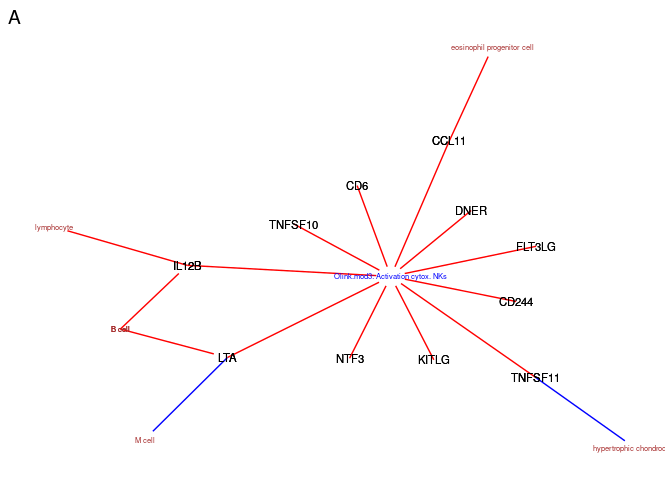
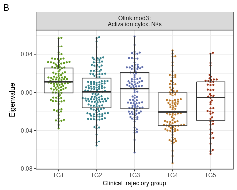
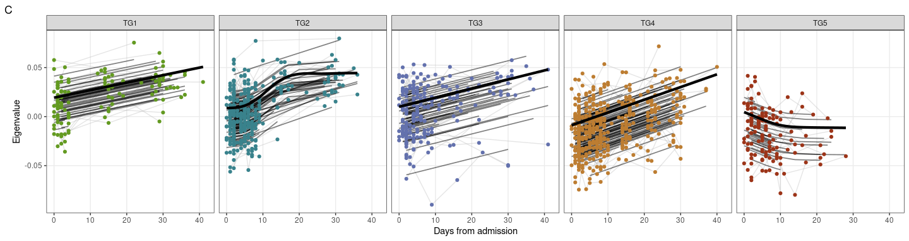
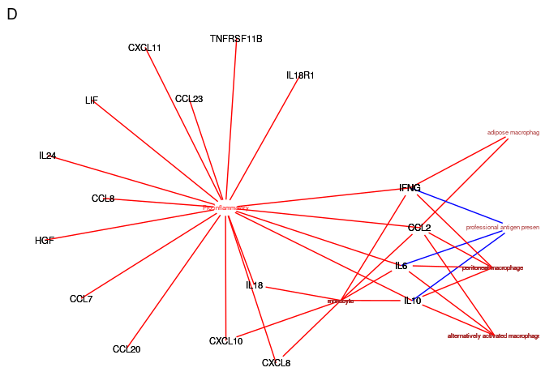
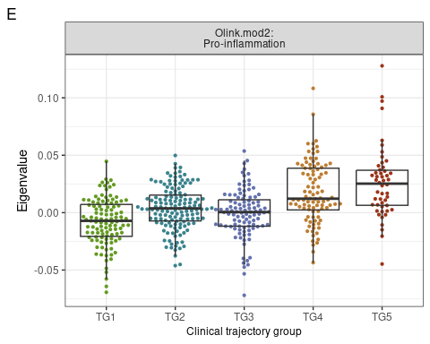
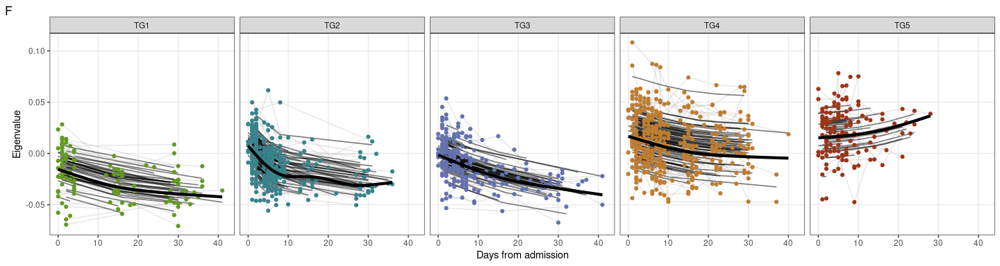
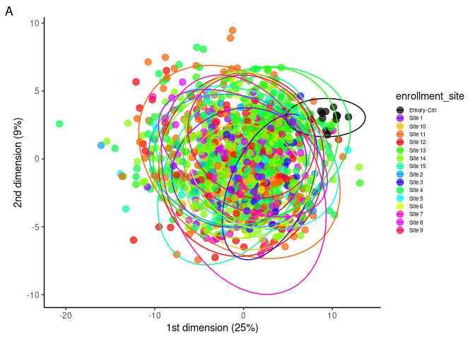
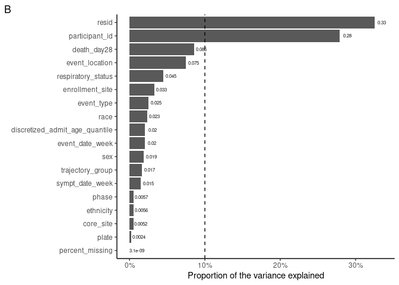
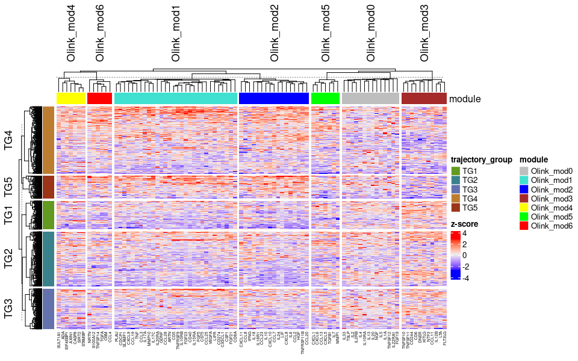
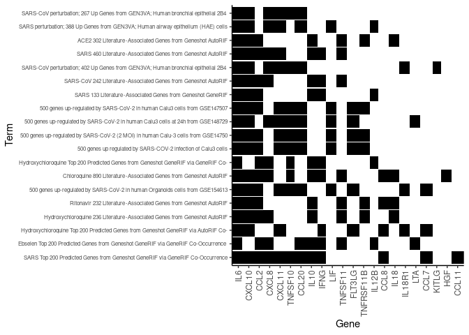

Olink univariate and WGCNA analysis
================
07 June, 2023

### Load libraries

``` r
suppressPackageStartupMessages(library(package = "knitr"))
suppressPackageStartupMessages(library(package = "impute"))
suppressPackageStartupMessages(library(package = "igraph"))
suppressPackageStartupMessages(library(package = "ggnetwork"))
suppressPackageStartupMessages(library(package = "ordinal"))
suppressPackageStartupMessages(library(package = "qvalue"))
suppressPackageStartupMessages(library(package = "ggbeeswarm"))
suppressPackageStartupMessages(library(package = "ggeffects"))
suppressPackageStartupMessages(library(package = "pvca"))
suppressPackageStartupMessages(library(package = "GSA"))
suppressPackageStartupMessages(library(package = "lme4"))
suppressPackageStartupMessages(library(package = "nlme"))
suppressPackageStartupMessages(library(package = "tidyverse"))

# set session options
options(show_col_types = FALSE)
VarCorr <- lme4::VarCorr
```

### Load codebase.R, load data matrices and set path to local output directory

``` r
# load codebase.R, olink data and clinical information
source("../../Codebase/codebase_v2.R")
data_env <- load_IMPACC_datasets(DATA_VERSION                = "2022-01-01", 
                                 KEEP_COVID19_POS            = TRUE, 
                                 FILTER_BY_CORE_ASSAY_COHORT = TRUE,
                                 ASSAY_NAMES = "serum_olink")
for (n in grep(pattern = "olink|clinical_data", 
               names(data_env), 
               value   = TRUE)) {
  assign(n, value = data_env[[n]])
}

# load omic datasets with healthy control
data_env_withHC <- load_IMPACC_datasets(DATA_VERSION                = "2022-01-01", 
                                        KEEP_COVID19_POS            = FALSE, 
                                        FILTER_BY_CORE_ASSAY_COHORT = FALSE,
                                        ASSAY_NAMES = "serum_olink")


# Setup the assay specific output directory
out_dir <- "../output"


### Misc
# Setup the path of any databases needed for the analysis
immuneXpresso_csv_path <- file.path("../../external_databases/ImmuneXpressoResults.csv")
if(! file.exists(immuneXpresso_csv_path)) {
  stop(paste0(immuneXpresso_csv_path, " file does not exist. Please go to http://immuneexpresso.org/immport-immunexpresso/public/immunexpresso/search# , click on \"Search immuneXpresso\" without any search term, and export the results into ", immuneXpresso_csv_path, ", and rerun the script."))
}

covid_drug_geneset <- file.path("../../external_databases/COVID-19_Drug_and_Gene_Set_Library_genesets.gmt")

# Define the outlier samples, if any, that should be removed.
outlier_sample_ids <- c("121095-02",
                        "181058-02",
                        "125417-02",
                        "118251-02")
```

### Functions: data loading

``` r
loadImmuneXpresso <- function() {
  immuneXpressoDF <- read_csv(file = immuneXpresso_csv_path)
  # all cytokines entry in immuneXpresso
  bg <- unique(immuneXpressoDF$`Cytokine Ontology Label`)
  cellNames <- unique(immuneXpressoDF$`Cell Ontology Label`)
  
  # filter on max enrichissement score=num_evidence_records(cell, cyto, dir)/
  #  (P(cell)*P(cyto)*total_num_evidence_records)
  immuneXpressoLite <- immuneXpressoDF %>%
    group_by(`Cell Ontology Label`, `Cytokine Ontology Label`, Actor) %>%
    top_n(n = 1, wt = `Enrichment Score`) %>%
    filter(`Action Sentiment` != "Unknown" & `Enrichment Score` > 1.0) %>%
    ungroup()

  # cell producing cytokines (only positive direction)
  cellLS <- filter(immuneXpressoLite, Actor %in% "cell") %>%
    # remove cells not of interest
    filter(!grepl(pattern = "acinar|zygote|pancrea|trophoblast|tanycyte", 
                  `Cell Ontology Label`) &
           !grepl(pattern = "skin|skelet|splen|Sertoli|retinal|PP|polygonal",
           
                  `Cell Ontology Label`) &
           !grepl(pattern = "marrow|bladder|animal|oocyte|oligodendrocyte",
                  `Cell Ontology Label`) &
           !grepl(pattern = "Leydig|Kupffer|hepa|Langerhans|kerat|glial",
                  `Cell Ontology Label`) &
           !grepl(pattern = "enterocyte|prostate|astrocyte|synovial|sperm",
                  `Cell Ontology Label`) &
           !grepl(pattern = "osteo|neuron|cardiac|microglial|melanocyte",
                  `Cell Ontology Label`) &
          !grepl(pattern = "gingival|germ|embryonic|muscle",
                  `Cell Ontology Label`)) %>%
    select(`Cytokine Ontology Label`, `Cell Ontology Label`) %>%
    unstack()

  # cytokine activating cells
  cytoPosLS <- filter(immuneXpressoLite, 
                      Actor %in% "cytokine" & 
                      `Action Sentiment` %in% "Positive") %>%
    filter(!grepl(pattern = "acinar|zygote|pancrea|trophoblast|tanycyte",
                  `Cell Ontology Label`) &
           !grepl(pattern = "skin|skelet|splen|Sertoli|retinal|PP|polygonal",
                  `Cell Ontology Label`) &
           !grepl(pattern = "marrow|bladder|animal|oocyte|oligodendrocyte", 
                  `Cell Ontology Label`) &
           !grepl(pattern = "Leydig|Kupffer|hepa|Langerhans|kerat|glial",
                  `Cell Ontology Label`) &
           !grepl(pattern = "enterocyte|prostate|astrocyte|synovial", 
                  `Cell Ontology Label`) &
           !grepl(pattern = "osteo|neuron|cardiac|microglial|melanocyte",
                  `Cell Ontology Label`) &
           !grepl(pattern = "gingival|germ|embryonic|sperm|muscle",
                  `Cell Ontology Label`)) %>%
    select(`Cytokine Ontology Label`, `Cell Ontology Label`) %>%
    unstack()

  cytoNegLS <- filter(immuneXpressoLite, 
                      Actor %in% "cytokine" & 
                      `Action Sentiment` %in% "Negative") %>%
    filter(!grepl(pattern = "acinar|zygote|pancrea|trophoblast|tanycyte", 
                  `Cell Ontology Label`) &
           !grepl(pattern = "skin|skelet|splen|Sertoli|retinal|PP|polygonal",
                  `Cell Ontology Label`) &
           !grepl(pattern = "marrow|bladder|animal|oocyte|oligodendrocyte",
                  `Cell Ontology Label`) &
           !grepl(pattern = "Leydig|Kupffer|hepa|Langerhans|kerat|glial", 
                  `Cell Ontology Label`) &
           !grepl(pattern = "enterocyte|prostate|astrocyte|synovial|sperm",
                  `Cell Ontology Label`) &
           !grepl(pattern = "muscle|osteo|neuron|cardiac|microglial|melanocyte", 
                  `Cell Ontology Label`) &
           !grepl(pattern = "gingival|germ|embryonic", 
                  `Cell Ontology Label`)) %>%
    select(`Cytokine Ontology Label`, `Cell Ontology Label`) %>%
    unstack()

  return(value = list(bg        = bg, 
                      cell      = cellLS, 
                      cytoPos   = cytoPosLS, 
                      cytoNeg   = cytoNegLS,
                      cellNames = cellNames))
}

#` @author Jingjing Qi
loadCOVID19drugAndGeneSetLibrary <- function() {
  require(package = "GSA")
  
  dbs <- GSA.read.gmt(filename = covid_drug_geneset)
  dbs_filt_name <- dbs$geneset.names[!grepl(pattern     = "mouse", 
                                            ignore.case = TRUE, 
                                            dbs$geneset.names)]
  dbs_filt <- dbs$genesets[!grepl(pattern     = "mouse", 
                                  ignore.case = TRUE,
                                  dbs$geneset.names)]
  names(dbs_filt) <- dbs_filt_name
  
  return(value = dbs_filt)
}
```

### Functions: data processing

``` r
#' @title preprocesseed serum olink
#' @description remove samples with with only missing values and impute 
#'              remaining missing values using KNN method  
#' @args removeOutliers: boolean, remove low expression outliers.
#' @author Slim Fourati
#' @author Jingjing Qi
#' @author Brian Lee
#' @examples \dontrun{serum_olink_counts_processed <- 
#'                    preprocess_serum_olink(serum_olink_counts)}
preprocess_serum_olink <- function(serum_olink_counts, removeOutliers = TRUE) {
  require(package = "impute")
  
  # list of outlier samples to remove
  flag <- NULL
  if (removeOutliers) {
    flag <- outlier_sample_ids
  }
  serum_olink_counts_processed <- 
    serum_olink_counts[rowMeans(is.na(serum_olink_counts)) < 1 &
                       !(rownames(serum_olink_counts) %in% flag), ] %>%
    as.matrix() %>%
    impute.knn() %>%
    .$data %>%
    return(value = .)
}
```

### Functions: data analysis

``` r
# subfunction use to fit ordinal regression and extract reg. coef
mixed_pairwise_coef <- function(my.formula0, my.formula1, data_use) {
  endpoints0 <- sort(unique(data_use$endpoints))
  pair_names <- c()
  res_table <- c()
  for(i in 1:(length(endpoints0)-1)){
    for(j in (i+1):(length(endpoints0))){
      pair_names <- c(pair_names, paste0(endpoints0[i],"|", endpoints0[j]))
      data_tmp <- data_use[data_use$endpoints %in% endpoints0[c(i, j)], ]
      fit <- lme4::lmer(my.formula1, data = data_tmp)
      res_table <- c(res_table, 
                     unique(coef(fit)$sites[,grep(pattern = "endpoint", 
                                               names(coef(fit)$sites))]))
    }
  }
  names(res_table) <- pair_names
  return(value = res_table)
}
```

### Panel A: analysis code

``` r
# preprocessing of the clinical data
serum_olink_counts_processed <- preprocess_serum_olink(serum_olink_counts)

# wgcna
wgcnaRes <- generate_WGCNA_modules(data_df        = 
                                     serum_olink_counts_processed,
                                   power          = 12,
                                   minModuleSize  = 4,
                                   assay_alias    = "Olink",
                                   mergeCutHeight = 0.05,
                                   minCoreKME     = 0.1)
```

``` r
# load immuneXpresso
immuneXpressoDb <- loadImmuneXpresso()

# fisher exact test with WGCNA module members
bg <- immuneXpressoDb$bg
module2cyto <- unstack(wgcnaRes$module_membership)
fisherDF <- lapply(names(module2cyto), 
                   FUN = function(moduleName) {
  module <- module2cyto[[moduleName]]
  lapply(setdiff(names(immuneXpressoDb), "bg"),
         FUN = function(type) {
           gsLS <- immuneXpressoDb[[type]]
           fisherTemp <- lapply(names(gsLS), 
                                FUN = function(gsName) {
             gs <- gsLS[[gsName]]
             tab <- table(factor(bg %in% gs, levels = c(TRUE, FALSE)),
                          factor(bg %in% module, levels = c(TRUE, FALSE)))
             p <- fisher.test(tab, alternative = "greater")$p.value
             return(value = data.frame(GS        = gsName, 
                                       type      = type, 
                                       module    = moduleName, 
                                       p         = p,
                                       intersect = paste(intersect(gs, module),
                                                         collapse = ",")))
           }) %>%
           do.call(what = rbind)
           
           return(value = fisherTemp)
         }) %>%
    do.call(what = rbind)
  }) %>%
  do.call(what = rbind) %>%
  mutate(adj.p = p.adjust(p, method = "BH"))
```

### Panel A: output generation code

``` r
# filter ImmuneExpresso on lymphocytes or nominal p <= 0.05
sigDF <- filter(fisherDF, module %in% "Olink_mod3" & p <= 0.25)
sigDF <- sigDF %>%
  filter(p <= 0.05 | 
         (grepl(pattern = "^B cell|lymphocyte", GS) & type != "cytoNeg"))

# extract nodes
edgeDF <- filter(sigDF, type %in% "cell") %>%
  .$intersect %>%
  strsplit(split = ",") %>%
  setNames(nm = filter(sigDF, type %in% "cell") %>% .$GS) %>%
  stack() %>%
  select(ind, values) %>%
  mutate(sign = 1)
filter(sigDF, type %in% "cytoNeg") %>%
  .$intersect %>%
  strsplit(split = ",") %>%
  setNames(nm = filter(sigDF, type %in% "cytoNeg") %>% .$GS) %>%
  stack() %>%
  mutate(sign = -1) %>%
  setNames(nm = names(edgeDF)) %>%
  rbind(edgeDF, .) -> edgeDF
filter(sigDF, type %in% "cytoPos") %>%
  .$intersect %>%
  strsplit(split = ",") %>%
  setNames(nm = filter(sigDF, type %in% "cytoPos") %>% .$GS) %>%
  stack() %>%
  mutate(sign = 1) %>%
  setNames(nm = names(edgeDF)) %>%
  rbind(edgeDF, .) -> edgeDF
data.frame(ind = filter(wgcnaRes$module_membership, 
                        module %in% "Olink_mod3") %>% .$feature,
           values = "Olink.mod3: Activation cytox. NKs",
           sign = 1) %>%
  rbind(edgeDF, .) -> edgeDF

# generate graph
g <- graph_from_data_frame(edgeDF)
# color node based on if they are cytokines, cells or annotation
groupLS <- ifelse(V(g)$name %in% colnames(serum_olink_counts_processed),
                  yes = 1,
                  no  = 3)
groupLS <- ifelse(V(g)$name %in% immuneXpressoDb$cellNames,
                  yes = 2,
                  no  = groupLS)
# append node color
plotDF <- ggnetwork(g) %>%
  merge(y     = data.frame(name = V(g)$name, group = groupLS + 1), 
        by    = "name", 
        all.x = TRUE)
# generate network
netMod3 <- ggplot(data = plotDF, aes(x = x, y = y, xend = xend, yend = yend)) +
     geom_edges(aes(color = factor(sign))) +
     geom_text(data    = filter(plotDF, group != 2),
               mapping = aes(label = name, color = factor(group)), 
               cex     = 2) +
     geom_text(data    = filter(plotDF, group == 2),
               mapping = aes(label = name, color = factor(group)), 
               cex     = 3) +
    scale_color_manual(values = c("1"  = "red", 
                                  "-1" = "blue", 
                                  "2"  = "black",
                                  "3"  = "brown", 
                                  "4"  = "blue")) + 
    labs(tag = "A") +
    theme_blank() + 
    theme(legend.position =  "none")
print(netMod3)
```

<!-- -->

``` r
pdf(file.path(out_dir, "main_A.pdf"), width=8, height = 8)
print(netMod3)
dev.off()
```

    ## png 
    ##   2

### Panel B: analysis code

``` r
# subset the data to only get 'Visit 1'
data_use_visit1 <- wgcnaRes$MEs %>%
  rownames_to_column(var = "sample_id") %>%
  merge(y  = select(clinical_data, 
                    sample_id, 
                    event_type,
                    trajectory_group,
                    enrollment_site,
                    discretized_admit_age_quantile,
                    sex),
        by = "sample_id") %>%
  filter(event_type %in% "Visit 1" &
         !is.na(trajectory_group)) %>%
  mutate_if(is.character, as.factor) %>%
  mutate(trajectory_group = factor(trajectory_group)) %>%
  select(-event_type) %>%
  column_to_rownames(var = "sample_id")

# a model with only intercept and random effect across sites
module_names <- grep(pattern = "Olink", names(data_use_visit1), value = TRUE)
res_table_ordinal <- NULL
data_use <- data_use_visit1
for (moduleName in module_names) {
  my.formula0 <- paste0('trajectory_group~ 1+(1|enrollment_site)+',
                        'discretized_admit_age_quantile+sex')
  my.formula1 <- paste0('trajectory_group~',
                        moduleName,
                        '+(1|enrollment_site)+',
                        'discretized_admit_age_quantile+sex')
  res <- mixed_ordinal(my.formula0, 
                       my.formula1,
                       data_use = data_use_visit1)
  coef(clmm(formula(my.formula1), 
            data = data_use_visit1))[moduleName] %>%
    unname() %>%
    c(res, coef = .) -> res
  res_table_ordinal <- rbind(res_table_ordinal, res)
}
rownames(res_table_ordinal) <- module_names
res_table_ordinal <- res_table_ordinal %>%
  as.data.frame() %>%
  ungroup() %>%
   mutate(qval =  qvalue::qvalue(pval, fdr.level = 0.05, pi0 = 1)$qvalues,
          adjp = p.adjust(pval, method = "BH"))
```

### Panel B: output generation code

``` r
visit1Mod3 <- data_use_visit1 %>%
  rownames_to_column(var = "sample_id") %>%
  select(sample_id, Olink_mod3, trajectory_group) %>%
  pivot_longer(cols = -c(sample_id, trajectory_group)) %>%
  mutate(name             = "Olink.mod3:\nActivation cytox. NKs",
         trajectory_group = paste0("TG", trajectory_group)) %>%
  ggplot(mapping = aes(x = trajectory_group, y = value)) +
  geom_beeswarm(mapping = aes(color = trajectory_group), cex = 1.5, size = 0.8) +
  geom_boxplot(fill = "transparent", outlier.color= "transparent") +
  facet_wrap(facets= ~name, ncol = 1) + 
  labs(y = "Eigenvalue", x = "Clinical trajectory group", tag = "B") +
  scale_color_manual(values = c("TG1" = "#639A21",
                                "TG2" = "#39828C",
                                "TG3" = "#6371AD",
                                "TG4" = "#BD7D31",
                                "TG5" = "#9C3418")) +
  theme_bw() +
  theme(legend.pos = "none", axis.title.x = element_text(size = 9))
print(visit1Mod3)
```

<!-- -->

``` r
pdf(file.path(out_dir, "main_B.pdf"), width=8, height = 8)
print(visit1Mod3)
dev.off()
```

    ## png 
    ##   2

### Panel C: analysis code

``` r
data_use <- wgcnaRes$MEs %>%
  rownames_to_column(var = "sample_id") %>%
  merge(y  = select(clinical_data, 
                    sample_id, 
                    event_date,
                    trajectory_group,
                    enrollment_site,
                    discretized_admit_age_quantile,
                    sex,
                    participant_id),
        by = "sample_id") %>%
  filter(!is.na(trajectory_group)) %>%
  filter(duplicated(participant_id) | duplicated(participant_id, fromLast = TRUE)) %>%
  mutate_if(is.character, as.factor) %>%
  mutate(trajectory_group = factor(trajectory_group)) %>%
  pivot_longer(cols = -c("sample_id", "event_date", "participant_id",
                         "enrollment_site", "trajectory_group",
                         "discretized_admit_age_quantile", "sex")) %>%
  mutate(discretized_admit_age_quantile= factor(discretized_admit_age_quantile)) %>%
  filter(!is.na(value))

## smooth spline takes a long time, demonstrating by cutting down to just ten factors
smooth_spline_model_loop <- model_loop(data_use, 
                                       modelType = "smoothSpline", 
                                       endpoint  = "trajectory_group")
smooth_spline_model_loop <- smooth_spline_model_loop %>%
  ungroup() %>%
  mutate(adjp.shape = p.adjust(p.slope,method = "BH"),
         adjp.average = p.adjust(p.intercept, method = "BH"))
```

### Panel C: output generation code

``` r
exampleDF <- data_use %>%
  filter(name %in% "Olink_mod3") %>%
  mutate(trajectory_group = ordered(as.factor(as.character(trajectory_group)), 
                                    levels = c("1", "2", "3", "4", "5")))

plotExample <- plot_model(exampleDF, 
                          model_loop     = smooth_spline_model_loop, 
                          modelType      = "smoothSpline", 
                          p_adjust       = NA, 
                          endpoint       = "trajectory_group", 
                          signif_markers = FALSE,
                          remove_NS      = TRUE, 
                          bar_height     = 6.5)

plotMod3 <- plotExample$data %>%
  mutate(trajectory_group = paste0("TG", trajectory_group)) %>%
  ggplot(mapping = aes(x = event_date, y = value)) +
    geom_line(mapping = aes(group = participant_id, y = value), 
              color   = 'gray',
              alpha   = 0.4) +
    geom_line(mapping = aes(group = participant_id, y = yhat), 
              size    = 0.6, 
              alpha   = 0.5,
              color   = "black") +
    geom_point(mapping = aes(color = trajectory_group)) +
    geom_line(data    = mutate(get("pred", plotExample$plot_env),
                               trajectory_group = paste0("TG", 
                                                         trajectory_group)),
              mapping = aes(group = trajectory_group, y = predicted),
                           color = "black", size = 1.5) +
    facet_wrap(facets = ~trajectory_group, nrow = 1) +
    labs(y = "Eigenvalue",  x = "Days from admission",  tag = "C") +
    scale_color_manual(values= c("TG1"  = "#639A21",
                                 "TG2"  = "#39828C",
                                 "TG3"  = "#6371AD", 
                                 "TG4"  = "#BD7D31",
                                 "TG5"  = "#9C3418")) +
  coord_cartesian(xlim = c(0, 42)) +
  theme_bw() +
  theme(legend.pos = "none",
        panel.grid.minor = element_blank())

print(plotMod3)
```

<!-- -->

``` r
pdf(file.path(out_dir, "main_C.pdf"), width=8, height = 8)
print(plotMod3)
dev.off()
```

    ## png 
    ##   2

### Panel D: output generation code

``` r
# filter ImmuneExpresso on top 10 based on nominal p, and show macrophage/monocytes/APC
sigDF <- filter(fisherDF, module %in% "Olink_mod2" & p <= 0.05) %>%
  top_n(n = 10, wt = -p) %>%
  filter(grepl(pattern = "macrophage|monocyte|antigen", GS))

# extract nodes
edgeDF <- filter(sigDF, type %in% "cell") %>%
  .$intersect %>%
  strsplit(split = ",") %>%
  setNames(nm = filter(sigDF, type %in% "cell") %>% .$GS) %>%
  stack() %>%
  select(ind, values) %>%
  mutate(sign = 1)
filter(sigDF, type %in% "cytoNeg") %>%
  .$intersect %>%
  strsplit(split = ",") %>%
  setNames(nm = filter(sigDF, type %in% "cytoNeg") %>% .$GS) %>%
  stack() %>%
  mutate(sign = -1) %>%
  setNames(nm = names(edgeDF)) %>%
  rbind(edgeDF, .) -> edgeDF
filter(sigDF, type %in% "cytoPos") %>%
  .$intersect %>%
  strsplit(split = ",") %>%
  setNames(nm = filter(sigDF, type %in% "cytoPos") %>% .$GS) %>%
  stack() %>%
  mutate(sign = 1) %>%
  setNames(nm = names(edgeDF)) %>%
  rbind(edgeDF, .) -> edgeDF
data.frame(ind = filter(wgcnaRes$module_membership, 
                        module %in% "Olink_mod2") %>% .$feature,
           values = "Pro-inflammatory",
           sign = 1) %>%
  rbind(edgeDF, .) -> edgeDF

# generate graph
g <- graph_from_data_frame(edgeDF)
# color node based on if they are cytokines, cells or annotation
groupLS <- ifelse(V(g)$name %in% colnames(serum_olink_counts_processed),
                  yes = 1,
                  no  = 3)
groupLS <- ifelse(V(g)$name %in% immuneXpressoDb$cellNames,
                  yes = 2,
                  no  = groupLS)
# append node color
plotDF <- ggnetwork(g) %>%
  merge(y     = data.frame(name = V(g)$name, group = groupLS + 1), 
        by    = "name", 
        all.x = TRUE)
# generate network
netMod2 <- ggplot(data = plotDF, aes(x = x, y = y, xend = xend, yend = yend)) +
     geom_edges(aes(color = factor(sign))) +
     geom_text(data    = filter(plotDF, group != 2),
               mapping = aes(label = name, color = factor(group)), 
               cex     = 2) +
     geom_text(data    = filter(plotDF, group == 2),
               mapping = aes(label = name, color = factor(group)), 
               cex     = 3) +
    scale_color_manual(values = c("1"  = "red", 
                                  "-1" = "blue", 
                                  "2"  = "black",
                                  "3"  = "brown", 
                                  "4"  = "red")) +
    labs(tag = "D") +
    theme_blank() + 
    theme(legend.position =  "none")
print(netMod2)
```

<!-- -->

``` r
pdf(file.path(out_dir, "main_D.pdf"), width=8, height = 8)
print(netMod2)
dev.off()
```

    ## png 
    ##   2

### Panel E: output generation code

``` r
visit1Mod2 <- data_use_visit1 %>%
  rownames_to_column(var = "sample_id") %>%
  select(sample_id, Olink_mod2, trajectory_group) %>%
  pivot_longer(cols = -c(sample_id, trajectory_group)) %>%
  mutate(name             = "Olink.mod2:\nPro-inflammation",
         trajectory_group = paste0("TG", trajectory_group)) %>%
  ggplot(mapping = aes(x = trajectory_group, y = value)) +
  geom_beeswarm(mapping = aes(color = trajectory_group), cex = 1.5, size = 0.8) +
  geom_boxplot(fill = "transparent", outlier.color= "transparent") +
  facet_wrap(facets= ~name, ncol = 1) + 
  labs(y = "Eigenvalue", x = "Clinical trajectory group", tag = "E") +
  scale_color_manual(values = c("TG1" = "#639A21",
                                "TG2" = "#39828C",
                                "TG3" = "#6371AD",
                                "TG4" = "#BD7D31",
                                "TG5" = "#9C3418")) +
  theme_bw() +
  theme(legend.pos = "none", axis.title.x = element_text(size = 9))
print(visit1Mod2)
```

<!-- -->

``` r
pdf(file.path(out_dir, "main_E.pdf"), width=8, height = 8)
print(visit1Mod2)
dev.off()
```

    ## png 
    ##   2

### Panel F: output generation code

``` r
exampleDF <- data_use %>%
  filter(name %in% "Olink_mod2") %>%
  mutate(trajectory_group = ordered(as.factor(as.character(trajectory_group)), 
                                    levels = c("1", "2", "3", "4", "5")))

plotExample <- plot_model(exampleDF, 
                          model_loop     = smooth_spline_model_loop, 
                          modelType      = "smoothSpline", 
                          p_adjust       = NA, 
                          endpoint       = "trajectory_group", 
                          signif_markers = FALSE,
                          remove_NS      = TRUE, 
                          bar_height     = 6.5)

plotMod2 <- plotExample$data %>%
  mutate(trajectory_group = paste0("TG", trajectory_group)) %>%
  ggplot(mapping = aes(x = event_date, y = value)) +
    geom_line(mapping = aes(group = participant_id, y = value), 
              color   = 'gray',
              alpha   = 0.4) +
    geom_line(mapping = aes(group = participant_id, y = yhat), 
              size    = 0.6, 
              alpha   = 0.5,
              color   = "black") +
    geom_point(mapping = aes(color = trajectory_group)) +
    geom_line(data    = mutate(get("pred", plotExample$plot_env),
                               trajectory_group = paste0("TG", 
                                                         trajectory_group)),
              mapping = aes(group = trajectory_group, y = predicted),
                           color = "black", size = 1.5) +
    facet_wrap(facets = ~trajectory_group, nrow = 1) +
    labs(y = "Eigenvalue",  x = "Days from admission",  tag = "F") +
    scale_color_manual(values= c("TG1"  = "#639A21",
                                 "TG2"  = "#39828C",
                                 "TG3"  = "#6371AD", 
                                 "TG4"  = "#BD7D31",
                                 "TG5"  = "#9C3418")) +
  coord_cartesian(xlim = c(0, 42)) +
  theme_bw() +
  theme(legend.pos = "none",
        panel.grid.minor = element_blank())

print(plotMod2)
```

<!-- -->

``` r
pdf(file.path(out_dir, "main_F.pdf"), width=8, height = 8)
print(plotMod2)
dev.off()
```

    ## png 
    ##   2

### Supplementary Panel A: analysis code

``` r
serum_olink_counts_withHC <- get("serum_olink_counts", envir = data_env_withHC)
serum_olink_metadata_withHC <- get("serum_olink_metadata", 
                                   envir = data_env_withHC)
clinical_data_withHC <- get("clinical_data", envir = data_env_withHC)

# remove outliers
serum_olink_counts_processed_withHC <- 
  preprocess_serum_olink(serum_olink_counts = serum_olink_counts_withHC, 
                         removeOutliers     = TRUE)

# PCA
pc <- prcomp(serum_olink_counts_processed_withHC)
```

### Supplementary Panel A: output generation code

``` r
plotDF <- pc$x[, 1:2] %>%
  as.data.frame() %>%
  rownames_to_column(var = "sample_id") %>%
  merge(y = clinical_data_withHC, by = "sample_id") %>%
  merge(y  = rownames_to_column(serum_olink_metadata_withHC, var = "sample_id"),
        by = "sample_id") %>%
  mutate(core_lab        = gsub(pattern = "_.*", replacement = "", comment),
         enrollment_site = ifelse(test = participant_type %in% 
                                    "Healthy control (Emory)",
                                  yes  = "Emory-Ctrl", 
                                  no   = enrollment_site),
         enrollment_site = factor(enrollment_site),
         enrollment_site = relevel(enrollment_site, ref = "Emory-Ctrl"))
enrollmentSite2color <- rainbow(n = length(unique(plotDF$enrollment_site))) %>%
  setNames(nm = unique(plotDF$enrollment_site))
enrollmentSite2color["Emory-Ctrl"] <- "black"
plotPCA <- ggplot(data = plotDF,
       mapping = aes(x = PC1, y = PC2, color = enrollment_site))+
  geom_point(size = 3, alpha = 0.7) +
  scale_color_manual(values = enrollmentSite2color) +
  scale_shape_manual(values = c(21, 23))+
  stat_ellipse()+
  labs(x     = paste0("1st dimension (",
                      round((pc$sdev^2/sum(pc$sdev^2))[1] * 100),
                      "%)"),
       y     = paste0("2nd dimension (",
                      round((pc$sdev^2/sum(pc$sdev^2))[2] * 100),
                      "%)"),
       tag   = "A")+
  theme_classic() +
  theme(legend.text     = element_text(size = 6),
        legend.key.size = unit(0.01, units = "npc"))
print(plotPCA)
```

<!-- -->

``` r
pdf(file.path(out_dir, "suppl_A.pdf"), width=8, height = 8)
print(plotPCA)
dev.off()
```

    ## png 
    ##   2

### Supplementary Panel B: analysis code

``` r
# select variable to be included in PVCA
#   event_data_week: day from admission to to the hospital coded as week 
#                    (categorical variable)
#   sympt_date_week: day from onset of symptoms coded as week (categorical 
#                    variable)
#   discretized_admit_age_quantile: age at admission coded as quintiles 
pvca_input_phenodata <- clinical_data %>%
  mutate(event_date_week = findInterval(event_date, 
                                        vec        = c(0, 7, 14, 21, 28), 
                                        all.inside = TRUE),
         day_from_sympt  = event_date - symptom_date,
         sympt_date_week = findInterval(day_from_sympt, 
                                        vec        = c(0, 7, 14, 21, 28, Inf),
                                        all.inside = TRUE),
         death_day28     = respiratory_status_day28 %in% 7) %>%
    select(sample_id, event_date_week, event_type, respiratory_status,
           sex, death_day28, sympt_date_week, event_location,
           discretized_admit_age_quantile, ethnicity, participant_id, race,
           trajectory_group, enrollment_site)

# append meta data to pvca phenodata
#   core site: where are the sample processed (this chunk of code need to be
#              modified for each core assay)
#   plate = interaction term of phase and plate
pvca_input_phenodata <- serum_olink_metadata %>%
  rownames_to_column(var = "sample_id") %>%
  mutate(core_site = gsub(pattern = "_.+", replacement = "", comment),
         plate     = interaction(phase, plate, drop = TRUE)) %>%
  select(sample_id, plate, phase, core_site) %>%
  merge(x     = pvca_input_phenodata,
        by    = "sample_id",
        all.x = TRUE)

# append rownames
pvca_input_phenodata <- pvca_input_phenodata %>%
  column_to_rownames(var = "sample_id")
pvca_input_phenodata <- pvca_input_phenodata[rownames(serum_olink_counts_processed), 
                                             , drop = FALSE]

# add percent missing values (if processeed matrix required imputation otherwise
# comment line below)
pvca_input_phenodata$percent_missing <- 
  serum_olink_counts[rownames(pvca_input_phenodata), ] %>%
  is.na() %>%
  rowMeans() %>%
  factor()

# run PVCA
fit <- PVCA(counts    = t(serum_olink_counts_processed),
            meta      = pvca_input_phenodata,
            inter     = FALSE,
            threshold = 0.6)
```

### Supplementary Panel B: output generation code

``` r
# plot barplot with PVCA results
pvca_barplot_data <- data.frame(explained = as.vector(fit),
                                effect    = names(fit)) %>%
  arrange(explained) %>%
  mutate(effect = factor(effect, levels = effect))

pvca_barplot <- ggplot(data    = pvca_barplot_data,
       mapping = aes(x = effect, y = explained)) +
  geom_bar(stat = "identity") +
  geom_text(aes(label = signif(explained, digits = 2)),
            nudge_y   = 0.01,
            size      = 2) +
  geom_hline(yintercept = 0.1, linetype = 2) +
  labs(x = NULL, y = "Proportion of the variance explained", tag = "B") + 
  theme_classic() +
  scale_y_continuous(labels = scales::percent) +
  coord_flip()
print(pvca_barplot)
```

<!-- -->

``` r
pdf(file.path(out_dir, "suppl_B.pdf"), width=8, height = 8)
print(pvca_barplot)
dev.off()
```

    ## png 
    ##   2

### Supplementary Panel C: output generation code

``` r
mat <- serum_olink_counts_processed %>%
  scale()
columnAnnotDF <- 
  wgcnaRes$module_membership[match(colnames(mat), 
                                   table = 
                                     wgcnaRes$module_membership$feature), ] %>%
  remove_rownames() %>%
  column_to_rownames(var = "feature") 
columnAnnot <- 
  HeatmapAnnotation(df  = columnAnnotDF,
                    col = list(module = setNames(c("grey", 
                                                   standardColors()[1:6]),
                               nm     = 
                                 sort(unique(wgcnaRes$module_membership$module)))))
rowAnnotDF <- clinical_data %>%
  select(sample_id, trajectory_group) %>%
  mutate(trajectory_group = paste0("TG", trajectory_group)) %>%
  .[match(rownames(mat), table = .$sample_id), ] %>%
  `rownames<-`(NULL) %>%
  column_to_rownames(var = "sample_id") 
rowAnnot <- rowAnnotation(df  = rowAnnotDF,
                          col = list(trajectory_group = c("TG1" = "#639A21",
                                                          "TG2" = "#39828C",
                                                          "TG3" = "#6371AD", 
                                                          "TG4" = "#BD7D31",
                                                          "TG5" = "#9C3418")),
                          show_annotation_name = FALSE)
set.seed(seed = 1)
heatmap = Heatmap(matrix            = mat,
        left_annotation   = rowAnnot,
        top_annotation    = columnAnnot,
        column_split      = columnAnnotDF$module,
        row_split         = rowAnnotDF$trajectory_group,
        show_row_names    = FALSE,
        column_names_gp   = gpar(fontsize = 5),
        column_title_rot  = 90,
        name              = "z-score")

print(heatmap)
```

<!-- -->

``` r
pdf(file.path(out_dir, "suppl_C.pdf"), width=8, height = 8)
print(heatmap)
dev.off()
```

    ## png 
    ##   2

### Supplementary Panel D: analysis code

``` r
# load COVID19 library genesets
dbs <- loadCOVID19drugAndGeneSetLibrary()

features <- wgcnaRes$module_membership%>%
  filter(module %in% c("Olink_mod2", "Olink_mod3")) %>%
  .$feature

# define enrichment background
bg <- dbs %>%
   unlist() %>%
   unique()
 
enriched_module <- lapply(names(dbs), FUN = function(gsName) {
  gs <- dbs[[gsName]]
  tab <- table(factor(bg %in% gs, levels = c(TRUE, FALSE)),
               factor(bg %in% features, levels = c(TRUE, FALSE)))
  p <- fisher.test(tab, alternative = "greater")$p.value
  return(value = data.frame(Term  = gsName, 
                            p     = p,
                            Genes = paste(intersect(gs, features), 
                                          collapse = ";")))
   }) %>%
   do.call(what = rbind) %>%
   as.data.frame() %>%
   mutate(Adjusted.P.value = p.adjust(p, "BH")) %>%
   filter(Adjusted.P.value <= 0.05)
```

### Supplementary Panel D: output generation code

``` r
plot_df <- enriched_module
plot_df$genes_count <- sapply(plot_df$Genes, 
                              FUN = function(x) str_count(x, ";") + 1)

plot_df <- plot_df %>%
  mutate(Term = str_sub(Term, end = 80)) %>%
  separate(col = "Genes", into = paste0("v_", 1 : max(plot_df$genes_count))) %>%
  filter(Adjusted.P.value <= 0.05) %>%
  arrange(Adjusted.P.value) %>%
  head(n = 20)
  
plot_df$Term <- factor(plot_df$Term, 
                       levels = unique(plot_df$Term))
  
gene_df <- plot_df[ , grep("v_", colnames(plot_df))]
unique_gene <- unique(unlist(gene_df))
unique_gene <- unique_gene[!is.na(unique_gene)]
  
gene_df <- apply(gene_df, 1, function(x){
  ifelse(test = unique_gene %in% x, yes = 1, no = 0)
})
rownames(gene_df) <- unique_gene
  
gene_df <- cbind.data.frame(Term = plot_df$Term, 
                            t(gene_df))
  
gene_sort <- sort(colSums(gene_df[ ,-1]), decreasing = TRUE) %>%
  names()
  
plotChecker <- gene_df %>%
   pivot_longer(cols = -Term, names_to = "Gene", values_to = "present") %>%
    mutate(exp.coef = ifelse(test = present == 0, yes = NA, no = present),
           Gene     = factor(Gene, levels = gene_sort)) %>%
    ggplot()+
    geom_point(mapping = aes(x     = Gene,
                             y     = Term, 
                             color = present), 
               shape   = 15, 
               size    = 6)+
    scale_color_gradient(low = "white", high = "black", na.value = "white") +
    theme_classic() +
    theme(axis.text.x     = element_text(angle = 90, vjust = 0.5, hjust = 1),
          axis.text.y     = element_text(size = 6),
          legend.position = "none")

print(plotChecker)
```

<!-- -->

``` r
pdf(file.path(out_dir, "suppl_D.pdf"), width=8, height = 8)
print(plotChecker)
dev.off()
```

    ## png 
    ##   2

### Supplementary Table A: output generation code

``` r
supTab_modules <- wgcnaRes$module_membership %>% 
  arrange(module) %>%
  rename(Module  = module,
         Feature = feature) %>%
  select(Module, Feature) %>%
  `rownames<-`(NULL)

supTab_modules %>%
  head() %>%
  kable()
```

| Module      | Feature |
|:------------|:--------|
| Olink\_mod0 | IL2RB   |
| Olink\_mod0 | IL1A    |
| Olink\_mod0 | IL2     |
| Olink\_mod0 | TSLP    |
| Olink\_mod0 | IL10RA  |
| Olink\_mod0 | IL22RA1 |

``` r
write_csv(supTab_modules, file = file.path(out_dir, "Olink_Modules.csv") )
```

### Supplementary Table B: output generation code

``` r
mod2shortName <- data.frame(module = paste0("Olink_mod", 0:6),
                            `Short Name` = c("Others",
                                             "Cytokines produced by Neutrophils",
                                             "Cytokines produced by Macrophages",
                                             "Activators of cytotoxic NKs",
                                             "Not determined",
                                             "Cytokines related to B cells",
                                             "Activators of Macrophages"),
                            check.names = FALSE)

supTab_annot <- fisherDF %>%
  filter(p <= 0.05) %>%
  merge(y = mod2shortName, by = "module") %>%
  mutate(module                = paste0("Olink.", module),
         `Annotation resource` = "ImmuneXpresso",
         `Resource ID`         = paste0(GS, "/", type),
         intersect             = gsub(pattern     = ",", 
                                      replacement = ";", 
                                      intersect)) %>%
  rename(Module               = module,
         `P value`            = p,
         `Adj. p value`   = adj.p,
         `Important features` = intersect) %>%
  select(Module,
         `Short Name`,
         `Annotation resource`,
         `Resource ID`,
         `P value`,
         `Adj. p value`,
         `Important features`) %>%
  `rownames<-`(NULL)

supTab_annot %>%
  head() %>%
  kable()
```

| Module            | Short Name | Annotation resource | Resource ID                                 |   P value | Adj. p value | Important features |
|:------------------|:-----------|:--------------------|:--------------------------------------------|----------:|-------------:|:-------------------|
| Olink.Olink\_mod0 | Others     | ImmuneXpresso       | B cell/cell                                 | 0.0049811 |            1 | IL4;IL2;IL5;IL13   |
| Olink.Olink\_mod0 | Others     | ImmuneXpresso       | basophil/cell                               | 0.0060584 |            1 | IL4;IL13           |
| Olink.Olink\_mod0 | Others     | ImmuneXpresso       | CD103-positive dendritic cell/cell          | 0.0489510 |            1 | IL2                |
| Olink.Olink\_mod0 | Others     | ImmuneXpresso       | CD4-positive, alpha-beta memory T cell/cell | 0.0489510 |            1 | IL4                |
| Olink.Olink\_mod0 | Others     | ImmuneXpresso       | CD4-positive, alpha-beta T cell/cell        | 0.0307654 |            1 | IL2;IL4;IL5        |
| Olink.Olink\_mod0 | Others     | ImmuneXpresso       | CD8-positive, alpha-beta T cell/cell        | 0.0075483 |            1 | IL2;IL4;IL13       |

``` r
write_csv(supTab_annot, file = file.path(out_dir, "Olink_Annotation.csv"))
```

### Supplementary Table C: analysis code

``` r
# do pairwise comparison at visit 1 and extract coefficient of regression
data_use_visit1_tmp <- data_use_visit1 %>%
  rename(endpoints = trajectory_group,
         sites     = enrollment_site,
         age       = discretized_admit_age_quantile)
res_table_pairwise <- NULL
res_table_pairwise_coef <- NULL
for(j in 1:length(module_names)){
  my.formula0 = paste0(module_names[j],
                       "~(1|sites)",
                       "+age",
                       "+sex")
  my.formula1 = paste0(module_names[j],
                       "~endpoints",
                       "+(1|sites)",
                       "+age",
                       "+sex")
  res_table_pairwise <- rbind(res_table_pairwise,
                              mixed_pairwise(my.formula0, 
                                             my.formula1, 
                                             data_use_visit1_tmp))
  res_table_pairwise_coef <- rbind(res_table_pairwise_coef,
                                   mixed_pairwise_coef(my.formula0, 
                                                       my.formula1, 
                                                       data_use_visit1_tmp))
}
rownames(res_table_pairwise) <- module_names
rownames(res_table_pairwise_coef) <- module_names

# for longitudinal analysis fetch directionality from lme (TG1 vs TG5)
smooth_spline_model_loop$trajectory_group5 <- NA
smooth_spline_model_loop$"event_date:trajectory_group5" <- NA
for (modName in rownames(smooth_spline_model_loop)) {
  fit <- lme(fixed  = value ~ event_date * trajectory_group + 
               sex + discretized_admit_age_quantile,
             random = ~1|enrollment_site/participant_id,
             data   = filter(data_use, name %in% modName))
  smooth_spline_model_loop[modName, "trajectory_group5"] <- 
    unique(coef(fit)["trajectory_group5"])
  smooth_spline_model_loop[modName, "event_date:trajectory_group5"] <- 
    unique(coef(fit)["event_date:trajectory_group5"])
}

# for longitudinal analysis, do pairwise regression and extract coefficient from
# linear model
combMat <- combn(unique(data_use$trajectory_group), m = 2)
coefCombMat <- apply(combMat, MARGIN = 2, FUN = function(comparison) {
  data_use_tmp <- filter(data_use, trajectory_group %in% comparison)
  
  coefDF <- lapply(rownames(smooth_spline_model_loop), FUN = function(modName) {
    fit <- lme(fixed  = value ~ event_date * trajectory_group + sex + 
                 discretized_admit_age_quantile,
               random = ~1|enrollment_site/participant_id,
               data   = filter(data_use_tmp, name %in% modName))
    average <- unique(coef(fit)[grep(pattern = "^trajectory_group",
                                     colnames(coef(fit)))]) %>%
      unlist() %>%
      unname()
    shape <- unique(coef(fit)[grep(pattern = "^event_date:trajectory_group",
                                     colnames(coef(fit)))]) %>%
      unlist() %>%
      unname()
    return(value = data.frame(`Module (or Feature)` = modName,
                              average, 
                              shape,
                              comparison = paste(sort(comparison), 
                                                 collapse = "|"),
                              check.names = FALSE))
  }) %>%
    do.call(what = rbind)
  return(value = coefDF)
}) %>%
  do.call(what = rbind)


# generate input data.frame for longitudinal DFSO analysis 
# (event_date=event_date-symptom_date)
data_use_dfso <- wgcnaRes$MEs %>%
  rownames_to_column(var = "sample_id") %>%
  merge(y  = select(clinical_data, 
                    sample_id, 
                    event_date,
                    trajectory_group,
                    enrollment_site,
                    discretized_admit_age_quantile,
                    sex,
                    participant_id,
                    symptom_date),
        by = "sample_id") %>%
  filter(!is.na(trajectory_group)) %>%
  filter(duplicated(participant_id) | 
           duplicated(participant_id, fromLast = TRUE)) %>%
  mutate_if(is.character, as.factor) %>%
  mutate(trajectory_group = factor(trajectory_group)) %>%
  pivot_longer(cols = -c("sample_id", "event_date", "participant_id",
                         "enrollment_site", "trajectory_group",
                         "discretized_admit_age_quantile", "sex", 
                         "symptom_date")) %>%
  mutate(discretized_admit_age_quantile= factor(discretized_admit_age_quantile),
         event_date = event_date - symptom_date) %>%
  filter(!is.na(value) & !is.na(event_date))

# generate smooth spline regression with symptom onset as reference and impute 
# directionality from linear regression
smooth_spline_model_loop_dfso <- model_loop(data_use_dfso, 
                                            modelType = "smoothSpline", 
                                            endpoint  = "trajectory_group") %>%
  ungroup() %>%
  mutate(adjp.shape = p.adjust(p.slope,method = "BH"),
         adjp.average = p.adjust(p.intercept, method = "BH"))


# fetch directionality from lme
smooth_spline_model_loop_dfso$trajectory_group5 <- NA
smooth_spline_model_loop_dfso$"event_date:trajectory_group5" <- NA
for (modName in rownames(smooth_spline_model_loop_dfso)) {
  fit <- lme(fixed= value ~ event_date * trajectory_group + sex + 
               discretized_admit_age_quantile,
      random = ~1|enrollment_site/participant_id,
      data = filter(data_use_dfso, name %in% modName))
smooth_spline_model_loop_dfso[modName, "trajectory_group5"] <- 
  unique(coef(fit)["trajectory_group5"])
smooth_spline_model_loop_dfso[modName, "event_date:trajectory_group5"] <- 
  unique(coef(fit)["event_date:trajectory_group5"])
}

# do pairwise regression with DFSO as time and extract coefficient from linear 
# model
# use linear regression to infer direction
combMat <- combn(unique(data_use_dfso$trajectory_group), m = 2)
coefCombMat <- apply(combMat, MARGIN = 2, FUN = function(comparison) {
  data_use_tmp <- filter(data_use_dfso, trajectory_group %in% comparison)
  
  coefDF <- lapply(rownames(smooth_spline_model_loop_dfso), 
                   FUN = function(modName) {
    fit <- lme(fixed  = value ~ event_date * trajectory_group + sex + 
                 discretized_admit_age_quantile,
               random = ~1|enrollment_site/participant_id,
               data   = filter(data_use_tmp, name %in% modName))
    average <- unique(coef(fit)[grep(pattern = "^trajectory_group",
                                     colnames(coef(fit)))]) %>%
      unlist() %>%
      unname()
    shape <- unique(coef(fit)[grep(pattern = "^event_date:trajectory_group",
                                     colnames(coef(fit)))]) %>%
      unlist() %>%
      unname()
    return(value = data.frame(`Module (or Feature)` = modName,
                              average, 
                              shape,
                              comparison = paste(sort(comparison), collapse = "|"),
                              check.names = FALSE))
  }) %>%
    do.call(what = rbind)
  return(value = coefDF)
}) %>%
  do.call(what = rbind)
```

### Supplementary Table C: output generation code

``` r
# generate supplementary table for visit 1 overall 
supTab_resultsVisit1 <- res_table_ordinal %>%
  rownames_to_column(var = "Module (or Feature)") %>%
  filter(pval <= 0.05) %>%
  mutate(Analysis              = "Visit 1 analysis - overall",
         Direction             = ifelse(test = sign(coef) %in% 1,
                                        yes  = "Severe",
                                        no   = "Mild")) %>%
  rename(`P value` = pval,
         `Adj. p value` = adjp) %>%
  select(`Module (or Feature)`,
          Analysis,
         `P value`,
         `Adj. p value`,
         Direction) %>%
  `rownames<-`(NULL)

supTab_resultsVisit1 %>%
  head() %>%
  kable()
```

| Module (or Feature) | Analysis                   |   P value | Adj. p value | Direction |
|:--------------------|:---------------------------|----------:|-------------:|:----------|
| Olink\_mod1         | Visit 1 analysis - overall | 0.0000017 |    0.0000040 | Severe    |
| Olink\_mod2         | Visit 1 analysis - overall | 0.0000000 |    0.0000000 | Severe    |
| Olink\_mod3         | Visit 1 analysis - overall | 0.0000000 |    0.0000000 | Mild      |
| Olink\_mod4         | Visit 1 analysis - overall | 0.0002913 |    0.0004079 | Severe    |
| Olink\_mod6         | Visit 1 analysis - overall | 0.0000136 |    0.0000238 | Severe    |

``` r
# append pairwise comparison to visit1 results
supTab_resultsVisit1tmp <- res_table_pairwise %>%
  as.data.frame() %>%
  rownames_to_column(var = "Module (or Feature)") %>%
  pivot_longer(cols      = -`Module (or Feature)`, 
               names_to  = "Analysis", 
               values_to = "P value") %>%
  mutate(`Adj. p value` = p.adjust(`P value`, method = "BH"))
res_table_pairwise_coef %>%
  as.data.frame() %>%
  rownames_to_column(var = "Module (or Feature)") %>%
  pivot_longer(cols      = -`Module (or Feature)`,
               names_to  = "Analysis",
               values_to = "Direction") %>%
  merge(x  = supTab_resultsVisit1tmp, 
        by = c("Module (or Feature)", "Analysis")) -> supTab_resultsVisit1tmp

supTab_resultsVisit1tmp <- supTab_resultsVisit1tmp %>%
  mutate(Analysis              = paste0("Visit 1 analysis - ", Analysis),
         Direction             = ifelse(test = sign(Direction) %in% 1,
                                        yes  = "Severe",
                                        no   = "Mild")) %>%
  filter(`P value` <= 0.05 & 
           `Module (or Feature)` %in% supTab_resultsVisit1$"Module (or Feature)")

supTab_resultsVisit1 <- rbind(supTab_resultsVisit1,
                              supTab_resultsVisit1tmp)

supTab_resultsVisit1 %>%
  tail() %>%
  kable()
```

|     | Module (or Feature) | Analysis                |   P value | Adj. p value | Direction |
|:----|:--------------------|:------------------------|----------:|-------------:|:----------|
| 33  | Olink\_mod4         | Visit 1 analysis - 2\|5 | 0.0139260 |    0.0389928 | Severe    |
| 34  | Olink\_mod4         | Visit 1 analysis - 3\|4 | 0.0291047 |    0.0679110 | Severe    |
| 35  | Olink\_mod6         | Visit 1 analysis - 1\|4 | 0.0000524 |    0.0002622 | Severe    |
| 36  | Olink\_mod6         | Visit 1 analysis - 1\|5 | 0.0381914 |    0.0862386 | Severe    |
| 37  | Olink\_mod6         | Visit 1 analysis - 2\|4 | 0.0000623 |    0.0002907 | Severe    |
| 38  | Olink\_mod6         | Visit 1 analysis - 3\|4 | 0.0228924 |    0.0572309 | Severe    |

``` r
# generate supplementary table with longitudinal analaysis overall
supTab_resultsLongitudinal <- smooth_spline_model_loop %>%
  rownames_to_column(var = "Module (or Feature)") %>%
  select(`Module (or Feature)`, p.slope, p.intercept, trajectory_group5, `event_date:trajectory_group5`,
         adjp.shape, adjp.average) %>%
  rename(coef.intercept = trajectory_group5, 
         coef.slope = `event_date:trajectory_group5`,
         adjp.slope = adjp.shape,
         adjp.intercept = adjp.average) %>%
  pivot_longer(cols = -`Module (or Feature)`, names_to = c("cname", "Analysis"), names_pattern = "(.*)\\.(.*)") %>%
  pivot_wider(names_from = cname, values_from = value) %>%
  filter(p <= 0.05) %>%
  mutate(Analysis = recode(Analysis,
                           `slope` = "Longitudinal analysis - overall shape",
                           `intercept` = "Longitudinal analysis - overall average"),
         Direction = ifelse(test = sign(coef) %in% 1,
                            yes  = "Severe",
                            no   = "Mild")) %>%
    rename(`P value` = p,
           `Adj. p value` = adjp) %>%
  select(`Module (or Feature)`,
         Analysis,
         `P value`,
         `Adj. p value`,
         Direction) %>%
  `rownames<-`(NULL)

supTab_resultsLongitudinal  %>% 
  head() %>%
  kable()
```

| Module (or Feature) | Analysis                                |   P value | Adj. p value | Direction |
|:--------------------|:----------------------------------------|----------:|-------------:|:----------|
| Olink\_mod0         | Longitudinal analysis - overall shape   | 0.0044322 |    0.0051709 | Mild      |
| Olink\_mod1         | Longitudinal analysis - overall shape   | 0.0000000 |    0.0000000 | Severe    |
| Olink\_mod1         | Longitudinal analysis - overall average | 0.0000000 |    0.0000000 | Severe    |
| Olink\_mod2         | Longitudinal analysis - overall shape   | 0.0000000 |    0.0000000 | Severe    |
| Olink\_mod2         | Longitudinal analysis - overall average | 0.0000000 |    0.0000000 | Severe    |
| Olink\_mod3         | Longitudinal analysis - overall shape   | 0.0000000 |    0.0000000 | Mild      |

``` r
# append pairwise comparison to longitudinal results
supTab_resultsLongitudinalPairwise <- smooth_spline_model_loop %>%
  rownames_to_column(var = "Module (or Feature)") %>%
  select(`Module (or Feature)`, 
         matches(match = "^p.slope_.v.$"),
         matches(match = "^p.intercept_.v.$")) %>%
  pivot_longer(cols      = -`Module (or Feature)`,
               names_to  = "Analysis",
               values_to = "P value") %>%
  group_by(Analysis) %>%
  mutate(`Adj. p value` = p.adjust(`P value`, method = "BH")) %>%
  ungroup() %>%
  mutate(Analysis = gsub(pattern     = "slope",
                         replacement = "shape",
                         Analysis),
         Analysis = gsub(pattern     = "intercept",
                         replacement = "average",
                         Analysis),
         Analysis = gsub(pattern = "^p\\.(.+)_(.)v(.)$",
                         replacement = "Longitudinal analysis - \\2|\\3 \\1",
                         Analysis))
coefCombMat %>%
  pivot_longer(cols      = -c(`Module (or Feature)`, comparison),
               names_to  = "Analysis",
               values_to = "Direction") %>%
  mutate(Analysis = paste("Longitudinal analysis -",
                          comparison,
                          Analysis),
         Direction = ifelse(test = sign(Direction) %in% 1,
                            yes  = "Severe",
                            no   = "Mild")) %>%
  select(-comparison) %>%
  merge(x  = supTab_resultsLongitudinalPairwise,
        by = c("Module (or Feature)", "Analysis")) -> 
  supTab_resultsLongitudinalPairwise

# append to overall results
supTab_resultsLongitudinalPairwise %>%
  filter(`P value` <= 0.05 &
           `Module (or Feature)` %in% 
           supTab_resultsLongitudinal$"Module (or Feature)") %>%
  rbind(supTab_resultsLongitudinal, .) -> supTab_resultsLongitudinal
                                    
supTab_resultsLongitudinal %>%
  tail() %>%
  kable()
```

| Module (or Feature) | Analysis                             |   P value | Adj. p value | Direction |
|:--------------------|:-------------------------------------|----------:|-------------:|:----------|
| Olink\_mod6         | Longitudinal analysis - 2\|5 shape   | 0.0002354 |    0.0004120 | Severe    |
| Olink\_mod6         | Longitudinal analysis - 3\|4 average | 0.0000012 |    0.0000035 | Severe    |
| Olink\_mod6         | Longitudinal analysis - 3\|4 shape   | 0.0000234 |    0.0001641 | Severe    |
| Olink\_mod6         | Longitudinal analysis - 3\|5 average | 0.0049826 |    0.0087195 | Mild      |
| Olink\_mod6         | Longitudinal analysis - 3\|5 shape   | 0.0000095 |    0.0000166 | Severe    |
| Olink\_mod6         | Longitudinal analysis - 4\|5 shape   | 0.0019788 |    0.0027704 | Severe    |

``` r
# generate supplementary table with longitudinal analaysis DFSO overall
supTab_resultsLongitudinalDFSO <- smooth_spline_model_loop_dfso %>%
  rownames_to_column(var = "Module (or Feature)") %>%
  select(`Module (or Feature)`, p.slope, p.intercept, trajectory_group5, 
         `event_date:trajectory_group5`, adjp.shape, adjp.average) %>%
  rename(coef.intercept = trajectory_group5, 
         coef.slope = `event_date:trajectory_group5`,
         adjp.slope = adjp.shape,
         adjp.intercept = adjp.average) %>%
  pivot_longer(cols = -`Module (or Feature)`, names_to = c("cname", "Analysis"), 
               names_pattern = "(.*)\\.(.*)") %>%
  pivot_wider(names_from = cname, values_from = value) %>%
  filter(p <= 0.05) %>%
  mutate(Analysis = recode(Analysis,
                           `slope`     = 
                             "Longitudinal analysis DFSO - overall shape",
                           `intercept` = 
                             "Longitudinal analysis DFSO- overall average"),
         Direction = ifelse(test = sign(coef) %in% 1,
                            yes  = "Severe",
                            no   = "Mild")) %>%
    rename(`P value` = p,
          `Adj. p value` = adjp) %>%
  select(`Module (or Feature)`,
         Analysis,
         `P value`,
         `Adj. p value`,
         Direction) %>%
  `rownames<-`(NULL)
               
supTab_resultsLongitudinalDFSO %>%
  head() %>%
  kable()
```

| Module (or Feature) | Analysis                                    | P value | Adj. p value | Direction |
|:--------------------|:--------------------------------------------|--------:|-------------:|:----------|
| Olink\_mod1         | Longitudinal analysis DFSO - overall shape  | 1.0e-07 |     3.00e-07 | Severe    |
| Olink\_mod1         | Longitudinal analysis DFSO- overall average | 0.0e+00 |     0.00e+00 | Severe    |
| Olink\_mod2         | Longitudinal analysis DFSO - overall shape  | 1.7e-05 |     3.96e-05 | Severe    |
| Olink\_mod2         | Longitudinal analysis DFSO- overall average | 0.0e+00 |     0.00e+00 | Severe    |
| Olink\_mod3         | Longitudinal analysis DFSO - overall shape  | 0.0e+00 |     0.00e+00 | Mild      |
| Olink\_mod3         | Longitudinal analysis DFSO- overall average | 0.0e+00 |     0.00e+00 | Mild      |

``` r
# append pairwise comparison to longitudinal results DFSO
supTab_resultsLongitudinalDFSOPairwise <- smooth_spline_model_loop_dfso %>%
  rownames_to_column(var = "Module (or Feature)") %>%
  select(`Module (or Feature)`, 
         matches(match = "^p.slope_.v.$"),
         matches(match = "^p.intercept_.v.$")) %>%
  pivot_longer(cols      = -`Module (or Feature)`,
               names_to  = "Analysis",
               values_to = "P value") %>%
  group_by(Analysis) %>%
  mutate(`Adj. p value` = p.adjust(`P value`, method = "BH")) %>%
  ungroup() %>%
  mutate(Analysis = gsub(pattern     = "slope",
                         replacement = "shape",
                         Analysis),
         Analysis = gsub(pattern     = "intercept",
                         replacement = "average",
                         Analysis),
         Analysis = gsub(pattern     = "^p\\.(.+)_(.)v(.)$",
                         replacement = 
                           "Longitudinal analysis DFSO - \\2|\\3 \\1",
                         Analysis))
coefCombMat %>%
  pivot_longer(cols      = -c(`Module (or Feature)`, comparison),
               names_to  = "Analysis",
               values_to = "Direction") %>%
  mutate(Analysis = paste("Longitudinal analysis DFSO -",
                          comparison,
                          Analysis),
         Direction = ifelse(test = sign(Direction) %in% 1,
                            yes  = "Severe",
                            no   = "Mild")) %>%
  select(-comparison) %>%
  merge(x  = supTab_resultsLongitudinalDFSOPairwise,
        by = c("Module (or Feature)", "Analysis")) -> 
  supTab_resultsLongitudinalDFSOPairwise

# append to overall results
supTab_resultsLongitudinalDFSOPairwise %>%
  filter(`P value` <= 0.05 &
           `Module (or Feature)` %in% 
           supTab_resultsLongitudinalDFSO$"Module (or Feature)") %>%
  rbind(supTab_resultsLongitudinalDFSO, .) -> supTab_resultsLongitudinalDFSO
                                    
supTab_resultsLongitudinalDFSO %>%
  tail() %>%
  kable()
```

| Module (or Feature) | Analysis                                  |   P value | Adj. p value | Direction |
|:--------------------|:------------------------------------------|----------:|-------------:|:----------|
| Olink\_mod6         | Longitudinal analysis DFSO - 2\|5 average | 0.0023446 |    0.0041031 | Mild      |
| Olink\_mod6         | Longitudinal analysis DFSO - 2\|5 shape   | 0.0001875 |    0.0003281 | Severe    |
| Olink\_mod6         | Longitudinal analysis DFSO - 3\|4 average | 0.0000088 |    0.0000308 | Severe    |
| Olink\_mod6         | Longitudinal analysis DFSO - 3\|4 shape   | 0.0485033 |    0.0679046 | Severe    |
| Olink\_mod6         | Longitudinal analysis DFSO - 3\|5 shape   | 0.0000164 |    0.0000286 | Severe    |
| Olink\_mod6         | Longitudinal analysis DFSO - 4\|5 shape   | 0.0005292 |    0.0012349 | Severe    |

``` r
# merge all results table into one csv file
supTab_results <- rbind(supTab_resultsVisit1,
                        supTab_resultsLongitudinal,
                        supTab_resultsLongitudinalDFSO)

write_csv(supTab_results, file = file.path(out_dir, "Olink_Results.csv"))
```

### Session info

``` r
sessionInfo()
```

    ## R version 4.0.2 (2020-06-22)
    ## Platform: x86_64-pc-linux-gnu (64-bit)
    ## Running under: Ubuntu 22.04.2 LTS
    ## 
    ## Matrix products: default
    ## BLAS:   /usr/lib/x86_64-linux-gnu/openblas-pthread/libblas.so.3
    ## LAPACK: /usr/lib/x86_64-linux-gnu/openblas-pthread/libopenblasp-r0.3.20.so
    ## 
    ## locale:
    ##  [1] LC_CTYPE=C.UTF-8       LC_NUMERIC=C           LC_TIME=C.UTF-8       
    ##  [4] LC_COLLATE=C.UTF-8     LC_MONETARY=C.UTF-8    LC_MESSAGES=C.UTF-8   
    ##  [7] LC_PAPER=C.UTF-8       LC_NAME=C              LC_ADDRESS=C          
    ## [10] LC_TELEPHONE=C         LC_MEASUREMENT=C.UTF-8 LC_IDENTIFICATION=C   
    ## 
    ## attached base packages:
    ## [1] parallel  grid      stats     graphics  grDevices utils     datasets 
    ## [8] methods   base     
    ## 
    ## other attached packages:
    ##  [1] WGCNA_1.69-81         fastcluster_1.2.3     dynamicTreeCut_1.63-1
    ##  [4] doParallel_1.0.16     doRNG_1.8.2           rngtools_1.5         
    ##  [7] missForest_1.4        itertools_0.1-3       iterators_1.0.13     
    ## [10] foreach_1.5.1         randomForest_4.6-14   ComplexHeatmap_2.6.2 
    ## [13] corrr_0.4.3           gridExtra_2.3         rlang_1.1.1          
    ## [16] RColorBrewer_1.1-2    cowplot_1.1.1         ggpubr_0.4.0         
    ## [19] pals_1.7              forcats_0.5.1         stringr_1.4.0        
    ## [22] dplyr_1.0.9           purrr_0.3.4           readr_2.1.2          
    ## [25] tidyr_1.2.0           tibble_3.1.7          tidyverse_1.3.1      
    ## [28] nlme_3.1-148          lme4_1.1-27.1         Matrix_1.2-18        
    ## [31] GSA_1.03.2            pvca_0.1.0            ggeffects_1.1.3      
    ## [34] ggbeeswarm_0.6.0      qvalue_2.22.0         ordinal_2019.12-10   
    ## [37] ggnetwork_0.5.10      ggplot2_3.4.0         igraph_1.4.2         
    ## [40] impute_1.64.0         knitr_1.39           
    ## 
    ## loaded via a namespace (and not attached):
    ##   [1] readxl_1.3.1          backports_1.2.0       circlize_0.4.13      
    ##   [4] Hmisc_4.7-1           plyr_1.8.6            splines_4.0.2        
    ##   [7] digest_0.6.27         htmltools_0.5.2       GO.db_3.12.1         
    ##  [10] fansi_0.4.1           checkmate_2.0.0       memoise_2.0.1        
    ##  [13] magrittr_2.0.3        cluster_2.1.0         tzdb_0.4.0           
    ##  [16] openxlsx_4.2.4        modelr_0.1.8          matrixStats_0.59.0   
    ##  [19] vroom_1.5.7           jpeg_0.1-8.1          colorspace_2.0-2     
    ##  [22] blob_1.2.1            rvest_1.0.0           haven_2.4.1          
    ##  [25] xfun_0.31             crayon_1.4.1          jsonlite_1.7.2       
    ##  [28] survival_3.1-12       glue_1.6.2            gtable_0.3.0         
    ##  [31] GetoptLong_1.0.5      car_3.0-11            shape_1.4.6          
    ##  [34] BiocGenerics_0.36.1   maps_3.3.0            abind_1.4-5          
    ##  [37] scales_1.2.1          DBI_1.1.1             rstatix_0.7.0        
    ##  [40] Rcpp_1.0.8            htmlTable_2.2.1       clue_0.3-59          
    ##  [43] bit_4.0.4             foreign_0.8-80        mapproj_1.2.7        
    ##  [46] preprocessCore_1.52.1 Formula_1.2-4         stats4_4.0.2         
    ##  [49] htmlwidgets_1.5.3     httr_1.4.4            ellipsis_0.3.2       
    ##  [52] farver_2.1.0          pkgconfig_2.0.3       nnet_7.3-14          
    ##  [55] dbplyr_2.1.1          utf8_1.1.4            labeling_0.4.2       
    ##  [58] tidyselect_1.1.1      reshape2_1.4.4        AnnotationDbi_1.52.0 
    ##  [61] cachem_1.0.6          munsell_0.5.0         cellranger_1.1.0     
    ##  [64] tools_4.0.2           cli_3.6.1             generics_0.1.2       
    ##  [67] RSQLite_2.2.7         sjlabelled_1.1.8      broom_0.8.0          
    ##  [70] evaluate_0.15         fastmap_1.1.0         yaml_2.2.1           
    ##  [73] bit64_4.0.5           fs_1.5.2              zip_2.2.0            
    ##  [76] xml2_1.3.3            compiler_4.0.2        rstudioapi_0.13      
    ##  [79] gamm4_0.2-6           beeswarm_0.4.0        curl_4.3             
    ##  [82] png_0.1-7             ggsignif_0.6.2        reprex_2.0.0         
    ##  [85] stringi_1.5.3         highr_0.8             lattice_0.20-41      
    ##  [88] nloptr_1.2.2.2        vctrs_0.6.2           pillar_1.7.0         
    ##  [91] lifecycle_1.0.3       GlobalOptions_0.1.2   ucminf_1.1-4         
    ##  [94] insight_0.18.2        data.table_1.14.0     latticeExtra_0.6-29  
    ##  [97] R6_2.5.0              rio_0.5.27            vipor_0.4.5          
    ## [100] IRanges_2.24.1        codetools_0.2-16      dichromat_2.0-0      
    ## [103] boot_1.3-25           MASS_7.3-51.6         assertthat_0.2.1     
    ## [106] rjson_0.2.20          withr_2.5.0           S4Vectors_0.28.1     
    ## [109] mgcv_1.8-31           hms_1.1.0             rpart_4.1-15         
    ## [112] minqa_1.2.4           rmarkdown_2.9         carData_3.0-4        
    ## [115] Cairo_1.5-12.2        base64enc_0.1-3       Biobase_2.50.0       
    ## [118] numDeriv_2016.8-1.1   lubridate_1.7.10

<!--
R version 4.0.2 (2020-06-22)
Platform: x86_64-pc-linux-gnu (64-bit)
Running under: Ubuntu 18.04.4 LTS

Matrix products: default
BLAS:   /usr/lib/x86_64-linux-gnu/openblas/libblas.so.3
LAPACK: /usr/lib/x86_64-linux-gnu/libopenblasp-r0.2.20.so

locale:
 [1] LC_CTYPE=C.UTF-8       LC_NUMERIC=C           LC_TIME=C.UTF-8        LC_COLLATE=C.UTF-8     LC_MONETARY=C.UTF-8   
 [6] LC_MESSAGES=C.UTF-8    LC_PAPER=C.UTF-8       LC_NAME=C              LC_ADDRESS=C           LC_TELEPHONE=C        
[11] LC_MEASUREMENT=C.UTF-8 LC_IDENTIFICATION=C   

attached base packages:
 [1] grid      stats4    parallel  stats     graphics  grDevices utils     datasets  methods   base     

other attached packages:
 [1] GSA_1.03.2            pvca_0.1.0            WGCNA_1.69-81         fastcluster_1.2.3     dynamicTreeCut_1.63-1
 [6] doParallel_1.0.17     doRNG_1.8.2           rngtools_1.5.2        missForest_1.4        itertools_0.1-3      
[11] iterators_1.0.14      foreach_1.5.2         randomForest_4.6-14   ComplexHeatmap_2.6.2  corrr_0.4.3          
[16] gridExtra_2.3         rlang_1.0.2           RColorBrewer_1.1-2    cowplot_1.1.1         ggpubr_0.4.0         
[21] pals_1.7              ggeffects_1.1.1       ggbeeswarm_0.6.0      qvalue_2.22.0         ordinal_2019.12-10   
[26] ggnetwork_0.5.10      igraph_1.2.11         impute_1.64.0         knitr_1.38            forcats_0.5.1        
[31] stringr_1.4.0         dplyr_1.0.8           purrr_0.3.4           readr_2.1.2           tidyr_1.2.0          
[36] tibble_3.1.6          ggplot2_3.3.5         tidyverse_1.3.1       nlme_3.1-147          lme4_1.1-28          
[41] Matrix_1.2-18         GSEABase_1.52.1       graph_1.68.0          annotate_1.68.0       XML_3.99-0.9         
[46] AnnotationDbi_1.52.0  IRanges_2.24.1        S4Vectors_0.28.1      Biobase_2.50.0        BiocGenerics_0.36.1  
[51] edgeR_3.32.1          limma_3.46.0         

loaded via a namespace (and not attached):
  [1] readxl_1.3.1          backports_1.4.1       circlize_0.4.14       Hmisc_4.6-0           plyr_1.8.7           
  [6] splines_4.0.2         digest_0.6.29         htmltools_0.5.2       GO.db_3.12.1          fansi_1.0.3          
 [11] checkmate_2.0.0       magrittr_2.0.2        memoise_1.1.0         cluster_2.1.0         tzdb_0.2.0           
 [16] modelr_0.1.8          matrixStats_0.61.0    jpeg_0.1-9            colorspace_2.0-3      blob_1.2.2           
 [21] rvest_1.0.2           haven_2.4.3           xfun_0.30             crayon_1.5.1          jsonlite_1.8.0       
 [26] survival_3.1-12       glue_1.6.2            gtable_0.3.0          GetoptLong_1.0.5      car_3.0-12           
 [31] shape_1.4.6           maps_3.4.0            abind_1.4-5           scales_1.1.1          DBI_1.1.2            
 [36] rstatix_0.7.0         Rcpp_1.0.8.3          htmlTable_2.4.0       xtable_1.8-4          clue_0.3-60          
 [41] foreign_0.8-79        bit_4.0.4             mapproj_1.2.8         preprocessCore_1.52.1 Formula_1.2-4        
 [46] DT_0.15               htmlwidgets_1.5.1     httr_1.4.2            ellipsis_0.3.2        pkgconfig_2.0.3      
 [51] nnet_7.3-14           dbplyr_2.1.1          locfit_1.5-9.4        utf8_1.2.2            tidyselect_1.1.2     
 [56] reshape2_1.4.4        munsell_0.5.0         cellranger_1.1.0      tools_4.0.2           cli_3.2.0            
 [61] generics_0.1.2        RSQLite_2.2.11        broom_0.7.12          evaluate_0.15         fastmap_1.1.0        
 [66] yaml_2.3.5            bit64_4.0.5           fs_1.5.2              xml2_1.3.3            compiler_4.0.2       
 [71] rstudioapi_0.13       beeswarm_0.4.0        gamm4_0.2-6           png_0.1-7             ggsignif_0.6.3       
 [76] reprex_2.0.1          stringi_1.7.6         highr_0.9             lattice_0.20-41       nloptr_2.0.0         
 [81] vctrs_0.3.8           pillar_1.7.0          lifecycle_1.0.1       GlobalOptions_0.1.2   ucminf_1.1-4         
 [86] data.table_1.14.2     latticeExtra_0.6-29   R6_2.5.1              vipor_0.4.5           codetools_0.2-16     
 [91] dichromat_2.0-0       boot_1.3-25           MASS_7.3-51.6         assertthat_0.2.1      rjson_0.2.21         
 [96] withr_2.5.0           mgcv_1.8-31           hms_1.1.1             rpart_4.1-15          minqa_1.2.4          
[101] rmarkdown_2.13        carData_3.0-5         Cairo_1.5-15          base64enc_0.1-3       numDeriv_2016.8-1.1  
[106] lubridate_1.8.0
-->
