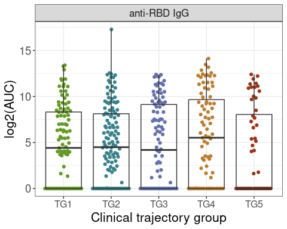
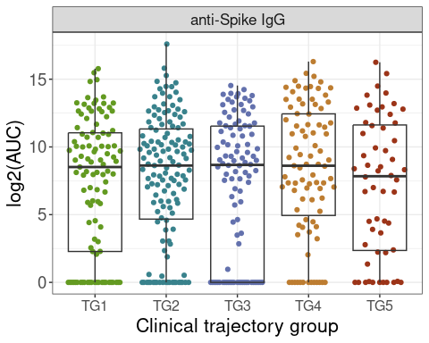
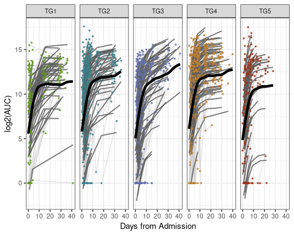

Serum antibody titers data analysis for core-assay manuscript
================
07 June, 2023

### Load libraries

``` r
suppressPackageStartupMessages(library(package = "knitr"))
suppressPackageStartupMessages(library(package = "impute"))
suppressPackageStartupMessages(library(package = "igraph"))
suppressPackageStartupMessages(library(package = "ggnetwork"))
suppressPackageStartupMessages(library(package = "ordinal"))
suppressPackageStartupMessages(library(package = "qvalue"))
suppressPackageStartupMessages(library(package = "ggbeeswarm"))
suppressPackageStartupMessages(library(package = "ggeffects"))
suppressPackageStartupMessages(library(package = "pvca"))
suppressPackageStartupMessages(library(package = "GSA"))
suppressPackageStartupMessages(library(package = "lme4"))
suppressPackageStartupMessages(library(package = "nlme"))
suppressPackageStartupMessages(library(package = "tidyverse"))
suppressPackageStartupMessages(library(package = "ggsignif"))

# set session options
options(show_col_types = FALSE)
VarCorr <- lme4::VarCorr
```

### Load codebase.R, load data matrices and set path to your local output directory

``` r
# load codebase.R, serum-rbd-abtiters data and clinical information
# source("~/bitbucket/impacc/Analysis/data_analysis_template_codebase.R")
source("../../Codebase/codebase_v2.R")
data_env <- load_IMPACC_datasets(DATA_VERSION                = "2022-01-01", 
                                 KEEP_COVID19_POS            = TRUE, 
                                 FILTER_BY_CORE_ASSAY_COHORT = TRUE,
                                 ASSAY_NAMES = "serum_rbd_abtiters")
```

    ## Warning in load_assay_data(data_env, DATA_VERSION, ALLOWED_SMPL_STATUS): "Metadata from targeted proteomics of plasma" is not accessible. Either you don't have access to this data or the data does not exist for the version of dataset you have selected.

    ## Warning in load_assay_data(data_env, DATA_VERSION, ALLOWED_SMPL_STATUS): "Count data from targeted proteomics of plasma" is not accessible. Either you don't have access to this data or the data does not exist for the version of dataset you have selected.

    ## Warning in load_assay_data(data_env, DATA_VERSION, ALLOWED_SMPL_STATUS): "RowFeature data from targeted proteomics of plasma" is not accessible. Either you don't have access to this data or the data does not exist for the version of dataset you have selected.

    ## Warning in load_assay_data(data_env, DATA_VERSION, ALLOWED_SMPL_STATUS): "Metadata from global proteomics (DDA) of plasma" is not accessible. Either you don't have access to this data or the data does not exist for the version of dataset you have selected.

    ## Warning in load_assay_data(data_env, DATA_VERSION, ALLOWED_SMPL_STATUS): "Count data from global proteomics (DDA) of plasma" is not accessible. Either you don't have access to this data or the data does not exist for the version of dataset you have selected.

    ## Warning in load_assay_data(data_env, DATA_VERSION, ALLOWED_SMPL_STATUS): "RowFeature data from global proteomics (DDA) of plasma" is not accessible. Either you don't have access to this data or the data does not exist for the version of dataset you have selected.

    ## Warning in load_assay_data(data_env, DATA_VERSION, ALLOWED_SMPL_STATUS): "Metadata from global proteomics (DIA) of plasma" is not accessible. Either you don't have access to this data or the data does not exist for the version of dataset you have selected.

    ## Warning in load_assay_data(data_env, DATA_VERSION, ALLOWED_SMPL_STATUS): "Count data from global proteomics (DIA) of plasma" is not accessible. Either you don't have access to this data or the data does not exist for the version of dataset you have selected.

    ## Warning in load_assay_data(data_env, DATA_VERSION, ALLOWED_SMPL_STATUS): "RowFeature data from global proteomics (DIA) of plasma" is not accessible. Either you don't have access to this data or the data does not exist for the version of dataset you have selected.

    ## Warning in load_assay_data(data_env, DATA_VERSION, ALLOWED_SMPL_STATUS): "Metadata from Olink assay of serum" is not accessible. Either you don't have access to this data or the data does not exist for the version of dataset you have selected.

    ## Warning in load_assay_data(data_env, DATA_VERSION, ALLOWED_SMPL_STATUS): "Count data from Olink assay of serum" is not accessible. Either you don't have access to this data or the data does not exist for the version of dataset you have selected.

    ## Warning in load_assay_data(data_env, DATA_VERSION, ALLOWED_SMPL_STATUS): "RowFeature data from Olink assay of serum" is not accessible. Either you don't have access to this data or the data does not exist for the version of dataset you have selected.

    ## Warning in load_assay_data(data_env, DATA_VERSION, ALLOWED_SMPL_STATUS): "Metadata for nasal viral load" is not accessible. Either you don't have access to this data or the data does not exist for the version of dataset you have selected.

    ## Warning in load_assay_data(data_env, DATA_VERSION, ALLOWED_SMPL_STATUS): "Count data for nasal viral load" is not accessible. Either you don't have access to this data or the data does not exist for the version of dataset you have selected.

    ## Warning in load_assay_data(data_env, DATA_VERSION, ALLOWED_SMPL_STATUS): "RowFeature data for nasal viral load" is not accessible. Either you don't have access to this data or the data does not exist for the version of dataset you have selected.

    ## Warning in load_assay_data(data_env, DATA_VERSION, ALLOWED_SMPL_STATUS): "Metadata for SARS-CoV-2 ab-titer in serum" is not accessible. Either you don't have access to this data or the data does not exist for the version of dataset you have selected.

    ## Warning in load_assay_data(data_env, DATA_VERSION, ALLOWED_SMPL_STATUS): "Count data for SARS-CoV-2 ab-titer in serum" is not accessible. Either you don't have access to this data or the data does not exist for the version of dataset you have selected.

    ## Warning in load_assay_data(data_env, DATA_VERSION, ALLOWED_SMPL_STATUS): "RowFeature data for SARS-CoV-2 ab-titer in serum" is not accessible. Either you don't have access to this data or the data does not exist for the version of dataset you have selected.

    ## Warning in load_assay_data(data_env, DATA_VERSION, ALLOWED_SMPL_STATUS): "Metadata for nasal transcriptomics" is not accessible. Either you don't have access to this data or the data does not exist for the version of dataset you have selected.

    ## Warning in load_assay_data(data_env, DATA_VERSION, ALLOWED_SMPL_STATUS): "Count data for nasal transcriptomics" is not accessible. Either you don't have access to this data or the data does not exist for the version of dataset you have selected.

    ## Warning in load_assay_data(data_env, DATA_VERSION, ALLOWED_SMPL_STATUS): "RowFeature data for nasal transcriptomics" is not accessible. Either you don't have access to this data or the data does not exist for the version of dataset you have selected.

    ## Warning in load_assay_data(data_env, DATA_VERSION, ALLOWED_SMPL_STATUS): "Metadata for global metabolomics of plasma" is not accessible. Either you don't have access to this data or the data does not exist for the version of dataset you have selected.

    ## Warning in load_assay_data(data_env, DATA_VERSION, ALLOWED_SMPL_STATUS): "Count data for global metabolomics of plasma" is not accessible. Either you don't have access to this data or the data does not exist for the version of dataset you have selected.

    ## Warning in load_assay_data(data_env, DATA_VERSION, ALLOWED_SMPL_STATUS): "RowFeature data for global metabolomics of plasma" is not accessible. Either you don't have access to this data or the data does not exist for the version of dataset you have selected.

    ## Warning in load_assay_data(data_env, DATA_VERSION, ALLOWED_SMPL_STATUS): "Metadata for CyTOF of blood" is not accessible. Either you don't have access to this data or the data does not exist for the version of dataset you have selected.

    ## Warning in load_assay_data(data_env, DATA_VERSION, ALLOWED_SMPL_STATUS): "Count data for CyTOF of blood" is not accessible. Either you don't have access to this data or the data does not exist for the version of dataset you have selected.

    ## Warning in load_assay_data(data_env, DATA_VERSION, ALLOWED_SMPL_STATUS): "RowFeature data for CyTOF of blood" is not accessible. Either you don't have access to this data or the data does not exist for the version of dataset you have selected.

    ## Warning in load_assay_data(data_env, DATA_VERSION, ALLOWED_SMPL_STATUS): "Metadata for CyTOF of EA" is not accessible. Either you don't have access to this data or the data does not exist for the version of dataset you have selected.

    ## Warning in load_assay_data(data_env, DATA_VERSION, ALLOWED_SMPL_STATUS): "Count data for CyTOF of EA" is not accessible. Either you don't have access to this data or the data does not exist for the version of dataset you have selected.

    ## Warning in load_assay_data(data_env, DATA_VERSION, ALLOWED_SMPL_STATUS): "RowFeature data for CyTOF of EA" is not accessible. Either you don't have access to this data or the data does not exist for the version of dataset you have selected.

    ## Warning in load_assay_data(data_env, DATA_VERSION, ALLOWED_SMPL_STATUS): "Metadata for EA transcriptomics" is not accessible. Either you don't have access to this data or the data does not exist for the version of dataset you have selected.

    ## Warning in load_assay_data(data_env, DATA_VERSION, ALLOWED_SMPL_STATUS): "Count data for EA transcriptomics" is not accessible. Either you don't have access to this data or the data does not exist for the version of dataset you have selected.

    ## Warning in load_assay_data(data_env, DATA_VERSION, ALLOWED_SMPL_STATUS): "RowFeature data for EA transcriptomics" is not accessible. Either you don't have access to this data or the data does not exist for the version of dataset you have selected.

    ## Warning in load_assay_data(data_env, DATA_VERSION, ALLOWED_SMPL_STATUS): "Metadata for PBMC transcriptomics" is not accessible. Either you don't have access to this data or the data does not exist for the version of dataset you have selected.

    ## Warning in load_assay_data(data_env, DATA_VERSION, ALLOWED_SMPL_STATUS): "Count data for PBMC transcriptomics" is not accessible. Either you don't have access to this data or the data does not exist for the version of dataset you have selected.

    ## Warning in load_assay_data(data_env, DATA_VERSION, ALLOWED_SMPL_STATUS): "RowFeature data for PBMC transcriptomics" is not accessible. Either you don't have access to this data or the data does not exist for the version of dataset you have selected.

    ## Warning in load_assay_data(data_env, DATA_VERSION, ALLOWED_SMPL_STATUS): "Metadata for EA metagenomics" is not accessible. Either you don't have access to this data or the data does not exist for the version of dataset you have selected.

    ## Warning in load_assay_data(data_env, DATA_VERSION, ALLOWED_SMPL_STATUS): "Count data for EA metagenomics" is not accessible. Either you don't have access to this data or the data does not exist for the version of dataset you have selected.

    ## Warning in load_assay_data(data_env, DATA_VERSION, ALLOWED_SMPL_STATUS): "RowFeature data for EA metagenomics" is not accessible. Either you don't have access to this data or the data does not exist for the version of dataset you have selected.

    ## Warning in load_assay_data(data_env, DATA_VERSION, ALLOWED_SMPL_STATUS): "Metadata for nasal metagenomics" is not accessible. Either you don't have access to this data or the data does not exist for the version of dataset you have selected.

    ## Warning in load_assay_data(data_env, DATA_VERSION, ALLOWED_SMPL_STATUS): "Count data for nasal metagenomics" is not accessible. Either you don't have access to this data or the data does not exist for the version of dataset you have selected.

    ## Warning in load_assay_data(data_env, DATA_VERSION, ALLOWED_SMPL_STATUS): "RowFeature data for nasal metagenomics" is not accessible. Either you don't have access to this data or the data does not exist for the version of dataset you have selected.

    ## Warning in load_assay_data(data_env, DATA_VERSION, ALLOWED_SMPL_STATUS): "Metadata for serum autoantibody" is not accessible. Either you don't have access to this data or the data does not exist for the version of dataset you have selected.

    ## Warning in load_assay_data(data_env, DATA_VERSION, ALLOWED_SMPL_STATUS): "Count data for serum autoantibody" is not accessible. Either you don't have access to this data or the data does not exist for the version of dataset you have selected.

    ## Warning in load_assay_data(data_env, DATA_VERSION, ALLOWED_SMPL_STATUS): "RowFeature data for serum autoantibody" is not accessible. Either you don't have access to this data or the data does not exist for the version of dataset you have selected.

``` r
#data_env <- readRDS("~/data_env.rds")
for (n in grep(pattern = "serum_rbd_abtiters_counts|clinical_data", 
               names(data_env), 
               value   = TRUE)) {
  assign(n, value = data_env[[n]])
}


# Setup the assay specific output directory
out_dir = "../output"
```

 

 

#### Combine clinical data and serum rbd titers data

 

 

 

 

 

#### Panel E analysis code

``` r
data_use_visit1 <- clinical_titers_counts_data %>%
  tidyr::drop_na(trajectory_group) %>%
  filter(event_type == "Visit 1") %>%
  mutate(RBD.IgG = log2(AUC.RBD.IgG),
         Spike.IgG = log2(AUC.Spike.IgG)) %>%
  select(sample_id, 
         RBD.IgG,
         Spike.IgG,
         enrollment_site,
         trajectory_group,
         discretized_admit_age_quantile,
         sex) %>%
  mutate_if(is.character, as.factor) %>%
  mutate(trajectory_group = factor(trajectory_group))

module_names <- c("RBD.IgG", "Spike.IgG")

res_table_ordinal <- NULL
data_use <- data_use_visit1
for (moduleName in module_names) {
  my.formula0 <- paste0('trajectory_group~ 1+(1|enrollment_site)+',
                        'discretized_admit_age_quantile+sex')
  my.formula1 <- paste0('trajectory_group~',
                        moduleName,
                        '+(1|enrollment_site)+',
                        'discretized_admit_age_quantile+sex')
  res <- mixed_ordinal(my.formula0, 
                       my.formula1,
                       data_use = data_use_visit1)
  coef(clmm(formula(my.formula1), 
            data = data_use_visit1))[moduleName] %>%
    unname() %>%
    c(res, coef = .) -> res
  res_table_ordinal <- rbind(res_table_ordinal, res)
}
rownames(res_table_ordinal) <- module_names
res_table_ordinal <- res_table_ordinal %>%
  as.data.frame() %>%
   mutate(qval =  qvalue::qvalue(pval, fdr.level = 0.05, pi0 = 1)$qvalues)


res_table_ordinal_df <- res_table_ordinal %>%
  rownames_to_column(var = "feature")

# pairwise comparisons
data_use_pairwise <- data_use %>%
  rename(endpoints = trajectory_group)

for(j in 1:length(module_names)){
  print(j)
  my.formula0 = paste0(module_names[j],"~ 1+(1|enrollment_site)+discretized_admit_age_quantile+sex")
  my.formula1 = paste0(module_names[j],"~ endpoints + (1|enrollment_site)+discretized_admit_age_quantile+sex")
  if(j == 1){
    tmp = mixed_pairwise(my.formula0, my.formula1, data_use_pairwise)
    res_table_pairwise = data.frame(matrix(0, ncol = length(tmp), nrow = length(module_names)))
    res_table_pairwise[j,] = tmp
    colnames(res_table_pairwise) = names(tmp)
  }else{
    res_table_pairwise[j,] = mixed_pairwise(my.formula0, my.formula1, data_use_pairwise)
  }
}
```

    ## [1] 1

    ## refitting model(s) with ML (instead of REML)
    ## refitting model(s) with ML (instead of REML)
    ## refitting model(s) with ML (instead of REML)
    ## refitting model(s) with ML (instead of REML)
    ## refitting model(s) with ML (instead of REML)
    ## refitting model(s) with ML (instead of REML)
    ## refitting model(s) with ML (instead of REML)
    ## refitting model(s) with ML (instead of REML)
    ## refitting model(s) with ML (instead of REML)
    ## refitting model(s) with ML (instead of REML)

    ## [1] 2

    ## refitting model(s) with ML (instead of REML)
    ## refitting model(s) with ML (instead of REML)
    ## refitting model(s) with ML (instead of REML)

    ## boundary (singular) fit: see ?isSingular
    ## boundary (singular) fit: see ?isSingular

    ## refitting model(s) with ML (instead of REML)
    ## refitting model(s) with ML (instead of REML)
    ## refitting model(s) with ML (instead of REML)
    ## refitting model(s) with ML (instead of REML)
    ## refitting model(s) with ML (instead of REML)
    ## refitting model(s) with ML (instead of REML)
    ## refitting model(s) with ML (instead of REML)

``` r
rownames(res_table_pairwise) = module_names


res_table_ordinal_df <- cbind(res_table_ordinal_df, res_table_pairwise)
```

### Main Panel E: output generation code

``` r
# RBD IgG
visit1_RBD <- data_use_visit1 %>%
  # rownames_to_column(var = "sample_id") %>%
  select(sample_id, RBD.IgG, trajectory_group) %>%
  pivot_longer(cols = -c(sample_id, trajectory_group)) %>%
  mutate(name             = "anti-RBD IgG",
         trajectory_group = paste0("TG", trajectory_group)) %>%
  ggplot(mapping = aes(x = trajectory_group, y = value)) +
  geom_quasirandom(mapping = aes(color = trajectory_group), cex = 1.5) +
  geom_boxplot(fill = "transparent", outlier.color= "transparent") +
  facet_wrap(facets= ~name, ncol = 1) + 
  labs(y = "log2(AUC)", x = "Clinical trajectory group") +
  scale_color_manual(values = c("TG1" = "#639A21",
                                "TG2" = "#39828C",
                                "TG3" = "#6371AD",
                                "TG4" = "#BD7D31",
                                "TG5" = "#9C3418")) +
  theme_bw() +
  theme(legend.position = "none", 
        axis.text.x = element_text(angle = 0, hjust = 0.5, size = 12),
        axis.text.y = element_text(size = 14),
        text = element_text(size=16)) 

print(visit1_RBD)
```

<!-- -->

``` r
ggsave(
 filename = file.path(out_dir, "main_E.pdf"),
 width = 3,
 height = 3
)
```

### Supple Panel C: output generation code

``` r
# Spike IgG
visit1_Spike <- data_use_visit1 %>%
  # rownames_to_column(var = "sample_id") %>%
  select(sample_id, Spike.IgG, trajectory_group) %>%
  pivot_longer(cols = -c(sample_id, trajectory_group)) %>%
  mutate(name             = "anti-Spike IgG",
         trajectory_group = paste0("TG", trajectory_group)) %>%
  ggplot(mapping = aes(x = trajectory_group, y = value)) +
  geom_quasirandom(mapping = aes(color = trajectory_group), cex = 1.5) +
  geom_boxplot(fill = "transparent", outlier.color= "transparent") +
  facet_wrap(facets= ~name, ncol = 1) + 
  labs(y = "log2(AUC)", x = "Clinical trajectory group") +
  scale_color_manual(values = c("TG1" = "#639A21",
                                "TG2" = "#39828C",
                                "TG3" = "#6371AD",
                                "TG4" = "#BD7D31",
                                "TG5" = "#9C3418")) +
  theme_bw() +
  theme(legend.position = "none", 
        axis.text.x = element_text(angle = 0, hjust = 0.5, size = 12),
        axis.text.y = element_text(size = 14),
        text = element_text(size=16)) 

print(visit1_Spike)
```

<!-- -->

``` r
ggsave(
 filename = file.path(out_dir, "suppl_C.pdf"),
 width = 3,
 height = 3
)
```

 

 

### Panel D: analysis code

``` r
data_use_longitudinal <- clinical_titers_counts_data %>% 
  tidyr::drop_na(trajectory_group) %>% 
  mutate(sample_id, 
         RBD.IgG = AUC.RBD.IgG, 
         Spike.IgG = AUC.Spike.IgG) %>% 
  mutate(participant_id = factor(participant_id)) %>%
  select(sample_id, 
         RBD.IgG , 
         Spike.IgG, 
         participant_id,  
         enrollment_site,
         trajectory_group, event_date, event_type,
         sex, discretized_admit_age_quantile) %>%
  mutate_if(is.character, as.factor) %>%
  mutate(trajectory_group = factor(trajectory_group)) %>%
  mutate(discretized_admit_age_quantile= factor(discretized_admit_age_quantile))


inputDF <- data_use_longitudinal %>%
  pivot_longer(cols = -c("sample_id", "event_date", "event_type", "participant_id",
                         "enrollment_site", "trajectory_group", "sex", "discretized_admit_age_quantile",
                         ))


# smooth spline
smooth_spline_model_loop <- model_loop(inputDF, 
                                       modelType = "smoothSpline", 
                                       endpoint = "trajectory_group")

smooth_spline_model_loop_df <- smooth_spline_model_loop %>%
  rownames_to_column(var = "feature")
```

 

 

### Main Panel F: output generation code

``` r
# RBD IgG
exampleDF <- inputDF %>%
  filter(name %in% "RBD.IgG") %>%
  mutate(trajectory_group = ordered(as.factor(as.character(trajectory_group)), 
                                    levels = c("1", "2", "3", "4", "5"))) %>%
  mutate(value = log2(value))

temp_plot <- plot_model(exampleDF, model_loop = smooth_spline_model_loop, modelType = "smoothSpline",
           p_adjust = F, endpoint = "trajectory_group", signif_markers = F, remove_NS = T,
           title = "",
           individual_points_size = 0.5,
           individual_paths_size = 0.5,
           group_trendline_line_width = 1.5,
           title_size = 12,
           bar_height = 5,
           custom_theme_graph = 'text = element_text(size=10)',
           # custom_theme_bars = 'text = element_text(size=3)',
           knot_lines = F,
           ylabel = "log2(AUC)",
           CI = FALSE,
           individual_trendlines = T, individual_points = T, individual_paths = T,
           y_axis_reverse = FALSE, p_value_text_size = 1.5,
           return_multi_obj = T)
```

    ## Warning: `aes_string()` was deprecated in ggplot2 3.0.0.
    ## ℹ Please use tidy evaluation ideoms with `aes()`
    ## This warning is displayed once every 8 hours.
    ## Call `lifecycle::last_lifecycle_warnings()` to see where this warning was
    ## generated.

    ## Warning: Using `size` aesthetic for lines was deprecated in ggplot2 3.4.0.
    ## ℹ Please use `linewidth` instead.
    ## This warning is displayed once every 8 hours.
    ## Call `lifecycle::last_lifecycle_warnings()` to see where this warning was
    ## generated.

``` r
print(temp_plot[[1]])
```

    ## Warning: Combining variables of class <ordered> and <factor> was deprecated in ggplot2
    ## 3.4.0.
    ## ℹ Please ensure your variables are compatible before plotting (location:
    ##   `join_keys()`)
    ## This warning is displayed once every 8 hours.
    ## Call `lifecycle::last_lifecycle_warnings()` to see where this warning was
    ## generated.

<!-- -->

``` r
ggsave(
 filename = file.path(out_dir, "main_F.pdf"),
 plot = temp_plot[[1]],
 width = 5,
 height = 2
)
```

### Supple Panel D: output generation code

``` r
# Spike IgG
exampleDF <- inputDF %>%
  filter(name %in% "Spike.IgG") %>%
  mutate(trajectory_group = ordered(as.factor(as.character(trajectory_group)), 
                                    levels = c("1", "2", "3", "4", "5"))) %>%
  mutate(value = log2(value))

temp_plot <- plot_model(exampleDF, model_loop = smooth_spline_model_loop, modelType = "smoothSpline",
           p_adjust = F, endpoint = "trajectory_group", signif_markers = F, remove_NS = T,
           title = "",
           individual_points_size = 0.5,
           individual_paths_size = 0.5,
           group_trendline_line_width = 1.5,
           title_size = 12,
           bar_height = 5,
           custom_theme_graph = 'text = element_text(size=10)',
           # custom_theme_bars = 'text = element_text(size=3)',
           knot_lines = F,
           ylabel = "log2(AUC)",
           CI = FALSE,
           individual_trendlines = T, individual_points = T, individual_paths = T,
           y_axis_reverse = FALSE, p_value_text_size = 1.5,
           return_multi_obj = T)

print(temp_plot[[1]])
```

<!-- -->

``` r
ggsave(
 filename = file.path(out_dir, "suppl_D.pdf"),
 plot = temp_plot[[1]],
 width = 5,
 height = 2
)
```

### Session info

``` r
sessionInfo()
```

    ## R version 4.0.2 (2020-06-22)
    ## Platform: x86_64-pc-linux-gnu (64-bit)
    ## Running under: Ubuntu 22.04.2 LTS
    ## 
    ## Matrix products: default
    ## BLAS:   /usr/lib/x86_64-linux-gnu/openblas-pthread/libblas.so.3
    ## LAPACK: /usr/lib/x86_64-linux-gnu/openblas-pthread/libopenblasp-r0.3.20.so
    ## 
    ## locale:
    ##  [1] LC_CTYPE=C.UTF-8       LC_NUMERIC=C           LC_TIME=C.UTF-8       
    ##  [4] LC_COLLATE=C.UTF-8     LC_MONETARY=C.UTF-8    LC_MESSAGES=C.UTF-8   
    ##  [7] LC_PAPER=C.UTF-8       LC_NAME=C              LC_ADDRESS=C          
    ## [10] LC_TELEPHONE=C         LC_MEASUREMENT=C.UTF-8 LC_IDENTIFICATION=C   
    ## 
    ## attached base packages:
    ## [1] parallel  grid      stats     graphics  grDevices utils     datasets 
    ## [8] methods   base     
    ## 
    ## other attached packages:
    ##  [1] doParallel_1.0.16    doRNG_1.8.2          rngtools_1.5        
    ##  [4] missForest_1.4       itertools_0.1-3      iterators_1.0.13    
    ##  [7] foreach_1.5.1        randomForest_4.6-14  ComplexHeatmap_2.6.2
    ## [10] corrr_0.4.3          gridExtra_2.3        rlang_1.1.1         
    ## [13] RColorBrewer_1.1-2   cowplot_1.1.1        ggpubr_0.4.0        
    ## [16] pals_1.7             ggsignif_0.6.2       forcats_0.5.1       
    ## [19] stringr_1.4.0        dplyr_1.0.9          purrr_0.3.4         
    ## [22] readr_2.1.2          tidyr_1.2.0          tibble_3.1.7        
    ## [25] tidyverse_1.3.1      nlme_3.1-148         lme4_1.1-27.1       
    ## [28] Matrix_1.2-18        GSA_1.03.2           pvca_0.1.0          
    ## [31] ggeffects_1.1.3      ggbeeswarm_0.6.0     qvalue_2.22.0       
    ## [34] ordinal_2019.12-10   ggnetwork_0.5.10     ggplot2_3.4.0       
    ## [37] igraph_1.4.2         impute_1.64.0        knitr_1.39          
    ## 
    ## loaded via a namespace (and not attached):
    ##  [1] readxl_1.3.1        backports_1.2.0     circlize_0.4.13    
    ##  [4] systemfonts_0.3.2   plyr_1.8.6          splines_4.0.2      
    ##  [7] digest_0.6.27       htmltools_0.5.2     fansi_0.4.1        
    ## [10] magrittr_2.0.3      cluster_2.1.0       tzdb_0.4.0         
    ## [13] openxlsx_4.2.4      modelr_0.1.8        matrixStats_0.59.0 
    ## [16] colorspace_2.0-2    rvest_1.0.0         textshaping_0.2.1  
    ## [19] haven_2.4.1         xfun_0.31           crayon_1.4.1       
    ## [22] jsonlite_1.7.2      glue_1.6.2          gtable_0.3.0       
    ## [25] GetoptLong_1.0.5    car_3.0-11          shape_1.4.6        
    ## [28] BiocGenerics_0.36.1 maps_3.3.0          abind_1.4-5        
    ## [31] scales_1.2.1        DBI_1.1.1           rstatix_0.7.0      
    ## [34] Rcpp_1.0.8          clue_0.3-59         foreign_0.8-80     
    ## [37] mapproj_1.2.7       stats4_4.0.2        httr_1.4.4         
    ## [40] ellipsis_0.3.2      pkgconfig_2.0.3     farver_2.1.0       
    ## [43] dbplyr_2.1.1        utf8_1.1.4          tidyselect_1.1.1   
    ## [46] labeling_0.4.2      reshape2_1.4.4      munsell_0.5.0      
    ## [49] cellranger_1.1.0    tools_4.0.2         cli_3.6.1          
    ## [52] generics_0.1.2      sjlabelled_1.1.8    broom_0.8.0        
    ## [55] evaluate_0.15       fastmap_1.1.0       yaml_2.2.1         
    ## [58] ragg_0.4.0          fs_1.5.2            zip_2.2.0          
    ## [61] xml2_1.3.3          compiler_4.0.2      rstudioapi_0.13    
    ## [64] gamm4_0.2-6         beeswarm_0.4.0      curl_4.3           
    ## [67] png_0.1-7           reprex_2.0.0        stringi_1.5.3      
    ## [70] highr_0.8           lattice_0.20-41     nloptr_1.2.2.2     
    ## [73] vctrs_0.6.2         pillar_1.7.0        lifecycle_1.0.3    
    ## [76] GlobalOptions_0.1.2 ucminf_1.1-4        insight_0.18.2     
    ## [79] data.table_1.14.0   R6_2.5.0            rio_0.5.27         
    ## [82] vipor_0.4.5         IRanges_2.24.1      codetools_0.2-16   
    ## [85] dichromat_2.0-0     boot_1.3-25         MASS_7.3-51.6      
    ## [88] assertthat_0.2.1    rjson_0.2.20        withr_2.5.0        
    ## [91] S4Vectors_0.28.1    mgcv_1.8-31         hms_1.1.0          
    ## [94] minqa_1.2.4         rmarkdown_2.9       carData_3.0-4      
    ## [97] Cairo_1.5-12.2      numDeriv_2016.8-1.1 lubridate_1.7.10

<!--
R version 4.0.2 (2020-06-22)
Platform: x86_64-pc-linux-gnu (64-bit)
Running under: Ubuntu 18.04.4 LTS

Matrix products: default
BLAS:   /usr/lib/x86_64-linux-gnu/openblas/libblas.so.3
LAPACK: /usr/lib/x86_64-linux-gnu/libopenblasp-r0.2.20.so

locale:
 [1] LC_CTYPE=C.UTF-8       LC_NUMERIC=C           LC_TIME=C.UTF-8        LC_COLLATE=C.UTF-8    
 [5] LC_MONETARY=C.UTF-8    LC_MESSAGES=C.UTF-8    LC_PAPER=C.UTF-8       LC_NAME=C             
 [9] LC_ADDRESS=C           LC_TELEPHONE=C         LC_MEASUREMENT=C.UTF-8 LC_IDENTIFICATION=C   

attached base packages:
[1] parallel  grid      stats     graphics  grDevices utils     datasets  methods   base     

other attached packages:
 [1] doParallel_1.0.17     doRNG_1.8.2           rngtools_1.5.2        missForest_1.4       
 [5] itertools_0.1-3       iterators_1.0.14      foreach_1.5.2         randomForest_4.6-10  
 [9] ComplexHeatmap_2.11.1 corrr_0.4.3           gridExtra_2.3         rlang_1.0.1          
[13] RColorBrewer_1.1-2    cowplot_1.1.1         ggpubr_0.4.0          pals_1.7             
[17] forcats_0.5.1         stringr_1.4.0         dplyr_1.0.8           purrr_0.3.4          
[21] readr_2.1.2           tidyr_1.2.0           tibble_3.1.6          tidyverse_1.3.1      
[25] nlme_3.1-147          lme4_1.1-28           Matrix_1.2-18         GSA_1.03.2           
[29] pvca_0.1.0            ggeffects_1.1.1       ggbeeswarm_0.6.0      qvalue_2.22.0        
[33] ordinal_2019.12-10    ggnetwork_0.5.10      ggplot2_3.3.5         igraph_1.3.0         
[37] impute_1.64.0         knitr_1.37           

loaded via a namespace (and not attached):
 [1] minqa_1.2.4         colorspace_2.0-3    ggsignif_0.6.3      rjson_0.2.21       
 [5] ellipsis_0.3.2      sjlabelled_1.1.8    snakecase_0.11.0    circlize_0.4.14    
 [9] GlobalOptions_0.1.2 fs_1.5.2            dichromat_2.0-0     clue_0.3-60        
[13] rstudioapi_0.13     farver_2.1.0        fansi_1.0.2         lubridate_1.8.0    
[17] xml2_1.3.2          codetools_0.2-16    splines_4.0.2       jsonlite_1.7.3     
[21] nloptr_2.0.0        broom_0.7.12        cluster_2.1.0       dbplyr_2.1.1       
[25] png_0.1-7           mapproj_1.2.8       compiler_4.0.2      httr_1.4.2         
[29] backports_1.4.1     fastmap_1.1.0       assertthat_0.2.1    cli_3.2.0          
[33] htmltools_0.5.2     tools_4.0.2         gtable_0.3.0        glue_1.6.1         
[37] reshape2_1.4.4      maps_3.4.0          Rcpp_1.0.8          carData_3.0-5      
[41] cellranger_1.1.0    vctrs_0.3.8         insight_0.16.0      xfun_0.29          
[45] rvest_1.0.2         lifecycle_1.0.1     rstatix_0.7.0       MASS_7.3-51.6      
[49] scales_1.1.1        hms_1.1.1           gamm4_0.2-6         yaml_2.3.5         
[53] stringi_1.7.6       ucminf_1.1-4        S4Vectors_0.28.1    BiocGenerics_0.36.1
[57] boot_1.3-25         shape_1.4.6         pkgconfig_2.0.3     matrixStats_0.61.0 
[61] evaluate_0.14       lattice_0.20-41     labeling_0.4.2      tidyselect_1.1.2   
[65] plyr_1.8.6          magrittr_2.0.2      R6_2.5.1            IRanges_2.24.1     
[69] generics_0.1.2      DBI_1.1.2           mgcv_1.8-31         pillar_1.7.0       
[73] haven_2.4.3         withr_2.4.3         abind_1.4-5         modelr_0.1.8       
[77] crayon_1.5.0        car_3.0-12          utf8_1.2.2          rmarkdown_2.11     
[81] tzdb_0.2.0          GetoptLong_1.0.5    readxl_1.3.1        reprex_2.0.1       
[85] digest_0.6.29       numDeriv_2016.8-1.1 stats4_4.0.2        munsell_0.5.0      
[89] viridisLite_0.4.0   beeswarm_0.4.0      vipor_0.4.5
-->
