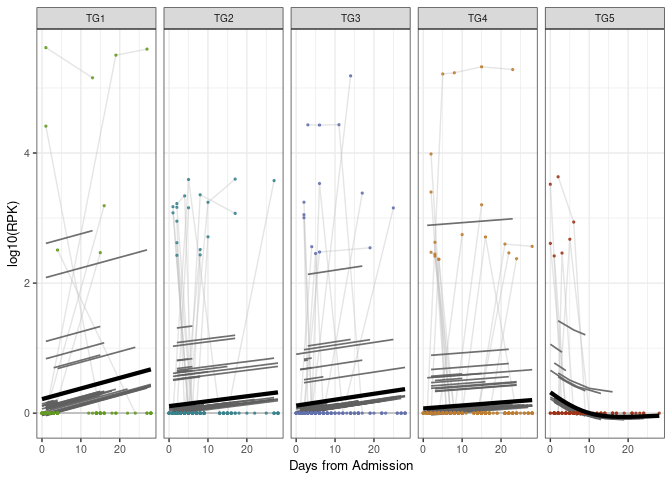
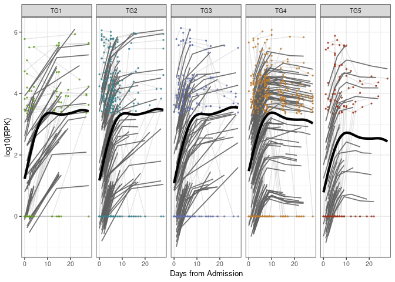
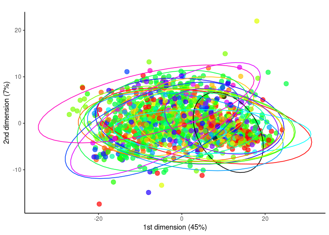
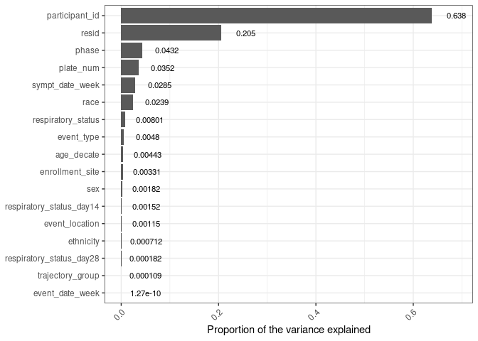
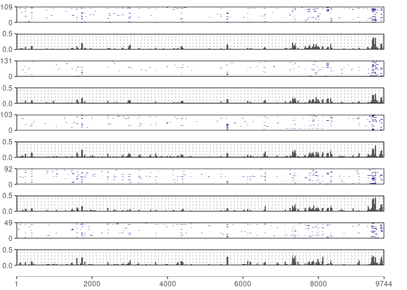
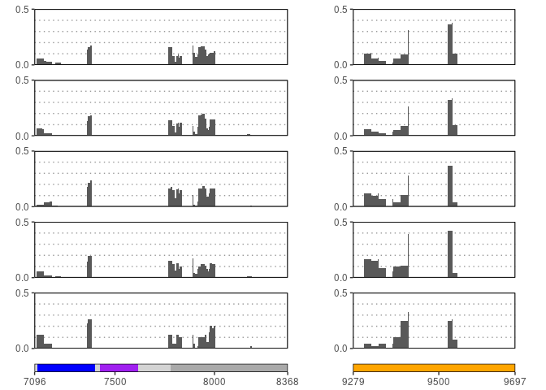
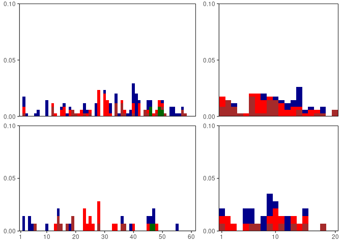

Serum SARS-CoV2 PhIP-Seq analysis for core assay manuscript
================
08 June, 2023

### Load libraries

``` r
suppressPackageStartupMessages(library(package = "knitr"))
suppressPackageStartupMessages(library(package = "data.table"))
suppressPackageStartupMessages(library(package = "stringr"))
suppressPackageStartupMessages(library(package = "dplyr"))
suppressPackageStartupMessages(library(package = "Biostrings"))
suppressPackageStartupMessages(library(package = "seqinr"))
suppressPackageStartupMessages(library(package = "ggplot2"))
suppressPackageStartupMessages(library(package = "rlist"))
suppressPackageStartupMessages(library(package = "cowplot"))
suppressPackageStartupMessages(library(package = "pals"))
suppressPackageStartupMessages(library(package = "RColorBrewer"))
suppressPackageStartupMessages(library(package = "corrr"))
suppressPackageStartupMessages(library(package = "ComplexHeatmap"))
suppressPackageStartupMessages(library(package = "tidyr"))
suppressPackageStartupMessages(library(package = "ggpubr"))
suppressPackageStartupMessages(library(package = "tibble"))
suppressPackageStartupMessages(library(package = "egg"))
suppressPackageStartupMessages(library(package = "qvalue"))
suppressPackageStartupMessages(library(package = "lme4"))
suppressPackageStartupMessages(library(package = "ordinal"))
suppressPackageStartupMessages(library(package = "gridExtra"))
suppressPackageStartupMessages(library(package = "nlme"))
suppressPackageStartupMessages(library(package = "mgcv"))
suppressPackageStartupMessages(library(package = "gam"))
suppressPackageStartupMessages(library(package = "gamm4"))
suppressPackageStartupMessages(library(package = "ggsignif"))
suppressPackageStartupMessages(library(package = "effects"))
suppressPackageStartupMessages(library(package = "tidyverse"))
suppressPackageStartupMessages(library(package = "ggeffects"))
suppressPackageStartupMessages(library(package = "pvca"))

# set session options
options(show_col_types = FALSE)
VarCorr <- lme4::VarCorr
```

### Load codebase.R, load data matrices and set path to a local output directory

``` r
# load codebase.R, olink data and clinical information
source("../../Codebase/codebase_v2.R")

# All samples (used for PCA)
alldata_env <- load_IMPACC_datasets(DATA_VERSION                = "2022-01-01", 
                                 KEEP_COVID19_POS            = FALSE, 
                                 FILTER_BY_CORE_ASSAY_COHORT = FALSE,
                                 ALLOWED_SMPL_STATUS =  c("IMPACC sample assayed and passed QC",
                                                          "IMPACC sample assayed with questionable QC", 
                                                          "Internal control"),
                                 ASSAY_NAMES = "serum_sarscov2_abtiters")
for (n in grep(pattern = "serum_sarscov2_abtiters|clinical_data", 
               names(alldata_env), 
               value   = TRUE)) {
  assign(n, value = alldata_env[[n]])
}


# Final Cohort
data_env <- load_IMPACC_datasets(DATA_VERSION                = "2022-01-01", 
                                 KEEP_COVID19_POS            = TRUE, 
                                 FILTER_BY_CORE_ASSAY_COHORT = TRUE,
                                 ASSAY_NAMES = "serum_sarscov2_abtiters")
for (n in grep(pattern = "serum_sarscov2_abtiters|clinical_data", 
               names(data_env), 
               value   = TRUE)) {
  assign(n, value = data_env[[n]])
}

# Setup the assay specific output directory
out_dir <- "../output"


### Misc
# Setup the path of any databases needed for the analysis

# Pre-Pandemic Controls
prepandemic_controls_fh <- "/data/resources/serum-sarscov2-abtiters/healthy_controls/HC_downsampled_1500K_raw_count.csv"
if(! file.exists(prepandemic_controls_fh)) {
  stop("Please review 'src/resources_serum_sarscov2_abtiters.Rmd' to check how to produce the intermediate files used for the analysis.")
}
hc_df_ds                <- read.csv(prepandemic_controls_fh,row.names = 1,stringsAsFactors = F)

# BLAST and CDhit results - peptide coordinates aligned to SARS-CoV2 genome in addition to sequence clusters
blast_results_fh   <- "/data/resources/serum-sarscov2-abtiters/formatted_aln_files/blast_df_formatted.csv"
cdhit_clusters_fh  <- "/data/resources/serum-sarscov2-abtiters/formatted_aln_files/cluster_df_formatted.csv"
blast_df           <- read.csv(blast_results_fh,stringsAsFactors = F)
blast_df$clusterid <- as.character(blast_df$clusterid)
cluster_df         <- read.csv(cdhit_clusters_fh, stringsAsFactors = F)

# Load region annotation coordinates
annot_table_fh  <- "/data/resources/serum-sarscov2-abtiters/annotations/blast_covid19_bigorf_region_annotations.csv"
spike_region_fh <- "/data/resources/serum-sarscov2-abtiters/annotations/SARS2_spike_region_annotations.csv"
annot_table     <- read.csv(annot_table_fh,stringsAsFactors = F)
spike_region_df <- read.csv(spike_region_fh,stringsAsFactors = F)

# Load peptide counts
counts_df      <- data_env$serum_sarscov2_abtiters_counts
counts_df      <- as.data.frame(t(counts_df))

# Define the outlier samples, if any, that should be removed in Coverage Map.
read_depth_df <- as.data.frame(colSums(counts_df))
names(read_depth_df) <- "total_count"
read_depth_df$sample <- row.names(read_depth_df)
outlier_sample_ids <- as.data.frame(read_depth_df[read_depth_df$total_count < 500000,])
outlier_sample_ids <- outlier_sample_ids$sample
```

### Functions: data processing

``` r
## scaleReadCounts
#  - sample.loc = c("col","row")
scaleReadCounts <- function(df, samples, rpk = FALSE,sample.loc="col") {
  for (s in samples) {
    if(sample.loc =="col"){
      col   <- df[,s]
      total <- sum(col)
      col <- col / total
      if(rpk){col <- col * 100000}
      df[,names(df) %in% s] <- col
    }
    
    if(sample.loc == "row"){
      row   <- df[s,]
      total <- sum(row)
      row <- row / total
      if(rpk){row <- row * 100000}
      df[row.names(df) %in% s,] <- row
    }
  }
  
  return(df)
}

## createCoverageCountMatrixSARS2
#    -- count.type =  c("rpk","peptide")
#    -- list.type  =  c("participant", "sample")
createCoverageCountMatrixSARS2 <- function(sig_pep_df_sars, all_ids,id_list,coord_hash,
                                           count.type = "rpk", list.type = "sample", REF_LEN = 9744) {
  sars2_heatmap            <- data.frame(matrix(0,nrow = length(all_ids),ncol = REF_LEN))
  names(sars2_heatmap)     <- tstrsplit(names(sars2_heatmap),"X")[[2]]
  row.names(sars2_heatmap) <- all_ids
  
  for (id in id_list) {
    target_col <- ""
    if (list.type == "participant"){target_col <- "participant_id"}
    if (list.type == "sample")     {target_col <- "sample"}
    
    id_df <- sig_pep_df_sars[sig_pep_df_sars[,target_col] %in% id,]
    id_df <- id_df[id_df$peptide %in% names(coord_hash),]
    if(nrow(id_df) == 0){next}
    
    for (i in 1:nrow(id_df)) {
      id_row <- id_df[i,]
      pep    <- id_row$peptide
      clus   <- as.character(id_row$cluster_id)
      rpk    <- id_row$rpk
      
      # Lookup start and end coordinates from blast
      coords <- coord_hash[[pep]]
      sstart <- as.numeric(coords[1])
      send   <- as.numeric(coords[2])
      target_pos_vec <- sstart:send
      target_pos_vec <- as.character(target_pos_vec)
      
      count_val <- 0
      if (count.type == "peptide") {count_val <- 1}
      if (count.type == "rpk")     {count_val  <- rpk}
      
      # ADD COUNTS TO MATRIX
      sars2_heatmap[id,target_pos_vec] <- sars2_heatmap[id,target_pos_vec] + count_val
    }
  }
  
  return(sars2_heatmap)
}


## normalizeHeatmap
normalizeHeatmap <- function(mtx, zscore.norm = TRUE, row.norm = TRUE,log.norm = FALSE) {
  mtx <- as.matrix(mtx)
  
  # Row Sum Normalization
  mtx.norm <- mtx
  if(row.norm){
    mtx.norm <- mtx/rowSums(mtx)
    mtx.norm[is.na(mtx.norm)] <- 0
  }
  
  
  # Calculate Z-score for each cell
  mtx.znorm <- mtx.norm
  table_row_names <- row.names(mtx.znorm)
  table_col_names <-colnames(mtx.znorm)
  
  for(r in 1:nrow(mtx.znorm)){
    row_data <- mtx.znorm[r,]
    std_dev  <- sd(row_data)
    row_mean <- mean(row_data)
    for(c in 1:ncol(mtx.znorm)) {
      z_score <- (mtx.znorm[r,c] - row_mean)/std_dev
      mtx.znorm[r,c] <- z_score
    }
  }
  
  mtx.fin <- mtx.norm
  if(zscore.norm){mtx.fin <- mtx.znorm}
  
  # Log normalization
  if (log.norm){
    mtx.fin <- mtx.fin + 1
    mtx.fin <- log2(mtx.fin)
  }
  
  return(mtx.fin)
}

## normalizeMatrix - Normalize matrix for PCA plot
normalizeMatrix <- function(mtx, zscore.norm = FALSE, row.norm = TRUE,log.norm = TRUE) {
  mtx <- as.matrix(mtx)
  
  # Row Sum Normalization
  mtx.norm <- mtx
  if(row.norm){
    mtx.norm <- mtx/rowSums(mtx)
    mtx.norm[is.na(mtx.norm)] <- 0
  }
  
  
  # Calculate Z-score for each cell
  mtx.znorm <- mtx.norm
  table_row_names <- row.names(mtx.znorm)
  table_col_names <-colnames(mtx.znorm)
  
  for(r in 1:nrow(mtx.znorm)){
    row_data <- mtx.znorm[r,]
    std_dev  <- sd(row_data)
    row_mean <- mean(row_data)
    for(c in 1:ncol(mtx.znorm)) {
      z_score <- (mtx.znorm[r,c] - row_mean)/std_dev
      mtx.znorm[r,c] <- z_score
    }
  }
  
  mtx.fin <- mtx.norm
  if(zscore.norm){mtx.fin <- mtx.znorm}
  
  # Log normalization
  if (log.norm){
    mtx.fin <- mtx.fin + 1
    mtx.fin <- log10(mtx.fin)
  }
  
  mtx.fin <- as.data.frame(mtx.fin)
  
  return(mtx.fin)
}


## createWindowedExprMatrix 
#  - uses a sliding window and calculates 
#    mean expression across the start and end position
#  - Step size is 1
#  - row.names will be sample IDs
#  - method = c("sum","mean")
createWindowedExprMatrix <- function(df,start,end,window.size,step.size = 1,method = "sum") {
  samples <- row.names(df)
  columns <- names(df)
  columns <- str_replace_all(columns,"^X","")
  names(df) <- columns
  
  cols_to_keep <- as.character(start:end)
  
  # Initialize data frame
  df_win            <- data.frame(matrix(nrow = length(samples),ncol = 1))
  names(df_win)     <- "sample_id"
  df_win$sample_id  <- samples
  row.names(df_win) <- samples
  
  # create hash of window coordinates
  end_win <- (end - window.size) + 1
  for (i in start:end_win ) {
    e <- i + window.size - 1
    df_sub <- df[,as.character(i:e)]
    comb_col <- ""
    if (method == "sum") {comb_col <- as.data.frame(rowSums(df_sub))}
    if (method == "mean"){comb_col <- as.data.frame(rowMeans(df_sub))}
    names(comb_col) <- as.character(i)
    df_win <- cbind(df_win,comb_col)
  }
  
  return(df_win)
}


## createWindowedExprMatrix 
#  - calculates summed expression across a data frame of 
#    coordinates for antigenic regions
#  - row.names will be sample IDs
createSummedRegionMatrix <- function(df,region_df) {
  samples <- row.names(df)
  columns <- names(df)
  columns <- str_replace_all(columns,"^X","")
  names(df) <- columns
  
  # Initialize data frame
  df_reg            <- data.frame(matrix(nrow = length(samples),ncol = 1))
  names(df_reg)     <- "sample_id"
  df_reg$sample_id  <- samples
  row.names(df_reg) <- samples
  
  # create hash of window coordinates
  for (i in 1:nrow(region_df)) {
    row_df <- region_df[i,]
    s <- as.numeric(row_df$region_start)
    e <- as.numeric(row_df$region_end)
    
    df_sub <- df[,as.character(s:e)]
    comb_col <- as.data.frame(rowSums(df_sub))
    names(comb_col) <- as.character(s)
    
    df_reg <- cbind(df_reg,comb_col)
  }
  
  return(df_reg)
}


# formatInputLongitudinalAnalysis
formatInputLongitudinalAnalysis <- function(input_window_mtx, clinical_data,
                                            add.one = FALSE,log10.transfrom = FALSE,dfso = FALSE) {
  input_window_mtx$sample_id <- NULL

  ### Events through Day 28
  inputDF <- input_window_mtx %>%
    rownames_to_column(var = "sample_id") %>%
    merge(y = dplyr::select(clinical_data, sample_id, event_date, participant_id,sex,discretized_admit_age_quantile, respiratory_status_day14,respiratory_status_day28,trajectory_group,enrollment_site),
          by = "sample_id") %>%
    filter(event_date<=28) %>% filter(duplicated(participant_id) | duplicated(participant_id, fromLast = TRUE)) %>%
      mutate(outcomeD14  = cut(respiratory_status_day14, 
                           breaks = c(1, 2, 4, 6, 7), 
                           include.lowest = TRUE)) %>%
      mutate(outcomeD28  = cut(respiratory_status_day28, 
                           breaks = c(1, 2, 4, 6, 7), 
                           include.lowest = TRUE)) %>%
    pivot_longer(cols = -c("sample_id", "event_date", "participant_id","sex","discretized_admit_age_quantile",
                         "enrollment_site", "trajectory_group",
                         "respiratory_status_day14", "outcomeD14",
                         "respiratory_status_day28", "outcomeD28"
                         )) %>%
    filter(!is.na(value) & !is.na(trajectory_group))
  
  ### Events DFSO
  if (dfso){
    inputDF <- input_window_mtx %>%
    rownames_to_column(var = "sample_id") %>%
    merge(y = dplyr::select(clinical_data, sample_id, event_date, participant_id,sex,discretized_admit_age_quantile, respiratory_status_day14,respiratory_status_day28,trajectory_group,enrollment_site,day_from_sympt,sympt_date_week),
          by = "sample_id") %>%
    filter(event_date<=28) %>% filter(duplicated(participant_id) | duplicated(participant_id, fromLast = TRUE)) %>%
      mutate(outcomeD14  = cut(respiratory_status_day14, 
                           breaks = c(1, 2, 4, 6, 7), 
                           include.lowest = TRUE)) %>%
      mutate(outcomeD28  = cut(respiratory_status_day28, 
                           breaks = c(1, 2, 4, 6, 7), 
                           include.lowest = TRUE)) %>%
    pivot_longer(cols = -c("sample_id", "event_date", "participant_id","sex","discretized_admit_age_quantile",
                         "enrollment_site", "trajectory_group",
                         "respiratory_status_day14", "outcomeD14",
                         "respiratory_status_day28", "outcomeD28","day_from_sympt","sympt_date_week"
                         )) %>%
    filter(!is.na(value) & !is.na(trajectory_group))
  }
  
  inputDF$trajectory_group <- as.factor(inputDF$trajectory_group)
  
  #OutcomeDays to numeric
  inputDF$outcomeD14_numeric <- as.numeric(inputDF$outcomeD14)
  inputDF$outcomeD28_numeric <- as.numeric(inputDF$outcomeD28)
  
  # For Smooth Spline model, there cannot be any zero values
  if(add.one)        {inputDF$value <- inputDF$value + 1}
  if(log10.transfrom){inputDF$value <- log10(inputDF$value)}
  
  return(inputDF)
}


# BkgrdModelQCfilterPctSampleCoverage
# - QC sample level coverage across all peptides
# - Input to this should be a raw count matrix (down sampled or not), with all samples you want in the background model
BkgrdModelQCfilterPctSampleCoverage <- function(bkgrd_count_df,PCT_THRESH = 90) {
  
  samples_to_keep <- c()
  for (s in names(bkgrd_count_df)) {
    col_vec <- bkgrd_count_df[,s]
    pct_nonzero <- (length(col_vec[col_vec > 0]) / length(col_vec)) * 100
    pct_nonzero <- round(pct_nonzero)
    if(pct_nonzero >= PCT_THRESH){samples_to_keep <- c(samples_to_keep,s)}
    
    cat(paste0(s,"\t",pct_nonzero,"\n"))
  }
  
  bkgrd_count_df <- bkgrd_count_df[,names(bkgrd_count_df) %in% samples_to_keep]
  
  return(bkgrd_count_df)
}

# BkgrdModelQCidentifyLowCoveragePeptides
# - QC - peptide level coverage across cohort
# - Input to this should be a raw count matrix (down sampled or not), with all samples you want in the background model
BkgrdModelQCidentifyLowCoveragePeptides <- function(bkgrd_count_df,COVERAGE_THRESH = 10) {
  bkgrd_peps          <- row.names(bkgrd_count_df)
  
  low_coverage_peps <- c()
  for (pep in bkgrd_peps) {
    row_df <- bkgrd_count_df[pep,]
    pep_count_vec        <- as.numeric(row_df[1,])
    names(pep_count_vec) <- names(row_df)
    
    # Assess level of coverage across all HC
    bkgrd_with_counts <- pep_count_vec[pep_count_vec > 0]
    if(length(bkgrd_with_counts) < COVERAGE_THRESH){
      low_coverage_peps <- c(low_coverage_peps,pep)
    }
  }
  
  bkgrd_df_low_coverage <- bkgrd_count_df[row.names(bkgrd_count_df) %in% low_coverage_peps,]
  
  return(bkgrd_df_low_coverage)
}


# BkgrdFindMedianPeptide
# - for low coverage peptides, identify background peptide that has median expression
BkgrdFindMedianPeptide <- function(bkgrd_count_df,bkgrd_count_df_low_coverage) {
  low_cov_peptide_vec <- row.names(bkgrd_count_df_low_coverage)
  
  bkgrd_count_df_sub   <- bkgrd_count_df[! row.names(bkgrd_count_df) %in% low_cov_peptide_vec,]
  pep_means_vec        <- rowMeans(bkgrd_count_df_sub)
  
  # Omit Infectious Bronch peptides
  infec_bronch_peptides <- names(pep_means_vec)[grep("InfectiousBronchitisCoV",names(pep_means_vec))]
  pep_means_vec <- pep_means_vec[! names(pep_means_vec) %in% infec_bronch_peptides]
  
  # Background should be a peptide whos mean is in the middle (median)
  median_of_means <-  median(pep_means_vec)
  background_pep  <- pep_means_vec[pep_means_vec <= median_of_means]
  background_pep  <- background_pep[background_pep == max(background_pep)]
  background_pep  <- names(background_pep)
  
  return(background_pep)
}


# addParticipantColToSigPepDF
# - add participant ID column to sig_pep_df results
addParticipantColToSigPepDF <- function(sig_pep_df,clinical_metadata) {
  # Add participant ID
  id_conv_vec        <- clinical_metadata$participant_id
  names(id_conv_vec) <- clinical_metadata$sample_id
  
  sig_pep_df$participant_id <- sig_pep_df$sample
  sample_list <- unique(sig_pep_df$sample)
  
  for (s in sample_list) {
    pid <- as.character(id_conv_vec[s])
    sig_pep_df$participant_id[sig_pep_df$participant_id %in% s] <- pid
  }
  
  # Omit rows with no participant ID
  sig_pep_df <- sig_pep_df[!is.na(sig_pep_df$participant_id),]
  
  return(sig_pep_df)
}

# addRPKandClusIDtoSigPepDF
# - add RPK and clusterID to sig peps
addRPKandClusIDtoSigPepDF <- function(sig_pep_df,counts_df_rpk,cluster_df) {
  # RPK
  rpk_col <- rep(0, nrow(sig_pep_df))
  for (i in 1:nrow(sig_pep_df)) {
    pep_row <- sig_pep_df[i,]
    pep     <- pep_row$peptide
    sample  <- pep_row$sample
    rpk_val    <- counts_df_rpk[pep,sample]
    rpk_col[i] <- rpk_val
  }
  sig_pep_df$rpk <- rpk_col
  
  # Cluster ID col
  conv_clus_id        <- cluster_df$ClusterID
  names(conv_clus_id) <- cluster_df$Peptide
  
  new_clusid_col <- rep("none", nrow(sig_pep_df))
  for (i in 1:nrow(sig_pep_df)) {
    pep_row <- sig_pep_df[i,]
    pep     <- pep_row$peptide
    clusid            <- unique(as.character(conv_clus_id[pep]))
    new_clusid_col[i] <- clusid
  }
  sig_pep_df$cluster_id <- new_clusid_col
  
  return(sig_pep_df)
}

# createSigRegionExprMatrix 
#    mean expression across the start and end position of each target region
#  - row.names will be sample IDs
#  - method = c("sum","mean")
#  - target_regions_df must have at least 3 columns c("region_start","region_end","module")
createSigRegionExprMatrix <- function(df,target_regions_df,method = "sum") {
  samples <- row.names(df)
  columns <- names(df)
  columns <- str_replace_all(columns,"^X","")
  names(df) <- columns
  

  # Initialize data frame
  df_win            <- data.frame(matrix(nrow = length(samples),ncol = 1))
  names(df_win)     <- "sample_id"
  df_win$sample_id  <- samples
  row.names(df_win) <- samples
  
  # create hash of window coordinates
  for (r in 1:nrow(target_regions_df) ) {
    row_df <- target_regions_df[r,]
    s      <- row_df$region_start
    e      <- row_df$region_end
    annot  <- row_df$module
    
    df_sub <- df[,as.character(s:e)]
    comb_col <- ""
    if (method == "sum") {comb_col <- as.data.frame(rowSums(df_sub))}
    if (method == "mean"){comb_col <- as.data.frame(rowMeans(df_sub))}
    names(comb_col) <- annot
    df_win <- cbind(df_win,comb_col)
  }
  
  return(df_win)
}


formatInputVisit1Corr <- function(data_use,clinical_subsets,visit1_row_ids) {
  data_use = data_use[visit1_row_ids,]
  # Add the respiratory_status_day14 as $endpoints
  data_use$endpoints = as.factor(clinical_subsets$trajectory_group)
  # Add the enrollment_site as $sites
  data_use$sites = clinical_subsets$enrollment_site
  data_use$age =  clinical_subsets$discretized_admit_age_quantile
  data_use$sex =  clinical_subsets$sex
  # Add the $control, needs to be different for each sample
  # required for clmm (always requires some random effect)
  data_use$control =  factor(1:nrow(data_use))
  # Only use samples that have valid endpoints (not NA/missing)
  data_use = data_use[!is.na(data_use$endpoints),]
  data_use$sample_id <- NULL
  
  return(data_use)
}


# formatPlotDFforDaysforsymptonset
#  - At this stage you need 'day_from_sympt' column in your df already
formatPlotDFforDaysforsymptonset <- function(data_use) {
  inputDF <- data_use %>%
  #rownames_to_column(var = "sample_id") %>%
  #filter(duplicated(participant_id) | duplicated(participant_id, fromLast = TRUE)) %>%
  filter(event_date<=28) %>%
  filter (day_from_sympt <=40) %>%
  filter(!is.na(value) & !is.na(trajectory_group)) %>%
  filter (!is.na (day_from_sympt)) #when doing day from symptoms
  
  inputDF$event_date <- inputDF$day_from_sympt
  
  return(inputDF)
}
```

### Functions: data analysis

``` r
## downsampler
downsampler <- function(df,samples,reps = 100000, read.prop = FALSE) {
  peptides <- row.names(df)
  
  # Create new data frame for downsampled matrix
  df_ds <- data.frame(matrix(0,nrow = length(peptides),ncol = length(samples)))
  names(df_ds)     <- samples
  row.names(df_ds) <- peptides
  
  for (s in samples) {
    col <- df[,s]
    names(col) <- peptides
    col_prob <- as.numeric(col) 
    if(read.prop){col_prob <- col_prob/sum(col_prob)}
    
    # Downsample
    newout <- sample(peptides,size=reps,prob=col_prob,replace=TRUE)
    t <- table(newout)
    s_peptides <- names(t)

    new_col <- df_ds[,s]
    names(new_col) <- peptides
    for (p in s_peptides) {
      new_col[names(new_col) %in% p] <- as.numeric(t[p])
    }
    df_ds[,s] <- new_col
  }
  
  return(df_ds)
}


## hitCallingCOVID - filters for peptides with significant P-values
hitCallingCOVID <- function(df_disease,df_hc, peptide_list, low_coverage_peptide_list, background_low_coverage_peptide,p.val.thresh = 0.05) {
  pvals <- c()
  disease_samples <- names(df_disease)
  
  for (hit in peptide_list) {
    log_pep_disease <- log(as.numeric(df_disease[hit,]))
    log_pep_disease[log_pep_disease == -Inf] <- 0
    log_pep_hc      <- log(as.numeric(df_hc[hit,]))
    # If peptide is low coverage in the background model, use background peptide instead
    if(hit %in% low_coverage_peptide_list){
      log_pep_hc      <- log(as.numeric(df_hc[background_low_coverage_peptide,]))
    }
    log_pep_hc[log_pep_hc == -Inf] <- 0
    
    #mean_hc_rpk     <- mean(as.numeric(df_hc[hit,]))
    pval_vec <- pnorm(log_pep_disease,mean=mean(log_pep_hc), sd=sd(log_pep_hc), lower.tail=FALSE)
    names(pval_vec) <- paste(hit,disease_samples,sep = ":")
    pvals    <- c(pvals,pval_vec)
  }
  
  pvals_bh     <- p.adjust(pvals,method="BH")
  pvals_bh_sig <- pvals_bh[pvals_bh < p.val.thresh]
  
  
  sig_peptides_filt <- pvals_bh_sig[!is.na(pvals_bh_sig)]
  
  results_df <- data.frame(matrix(nrow = length(sig_peptides_filt),ncol = 2))
  names(results_df) <- c("pep","adj.p.val")
  results_df$pep <- names(sig_peptides_filt)
  results_df$adj.p.val <- as.numeric(sig_peptides_filt)
  
  # Add useful columns
  results_df$peptide <- tstrsplit(results_df$pep,":")[[1]]
  results_df$sample  <- tstrsplit(results_df$pep,":")[[2]]
  results_df$pep     <- NULL
  
  # re-order columns
  results_df <- results_df[,c("peptide","sample","adj.p.val")]
  
  return(results_df)
}


## wrapper_PCA
## @author: Jingjing Qi
wrapper_PCA <- function(input_pca,clinical_data,enrollment.legend = TRUE) {
  pc <- prcomp(input_pca)

  plotDFpca <- pc$x[, 1:2] %>%
    as.data.frame() %>%
    rownames_to_column(var = "sample_id") %>%
    merge(y = clinical_data, by = "sample_id") %>%
    merge(y  = rownames_to_column(input_pca, var = "sample_id"),
          by = "sample_id") %>%
    mutate(enrollment_site = ifelse(test = participant_type %in% "Healthy control (Emory)",
                                    yes  = "Emory-Ctrl", 
                                    no   = enrollment_site))
  enrollmentSite2color <- rainbow(n = length(unique(plotDFpca$enrollment_site))) %>%
    setNames(nm = unique(plotDFpca$enrollment_site))
  enrollmentSite2color["Emory-Ctrl"] <- "black"
  # re-order
  enrollmentSite2color <- c(enrollmentSite2color[length(enrollmentSite2color)],enrollmentSite2color[1:(length(enrollmentSite2color)-1)])
  
  
  plotPCA <- ggplot(data = plotDFpca,
         mapping = aes(x = PC1, y = PC2, color = enrollment_site))+
    #geom_point(mapping = aes(shape = core_lab), size = 3, alpha = 0.7) +
    geom_point(size = 3, alpha = 0.7) +
    scale_color_manual(values = enrollmentSite2color) +
    scale_shape_manual(values = c(21, 23))+
    stat_ellipse()+
    labs(x     = paste0("1st dimension (",
                        round((pc$sdev^2/sum(pc$sdev^2))[1] * 100),
                        "%)"),
        y     = paste0("2nd dimension (",
                        round((pc$sdev^2/sum(pc$sdev^2))[2] * 100),
                        "%)"),
         tag   = "")+
    theme_classic() + 
    theme(legend.text     = element_text(size = 6),
          legend.key.size = unit(0.01, units = "npc"))
    
  if(enrollment.legend == FALSE){
    plotPCA <- plotPCA + theme(legend.position = "none")
  }
    
  
  return(plotPCA)
}


# positionsToSigRegionsDF
# - Input: Character vector of positions that are significant features
# - function collapses these positions into coordinates of significant regions
positionsToSigRegionsDF <- function(pos_vec,window_size = 20) {
  # Convert to ordered numeric vector
  pos_vec <- sort(as.numeric(unique(pos_vec)))
  
  region_coords <- list()
  reg_start <- pos_vec[1]
  for (i in 2:length(pos_vec)) {
    current_pos <- pos_vec[i]
    prev_pos    <- pos_vec[i-1]
    pos_diff    <- current_pos - prev_pos
    
    if (pos_diff <= window_size){
      region_coords[[as.character(reg_start)]] <- as.character(current_pos)
    } else{
      reg_start <- current_pos
    }
  }
  
  # Convert List into data frame
  region_coords_df <- data.frame(matrix(nrow = 0, ncol = 2))
  names(region_coords_df) <- c("region_start","region_end")
  for (start in names(region_coords)){
    end     <- region_coords[[start]]
    end_fmt <- as.numeric(end) + window_size
    end_fmt <- as.character(end_fmt)
    
    entry        <- data.frame(matrix(nrow = 1, ncol = 2))
    names(entry) <- c("region_start","region_end")
    entry$region_start <- start
    entry$region_end   <- end_fmt
    
    region_coords_df <- rbind(region_coords_df,entry)
  }

  return(region_coords_df)
}


# heatmapToPepPropMtxAcrossRegion
heatmapToPepPropMtxAcrossRegion <- function(count_mtx,min_region_pos = 1,max_region_pos = 9744,clinical_metadata,group.col="trajectory_group",annotColFormat=TRUE) {
  # Subset Count matrix (peptides are row.names)
  pos_vec    <- as.numeric(min_region_pos:max_region_pos)
  sample_vec <- row.names(count_mtx)
  
  count_mtx <- count_mtx[,colnames(count_mtx) %in% as.character(pos_vec)]
  
  # Get clinical groups
  group_conv_vec        <- clinical_metadata[,group.col]
  names(group_conv_vec) <- clinical_metadata$sample_id
  group_conv_vec        <- group_conv_vec[!is.na(group_conv_vec)]
  uni_groups            <- sort(unique(group_conv_vec))
  
  pos_vec_list <- as.list(pos_vec)
  
  calculatePropReactPerPos <- function(pos,count_mtx,uni_groups,group_conv_vec) {
    col_df <- data.frame(matrix(0, nrow = length(uni_groups), ncol = 1))
    names(col_df) <- as.character(pos)
    row.names(col_df) <- as.character(uni_groups)
    for (grp in uni_groups) {
      grp_samples    <- unique(names(group_conv_vec[group_conv_vec %in% grp]))
      pos_grp_counts <- count_mtx[row.names(count_mtx) %in% grp_samples,]
      samples_vec    <- row.names(pos_grp_counts)
      pos_grp_counts <- pos_grp_counts[,names(pos_grp_counts) %in% as.character(pos)]
      names(pos_grp_counts) <- samples_vec
      
      # get proportion
      tot_grp_samples <- length(pos_grp_counts)
      enriched_pts    <- names(pos_grp_counts[pos_grp_counts > 0])
      
      
      grp_prop      <- as.numeric(length(enriched_pts) / tot_grp_samples)
      
      # Add back to matrix
      col_df[as.character(grp),as.character(pos)] <- grp_prop
    }
    
    return(col_df)
  }
  
  col_list <- lapply(pos_vec_list, calculatePropReactPerPos,
                     count_mtx=count_mtx,uni_groups=uni_groups,
                     group_conv_vec=group_conv_vec)
  prop_mtx <- list.cbind(col_list)
  
  # Reformat the output df to 2 columns
  df_fmt <- prop_mtx
  if(annotColFormat){
    prop_mtx_fmt <- as.data.frame(t(prop_mtx))
    prop_mtx_fmt$pos <- row.names(prop_mtx_fmt)
    
    fmt_col_names <- c("pos","pep_prop","grp_annot")
    df_fmt        <- data.frame(matrix(nrow = 0,ncol = 3))
    names(df_fmt) <- fmt_col_names
    
    for (g in uni_groups) {
      df_sub <- prop_mtx_fmt[,c("pos",g)]
      df_sub$grp_annot <- g
      names(df_sub) <- fmt_col_names
      
      df_fmt <- rbind(df_fmt,df_sub)
    }
  }
  
  return(df_fmt)
  
}


# addSigWindowColToPepPropMtx
#  - for this functionto work the row.names must be the windows
addSigWindowColToPepPropMtx <- function(mtx,sig.windows,sig.group = "significant.windows",rem.group = "remaining.positions",position.col = "pos") {
  new_col                           <- mtx[,position.col]
  new_col[new_col %in% sig.windows] <- sig.group
  new_col[! new_col %in% sig.group] <- rem.group
  mtx$significant_windows           <- new_col
  
  return(mtx)
}

# makePepPropHeatmapOneTrajGroup
#  - Compliments output from 'heatmapToPepPropMtxAcrossRegion'
#  - creates heatmap dataframe for one clin trajectory group
#  - RPK values are log10 transformed
makePepPropHeatmapOneTrajGroup <- function(count_mtx,min_region_pos = 1,max_region_pos = 9744,clinical_metadata,group.col="trajectory_group",traj.group = 1) {
  # Subset Count matrix (peptides are row.names)
  pos_vec    <- as.numeric(min_region_pos:max_region_pos)
  sample_vec <- row.names(count_mtx)
  
  count_mtx <- count_mtx[,colnames(count_mtx) %in% as.character(pos_vec)]
  
  # Get clinical groups
  group_conv_vec        <- clinical_metadata[,group.col]
  names(group_conv_vec) <- clinical_metadata$sample_id
  group_conv_vec        <- group_conv_vec[!is.na(group_conv_vec)]
  
  traj_grp_samples      <- names(group_conv_vec[group_conv_vec %in% traj.group])
  count_mtx             <- count_mtx[row.names(count_mtx) %in% traj_grp_samples,]
  
  count_mtx_norm <- as.matrix(count_mtx)
  count_mtx_norm <- count_mtx_norm + 1
  count_mtx_norm <- log10(count_mtx_norm)
  count_mtx_norm[is.na(count_mtx_norm)] <- 0
  
  return(count_mtx_norm)
}

# formatHeatmapForGGPLOT
# - format heatmap data frame for ggplot2
# - columns = SARS-CoV2 genome position, rows = samples
formatHeatmapForGGPLOT <- function(heatmap_input) {
  heatmap_input <- as.data.frame(heatmap_input)
  
  createEntry <- function(pos,heatmap_input) {
    col_names_plot <- c("pos","sample","value")
    entry <- data.frame(matrix(nrow = nrow(heatmap_input),ncol = 3))
    names(entry) <- col_names_plot
    
    subset_heatmap <- heatmap_input[,pos]
    samples        <- row.names(heatmap_input)
    samples_num    <- 1:length(samples)
    
    # Fill entry
    entry$pos    <- pos
    entry$sample <- samples_num
    entry$value  <- subset_heatmap
    
    return(entry)
  }
  
  
  pos_list <- as.list(colnames(heatmap_input))
  entry_df_list <- lapply(pos_list, createEntry,heatmap_input=heatmap_input)
  plot_df       <- do.call(rbind,entry_df_list)
  
  return(plot_df)
}


# orderNonSARSpeptides - Orders peptides based on virus type and fragment number
orderNonSARSpeptides <- function(peptide_vector) {
  ordered_peptides <- c()
  
  # viruses
  viruses <- sort(unique(tstrsplit(peptide_vector,"_")[[1]]))
  
  for (v in viruses) {
    pep_vec_sub  <- peptide_vector[grep(v,peptide_vector)]
    frag_numbers <- as.numeric(tstrsplit(pep_vec_sub,"__frag__")[[2]])
    names(pep_vec_sub) <- frag_numbers
    
    pep_vec_sub_ordered <- pep_vec_sub[as.character(sort(as.numeric(names(pep_vec_sub))))]
    ordered_peptides    <- c(ordered_peptides, pep_vec_sub_ordered)
  }
  ordered_peptides <- as.character(ordered_peptides)
  
  return(ordered_peptides)
}


# findBreakPointsPepPropPlot - for Peptide proportion barplot, this gives all the break points
#                              so I can manually add annotation bars
findBreakPointsPepPropPlot <- function(peptide_row_list) {
  virus_vec  <- tstrsplit(peptide_row_list,"__")[[1]]
  region_vec <- tstrsplit(peptide_row_list,"__")[[2]]
  label_vec <- paste(virus_vec,region_vec)
  
  break_points <- c()
  pos <- 0
  for (l in unique(label_vec)) {
    label_count <- length(label_vec[label_vec %in% l])
    pos <- pos + label_count
    break_points <- c(break_points,pos)
  }
  names(break_points) <- unique(label_vec)
  
  return(break_points)
}


# createStackedPeptidePropFragMap 
# - calculate prop reactivity at the peptide level rather than per position on the SARS2 genome
createStackedPeptidePropFragMap <- function(sig_pep_df,spike_peptide_list, n_peptide_list,sample_list) {
  total_samples <- length(sample_list)
  
  spike_fragments <- unique(tstrsplit(spike_peptide_list,"__frag__")[[2]])
  n_fragments     <- unique(tstrsplit(n_peptide_list,"__frag__")[[2]])
  
  # Initialize dataframe for stacked bar
  pep_prop_df <- data.frame(matrix(nrow = 0,ncol = 5))
  names(pep_prop_df) <- c("frag","peptide","virus","region","sample_count")
  
  # process spike
  names(spike_peptide_list) <- as.character(tstrsplit(spike_peptide_list,"__frag__")[[2]])
  for (frag in spike_fragments) {
    frag_peps <- spike_peptide_list[names(spike_peptide_list) %in% frag]
    
    # initialize entry
    entry <- data.frame(matrix(nrow = length(frag_peps),ncol = 5))
    names(entry) <- c("frag","peptide","virus","region","sample_count")
    row.names(entry) <- frag_peps
    entry[,1]        <- frag
    entry[,2]        <- frag_peps
    entry[,3]        <- tstrsplit(frag_peps,"_")[[1]]
    entry[,4]        <- "Spike"
    
    # Get sample counts per peptide
    count_col <- rep(0, length(frag_peps))
    names(count_col) <- frag_peps
    
    sig_pep_sub <- sig_pep_df[sig_pep_df$peptide %in% frag_peps,]
    if(nrow(sig_pep_sub) > 0){
      for (s in unique(sig_pep_sub$sample)) {
        s_df <- sig_pep_sub[sig_pep_sub$sample %in% s,]
        rpk_vec <- s_df$rpk
        names(rpk_vec) <- s_df$peptide
        max_pep <- names(rpk_vec[rpk_vec == max(rpk_vec)])
        
        count_col[names(count_col) %in% max_pep] <- count_col[names(count_col) %in% max_pep] + 1
      }
    }
    entry[,5] <- count_col
    
    # merge with main dataframe
    pep_prop_df <- rbind(pep_prop_df, entry)
  }
  
  
  # process N
  names(n_peptide_list) <- as.character(tstrsplit(n_peptide_list,"__frag__")[[2]])
  for (frag in n_fragments) {
    frag_peps <- n_peptide_list[names(n_peptide_list) %in% frag]
    
    # initialize entry
    entry <- data.frame(matrix(nrow = length(frag_peps),ncol = 5))
    names(entry) <- c("frag","peptide","virus","region","sample_count")
    row.names(entry) <- frag_peps
    entry[,1]        <- frag
    entry[,2]        <- frag_peps
    entry[,3]        <- tstrsplit(frag_peps,"_")[[1]]
    entry[,4]        <- "N"
    
    # Get sample counts per peptide
    count_col <- rep(0, length(frag_peps))
    names(count_col) <- frag_peps
    
    sig_pep_sub <- sig_pep_df[sig_pep_df$peptide %in% frag_peps,]
    if(nrow(sig_pep_sub) > 0){
      for (s in unique(sig_pep_sub$sample)) {
        s_df <- sig_pep_sub[sig_pep_sub$sample %in% s,]
        rpk_vec <- s_df$rpk
        names(rpk_vec) <- s_df$peptide
        max_pep <- names(rpk_vec[rpk_vec == max(rpk_vec)])
        
        count_col[names(count_col) %in% max_pep] <- count_col[names(count_col) %in% max_pep] + 1
      }
    }
    entry[,5] <- count_col
    
    # merge with main dataframe
    pep_prop_df <- rbind(pep_prop_df, entry)
  }
  
  
  # Calculate pep prop
  pep_prop_df$pep_prop <- pep_prop_df$sample_count / total_samples
  
  return(pep_prop_df)
}
```

### Get enriched Peptides

### a. establish background peptide for low coverage peptides in controls

``` r
hc_peps          <- row.names(hc_df_ds)
COVERAGE_THRESH  <- 10

low_coverage_peps <- c()
for (pep in hc_peps) {
  row_df <- hc_df_ds[pep,]
  pep_count_vec        <- as.numeric(row_df[1,])
  names(pep_count_vec) <- names(row_df)
  
  # Assess level of coverage across all HC
  hc_with_counts <- pep_count_vec[pep_count_vec > 0]
  if(length(hc_with_counts) < COVERAGE_THRESH){
    low_coverage_peps <- c(low_coverage_peps,pep)
  }
}
hc_df_ds_low_coverage <- hc_df_ds[row.names(hc_df_ds) %in% low_coverage_peps,]

# Establish background peptide for all low coverage peptides
hc_df_ds_sub <- hc_df_ds[! row.names(hc_df_ds) %in% row.names(hc_df_ds_low_coverage),]
pep_means_vec <- rowMeans(hc_df_ds_sub)
pep_means_summary <- summary(pep_means_vec)

# Background should be a peptide whos mean is in the middle (median)
background_pep <- pep_means_vec[pep_means_vec < 120]
background_pep <- background_pep[background_pep > 119.5]
background_pep <- names(background_pep)
```

### b. hit calling

``` r
# Add 1 to input matrices
input_counts  <- counts_df + 1
input_counts_rpk <- scaleReadCounts(df = input_counts, samples = names(input_counts), rpk = TRUE)
input_hc     <- hc_df_ds + 1
input_hc_rpk <- scaleReadCounts(df = input_hc,samples = names(input_hc),rpk = TRUE,sample.loc = "col")

sig_pep_df <- hitCallingCOVID(df_disease = input_counts_rpk, 
                df_hc = input_hc_rpk, 
                peptide_list = row.names(input_counts_rpk),
                low_coverage_peptide_list = row.names(hc_df_ds_low_coverage),
                background_low_coverage_peptide = background_pep,
                p.val.thresh = 0.001)
```

### c. add meta data to significant peptide data frame

``` r
# Add participant ID
id_conv_vec        <- clinical_data$participant_id
names(id_conv_vec) <- clinical_data$sample_id

sig_pep_df$participant_id <- sig_pep_df$sample
sample_list <- unique(sig_pep_df$sample)

for (s in sample_list) {
  pid <- as.character(id_conv_vec[s])
  sig_pep_df$participant_id[sig_pep_df$participant_id %in% s] <- pid
}

# Omit rows with no participant ID
sig_pep_df <- sig_pep_df[!is.na(sig_pep_df$participant_id),]
```

### Format inputs for Coverage map

### a. omit outliers

``` r
counts_df     <- counts_df[,! names(counts_df) %in% outlier_sample_ids]
counts_df_rpk <- scaleReadCounts(df = counts_df, samples = names(counts_df), rpk = TRUE)
sig_pep_df    <- sig_pep_df[! sig_pep_df$sample %in% outlier_sample_ids,]

# Data frame for PVCA and PCA
counts_df_rpk_processed <- counts_df_rpk[row.names(counts_df_rpk) %in% unique(sig_pep_df$peptide),]
```

### b. Add CDhit clusters and RPK values

``` r
# Convertion vector
conv_clus_id        <- cluster_df$ClusterID
names(conv_clus_id) <- cluster_df$Peptide

# RPK
rpk_col <- rep(0, nrow(sig_pep_df))
for (i in 1:nrow(sig_pep_df)) {
  pep_row <- sig_pep_df[i,]
  pep     <- pep_row$peptide
  sample  <- pep_row$sample
  rpk_val    <- counts_df_rpk[pep,sample]
  rpk_col[i] <- rpk_val
}
sig_pep_df$rpk <- rpk_col

# Cluster ID col
new_clusid_col <- rep("none", nrow(sig_pep_df))
for (i in 1:nrow(sig_pep_df)) {
  pep_row <- sig_pep_df[i,]
  pep     <- pep_row$peptide
  clusid            <- unique(as.character(conv_clus_id[pep]))
  new_clusid_col[i] <- clusid
}
sig_pep_df$cluster_id <- new_clusid_col

# Subset BLAST data frame to only have significantly enriched peptides
blast_df_sig <- blast_df[blast_df$clusterid %in% sig_pep_df$cluster_id,]
```

### Generate SARS-CoV2 coverage map

### a. summed RPK per position

``` r
# Important variables
REF_LEN                         <- 9744 # length of AA seq of big ORF of SARS2 ref
exclusive_status                <- cluster_df$InteractionGroup
names(exclusive_status)         <- cluster_df$ClusterID
sars_exclusive_cluster_list     <- names(exclusive_status[exclusive_status %in% "sars_exclusive"])

# Keep peptides with a cluster ID, remove samples with NAs in participant ID
sig_pep_df_sars <- sig_pep_df[! sig_pep_df$cluster_id %in% "none",]
sig_pep_df_sars <- sig_pep_df_sars[!is.na(sig_pep_df_sars$participant_id),]
sig_pep_df_sars <- sig_pep_df_sars[sig_pep_df_sars$cluster_id %in% blast_df$clusterid,]

# Keep SARS exclusive clusters only
sig_pep_df_sars <- sig_pep_df_sars[sig_pep_df_sars$cluster_id %in% sars_exclusive_cluster_list,]

# Filter for specific peptides (ex: keep only SARS2 peptides)
virus_types <- unique(tstrsplit(sig_pep_df_sars$peptide,"_")[[1]])

# Create unique participant list and sample list for making count matrices
patient_list   <- unique(sig_pep_df_sars$participant_id)
sample_list    <- unique(sig_pep_df_sars$sample)

# Create list of genome alignment coordinates
coord_hash <- list()
for (pep in unique(blast_df$qseqid)){
  blast_pep <- blast_df[blast_df$qseqid %in% pep,]
  sstart <- blast_pep$sstart
  send   <- blast_pep$send
  coord_hash[[pep]] <- c(sstart,send)
}


# Create Coverage Maps
samples_disease <- names(counts_df)

# Summed RPK
sars_sample_heatmap_rpk <- createCoverageCountMatrixSARS2(sig_pep_df_sars,all_ids = samples_disease,id_list = sample_list,coord_hash, list.type = "sample",count.type = "rpk",REF_LEN)
# Summed peptide count
sars2_sample_heatmap_pep <- createCoverageCountMatrixSARS2(sig_pep_df_sars,all_ids = samples_disease,id_list = sample_list,coord_hash,list.type = "sample",count.type = "peptide",REF_LEN)
sars2_sample_heatmap_pep_norm <- normalizeHeatmap(sars2_sample_heatmap_pep,zscore.norm = F,row.norm = T,log.norm = F)
```

### b. 20 AA windowed sum RPK for Spike and N

``` r
WINDOW <- 20

# All samples
mtx_window_spike_sars <- createWindowedExprMatrix(sars_sample_heatmap_rpk,
                                                 start = 7096,
                                                 end   = 8368,
                                                 window.size = WINDOW,
                                                 method = "sum")
mtx_window_n_sars <- createWindowedExprMatrix(sars_sample_heatmap_rpk,
                                                 start = 9279,
                                                 end   = 9697,
                                                 window.size = WINDOW,
                                                 method = "sum")
```

### Longitudinal Analysis of Spike and N

### a. setup input data frame

``` r
inputDF_spike_win <- formatInputLongitudinalAnalysis(mtx_window_spike_sars,clinical_data,add.one = TRUE)
inputDF_n_win     <- formatInputLongitudinalAnalysis(mtx_window_n_sars,clinical_data,add.one = TRUE)
```

### b. Smooth Spline model on all 20 AA windows

-   Takes a long time to run
-   This code chunk was run on the cluster

``` r
smooth_spline_model_loop_spike <- model_loop(inputDF_spike_win, modelType = "smoothSpline", endpoint = "trajectory_group")
```

    ## [1] 1
    ## [1] 2
    ## [1] 3
    ## [1] 4
    ## [1] 5
    ## [1] 6
    ## [1] 7
    ## [1] 8
    ## [1] 9
    ## [1] 10
    ## [1] 11
    ## [1] 12
    ## [1] 13
    ## [1] 14
    ## [1] 15
    ## [1] 16
    ## [1] 17
    ## [1] 18
    ## [1] 19
    ## [1] 20
    ## [1] 21
    ## [1] 22
    ## [1] 23
    ## [1] 24
    ## [1] 25
    ## [1] 26
    ## [1] 27
    ## [1] 28
    ## [1] 29
    ## [1] 30
    ## [1] 31
    ## [1] 32
    ## [1] 33
    ## [1] 34
    ## [1] 35
    ## [1] 36
    ## [1] 37
    ## [1] 38
    ## [1] 39
    ## [1] 40
    ## [1] 41
    ## [1] 42
    ## [1] 43
    ## [1] 44
    ## [1] 45
    ## [1] 46
    ## [1] 47
    ## [1] 48
    ## [1] 49
    ## [1] 50
    ## [1] 51
    ## [1] 52
    ## [1] 53
    ## [1] 54
    ## [1] 55
    ## [1] 56
    ## [1] 57
    ## [1] 58
    ## [1] 59
    ## [1] 60
    ## [1] 61
    ## [1] 62
    ## [1] 63
    ## [1] 64
    ## [1] 65
    ## [1] 66
    ## [1] 67
    ## [1] 68
    ## [1] 69
    ## [1] 70
    ## [1] 71
    ## [1] 72
    ## [1] 73
    ## [1] 74
    ## [1] 75
    ## [1] 76
    ## [1] 77
    ## [1] 78
    ## [1] 79
    ## [1] 80
    ## [1] 81
    ## [1] 82
    ## [1] 83
    ## [1] 84
    ## [1] 85
    ## [1] 86
    ## [1] 87
    ## [1] 88
    ## [1] 89
    ## [1] 90
    ## [1] 91
    ## [1] 92
    ## [1] 93
    ## [1] 94
    ## [1] 95
    ## [1] 96
    ## [1] 97
    ## [1] 98
    ## [1] 99
    ## [1] 100
    ## [1] 101
    ## [1] 102
    ## [1] 103
    ## [1] 104
    ## [1] 105
    ## [1] 106
    ## [1] 107
    ## [1] 108
    ## [1] 109
    ## [1] 110
    ## [1] 111
    ## [1] 112
    ## [1] 113
    ## [1] 114
    ## [1] 115
    ## [1] 116
    ## [1] 117
    ## [1] 118
    ## [1] 119
    ## [1] 120
    ## [1] 121
    ## [1] 122
    ## [1] 123
    ## [1] 124
    ## [1] 125
    ## [1] 126
    ## [1] 127
    ## [1] 128
    ## [1] 129
    ## [1] 130
    ## [1] 131
    ## [1] 132
    ## [1] 133
    ## [1] 134
    ## [1] 135
    ## [1] 136
    ## [1] 137
    ## [1] 138
    ## [1] 139
    ## [1] 140
    ## [1] 141
    ## [1] 142
    ## [1] 143
    ## [1] 144
    ## [1] 145
    ## [1] 146
    ## [1] 147
    ## [1] 148
    ## [1] 149
    ## [1] 150
    ## [1] 151
    ## [1] 152
    ## [1] 153
    ## [1] 154
    ## [1] 155
    ## [1] 156
    ## [1] 157
    ## [1] 158
    ## [1] 159
    ## [1] 160
    ## [1] 161
    ## [1] 162
    ## [1] 163
    ## [1] 164
    ## [1] 165
    ## [1] 166
    ## [1] 167
    ## [1] 168
    ## [1] 169
    ## [1] 170
    ## [1] 171
    ## [1] 172
    ## [1] 173
    ## [1] 174
    ## [1] 175
    ## [1] 176
    ## [1] 177
    ## [1] 178
    ## [1] 179
    ## [1] 180
    ## [1] 181
    ## [1] 182
    ## [1] 183
    ## [1] 184
    ## [1] 185
    ## [1] 186
    ## [1] 187
    ## [1] 188
    ## [1] 189
    ## [1] 190
    ## [1] 191
    ## [1] 192
    ## [1] 193
    ## [1] 194
    ## [1] 195
    ## [1] 196
    ## [1] 197
    ## [1] 198
    ## [1] 199
    ## [1] 200
    ## [1] 201
    ## [1] 202
    ## [1] 203
    ## [1] 204
    ## [1] 205
    ## [1] 206
    ## [1] 207
    ## [1] 208
    ## [1] 209
    ## [1] 210
    ## [1] 211
    ## [1] 212
    ## [1] 213
    ## [1] 214
    ## [1] 215
    ## [1] 216
    ## [1] 217
    ## [1] 218
    ## [1] 219
    ## [1] 220
    ## [1] 221
    ## [1] 222
    ## [1] 223
    ## [1] 224
    ## [1] 225
    ## [1] 226
    ## [1] 227
    ## [1] 228
    ## [1] 229
    ## [1] 230
    ## [1] 231
    ## [1] 232
    ## [1] 233
    ## [1] 234
    ## [1] 235
    ## [1] 236
    ## [1] 237
    ## [1] 238
    ## [1] 239
    ## [1] 240
    ## [1] 241
    ## [1] 242
    ## [1] 243
    ## [1] 244
    ## [1] 245
    ## [1] 246
    ## [1] 247
    ## [1] 248
    ## [1] 249
    ## [1] 250
    ## [1] 251
    ## [1] 252
    ## [1] 253
    ## [1] 254
    ## [1] 255
    ## [1] 256
    ## [1] 257
    ## [1] 258
    ## [1] 259
    ## [1] 260
    ## [1] 261
    ## [1] 262
    ## [1] 263
    ## [1] 264
    ## [1] 265
    ## [1] 266
    ## [1] 267
    ## [1] 268
    ## [1] 269
    ## [1] 270
    ## [1] 271
    ## [1] 272
    ## [1] 273
    ## [1] 274
    ## [1] 275
    ## [1] 276
    ## [1] 277
    ## [1] 278
    ## [1] 279
    ## [1] 280
    ## [1] 281
    ## [1] 282
    ## [1] 283
    ## [1] 284
    ## [1] 285
    ## [1] 286
    ## [1] 287
    ## [1] 288
    ## [1] 289
    ## [1] 290
    ## [1] 291
    ## [1] 292
    ## [1] 293
    ## [1] 294
    ## [1] 295
    ## [1] 296
    ## [1] 297
    ## [1] 298
    ## [1] 299
    ## [1] 300
    ## [1] 301
    ## [1] 302
    ## [1] 303
    ## [1] 304
    ## [1] 305
    ## [1] 306
    ## [1] 307
    ## [1] 308
    ## [1] 309
    ## [1] 310
    ## [1] 311
    ## [1] 312
    ## [1] 313
    ## [1] 314
    ## [1] 315
    ## [1] 316
    ## [1] 317
    ## [1] 318
    ## [1] 319
    ## [1] 320
    ## [1] 321
    ## [1] 322
    ## [1] 323
    ## [1] 324
    ## [1] 325
    ## [1] 326
    ## [1] 327
    ## [1] 328
    ## [1] 329
    ## [1] 330
    ## [1] 331
    ## [1] 332
    ## [1] 333
    ## [1] 334
    ## [1] 335
    ## [1] 336
    ## [1] 337
    ## [1] 338
    ## [1] 339
    ## [1] 340
    ## [1] 341
    ## [1] 342
    ## [1] 343
    ## [1] 344
    ## [1] 345
    ## [1] 346
    ## [1] 347
    ## [1] 348
    ## [1] 349
    ## [1] 350
    ## [1] 351
    ## [1] 352
    ## [1] 353
    ## [1] 354
    ## [1] 355
    ## [1] 356
    ## [1] 357
    ## [1] 358
    ## [1] 359
    ## [1] 360
    ## [1] 361
    ## [1] 362
    ## [1] 363
    ## [1] 364
    ## [1] 365
    ## [1] 366
    ## [1] 367
    ## [1] 368
    ## [1] 369
    ## [1] 370
    ## [1] 371
    ## [1] 372
    ## [1] 373
    ## [1] 374
    ## [1] 375
    ## [1] 376
    ## [1] 377
    ## [1] 378
    ## [1] 379
    ## [1] 380
    ## [1] 381
    ## [1] 382
    ## [1] 383
    ## [1] 384
    ## [1] 385
    ## [1] 386
    ## [1] 387
    ## [1] 388
    ## [1] 389
    ## [1] 390
    ## [1] 391
    ## [1] 392
    ## [1] 393
    ## [1] 394
    ## [1] 395
    ## [1] 396
    ## [1] 397
    ## [1] 398
    ## [1] 399
    ## [1] 400
    ## [1] 401
    ## [1] 402
    ## [1] 403
    ## [1] 404
    ## [1] 405
    ## [1] 406
    ## [1] 407
    ## [1] 408
    ## [1] 409
    ## [1] 410
    ## [1] 411
    ## [1] 412
    ## [1] 413
    ## [1] 414
    ## [1] 415
    ## [1] 416
    ## [1] 417
    ## [1] 418
    ## [1] 419
    ## [1] 420
    ## [1] 421
    ## [1] 422
    ## [1] 423
    ## [1] 424
    ## [1] 425
    ## [1] 426
    ## [1] 427
    ## [1] 428
    ## [1] 429
    ## [1] 430
    ## [1] 431
    ## [1] 432
    ## [1] 433
    ## [1] 434
    ## [1] 435
    ## [1] 436
    ## [1] 437
    ## [1] 438
    ## [1] 439
    ## [1] 440
    ## [1] 441
    ## [1] 442
    ## [1] 443
    ## [1] 444
    ## [1] 445
    ## [1] 446
    ## [1] 447
    ## [1] 448
    ## [1] 449
    ## [1] 450
    ## [1] 451
    ## [1] 452
    ## [1] 453
    ## [1] 454
    ## [1] 455
    ## [1] 456
    ## [1] 457
    ## [1] 458
    ## [1] 459
    ## [1] 460
    ## [1] 461
    ## [1] 462
    ## [1] 463
    ## [1] 464
    ## [1] 465
    ## [1] 466
    ## [1] 467
    ## [1] 468
    ## [1] 469
    ## [1] 470
    ## [1] 471
    ## [1] 472
    ## [1] 473
    ## [1] 474
    ## [1] 475
    ## [1] 476
    ## [1] 477
    ## [1] 478
    ## [1] 479
    ## [1] 480
    ## [1] 481
    ## [1] 482
    ## [1] 483
    ## [1] 484
    ## [1] 485
    ## [1] 486
    ## [1] 487
    ## [1] 488
    ## [1] 489
    ## [1] 490
    ## [1] 491
    ## [1] 492
    ## [1] 493
    ## [1] 494
    ## [1] 495
    ## [1] 496
    ## [1] 497
    ## [1] 498
    ## [1] 499
    ## [1] 500
    ## [1] 501
    ## [1] 502
    ## [1] 503
    ## [1] 504
    ## [1] 505
    ## [1] 506
    ## [1] 507
    ## [1] 508
    ## [1] 509
    ## [1] 510
    ## [1] 511
    ## [1] 512
    ## [1] 513
    ## [1] 514
    ## [1] 515
    ## [1] 516
    ## [1] 517
    ## [1] 518
    ## [1] 519
    ## [1] 520
    ## [1] 521
    ## [1] 522
    ## [1] 523
    ## [1] 524
    ## [1] 525
    ## [1] 526
    ## [1] 527
    ## [1] 528
    ## [1] 529
    ## [1] 530
    ## [1] 531
    ## [1] 532
    ## [1] 533
    ## [1] 534
    ## [1] 535
    ## [1] 536
    ## [1] 537
    ## [1] 538
    ## [1] 539
    ## [1] 540
    ## [1] 541
    ## [1] 542
    ## [1] 543
    ## [1] 544
    ## [1] 545
    ## [1] 546
    ## [1] 547
    ## [1] 548
    ## [1] 549
    ## [1] 550
    ## [1] 551
    ## [1] 552
    ## [1] 553
    ## [1] 554
    ## [1] 555
    ## [1] 556
    ## [1] 557
    ## [1] 558
    ## [1] 559
    ## [1] 560
    ## [1] 561
    ## [1] 562
    ## [1] 563
    ## [1] 564
    ## [1] 565
    ## [1] 566
    ## [1] 567
    ## [1] 568
    ## [1] 569
    ## [1] 570
    ## [1] 571
    ## [1] 572
    ## [1] 573
    ## [1] 574
    ## [1] 575
    ## [1] 576
    ## [1] 577
    ## [1] 578
    ## [1] 579
    ## [1] 580
    ## [1] 581
    ## [1] 582
    ## [1] 583
    ## [1] 584
    ## [1] 585
    ## [1] 586
    ## [1] 587
    ## [1] 588
    ## [1] 589
    ## [1] 590
    ## [1] 591
    ## [1] 592
    ## [1] 593
    ## [1] 594
    ## [1] 595
    ## [1] 596
    ## [1] 597
    ## [1] 598
    ## [1] 599
    ## [1] 600
    ## [1] 601
    ## [1] 602
    ## [1] 603
    ## [1] 604
    ## [1] 605
    ## [1] 606
    ## [1] 607
    ## [1] 608
    ## [1] 609
    ## [1] 610
    ## [1] 611
    ## [1] 612
    ## [1] 613
    ## [1] 614
    ## [1] 615
    ## [1] 616
    ## [1] 617
    ## [1] 618
    ## [1] 619
    ## [1] 620
    ## [1] 621
    ## [1] 622
    ## [1] 623
    ## [1] 624
    ## [1] 625
    ## [1] 626
    ## [1] 627
    ## [1] 628
    ## [1] 629
    ## [1] 630
    ## [1] 631
    ## [1] 632
    ## [1] 633
    ## [1] 634
    ## [1] 635
    ## [1] 636
    ## [1] 637
    ## [1] 638
    ## [1] 639
    ## [1] 640
    ## [1] 641
    ## [1] 642
    ## [1] 643
    ## [1] 644
    ## [1] 645
    ## [1] 646
    ## [1] 647
    ## [1] 648
    ## [1] 649
    ## [1] 650
    ## [1] 651
    ## [1] 652
    ## [1] 653
    ## [1] 654
    ## [1] 655
    ## [1] 656
    ## [1] 657
    ## [1] 658
    ## [1] 659
    ## [1] 660
    ## [1] 661
    ## [1] 662
    ## [1] 663
    ## [1] 664
    ## [1] 665
    ## [1] 666
    ## [1] 667
    ## [1] 668
    ## [1] 669
    ## [1] 670
    ## [1] 671
    ## [1] 672
    ## [1] 673
    ## [1] 674
    ## [1] 675
    ## [1] 676
    ## [1] 677
    ## [1] 678
    ## [1] 679
    ## [1] 680
    ## [1] 681
    ## [1] 682
    ## [1] 683
    ## [1] 684
    ## [1] 685
    ## [1] 686
    ## [1] 687
    ## [1] 688
    ## [1] 689
    ## [1] 690
    ## [1] 691
    ## [1] 692
    ## [1] 693
    ## [1] 694
    ## [1] 695
    ## [1] 696
    ## [1] 697
    ## [1] 698
    ## [1] 699
    ## [1] 700
    ## [1] 701
    ## [1] 702
    ## [1] 703
    ## [1] 704
    ## [1] 705
    ## [1] 706
    ## [1] 707
    ## [1] 708
    ## [1] 709
    ## [1] 710
    ## [1] 711
    ## [1] 712
    ## [1] 713
    ## [1] 714
    ## [1] 715
    ## [1] 716
    ## [1] 717
    ## [1] 718
    ## [1] 719
    ## [1] 720
    ## [1] 721
    ## [1] 722
    ## [1] 723
    ## [1] 724
    ## [1] 725
    ## [1] 726
    ## [1] 727
    ## [1] 728
    ## [1] 729
    ## [1] 730
    ## [1] 731
    ## [1] 732
    ## [1] 733
    ## [1] 734
    ## [1] 735
    ## [1] 736
    ## [1] 737
    ## [1] 738
    ## [1] 739
    ## [1] 740
    ## [1] 741
    ## [1] 742
    ## [1] 743
    ## [1] 744
    ## [1] 745
    ## [1] 746
    ## [1] 747
    ## [1] 748
    ## [1] 749
    ## [1] 750
    ## [1] 751
    ## [1] 752
    ## [1] 753
    ## [1] 754
    ## [1] 755
    ## [1] 756
    ## [1] 757
    ## [1] 758
    ## [1] 759
    ## [1] 760
    ## [1] 761
    ## [1] 762
    ## [1] 763
    ## [1] 764
    ## [1] 765
    ## [1] 766
    ## [1] 767
    ## [1] 768
    ## [1] 769
    ## [1] 770
    ## [1] 771
    ## [1] 772
    ## [1] 773
    ## [1] 774
    ## [1] 775
    ## [1] 776
    ## [1] 777
    ## [1] 778
    ## [1] 779
    ## [1] 780
    ## [1] 781
    ## [1] 782
    ## [1] 783
    ## [1] 784
    ## [1] 785
    ## [1] 786
    ## [1] 787
    ## [1] 788
    ## [1] 789
    ## [1] 790
    ## [1] 791
    ## [1] 792
    ## [1] 793
    ## [1] 794
    ## [1] 795
    ## [1] 796
    ## [1] 797
    ## [1] 798
    ## [1] 799
    ## [1] 800
    ## [1] 801
    ## [1] 802
    ## [1] 803
    ## [1] 804
    ## [1] 805
    ## [1] 806
    ## [1] 807
    ## [1] 808
    ## [1] 809
    ## [1] 810
    ## [1] 811
    ## [1] 812
    ## [1] 813
    ## [1] 814
    ## [1] 815
    ## [1] 816
    ## [1] 817
    ## [1] 818
    ## [1] 819
    ## [1] 820
    ## [1] 821
    ## [1] 822
    ## [1] 823
    ## [1] 824
    ## [1] 825
    ## [1] 826
    ## [1] 827
    ## [1] 828
    ## [1] 829
    ## [1] 830
    ## [1] 831
    ## [1] 832
    ## [1] 833
    ## [1] 834
    ## [1] 835
    ## [1] 836
    ## [1] 837
    ## [1] 838
    ## [1] 839
    ## [1] 840
    ## [1] 841
    ## [1] 842
    ## [1] 843
    ## [1] 844
    ## [1] 845
    ## [1] 846
    ## [1] 847
    ## [1] 848
    ## [1] 849
    ## [1] 850
    ## [1] 851
    ## [1] 852
    ## [1] 853
    ## [1] 854
    ## [1] 855
    ## [1] 856
    ## [1] 857
    ## [1] 858
    ## [1] 859
    ## [1] 860
    ## [1] 861
    ## [1] 862
    ## [1] 863
    ## [1] 864
    ## [1] 865
    ## [1] 866
    ## [1] 867
    ## [1] 868
    ## [1] 869
    ## [1] 870
    ## [1] 871
    ## [1] 872
    ## [1] 873
    ## [1] 874
    ## [1] 875
    ## [1] 876
    ## [1] 877
    ## [1] 878
    ## [1] 879
    ## [1] 880
    ## [1] 881
    ## [1] 882
    ## [1] 883
    ## [1] 884
    ## [1] 885
    ## [1] 886
    ## [1] 887
    ## [1] 888
    ## [1] 889
    ## [1] 890
    ## [1] 891
    ## [1] 892
    ## [1] 893
    ## [1] 894
    ## [1] 895
    ## [1] 896
    ## [1] 897
    ## [1] 898
    ## [1] 899
    ## [1] 900
    ## [1] 901
    ## [1] 902
    ## [1] 903
    ## [1] 904
    ## [1] 905
    ## [1] 906
    ## [1] 907
    ## [1] 908
    ## [1] 909
    ## [1] 910
    ## [1] 911
    ## [1] 912
    ## [1] 913
    ## [1] 914
    ## [1] 915
    ## [1] 916
    ## [1] 917
    ## [1] 918
    ## [1] 919
    ## [1] 920
    ## [1] 921
    ## [1] 922
    ## [1] 923
    ## [1] 924
    ## [1] 925
    ## [1] 926
    ## [1] 927
    ## [1] 928
    ## [1] 929
    ## [1] 930
    ## [1] 931
    ## [1] 932
    ## [1] 933
    ## [1] 934
    ## [1] 935
    ## [1] 936
    ## [1] 937
    ## [1] 938
    ## [1] 939
    ## [1] 940
    ## [1] 941
    ## [1] 942
    ## [1] 943
    ## [1] 944
    ## [1] 945
    ## [1] 946
    ## [1] 947
    ## [1] 948
    ## [1] 949
    ## [1] 950
    ## [1] 951
    ## [1] 952
    ## [1] 953
    ## [1] 954
    ## [1] 955
    ## [1] 956
    ## [1] 957
    ## [1] 958
    ## [1] 959
    ## [1] 960
    ## [1] 961
    ## [1] 962
    ## [1] 963
    ## [1] 964
    ## [1] 965
    ## [1] 966
    ## [1] 967
    ## [1] 968
    ## [1] 969
    ## [1] 970
    ## [1] 971
    ## [1] 972
    ## [1] 973
    ## [1] 974
    ## [1] 975
    ## [1] 976
    ## [1] 977
    ## [1] 978
    ## [1] 979
    ## [1] 980
    ## [1] 981
    ## [1] 982
    ## [1] 983
    ## [1] 984
    ## [1] 985
    ## [1] 986
    ## [1] 987
    ## [1] 988
    ## [1] 989
    ## [1] 990
    ## [1] 991
    ## [1] 992
    ## [1] 993
    ## [1] 994
    ## [1] 995
    ## [1] 996
    ## [1] 997
    ## [1] 998
    ## [1] 999
    ## [1] 1000
    ## [1] 1001
    ## [1] 1002
    ## [1] 1003
    ## [1] 1004
    ## [1] 1005
    ## [1] 1006
    ## [1] 1007
    ## [1] 1008
    ## [1] 1009
    ## [1] 1010
    ## [1] 1011
    ## [1] 1012
    ## [1] 1013
    ## [1] 1014
    ## [1] 1015
    ## [1] 1016
    ## [1] 1017
    ## [1] 1018
    ## [1] 1019
    ## [1] 1020
    ## [1] 1021
    ## [1] 1022
    ## [1] 1023
    ## [1] 1024
    ## [1] 1025
    ## [1] 1026
    ## [1] 1027
    ## [1] 1028
    ## [1] 1029
    ## [1] 1030
    ## [1] 1031
    ## [1] 1032
    ## [1] 1033
    ## [1] 1034
    ## [1] 1035
    ## [1] 1036
    ## [1] 1037
    ## [1] 1038
    ## [1] 1039
    ## [1] 1040
    ## [1] 1041
    ## [1] 1042
    ## [1] 1043
    ## [1] 1044
    ## [1] 1045
    ## [1] 1046
    ## [1] 1047
    ## [1] 1048
    ## [1] 1049
    ## [1] 1050
    ## [1] 1051
    ## [1] 1052
    ## [1] 1053
    ## [1] 1054
    ## [1] 1055
    ## [1] 1056
    ## [1] 1057
    ## [1] 1058
    ## [1] 1059
    ## [1] 1060
    ## [1] 1061
    ## [1] 1062
    ## [1] 1063
    ## [1] 1064
    ## [1] 1065
    ## [1] 1066
    ## [1] 1067
    ## [1] 1068
    ## [1] 1069
    ## [1] 1070
    ## [1] 1071
    ## [1] 1072
    ## [1] 1073
    ## [1] 1074
    ## [1] 1075
    ## [1] 1076
    ## [1] 1077
    ## [1] 1078
    ## [1] 1079
    ## [1] 1080
    ## [1] 1081
    ## [1] 1082
    ## [1] 1083
    ## [1] 1084
    ## [1] 1085
    ## [1] 1086
    ## [1] 1087
    ## [1] 1088
    ## [1] 1089
    ## [1] 1090
    ## [1] 1091
    ## [1] 1092
    ## [1] 1093
    ## [1] 1094
    ## [1] 1095
    ## [1] 1096
    ## [1] 1097
    ## [1] 1098
    ## [1] 1099
    ## [1] 1100
    ## [1] 1101
    ## [1] 1102
    ## [1] 1103
    ## [1] 1104
    ## [1] 1105
    ## [1] 1106
    ## [1] 1107
    ## [1] 1108
    ## [1] 1109
    ## [1] 1110
    ## [1] 1111
    ## [1] 1112
    ## [1] 1113
    ## [1] 1114
    ## [1] 1115
    ## [1] 1116
    ## [1] 1117
    ## [1] 1118
    ## [1] 1119
    ## [1] 1120
    ## [1] 1121
    ## [1] 1122
    ## [1] 1123
    ## [1] 1124
    ## [1] 1125
    ## [1] 1126
    ## [1] 1127
    ## [1] 1128
    ## [1] 1129
    ## [1] 1130
    ## [1] 1131
    ## [1] 1132
    ## [1] 1133
    ## [1] 1134
    ## [1] 1135
    ## [1] 1136
    ## [1] 1137
    ## [1] 1138
    ## [1] 1139
    ## [1] 1140
    ## [1] 1141
    ## [1] 1142
    ## [1] 1143
    ## [1] 1144
    ## [1] 1145
    ## [1] 1146
    ## [1] 1147
    ## [1] 1148
    ## [1] 1149
    ## [1] 1150
    ## [1] 1151
    ## [1] 1152
    ## [1] 1153
    ## [1] 1154
    ## [1] 1155
    ## [1] 1156
    ## [1] 1157
    ## [1] 1158
    ## [1] 1159
    ## [1] 1160
    ## [1] 1161
    ## [1] 1162
    ## [1] 1163
    ## [1] 1164
    ## [1] 1165
    ## [1] 1166
    ## [1] 1167
    ## [1] 1168
    ## [1] 1169
    ## [1] 1170
    ## [1] 1171
    ## [1] 1172
    ## [1] 1173
    ## [1] 1174
    ## [1] 1175
    ## [1] 1176
    ## [1] 1177
    ## [1] 1178
    ## [1] 1179
    ## [1] 1180
    ## [1] 1181
    ## [1] 1182
    ## [1] 1183
    ## [1] 1184
    ## [1] 1185
    ## [1] 1186
    ## [1] 1187
    ## [1] 1188
    ## [1] 1189
    ## [1] 1190
    ## [1] 1191
    ## [1] 1192
    ## [1] 1193
    ## [1] 1194
    ## [1] 1195
    ## [1] 1196
    ## [1] 1197
    ## [1] 1198
    ## [1] 1199
    ## [1] 1200
    ## [1] 1201
    ## [1] 1202
    ## [1] 1203
    ## [1] 1204
    ## [1] 1205
    ## [1] 1206
    ## [1] 1207
    ## [1] 1208
    ## [1] 1209
    ## [1] 1210
    ## [1] 1211
    ## [1] 1212
    ## [1] 1213
    ## [1] 1214
    ## [1] 1215
    ## [1] 1216
    ## [1] 1217
    ## [1] 1218
    ## [1] 1219
    ## [1] 1220
    ## [1] 1221
    ## [1] 1222
    ## [1] 1223
    ## [1] 1224
    ## [1] 1225
    ## [1] 1226
    ## [1] 1227
    ## [1] 1228
    ## [1] 1229
    ## [1] 1230
    ## [1] 1231
    ## [1] 1232
    ## [1] 1233
    ## [1] 1234
    ## [1] 1235
    ## [1] 1236
    ## [1] 1237
    ## [1] 1238
    ## [1] 1239
    ## [1] 1240
    ## [1] 1241
    ## [1] 1242
    ## [1] 1243
    ## [1] 1244
    ## [1] 1245
    ## [1] 1246
    ## [1] 1247
    ## [1] 1248
    ## [1] 1249
    ## [1] 1250
    ## [1] 1251
    ## [1] 1252
    ## [1] 1253
    ## [1] 1254

    ## Warning in .local(x, ...): Cholmod warning 'not positive definite' at file ../
    ## Cholesky/t_cholmod_rowfac.c, line 431

    ## Error in .local(x, ...) : 
    ##   internal_chm_factor: Cholesky factorization failed
    ## Error : $ operator is invalid for atomic vectors

    ## Warning in .local(x, ...): Cholmod warning 'not positive definite' at file ../
    ## Cholesky/t_cholmod_rowfac.c, line 431

    ## Error in .local(x, ...) : 
    ##   internal_chm_factor: Cholesky factorization failed
    ## Error : $ operator is invalid for atomic vectors

    ## Warning in .local(x, ...): Cholmod warning 'not positive definite' at file ../
    ## Cholesky/t_cholmod_rowfac.c, line 431

    ## Error in .local(x, ...) : 
    ##   internal_chm_factor: Cholesky factorization failed
    ## Error : $ operator is invalid for atomic vectors

    ## Warning in .local(x, ...): Cholmod warning 'not positive definite' at file ../
    ## Cholesky/t_cholmod_rowfac.c, line 431

    ## Error in .local(x, ...) : 
    ##   internal_chm_factor: Cholesky factorization failed
    ## Error : $ operator is invalid for atomic vectors

    ## Warning in .local(x, ...): Cholmod warning 'not positive definite' at file ../
    ## Cholesky/t_cholmod_rowfac.c, line 431

    ## Error in .local(x, ...) : 
    ##   internal_chm_factor: Cholesky factorization failed
    ## Error : $ operator is invalid for atomic vectors

    ## Warning in .local(x, ...): Cholmod warning 'not positive definite' at file ../
    ## Cholesky/t_cholmod_rowfac.c, line 431

    ## Error in .local(x, ...) : 
    ##   internal_chm_factor: Cholesky factorization failed
    ## Error : $ operator is invalid for atomic vectors

    ## Warning in .local(x, ...): Cholmod warning 'not positive definite' at file ../
    ## Cholesky/t_cholmod_rowfac.c, line 431

    ## Error in .local(x, ...) : 
    ##   internal_chm_factor: Cholesky factorization failed
    ## Error : $ operator is invalid for atomic vectors

    ## Warning in .local(x, ...): Cholmod warning 'not positive definite' at file ../
    ## Cholesky/t_cholmod_rowfac.c, line 431

    ## Error in .local(x, ...) : 
    ##   internal_chm_factor: Cholesky factorization failed
    ## Error : $ operator is invalid for atomic vectors

    ## Warning in .local(x, ...): Cholmod warning 'not positive definite' at file ../
    ## Cholesky/t_cholmod_rowfac.c, line 431

    ## Error in .local(x, ...) : 
    ##   internal_chm_factor: Cholesky factorization failed
    ## Error : $ operator is invalid for atomic vectors

    ## Warning in .local(x, ...): Cholmod warning 'not positive definite' at file ../
    ## Cholesky/t_cholmod_rowfac.c, line 431

    ## Error in .local(x, ...) : 
    ##   internal_chm_factor: Cholesky factorization failed
    ## Error : $ operator is invalid for atomic vectors

    ## Warning in .local(x, ...): Cholmod warning 'not positive definite' at file ../
    ## Cholesky/t_cholmod_rowfac.c, line 431

    ## Error in .local(x, ...) : 
    ##   internal_chm_factor: Cholesky factorization failed
    ## Error : $ operator is invalid for atomic vectors

    ## Warning in .local(x, ...): Cholmod warning 'not positive definite' at file ../
    ## Cholesky/t_cholmod_rowfac.c, line 431

    ## Error in .local(x, ...) : 
    ##   internal_chm_factor: Cholesky factorization failed
    ## Error : $ operator is invalid for atomic vectors

    ## Warning in .local(x, ...): Cholmod warning 'not positive definite' at file ../
    ## Cholesky/t_cholmod_rowfac.c, line 431

    ## Error in .local(x, ...) : 
    ##   internal_chm_factor: Cholesky factorization failed
    ## Error : $ operator is invalid for atomic vectors

    ## Warning in .local(x, ...): Cholmod warning 'not positive definite' at file ../
    ## Cholesky/t_cholmod_rowfac.c, line 431

    ## Error in .local(x, ...) : 
    ##   internal_chm_factor: Cholesky factorization failed
    ## Error : $ operator is invalid for atomic vectors

    ## Warning in .local(x, ...): Cholmod warning 'not positive definite' at file ../
    ## Cholesky/t_cholmod_rowfac.c, line 431

    ## Error in .local(x, ...) : 
    ##   internal_chm_factor: Cholesky factorization failed
    ## Error : $ operator is invalid for atomic vectors

    ## Warning in .local(x, ...): Cholmod warning 'not positive definite' at file ../
    ## Cholesky/t_cholmod_rowfac.c, line 431

    ## Error in .local(x, ...) : 
    ##   internal_chm_factor: Cholesky factorization failed
    ## Error : $ operator is invalid for atomic vectors

    ## Warning in .local(x, ...): Cholmod warning 'not positive definite' at file ../
    ## Cholesky/t_cholmod_rowfac.c, line 431

    ## Error in .local(x, ...) : 
    ##   internal_chm_factor: Cholesky factorization failed
    ## Error : $ operator is invalid for atomic vectors

    ## Warning in .local(x, ...): Cholmod warning 'not positive definite' at file ../
    ## Cholesky/t_cholmod_rowfac.c, line 431

    ## Error in .local(x, ...) : 
    ##   internal_chm_factor: Cholesky factorization failed
    ## Error : $ operator is invalid for atomic vectors

    ## Warning in .local(x, ...): Cholmod warning 'not positive definite' at file ../
    ## Cholesky/t_cholmod_rowfac.c, line 431

    ## Error in .local(x, ...) : 
    ##   internal_chm_factor: Cholesky factorization failed
    ## Error : $ operator is invalid for atomic vectors

    ## Warning in .local(x, ...): Cholmod warning 'not positive definite' at file ../
    ## Cholesky/t_cholmod_rowfac.c, line 431

    ## Error in .local(x, ...) : 
    ##   internal_chm_factor: Cholesky factorization failed
    ## Error : $ operator is invalid for atomic vectors

    ## Warning in .local(x, ...): Cholmod warning 'not positive definite' at file ../
    ## Cholesky/t_cholmod_rowfac.c, line 431

    ## Error in .local(x, ...) : 
    ##   internal_chm_factor: Cholesky factorization failed
    ## Error : $ operator is invalid for atomic vectors

    ## Warning in .local(x, ...): Cholmod warning 'not positive definite' at file ../
    ## Cholesky/t_cholmod_rowfac.c, line 431

    ## Error in .local(x, ...) : 
    ##   internal_chm_factor: Cholesky factorization failed
    ## Error : $ operator is invalid for atomic vectors

    ## Warning in .local(x, ...): Cholmod warning 'not positive definite' at file ../
    ## Cholesky/t_cholmod_rowfac.c, line 431

    ## Error in .local(x, ...) : 
    ##   internal_chm_factor: Cholesky factorization failed
    ## Error : $ operator is invalid for atomic vectors

    ## Warning in .local(x, ...): Cholmod warning 'not positive definite' at file ../
    ## Cholesky/t_cholmod_rowfac.c, line 431

    ## Error in .local(x, ...) : 
    ##   internal_chm_factor: Cholesky factorization failed
    ## Error : $ operator is invalid for atomic vectors

    ## Warning in .local(x, ...): Cholmod warning 'not positive definite' at file ../
    ## Cholesky/t_cholmod_rowfac.c, line 431

    ## Error in .local(x, ...) : 
    ##   internal_chm_factor: Cholesky factorization failed
    ## Error : $ operator is invalid for atomic vectors

    ## Warning in .local(x, ...): Cholmod warning 'not positive definite' at file ../
    ## Cholesky/t_cholmod_rowfac.c, line 431

    ## Error in .local(x, ...) : 
    ##   internal_chm_factor: Cholesky factorization failed
    ## Error : $ operator is invalid for atomic vectors

    ## Warning in .local(x, ...): Cholmod warning 'not positive definite' at file ../
    ## Cholesky/t_cholmod_rowfac.c, line 431

    ## Error in .local(x, ...) : 
    ##   internal_chm_factor: Cholesky factorization failed
    ## Error : $ operator is invalid for atomic vectors

    ## Warning in .local(x, ...): Cholmod warning 'not positive definite' at file ../
    ## Cholesky/t_cholmod_rowfac.c, line 431

    ## Error in .local(x, ...) : 
    ##   internal_chm_factor: Cholesky factorization failed
    ## Error : $ operator is invalid for atomic vectors

    ## Warning in .local(x, ...): Cholmod warning 'not positive definite' at file ../
    ## Cholesky/t_cholmod_rowfac.c, line 431

    ## Error in .local(x, ...) : 
    ##   internal_chm_factor: Cholesky factorization failed
    ## Error : $ operator is invalid for atomic vectors

    ## Warning in .local(x, ...): Cholmod warning 'not positive definite' at file ../
    ## Cholesky/t_cholmod_rowfac.c, line 431

    ## Error in .local(x, ...) : 
    ##   internal_chm_factor: Cholesky factorization failed
    ## Error : $ operator is invalid for atomic vectors

    ## Warning in .local(x, ...): Cholmod warning 'not positive definite' at file ../
    ## Cholesky/t_cholmod_rowfac.c, line 431

    ## Error in .local(x, ...) : 
    ##   internal_chm_factor: Cholesky factorization failed
    ## Error : $ operator is invalid for atomic vectors

    ## Warning in .local(x, ...): Cholmod warning 'not positive definite' at file ../
    ## Cholesky/t_cholmod_rowfac.c, line 431

    ## Error in .local(x, ...) : 
    ##   internal_chm_factor: Cholesky factorization failed
    ## Error : $ operator is invalid for atomic vectors

    ## Warning in .local(x, ...): Cholmod warning 'not positive definite' at file ../
    ## Cholesky/t_cholmod_rowfac.c, line 431

    ## Error in .local(x, ...) : 
    ##   internal_chm_factor: Cholesky factorization failed
    ## Error : $ operator is invalid for atomic vectors

    ## Warning in .local(x, ...): Cholmod warning 'not positive definite' at file ../
    ## Cholesky/t_cholmod_rowfac.c, line 431

    ## Error in .local(x, ...) : 
    ##   internal_chm_factor: Cholesky factorization failed
    ## Error : $ operator is invalid for atomic vectors

    ## Warning in .local(x, ...): Cholmod warning 'not positive definite' at file ../
    ## Cholesky/t_cholmod_rowfac.c, line 431

    ## Error in .local(x, ...) : 
    ##   internal_chm_factor: Cholesky factorization failed
    ## Error : $ operator is invalid for atomic vectors

``` r
smooth_spline_model_loop_n     <- model_loop(inputDF_n_win, modelType = "smoothSpline", endpoint = "trajectory_group")
```

    ## [1] 1
    ## [1] 2
    ## [1] 3
    ## [1] 4
    ## [1] 5
    ## [1] 6
    ## [1] 7
    ## [1] 8
    ## [1] 9
    ## [1] 10
    ## [1] 11
    ## [1] 12
    ## [1] 13
    ## [1] 14
    ## [1] 15
    ## [1] 16
    ## [1] 17
    ## [1] 18
    ## [1] 19
    ## [1] 20
    ## [1] 21
    ## [1] 22
    ## [1] 23
    ## [1] 24
    ## [1] 25
    ## [1] 26
    ## [1] 27
    ## [1] 28
    ## [1] 29
    ## [1] 30
    ## [1] 31
    ## [1] 32
    ## [1] 33
    ## [1] 34
    ## [1] 35
    ## [1] 36
    ## [1] 37
    ## [1] 38
    ## [1] 39
    ## [1] 40
    ## [1] 41
    ## [1] 42
    ## [1] 43
    ## [1] 44
    ## [1] 45
    ## [1] 46
    ## [1] 47
    ## [1] 48
    ## [1] 49
    ## [1] 50
    ## [1] 51
    ## [1] 52
    ## [1] 53
    ## [1] 54
    ## [1] 55
    ## [1] 56
    ## [1] 57
    ## [1] 58
    ## [1] 59
    ## [1] 60
    ## [1] 61
    ## [1] 62
    ## [1] 63
    ## [1] 64
    ## [1] 65
    ## [1] 66
    ## [1] 67
    ## [1] 68
    ## [1] 69
    ## [1] 70
    ## [1] 71
    ## [1] 72
    ## [1] 73
    ## [1] 74
    ## [1] 75
    ## [1] 76
    ## [1] 77
    ## [1] 78
    ## [1] 79
    ## [1] 80
    ## [1] 81
    ## [1] 82
    ## [1] 83
    ## [1] 84
    ## [1] 85
    ## [1] 86
    ## [1] 87
    ## [1] 88
    ## [1] 89
    ## [1] 90
    ## [1] 91
    ## [1] 92
    ## [1] 93
    ## [1] 94
    ## [1] 95
    ## [1] 96
    ## [1] 97
    ## [1] 98
    ## [1] 99
    ## [1] 100
    ## [1] 101
    ## [1] 102
    ## [1] 103
    ## [1] 104
    ## [1] 105
    ## [1] 106
    ## [1] 107
    ## [1] 108
    ## [1] 109
    ## [1] 110
    ## [1] 111
    ## [1] 112
    ## [1] 113
    ## [1] 114
    ## [1] 115
    ## [1] 116
    ## [1] 117
    ## [1] 118
    ## [1] 119
    ## [1] 120
    ## [1] 121
    ## [1] 122
    ## [1] 123
    ## [1] 124
    ## [1] 125
    ## [1] 126
    ## [1] 127
    ## [1] 128
    ## [1] 129
    ## [1] 130
    ## [1] 131
    ## [1] 132
    ## [1] 133
    ## [1] 134
    ## [1] 135
    ## [1] 136
    ## [1] 137
    ## [1] 138
    ## [1] 139
    ## [1] 140
    ## [1] 141
    ## [1] 142
    ## [1] 143
    ## [1] 144
    ## [1] 145
    ## [1] 146
    ## [1] 147
    ## [1] 148
    ## [1] 149
    ## [1] 150
    ## [1] 151
    ## [1] 152
    ## [1] 153
    ## [1] 154
    ## [1] 155
    ## [1] 156
    ## [1] 157
    ## [1] 158
    ## [1] 159
    ## [1] 160
    ## [1] 161
    ## [1] 162
    ## [1] 163
    ## [1] 164
    ## [1] 165
    ## [1] 166
    ## [1] 167
    ## [1] 168
    ## [1] 169
    ## [1] 170
    ## [1] 171
    ## [1] 172
    ## [1] 173
    ## [1] 174
    ## [1] 175
    ## [1] 176
    ## [1] 177
    ## [1] 178
    ## [1] 179
    ## [1] 180
    ## [1] 181
    ## [1] 182
    ## [1] 183
    ## [1] 184
    ## [1] 185
    ## [1] 186
    ## [1] 187
    ## [1] 188
    ## [1] 189
    ## [1] 190
    ## [1] 191
    ## [1] 192
    ## [1] 193
    ## [1] 194
    ## [1] 195
    ## [1] 196
    ## [1] 197
    ## [1] 198
    ## [1] 199
    ## [1] 200
    ## [1] 201
    ## [1] 202
    ## [1] 203
    ## [1] 204
    ## [1] 205
    ## [1] 206
    ## [1] 207
    ## [1] 208
    ## [1] 209
    ## [1] 210
    ## [1] 211
    ## [1] 212
    ## [1] 213
    ## [1] 214
    ## [1] 215
    ## [1] 216
    ## [1] 217
    ## [1] 218
    ## [1] 219
    ## [1] 220
    ## [1] 221
    ## [1] 222
    ## [1] 223
    ## [1] 224
    ## [1] 225
    ## [1] 226
    ## [1] 227
    ## [1] 228
    ## [1] 229
    ## [1] 230
    ## [1] 231
    ## [1] 232
    ## [1] 233
    ## [1] 234
    ## [1] 235
    ## [1] 236
    ## [1] 237
    ## [1] 238
    ## [1] 239
    ## [1] 240
    ## [1] 241
    ## [1] 242
    ## [1] 243
    ## [1] 244
    ## [1] 245
    ## [1] 246
    ## [1] 247
    ## [1] 248
    ## [1] 249
    ## [1] 250
    ## [1] 251
    ## [1] 252
    ## [1] 253
    ## [1] 254
    ## [1] 255
    ## [1] 256
    ## [1] 257
    ## [1] 258
    ## [1] 259
    ## [1] 260
    ## [1] 261
    ## [1] 262
    ## [1] 263
    ## [1] 264
    ## [1] 265
    ## [1] 266
    ## [1] 267
    ## [1] 268
    ## [1] 269
    ## [1] 270
    ## [1] 271
    ## [1] 272
    ## [1] 273
    ## [1] 274
    ## [1] 275
    ## [1] 276
    ## [1] 277
    ## [1] 278
    ## [1] 279
    ## [1] 280
    ## [1] 281
    ## [1] 282
    ## [1] 283
    ## [1] 284
    ## [1] 285
    ## [1] 286
    ## [1] 287
    ## [1] 288
    ## [1] 289
    ## [1] 290
    ## [1] 291
    ## [1] 292
    ## [1] 293
    ## [1] 294
    ## [1] 295
    ## [1] 296
    ## [1] 297
    ## [1] 298
    ## [1] 299
    ## [1] 300
    ## [1] 301
    ## [1] 302
    ## [1] 303
    ## [1] 304
    ## [1] 305
    ## [1] 306
    ## [1] 307
    ## [1] 308
    ## [1] 309
    ## [1] 310
    ## [1] 311
    ## [1] 312
    ## [1] 313
    ## [1] 314
    ## [1] 315
    ## [1] 316
    ## [1] 317
    ## [1] 318
    ## [1] 319
    ## [1] 320
    ## [1] 321
    ## [1] 322
    ## [1] 323
    ## [1] 324
    ## [1] 325
    ## [1] 326
    ## [1] 327
    ## [1] 328
    ## [1] 329
    ## [1] 330
    ## [1] 331
    ## [1] 332
    ## [1] 333
    ## [1] 334
    ## [1] 335
    ## [1] 336
    ## [1] 337
    ## [1] 338
    ## [1] 339
    ## [1] 340
    ## [1] 341
    ## [1] 342
    ## [1] 343
    ## [1] 344
    ## [1] 345
    ## [1] 346
    ## [1] 347
    ## [1] 348
    ## [1] 349
    ## [1] 350
    ## [1] 351
    ## [1] 352
    ## [1] 353
    ## [1] 354
    ## [1] 355
    ## [1] 356
    ## [1] 357
    ## [1] 358
    ## [1] 359
    ## [1] 360
    ## [1] 361
    ## [1] 362
    ## [1] 363
    ## [1] 364
    ## [1] 365
    ## [1] 366
    ## [1] 367
    ## [1] 368
    ## [1] 369
    ## [1] 370
    ## [1] 371
    ## [1] 372
    ## [1] 373
    ## [1] 374
    ## [1] 375
    ## [1] 376
    ## [1] 377
    ## [1] 378
    ## [1] 379
    ## [1] 380
    ## [1] 381
    ## [1] 382
    ## [1] 383
    ## [1] 384
    ## [1] 385
    ## [1] 386
    ## [1] 387
    ## [1] 388
    ## [1] 389
    ## [1] 390
    ## [1] 391
    ## [1] 392
    ## [1] 393
    ## [1] 394
    ## [1] 395
    ## [1] 396
    ## [1] 397
    ## [1] 398
    ## [1] 399
    ## [1] 400

### c. Collapse overlapping significant 20AA windows

``` r
result_list_spike <- smooth_spline_model_loop_spike[,c("adjp.slope","adjp.intercept")] %>% rownames_to_column(var = "name") %>% mutate(type = "trajectory_smooth_spline")
result_list_n <- smooth_spline_model_loop_n[,c("adjp.slope","adjp.intercept")] %>% rownames_to_column(var = "name") %>% mutate(type = "trajectory_smooth_spline")

# Keep only windows with significant shape or average
pvalue_threshold = 0.05
spike_sig_windows1 <- result_list_spike[result_list_spike$adjp.slope < pvalue_threshold,]
spike_sig_windows2 <- result_list_spike[result_list_spike$adjp.intercept < pvalue_threshold,]
spike_sig_windows  <- unique(spike_sig_windows1$name,spike_sig_windows2$name)
n_sig_windows1     <- result_list_n[result_list_n$adjp.slope < pvalue_threshold,]
n_sig_windows2     <- result_list_n[result_list_n$adjp.intercept < pvalue_threshold,]
n_sig_windows      <- unique(n_sig_windows1$name,n_sig_windows2$name)

# Collapse any windows that are overlapping
sig_regions_spike_df <- positionsToSigRegionsDF(spike_sig_windows,window_size = 20)
sig_regions_n_df     <- positionsToSigRegionsDF(n_sig_windows,window_size = 20)
```

### Logitudinal Analysis on collapsed antigenic regions

### a. create matrix with the summed RPK of all significant regions

``` r
all_sig_regions_df <- rbind(sig_regions_spike_df,sig_regions_n_df)

mtx_summed_regions_sars <- createSummedRegionMatrix(df = sars_sample_heatmap_rpk,region_df = all_sig_regions_df)
inputDF_sig_regions     <- formatInputLongitudinalAnalysis(mtx_summed_regions_sars,clinical_data,
                                                           add.one = FALSE,log10.transfrom = FALSE)
```

### b. Re-Run Longitudinal Analysis

``` r
smooth_spline_model_loop_sig_regions <- model_loop(inputDF_sig_regions, modelType = "smoothSpline", endpoint = "trajectory_group")
```

    ## [1] 1
    ## [1] 2
    ## [1] 3
    ## [1] 4
    ## [1] 5
    ## [1] 6
    ## [1] 7
    ## [1] 8

    ## 
    ##  Initial calculation of p.slope and p.intercept complete. Beginning pairwise comparisons.

``` r
# Format data frame of results
result_list_sig_regions <- smooth_spline_model_loop_sig_regions[,c("adjp.slope","adjp.intercept")] %>% rownames_to_column(var = "name") %>% mutate(type = "trajectory_smooth_spline")
```

### c. Re-Run Longitudinal Analysis (DFSO)

``` r
# Add DFSO to meta data
clinical_data_dfso <- clinical_data %>%
dplyr::mutate(event_date_week = findInterval(event_date, vec = c(0,7,14,21,28), all.inside = TRUE),
              day_from_sympt = event_date - symptom_date,
              sympt_date_week = findInterval(day_from_sympt, vec = c(0,7,14,21,28,Inf), all.inside = TRUE),
              age_interval = findInterval(admit_age, vec = seq(from = 10, to = 100, by = 10, all.inside = TRUE)))
```

    ## Warning: In seq.default(from = 10, to = 100, by = 10, all.inside = TRUE) :
    ##  extra argument 'all.inside' will be disregarded

``` r
inputDF_sig_regions_dfso     <- formatInputLongitudinalAnalysis(mtx_summed_regions_sars,clinical_data = clinical_data_dfso,
                                                           add.one = FALSE,log10.transfrom = FALSE,dfso = TRUE)
inputDF_sig_regions_dfso <- formatPlotDFforDaysforsymptonset(inputDF_sig_regions_dfso)

smooth_spline_model_loop_sig_regions_dfso <- model_loop(inputDF_sig_regions_dfso, modelType = "smoothSpline", endpoint = "trajectory_group")
```

    ## [1] 1
    ## [1] 2
    ## [1] 3
    ## [1] 4
    ## [1] 5
    ## [1] 6
    ## [1] 7
    ## [1] 8

    ## 
    ##  Initial calculation of p.slope and p.intercept complete. Beginning pairwise comparisons.

# Prepare Visit 1 Data frames

-   Full reference proportion reactivity data frame takes a long time to
    generate

``` r
# Set up Visit 1 Data frames
visits         <- clinical_data$event_type
names(visits)  <- clinical_data$sample_id
visit1_samples <- names(visits[visits %in% "Visit 1"])
sars_sample_heatmap_rpk_visit1  <- sars_sample_heatmap_rpk[row.names(sars_sample_heatmap_rpk) %in% visit1_samples,]
sars2_sample_heatmap_pep_visit1 <- sars2_sample_heatmap_pep[row.names(sars2_sample_heatmap_pep) %in% visit1_samples,]


# Calculate proportion expression per position in the SARS-CoV2 genome
# Full Reference
mtx_visit1_traj_sars <- heatmapToPepPropMtxAcrossRegion(sars2_sample_heatmap_pep_visit1,min_region_pos = 1,max_region_pos = 9744,clinical_metadata = clinical_data)
# Spike
mtx_visit1_traj_sars_s <- heatmapToPepPropMtxAcrossRegion(sars2_sample_heatmap_pep_visit1,min_region_pos = 7096,max_region_pos = 8368,clinical_metadata = clinical_data)
# N 
mtx_visit1_traj_sars_n <- heatmapToPepPropMtxAcrossRegion(sars2_sample_heatmap_pep_visit1,min_region_pos = 9279,max_region_pos = 9697,clinical_metadata = clinical_data)

# Add column for significant 20AA windows
mtx_visit1_traj_sars_s <- addSigWindowColToPepPropMtx(mtx_visit1_traj_sars_s,sig.windows = spike_sig_windows,sig.group = "significant.SPIKE.windows")
mtx_visit1_traj_sars_n <- addSigWindowColToPepPropMtx(mtx_visit1_traj_sars_n,sig.windows = n_sig_windows,sig.group = "significant.N.windows")

# make position columns numeric
mtx_visit1_traj_sars$pos   <- as.numeric(mtx_visit1_traj_sars$pos)
mtx_visit1_traj_sars_s$pos <- as.numeric(mtx_visit1_traj_sars_s$pos)
mtx_visit1_traj_sars_n$pos <- as.numeric(mtx_visit1_traj_sars_n$pos)
```

# Prepare Visit 1 Seasonal CoV Data frames

### a. subset Mild and Severe Bkgrd dataframes

``` r
#all_samples <- names(counts_df) # also samples_disease

# visit 1
visit1_metadata <- clinical_data[clinical_data$event_type %in% "Visit 1",]
visit1_samples  <- visit1_metadata$sample_id

# Traj 1 and 5 samples
traj1_samples <- visit1_metadata[visit1_metadata$trajectory_group %in% 1,]
traj2_samples <- visit1_metadata[visit1_metadata$trajectory_group %in% 2,]
traj3_samples <- visit1_metadata[visit1_metadata$trajectory_group %in% 3,]
traj4_samples <- visit1_metadata[visit1_metadata$trajectory_group %in% 4,]
traj5_samples <- visit1_metadata[visit1_metadata$trajectory_group %in% 5,]

traj1_samples <- traj1_samples$sample_id
traj2_samples <- traj2_samples$sample_id
traj3_samples <- traj3_samples$sample_id
traj4_samples <- traj4_samples$sample_id
traj5_samples <- traj5_samples$sample_id

# Separate SARS exclusive from seasonal CoV peptides
sars_exclus_peptides <- cluster_df[cluster_df$InteractionGroup %in% "sars_exclusive",]
sars_exclus_peptides <- sars_exclus_peptides$Peptide

nonsars_peptides <- cluster_df[cluster_df$InteractionGroup %in% "nonsars",]
nonsars_peptides <- nonsars_peptides$Peptide


# Set up Background Data frames for Mild and Severe Disease
traj1_bkgrd_samples <- c(traj1_samples,traj2_samples,traj3_samples) # Bkgrd - Mild
traj5_bkgrd_samples <- c(traj4_samples,traj5_samples)               # Bkgrd - Severe

#  Disease
counts_df_visit1_traj1 <- counts_df[,names(counts_df) %in% traj1_bkgrd_samples]
counts_df_visit1_traj5 <- counts_df[,names(counts_df) %in% traj5_bkgrd_samples]

# Bkgrd dataframes RPK
#bckgd_traj1_df_nods_rpk  <- scaleReadCounts(df = counts_df_visit1_traj1, samples = names(counts_df_visit1_traj1), rpk = TRUE)
#bckgd_traj5_df_nods_rpk  <- scaleReadCounts(df = counts_df_visit1_traj5, samples = names(counts_df_visit1_traj5), rpk = TRUE)

# Read Proportion dataframes for downsampling
bckgd_traj1_df_fmt  <- scaleReadCounts(df = counts_df_visit1_traj1, samples = names(counts_df_visit1_traj1), rpk = FALSE)
bckgd_traj5_df_fmt  <- scaleReadCounts(df = counts_df_visit1_traj5, samples = names(counts_df_visit1_traj5), rpk = FALSE)
```

### b. downsample Bkgrd dataframes

``` r
set.seed(12345)

CUTOFF = 500000

# Bkgrd - Mild
bckgd_traj1_df_ds <- downsampler(df = bckgd_traj1_df_fmt,samples = names(bckgd_traj1_df_fmt),reps = CUTOFF)
bckgd_traj1_df_ds <- BkgrdModelQCfilterPctSampleCoverage(bckgd_traj1_df_ds,PCT_THRESH = 90)
```

    ## 117611-01    94
    ## 185405-03    96
    ## 179618-01    94
    ## 191204-01    95
    ## 104009-01    96
    ## 199738-01    93
    ## 102816-01    97
    ## 177201-01    96
    ## 131816-07    94
    ## 154304-01    94
    ## 148119-01    90
    ## 188406-01    95
    ## 149113-01    96
    ## 157535-01    93
    ## 114146-01    94
    ## 130431-01    95
    ## 145065-01    89
    ## 147806-01    85
    ## 154185-01    94
    ## 170793-08    91
    ## 143402-08    95
    ## 109234-01    96
    ## 102187-01    95
    ## 159375-01    88
    ## 136857-01    93
    ## 145144-01    92
    ## 121950-08    93
    ## 169124-01    95
    ## 186069-01    94
    ## 193269-01    94
    ## 150666-02    95
    ## 102728-01    88
    ## 154548-01    92
    ## 133077-01    95
    ## 138806-01    93
    ## 134935-01    95
    ## 193730-01    96
    ## 117740-01    93
    ## 101622-01    94
    ## 101906-01    94
    ## 115086-01    94
    ## 121236-01    93
    ## 121939-01    93
    ## 120833-01    91
    ## 185465-01    94
    ## 178193-01    94
    ## 198734-01    93
    ## 144418-01    92
    ## 140210-01    92
    ## 139689-01    91
    ## 113231-01    94
    ## 172247-01    93
    ## 106364-01    94
    ## 157592-01    93
    ## 103199-08    95
    ## 152570-01    96
    ## 129586-08    94
    ## 128766-01    93
    ## 120901-01    94
    ## 140868-01    95
    ## 139264-01    95
    ## 121650-01    97
    ## 196523-01    88
    ## 116153-01    94
    ## 174872-01    92
    ## 167509-01    96
    ## 153506-01    95
    ## 186574-01    94
    ## 173318-01    94
    ## 137230-01    90
    ## 148985-01    94
    ## 199432-01    94
    ## 100110-01    95
    ## 166972-01    88
    ## 192129-01    92
    ## 187666-08    93
    ## 183932-01    95
    ## 194540-08    93
    ## 183064-07    90
    ## 192801-01    93
    ## 163510-01    93
    ## 166889-01    95
    ## 166883-01    89
    ## 193093-01    94
    ## 136149-06    94
    ## 148261-01    93
    ## 196349-05    96
    ## 173537-01    93
    ## 124890-07    95
    ## 198484-01    95
    ## 115182-01    95
    ## 192264-01    93
    ## 130568-01    93
    ## 130371-01    90
    ## 176012-01    90
    ## 110335-01    96
    ## 152419-07    94
    ## 101989-01    95
    ## 187138-01    96
    ## 135860-08    95
    ## 111932-01    93
    ## 117080-01    93
    ## 143228-01    94
    ## 145824-01    94
    ## 106922-01    91
    ## 151798-01    92
    ## 106567-01    93
    ## 114016-01    92
    ## 128492-01    94
    ## 164699-01    95
    ## 169728-01    63
    ## 110015-01    91
    ## 174969-01    93
    ## 172270-07    88
    ## 155597-01    92
    ## 104751-01    91
    ## 196930-01    93
    ## 119608-01    95
    ## 103425-01    95
    ## 184445-01    94
    ## 116225-01    95
    ## 162808-01    95
    ## 150641-01    92
    ## 126371-01    97
    ## 195588-01    92
    ## 181979-01    90
    ## 192571-07    92
    ## 119442-01    93
    ## 106557-01    96
    ## 189753-01    94
    ## 113527-01    94
    ## 132630-01    77
    ## 139465-01    93
    ## 117448-01    94
    ## 178655-01    95
    ## 134307-01    95
    ## 152859-01    95
    ## 113599-01    95
    ## 172808-01    90
    ## 189445-01    96
    ## 180198-06    93
    ## 131351-01    95
    ## 183427-01    94
    ## 150998-07    92
    ## 136494-07    95
    ## 110965-01    92
    ## 147254-01    97
    ## 174117-01    93
    ## 119533-01    92
    ## 129611-01    97
    ## 114747-01    92
    ## 176873-01    91
    ## 121990-01    96
    ## 155206-07    85
    ## 164746-07    95
    ## 188882-01    92
    ## 168397-01    96
    ## 176457-01    97
    ## 172376-01    93
    ## 110917-01    95
    ## 161757-01    93
    ## 179610-07    96
    ## 133473-07    95
    ## 149641-07    89
    ## 144323-07    95
    ## 190539-01    89
    ## 194211-07    96
    ## 157277-07    95
    ## 138280-01    94
    ## 193823-01    95
    ## 125532-07    92
    ## 193998-01    82
    ## 145610-01    86
    ## 142122-07    83
    ## 173030-01    84
    ## 194290-01    84
    ## 103967-01    89
    ## 197409-01    85
    ## 151018-01    78
    ## 142496-01    90
    ## 153674-01    89
    ## 139101-01    90
    ## 146218-01    89
    ## 198109-01    84
    ## 168960-01    85
    ## 142673-01    86
    ## 159220-01    91
    ## 175886-01    85
    ## 106386-01    90
    ## 197864-01    88
    ## 148514-01    85
    ## 140289-01    91
    ## 167173-01    91
    ## 132875-01    87
    ## 132552-01    74
    ## 186063-01    85
    ## 155439-01    79
    ## 186804-01    83
    ## 128424-01    87
    ## 167588-01    81
    ## 124935-01    88
    ## 166064-01    88
    ## 110121-09    87
    ## 118848-01    72
    ## 164503-01    91
    ## 139182-01    85
    ## 102870-01    85
    ## 107634-01    83
    ## 141366-01    71
    ## 143521-01    92
    ## 172205-01    78
    ## 109720-01    76
    ## 100446-07    83
    ## 142602-09    84
    ## 172140-01    80
    ## 103566-01    90
    ## 156299-01    75
    ## 179288-01    78
    ## 109472-01    71
    ## 159813-01    88
    ## 151911-01    81
    ## 148534-01    61
    ## 139611-01    85
    ## 116614-01    86
    ## 193244-01    83
    ## 182222-01    82
    ## 117719-01    88
    ## 133276-01    90
    ## 172085-01    89
    ## 114080-01    78
    ## 148350-01    83
    ## 124110-07    80
    ## 165530-01    88
    ## 186298-07    82
    ## 133082-01    85
    ## 128495-01    84
    ## 188524-07    92
    ## 118719-01    85
    ## 163472-01    85
    ## 199352-01    88
    ## 162690-01    76
    ## 192615-01    89
    ## 181019-01    85
    ## 169889-01    90
    ## 127055-01    86
    ## 123853-01    93
    ## 145717-07    89
    ## 172100-01    89
    ## 157881-01    88
    ## 113322-01    93
    ## 197932-01    78
    ## 101856-07    81
    ## 122825-01    85
    ## 141757-01    80
    ## 141096-01    83
    ## 129123-01    87
    ## 108635-01    93
    ## 141976-01    88
    ## 138493-01    88
    ## 146012-01    88
    ## 118907-01    83
    ## 121039-01    92
    ## 156529-01    66
    ## 127399-01    81
    ## 190332-01    81
    ## 114437-01    84
    ## 152465-01    81
    ## 175592-01    76
    ## 126993-01    89
    ## 180825-01    88
    ## 107102-01    82
    ## 188344-01    77
    ## 127614-01    90
    ## 173463-01    91
    ## 167328-07    85
    ## 192555-07    86
    ## 178233-01    83
    ## 160550-01    83
    ## 189815-01    90
    ## 191191-07    78
    ## 158636-07    86
    ## 165320-01    87
    ## 180889-01    81
    ## 105598-01    82
    ## 169902-01    86
    ## 129875-01    88
    ## 190446-01    83
    ## 117654-07    88
    ## 132521-07    87
    ## 134714-07    87
    ## 183442-01    83
    ## 126332-01    84
    ## 156780-01    78
    ## 155291-01    83
    ## 107949-07    90
    ## 173410-01    83
    ## 105187-01    89
    ## 111896-01    86
    ## 132756-01    79
    ## 191949-01    91
    ## 100628-07    81
    ## 186173-01    89
    ## 134030-01    77
    ## 115704-01    94
    ## 193682-01    72
    ## 156714-01    88
    ## 140372-01    87
    ## 182165-07    81
    ## 117783-01    71
    ## 189920-01    81
    ## 170669-07    86
    ## 152218-07    77
    ## 169480-01    91
    ## 162821-01    88
    ## 103360-01    85
    ## 165874-01    86
    ## 190326-01    80
    ## 130132-07    83
    ## 121587-01    89
    ## 186229-01    77
    ## 156713-01    84
    ## 149443-01    85
    ## 123706-01    87
    ## 103377-01    81
    ## 131893-07    85
    ## 150296-01    89
    ## 133389-01    89
    ## 103250-01    79
    ## 113470-07    68
    ## 157734-01    92
    ## 151603-01    89
    ## 122533-01    74
    ## 198086-01    84
    ## 193914-01    90
    ## 185690-01    63
    ## 143297-01    81
    ## 191513-01    84
    ## 138064-01    84
    ## 191008-01    85
    ## 197147-01    84
    ## 151222-01    85
    ## 150884-01    92
    ## 133482-01    88

``` r
# Bkgrd - Severe
bckgd_traj5_df_ds <- downsampler(df = bckgd_traj5_df_fmt,samples = names(bckgd_traj5_df_fmt),reps = CUTOFF)
bckgd_traj5_df_ds <- BkgrdModelQCfilterPctSampleCoverage(bckgd_traj5_df_ds,PCT_THRESH = 90)
```

    ## 185137-01    94
    ## 195138-01    94
    ## 126151-01    95
    ## 126933-01    89
    ## 172666-01    92
    ## 145361-01    92
    ## 103666-01    92
    ## 162098-01    94
    ## 167711-07    94
    ## 185001-07    90
    ## 175477-01    93
    ## 182699-01    91
    ## 174747-01    93
    ## 169798-01    95
    ## 127241-01    96
    ## 172476-01    96
    ## 144164-01    95
    ## 136074-01    97
    ## 133447-01    96
    ## 157510-01    94
    ## 182251-01    97
    ## 138851-01    93
    ## 157300-01    97
    ## 158923-01    92
    ## 178752-01    94
    ## 197600-01    85
    ## 124479-01    95
    ## 103051-01    94
    ## 112482-01    95
    ## 149531-01    95
    ## 177806-01    94
    ## 184678-01    95
    ## 107486-01    96
    ## 165491-01    92
    ## 112657-07    96
    ## 135646-01    82
    ## 111937-01    96
    ## 113257-01    94
    ## 174319-01    94
    ## 122958-01    94
    ## 133877-01    90
    ## 171433-01    96
    ## 102080-01    95
    ## 176815-01    92
    ## 139491-01    89
    ## 190392-01    95
    ## 149723-01    92
    ## 198599-01    94
    ## 157248-01    90
    ## 108099-01    93
    ## 101174-01    93
    ## 112816-07    94
    ## 169157-01    92
    ## 184186-01    77
    ## 152076-01    87
    ## 108252-01    86
    ## 114823-01    78
    ## 180370-08    73
    ## 126131-01    86
    ## 168167-01    85
    ## 126211-01    75
    ## 108501-01    91
    ## 141110-01    85
    ## 142636-01    67
    ## 165674-01    84
    ## 141564-01    81
    ## 149876-01    73
    ## 100721-01    81
    ## 138567-01    85
    ## 165268-01    87
    ## 133765-01    80
    ## 143232-01    76
    ## 118276-01    86
    ## 189286-01    83
    ## 171044-01    79
    ## 187454-01    79
    ## 151976-01    89
    ## 171319-01    87
    ## 144888-01    76
    ## 121095-01    85
    ## 149241-01    91
    ## 113505-01    87
    ## 181049-01    77
    ## 131913-01    86
    ## 104841-01    86
    ## 148279-01    85
    ## 198906-01    93
    ## 167267-01    93
    ## 179136-01    87
    ## 177272-01    73
    ## 169102-01    87
    ## 194711-01    75
    ## 186449-01    83
    ## 150663-01    81
    ## 119594-01    82
    ## 193271-01    81
    ## 118462-01    88
    ## 126898-01    90
    ## 156549-01    93
    ## 109243-07    85
    ## 146256-01    84
    ## 125417-01    88
    ## 164001-07    85
    ## 188045-01    87
    ## 143420-01    84
    ## 125420-01    87
    ## 118070-01    86
    ## 131574-01    88
    ## 105525-07    79
    ## 193060-01    89
    ## 154359-07    72
    ## 163318-01    80
    ## 177283-01    74
    ## 182315-07    80
    ## 135208-01    86
    ## 176699-01    85
    ## 119377-01    79
    ## 193191-01    90
    ## 111753-01    83
    ## 128526-01    82
    ## 143771-01    81
    ## 183693-01    94
    ## 173600-01    78
    ## 193581-07    84
    ## 118052-01    86
    ## 150603-01    81
    ## 185419-01    89
    ## 122657-01    89
    ## 136662-07    85
    ## 171144-07    84
    ## 119787-01    88
    ## 128587-01    85
    ## 161425-01    61
    ## 167136-01    66
    ## 104859-01    84
    ## 193844-07    85
    ## 121306-01    88
    ## 148250-01    69
    ## 151931-01    77
    ## 116158-01    84
    ## 165972-01    86

### c. QC - get low coverage peptides/Background peptides for Mild and Severe Bkgrds

``` r
# Mild
bckgd_traj1_df_ds_low_coverage <- BkgrdModelQCidentifyLowCoveragePeptides(bckgd_traj1_df_ds,COVERAGE_THRESH = 10)
background_pep_traj1_ds <- BkgrdFindMedianPeptide(bckgd_traj1_df_ds,bckgd_traj1_df_ds_low_coverage)
background_pep_traj1_ds <- background_pep_traj1_ds[1]

# Severe
bckgd_traj5_df_ds_low_coverage <- BkgrdModelQCidentifyLowCoveragePeptides(bckgd_traj5_df_ds,COVERAGE_THRESH = 10)
background_pep_traj5_ds <- BkgrdFindMedianPeptide(bckgd_traj5_df_ds,bckgd_traj5_df_ds_low_coverage)
background_pep_traj5_ds <- background_pep_traj5_ds[1]
```

### Main Panel A: analysis code

``` r
inputDF_sig_spike     <- formatInputLongitudinalAnalysis(mtx_summed_regions_sars,clinical_data,add.one = TRUE,log10.transfrom = TRUE)
inputDF_sig_spike[["trajectory_group"]] = ordered(as.factor(as.character(inputDF_sig_spike[["trajectory_group"]])), levels = c("1", "2", "3", "4", "5"))

plotDF_spike <- inputDF_sig_spike[inputDF_sig_spike$name == "7097",]
plotDF_spike <- as.data.frame(unclass(plotDF_spike),stringsAsFactors=TRUE)

# Post Hospital admission
ss_sig_ntd_7097 <- plot_model(plotDF_spike, model_loop = smooth_spline_model_loop_sig_regions, modelType = "smoothSpline",
           p_adjust = F, endpoint = "trajectory_group", signif_markers = F, remove_NS = T,
           title = "",
           individual_points_size = 0.5,
           individual_paths_size = 0.5,
           group_trendline_line_width = 1.5,
           title_size = 12,
           bar_height = 5,
           custom_theme_graph = 'text = element_text(size=10)',
           knot_lines = F,
           ylabel = "log10(RPK)",
           CI = FALSE,
           individual_trendlines = T, individual_points = T, individual_paths = T,
           y_axis_reverse = FALSE, p_value_text_size = 1.5,
           return_multi_obj = T)
```

    ## Warning: `aes_string()` was deprecated in ggplot2 3.0.0.
    ## ℹ Please use tidy evaluation ideoms with `aes()`
    ## This warning is displayed once every 8 hours.
    ## Call `lifecycle::last_lifecycle_warnings()` to see where this warning was
    ## generated.

    ## Warning: Using `size` aesthetic for lines was deprecated in ggplot2 3.4.0.
    ## ℹ Please use `linewidth` instead.
    ## This warning is displayed once every 8 hours.
    ## Call `lifecycle::last_lifecycle_warnings()` to see where this warning was
    ## generated.

### Main Panel A: output generation code

``` r
print(ss_sig_ntd_7097[[1]])
```

    ## Warning: Combining variables of class <ordered> and <factor> was deprecated in ggplot2
    ## 3.4.0.
    ## ℹ Please ensure your variables are compatible before plotting (location:
    ##   `join_keys()`)
    ## This warning is displayed once every 8 hours.
    ## Call `lifecycle::last_lifecycle_warnings()` to see where this warning was
    ## generated.

<!-- -->

``` r
ggsave(filename = format(Sys.Date(), file.path(out_dir,"main_A.pdf")),
  plot = ss_sig_ntd_7097[[1]],
  width = 5,
  height = 2
)
```

### Main Panel B: analysis code

``` r
inputDF_sig_n     <- formatInputLongitudinalAnalysis(mtx_summed_regions_sars,clinical_data,add.one = TRUE,log10.transfrom = TRUE)
inputDF_sig_n[["trajectory_group"]] = ordered(as.factor(as.character(inputDF_sig_n[["trajectory_group"]])), levels = c("1", "2", "3", "4", "5"))

plotDF_n <- inputDF_sig_n[inputDF_sig_n$name == "9523",]
plotDF_n <- as.data.frame(unclass(plotDF_n),stringsAsFactors=TRUE)

# Post Hospital admission
ss_sig_n_9523 <- plot_model(plotDF_n, model_loop = smooth_spline_model_loop_sig_regions, modelType = "smoothSpline",
           p_adjust = F, endpoint = "trajectory_group", signif_markers = F, remove_NS = T,
           title = "",
           individual_points_size = 0.5,
           individual_paths_size = 0.5,
           group_trendline_line_width = 1.5,
           title_size = 12,
           bar_height = 5,
           custom_theme_graph = 'text = element_text(size=10)',
           knot_lines = F,
           ylabel = "log10(RPK)",
           CI = FALSE,
           individual_trendlines = T, individual_points = T, individual_paths = T,
           y_axis_reverse = FALSE, p_value_text_size = 1.5,
           return_multi_obj = T)
```

### Main Panel B: output generation code

``` r
print(ss_sig_n_9523[[1]])
```

<!-- -->

``` r
ggsave(filename = format(Sys.Date(), file.path(out_dir,"main_B.pdf")),
  plot = ss_sig_n_9523[[1]],
  width = 5,
  height = 2
)
```

### Supplementary Panel A: analysis code

``` r
# Load all counts & meta data
clinical_data_original    <- alldata_env$clinical_data
original_counts_df        <- alldata_env$serum_sarscov2_abtiters_counts

# keep emory controls
filt_samples    <- names(counts_df_rpk_processed)
#emory_controls  <- row.names(original_counts_df)[grep("SST",row.names(original_counts_df))]
emory_controls  <- row.names(original_counts_df)[ row.names(original_counts_df) %in% clinical_data_original$sample_id[clinical_data_original$participant_type == "Healthy control (Emory)"] ]
samples_to_keep <- c(filt_samples,emory_controls)

# Omit low depth emory controls (sequencing issue)
low_depth_emory_controls <- c("129290-02","140127-02") # c("SST-AB-COV2-C7-02","SST-AB-COV2-C8-02")

samples_to_keep <- samples_to_keep[! samples_to_keep %in% low_depth_emory_controls]

# Significant peptides only
input_pca   <- original_counts_df[row.names(original_counts_df) %in% samples_to_keep,]
input_pca   <- input_pca[,names(input_pca) %in% sig_pep_df$peptide]
input_pca   <- scaleReadCounts(df = input_pca, samples = row.names(input_pca), rpk = TRUE,sample.loc = "row")
input_pca   <- normalizeMatrix(input_pca,zscore.norm = F,row.norm = F,log.norm = T)

plotPCA_sig <- wrapper_PCA(input_pca,clinical_data = clinical_data_original,enrollment.legend = FALSE)
```

### Supplementary Panel A: output generation code

``` r
print(plotPCA_sig)
```

<!-- -->

``` r
pdf(file.path(out_dir, "suppl_A.pdf"),height = 5,width = 6)
print(plotPCA_sig)
dev.off()
```

    ## png 
    ##   2

### Supplementary Panel B: analysis code

``` r
##### Authors: Slim Fourati, Jingjing Qi, Brian Lee

# step 1: load required packages
VarCorr <- lme4::VarCorr

# step 2: specify which assay is going to be used as input
pvca_input_matrix <- counts_df_rpk_processed
if (sum(is.na(pvca_input_matrix)) > 0) {
  stop("pvca input matrix should not have missing values")
}
pvca_input_raw      <- counts_df_rpk
pvca_input_metadata <- data_env$serum_sarscov2_abtiters_metadata
pvca_input_metadata <- pvca_input_metadata[,! names(pvca_input_metadata) %in% c("Core","comments")]

# step3: select variable to be included in PVCA
#   event_data_week: day from admission to to the hospital coded as week (categorical variable)
#   sympt_date_week: day from onset of symptoms coded as week (categorical variable)
#   age_decate: age at admission coded as decade (admit_age modulo 10) 
pvca_input_phenodata <- clinical_data %>%
  mutate(event_date_week = findInterval(event_date, 
                                        vec        = c(0, 7, 14, 21, 28), 
                                        all.inside = TRUE),
         day_from_sympt  = event_date - symptom_date,
         sympt_date_week = findInterval(day_from_sympt, 
                                        vec        = c(0, 7, 14, 21, 28, Inf),
                                        all.inside = TRUE),
         age_decate      =  findInterval(admit_age, 
                                         vec = seq(from = 10, to = 100, by = 10), 
                                         all.inside = TRUE)) %>%
    select(sample_id, event_date_week, event_type, respiratory_status,
           sex, sympt_date_week, event_location,
           age_decate, ethnicity, participant_id, race, respiratory_status_day14,
           respiratory_status_day28, trajectory_group, enrollment_site)

# step 4 append meta data to pvca phenodata
#   core site: where are the sample processed (this chunk of code need to be modified for each core assay)
#   plate = interaction term of phase and plate
pvca_input_phenodata <- pvca_input_metadata %>%
  rownames_to_column(var = "sample_id") %>%
  mutate(plate_num     = interaction(phase, plate_num, drop = TRUE)) %>%
  select(sample_id, plate_num, phase) %>%
  merge(x     = pvca_input_phenodata,
        by    = "sample_id",
        all.x = TRUE)

# append rownames
pvca_input_phenodata <- pvca_input_phenodata %>%
  column_to_rownames(var = "sample_id")
pvca_input_phenodata <- pvca_input_phenodata[colnames(pvca_input_matrix), , drop = FALSE]


# step 5: run PVCA
fit <- PVCA(counts    = pvca_input_matrix,
            meta      = pvca_input_phenodata,
            inter     = FALSE,
            threshold = 0.6)

# step 6: plot barplot with PVCA results
pvca_barplot_data <- data.frame(explained = as.vector(fit),
                                effect    = names(fit)) %>%
  arrange(explained) %>%
  mutate(effect = factor(effect, levels = effect))
```

### Supplementary Panel B: output generation code

``` r
pvca_barplot_horiz <- ggplot(data    = pvca_barplot_data,
       mapping = aes(x = effect, y = explained)) +
  geom_bar(stat = "identity") +
  geom_text(aes(label = signif(explained, digits = 3)),
            nudge_y   = 0.05,
            size      = 3) +
  labs(x = NULL, y = "Proportion of the variance explained") + 
  theme_bw() +
  theme(axis.text.x = element_text(angle = 45,
                                   vjust = 1,
                                   hjust = 1)) + coord_flip()

print(pvca_barplot_horiz)
```

<!-- -->

``` r
pdf(file.path(out_dir, "suppl_B.pdf"), height = 5, width=6)
print(pvca_barplot_horiz)
dev.off()
```

    ## png 
    ##   2

### Supplementary Panel C: analysis code

``` r
# Subset TG heatmap data frames - Visit 1
prop_heatmap_visit1_traj1_sars <- makePepPropHeatmapOneTrajGroup(sars_sample_heatmap_rpk_visit1,min_region_pos = 1,max_region_pos = 9744,clinical_metadata = clinical_data,traj.group = 1)
prop_heatmap_visit1_traj2_sars <- makePepPropHeatmapOneTrajGroup(sars_sample_heatmap_rpk_visit1,min_region_pos = 1,max_region_pos = 9744,clinical_metadata = clinical_data,traj.group = 2)
prop_heatmap_visit1_traj3_sars <- makePepPropHeatmapOneTrajGroup(sars_sample_heatmap_rpk_visit1,min_region_pos = 1,max_region_pos = 9744,clinical_metadata = clinical_data,traj.group = 3)
prop_heatmap_visit1_traj4_sars <- makePepPropHeatmapOneTrajGroup(sars_sample_heatmap_rpk_visit1,min_region_pos = 1,max_region_pos = 9744,clinical_metadata = clinical_data,traj.group = 4)
prop_heatmap_visit1_traj5_sars <- makePepPropHeatmapOneTrajGroup(sars_sample_heatmap_rpk_visit1,min_region_pos = 1,max_region_pos = 9744,clinical_metadata = clinical_data,traj.group = 5)

# Format heatmaps for ggplot2
df_ggplot_visit1_traj1_sars <- formatHeatmapForGGPLOT(prop_heatmap_visit1_traj1_sars)
df_ggplot_visit1_traj2_sars <- formatHeatmapForGGPLOT(prop_heatmap_visit1_traj2_sars)
df_ggplot_visit1_traj3_sars <- formatHeatmapForGGPLOT(prop_heatmap_visit1_traj3_sars)
df_ggplot_visit1_traj4_sars <- formatHeatmapForGGPLOT(prop_heatmap_visit1_traj4_sars)
df_ggplot_visit1_traj5_sars <- formatHeatmapForGGPLOT(prop_heatmap_visit1_traj5_sars)
# make pos numeric
df_ggplot_visit1_traj1_sars$pos <- as.numeric(df_ggplot_visit1_traj1_sars$pos)
df_ggplot_visit1_traj2_sars$pos <- as.numeric(df_ggplot_visit1_traj2_sars$pos)
df_ggplot_visit1_traj3_sars$pos <- as.numeric(df_ggplot_visit1_traj3_sars$pos)
df_ggplot_visit1_traj4_sars$pos <- as.numeric(df_ggplot_visit1_traj4_sars$pos)
df_ggplot_visit1_traj5_sars$pos <- as.numeric(df_ggplot_visit1_traj5_sars$pos)
# Get total sample counts per traj group
total_samples_traj1 <- nrow(prop_heatmap_visit1_traj1_sars)
total_samples_traj2 <- nrow(prop_heatmap_visit1_traj2_sars)
total_samples_traj3 <- nrow(prop_heatmap_visit1_traj3_sars)
total_samples_traj4 <- nrow(prop_heatmap_visit1_traj4_sars)
total_samples_traj5 <- nrow(prop_heatmap_visit1_traj5_sars)


# Subset Peptide proportion data frames by TG - Visit 1
mtx_visit1_sars_traj1 <- mtx_visit1_traj_sars[mtx_visit1_traj_sars$grp_annot == 1,]
mtx_visit1_sars_traj2 <- mtx_visit1_traj_sars[mtx_visit1_traj_sars$grp_annot == 2,]
mtx_visit1_sars_traj3 <- mtx_visit1_traj_sars[mtx_visit1_traj_sars$grp_annot == 3,]
mtx_visit1_sars_traj4 <- mtx_visit1_traj_sars[mtx_visit1_traj_sars$grp_annot == 4,]
mtx_visit1_sars_traj5 <- mtx_visit1_traj_sars[mtx_visit1_traj_sars$grp_annot == 5,]


# HEATMAPS - Setup Individual plot objects prior to constructing figure panel
WIDTH   = 1.0
MARGINS = unit(c(0.3, 1, 0.1, 0), "cm") # plot.margin = MARGINS
EXPAND  = c(0.0,0.0)
label_theme_heatmap_ggplot <- theme(panel.grid.major = element_blank(),
                                    panel.grid.minor = element_blank(),
                                    panel.background=element_rect(fill="white",color="black"),
                                    panel.border = element_rect(fill = NA,colour ="black"),
                                    axis.title.x=element_blank(),
                                    axis.title.y = element_blank(),
                                    axis.text.x=element_blank(),
                                    axis.ticks.x=element_blank(),
                                    plot.margin = MARGINS)

# TG1
supp_c_traj1_heatmap <- ggplot(df_ggplot_visit1_traj1_sars, aes(x = pos, y = sample,fill=value)) + geom_tile(width = WIDTH) + scale_fill_gradient(low="white", high="darkblue") + scale_y_continuous(limits = c(0, total_samples_traj1),breaks = c(0,total_samples_traj1),expand=EXPAND) + guides(fill="none") + scale_x_continuous(expand = EXPAND) + label_theme_heatmap_ggplot
#TG2
supp_c_traj2_heatmap <- ggplot(df_ggplot_visit1_traj2_sars, aes(x = pos, y = sample,fill=value)) + geom_tile(width = WIDTH) + scale_fill_gradient(low="white", high="darkblue") + scale_y_continuous(limits = c(0, total_samples_traj2),breaks = c(0,total_samples_traj2),expand=EXPAND) + guides(fill="none") + scale_x_continuous(expand = EXPAND) + label_theme_heatmap_ggplot
# TG3
supp_c_traj3_heatmap <- ggplot(df_ggplot_visit1_traj3_sars, aes(x = pos, y = sample,fill=value)) + geom_tile(width = WIDTH) + scale_fill_gradient(low="white", high="darkblue") + scale_y_continuous(limits = c(0, total_samples_traj3),breaks = c(0,total_samples_traj3),expand=EXPAND) + guides(fill="none") + scale_x_continuous(expand = EXPAND) + label_theme_heatmap_ggplot
# TG4
supp_c_traj4_heatmap <- ggplot(df_ggplot_visit1_traj4_sars, aes(x = pos, y = sample,fill=value)) + geom_tile(width = WIDTH) + scale_fill_gradient(low="white", high="darkblue") + scale_y_continuous(limits = c(0, total_samples_traj4),breaks = c(0,total_samples_traj4),expand=EXPAND) + guides(fill="none") + scale_x_continuous(expand = EXPAND) + label_theme_heatmap_ggplot
# TG5
supp_c_traj5_heatmap <- ggplot(df_ggplot_visit1_traj5_sars, aes(x = pos, y = sample,fill=value)) + geom_tile(width = WIDTH) + scale_fill_gradient(low="white", high="darkblue") + scale_y_continuous(limits = c(0, total_samples_traj5),breaks = c(0,total_samples_traj5),expand=EXPAND) + guides(fill="none") + scale_x_continuous(expand = EXPAND) + label_theme_heatmap_ggplot


# Coverage Maps - Setup Individual plot objects prior to constructing figure panel
WIDTH      = 1.0
BREAKS     = c(0.0,0.5)
GUIDELINES = geom_hline(yintercept=c(0.1,0.2,0.3,0.4), linetype='dotted', col = 'black',alpha = 0.4)
MARGINS    = unit(c(0.3, 1, 0.1, 0), "cm") # plot.margin = MARGINS
EXPAND     = c(0.0,0.0)
# coordinates c(spike, spike, E, E/M,M,N,N)
x_breaks_a <- scale_x_continuous(breaks = c(7096,8368,8642,8716,8937,9279,9697),expand=EXPAND)

label_theme <- theme(panel.grid.major = element_blank(),
                     panel.grid.minor = element_blank(),
                     panel.background=element_rect(fill="white",color="black"),
                     panel.border = element_rect(fill = NA,colour ="black"),
                     axis.title.x=element_blank(),
                     axis.title.y = element_blank(),
                     axis.text.x=element_blank(),
                     axis.ticks.x=element_blank(),
                     plot.margin = MARGINS)

supp_c_traj1 <- ggplot(mtx_visit1_sars_traj1, aes(x = pos, y = pep_prop)) + GUIDELINES + geom_col(width = WIDTH) + scale_y_continuous(limits = c(0, 0.50),breaks = BREAKS,expand=EXPAND) + x_breaks_a + label_theme
supp_c_traj2 <- ggplot(mtx_visit1_sars_traj2, aes(x = pos, y = pep_prop)) + GUIDELINES + geom_col(width = WIDTH) + scale_y_continuous(limits = c(0, 0.50),breaks = BREAKS,expand=EXPAND) + x_breaks_a + label_theme
supp_c_traj3 <- ggplot(mtx_visit1_sars_traj3, aes(x = pos, y = pep_prop)) + GUIDELINES + geom_col(width = WIDTH) + scale_y_continuous(limits = c(0, 0.50),breaks = BREAKS,expand=EXPAND) + x_breaks_a + label_theme
supp_c_traj4 <- ggplot(mtx_visit1_sars_traj4, aes(x = pos, y = pep_prop)) + GUIDELINES + geom_col(width = WIDTH) + scale_y_continuous(limits = c(0, 0.50),breaks = BREAKS,expand=EXPAND) + x_breaks_a + label_theme
supp_c_traj5 <- ggplot(mtx_visit1_sars_traj5, aes(x = pos, y = pep_prop)) + GUIDELINES + geom_col(width = 1.0) + scale_y_continuous(limits = c(0, 0.50),breaks = BREAKS,expand=EXPAND) + x_breaks_a + label_theme


# Annotation bar at the bottom of the figure
df_annot_bar          <- mtx_visit1_sars_traj5
df_annot_bar$pep_prop <- 1

x_genome_breaks <- scale_x_continuous(breaks = c(1,seq(2000,8000,2000),9744),expand=EXPAND)
# coordinates c(spike, spike, E, E/M,M,N,N)
label_theme5_bar <- theme(axis.line=element_blank(),
                          axis.text.y=element_blank(),
                          axis.ticks.y=element_blank(),
                          axis.title.x=element_blank(),
                          axis.title.y=element_blank(),
                          legend.position="none",
                          panel.background=element_blank(),
                          panel.border=element_rect(fill = NA,colour ="black"),
                          panel.grid.major=element_blank(),
                          panel.grid.minor=element_blank(),
                          plot.background=element_blank(),
                          plot.margin = MARGINS)

# Attempt an annotation bar
ANNOT_BAR_S <- annotate("rect", xmin = 7096, xmax = 8368, ymin = 0,ymax = 1,fill="red")
ANNOT_BAR_E <- annotate("rect", xmin = 8642, xmax = 8716, ymin = 0,ymax = 1,fill="orange")
ANNOT_BAR_M <- annotate("rect", xmin = 8716, xmax = 8937, ymin = 0,ymax = 1,fill="purple")
ANNOT_BAR_N <- annotate("rect", xmin = 9279, xmax = 9697, ymin = 0,ymax = 1,fill="blue")

supp_c_annot_bar <- ggplot(df_annot_bar, aes(x = pos, y = pep_prop,xmin=0,xmax=9744,ymin=0,ymax=1)) + geom_col(width = WIDTH,color = "grey") + scale_y_continuous(limits = c(0, 1),breaks = c(0, 1),expand = EXPAND) + x_genome_breaks + label_theme5_bar + ANNOT_BAR_S + ANNOT_BAR_E + ANNOT_BAR_M + ANNOT_BAR_N
```

### Supplementary Panel C: output generation code

``` r
supp3c    <- plot_grid(supp_c_traj1_heatmap,supp_c_traj1,
                      supp_c_traj2_heatmap,supp_c_traj2,
                      supp_c_traj3_heatmap,supp_c_traj3,
                      supp_c_traj4_heatmap,supp_c_traj4,
                      supp_c_traj5_heatmap,supp_c_traj5,
                      supp_c_annot_bar,
                      ncol=1,align = "v",
                      rel_heights = c(2,2,2,2,2,2,2,2,2,2,1.5))
```

    ## Warning: Removed 9744 rows containing missing values (`geom_tile()`).
    ## Removed 9744 rows containing missing values (`geom_tile()`).
    ## Removed 9744 rows containing missing values (`geom_tile()`).
    ## Removed 9744 rows containing missing values (`geom_tile()`).
    ## Removed 9744 rows containing missing values (`geom_tile()`).

``` r
print(supp3c)
```

<!-- -->

``` r
pdf(file.path(out_dir, "suppl_C.pdf"), height = 11.5, width=10)
print(supp3c)
dev.off()
```

    ## png 
    ##   2

### Supplementary Panel D: analysis code

``` r
# Collect positions spanning all significant 20AA windows
sig_full_spike_positions_traj <- c()
sig_n_positions_traj          <- c()
for (i in 1:nrow(all_sig_regions_df)) {
  region <- "S"
  if(i %in% c(6,7,8)){region <- "N"}
  
  row_df <- all_sig_regions_df[i,]
  target_positions <- row_df$region_start : row_df$region_end
  target_positions <- as.character(target_positions)
  
  if (region == "S"){
    sig_full_spike_positions_traj <- c(sig_full_spike_positions_traj,target_positions)
  }
  if(region == "N"){
    sig_n_positions_traj <- c(sig_n_positions_traj,target_positions)
  }
  
}

# Full Spike inputs
# Filter coverage maps for only significant 20AA windows
sars2_sample_heatmap_pep_visit1_sig_spike <- sars2_sample_heatmap_pep_visit1
sars2_sample_heatmap_pep_visit1_sig_spike[,! colnames(sars2_sample_heatmap_pep_visit1_sig_spike) %in% sig_full_spike_positions_traj] <- 0
# Re-calculate proportion re-activity for coverage map
mtx_visit1_spike <- heatmapToPepPropMtxAcrossRegion(sars2_sample_heatmap_pep_visit1_sig_spike,min_region_pos = 7096,max_region_pos = 8368,clinical_metadata = clinical_data)
mtx_visit1_spike$pos   <- as.numeric(mtx_visit1_spike$pos)
mtx_visit1_spike_traj1 <- mtx_visit1_spike[mtx_visit1_spike$grp_annot == 1,]
mtx_visit1_spike_traj2 <- mtx_visit1_spike[mtx_visit1_spike$grp_annot == 2,]
mtx_visit1_spike_traj3 <- mtx_visit1_spike[mtx_visit1_spike$grp_annot == 3,]
mtx_visit1_spike_traj4 <- mtx_visit1_spike[mtx_visit1_spike$grp_annot == 4,]
mtx_visit1_spike_traj5 <- mtx_visit1_spike[mtx_visit1_spike$grp_annot == 5,]


# N inputs
# Filter coverage maps for only significant 20AA windows
sars2_sample_heatmap_pep_visit1_sig_n <- sars2_sample_heatmap_pep_visit1
sars2_sample_heatmap_pep_visit1_sig_n[,! colnames(sars2_sample_heatmap_pep_visit1_sig_n) %in% sig_n_positions_traj] <- 0
# Re-calculate proportion re-activity for coverage map
mtx_visit1_n <- heatmapToPepPropMtxAcrossRegion(sars2_sample_heatmap_pep_visit1_sig_n,min_region_pos = 9279,max_region_pos = 9697,clinical_metadata = clinical_data)
mtx_visit1_n$pos <- as.numeric(mtx_visit1_n$pos)
mtx_visit1_n_traj1 <- mtx_visit1_n[mtx_visit1_n$grp_annot == 1,]
mtx_visit1_n_traj2 <- mtx_visit1_n[mtx_visit1_n$grp_annot == 2,]
mtx_visit1_n_traj3 <- mtx_visit1_n[mtx_visit1_n$grp_annot == 3,]
mtx_visit1_n_traj4 <- mtx_visit1_n[mtx_visit1_n$grp_annot == 4,]
mtx_visit1_n_traj5 <- mtx_visit1_n[mtx_visit1_n$grp_annot == 5,]


# PLOT objects - Spike
WIDTH = 1.0
BREAKS = c(0.0,0.5)
GUIDELINES = geom_hline(yintercept=c(0.1,0.2,0.3,0.4), linetype='dotted', col = 'black',alpha = 0.4)
MARGINS2 = unit(c(0.3, 1, 0.1, 0.5), "cm") # plot.margin = MARGINS
EXPAND = c(0.0,0.0)
# coordinates = c(sig,NTD,sig,sig2,sig2,NTD,RBD,RBD, S2 start)
x_breaks_b <- scale_x_continuous(breaks = c(7097,7111,7175,7360,7383,7401,7426,7617,7781),expand = EXPAND)

label_theme <- theme(panel.grid.major = element_blank(),
                     panel.grid.minor = element_blank(),
                     panel.background=element_rect(fill="white",color="black"),
                     panel.border = element_rect(fill = NA,colour = "black"),
                     axis.title.x=element_blank(),
                     axis.title.y = element_blank(),
                     axis.text.x=element_blank(),
                     axis.ticks.x=element_blank(),
                     plot.margin = MARGINS2)

spike_supp_d_traj1 <- ggplot(mtx_visit1_spike_traj1, aes(x = pos, y = pep_prop)) + GUIDELINES + geom_col(width = WIDTH) + scale_y_continuous(limits = c(0, 0.50),breaks = BREAKS,expand = EXPAND) + x_breaks_b + label_theme
spike_supp_d_traj2 <- ggplot(mtx_visit1_spike_traj2, aes(x = pos, y = pep_prop)) + GUIDELINES + geom_col(width = WIDTH) + scale_y_continuous(limits = c(0, 0.50),breaks = BREAKS,expand = EXPAND) + x_breaks_b + label_theme
spike_supp_d_traj3 <- ggplot(mtx_visit1_spike_traj3, aes(x = pos, y = pep_prop)) + GUIDELINES + geom_col(width = WIDTH) + scale_y_continuous(limits = c(0, 0.50),breaks = BREAKS,expand = EXPAND) + x_breaks_b + label_theme
spike_supp_d_traj4 <- ggplot(mtx_visit1_spike_traj4, aes(x = pos, y = pep_prop)) + GUIDELINES + geom_col(width = WIDTH) + scale_y_continuous(limits = c(0, 0.50),breaks = BREAKS,expand = EXPAND) + x_breaks_b + label_theme
spike_supp_d_traj5 <- ggplot(mtx_visit1_spike_traj5, aes(x = pos, y = pep_prop)) + GUIDELINES + geom_col(width = 1.0) + scale_y_continuous(limits = c(0, 0.50),breaks = BREAKS,expand = EXPAND) + x_breaks_b + label_theme


# PLOT objects - N

# coordinates = c(sig start, sig end)
x_breaks_c <- scale_x_continuous(breaks = c(9523,9547),expand = EXPAND)

n_supp_d_traj1 <- ggplot(mtx_visit1_n_traj1, aes(x = pos, y = pep_prop)) + GUIDELINES + geom_col(width = WIDTH) + scale_y_continuous(limits = c(0, 0.50),breaks = BREAKS,expand = EXPAND) + x_breaks_c + label_theme
n_supp_d_traj2 <- ggplot(mtx_visit1_n_traj2, aes(x = pos, y = pep_prop)) + GUIDELINES + geom_col(width = WIDTH) + scale_y_continuous(limits = c(0, 0.50),breaks = BREAKS,expand = EXPAND) + x_breaks_c + label_theme
n_supp_d_traj3 <- ggplot(mtx_visit1_n_traj3, aes(x = pos, y = pep_prop)) + GUIDELINES + geom_col(width = WIDTH) + scale_y_continuous(limits = c(0, 0.50),breaks = BREAKS,expand = EXPAND) + x_breaks_c + label_theme
n_supp_d_traj4 <- ggplot(mtx_visit1_n_traj4, aes(x = pos, y = pep_prop)) + GUIDELINES + geom_col(width = WIDTH) + scale_y_continuous(limits = c(0, 0.50),breaks = BREAKS,expand = EXPAND) + x_breaks_c + label_theme
n_supp_d_traj5 <- ggplot(mtx_visit1_n_traj5, aes(x = pos, y = pep_prop)) + GUIDELINES + geom_col(width = WIDTH) + scale_y_continuous(limits = c(0, 0.50),breaks = BREAKS,expand = EXPAND) + x_breaks_c + label_theme


# Annotation bars - Spike and N
df_annot_bar          <- mtx_visit1_sars_traj5
df_annot_bar$pep_prop <- 1

# Separate Spike and N
SPIKE_pos_vec <- 7096:8368
N_pos_vec     <- 9279:9697

df_annot_bar_spike <- df_annot_bar[df_annot_bar$pos %in% SPIKE_pos_vec,]
df_annot_bar_n     <- df_annot_bar[df_annot_bar$pos %in% N_pos_vec,]


x_breaks_a      <- scale_x_continuous(breaks = c(7096,8368,8642,8716,8937,9279,9697),expand=EXPAND)
x_genome_breaks <- scale_x_continuous(breaks = c(1,seq(2000,8000,2000),9744),expand=EXPAND)
x_spike_breaks  <- scale_x_continuous(breaks = c(7096,7500,8000,8368),expand = EXPAND)
x_n_breaks      <- scale_x_continuous(breaks = c(9279,9500,9697),expand = EXPAND)
ALPHA_TRANSP    <- 0.2

# coordinates c(spike, spike, E, E/M,M,N,N)
label_theme5_bar <- theme(axis.line=element_blank(),
                          axis.text.x=element_blank(),
                          axis.text.y=element_blank(),
                          axis.ticks=element_blank(),
                          axis.title.x=element_blank(),
                          axis.title.y=element_blank(),
                          legend.position="none",
                          panel.background=element_blank(),
                          panel.border=element_blank(),
                          panel.grid.major=element_blank(),
                          panel.grid.minor=element_blank(),
                          plot.background=element_blank(),
                          plot.margin = MARGINS2)

label_theme5_bar_coords <- theme(axis.line=element_blank(),
                          axis.text.y=element_blank(),
                          axis.ticks.y=element_blank(),
                          axis.title.x=element_blank(),
                          axis.title.y=element_blank(),
                          legend.position="none",
                          panel.background=element_blank(),
                          panel.border=element_rect(fill = NA,colour ="black"),
                          panel.grid.major=element_blank(),
                          panel.grid.minor=element_blank(),
                          plot.background=element_blank(),
                          plot.margin = MARGINS2)

# annotation bar sub-regions
ANNOT_BAR_S1_SUPP  <- annotate("rect", xmin = 7096, xmax = 7781, ymin = 0,ymax = 1,fill="lightgrey")
ANNOT_BAR_S2_SUPP  <- annotate("rect", xmin = 7781, xmax = 8368, ymin = 0,ymax = 1,fill="darkgrey")
ANNOT_BAR_NTD_SUPP <- annotate("rect", xmin = 7111, xmax = 7401, ymin = 0,ymax = 1,fill="blue") 
ANNOT_BAR_RBD_SUPP <- annotate("rect", xmin = 7426, xmax = 7617, ymin = 0,ymax = 1,fill="purple")
ANNOT_BAR_N_SUPP   <- annotate("rect", xmin = 9279, xmax = 9697, ymin = 0,ymax = 1,fill="orange")

# Annotation bar generation
fig_supp_annot_bar_spike <- ggplot(df_annot_bar_spike, aes(x = pos, y = pep_prop,xmin=7096,xmax=8368,ymin=0,ymax=1)) + label_theme5_bar_coords + geom_col(width = WIDTH,color = "white") + scale_y_continuous(limits = c(0, 1),breaks = c(0, 1),expand = EXPAND) + x_spike_breaks + ANNOT_BAR_S1_SUPP + ANNOT_BAR_S2_SUPP + ANNOT_BAR_NTD_SUPP + ANNOT_BAR_RBD_SUPP

fig_supp_annot_bar_n <- ggplot(df_annot_bar_n, aes(x = pos, y = pep_prop,xmin=9279,xmax=9697,ymin=0,ymax=1)) + label_theme5_bar_coords + geom_col(width = WIDTH,color = "white") + scale_y_continuous(limits = c(0, 1),breaks = c(0, 1),expand = EXPAND) + x_n_breaks + ANNOT_BAR_N_SUPP
```

### Supplementary Panel D: output generation code

``` r
supp3d_spike <- plot_grid(spike_supp_d_traj1,spike_supp_d_traj2,
                   spike_supp_d_traj3,spike_supp_d_traj4,spike_supp_d_traj5,
                   fig_supp_annot_bar_spike,
                   ncol=1,align = "v",
                   rel_heights = c(1,1,1,1,1,0.5))

supp3d_n <- plot_grid(n_supp_d_traj1,n_supp_d_traj2,n_supp_d_traj3,
                      n_supp_d_traj4,n_supp_d_traj5,
                      fig_supp_annot_bar_n,
                      ncol=1,align = "v",
                      rel_heights = c(1,1,1,1,1,0.5))

print(plot_grid(supp3d_spike,supp3d_n,ncol = 2,
          rel_widths = c(7,5)))
```

<!-- -->

``` r
pdf(file = file.path(out_dir, "suppl_D.pdf"),height = 5.5,width = 12)
plot_grid(supp3d_spike,supp3d_n,ncol = 2,
          rel_widths = c(7,5))
dev.off()
```

    ## png 
    ##   2

### Supplementary Panel E: analysis code

``` r
# 1. Hit calling 

# Mild disease - Bkgrd = Severe
input_counts     <- counts_df_visit1_traj1 + 1
input_counts_rpk <- scaleReadCounts(df = input_counts, samples = names(input_counts), rpk = TRUE)
input_bkgrd      <- bckgd_traj5_df_ds + 1
input_bkgrd_rpk  <- scaleReadCounts(df = input_bkgrd,samples = names(input_bkgrd),rpk = TRUE,sample.loc = "col")

sig_pep_df_visit1_traj1 <- hitCallingCOVID(df_disease = input_counts_rpk, 
                                           df_hc      = input_bkgrd_rpk, 
                                           peptide_list = row.names(input_counts_rpk),
                                           low_coverage_peptide_list = row.names(bckgd_traj5_df_ds_low_coverage),
                                           background_low_coverage_peptide = background_pep_traj5_ds,
                                           p.val.thresh = 0.001)

sig_pep_df_visit1_traj1 <- addParticipantColToSigPepDF(sig_pep_df_visit1_traj1,clinical_metadata = clinical_data)
sig_pep_df_visit1_traj1 <- addRPKandClusIDtoSigPepDF(sig_pep_df_visit1_traj1,counts_df_rpk,cluster_df)


# Severe disease - Bkgrd = Mild
input_counts     <- counts_df_visit1_traj5 + 1
input_counts_rpk <- scaleReadCounts(df = input_counts, samples = names(input_counts), rpk = TRUE)
input_bkgrd      <- bckgd_traj1_df_ds + 1
input_bkgrd_rpk  <- scaleReadCounts(df = input_bkgrd,samples = names(input_bkgrd),rpk = TRUE,sample.loc = "col")

sig_pep_df_visit1_traj5 <- hitCallingCOVID(df_disease = input_counts_rpk, 
                                           df_hc      = input_bkgrd_rpk, 
                                           peptide_list = row.names(input_counts_rpk),
                                           low_coverage_peptide_list = row.names(bckgd_traj1_df_ds_low_coverage),
                                           background_low_coverage_peptide = background_pep_traj1_ds,
                                           p.val.thresh = 0.001)

sig_pep_df_visit1_traj5 <- addParticipantColToSigPepDF(sig_pep_df_visit1_traj5,clinical_metadata = clinical_data)
sig_pep_df_visit1_traj5 <- addRPKandClusIDtoSigPepDF(sig_pep_df_visit1_traj5,counts_df_rpk,cluster_df)


# 2. ORDER Seasonal CoV peptide fragments for plots

# Understand how nonsars peptides cluster together
blast_df_ns_spike <- blast_df[blast_df$qseqid %in% nonsars_peptides,]
blast_df_ns_spike <- blast_df_ns_spike[blast_df_ns_spike$sstart >= 7096,]
blast_df_ns_spike <- blast_df_ns_spike[blast_df_ns_spike$send <= 8368,]
blast_df_ns_spike$frag <- tstrsplit(blast_df_ns_spike$qseqid,"frag__")[[2]]

blast_df_ns_n <- blast_df[blast_df$qseqid %in% nonsars_peptides,]
blast_df_ns_n <- blast_df_ns_n[blast_df_ns_n$sstart >= 9279,]
blast_df_ns_n <- blast_df_ns_n[blast_df_ns_n$send <= 9697,]
blast_df_ns_n$frag <- tstrsplit(blast_df_ns_n$qseqid,"frag__")[[2]]

# ordered peptide lists 
nonsars_peptides_spike <- nonsars_peptides[grep("__S__",nonsars_peptides)]
nonsars_peptides_spike <- unique(c(nonsars_peptides_spike,blast_df_ns_spike$qseqid))
nonsars_peptides_n     <- nonsars_peptides[grep("__N__",nonsars_peptides)]
nonsars_peptides_n     <- unique(c(nonsars_peptides_n,blast_df_ns_n$qseqid))

nonsars_peptides_spike <- orderNonSARSpeptides(nonsars_peptides_spike)
nonsars_peptides_n     <- orderNonSARSpeptides(nonsars_peptides_n)
nonsars_spike_n        <- c(nonsars_peptides_spike,nonsars_peptides_n)

# get break point positions for peptides (for plot)
nonsars_break_points_sn<- findBreakPointsPepPropPlot(nonsars_spike_n)

# target samples visit 1 only
traj123_samples_v1 <- names(counts_df)[names(counts_df) %in% traj1_bkgrd_samples]
traj45_samples_v1  <- names(counts_df)[names(counts_df) %in% traj5_bkgrd_samples]
all_visit1_samples <- c(traj123_samples_v1,traj45_samples_v1)


# 3. Create dataframes for stacked bar plots

# - Mild disease
stacked_frag_map_nonsars_traj123 <- createStackedPeptidePropFragMap(sig_pep_df = sig_pep_df_visit1_traj1,
                                                                    spike_peptide_list = nonsars_peptides_spike,
                                                                    n_peptide_list = nonsars_peptides_n,
                                                                    sample_list = traj123_samples_v1)
stacked_frag_map_nonsars_traj123$frag_reg <- paste(stacked_frag_map_nonsars_traj123$frag,stacked_frag_map_nonsars_traj123$region,sep = "_")

# - Severe disease
stacked_frag_map_nonsars_traj45 <- createStackedPeptidePropFragMap(sig_pep_df = sig_pep_df_visit1_traj5,
                                                                    spike_peptide_list = nonsars_peptides_spike,
                                                                    n_peptide_list = nonsars_peptides_n,
                                                                    sample_list = traj45_samples_v1)
stacked_frag_map_nonsars_traj45$frag_reg <- paste(stacked_frag_map_nonsars_traj45$frag,stacked_frag_map_nonsars_traj45$region,sep = "_")


# 4. Format dataframes for spike/N fragments

# Subset spike
stacked_frag_map_nonsars_traj123_spike <- stacked_frag_map_nonsars_traj123[stacked_frag_map_nonsars_traj123$region %in% "Spike",]
stacked_frag_map_nonsars_traj45_spike <- stacked_frag_map_nonsars_traj45[stacked_frag_map_nonsars_traj45$region %in% "Spike",]
# Omit MERS/Infec Bronch
stacked_frag_map_nonsars_traj123_spike <- stacked_frag_map_nonsars_traj123_spike[! stacked_frag_map_nonsars_traj123_spike$virus %in% c("MERS","InfectiousBronchitisCoV"),]
stacked_frag_map_nonsars_traj45_spike <- stacked_frag_map_nonsars_traj45_spike[! stacked_frag_map_nonsars_traj45_spike$virus %in% c("MERS","InfectiousBronchitisCoV"),]

# Subset N
stacked_frag_map_nonsars_traj123_n <- stacked_frag_map_nonsars_traj123[stacked_frag_map_nonsars_traj123$region %in% "N",]
stacked_frag_map_nonsars_traj45_n <- stacked_frag_map_nonsars_traj45[stacked_frag_map_nonsars_traj45$region %in% "N",]
# Omit MERS/Infec Bronch
stacked_frag_map_nonsars_traj123_n <- stacked_frag_map_nonsars_traj123_n[! stacked_frag_map_nonsars_traj123_n$virus %in% c("MERS","InfectiousBronchitisCoV"),]
stacked_frag_map_nonsars_traj45_n <- stacked_frag_map_nonsars_traj45_n[! stacked_frag_map_nonsars_traj45_n$virus %in% c("MERS","InfectiousBronchitisCoV"),]


# 5. Create Plot Objects
WIDTH = 1.0

x_breaks_stacked_spike <- scale_x_discrete(breaks = c(1,10,20,30,40,50,60),expand = c(0.0,0.0))
x_breaks_stacked_n     <- scale_x_discrete(breaks = c(1,10,20),expand = c(0.0,0.0))

label_theme_v2 <- theme(panel.grid.major = element_blank(),
                     panel.grid.minor = element_blank(),
                     panel.background=element_rect(fill="white",color="black"),
                     panel.border = element_rect(fill = NA,colour = "black"),
                     axis.title.x=element_blank(),
                     axis.title.y = element_blank(),
                     axis.text.x=element_blank(),
                     axis.ticks.x=element_blank())

label_theme5_v2 <- theme(panel.grid.major = element_blank(), 
                      panel.grid.minor = element_blank(),
                      panel.background=element_rect(fill="white",color="black"),
                      panel.border = element_rect(fill = NA,colour = "black"),
                      axis.title.x=element_blank(),
                      axis.title.y = element_blank())

label_theme_v2_nokey <- theme(panel.grid.major = element_blank(),
                     panel.grid.minor = element_blank(),
                     panel.background=element_rect(fill="white",color="black"),
                     panel.border = element_rect(fill = NA,colour = "black"),
                     axis.title.x=element_blank(),
                     axis.title.y = element_blank(),
                     axis.text.x=element_blank(),
                     axis.ticks.x=element_blank(),
                     legend.position ="none")

label_theme5_v2_nokey <- theme(panel.grid.major = element_blank(), 
                      panel.grid.minor = element_blank(),
                      panel.background=element_rect(fill="white",color="black"),
                      panel.border = element_rect(fill = NA,colour = "black"),
                      axis.title.x=element_blank(),
                      axis.title.y = element_blank(),
                      legend.position ="none")

color_pal_spike <- scale_fill_manual(values = c("darkblue","red","brown","purple","darkgreen"))
color_pal_n     <- scale_fill_manual(values = c("darkblue","red","brown","purple","darkgreen"))

# SPIKE PLOTS
stacked_frag_map_nonsars_traj123_spike$frag <- factor(stacked_frag_map_nonsars_traj123_spike$frag, levels=unique(stacked_frag_map_nonsars_traj123_spike$frag))
stacked_frag_map_nonsars_traj45_spike$frag <- factor(stacked_frag_map_nonsars_traj45_spike$frag, levels=unique(stacked_frag_map_nonsars_traj45_spike$frag))

stacked_nonsars_spike_traj123 <- ggplot(stacked_frag_map_nonsars_traj123_spike, aes(x = frag, y = pep_prop,fill = virus)) + geom_col(width = WIDTH) + scale_y_continuous(limits = c(0, 0.1),breaks = c(0,0.05,0.1),expand = c(0.0,0.0)) + color_pal_spike + label_theme_v2_nokey
stacked_nonsars_spike_traj45 <- ggplot(stacked_frag_map_nonsars_traj45_spike, aes(x = frag, y = pep_prop,fill = virus)) + geom_col(width = WIDTH) + scale_y_continuous(limits = c(0, 0.1),breaks = c(0,0.05,0.1),expand = c(0.0,0.0)) + color_pal_spike + x_breaks_stacked_spike + label_theme5_v2_nokey

# N PLOTS
stacked_frag_map_nonsars_traj123_n$frag <- factor(stacked_frag_map_nonsars_traj123_n$frag, levels=unique(stacked_frag_map_nonsars_traj123_n$frag))
stacked_frag_map_nonsars_traj45_n$frag <- factor(stacked_frag_map_nonsars_traj45_n$frag, levels=unique(stacked_frag_map_nonsars_traj45_n$frag))

stacked_nonsars_n_traj123 <- ggplot(stacked_frag_map_nonsars_traj123_n, aes(x = frag, y = pep_prop,fill = virus)) + geom_col(width = WIDTH) + scale_y_continuous(limits = c(0, 0.1),breaks = c(0,0.05,0.1),expand = c(0.0,0.0)) + color_pal_n + label_theme_v2_nokey
stacked_nonsars_n_traj45 <- ggplot(stacked_frag_map_nonsars_traj45_n, aes(x = frag, y = pep_prop,fill = virus)) + geom_col(width = WIDTH) + scale_y_continuous(limits = c(0, 0.1),breaks = c(0,0.05,0.1),expand = c(0.0,0.0)) + color_pal_n + x_breaks_stacked_n + label_theme5_v2_nokey


# SANITY CHECK - Plot with color keys to make sure everything is consistent
stacked_nonsars_spike_traj123_wkey <- ggplot(stacked_frag_map_nonsars_traj123_spike, aes(x = frag, y = pep_prop,fill = virus)) + geom_col(width = WIDTH) + scale_y_continuous(limits = c(0, 0.1),breaks = c(0,0.05,0.1),expand = c(0.0,0.0)) + color_pal_spike + label_theme_v2
stacked_nonsars_spike_traj45_wkey <- ggplot(stacked_frag_map_nonsars_traj45_spike, aes(x = frag, y = pep_prop,fill = virus)) + geom_col(width = WIDTH) + scale_y_continuous(limits = c(0, 0.1),breaks = c(0,0.05,0.1),expand = c(0.0,0.0)) + color_pal_spike + x_breaks_stacked_spike + label_theme5_v2
stacked_nonsars_n_traj123_wkey <- ggplot(stacked_frag_map_nonsars_traj123_n, aes(x = frag, y = pep_prop,fill = virus)) + geom_col(width = WIDTH) + scale_y_continuous(limits = c(0, 0.1),breaks = c(0,0.05,0.1),expand = c(0.0,0.0)) + color_pal_n + label_theme_v2
stacked_nonsars_n_traj45_wkey <- ggplot(stacked_frag_map_nonsars_traj45_n, aes(x = frag, y = pep_prop,fill = virus)) + geom_col(width = WIDTH) + scale_y_continuous(limits = c(0, 0.1),breaks = c(0,0.05,0.1),expand = c(0.0,0.0)) + color_pal_n + x_breaks_stacked_n + label_theme5_v2

#grid.arrange(stacked_nonsars_spike_traj123_wkey,stacked_nonsars_spike_traj45_wkey,ncol=1)
#grid.arrange(stacked_nonsars_n_traj123_wkey,stacked_nonsars_n_traj45_wkey,ncol = 1)
```

### Supplementary Panel E: output generation code

``` r
plot_grid(stacked_nonsars_spike_traj123,stacked_nonsars_n_traj123,
          stacked_nonsars_spike_traj45,stacked_nonsars_n_traj45,
          ncol = 2,
          rel_widths = c(7,5))
```

<!-- -->

``` r
pdf(file = file.path(out_dir, "suppl_E.pdf"),height = 4,width = 12)
plot_grid(stacked_nonsars_spike_traj123,stacked_nonsars_n_traj123,
          stacked_nonsars_spike_traj45,stacked_nonsars_n_traj45,
          ncol = 2,
          rel_widths = c(7,5))
dev.off()
```

    ## png 
    ##   2

### Supplementary Table A: analysis code

-   Antigenic regions

``` r
ASSAY <- "Peptides"

### 1. combine all sig modules
all_sig_modules_df        <- all_sig_regions_df
all_sig_modules_df$module <- c("Region1","Region2","Region3","Region4",
                               "Region5","Region6","Region7","Region8")
all_sig_modules_df$region_annot <- c("NTD","NTD","S1&S2","S2","S2","N","N","N")


# Create Windowed Matrix of target regions only
mtx_modules_sars <- createSigRegionExprMatrix(sars_sample_heatmap_rpk,
                                              target_regions_df = all_sig_modules_df,
                                              method = "sum")


### 2. Subset the data to only get 'Visit 1':
clinical_subsets = clinical_data
rownames(clinical_subsets) = clinical_subsets$sample_id
row_ids = colnames(counts_df_rpk_processed)
clinical_subsets = clinical_subsets[row_ids,]
visit1_row_ids   = rownames(clinical_subsets[clinical_subsets$event_type == 'Visit 1',])
clinical_subsets = clinical_subsets[visit1_row_ids ,]

# Use the visit1_row_ids to only get samples from 'Visit 1':
# Set module names:
module_names = colnames(mtx_modules_sars)
module_names = module_names[! module_names %in% "sample_id"]

data_use <- formatInputVisit1Corr(data_use = mtx_modules_sars,clinical_subsets,visit1_row_ids)


### VISIT 1 CORRELATIONS ### 

# a model with only intercept and random effect across sites
res_table_ordinal <- data.frame(matrix(NA, ncol = 4, nrow = length(module_names)))
colnames(res_table_ordinal) <- c("AIC", "pval", "qval", "coef")
rownames(res_table_ordinal) <- module_names
for(j in 1:length(module_names)) {
  my.formula0 <- paste0('endpoints~ 1+(1|sites)+age+sex')
  my.formula1 <- paste0('endpoints~',module_names[j],'+(1|sites)+age+sex')
  res_table_ordinal[j,1:2] <- mixed_ordinal(my.formula0, my.formula1,data_use)
  res_table_ordinal[j,4] <- ordinal::clmm(formula(my.formula1), 
                                          data = data_use) %>%
    coef() %>%
    .[module_names[j]]
}
res_table_ordinal$qval <- qvalue::qvalue(res_table_ordinal$pval, fdr.level = 0.05, pi0 = 1)$qvalues


supTab_resultsVisit1 <- res_table_ordinal %>%
  rownames_to_column(var = "Module (or Feature)") %>%
  mutate(`Module (or Feature)` = paste0(ASSAY, ".", `Module (or Feature)`),
         Analysis              = "Visit 1 analysis - overall",
         Direction             = ifelse(test = sign(coef) %in% 1,
                                        yes  = "Severe",
                                        no   = "Mild")) %>%
  select(`Module (or Feature)`,
          Analysis,
         `pval`,
         `qval`,
         Direction) %>%
  `rownames<-`(NULL)

# Rename pval column
names(supTab_resultsVisit1)[names(supTab_resultsVisit1) %in% "pval"] <- "P value"
names(supTab_resultsVisit1)[names(supTab_resultsVisit1) %in% "qval"] <- "Q value"
# Filter P-values
supTab_resultsVisit1 <- supTab_resultsVisit1[supTab_resultsVisit1$`P value` <= 0.05,]


# subfunction use to fit ordinal regression and extract reg. coef
mixed_pairwise_coef <- function(my.formula0, my.formula1, data_use) {
  endpoints0 <- sort(unique(data_use$endpoints))
  pair_names <- c()
  res_table <- c()
  for(i in 1:(length(endpoints0)-1)){
    for(j in (i+1):(length(endpoints0))){
      pair_names <- c(pair_names, paste0(endpoints0[i],"|", endpoints0[j]))
      data_tmp <- data_use[data_use$endpoints %in% endpoints0[c(i, j)], ]
      fit <- lme4::lmer(my.formula1, data = data_tmp)
      res_table <- c(res_table, 
                     unique(coef(fit)$sites[,grep(pattern = "endpoint", 
                                               names(coef(fit)$sites))]))
    }
  }
  names(res_table) <- pair_names
  return(value = res_table)
}
  
res_table_pairwise <- NULL
res_table_pairwise_coef <- NULL
for(j in 1:length(module_names)){
  my.formula0 = paste0(module_names[j],"~ (1|sites)+age+sex")
  my.formula1 = paste0(module_names[j],"~ endpoints + (1|sites)+age+sex")
  res_table_pairwise <- rbind(res_table_pairwise,
                              mixed_pairwise(my.formula0, my.formula1, data_use))
  res_table_pairwise_coef <- rbind(res_table_pairwise_coef,
                                   mixed_pairwise_coef(my.formula0, 
                                                       my.formula1, 
                                                       data_use))
}
rownames(res_table_pairwise) <- module_names
rownames(res_table_pairwise_coef) <- module_names


supTab_resultsVisit1tmp <- res_table_pairwise %>%
  as.data.frame() %>%
  rownames_to_column(var = "Module (or Feature)") %>%
  pivot_longer(cols      = -`Module (or Feature)`, 
               names_to  = "Analysis", 
               values_to = "P value") %>%
  mutate(`Q value` = qvalue::qvalue(`P value`, 
                                    fdr.level = 0.05, 
                                    pi0       = 1)$qvalues)
res_table_pairwise_coef %>%
  as.data.frame() %>%
  rownames_to_column(var = "Module (or Feature)") %>%
  pivot_longer(cols      = -`Module (or Feature)`,
               names_to  = "Analysis",
               values_to = "Direction") %>%
  merge(x  = supTab_resultsVisit1tmp, 
        by = c("Module (or Feature)", "Analysis")) -> supTab_resultsVisit1tmp

supTab_resultsVisit1tmp <- supTab_resultsVisit1tmp %>%
  mutate(`Module (or Feature)` = paste0(ASSAY, ".", `Module (or Feature)`),
         Analysis              = paste0("Visit 1 analysis - ", Analysis),
         Direction             = ifelse(test = sign(Direction) %in% 1,
                                        yes  = "Severe",
                                        no   = "Mild")) %>%
  filter(`P value` <= 0.05 & 
           `Module (or Feature)` %in% supTab_resultsVisit1$"Module (or Feature)")

supTab_resultsVisit1 <- rbind(supTab_resultsVisit1,
                              supTab_resultsVisit1tmp)


### LONGITUDINAL ###
inputDF <- inputDF_sig_regions

# fetch directionality from lme (TG1 vs TG5)
smooth_spline_model_loop <- smooth_spline_model_loop_sig_regions
#row.names(smooth_spline_model_loop) <- c("Region1","Region2","Region3","Region4",
#                                         "Region5","Region6","Region7","Region8")


# fetch directionality from lme (TG1 vs TG5)
smooth_spline_model_loop$trajectory_group5 <- NA
smooth_spline_model_loop$"event_date:trajectory_group5" <- NA
for (modName in rownames(smooth_spline_model_loop)) {
  fit <- lme(fixed  = value ~ event_date * trajectory_group + sex + discretized_admit_age_quantile,
             random = ~1|enrollment_site/participant_id,
             data   = filter(inputDF, name %in% modName))
  
  coef_df <- as.data.frame(coef(fit))
  if ("trajectory_group5" %in% names(coef_df)){
    smooth_spline_model_loop[modName, "trajectory_group5"] <-   unique(coef(fit)["trajectory_group5"])
  }
  if("event_date:trajectory_group5" %in% names(coef_df)){
    smooth_spline_model_loop[modName, "event_date:trajectory_group5"] <- unique(coef(fit)["event_date:trajectory_group5"])
  }
}


smooth_spline_model_loop_fmt <- smooth_spline_model_loop
names(smooth_spline_model_loop_fmt)[names(smooth_spline_model_loop_fmt) %in% "trajectory_group5"] <- "coef.intercept"
names(smooth_spline_model_loop_fmt)[names(smooth_spline_model_loop_fmt) %in% "event_date:trajectory_group5"] <- "coef.slope"


supTab_resultsLongitudinal <- smooth_spline_model_loop_fmt %>%
  rownames_to_column(var = "Module (or Feature)") %>%
  select(`Module (or Feature)`, 
         p.slope, p.intercept, 
         adjp.slope,adjp.intercept,
         coef.intercept, coef.slope) %>%
  pivot_longer(cols = -`Module (or Feature)`, names_to = c("cname", "Analysis"), names_pattern = "(.*)\\.(.*)") %>%
  pivot_wider(names_from = cname, values_from = value) %>%
  mutate(Analysis = recode(Analysis,
                           `slope` = "Longitudinal analysis - overall shape",
                           `intercept` = "Longitudinal analysis - overall average"),
         Direction = ifelse(test = sign(coef) %in% 1,
                            yes  = "Severe",
                            no   = "Mild")) %>%
  select(`Module (or Feature)`,
         Analysis,
         `p`,
         `adjp`,
         Direction) %>%
  `rownames<-`(NULL)

names(supTab_resultsLongitudinal)[names(supTab_resultsLongitudinal) %in% "p"] <- "P value"
names(supTab_resultsLongitudinal)[names(supTab_resultsLongitudinal) %in% "adjp"] <- "Q value"
# Filter P-values
supTab_resultsLongitudinal <- supTab_resultsLongitudinal[supTab_resultsLongitudinal$`P value` <= 0.05,]


# use linear regression to infer direction
combMat <- combn(unique(inputDF$trajectory_group), m = 2)
coefCombMat <- apply(combMat, MARGIN = 2, FUN = function(comparison) {
  inputTemp <- filter(inputDF, trajectory_group %in% comparison)
  
  coefDF <- lapply(rownames(smooth_spline_model_loop), FUN = function(modName) {
    fit <- lme(fixed  = value ~ event_date * trajectory_group + sex + discretized_admit_age_quantile,
               random = ~1|enrollment_site/participant_id,
               data   = filter(inputTemp, name %in% modName))
    average <- unique(coef(fit)[grep(pattern = "^trajectory_group",
                                     colnames(coef(fit)))]) %>%
      unlist() %>%
      unname()
    shape <- unique(coef(fit)[grep(pattern = "^event_date:trajectory_group",
                                     colnames(coef(fit)))]) %>%
      unlist() %>%
      unname()
    return(value = data.frame(`Module (or Feature)` = modName,
                              average, 
                              shape,
                              comparison = paste(sort(comparison), collapse = "|"),
                              check.names = FALSE))
  }) %>%
    do.call(what = rbind)
  return(value = coefDF)
}) %>%
  do.call(what = rbind)

# Pairwise Longitudinal
supTab_resultsLongitudinalPairwise <- smooth_spline_model_loop %>%
  rownames_to_column(var = "Module (or Feature)") %>%
  select(`Module (or Feature)`, 
         matches(match = "^p.slope_.v.$"),
         matches(match = "^p.intercept_.v.$"),
         matches(match = "^p.slope.adj_.v.$"),
         matches(match = "^p.intercept.adj_.v.$")) %>%
  setNames(nm = gsub(pattern = "p(.+).adj_",
                     replacement = "adjp\\1_",
                     names(.))) %>%
  pivot_longer(cols          = -`Module (or Feature)`, 
               names_to      = c("cname", "Analysis"), 
               names_pattern = "(.*)\\.(.*)") %>%
  pivot_wider(names_from = cname, values_from = value) %>%
  mutate(Analysis = gsub(pattern     = "slope",
                         replacement = "shape",
                         Analysis),
         Analysis = gsub(pattern     = "intercept",
                         replacement = "average",
                         Analysis),
         Analysis = gsub(pattern = "^(.+)_(.)v(.)$",
                         replacement = "Longitudinal analysis - \\2|\\3 \\1",
                         Analysis))
names(supTab_resultsLongitudinalPairwise)[names(supTab_resultsLongitudinalPairwise) %in% "p"] <- "P value"
names(supTab_resultsLongitudinalPairwise)[names(supTab_resultsLongitudinalPairwise) %in% "adjp"] <- "Q value"

coefCombMat %>%
  pivot_longer(cols      = -c(`Module (or Feature)`, comparison),
               names_to  = "Analysis",
               values_to = "Direction") %>%
  mutate(Analysis = paste("Longitudinal analysis -",
                          comparison,
                          Analysis),
         Direction = ifelse(test = sign(Direction) %in% 1,
                            yes  = "Severe",
                            no   = "Mild")) %>%
  select(-comparison) %>%
  merge(x  = supTab_resultsLongitudinalPairwise,
        by = c("Module (or Feature)", "Analysis")) -> supTab_resultsLongitudinalPairwise

# append to overall results
supTab_resultsLongitudinalPairwise %>%
  filter(`P value` <= 0.05 &
           `Module (or Feature)` %in% supTab_resultsLongitudinal$"Module (or Feature)") %>%
  rbind(supTab_resultsLongitudinal, .) -> supTab_resultsLongitudinal


### DFSO - LONGITUDINAL ###
inputDF <- inputDF_sig_regions_dfso

# fetch directionality from lme (TG1 vs TG5)
smooth_spline_model_loop <- smooth_spline_model_loop_sig_regions_dfso


# fetch directionality from lme (TG1 vs TG5)
smooth_spline_model_loop$trajectory_group5 <- NA
smooth_spline_model_loop$"event_date:trajectory_group5" <- NA
for (modName in rownames(smooth_spline_model_loop)) {
  fit <- lme(fixed  = value ~ event_date * trajectory_group + sex + discretized_admit_age_quantile,
             random = ~1|enrollment_site/participant_id,
             data   = filter(inputDF, name %in% modName))
  
  coef_df <- as.data.frame(coef(fit))
  if ("trajectory_group5" %in% names(coef_df)){
    smooth_spline_model_loop[modName, "trajectory_group5"] <-   unique(coef(fit)["trajectory_group5"])
  }
  if("event_date:trajectory_group5" %in% names(coef_df)){
    smooth_spline_model_loop[modName, "event_date:trajectory_group5"] <- unique(coef(fit)["event_date:trajectory_group5"])
  }
  
}


smooth_spline_model_loop_fmt <- smooth_spline_model_loop
names(smooth_spline_model_loop_fmt)[names(smooth_spline_model_loop_fmt) %in% "trajectory_group5"] <- "coef.intercept"
names(smooth_spline_model_loop_fmt)[names(smooth_spline_model_loop_fmt) %in% "event_date:trajectory_group5"] <- "coef.slope"

supTab_resultsLongitudinalDFSO <- smooth_spline_model_loop_fmt %>%
  rownames_to_column(var = "Module (or Feature)") %>%
  select(`Module (or Feature)`, 
         p.slope, p.intercept, 
         adjp.slope,adjp.intercept,
         coef.intercept, coef.slope) %>%
  pivot_longer(cols = -`Module (or Feature)`, names_to = c("cname", "Analysis"), names_pattern = "(.*)\\.(.*)") %>%
  pivot_wider(names_from = cname, values_from = value) %>%
  mutate(Analysis = recode(Analysis,
                           `slope` = "Longitudinal analysis DFSO - overall shape",
                           `intercept` = "Longitudinal analysis DFSO- overall average"),
         Direction = ifelse(test = sign(coef) %in% 1,
                            yes  = "Severe",
                            no   = "Mild")) %>%
  select(`Module (or Feature)`,
         Analysis,
         `p`,
         `adjp`,
         Direction) %>%
  `rownames<-`(NULL)

names(supTab_resultsLongitudinalDFSO)[names(supTab_resultsLongitudinalDFSO) %in% "p"] <- "P value"
names(supTab_resultsLongitudinalDFSO)[names(supTab_resultsLongitudinalDFSO) %in% "adjp"] <- "Q value"
# Filter P-values
supTab_resultsLongitudinalDFSO <- supTab_resultsLongitudinalDFSO[supTab_resultsLongitudinalDFSO$`P value` <= 0.05,]

# use linear regression to infer direction
combMat <- combn(unique(inputDF$trajectory_group), m = 2)
coefCombMat <- apply(combMat, MARGIN = 2, FUN = function(comparison) {
  inputTemp <- filter(inputDF, trajectory_group %in% comparison)
  
  coefDF <- lapply(rownames(smooth_spline_model_loop), FUN = function(modName) {
    fit <- lme(fixed  = value ~ event_date * trajectory_group + sex + discretized_admit_age_quantile,
               random = ~1|enrollment_site/participant_id,
               data   = filter(inputTemp, name %in% modName))
    average <- unique(coef(fit)[grep(pattern = "^trajectory_group",
                                     colnames(coef(fit)))]) %>%
      unlist() %>%
      unname()
    shape <- unique(coef(fit)[grep(pattern = "^event_date:trajectory_group",
                                     colnames(coef(fit)))]) %>%
      unlist() %>%
      unname()
    return(value = data.frame(`Module (or Feature)` = modName,
                              average, 
                              shape,
                              comparison = paste(sort(comparison), collapse = "|"),
                              check.names = FALSE))
  }) %>%
    do.call(what = rbind)
  return(value = coefDF)
}) %>%
  do.call(what = rbind)


supTab_resultsLongitudinalDFSOPairwise <- smooth_spline_model_loop %>%
  rownames_to_column(var = "Module (or Feature)") %>%
  select(`Module (or Feature)`, 
         matches(match = "^p.slope_.v.$"),
         matches(match = "^p.intercept_.v.$"),
         matches(match = "^p.slope.adj_.v.$"),
         matches(match = "^p.intercept.adj_.v.$")) %>%
  setNames(nm = gsub(pattern = "p(.+).adj_",
                     replacement = "adjp\\1_",
                     names(.))) %>%
  pivot_longer(cols          = -`Module (or Feature)`, 
               names_to      = c("cname", "Analysis"), 
               names_pattern = "(.*)\\.(.*)") %>%
  pivot_wider(names_from = cname, values_from = value) %>%
  mutate(Analysis = gsub(pattern     = "slope",
                         replacement = "shape",
                         Analysis),
         Analysis = gsub(pattern     = "intercept",
                         replacement = "average",
                         Analysis),
         Analysis = gsub(pattern = "^p\\.(.+)_(.)v(.)$",
                         replacement = "Longitudinal analysis DFSO - \\2|\\3 \\1",
                         Analysis))
names(supTab_resultsLongitudinalDFSOPairwise)[names(supTab_resultsLongitudinalDFSOPairwise) %in% "p"] <- "P value"
names(supTab_resultsLongitudinalDFSOPairwise)[names(supTab_resultsLongitudinalDFSOPairwise) %in% "adjp"] <- "Q value"

coefCombMat %>%
  pivot_longer(cols      = -c(`Module (or Feature)`, comparison),
               names_to  = "Analysis",
               values_to = "Direction") %>%
  mutate(Analysis = paste("Longitudinal analysis DFSO -",
                          comparison,
                          Analysis),
         Direction = ifelse(test = sign(Direction) %in% 1,
                            yes  = "Severe",
                            no   = "Mild")) %>%
  select(-comparison) %>%
  merge(x  = supTab_resultsLongitudinalDFSOPairwise,
        by = c("Module (or Feature)", "Analysis")) -> supTab_resultsLongitudinalDFSOPairwise

# append to overall results
supTab_resultsLongitudinalDFSOPairwise %>%
  filter(`P value` <= 0.05 &
           `Module (or Feature)` %in% supTab_resultsLongitudinalDFSO$"Module (or Feature)") %>%
  rbind(supTab_resultsLongitudinalDFSO, .) -> supTab_resultsLongitudinalDFSO
```

### Supplementary Table A: output generation code

-   Antigenic regions

``` r
supTab_results_regions <- rbind(supTab_resultsVisit1,supTab_resultsLongitudinal,supTab_resultsLongitudinalDFSO)

# Region conversion list
module_conv_list        <- all_sig_modules_df$module
names(module_conv_list) <- all_sig_modules_df$region_start
module_conv_list        <- as.list(module_conv_list)

module_col <- supTab_results_regions$`Module (or Feature)`

for (start_pos in unique(module_col)) {
  module_col[module_col %in% start_pos] <- module_conv_list[[start_pos]]
}

module_col <- paste(ASSAY,module_col,sep = ".")
supTab_results_regions$`Module (or Feature)` <- module_col


write_csv(supTab_results_regions, file = file.path(out_dir, "Peptides_Results.csv") )
```

### Supplementary Table B: analysis code

-   Antigenic regions

``` r
module_df <- all_sig_modules_df
module_df$module <- paste(ASSAY,module_df$module,sep = ".")
module_df$region_annot[module_df$region_annot %in% "N"] <- "Nucleoprotein"
module_df$region_annot[! module_df$region_annot %in% "Nucleoprotein"] <- "Spike Protein"

# Re-order and re-name columns
module_df <- module_df[,c("module","region_annot","region_start","region_end")]
names(module_df) <- c("Module","Feature","Start Position","End Position")
```

### Supplementary Table B: output generation code

-   Antigenic regions

``` r
write_csv(module_df, file = file.path(out_dir, "Peptides_Modules.csv") )
```

### Session info

``` r
sessionInfo()
```

    ## R version 4.0.2 (2020-06-22)
    ## Platform: x86_64-pc-linux-gnu (64-bit)
    ## Running under: Ubuntu 22.04.2 LTS
    ## 
    ## Matrix products: default
    ## BLAS:   /usr/lib/x86_64-linux-gnu/openblas-pthread/libblas.so.3
    ## LAPACK: /usr/lib/x86_64-linux-gnu/openblas-pthread/libopenblasp-r0.3.20.so
    ## 
    ## locale:
    ##  [1] LC_CTYPE=C.UTF-8       LC_NUMERIC=C           LC_TIME=C.UTF-8       
    ##  [4] LC_COLLATE=C.UTF-8     LC_MONETARY=C.UTF-8    LC_MESSAGES=C.UTF-8   
    ##  [7] LC_PAPER=C.UTF-8       LC_NAME=C              LC_ADDRESS=C          
    ## [10] LC_TELEPHONE=C         LC_MEASUREMENT=C.UTF-8 LC_IDENTIFICATION=C   
    ## 
    ## attached base packages:
    ##  [1] splines   grid      stats4    parallel  stats     graphics  grDevices
    ##  [8] utils     datasets  methods   base     
    ## 
    ## other attached packages:
    ##  [1] doParallel_1.0.16    doRNG_1.8.2          rngtools_1.5        
    ##  [4] missForest_1.4       itertools_0.1-3      iterators_1.0.13    
    ##  [7] randomForest_4.6-14  rlang_1.1.1          pvca_0.1.0          
    ## [10] ggeffects_1.1.3      forcats_0.5.1        purrr_0.3.4         
    ## [13] readr_2.1.2          tidyverse_1.3.1      effects_4.2-1       
    ## [16] carData_3.0-4        ggsignif_0.6.2       gamm4_0.2-6         
    ## [19] gam_1.20             foreach_1.5.1        mgcv_1.8-31         
    ## [22] nlme_3.1-148         ordinal_2019.12-10   lme4_1.1-27.1       
    ## [25] Matrix_1.2-18        qvalue_2.22.0        egg_0.4.5           
    ## [28] gridExtra_2.3        tibble_3.1.7         ggpubr_0.4.0        
    ## [31] tidyr_1.2.0          ComplexHeatmap_2.6.2 corrr_0.4.3         
    ## [34] RColorBrewer_1.1-2   pals_1.7             cowplot_1.1.1       
    ## [37] rlist_0.4.6.2        ggplot2_3.4.0        seqinr_4.2-16       
    ## [40] Biostrings_2.58.0    XVector_0.30.0       IRanges_2.24.1      
    ## [43] S4Vectors_0.28.1     BiocGenerics_0.36.1  dplyr_1.0.9         
    ## [46] stringr_1.4.0        data.table_1.14.0    knitr_1.39          
    ## 
    ## loaded via a namespace (and not attached):
    ##  [1] readxl_1.3.1        backports_1.2.0     circlize_0.4.13    
    ##  [4] systemfonts_0.3.2   plyr_1.8.6          digest_0.6.27      
    ##  [7] htmltools_0.5.2     fansi_0.4.1         magrittr_2.0.3     
    ## [10] cluster_2.1.0       tzdb_0.4.0          openxlsx_4.2.4     
    ## [13] modelr_0.1.8        matrixStats_0.59.0  vroom_1.5.7        
    ## [16] colorspace_2.0-2    rvest_1.0.0         mitools_2.4        
    ## [19] textshaping_0.2.1   haven_2.4.1         xfun_0.31          
    ## [22] crayon_1.4.1        jsonlite_1.7.2      survival_3.1-12    
    ## [25] glue_1.6.2          gtable_0.3.0        zlibbioc_1.36.0    
    ## [28] GetoptLong_1.0.5    car_3.0-11          shape_1.4.6        
    ## [31] maps_3.3.0          abind_1.4-5         scales_1.2.1       
    ## [34] DBI_1.1.1           rstatix_0.7.0       Rcpp_1.0.8         
    ## [37] clue_0.3-59         bit_4.0.4           foreign_0.8-80     
    ## [40] mapproj_1.2.7       survey_4.1-1        httr_1.4.4         
    ## [43] ellipsis_0.3.2      farver_2.1.0        pkgconfig_2.0.3    
    ## [46] nnet_7.3-14         dbplyr_2.1.1        utf8_1.1.4         
    ## [49] tidyselect_1.1.1    labeling_0.4.2      reshape2_1.4.4     
    ## [52] munsell_0.5.0       cellranger_1.1.0    tools_4.0.2        
    ## [55] cli_3.6.1           generics_0.1.2      ade4_1.7-18        
    ## [58] sjlabelled_1.1.8    broom_0.8.0         evaluate_0.15      
    ## [61] fastmap_1.1.0       ragg_0.4.0          yaml_2.2.1         
    ## [64] bit64_4.0.5         fs_1.5.2            zip_2.2.0          
    ## [67] xml2_1.3.3          compiler_4.0.2      rstudioapi_0.13    
    ## [70] curl_4.3            png_0.1-7           reprex_2.0.0       
    ## [73] stringi_1.5.3       highr_0.8           lattice_0.20-41    
    ## [76] nloptr_1.2.2.2      vctrs_0.6.2         pillar_1.7.0       
    ## [79] lifecycle_1.0.3     GlobalOptions_0.1.2 ucminf_1.1-4       
    ## [82] insight_0.18.2      R6_2.5.0            rio_0.5.27         
    ## [85] codetools_0.2-16    dichromat_2.0-0     boot_1.3-25        
    ## [88] MASS_7.3-51.6       assertthat_0.2.1    rjson_0.2.20       
    ## [91] withr_2.5.0         hms_1.1.0           minqa_1.2.4        
    ## [94] rmarkdown_2.9       Cairo_1.5-12.2      numDeriv_2016.8-1.1
    ## [97] lubridate_1.7.10

<!--
R version 4.0.2 (2020-06-22)
Platform: x86_64-pc-linux-gnu (64-bit)
Running under: Ubuntu 18.04.4 LTS

Matrix products: default
BLAS:   /usr/lib/x86_64-linux-gnu/openblas/libblas.so.3
LAPACK: /usr/lib/x86_64-linux-gnu/libopenblasp-r0.2.20.so

locale:
 [1] LC_CTYPE=C.UTF-8       LC_NUMERIC=C           LC_TIME=C.UTF-8        LC_COLLATE=C.UTF-8    
 [5] LC_MONETARY=C.UTF-8    LC_MESSAGES=C.UTF-8    LC_PAPER=C.UTF-8       LC_NAME=C             
 [9] LC_ADDRESS=C           LC_TELEPHONE=C         LC_MEASUREMENT=C.UTF-8 LC_IDENTIFICATION=C   

attached base packages:
 [1] splines   grid      stats4    parallel  stats     graphics  grDevices utils     datasets  methods   base     

other attached packages:
 [1] doParallel_1.0.16    doRNG_1.8.2          rngtools_1.5         missForest_1.4       itertools_0.1-3     
 [6] iterators_1.0.13     randomForest_4.6-14  rlang_0.4.11         ggeffects_1.1.1      forcats_0.5.1       
[11] purrr_0.3.4          readr_1.4.0          tidyverse_1.3.1      effects_4.2-1        carData_3.0-4       
[16] ggsignif_0.6.2       gamm4_0.2-6          gam_1.20             foreach_1.5.1        mgcv_1.8-31         
[21] nlme_3.1-152         ordinal_2019.12-10   lme4_1.1-27.1        Matrix_1.2-18        qvalue_2.22.0       
[26] egg_0.4.5            gridExtra_2.3        tibble_3.1.2         ggpubr_0.4.0         tidyr_1.1.3         
[31] ComplexHeatmap_2.6.2 corrr_0.4.3          RColorBrewer_1.1-2   pals_1.7             cowplot_1.1.1       
[36] rlist_0.4.6.2        ggplot2_3.3.5        seqinr_4.2-8         Biostrings_2.58.0    XVector_0.30.0      
[41] IRanges_2.24.1       S4Vectors_0.28.1     BiocGenerics_0.36.1  dplyr_1.0.7          stringr_1.4.0       
[46] data.table_1.14.0    knitr_1.30          

loaded via a namespace (and not attached):
 [1] minqa_1.2.4         colorspace_2.0-2    rjson_0.2.20        ellipsis_0.3.2      rio_0.5.26         
 [6] circlize_0.4.13     fs_1.5.0            GlobalOptions_0.1.2 dichromat_2.0-0     clue_0.3-59        
[11] rstudioapi_0.13     DT_0.15             lubridate_1.7.10    fansi_0.5.0         xml2_1.3.2         
[16] codetools_0.2-16    impute_1.64.0       ade4_1.7-17         jsonlite_1.7.2      nloptr_1.2.2.2     
[21] Cairo_1.5-12.2      broom_0.7.7         cluster_2.1.0       dbplyr_2.1.1        png_0.1-7          
[26] mapproj_1.2.7       compiler_4.0.2      httr_1.4.2          backports_1.1.10    assertthat_0.2.1   
[31] fastmap_1.1.0       survey_4.1-1        cli_3.0.1           htmltools_0.5.2     tools_4.0.2        
[36] gtable_0.3.0        glue_1.4.2          reshape2_1.4.4      maps_3.3.0          tinytex_0.32       
[41] Rcpp_1.0.7          cellranger_1.1.0    vctrs_0.3.8         insight_0.14.3      xfun_0.24          
[46] rvest_1.0.0         openxlsx_4.2.4      lifecycle_1.0.0     rstatix_0.7.0       zlibbioc_1.36.0    
[51] MASS_7.3-51.6       scales_1.1.1        hms_1.1.0           yaml_2.2.1          curl_4.3           
[56] stringi_1.5.3       ucminf_1.1-4        boot_1.3-25         zip_2.2.0           shape_1.4.6        
[61] pkgconfig_2.0.3     matrixStats_0.59.0  evaluate_0.14       lattice_0.20-41     htmlwidgets_1.5.1  
[66] tidyselect_1.1.1    plyr_1.8.6          magrittr_2.0.1      R6_2.5.0            generics_0.1.0     
[71] DBI_1.1.1           pillar_1.6.1        haven_2.4.1         foreign_0.8-79      withr_2.4.2        
[76] survival_3.1-12     abind_1.4-5         nnet_7.3-14         modelr_0.1.8        crayon_1.4.1       
[81] car_3.0-10          utf8_1.2.1          rmarkdown_2.9       GetoptLong_1.0.5    readxl_1.3.1       
[86] reprex_2.0.0        digest_0.6.27       numDeriv_2016.8-1.1 munsell_0.5.0       mitools_2.4 
-->
