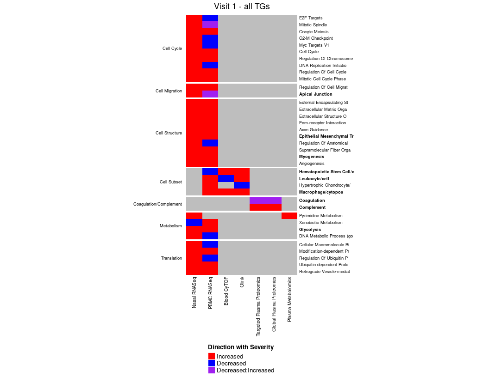

Combine Sup Table and extract overlap at Visit 1
================
Slim Fourati, Jingjing Qi, Naresh Doni Jayavelu
08 June, 2023

# Load required packages

``` r
suppressPackageStartupMessages(library(package = "knitr"))
suppressPackageStartupMessages(library(package = "readxl"))
suppressPackageStartupMessages(library(package = "fuzzyjoin"))
suppressPackageStartupMessages(library(package = "igraph"))
suppressPackageStartupMessages(library(package = "ComplexHeatmap"))
suppressPackageStartupMessages(library(package = "circlize"))
suppressPackageStartupMessages(library(package = "RColorBrewer"))
suppressPackageStartupMessages(library(package = "tidyverse"))
```

``` r
out_dir <- "../output/"
opts_chunk$set(tidy = FALSE, fig.path = out_dir)
#knitr::opts_chunk$set(dev = 'svg')
```

# Read supplemental tables

two data.frame will created, resTabDF with the results of the regression
analysis and annotTabDF with the  
annotation of each WGCNA module

``` r
supTabDir <- "../input_suppl_files/"

supTabFiles <- list.files(path = supTabDir, full.names = TRUE)
supTabFiles <- grep(pattern = "EA_", supTabFiles, value = TRUE, invert = TRUE)

lookup <- c("Module (or Feature)" = "Module")

# compile results
resTabDF <- NULL
for (supTabFile in supTabFiles) {
  # print(basename(supTabFile))
  sheetName <- excel_sheets(path = supTabFile) %>%
    grep(pattern = "assoc|result", ignore.case = TRUE, value = TRUE)
  read_excel(path = supTabFile, sheet = sheetName, skip = 1) %>%
    dplyr::rename(dplyr::any_of(lookup)) %>% # rename column Module to 'Module (or Feature)'
    plyr::rbind.fill(resTabDF, .) -> resTabDF # rbind and fill missing 'Q value' column
}

message("header of resTabDF:")
```

    ## header of resTabDF:

``` r
kable(head(resTabDF))
```

| Module (or Feature) | Analysis                   |   P value | Direction | Q value |
|:--------------------|:---------------------------|----------:|:----------|--------:|
| NasalRNAseq\_mod3   | Visit 1 analysis - overall | 0.0354964 | Severe    |      NA |
| NasalRNAseq\_mod5   | Visit 1 analysis - overall | 0.0203147 | Mild      |      NA |
| NasalRNAseq\_mod7   | Visit 1 analysis - overall | 0.0005953 | Severe    |      NA |
| NasalRNAseq\_mod2   | Visit 1 analysis - 1\|4    | 0.0096400 | Severe    |      NA |
| NasalRNAseq\_mod2   | Visit 1 analysis - 2\|4    | 0.0212564 | Severe    |      NA |
| NasalRNAseq\_mod2   | Visit 1 analysis - 3\|4    | 0.0418612 | Severe    |      NA |

``` r
# compile annotation
annotTabDF <- NULL
for (supTabFile in supTabFiles) {
  # print(basename(supTabFile))
  sheetName <- excel_sheets(path = supTabFile) %>%
    grep(pattern = "annot", ignore.case = TRUE, value = TRUE)
  if(length(sheetName) > 0) {
    # PBMC annot is not formatted like other files (no title line)
    skipFirstLine <- any(grepl(pattern = "Table", 
                               read_excel(path         = supTabFile, 
                                          sheet        = sheetName, 
                                          n_max        = 1, 
                                          col_names    = FALSE,
                                          .name_repair = make.unique)))
    annotTabTemp <- read_excel(path = supTabFile, sheet = sheetName, skip = as.numeric(skipFirstLine)) %>%
      dplyr::rename(dplyr::any_of(c("Module" = "module_name")))
    # Except for Olink, none of the assay included the short name of the modules in the supplementary annotation
    # Each module will be annotate based on the top pathways enriched in that modules
    if (!("Resource ID" %in% names(annotTabTemp))) {
      annotTabTemp <- annotTabTemp %>%
        dplyr::rename(dplyr::any_of(c("Resource ID" = "Term",
                                      "Resource ID" = "Short Name",
                                      "Resource ID" = "ID_HALLMARK"))) # rename column Module to 'Module (or Feature)'  
    }
    if (!("P.value" %in% names(annotTabTemp))) {
      annotTabTemp <- annotTabTemp %>%
        dplyr::rename(dplyr::any_of(c("P.value" = "Adjusted.P.value",
                                      "P.value" = "Raw p",
                                      "P.value" = "P value",
                                      "P.value" = "pvalue")))
    }
    annotTabTemp %>%
      filter(`P.value` <= 0.05) %>%
      select(Module, `Resource ID`, `P.value`) %>%
      rbind(annotTabDF, .) -> annotTabDF
  }
}

message("header of annotTabDF:")
```

    ## header of annotTabDF:

``` r
kable(head(annotTabDF))
```

| Module            | Resource ID                                         |   P.value |
|:------------------|:----------------------------------------------------|----------:|
| NasalRNAseq\_mod0 | negative regulation of wound healing (<GO:0061045>) | 0.0396530 |
| NasalRNAseq\_mod0 | chemical synaptic transmission (<GO:0007268>)       | 0.0484737 |
| NasalRNAseq\_mod0 | negative regulation of coagulation (<GO:0050819>)   | 0.0484737 |
| NasalRNAseq\_mod0 | Neuroactive ligand-receptor interaction             | 0.0000018 |
| NasalRNAseq\_mod0 | Complement and coagulation cascades                 | 0.0012618 |
| NasalRNAseq\_mod0 | Retinol metabolism                                  | 0.0048118 |

# Identify common annotation-across assay

``` r
### PLEASE MAKE SURE TO SELECT THE SUBSET OF ANALYSIS YOU ARE ASSIGNED HERE
resTabVisit1Overall <- resTabDF %>%
  filter(grepl(pattern = "Visit 1.+overall", Analysis) & `P value` <= 0.05)

# proteomic are missing annotation currently
assayLS <- c("NasalRNAseq", "Olink", "plasma_proteomics_targeted", "plasma_proteomics_Global_dda", 
             "globalmet.globalmet", "PBMC")

# for each pair of assay assess overlap using fuzzy matching
assayCombMat <- combn(assayLS, 2)
transAssayDF <- NULL
for (i in 1:ncol(assayCombMat)) {
  assay1 <- assayCombMat[1, i]
  assay2 <- assayCombMat[2, i]
  assay1ResTab <- filter(resTabVisit1Overall, grepl(pattern = assay1, `Module (or Feature)`)) %>%
    merge(y = annotTabDF, by.x = "Module (or Feature)", by.y = "Module")

  assay2ResTab <- filter(resTabVisit1Overall, grepl(pattern = assay2, `Module (or Feature)`)) %>%
    merge(y = annotTabDF, by.x = "Module (or Feature)", by.y = "Module")

  # perform fuzzy matching left join
  stringdist_join(assay1ResTab, 
                  assay2ResTab, 
                  by           = "Resource ID", # match based on pathway name
                  mode         = "left", # use left join
                  method       = "jw", # use jw distance metric
                  max_dist     = 99, 
                  distance_col = "dist") %>%
  group_by(`Module (or Feature).x`) %>%
  slice_min(order_by=dist, n=1) %>%
  select(`Module (or Feature).x`, `Module (or Feature).y`, `Resource ID.x`, `Resource ID.y`, dist, `Direction.x`, `Direction.y`) %>%
  rbind(transAssayDF, .) -> transAssayDF
}
kable(head(transAssayDF))
```

| Module (or Feature).x | Module (or Feature).y             | Resource ID.x                                                            | Resource ID.y                          |      dist | Direction.x | Direction.y |
|:----------------------|:----------------------------------|:-------------------------------------------------------------------------|:---------------------------------------|----------:|:------------|:------------|
| NasalRNAseq\_mod3     | Olink\_mod2                       | cell-cell adhesion via plasma-membrane adhesion molecules (<GO:0098742>) | endothelial cell of vascular tree/cell | 0.3412622 | Severe      | Severe      |
| NasalRNAseq\_mod5     | Olink\_mod2                       | Xenobiotic Metabolism                                                    | dendritic cell/cytoNeg                 | 0.3708514 | Mild        | Severe      |
| NasalRNAseq\_mod7     | Olink\_mod2                       | Cell cycle                                                               | fat cell/cell                          | 0.3407051 | Severe      | Severe      |
| NasalRNAseq\_mod3     | plasma\_proteomics\_targeted.mod1 | axonogenesis (<GO:0007409>)                                              | COAGULATION                            | 0.5793939 | Severe      | Mild        |
| NasalRNAseq\_mod3     | plasma\_proteomics\_targeted.mod3 | axonogenesis (<GO:0007409>)                                              | COAGULATION                            | 0.5793939 | Severe      | Severe      |
| NasalRNAseq\_mod5     | plasma\_proteomics\_targeted.mod1 | KRAS Signaling Dn                                                        | COAGULATION                            | 0.6167558 | Mild        | Mild        |

# Identify common pathways across assays

``` r
# MANUALLY FILTER transAssayDF TO REMOVE FALSE MATCHES
transAssayFilterDF <- transAssayDF[c(14:57, 78:86), ]

edgeDF <- transAssayFilterDF %>%
  select(-`Resource ID.y`, -dist) %>%
  rowid_to_column() %>%
  pivot_longer(cols = -c(`Resource ID.x`, rowid), names_to = c("name", "coord"), names_pattern = "(.*)\\.([xy])") %>%
  pivot_wider(names_from = name, values_from = value) %>%
  mutate(assay = gsub(pattern = ".mod.+$", replacement = "", `Module (or Feature)`)) %>%
  select(assay, `Resource ID.x`, Direction) %>%
  distinct()
# append CyTOF
assayLS <- c(assayLS, "Bld.CyTOF")
edgeDF <- rbind(edgeDF, c("Bld.CyTOF", "hematopoietic stem cell/cytoNeg", "Severe"),
                          c("Bld.CyTOF", "macrophage/cytoPos", "Severe"),
                          c("Bld.CyTOF", "leukocyte/cell", "Mild"))

# PUT THE LIST OF PATHWAY DESCRIBE IN THE RESULT SECTION OF THE CORE PAPER
highlighLS <- c("macrophage/cytoPos", "leukocyte/cell", "hematopoietic stem cell/cytoNeg",
                "COAGULATION",  "COMPLEMENT", "Epithelial Mesenchymal Transition",
                "Myogenesis", "Apical Junction", "Glycolysis")
```

# Generate heatmap

``` r
assayOrder <- c("Nasal RNASeq", "PBMC RNASeq", "Blood CyTOF",
                "Olink", "Targeted Plasma Proteomics", "Global Plasma Proteomics", "Plasma Metabolomics")
mat <- edgeDF %>%
  mutate(Direction = recode(Direction, Severe = "Increased", Mild= "Decreased"),
         assay = recode(assay, NasalRNAseq = "Nasal RNASeq", 
                        PBMC = "PBMC RNASeq",
                        globalmet.globalmet = "Plasma Metabolomics",
                        plasma_proteomics_targeted = "Targeted Plasma Proteomics",
                        plasma_proteomics_Global_dda = "Global Plasma Proteomics",
                        Bld.CyTOF = "Blood CyTOF")) %>%
  pivot_wider(names_from  = `Resource ID.x`, 
              values_from = Direction,
              values_fn   = function(x) paste(sort(x), collapse = ";")) %>%
  slice(match(assayOrder, table = .$assay)) %>%
  column_to_rownames(var = "assay")

geneset2group <- c("external encapsulating structure organization (GO:0045229)", "Cell Structure",
                   "extracellular matrix organization (GO:0030198)", "Cell Structure",
           "extracellular structure organization (GO:0043062)", "Cell Structure",
           "ECM-receptor interaction", "Cell Structure",
           "Axon guidance", "Cell Structure",
           "Epithelial Mesenchymal Transition", "Cell Structure",
           "regulation of anatomical structure morphogenesis (GO:0022603)", "Cell Structure",
           "supramolecular fiber organization (GO:0097435)", "Cell Structure",
           "Myogenesis", "Cell Structure",
           "Angiogenesis", "Cell Structure",
           "regulation of cell migration (GO:0030334)", "Cell Migration",
           "Apical Junction", "Cell Migration",
           "Xenobiotic Metabolism", "Metabolism",
           "E2F Targets", "Cell Cycle",
           "Mitotic Spindle", "Cell Cycle",
           "Oocyte meiosis", "Cell Cycle",
           "G2-M Checkpoint", "Cell Cycle",
           "Myc Targets V1", "Cell Cycle",
           "Glycolysis", "Metabolism",
           "Cell cycle", "Cell Cycle",
           "DNA metabolic process (GO:0006259)", "Metabolism",
           "cellular macromolecule biosynthetic process (GO:0034645)", "Translation",
           "regulation of chromosome organization (GO:0033044)", "Cell Cycle",
           "DNA replication initiation (GO:0006270)",  "Cell Cycle",
           "modification-dependent protein catabolic process (GO:0019941)", "Translation",
           "regulation of cell cycle (GO:0051726)", "Cell Cycle",
           "mitotic cell cycle phase transition (GO:0044772)", "Cell Cycle",
           "regulation of ubiquitin protein ligase activity (GO:1904666)", "Translation",
           "ubiquitin-dependent protein catabolic process (GO:0006511)", "Translation",
           "retrograde vesicle-mediated transport, Golgi to endoplasmic reticulum (GO:0006890)", "Translation",
           "hematopoietic stem cell/cytoNeg", "Cell Subset",
           "leukocyte/cell", "Cell Subset",
           "hypertrophic chondrocyte/cytoNeg", "Cell Subset",
           "macrophage/cytoPos", "Cell Subset",
           "COAGULATION",  "Coagulation/Complement",
           "COMPLEMENT",  "Coagulation/Complement",
           "Pyrimidine metabolism" , "Metabolism") %>%
  matrix(nrow = 2) %>%
  t() %>%
  as.data.frame() %>%
  column_to_rownames(var = "V1") %>%
  `colnames<-`("Group")
ht <- Heatmap(matrix        = t(mat),
        col           = list(Increased = "red", Decreased= "blue", "Decreased;Increased" = "purple"),
        row_split     = geneset2group[colnames(mat), "Group"],
        name          = "Direction with Severity",
        heatmap_width = unit(5, units = "in"), 
        row_title_rot = 0,
        row_title_gp = gpar(fontsize = 7),
        row_names_gp = gpar(fontsize = 7, fontface = ifelse(test = colnames(mat) %in% highlighLS,
                                                            yes  = 2,
                                                            no   = 1)),
        column_names_gp = gpar(fontsize = 7.5),
        row_labels = gsub(pattern = "(^|[[:space:]])([[:alpha:]])", "\\1\\U\\2", 
                          tolower(substring(colnames(mat), 1, 25)),
                          perl=TRUE) %>%
                    gsub(pattern = "(E2f|Dna|G2-m)", replace = "\\U\\1", perl = TRUE),
        column_title = "Visit 1 - all TGs")
draw(ht, heatmap_legend_side = "bottom")
```

<!-- -->
