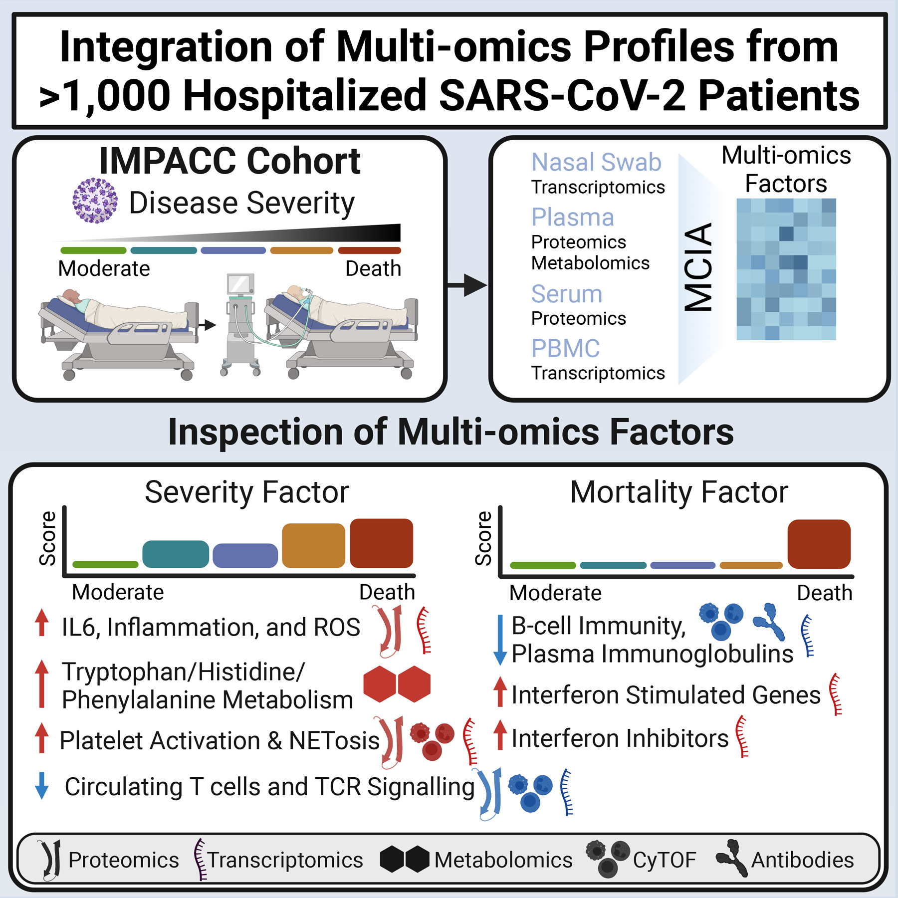

# Integrated longitudinal multiomics study identifies immune programs associated with acute COVID-19 severity and mortality

---

This repository consists of code used for the analysis, figures and tables published in the article:

Jeremy P. Gygi, Cole Maguire, Ravi K. Patel, Pramod Shinde, Anna Konstorum, Casey P. Shannon, Leqi Xu, Annmarie Hoch, Naresh Doni Jayavelu, Elias K. Haddad, IMPACC Network, Elaine F. Reed, Monica Kraft, Grace A. McComsey, Jordan P. Metcalf, Al Ozonoff, Denise Esserman, Charles B. Cairns, Nadine Rouphael, Steven E. Bosinger, Seunghee Kim-Schulze, Florian Krammer, Lindsey B. Rosen, Harm van Bakel, Michael Wilson, Walter L. Eckalbar, Holden T. Maecker, Charles R. Langelier, Hanno Steen, Matthew C. Altman, Ruth R. Montgomery, Ofer Levy, Esther Melamed, Bali Pulendran, Joann Diray-Arce, Kinga K. Smolen, Gabriela K. Fragiadakis, Patrice M. Becker, Rafick P. Sekaly, Lauren I.R. Ehrlich, Slim Fourati, Bjoern Peters, Steven H. Kleinstein, and Leying Guan. **"Integrated longitudinal multiomics study identifies immune programs associated with acute COVID-19 severity and mortality".** The Journal of
Clinical Investigation (2024).

Manuscript with supplemental figures can be downloaded [here](JCI link to come).

 

## Instructions

Please use the table in the [Figures.Tables_Code_Key.pdf](Figures.Tables_Code_Key.pdf) file to determine the code used for specific figures and tables.

 

<!---
### Prerequisites:
* Computable matrices from [ImmPort (ID:SDY1760)](https://www.immport.org/shared/study/SDY1760)

 

### Usage instructions:
1. Download the raw and processed data files from ImmPort (ID:SDY1760), decompress the data and specify the absolute path of the _processed data_ folder, containing assay directories (e.g. bld-cytof, metabolomics, etc.), in `0.Codebase/config.txt`. 
For example: 
    1. place the processed data in `/path/of/your/choosing/processed-data` and the raw data in `/path/of/your/choosing/raw-data`, where `/path/of/your/choosing/` is any path on your system where you want to save the ImmPort data. 
    2. Specify `/path/of/your/choosing/processed-data` in `Codebase/config.txt` as a value of `data_base_dir` key.
2. Use the Rmarkdown file in a given Figure directory for reproducing the figures, for example [4.figures_and_tables/Fig2/src/Fig2.Rmd](4.figures_and_tables/Fig2/src/Fig2.Rmd). These Rmarkdowns are expected to run the whole analysis pipeline for the assay once the data and databases are set up correctly.

 
--->

### Terms of Use

By using this software, you agree this software is to be used for research purposes only. Any presentation of data analysis using the software will acknowledge the software according to the guidelines below. 

Primary author(s): Jeremy P. Gygi (Yale University), Cole Maguire (University of Texas, Austin), Ravi K. Patel (University of California San Francisco), Leying Guan (Yale University)

Organizational contact information: Leying Guan (Yale University)

Date of release: Apr 06, 2024

Version: 1.0 

License details: GNU AFFERO GENERAL PUBLIC LICENSE (see the [LICENSE file](LICENSE))

Description: scripts used to generate figures and tables in the above publication

 

### Disclaimer

<!--- A review of this code has been conducted, no critical errors exist, and to the best of the authors knowledge, no local system configuration details, and no passwords or keys included in this code. ---> This open source software comes as is with absolutely no warranty.

