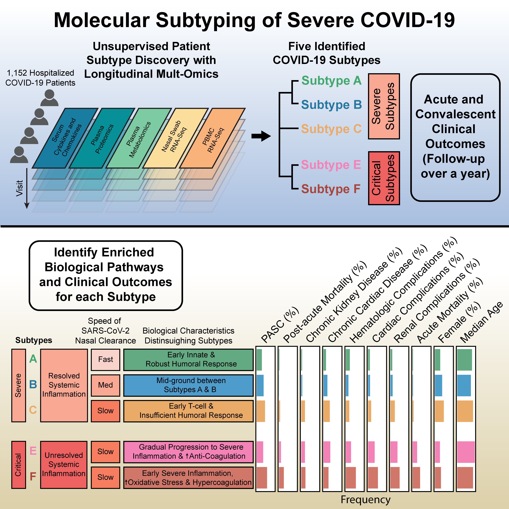

# Unraveling SARS-CoV-2 Host-Response Heterogeneity through Longitudinal Molecular Subtyping

---

 

## Instructions

### Data Preprocessing

- `mofa_imputation`: Complete assay imputation for multi-omics assays via MOFA.

- `mcia_factor_construction`: Low-dimensional multi-omics factors generation via MCIA.

- `subtype_construction`: Subtype construction using hierarchical clustering.

### Figures and Tables

Scripts used to generate figures and tables.

 

 

## Term of use

License details: GNU AFFERO GENERAL PUBLIC LICENSE (see the [LICENSE file](LICENSE))