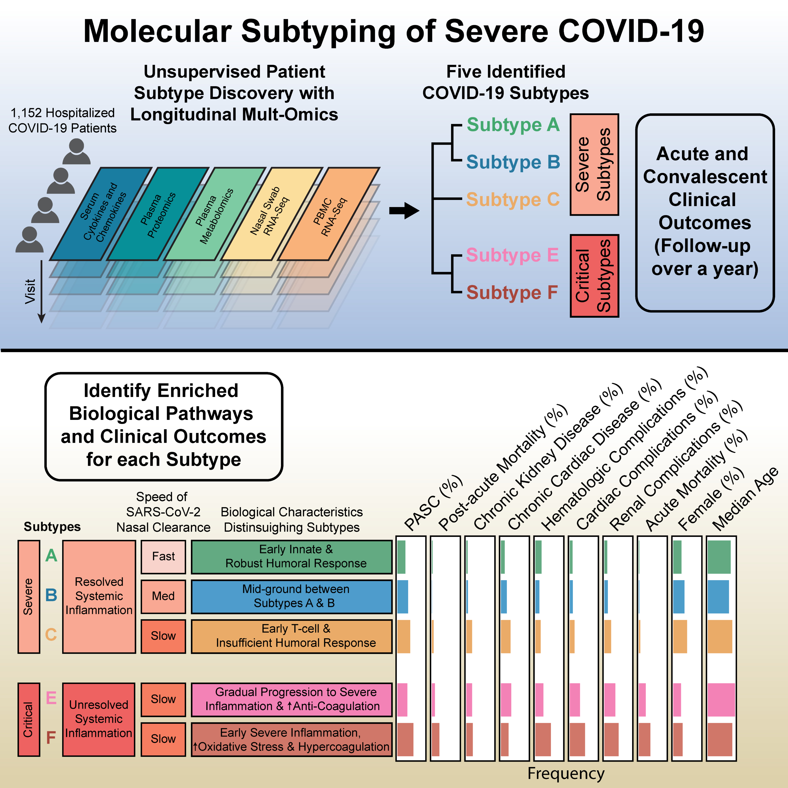

# Unraveling SARS-CoV-2 Host-Response Heterogeneity through Longitudinal Molecular Subtyping

---



</br>

## Instructions

### Data availability

Data used in this study is available at ImmPort Shared Data under the accession number [SDY1760](https://www.immport.org/shared/search?text=SDY1760%20) and in the NLM's
769 Database of Genotypes and Phenotypes (dbGaP) under the accession number [phs002686.v2.p2](https://www.ncbi.nlm.nih.gov/projects/gap/cgi-bin/study.cgi?study_id=phs002686.v2.p2). Note this is a controlled database with approval from NIAID required (please follow the instructions as you try to access the data). However, Immport has agreed to provide special access to reviewers of this article upon request by the IMPACC team.

### Preparation

|Source File| Description | Input | Output |
|:-----|:-----|:-------|:-------|
| [data_preprocessing.Rmd](data_preprocessing/data_preprocessing.Rmd) | Data preprocessing and complete assay imputation for multi-omics assays via MOFA | Raw data | (1) Raw data environment <br> (2) Organized data: multi-omics datasets with and without imputation, and clinical data |
| [factor_construction.Rmd](factor_construction/factor_construction.Rmd) | Low-dimensional multi-omics factors generation via MCIA and enrichment of top factors (Factors 1, 2, 3, and 10) using the mhg test | (1) Raw data environment <br> (2) Organized data | (1) MCIA factors: factor scores, factor evaluation such as projection coefficients, projection p-values, and variance explained <br> (2) Enrichment results |
| [subtype_construction.Rmd](subtype_construction/subtype_construction.Rmd) | Subtype construction using hierarchical clustering | (1) Organized data <br> (2) MCIA factors | (1) Subtype assignment <br> (2) Aligned clinical data |

### Figures and Tables

Scripts used to generate figures and tables.

| Figure |Source File| Output |
|:-----|:-----|:-----|
| Abstract | [Abstract.Rmd](figures_and_tables/Abstract/src/Abstract.Rmd) | [Abstract](figures_and_tables/Abstract/output/Abstract.jpg) |
| Figure 1 | [Fig1.Rmd](figures_and_tables/Fig1/src/Fig1.Rmd) | [Fig1](figures_and_tables/Fig1/output) |
| Figure 2 | [Fig2.Rmd](figures_and_tables/Fig2/src/Fig2.Rmd) | [Fig2](figures_and_tables/Fig2/output) |
| Figure 3 | [Fig3.Rmd](figures_and_tables/Fig3/src/Fig3.Rmd) | [Fig3](figures_and_tables/Fig3/output) |
| Figure 4 | [Fig4.Rmd](figures_and_tables/Fig4/src/Fig4.Rmd) | [Fig4](figures_and_tables/Fig4/output) |
| Figure 5 | [Fig5.Rmd](figures_and_tables/Fig5/src/Fig5.Rmd) | [Fig5](figures_and_tables/Fig5/output) |
| Figure 6 | [Fig6.Rmd](figures_and_tables/Fig6/src) | [Fig6](figures_and_tables/Fig6/output) |
| Extended Data Figure 1 | [Extended_Data_Fig1.Rmd](figures_and_tables/Extended_Data_Fig1/src) | [Extended Data Fig1](figures_and_tables/Extended_Data_Fig1/output) |
| Extended Data Figure 2 | [Extended_Data_Fig2.Rmd](figures_and_tables/Extended_Data_Fig2/src) | [Extended Data Fig2](figures_and_tables/Extended_Data_Fig2/output) |
| Extended Data Figure 3 | [Extended_Data_Fig3.Rmd](figures_and_tables/Extended_Data_Fig3/src) | [Extended Data Fig3](figures_and_tables/Extended_Data_Fig3/output) |
| Extended Data Figure 4 | [Extended_Data_Fig4.Rmd](figures_and_tables/Extended_Data_Fig4/src) | [Extended Data Fig4](figures_and_tables/Extended_Data_Fig4/output) |
| Extended Data Figure 5 | [Extended_Data_Fig5.Rmd](figures_and_tables/Extended_Data_Fig5/src) | [Extended Data Fig5](figures_and_tables/Extended_Data_Fig5/output) |
| Extended Data Figure 6 | [Extended_Data_Fig6.Rmd](figures_and_tables/Extended_Data_Fig6/src) | [Extended Data Fig6](figures_and_tables/Extended_Data_Fig6/output) |
| Extended Data Figure 7 | [Extended_Data_Fig7.Rmd](figures_and_tables/Extended_Data_Fig7/src) | [Extended Data Fig7](figures_and_tables/Extended_Data_Fig7/output) |
| Extended Data Figure 8 | [Extended_Data_Fig8.Rmd](figures_and_tables/Extended_Data_Fig8/src) | [Extended Data Fig8](figures_and_tables/Extended_Data_Fig8/output) |
| Extended Data Figure 9 | [Extended_Data_Fig9.Rmd](figures_and_tables/Extended_Data_Fig9/src) | [Extended Data Fig9](figures_and_tables/Extended_Data_Fig9/output) |
| Extended Data Figure 10 | [Extended_Data_Fig10.Rmd](figures_and_tables/Extended_Data_Fig10/src) | [Extended Data Fig10](figures_and_tables/Extended_Data_Fig10/output) |
| Extended Data Figure 11 | [Extended_Data_Fig11.Rmd](figures_and_tables/Extended_Data_Fig11/src/Extended_Data_Fig11.Rmd) | [Extended Data Fig11](figures_and_tables/Extended_Data_Fig11/output) |
| Extended Data Figure 12 | [Extended_Data_Fig12.Rmd](figures_and_tables/Extended_Data_Fig12/src) | [Extended Data Fig12](figures_and_tables/Extended_Data_Fig12/output) |
| Extended Data Figure 13 | [Extended_Data_Fig13.Rmd](figures_and_tables/Extended_Data_Fig13/src) | [Extended Data Fig13](figures_and_tables/Extended_Data_Fig13/output) |
| Supplementary Figure 1 | [Supplementary_Fig1.Rmd](figures_and_tables/Supplementary_Fig1/src/Supplementary_Fig1.Rmd) | [Supplementary Fig1](figures_and_tables/Supplementary_Fig1/output/Supplementary_Fig1.pdf) |

</br>

## Term of use

License details: MIT License (see the [LICENSE file](LICENSE))

</br>

## Required software

The codes were run in R v4.2.3. Below is the sessionInfo():

```
R version 4.2.3 (2023-03-15)
Platform: x86_64-pc-linux-gnu (64-bit)
Running under: Ubuntu 24.04.1 LTS

Matrix products: default
BLAS:   /usr/lib/x86_64-linux-gnu/openblas-pthread/libblas.so.3
LAPACK: /usr/lib/x86_64-linux-gnu/openblas-pthread/libopenblasp-r0.3.26.so

locale:
 [1] LC_CTYPE=C.UTF-8       LC_NUMERIC=C           LC_TIME=C.UTF-8       
 [4] LC_COLLATE=C.UTF-8     LC_MONETARY=C.UTF-8    LC_MESSAGES=C.UTF-8   
 [7] LC_PAPER=C.UTF-8       LC_NAME=C              LC_ADDRESS=C          
[10] LC_TELEPHONE=C         LC_MEASUREMENT=C.UTF-8 LC_IDENTIFICATION=C   

attached base packages:
[1] grid      splines   stats     graphics  grDevices utils     datasets  methods  
[9] base     

other attached packages:
 [1] corpcor_1.6.10        RSpectra_0.16-2       ordinalNet_2.12      
 [4] MASS_7.3-58.2         glmnet_4.1-8          R6_2.5.1             
 [7] ggsignif_0.6.4        gamm4_0.2-6           mgcv_1.8-42          
[10] lme4_1.1-35.5         qvalue_2.30.0         ComplexHeatmap_2.14.0
[13] corrr_0.4.4           gridExtra_2.3         rlang_1.1.4          
[16] RColorBrewer_1.1-3    pals_1.9              lubridate_1.9.3      
[19] forcats_1.0.0         stringr_1.5.1         purrr_1.0.2          
[22] readr_2.1.5           tidyr_1.3.1           tibble_3.2.1         
[25] tidyverse_2.0.0       fgsea_1.24.0          dplyr_1.1.4          
[28] nlme_3.1-162          survminer_0.5.0       ggpubr_0.6.0         
[31] cowplot_1.1.3         metafor_4.6-0         numDeriv_2016.8-1.1  
[34] metadat_1.2-0         Matrix_1.6-1.1        ggalt_0.4.0          
[37] GGally_2.2.1          network_1.18.2        openxlsx_4.2.7.1     
[40] ggeffects_1.7.2       ordinal_2023.12-4.1   survival_3.5-3       
[43] nnet_7.3-18           cluster_2.1.4         factoextra_1.0.7     
[46] ggplot2_3.5.1         mogsa_1.32.0          ade4_1.7-22          

loaded via a namespace (and not attached):
  [1] utf8_1.2.4             reticulate_1.40.0      tidyselect_1.2.1      
  [4] RSQLite_2.3.7          AnnotationDbi_1.60.2   BiocParallel_1.32.6   
  [7] munsell_0.5.1          codetools_0.2-19       withr_3.0.2           
 [10] colorspace_2.1-1       filelock_1.0.3         Biobase_2.58.0        
 [13] knitr_1.49             rstudioapi_0.17.1      stats4_4.2.3          
 [16] Rttf2pt1_1.3.12        MatrixGenerics_1.10.0  GenomeInfoDbData_1.2.9
 [19] KMsurv_0.1-5           pheatmap_1.0.12        bit64_4.5.2           
 [22] rhdf5_2.42.1           basilisk_1.10.2        coda_0.19-4.1         
 [25] vctrs_0.6.5            generics_0.1.3         xfun_0.49             
 [28] timechange_0.3.0       doParallel_1.0.17      GenomeInfoDb_1.34.9   
 [31] clue_0.3-66            rhdf5filters_1.10.1    DelayedArray_0.24.0   
 [34] bitops_1.0-9           cachem_1.1.0           scales_1.3.0          
 [37] gtable_0.3.6           ash_1.0-15             svd_0.5.7             
 [40] genefilter_1.80.3      GlobalOptions_0.1.2    rstatix_0.7.2         
 [43] extrafontdb_1.0        dichromat_2.0-0.1      broom_1.0.7           
 [46] reshape2_1.4.4         abind_1.4-8            backports_1.5.0       
 [49] extrafont_0.19         tools_4.2.3            statnet.common_4.10.0 
 [52] gplots_3.2.0           BiocGenerics_0.44.0    Rcpp_1.0.13-1         
 [55] plyr_1.8.9             zlibbioc_1.44.0        RCurl_1.98-1.16       
 [58] basilisk.utils_1.10.0  GetoptLong_1.0.5       S4Vectors_0.36.2      
 [61] zoo_1.8-12             ggrepel_0.9.6          magrittr_2.0.3        
 [64] data.table_1.16.2      circlize_0.4.16        matrixStats_1.4.1     
 [67] hms_1.1.3              evaluate_1.0.1         xtable_1.8-4          
 [70] XML_3.99-0.17          IRanges_2.32.0         shape_1.4.6.1         
 [73] compiler_4.2.3         maps_3.4.2.1           KernSmooth_2.23-20    
 [76] crayon_1.5.3           minqa_1.2.8            htmltools_0.5.8.1     
 [79] tzdb_0.4.0             Formula_1.2-5          DBI_1.2.3             
 [82] proj4_1.0-14           rappdirs_0.3.3         boot_1.3-28.1         
 [85] car_3.1-3              cli_3.6.3              parallel_4.2.3        
 [88] insight_0.20.5         pkgconfig_2.0.3        km.ci_0.5-6           
 [91] dir.expiry_1.6.0       foreach_1.5.2          annotate_1.76.0       
 [94] ggstats_0.7.0          XVector_0.38.0         digest_0.6.37         
 [97] graph_1.76.0           Biostrings_2.66.0      rmarkdown_2.29        
[100] fastmatch_1.1-4        survMisc_0.5.6         GSEABase_1.60.0       
[103] gtools_3.9.5           graphite_1.44.0        rjson_0.2.23          
[106] nloptr_2.1.1           jsonlite_1.8.9         lifecycle_1.0.4       
[109] Rhdf5lib_1.20.0        carData_3.0-5          mapproj_1.2.11        
[112] fansi_1.0.6            pillar_1.9.0           lattice_0.20-45       
[115] KEGGREST_1.38.0        fastmap_1.2.0          httr_1.4.7            
[118] glue_1.8.0             zip_2.3.1              png_0.1-8             
[121] iterators_1.0.14       bit_4.5.0              stringi_1.8.4         
[124] blob_1.2.4             caTools_1.18.3         memoise_2.0.1         
[127] ucminf_1.2.2           mathjaxr_1.6-0      
```
