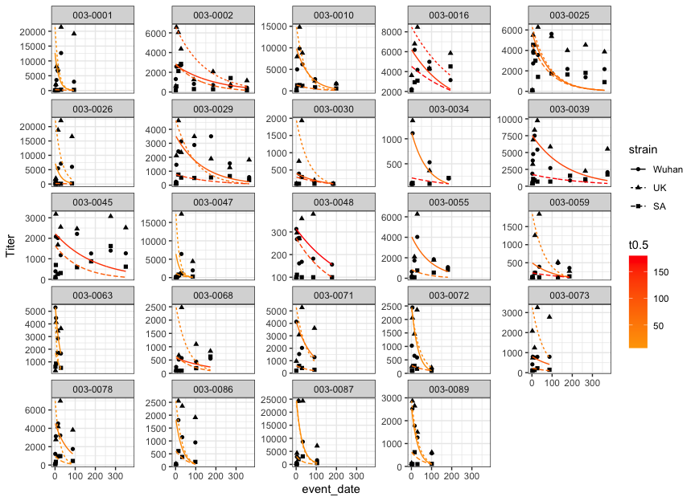

IMPACC Drexel Fig5
================
Slim FOURATI
2025-02-07

Load required packages

``` r
suppressPackageStartupMessages(library(package = "knitr"))
suppressPackageStartupMessages(library(package = "zoo"))
suppressPackageStartupMessages(library(package = "GSVA"))
suppressPackageStartupMessages(library(package = "ggalluvial"))
suppressPackageStartupMessages(library(package = "readxl"))
suppressPackageStartupMessages(library(package = "ggpubr"))
suppressPackageStartupMessages(library(package = "tidyverse"))
```

Set session options

``` r
opts_chunk$set(tidy = FALSE, fig.path = "../figure/")
workDir <- dirname(getwd())
impaccDir <- "/data"
```

Read clinical data

``` r
# clinical data
clinical_individ <- read_csv(file = file.path(impaccDir,
                                              "/clinical/current/2023-01-01-locked",
                                              "2023-01-01-impacc-clin-individ-locked.csv"))
clinical_individ_old <- read_csv(file = file.path(impaccDir,
                                                  "/clinical/legacy/2021-11-11-frozen",
                                                  "2021-11-11-impacc-clin-individ-frozen.csv"))
clinical_event <- read_csv(file = file.path(impaccDir,
                                            "clinical/current/2023-01-01-locked",
                                            "2023-01-01-impacc-clin-event-locked.csv"))
clinical_sample <- read_csv(file = file.path(impaccDir,
                                             "clinical/current/2023-01-01-locked",
                                             "2023-01-01-impacc-clin-sample-locked.csv"))
clinical_data <- merge(x   = clinical_sample,
                       y   = clinical_event,
                       by  = c("event_id", "participant_id"),
                       all = TRUE) %>%
  merge(y     = select(clinical_individ, 
                       participant_type, 
                       participant_id, 
                       enrollment_site, 
                       admit_age, sex), 
        by    = "participant_id",
        all.x = TRUE) %>%
  merge(y     = distinct(select(clinical_individ_old, participant_id, trajectory_group)),
        by    = "participant_id",
        all.x = TRUE) %>%
  mutate(discretized_admit_age_quantile = case_when(admit_age >= 18 & admit_age <= 35 ~ "[18,35]",
                                                    admit_age >= 36 & admit_age <= 51 ~ "[36,51]",
                                                    admit_age >= 52 & admit_age <= 66 ~ "[52,66]",
                                                    admit_age >= 67 & admit_age <= 81 ~ "[67,81]",
                                                    admit_age >= 82 & admit_age <= 96 ~ "[82,96]"),
         discretized_admit_age_quantile = factor(discretized_admit_age_quantile,
                                                 levels = c("[18,35]", 
                                                            "[36,51]", 
                                                            "[52,66]", 
                                                            "[67,81]", 
                                                            "[82,96]")))
```

Read site-specific data

``` r
inputFile <- file.path(workDir,
                       "input",
                       "2024_11_01.IMPACC..xlsx")
cNames <- read_excel(path = inputFile, n_max = 2, col_names = FALSE) %>%
  as.data.frame()
cNames[1, ] <- na.locf(unlist(cNames[1, ]))
cNames <- apply(cNames, MARGIN = 2, FUN = function(x) paste(setdiff(x, NA), collapse = "."))
outcomeDF <- read_excel(path = inputFile, skip = 2, col_names = cNames) %>%
  mutate(`Patient ID` = gsub(pattern = "3-0", replacement = "3-00", `Patient ID`))
```

Read serum Ab data

``` r
serum_rbd_abtiters_counts <- read_csv(file = file.path(impaccDir, "serum-rbd-abtiters/current/serum-rbd-abtiters-Counts.csv")) %>%
  column_to_rownames(var = "sample_id")
```

Read Olink data

``` r
serum_olink_counts <- read_csv(file = file.path(impaccDir, "serum-olink/current/Olink-Counts.csv")) %>%
  column_to_rownames(var = "...1")
```

Read nasal viral load

``` r
nasal_viralload_counts <- read_csv(file = file.path(impaccDir, "nasal-viralload/current/nasal-viralload-Counts.csv")) %>%
  column_to_rownames(var = "sample_id")
```

Read PBMC RNAseq

``` r
pbmc_transcriptomics_counts <- read_csv(file = file.path(impaccDir, 
                                                         "pbmc-transcriptomics/current/pbmc-transcriptomics-Counts.csv")) %>%
  column_to_rownames(var = "sample_id")
pbmc_transcriptomics_rows <- read_csv(file = file.path(impaccDir,
                                                       "pbmc-transcriptomics/current/pbmc-transcriptomics-RowFeature.csv"),
                                      comment = "#")

# voom
pbmcExprsMat <-  t(pbmc_transcriptomics_counts)
pbmcVoomElist <- voom(counts = pbmcExprsMat)

# convert ensembl id to gene_name
pbmcGeneIdMat <- pbmcVoomElist$E
varDF <- apply(pbmcGeneIdMat, MARGIN = 1, FUN = var) %>%
  data.frame(sigma2 = .) %>%
  rownames_to_column(var = "gene_id") %>%
  merge(y = dplyr::select(pbmc_transcriptomics_rows, 
                          gene_name, 
                          "gene_id"),
        by = "gene_id") %>%
  arrange(desc(sigma2)) %>%
  filter(!duplicated(gene_name))
pbmcGeneMat <- pbmcGeneIdMat %>%
  as.data.frame() %>%
  rownames_to_column(var = "gene_id") %>%
  merge(y = dplyr::select(varDF, -sigma2),
        by = "gene_id") %>%
  dplyr::select(-gene_id) %>%
  column_to_rownames(var = "gene_name") 

# filter on Visit 1/Drexel to accelerate GSVA
pbmcFData <- clinical_data[match(colnames(pbmcGeneMat), table = clinical_data$sample_id), ]
pbmcGeneMat <- pbmcGeneMat[, pbmcFData$event_type %in% "Visit 1" & 
                             pbmcFData$enrollment_site %in% "Drexel/Tower Health"]

hLS <- fgsea::gmtPathways(gmt.file = file.path(impaccDir, "resources/databases/MSigDB/current/msigdb.v7.3.symbols.gmt"))
hLS <- hLS[grep(pattern = "HALLMARK", names(hLS))]

pbmcGSVA <- gsva(expr = as.matrix(pbmcGeneMat), gset.idx.list = hLS)

save(pbmcGSVA, file = file.path(workDir, "output/drexel.pbmc.gsva.RData"))
```

Extract luminex data from site specific data

``` r
luminexDF <- outcomeDF[, c(1, seq(from = which(names(outcomeDF) %in% "Luminex V1")+1, to = which(names(outcomeDF) %in% "V1.Wuhan")-1))]

luminexFData <- data.frame(feature = colnames(luminexDF)[-1]) %>%
  mutate(gene_symbol = gsub(pattern = " ", replacement = "", feature),
         gene_symbol = toupper(gene_symbol),
         gene_symbol = recode(gene_symbol,
                              ENA78      = "CXCL5",
                              EOTAXIN    = "CCL11",
                              FRACTALINE = "CX3CL1",
                              GROALPHA   = "CXCL1",
                              IFNY       = "IFNG",
                              IL8        = "CXCL8",
                              ITAC       = "CXCL11",
                              MCP1       = "CCL2",
                              MCP3       = "CCL7",
                              MCSF       = "CSF1",
                              MIG        = "CXCL9",
                              MIP1B      = "CCL4",
                              MIP3A      = "CCL20",
                              NGFB       = "NGF",
                              SCF        = "KITLG",
                              TNFA       = "TNF",
                              TNFB       = "LTA",
                              TRAIL      = "TNFSF10",
                              TWEAK      = "TNFSF12"))
                              #IL12P70   = "IL12A, IL12B"
                              #IL23      = "IL23A, IL12B"

# not in Olink
setdiff(sort(luminexFData$gene_symbol), colnames(serum_olink_counts))
```

    ##  [1] "APRIL"    "BAFF"     "BLC"      "CD30"     "CD40L"    "EOTAXIN2"
    ##  [7] "EOTAXIN3" "FGF2"     "GCSF"     "GMCSF"    "IFNA"     "IL12P70" 
    ## [13] "IL15"     "IL16"     "IL21"     "IL22"     "IL23"     "IL3"     
    ## [19] "IL31"     "IL9"      "MDC"      "MIF"      "TNFRII"

Extract Flow cytometry from site specific data

``` r
fcmDF <- outcomeDF %>%
  select(`Patient ID`, contains(match = "Acute"))
```

# Fig5A

``` r
# plot neut
neutDF <- outcomeDF[, c(1, seq(from = which(names(outcomeDF) %in% "V1.Wuhan"), to = ncol(outcomeDF)))]
  
neutDF <- neutDF %>%
  pivot_longer(cols= -`Patient ID`, 
               names_to = c("event_type", "strain"), 
               names_sep = "\\.",
               values_to = "Titer") %>%
  #pivot_wider(names_from = "strain", values_from = "Titer") %>%
  mutate(event_type = gsub(pattern = "^V", replacement = "Visit ", event_type)) %>%
  merge(y = distinct(select(clinical_data, participant_id, event_type, event_date)),
        by.x = c("Patient ID", "event_type"),
        by.y = c("participant_id", "event_type")) %>%
  mutate(strain = factor(strain, levels = c("Wuhan", 
                                            "UK",
                                            "SA")))
#ggplot(data = neutDF,
#       mapping = aes(x = event_date, y = Titer)) +
#  geom_line(mapping = aes(group = `Patient ID`)) +
#  geom_point() +
#  scale_y_log10() +
#  facet_grid(rows = ~strain) +
#  theme_bw()

# append vax info
vaxDF <- clinical_data %>%
  filter(event_type %in% "Visit 10") %>%
  select(participant_id, event_date) %>%
  distinct() %>%
  merge(x = outcomeDF,
        by.x = "Patient ID",
        by.y = "participant_id") %>%
  select(`Patient ID`,
         `days since vaccination\r\n(at V10)`,
         `Vaccinated\r\n(At V10)`,
         event_date) %>%
  mutate(vax_date = event_date - `days since vaccination\r\n(at V10)`)

#merge(x = neutDF,
#      y = select(vaxDF, -event_date),
#      by = "Patient ID") %>%
#ggplot(mapping = aes(x = event_date, y = Titer)) +
#  geom_line(mapping = aes(group = `Patient ID`)) +
#  geom_point(mapping = aes(color = event_date > vax_date)) +
#  scale_y_log10() +
#  facet_wrap(facets = strain~`Vaccinated\r\n(At V10)`, labeller = label_both) +
# theme_bw()

# unvax + event_date before vax
unvaxDF <- merge(x = neutDF,
      y = select(vaxDF, -event_date),
      by = "Patient ID") %>%
  filter(`Vaccinated\r\n(At V10)` %in% "no" | event_date < vax_date) %>%
  filter(duplicated(`Patient ID`) | duplicated(`Patient ID`, fromLast = TRUE))

#ggplot(data = filter(unvaxDF, strain %in% "Wuhan" & !is.na(Titer)), 
#       mapping = aes(x = event_date, y = Titer)) +
#  geom_line(mapping = aes(group = `Patient ID`)) +
#  geom_point() +
#  scale_y_log10() +
#  facet_wrap(facets = ~`Patient ID`) +
#  theme_bw()

unvaxDF <- unvaxDF %>%
  filter(!(`Patient ID` %in% c("003-0050", "003-0084", "003-0088", "003-2004",  "003-2001",
                               "003-2010"))) %>%
  filter(!(`Patient ID` %in% c("003-0054", "003-0059", "003-2003") & event_date > 200)) %>%
  filter(!(`Patient ID` %in% c("003-0063", "003-0072", "003-0078", "003-0086", "003-2008") & 
             event_date > 100)) %>%
  filter(!(`Patient ID` %in% c("003-0089", "003-2007") &  event_date > 150))
#ggplot(data = filter(unvaxDF, !is.na(Titer)), 
#       mapping = aes(x = event_date, y = Titer)) +
#  geom_line(mapping = aes(group = interaction(`Patient ID`, strain, drop = TRUE), color = strain)) +
#  geom_point() +
#  scale_y_log10() +
#  facet_wrap(facets = ~`Patient ID`) +
#  theme_bw()

nt0.5DF <- unvaxDF %>%
  select(`Patient ID`, event_date, strain, Titer) %>%
  group_by(`Patient ID`, strain) %>%
  summarize(pt   = min(Titer),
            p0   = max(Titer),
            t    = max(event_date) - min(event_date),
            k    =  log(pt/p0)/t,
            t0.5 =  log(0.5)/k,
            .groups = "drop")

regDF <- unvaxDF %>%
  group_by(`Patient ID`, strain) %>%
  do(event_date = seq(from = min(.$event_date), max(.$event_date))) %>%
  unnest(cols = event_date) %>%
  merge(y = nt0.5DF, by = c("Patient ID", "strain")) %>%
  group_by(`Patient ID`, strain) %>%
  mutate(Titer = p0 * exp(k * (event_date-min(event_date))))

ggplot(data = filter(unvaxDF, `Patient ID` %in% nt0.5DF$`Patient ID`[complete.cases(nt0.5DF)]),
       mapping = aes(x = event_date, y = Titer)) +
  geom_point(mapping = aes(shape = strain)) +
  facet_wrap(facets = ~`Patient ID`, scale = "free_y") +
  geom_line(data = filter(regDF, `Patient ID` %in% nt0.5DF$`Patient ID`[complete.cases(nt0.5DF)]), 
            mapping = aes(group = interaction(`Patient ID`, strain, drop = TRUE), 
                                        color = t0.5,
                                        linetype = strain)) +
  scale_color_gradient(low = "orange", high = "red") +
  theme_bw()
```

<!-- -->

``` r
# olink visit 1 vs neut t0.5
rhoTemp <- serum_olink_counts %>%
  rownames_to_column(var = "sample_id") %>%
  pivot_longer(cols      = -sample_id, 
               names_to  = "olink.feature",
               values_to = "olink.value") %>%
  merge(y = clinical_data, by = "sample_id") %>%
  filter(event_type %in% "Visit 1") %>%
  merge(y = select(nt0.5DF, `Patient ID`, strain, `t0.5`),
        by.x = "participant_id",
        by.y = "Patient ID") %>%
  setNames(nm = make.names(names(.))) %>%
  group_by(olink.feature, strain) %>%
  do(rho = cor.test(formula = ~olink.value+`t0.5`,
                    data    = .,
                    method  = "spearman")$estimate,
     p   = cor.test(formula = ~olink.value+`t0.5`,
                    data    = .,
                    method  = "spearman")$p.value) %>%
  mutate_if(is.list, unlist)

rhoDF <- filter(rhoTemp, p <= 0.05) %>%
  mutate(outcome = paste0("t0.5.", strain)) %>%
  select(-strain) %>%
  pivot_longer(cols = -c("rho", "p", "outcome")) 

# luminex visit 1 vs neut t0.5
rhoTemp <- luminexDF %>%
  mutate(MIF = gsub(pattern = " .+", replacement = "", MIF),
         MIF = as.numeric(MIF)) %>%
  pivot_longer(cols      = -`Patient ID`, 
               names_to  = "luminex.feature", 
               values_to = "luminex.value") %>%
  merge(y = select(nt0.5DF, `Patient ID`, strain, `t0.5`),
        by = "Patient ID") %>%
  setNames(nm = make.names(names(.))) %>%
  group_by(luminex.feature, strain) %>%
  do(rho = cor.test(formula = ~luminex.value+`t0.5`,
                    data    = .,
                    method  = "spearman")$estimate,
     p   = cor.test(formula = ~luminex.value+`t0.5`,
                    data    = .,
                    method  = "spearman")$p.value) %>%
  mutate_if(is.list, unlist)

filter(rhoTemp, p <= 0.05) %>%
  mutate(outcome = paste0("t0.5.", strain)) %>%
  select(-strain) %>%
  pivot_longer(cols = -c("rho", "p", "outcome")) %>%
  select(all_of(names(rhoDF))) %>%
  rbind(rhoDF, .) -> rhoDF

# vl visit 1 vs neut t0.5
rhoTemp <- nasal_viralload_counts %>%
  rownames_to_column(var = "sample_id") %>%
  mutate(`-N1_CT` = -1 * N1_CT) %>%
  select(sample_id, `-N1_CT`) %>%
  pivot_longer(cols      = -sample_id, 
               names_to  = "vl.feature",
               values_to = "vl.value") %>%
  merge(y = clinical_data, by = "sample_id") %>%
  filter(event_type %in% "Visit 1") %>%
  merge(y = select(nt0.5DF, `Patient ID`, strain, `t0.5`),
        by.x = "participant_id",
        by.y = "Patient ID") %>%
  setNames(nm = make.names(names(.))) %>%
  group_by(vl.feature, strain) %>%
  do(rho = cor.test(formula = ~vl.value+`t0.5`,
                    data    = .,
                    method  = "spearman")$estimate,
     p   = cor.test(formula = ~vl.value+`t0.5`,
                    data    = .,
                    method  = "spearman")$p.value) %>%
  mutate_if(is.list, unlist)

filter(rhoTemp, p <= 0.05)
```

    ## # A tibble: 0 × 4
    ## # Rowwise: 
    ## # ℹ 4 variables: vl.feature <chr>, strain <fct>, rho <dbl>, p <dbl>

``` r
# fcm visit 1 vs neut t0.5
rhoTemp <- fcmDF %>%
  pivot_longer(cols      = -`Patient ID`, 
               names_to  = "fcm.feature", 
               values_to = "fcm.value") %>%
  merge(y = select(nt0.5DF, `Patient ID`, strain, `t0.5`),
        by = "Patient ID") %>%
  setNames(nm = make.names(names(.))) %>%
  group_by(fcm.feature, strain) %>%
  do(rho = cor.test(formula = ~fcm.value+`t0.5`,
                    data    = .,
                    method  = "spearman")$estimate,
     p   = cor.test(formula = ~fcm.value+`t0.5`,
                    data    = .,
                    method  = "spearman")$p.value) %>%
  mutate_if(is.list, unlist)

filter(rhoTemp, p <= 0.05) %>%
  mutate(outcome = paste0("t0.5.", strain)) %>%
  select(-strain) %>%
  pivot_longer(cols = -c("rho", "p", "outcome")) %>%
  select(all_of(names(rhoDF))) %>%
  rbind(rhoDF, .) -> rhoDF

# pgx visit 1 vs neut t0.5
rhoTemp <- t(pbmcGSVA) %>%
  as.data.frame() %>%
  rownames_to_column(var = "sample_id") %>%
  pivot_longer(cols      = -sample_id, 
               names_to  = "pgx.feature",
               values_to = "pgx.value") %>%
  merge(y = clinical_data, by = "sample_id") %>%
  filter(event_type %in% "Visit 1") %>%
  merge(y = select(nt0.5DF, `Patient ID`, strain, `t0.5`),
         by.x = "participant_id",
        by.y = "Patient ID") %>%
  setNames(nm = make.names(names(.))) %>%
  group_by(pgx.feature, strain) %>%
  do(rho = cor.test(formula = ~pgx.value+`t0.5`,
                    data    = .,
                    method  = "spearman")$estimate,
     p   = cor.test(formula = ~pgx.value+`t0.5`,
                    data    = .,
                    method  = "spearman")$p.value) %>%
  mutate_if(is.list, unlist)

filter(rhoTemp, p <= 0.05)
```

    ## # A tibble: 0 × 4
    ## # Rowwise: 
    ## # ℹ 4 variables: pgx.feature <chr>, strain <fct>, rho <dbl>, p <dbl>

``` r
# Fig5B
rhoDF %>%
  mutate(value = gsub(pattern = "...Freq.+", replacement = "", value)) %>%
  select(outcome, name, value, rho, p) %>%
  kable()
```

| outcome    | name            | value                        |        rho |         p |
|:-----------|:----------------|:-----------------------------|-----------:|----------:|
| t0.5.Wuhan | olink.feature   | CCL23                        | -0.4573913 | 0.0257757 |
| t0.5.UK    | olink.feature   | CCL8                         |  0.5754386 | 0.0112553 |
| t0.5.SA    | olink.feature   | CD5                          |  0.4278261 | 0.0381621 |
| t0.5.Wuhan | olink.feature   | HGF                          | -0.5017391 | 0.0134926 |
| t0.5.SA    | olink.feature   | MMP10                        |  0.4469565 | 0.0297048 |
| t0.5.Wuhan | olink.feature   | SIRT2                        | -0.4286957 | 0.0377398 |
| t0.5.SA    | olink.feature   | TNFSF10                      |  0.4739130 | 0.0204281 |
| t0.5.SA    | luminex.feature | ENA 78                       |  0.5276680 | 0.0106423 |
| t0.5.Wuhan | luminex.feature | MIG                          |  0.6484848 | 0.0490426 |
| t0.5.UK    | luminex.feature | MIG                          |  0.7333333 | 0.0311232 |
| t0.5.Wuhan | fcm.feature     | Acute CD14dimCD16+ Monocytes | -0.5624060 | 0.0110552 |
| t0.5.Wuhan | fcm.feature     | Acute Plasmacytoid DCs       | -0.4481203 | 0.0490119 |

Session info

``` r
sessionInfo()
```

    ## R version 4.4.2 (2024-10-31)
    ## Platform: aarch64-apple-darwin23.6.0
    ## Running under: macOS Sequoia 15.3
    ## 
    ## Matrix products: default
    ## BLAS:   /opt/homebrew/Cellar/openblas/0.3.29/lib/libopenblasp-r0.3.29.dylib 
    ## LAPACK: /opt/homebrew/Cellar/r/4.4.2_2/lib/R/lib/libRlapack.dylib;  LAPACK version 3.12.0
    ## 
    ## locale:
    ## [1] en_US.UTF-8/en_US.UTF-8/en_US.UTF-8/C/en_US.UTF-8/en_US.UTF-8
    ## 
    ## time zone: America/Chicago
    ## tzcode source: internal
    ## 
    ## attached base packages:
    ## [1] stats     graphics  grDevices utils     datasets  methods   base     
    ## 
    ## other attached packages:
    ##  [1] lubridate_1.9.3   forcats_1.0.0     stringr_1.5.1     dplyr_1.1.4      
    ##  [5] purrr_1.0.2       readr_2.1.5       tidyr_1.3.1       tibble_3.2.1     
    ##  [9] tidyverse_2.0.0   ggpubr_0.6.0      readxl_1.4.3      ggalluvial_0.12.5
    ## [13] ggplot2_3.5.1     GSVA_1.52.3       zoo_1.8-12        knitr_1.48       
    ## 
    ## loaded via a namespace (and not attached):
    ##   [1] DBI_1.2.3                   GSEABase_1.66.0            
    ##   [3] rlang_1.1.4                 magrittr_2.0.3             
    ##   [5] matrixStats_1.3.0           compiler_4.4.2             
    ##   [7] RSQLite_2.3.7               png_0.1-8                  
    ##   [9] vctrs_0.6.5                 pkgconfig_2.0.3            
    ##  [11] SpatialExperiment_1.14.0    crayon_1.5.3               
    ##  [13] fastmap_1.2.0               backports_1.5.0            
    ##  [15] magick_2.8.4                XVector_0.44.0             
    ##  [17] labeling_0.4.3              utf8_1.2.4                 
    ##  [19] rmarkdown_2.27              tzdb_0.4.0                 
    ##  [21] graph_1.82.0                UCSC.utils_1.0.0           
    ##  [23] bit_4.0.5                   xfun_0.46                  
    ##  [25] zlibbioc_1.50.0             cachem_1.1.0               
    ##  [27] beachmat_2.20.0             GenomeInfoDb_1.40.1        
    ##  [29] jsonlite_1.8.8              blob_1.2.4                 
    ##  [31] highr_0.11                  rhdf5filters_1.16.0        
    ##  [33] DelayedArray_0.30.1         Rhdf5lib_1.26.0            
    ##  [35] BiocParallel_1.38.0         broom_1.0.6                
    ##  [37] irlba_2.3.5.1               parallel_4.4.2             
    ##  [39] R6_2.5.1                    stringi_1.8.4              
    ##  [41] car_3.1-2                   GenomicRanges_1.56.1       
    ##  [43] cellranger_1.1.0            Rcpp_1.0.13                
    ##  [45] SummarizedExperiment_1.34.0 IRanges_2.38.1             
    ##  [47] timechange_0.3.0            Matrix_1.7-1               
    ##  [49] tidyselect_1.2.1            rstudioapi_0.16.0          
    ##  [51] abind_1.4-5                 yaml_2.3.10                
    ##  [53] codetools_0.2-20            lattice_0.22-6             
    ##  [55] Biobase_2.64.0              withr_3.0.1                
    ##  [57] KEGGREST_1.44.1             evaluate_0.24.0            
    ##  [59] Biostrings_2.72.1           pillar_1.9.0               
    ##  [61] carData_3.0-5               MatrixGenerics_1.16.0      
    ##  [63] stats4_4.4.2                generics_0.1.3             
    ##  [65] vroom_1.6.5                 hms_1.1.3                  
    ##  [67] S4Vectors_0.42.1            sparseMatrixStats_1.16.0   
    ##  [69] munsell_0.5.1               scales_1.3.0               
    ##  [71] xtable_1.8-4                glue_1.7.0                 
    ##  [73] tools_4.4.2                 ScaledMatrix_1.12.0        
    ##  [75] annotate_1.82.0             ggsignif_0.6.4             
    ##  [77] XML_3.99-0.17               rhdf5_2.48.0               
    ##  [79] grid_4.4.2                  AnnotationDbi_1.66.0       
    ##  [81] colorspace_2.1-1            SingleCellExperiment_1.26.0
    ##  [83] GenomeInfoDbData_1.2.12     BiocSingular_1.20.0        
    ##  [85] HDF5Array_1.32.0            cli_3.6.3                  
    ##  [87] rsvd_1.0.5                  fansi_1.0.6                
    ##  [89] S4Arrays_1.4.1              gtable_0.3.5               
    ##  [91] rstatix_0.7.2               digest_0.6.36              
    ##  [93] BiocGenerics_0.50.0         SparseArray_1.4.8          
    ##  [95] farver_2.1.2                rjson_0.2.21               
    ##  [97] memoise_2.0.1               htmltools_0.5.8.1          
    ##  [99] lifecycle_1.0.4             httr_1.4.7                 
    ## [101] bit64_4.0.5
