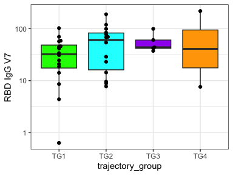

IMPACC Drexel Fig1
================
Slim FOURATI
2025-02-06

Load required packages

``` r
suppressPackageStartupMessages(library(package = "knitr"))
suppressPackageStartupMessages(library(package = "readxl"))
suppressPackageStartupMessages(library(package = "zoo"))
suppressPackageStartupMessages(library(package = "ordinal"))
suppressPackageStartupMessages(library(package = "ggbeeswarm"))
suppressPackageStartupMessages(library(package = "tidyverse"))
```

Set session options

``` r
opts_chunk$set(tidy = FALSE, fig.path = "../figure/")
workDir <- dirname(getwd())
impaccDir <- "/data"
```

Read clinical data

``` r
# clinical data
clinical_individ <- read_csv(file = file.path(impaccDir,
                                              "clinical/current/2023-01-01-locked",
                                              "2023-01-01-impacc-clin-individ-locked.csv"))
clinical_individ_old <- read_csv(file = file.path(impaccDir,
                                                  "clinical/legacy/2021-11-11-frozen",
                                                  "2021-11-11-impacc-clin-individ-frozen.csv"))
clinical_event <- read_csv(file = file.path(impaccDir,
                                            "clinical/current/2023-01-01-locked",
                                            "2023-01-01-impacc-clin-event-locked.csv"))
clinical_sample <- read_csv(file = file.path(impaccDir,
                                             "clinical/current/2023-01-01-locked",
                                             "2023-01-01-impacc-clin-sample-locked.csv"))
clinical_data <- merge(x   = clinical_sample,
                       y   = clinical_event,
                       by  = c("event_id", "participant_id"),
                       all = TRUE) %>%
  merge(y     = select(clinical_individ, 
                       participant_type, 
                       participant_id, 
                       enrollment_site, 
                       admit_age, sex), 
        by    = "participant_id",
        all.x = TRUE) %>%
  merge(y     = distinct(select(clinical_individ_old, participant_id, trajectory_group)),
        by    = "participant_id",
        all.x = TRUE) %>%
  mutate(discretized_admit_age_quantile = case_when(admit_age >= 18 & admit_age <= 35 ~ "[18,35]",
                                                    admit_age >= 36 & admit_age <= 51 ~ "[36,51]",
                                                    admit_age >= 52 & admit_age <= 66 ~ "[52,66]",
                                                    admit_age >= 67 & admit_age <= 81 ~ "[67,81]",
                                                    admit_age >= 82 & admit_age <= 96 ~ "[82,96]"),
         discretized_admit_age_quantile = factor(discretized_admit_age_quantile,
                                                 levels = c("[18,35]", 
                                                            "[36,51]", 
                                                            "[52,66]", 
                                                            "[67,81]", 
                                                            "[82,96]")))
```

Read site-specific data

``` r
inputFile <- file.path(workDir,
                       "input",
                       "2024_11_01.IMPACC..xlsx")
cNames <- read_excel(path = inputFile, n_max = 2, col_names = FALSE) %>%
  as.data.frame()
cNames[1, ] <- na.locf(unlist(cNames[1, ]))
cNames <- apply(cNames, MARGIN = 2, FUN = function(x) paste(setdiff(x, NA), collapse = "."))
outcomeDF <- read_excel(path = inputFile, skip = 2, col_names = cNames) %>%
  mutate(`Patient ID` = gsub(pattern = "3-0", replacement = "3-00", `Patient ID`))

visit7DF <- read_excel(path = inputFile, sheet = 2) %>%
  mutate(`Patient ID` = gsub(pattern = "3-0", replacement = "3-00", `Patient ID`))
```

Extract Flow cytometry from site specific data

``` r
fcmDF <- outcomeDF %>%
  select(`Patient ID`, contains(match = "Acute"))
```

Calculate IgG decay (t0.5)

``` r
# plot IgG
iggDF <- outcomeDF %>%
  select(`Patient ID`, contains(match = "RBD IgG")) %>%
  pivot_longer(cols= -`Patient ID`, names_to = "event_type", values_to = "IgG") %>%
  mutate(event_type = gsub(pattern = "RBD IgG V", replacement = "Visit ", event_type)) %>%
  merge(y = distinct(select(clinical_data, participant_id, event_type, event_date)),
        by.x = c("Patient ID", "event_type"),
        by.y = c("participant_id", "event_type")) %>%
  filter(!is.na(IgG))

#ggplot(data = iggDF,
#       mapping = aes(x = event_date, y = IgG)) +
#  geom_line(mapping = aes(group = `Patient ID`)) +
#  geom_point() +
#  scale_y_log10() +
#  theme_bw()

# append vax info
vaxDF <- clinical_data %>%
  filter(event_type %in% "Visit 10") %>%
  select(participant_id, event_date) %>%
  distinct() %>%
  merge(x = outcomeDF,
        by.x = "Patient ID",
        by.y = "participant_id") %>%
  select(`Patient ID`,
         `days since vaccination\r\n(at V10)`,
         `Vaccinated\r\n(At V10)`,
         event_date) %>%
  mutate(vax_date = event_date - `days since vaccination\r\n(at V10)`)

#merge(x = iggDF,
#      y = select(vaxDF, -event_date),
#      by = "Patient ID") %>%
#ggplot(mapping = aes(x = event_date, y = IgG)) +
#  geom_line(mapping = aes(group = `Patient ID`)) +
#  geom_point(mapping = aes(color = event_date > vax_date)) +
#  scale_y_log10() +
#  facet_wrap(facets = ~`Vaccinated\r\n(At V10)`, labeller = label_both) +
#  theme_bw() + 
#  theme(legend.position = "bottom")

# unvax + event_date before vax
unvaxDF <- merge(x = iggDF,
      y = select(vaxDF, -event_date),
      by = "Patient ID") %>%
  filter(`Vaccinated\r\n(At V10)` %in% "no" | event_date < vax_date) %>%
  filter(duplicated(`Patient ID`) | duplicated(`Patient ID`, fromLast = TRUE))

#ggplot(data = unvaxDF, 
#       mapping = aes(x = event_date, y = IgG)) +
#  geom_line(mapping = aes(group = `Patient ID`)) +
#  geom_point() +
#  scale_y_log10() +
#  facet_wrap(facets = ~`Patient ID`) +
#  theme_bw()

#unvaxDF <- unvaxDF %>%
#  filter(!(`Patient ID` %in% c("003-0010", "003-0059", "003-0072", "003-2007"))) %>%
#  filter(!(`Patient ID` %in% c("003-0054", "003-0078", "003-0086", "003-2008")))
#ggplot(data = unvaxDF, 
#       mapping = aes(x = event_date, y = IgG)) +
#  geom_line(mapping = aes(group = `Patient ID`)) +
#  geom_point() +
#  scale_y_log10() +
#  facet_wrap(facets = ~`Patient ID`) +
#  theme_bw()

t0.5DF <- unvaxDF %>%
  select(`Patient ID`, event_date, IgG) %>%
  group_by(`Patient ID`) %>%
  summarize(pt   = min(IgG),
            p0   = max(IgG),
            t    = max(event_date) - min(event_date),
            k    =  log(pt/p0)/t,
            t0.5 =  log(0.5)/k)

regDF <- unvaxDF %>%
  group_by(`Patient ID`) %>%
  do(event_date = seq(from = min(.$event_date), max(.$event_date))) %>%
  unnest(cols = event_date) %>%
  merge(y = t0.5DF, by = "Patient ID") %>%
  group_by(`Patient ID`) %>%
  mutate(IgG = p0 * exp(k * (event_date-min(event_date))))

#ggplot(data = unvaxDF, mapping = aes(x = event_date, y = IgG)) +
#  geom_point() +
#  facet_wrap(facets = ~`Patient ID`, scale = "free_y") +
#  geom_line(data = regDF, mapping = aes(group = `Patient ID`, color = t0.5)) +
#  scale_color_gradient(low = "orange", high = "red") +
#  theme_bw()
```

``` r
# plot neut
neutDF <- outcomeDF[, c(1, seq(from = which(names(outcomeDF) %in% "V1.Wuhan"), to = ncol(outcomeDF)))]
  
neutDF <- neutDF %>%
  pivot_longer(cols= -`Patient ID`, 
               names_to = c("event_type", "strain"), 
               names_sep = "\\.",
               values_to = "Titer") %>%
  #pivot_wider(names_from = "strain", values_from = "Titer") %>%
  mutate(event_type = gsub(pattern = "^V", replacement = "Visit ", event_type)) %>%
  merge(y = distinct(select(clinical_data, participant_id, event_type, event_date)),
        by.x = c("Patient ID", "event_type"),
        by.y = c("participant_id", "event_type")) %>%
  mutate(strain = factor(strain, levels = c("Wuhan", 
                                            "UK",
                                            "SA")))
#ggplot(data = neutDF,
#       mapping = aes(x = event_date, y = Titer)) +
#  geom_line(mapping = aes(group = `Patient ID`)) +
#  geom_point() +
#  scale_y_log10() +
#  facet_grid(rows = ~strain) +
#  theme_bw()

# append vax info
vaxDF <- clinical_data %>%
  filter(event_type %in% "Visit 10") %>%
  select(participant_id, event_date) %>%
  distinct() %>%
  merge(x = outcomeDF,
        by.x = "Patient ID",
        by.y = "participant_id") %>%
  select(`Patient ID`,
         `days since vaccination\r\n(at V10)`,
         `Vaccinated\r\n(At V10)`,
         event_date) %>%
  mutate(vax_date = event_date - `days since vaccination\r\n(at V10)`)

#merge(x = neutDF,
#      y = select(vaxDF, -event_date),
#      by = "Patient ID") %>%
#ggplot(mapping = aes(x = event_date, y = Titer)) +
#  geom_line(mapping = aes(group = `Patient ID`)) +
#  geom_point(mapping = aes(color = event_date > vax_date)) +
#  scale_y_log10() +
#  facet_wrap(facets = strain~`Vaccinated\r\n(At V10)`, labeller = label_both) +
# theme_bw()

# unvax + event_date before vax
unvaxDF <- merge(x = neutDF,
      y = select(vaxDF, -event_date),
      by = "Patient ID") %>%
  filter(`Vaccinated\r\n(At V10)` %in% "no" | event_date < vax_date) %>%
  filter(duplicated(`Patient ID`) | duplicated(`Patient ID`, fromLast = TRUE))

#ggplot(data = filter(unvaxDF, strain %in% "Wuhan" & !is.na(Titer)), 
#       mapping = aes(x = event_date, y = Titer)) +
#  geom_line(mapping = aes(group = `Patient ID`)) +
#  geom_point() +
#  scale_y_log10() +
#  facet_wrap(facets = ~`Patient ID`) +
#  theme_bw()

#unvaxDF <- unvaxDF %>%
#  filter(!(`Patient ID` %in% c("003-0050", "003-0084", "003-0088", "003-2004",  "003-2001",
#                               "003-2010"))) %>%
#  filter(!(`Patient ID` %in% c("003-0054", "003-0059", "003-2003") & event_date > 200)) %>%
#  filter(!(`Patient ID` %in% c("003-0063", "003-0072", "003-0078", "003-0086", "003-2008") & 
#             event_date > 100)) %>%
#  filter(!(`Patient ID` %in% c("003-0089", "003-2007") &  event_date > 150))
#ggplot(data = filter(unvaxDF, !is.na(Titer)), 
#       mapping = aes(x = event_date, y = Titer)) +
#  geom_line(mapping = aes(group = interaction(`Patient ID`, strain, drop = TRUE), color = strain)) +
#  geom_point() +
#  scale_y_log10() +
#  facet_wrap(facets = ~`Patient ID`) +
#  theme_bw()

nt0.5DF <- unvaxDF %>%
  select(`Patient ID`, event_date, strain, Titer) %>%
  group_by(`Patient ID`, strain) %>%
  summarize(pt   = min(Titer),
            p0   = max(Titer),
            t    = max(event_date) - min(event_date),
            k    =  log(pt/p0)/t,
            t0.5 =  log(0.5)/k,
            .groups = "drop")

regDF <- unvaxDF %>%
  group_by(`Patient ID`, strain) %>%
  do(event_date = seq(from = min(.$event_date), max(.$event_date))) %>%
  unnest(cols = event_date) %>%
  merge(y = nt0.5DF, by = c("Patient ID", "strain")) %>%
  group_by(`Patient ID`, strain) %>%
  mutate(Titer = p0 * exp(k * (event_date-min(event_date))))

#ggplot(data = filter(unvaxDF, `Patient ID` %in% nt0.5DF$`Patient ID`[complete.cases(nt0.5DF)]),
#       mapping = aes(x = event_date, y = Titer)) +
#  geom_point(mapping = aes(shape = strain)) +
#  facet_wrap(facets = ~`Patient ID`, scale = "free_y") +
#  geom_line(data = filter(regDF, `Patient ID` %in% nt0.5DF$`Patient ID`[complete.cases(nt0.5DF)]), 
#            mapping = aes(group = interaction(`Patient ID`, strain, drop = TRUE), 
#                                        color = t0.5,
#                                        linetype = strain)) +
#  scale_color_gradient(low = "orange", high = "red") +
#  theme_bw()
```

# Ordinal regression with trajectory group

``` r
ordinalDF <- data.frame()
# RBD IgG V7
inputDF <- select(clinical_data, participant_id, trajectory_group) %>%
  distinct() %>%
  merge(y = select(outcomeDF, `Patient ID`, `RBD IgG V7`),
        by.x = "participant_id",
        by.y = "Patient ID") %>%
  mutate(trajectory_group = factor(trajectory_group)) %>%
  setNames(nm = make.names(names(.)))
fullModel <- clm(trajectory_group ~ log10(RBD.IgG.V7), data = inputDF) 
coefMat <- coef(summary(fullModel))
ordinalDF <- rbind(ordinalDF, c(feature = "RBD IgG V7", coefMat[nrow(coefMat), ])) %>%
  setNames(nm = c("feature", colnames(coefMat)))

# mem B cell V10
inputDF <- select(clinical_data, participant_id, trajectory_group) %>%
  distinct() %>%
  merge(y = select(outcomeDF, `Patient ID`, `Memory B cell \r\nV10`),
        by.x = "participant_id",
        by.y = "Patient ID") %>%
  mutate(trajectory_group = factor(trajectory_group)) %>%
  setNames(nm = make.names(names(.)))
fullModel <- clm(trajectory_group ~ Memory.B.cell...V10, data = inputDF)
coefMat <- coef(summary(fullModel))
ordinalDF <- rbind(ordinalDF, c(feature = "Memory B cell V10", coefMat[nrow(coefMat), ]))

# tfh V10
inputDF <- select(clinical_data, participant_id, trajectory_group) %>%
  distinct() %>%
  merge(y = select(outcomeDF, 
                   `Patient ID`, 
                   `CD4\r\nCD137+sCD40L+\r\nV10`, 
                   `CD45RA-\r\nCD137+sCD40L+\r\nV10`),
        by.x = "participant_id",
        by.y = "Patient ID") %>%
  mutate(trajectory_group = factor(trajectory_group)) %>%
  setNames(nm = make.names(names(.)))
fullModel <- clm(trajectory_group ~ CD4..CD137.sCD40L...V10, data = inputDF)
coefMat <- coef(summary(fullModel))
ordinalDF <- rbind(ordinalDF, c(feature = "CD4 CD137+sCD40L+ V10", coefMat[nrow(coefMat), ]))
fullModel <- clm(trajectory_group ~ CD45RA...CD137.sCD40L...V10, data = inputDF)
coefMat <- coef(summary(fullModel))
ordinalDF <- rbind(ordinalDF, c(feature = "CD45RA- CD137+sCD40L+ V10", coefMat[nrow(coefMat), ]))

# V7 Wuhan
inputDF <- select(clinical_data, participant_id, trajectory_group) %>%
  distinct() %>%
  merge(y = select(outcomeDF, `Patient ID`, `V7.Wuhan`, `V7.UK`, `V7.SA`),
        by.x = "participant_id",
        by.y = "Patient ID") %>%
  mutate(trajectory_group = factor(trajectory_group)) %>%
  setNames(nm = make.names(names(.)))
fullModel <- clm(trajectory_group ~ log10(V7.Wuhan), data = inputDF)
coefMat <- coef(summary(fullModel))
ordinalDF <- rbind(ordinalDF, c(feature = "V7.Wuhan", coefMat[nrow(coefMat), ]))

# t0.5
inputDF <- select(clinical_data, participant_id, trajectory_group) %>%
  distinct() %>%
  merge(y = select(t0.5DF, `Patient ID`, `t0.5`),
        by.x = "participant_id",
        by.y = "Patient ID") %>%
  mutate(trajectory_group = factor(trajectory_group)) %>%
  setNames(nm = make.names(names(.)))
fullModel <- clm(trajectory_group ~ log10(t0.5), data = inputDF)
coefMat <- coef(summary(fullModel))
ordinalDF <- rbind(ordinalDF, c(feature = "t0.5", coefMat[nrow(coefMat), ]))

# nt0.5
inputDF <- select(clinical_data, participant_id, trajectory_group) %>%
  distinct() %>%
  merge(y = select(nt0.5DF, `Patient ID`, strain, `t0.5`),
        by.x = "participant_id",
        by.y = "Patient ID") %>%
  mutate(trajectory_group = factor(trajectory_group)) %>%
  setNames(nm = make.names(names(.)))
fullModel <- clm(trajectory_group ~ log10(t0.5), data = inputDF)
coefMat <- coef(summary(fullModel))
ordinalDF <- rbind(ordinalDF, c(feature = "nt0.5", coefMat[nrow(coefMat), ]))

ordinalDF %>%
  mutate_at(setdiff(colnames(ordinalDF), "feature"), as.numeric) %>% 
  mutate_if(is.numeric, signif, digits = 3) %>%
  kable()
```

| feature                   | Estimate | Std. Error | z value | Pr(\>\|z\|) |
|:--------------------------|---------:|-----------:|--------:|------------:|
| RBD IgG V7                |    1.150 |      0.718 |  1.6100 |       0.108 |
| Memory B cell V10         |   -0.162 |      0.374 | -0.4320 |       0.666 |
| CD4 CD137+sCD40L+ V10     |   -0.128 |      4.880 | -0.0261 |       0.979 |
| CD45RA- CD137+sCD40L+ V10 |   -2.360 |      2.880 | -0.8200 |       0.412 |
| V7.Wuhan                  |    0.937 |      0.586 |  1.6000 |       0.110 |
| t0.5                      |    0.676 |      1.040 |  0.6490 |       0.516 |
| nt0.5                     |    0.660 |      0.745 |  0.8860 |       0.375 |

Boxplot RBD IgG V7 and trajectory group

``` r
inputDF <- select(clinical_data, participant_id, trajectory_group) %>%
  distinct() %>%
  merge(y = select(outcomeDF, `Patient ID`, `RBD IgG V7`),
        by.x = "participant_id",
        by.y = "Patient ID") %>%
  mutate(trajectory_group = factor(paste0("TG", trajectory_group))) %>%
  setNames(nm = make.names(names(.)))

ggplot(data = inputDF,
       mapping = aes(x = trajectory_group, y = RBD.IgG.V7)) +
  geom_boxplot(mapping = aes(fill = trajectory_group)) +
  geom_beeswarm() +
  scale_y_log10() +
  scale_fill_manual(values = c("TG1" = "green", TG2 = "cyan", TG3 = "purple", TG4 = "orange")) +
  labs(y = "RBD IgG V7") +
  theme_bw() +
  theme(legend.position = "none")
```



Session info

``` r
sessionInfo()
```

    ## R version 4.4.2 (2024-10-31)
    ## Platform: aarch64-apple-darwin23.6.0
    ## Running under: macOS Sequoia 15.3
    ## 
    ## Matrix products: default
    ## BLAS:   /opt/homebrew/Cellar/openblas/0.3.29/lib/libopenblasp-r0.3.29.dylib 
    ## LAPACK: /opt/homebrew/Cellar/r/4.4.2_2/lib/R/lib/libRlapack.dylib;  LAPACK version 3.12.0
    ## 
    ## locale:
    ## [1] en_US.UTF-8/en_US.UTF-8/en_US.UTF-8/C/en_US.UTF-8/en_US.UTF-8
    ## 
    ## time zone: America/Chicago
    ## tzcode source: internal
    ## 
    ## attached base packages:
    ## [1] stats     graphics  grDevices utils     datasets  methods   base     
    ## 
    ## other attached packages:
    ##  [1] lubridate_1.9.3     forcats_1.0.0       stringr_1.5.1      
    ##  [4] dplyr_1.1.4         purrr_1.0.2         readr_2.1.5        
    ##  [7] tidyr_1.3.1         tibble_3.2.1        tidyverse_2.0.0    
    ## [10] ggbeeswarm_0.7.2    ggplot2_3.5.1       ordinal_2023.12-4.1
    ## [13] zoo_1.8-12          readxl_1.4.3        knitr_1.48         
    ## 
    ## loaded via a namespace (and not attached):
    ##  [1] utf8_1.2.4          generics_0.1.3      stringi_1.8.4      
    ##  [4] lattice_0.22-6      hms_1.1.3           digest_0.6.36      
    ##  [7] magrittr_2.0.3      timechange_0.3.0    evaluate_0.24.0    
    ## [10] grid_4.4.2          fastmap_1.2.0       cellranger_1.1.0   
    ## [13] Matrix_1.7-1        fansi_1.0.6         scales_1.3.0       
    ## [16] numDeriv_2016.8-1.1 cli_3.6.3           crayon_1.5.3       
    ## [19] rlang_1.1.4         bit64_4.0.5         munsell_0.5.1      
    ## [22] withr_3.0.1         yaml_2.3.10         parallel_4.4.2     
    ## [25] tools_4.4.2         ucminf_1.2.2        tzdb_0.4.0         
    ## [28] colorspace_2.1-1    vctrs_0.6.5         R6_2.5.1           
    ## [31] lifecycle_1.0.4     bit_4.0.5           vroom_1.6.5        
    ## [34] vipor_0.4.7         MASS_7.3-61         pkgconfig_2.0.3    
    ## [37] beeswarm_0.4.0      pillar_1.9.0        gtable_0.3.5       
    ## [40] glue_1.7.0          highr_0.11          xfun_0.46          
    ## [43] tidyselect_1.2.1    rstudioapi_0.16.0   farver_2.1.2       
    ## [46] htmltools_0.5.8.1   nlme_3.1-166        rmarkdown_2.27     
    ## [49] compiler_4.4.2
